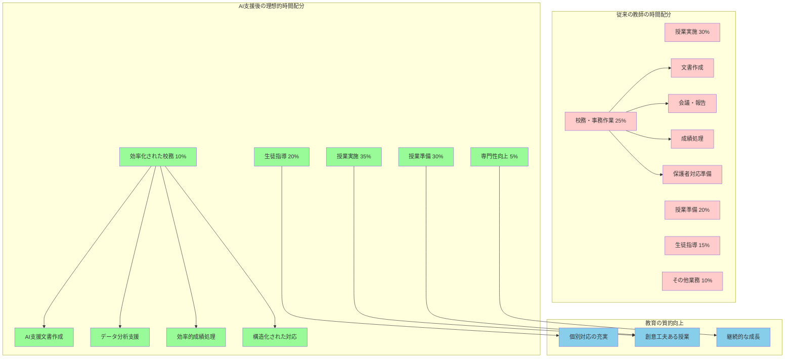
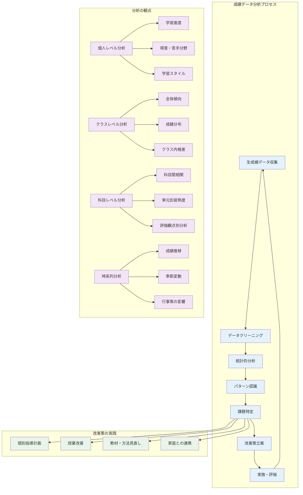

# 教育の本質を支える効率的な業務管理

現代の教育現場において、教師は授業や生徒指導といった本来の教育活動に加え、膨大な事務作業や管理業務を担っている。

**教師が抱える主要な校務**
- **文書作成**: 行事案内、学級通信、報告書の作成
- **成績処理**: 評価コメント、所見作成、データ分析
- **保護者対応**: 面談準備、連絡調整、記録作成
- **各種報告書**: 教育活動の記録、評価、計画策定

**現在の課題と生成AIの可能性**
これらの業務は教育活動に不可欠でありながら、多くの時間と労力を要するため、教師が生徒と直接関わる時間や授業準備の充実を阻む要因となっている。生成AIの活用は、これらの校務を効率化し、教師が教育の本質により多くの時間を割けるようにする革新的な手段を提供する。

**校務改革の重要な視点**

重要なのは、単なる作業時間の短縮ではなく、業務の質を維持・向上させながら効率化を実現することである。

**生成AI活用の具体的成果**
- **質の高い文書作成**: 教育的配慮を含んだ内容の効率的作成
- **個別化されたフィードバック**: 生徒一人ひとりに応じた評価コメント
- **専門性を活かした判断力**: 教育者としての専門的判断の強化

生成AIを活用した校務改革は、機械的な作業の自動化に留まらず、教育活動の質的向上を実現する。

**校務効率化がもたらす教育の質的向上**

このような校務の効率化により、教師は以下のような教育活動により多くの時間を投資できるようになる。

- **個別対話の充実**: 生徒一人ひとりとの深いコミュニケーション
- **創意工夫ある授業準備**: 革新的で魅力的な授業の設計
- **継続的な専門性向上**: 教育研究やスキルアップへの取り組み

**生成AIの教育的位置づけ**
生成AIは、教育の質を向上させるための時間的・精神的余裕を創出する重要なツールとして位置づけられる。



## 文書作成の効率化と質的向上

### 保護者向け文書の戦略的作成

**保護者との信頼関係構築の重要性**

保護者向け文書の作成は、学校と家庭の円滑なコミュニケーションを実現する重要な業務である。

**保護者向け文書の主要な種類**
- **行事案内**: 学校行事の詳細、日程、参加方法
- **学習進度報告**: 教育活動の成果と生徒の成長状況
- **生活指導連絡**: 学校生活での注意事項や支援要請
- **個別連絡**: 学習面や行動面での個別的な情報共有

**生成AI活用の効果**
これらの文書は教育活動の成果を保護者に適切に伝え、家庭との協力関係を構築する役割を担っている。生成AIの活用により、これらの文書作成を効率化しながら、同時に内容の質と配慮の深さを向上させることができる。

**お知らせ文書の戦略的作成**

お知らせ文書の作成においては、保護者の立場に立った分かりやすい表現での伝達が重要である。

**生成AI活用の具体的効果**
- **基本情報の構造化**: 日時、場所、持参物、注意事項の漏れのない整理
- **受け手目線の表現**: 保護者が求める情報の優先順位に基づいた構成
- **包括的な配慮**: 感染対策、個別事情への配慮を含む内容設計

**実践例：文化祭案内文書の作成**
```
プロンプト例：
「11月15日の文化祭について、保護者向けの案内文書を作成してください。
参観時間、駐車場の制限、感染対策、生徒の発表内容への配慮を含め、
温かみのある表現を心がけてください」
```

**成果**: 包括的で配慮深い案内文書を効率的に作成可能

**個別連絡文の配慮深い作成**

デリケートな内容を扱う個別連絡文では、保護者との信頼関係を保持しつつ建設的な協力を促進する表現が求められる。

**配慮を要する主要な内容**
- **学習面での課題**: 成績低下、理解度の遅れ、学習意欲の減退
- **行動面での課題**: 授業態度、友人関係、規則違反
- **健康面での配慮**: 体調不良、心理的不安、発達特性への対応

**生成AIによる文書構成の最適化**
- **客観的状況説明**: 事実に基づく冷静な現状分析
- **具体的改善提案**: 実行可能で効果的な対応策の提示
- **学校支援体制**: 教師・学校としての具体的支援内容
- **協力依頼**: 家庭での協力方法の明確な提案

**学級通信・進路情報の継続的発信**

定期的な情報発信により保護者との継続的なコミュニケーションを実現する。

**学級通信の主要構成要素**
- **学級近況報告**: 生徒の成長と学級の雰囲気
- **学習活動紹介**: 授業での取り組みと成果
- **家庭支援提案**: 家庭でできる具体的な協力方法
- **教育的メッセージ**: 教師の教育観と生徒への思いの表現

**進路情報の効果的構成**
- **最新制度情報**: 入試制度改革や大学情報の整理
- **進路選択指針**: 各進路の特徴と選択基準
- **準備スケジュール**: 時期に応じた具体的な準備事項

**重要な作成方針**
単なる事実の羅列ではなく、教師の教育観や生徒への思いが伝わる人間味のある文書作成が不可欠である。

**多言語対応による包括的コミュニケーション**

外国籍保護者への配慮として、重要文書の多言語版作成を支援する。

**生成AIによる多言語対応の特徴**
- **原文意図の保持**: 教育的メッセージの正確な伝達
- **文化的配慮**: 文化的背景の違いを考慮した表現調整
- **読みやすさ重視**: 対象言語での自然な表現

**多言語対応の重要な留意点**
- **機械翻訳の限界認識**: 完全な翻訳の困難性への理解
- **専門的確認の必要性**: 重要内容の専門家チェック
- **文化的感受性**: 各文化圏での教育観の違いへの配慮

### 校内文書・報告書の体系的作成

**校内文書・報告書作成の体系的アプローチ**

校内文書や各種報告書の作成は、学校運営の基盤となる重要な業務である。

**文書の多様な目的と対象**
- **教育活動の記録**: 授業実践、生徒指導、学校行事の記録
- **改善計画の策定**: 教育課程、指導方法、運営体制の改善
- **外部機関への報告**: 教育委員会、文部科学省、評価機関への提出
- **内部情報共有**: 職員会議、研修、引き継ぎ資料

**生成AI活用による改善効果**
- **作業効率化**: 文書作成時間の大幅短縮
- **内容一貫性**: 統一された品質と表現の維持
- **質的向上**: 構造化された分かりやすい文書構成

**職員会議資料の効率的準備**

職員会議資料の準備においては、参加者が効率的に議論できる資料構成が重要である。

**主要な準備要素**
- **議題の体系的整理**: 優先度と関連性に基づいた構成
- **背景情報の精選**: 必要不可欠な情報の明確な提示
- **具体的提案事項**: 実行可能な改善策の明確化

**生成AIによる資料構成の最適化**
散在する情報を構造化し、議論の効率性を高める資料形式を提案する。

**実践例：カリキュラム改訂資料**
```
プロンプト例：
「来年度のカリキュラム改訂について職員会議で討議するための資料を作成してください。
現行カリキュラムの課題、文科省の新指導要領の要点、他校の取り組み事例、
本校での実施案を含めて構成してください」
```

**成果**: 包括的で構造化された会議資料の効率的作成

**学校評価・自己点検報告書の総合的構成**

客観的データ分析と主観的評価の適切な組み合わせが重要である。

**生成AIによる包括的支援**
- **数値データ分析**: 統計情報の傾向把握と意味の抽出
- **成果と課題の体系化**: 教育活動の包括的評価と整理
- **改善策の具体化**: 実行可能な改善方針の提案
- **ステークホルダー対応**: 外部評価者や保護者に向けた理解しやすい構成

**報告書の核心要素**
- **定量的成果**: 数値データに基づく客観的評価
- **定性的成果**: 教育的価値や成長面の記述
- **将来方向性**: 明確な改善方向と実施計画

**研修計画・実施報告書の体系的作成**

教師の専門性向上と学校全体の教育力強化を目的とした体系的アプローチが求められる。

**研修計画立案の主要要素**
- **ニーズ分析**: 教師のスキルギャップと学習要望の把握
- **外部情報統合**: 研修機関、大学連携、最新教育情報の活用
- **校内研修企画**: 学校独自の特色を活かした研修プログラム
- **効果的体系構築**: 継続性と連続性を考慮した研修計画

**生成AIによる研修体系最適化**
散在する情報を統合し、学校の実情に応じた効果的な研修体系を提案する。

**実施報告書の構成要素**
- **参加者の反応**: 研修の満足度と学習効果の評価
- **知識・技能の習得**: 具体的なスキル向上領域の明確化
- **実践活用予定**: 研修成果の教育現場での応用計画
- **継続学習**: 今後の研修ニーズとフォローアップ方針

**要約・箇条書きの戦略的活用**

読み手の立場と目的に応じた情報の構造化が核心となる。

**情報構造化の主要方針**
- **要点抽出**: 長文文書からの核心情報特定
- **階層的整理**: 情報の重要度と関連性に基づく構造化
- **可読性最適化**: 短時間で内容把握可能なフォーマット

**ターゲット別最適化**
- **管理職向け**: 意思決定に必要な情報を優先表示
- **同僚教師向け**: 実務に直結する具体的情報を中心構成
- **外部報告用**: 公式性と網羅性を重視した包括的構成

**優先順位付けの原則**
- **緊急性**: 早急な対応が必要な項目
- **影響度**: 教育活動や学校運営へのインパクト
- **関連性**: 読み手の業務や責任領域との直接的関連

### 進路指導関連文書の専門的作成

進路指導に関わる文書作成は、生徒の将来に直接影響を与える重要な業務です。進路指導計画書、推薦書、調査書、説明会資料など、これらの文書は生徒の可能性を最大限に引き出し、適切な進路選択を支援するための重要なツールです。生成AIの活用により、これらの文書の質と効率性を向上させることができます。

進路指導計画書の作成では、生徒の発達段階に応じた系統的な指導計画を策定することが重要です。1年生での自己理解から3年生での具体的な進路選択まで、段階的で一貫した指導プログラムの設計が求められます。生成AIは、進路指導の理論的基盤、各学年での指導目標、具体的な活動内容、評価方法を統合した包括的な計画書作成を支援します。例えば、「高校3年間の進路指導計画書を作成してください。キャリア発達理論に基づき、各学年の発達課題に応じた指導内容と、大学入試制度改革に対応した指導方法を含めてください」といった依頼により、理論と実践が統合された計画書を作成できます。

推薦書や調査書の下書き支援においては、生徒一人ひとりの特性や成長を的確に表現し、進路先での成功可能性を説得力を持って示すことが重要です。生成AIは、生徒の学習記録、課外活動の実績、人物評価に関する情報を統合し、バランスの取れた人物像を描く文書構成を提案します。ただし、最終的な内容の確認と調整は、生徒を直接指導してきた教師の責任において行われるべきものです。

**進路説明会資料の効果的構成**

生徒と保護者が進路選択に必要な情報を効果的に習得できるよう、複雑な制度や手続きの分かりやすい整理が重要である。

**主要な情報領域の構造化**
- **大学入試制度**: 入試方法、スケジュール、対策方法
- **就職活動の流れ**: 時期別準備事項、必要な手続き
- **奨学金制度**: 種類、申請方法、返済条件
- **各進路の特徴**: メリット、デメリット、適性判断基準

**生成AIによるニーズ別最適化**
- **対象者特性**: 学年、進路希望、理解レベルに応じた内容調整
- **情報優先度**: 重要度と緊急性に基づく情報配置
- **理解促進**: 複雑な情報の段階的説明

**視覚的理解と双方向コミュニケーション支援**
- **図表・チャート**: 複雑な情報の視覚化
- **タイムライン**: 準備スケジュールの明確化
- **Q&A準備**: 予想される質問と的確な回答例
- **チェックリスト**: 必要手続きの漏れ防止

**個別進路相談記録の体系的管理**

生徒との面談内容を継続的に記録し、一貫した指導を実現することが重要である。

**面談記録の主要構成要素**
- **話し合い内容**: 具体的な相談テーマと討論内容
- **生徒の関心事項**: 進路希望、価値観、不安要素
- **課題となる点**: 進路選択上の障壁や解決すべき問題
- **取り組み事項**: 次回までの具体的アクションプラン

**生成AIによる記録の構造化**
- **面談内容の体系化**: 重要ポイントの明確な整理
- **長期計画との連携**: 全体指導プログラムとの関連付け
- **継続性確保**: 担任者変更時の情報引き継ぎ体制

**継続性と一貫性の保持**
担任教師の異動があっても継続的で一貫した進路指導が可能になり、生徒の進路実現を安定的に支援できる体制を構築する。

## 成績処理・評価コメントの作成

### 所見・評価コメントの個別化と質的向上

成績処理と評価コメントの作成は、生徒の学習成果を適切に評価し、今後の学習への動機づけを行う重要な教育活動です。従来の評価コメントは、限られた時間の中で多数の生徒について作成する必要があるため、画一的で表面的な内容になりがちでした。生成AIの活用により、生徒一人ひとりの特性に応じた個別化されたコメントを効率的に作成し、同時に評価の質を向上させることができます。

生徒の特性に応じた文案作成では、学習データ、授業での観察記録、提出物の分析結果などを総合的に考慮し、各生徒の学習状況を的確に把握したコメントを作成します。生成AIは、数値データだけでは表現できない生徒の努力過程、学習に対する姿勢、成長の兆し、個性的な強みなどを文章化し、保護者にも理解しやすい表現で整理します。

例えば、数学の成績が平均を下回っている生徒について、「田中さんは計算問題では確実性が向上しており、特に基礎的な四則演算において正確性が著しく高まりました。応用問題への取り組みでは、最初は戸惑いを見せることもありますが、段階的に考えを整理し、粘り強く解決に向かう姿勢が見られます。今後は、解法パターンの理解を深めることで、より自信を持って取り組めるようになると期待されます」といった具体的で建設的なコメントを作成できます。

肯定的な表現への変換は、生徒の自己効力感を向上させ、学習への動機づけを維持する重要な要素です。生成AIは、課題や改善点を指摘する際も、生徒の努力や成長を認める表現を組み合わせ、前向きな気持ちで学習に取り組めるようなコメントを提案します。批判的な表現を避け、成長の可能性に焦点を当てた表現により、生徒の学習意欲を促進します。

具体的な改善提案の作成では、抽象的なアドバイスではなく、生徒が実際に取り組むことができる具体的な行動指針を示すことが重要です。生成AIは、生徒の現在の学習状況と目標達成に必要な要素を分析し、段階的で実現可能な改善策を提案します。「毎日10分の計算練習」「公式を覚える前に意味を理解する」「分からない問題は授業後に質問する」など、具体的で実行しやすい改善策により、生徒の主体的な学習を促進します。

### 成績データの分析と教育的活用

成績データの分析は、個々の生徒の学習状況把握だけでなく、教育活動全体の改善にも重要な情報を提供します。生成AIを活用することで、膨大な成績データから意味のある傾向やパターンを効率的に抽出し、教育的な洞察を得ることができます。

傾向分析の支援では、クラス全体の学習状況、科目間の相関関係、時系列での変化パターンなどを可視化し、客観的なデータに基づいた指導改善を可能にします。例えば、「1学期から2学期にかけて数学の成績が全体的に低下している」「英語のリスニング分野で特に課題が見られる」「理系科目と文系科目の成績格差が拡大している」といった傾向を特定し、その背景にある要因を分析します。

課題の可視化では、データから浮かび上がる学習上の問題点を明確に整理し、優先順位をつけて対応策を検討できるようにします。生成AIは、成績分布、正答率の低い問題領域、学習時間と成果の関係などを分析し、最も効果的な指導改善点を特定します。これにより、限られた時間と資源を最も効果的に活用できる領域に集中して取り組むことができます。



改善策の提案では、データ分析の結果に基づいた具体的で実現可能な対応策を立案します。生成AIは、過去の類似事例、教育研究の知見、学校の実情を総合的に考慮し、効果的な改善方法を提案します。個別指導の充実、授業方法の見直し、教材の改善、家庭学習の支援強化など、多角的なアプローチを含む包括的な改善計画を策定できます。

重要なのは、データ分析の結果を機械的に適用するのではなく、教師の教育的判断と組み合わせて活用することです。数値では表現できない生徒の情意面や社会的背景、個別の事情なども考慮し、真に生徒のためになる改善策を選択・実施することが求められます。

## 保護者対応・生徒指導での活用

### 面談準備と記録作成の体系化

保護者面談は、学校教育と家庭教育の連携を深める重要な機会です。効果的な面談を実現するためには、事前の準備と事後の記録作成が重要な要素となります。生成AIの活用により、これらの業務を効率化し、同時に面談の質を向上させることができます。

面談シナリオの準備では、個々の生徒の状況に応じた話題設定と進行計画が重要です。生成AIは、生徒の学習記録、行動観察記録、前回面談での内容などを総合し、保護者との有意義な対話につながる話題を提案します。学習面での成果と課題、学校生活での様子、友人関係、進路に関する相談、家庭での支援方法など、限られた面談時間を最大限に活用する構成を提案します。

例えば、学習面で課題のある生徒の保護者面談において、「山田さんの保護者面談の準備をお願いします。数学の成績低下、授業への参加姿勢の変化、友人関係での悩みが見られる状況で、保護者の協力を得ながら改善を図りたいと考えています。建設的で前向きな話し合いになるよう、話題の順序と表現方法を提案してください」といった依頼により、配慮深い面談シナリオを作成できます。

話題の整理では、面談で扱うべき内容の優先順位付けと、それぞれの話題に適した表現方法を検討します。生成AIは、緊急性の高い課題から長期的な成長支援まで、話題を体系的に整理し、保護者が理解しやすく、協力的な姿勢を維持できるような構成を提案します。問題点の指摘と改善提案のバランス、生徒の良い面の積極的な評価、具体的な協力依頼の方法などを含む、包括的な面談プランを作成します。

記録の要約作成では、面談での話し合い内容を整理し、今後の指導に活用できる形で保存することが重要です。生成AIは、保護者から得られた情報、合意に至った支援方策、次回までの取り組み計画などを構造化して記録し、継続的な指導に必要な情報を保持します。また、他の教師との情報共有や、後任者への引き継ぎにも活用できる包括的な記録を作成します。

### 生徒指導記録の作成と分析活用

生徒指導に関わる記録の作成と分析は、生徒の健全な成長を支援し、問題行動の予防と早期対応を実現する重要な活動です。生成AIの活用により、これらの記録を効率的に作成し、パターン分析による予防的指導を強化することができます。

指導記録の作成支援では、日常的な観察記録から特別な指導事例まで、様々な場面での生徒の様子を客観的で建設的な表現で記録します。生成AIは、観察事実と主観的解釈を明確に区別し、今後の指導に有用な情報を整理した記録を提案します。問題行動の記録においても、懲罰的な表現を避け、生徒の成長を支援する観点から現状分析と改善方向を示す記録を作成します。

例えば、授業中に他の生徒への迷惑行為が見られた場合、「A君は3時間目の数学授業において、隣の席の生徒との私語が15分間継続し、注意を受けた後も集中が続かない状態でした。最近の行動パターンから、学習内容の理解困難が背景にある可能性が考えられます。個別支援と学習方法の見直しにより、授業参加への意欲向上を図ることが適切と思われます」といった、事実に基づく客観的で建設的な記録を作成できます。

パターン分析では、蓄積された指導記録から、問題行動の傾向、発生しやすい時期や状況、有効だった指導方法などを分析し、予防的な指導計画を立案します。生成AIは、時系列での行動変化、環境要因との関連性、他の生徒との比較分析などを行い、効果的な指導方針を提案します。個人レベルでのパターン把握だけでなく、学級全体や学年全体の傾向分析により、組織的な指導体制の改善にも活用できます。

対応策の検討では、分析結果に基づいた具体的で実現可能な指導方法を提案します。生成AIは、生徒指導の理論的基盤、過去の成功事例、学校の実情を総合し、多角的なアプローチを含む指導計画を作成します。担任教師による個別指導、教科担当者との連携、保護者との協力、外部機関との連携など、包括的な支援体制の構築を支援します。

重要なのは、これらの記録や分析結果を、生徒の人格尊重と成長支援を最優先に活用することです。記録は生徒を管理・統制するためのものではなく、一人ひとりの健全な成長を支援するための貴重な資料として位置づけられるべきです。生成AIは、このような教育的配慮を含んだ記録作成と分析を支援し、真に生徒のためになる指導の実現を可能にします。

生成AIを活用した校務の効率化は、教師が教育の本質により多くの時間とエネルギーを投入できる環境を創出します。文書作成、成績処理、保護者対応といった業務の質を維持・向上させながら効率化を実現することで、教師は生徒一人ひとりとの関わりを深め、創造的で質の高い教育活動に集中することができるようになります。技術の進歩を教育の質向上につなげる、これが生成AI活用の真の価値なのです。