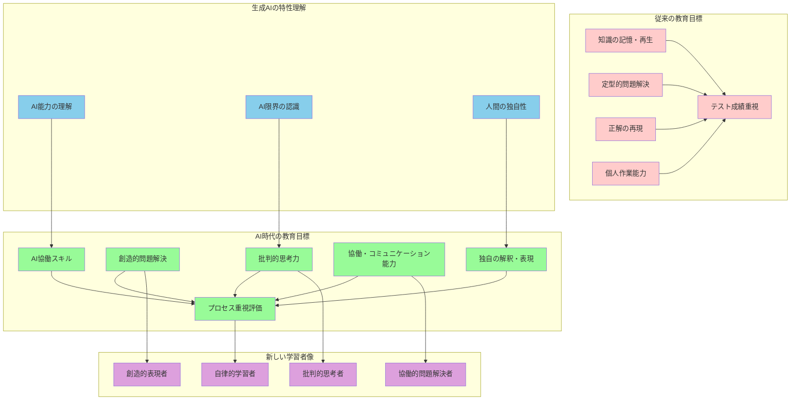
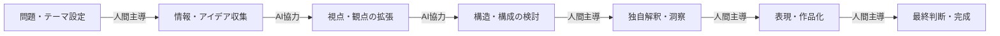
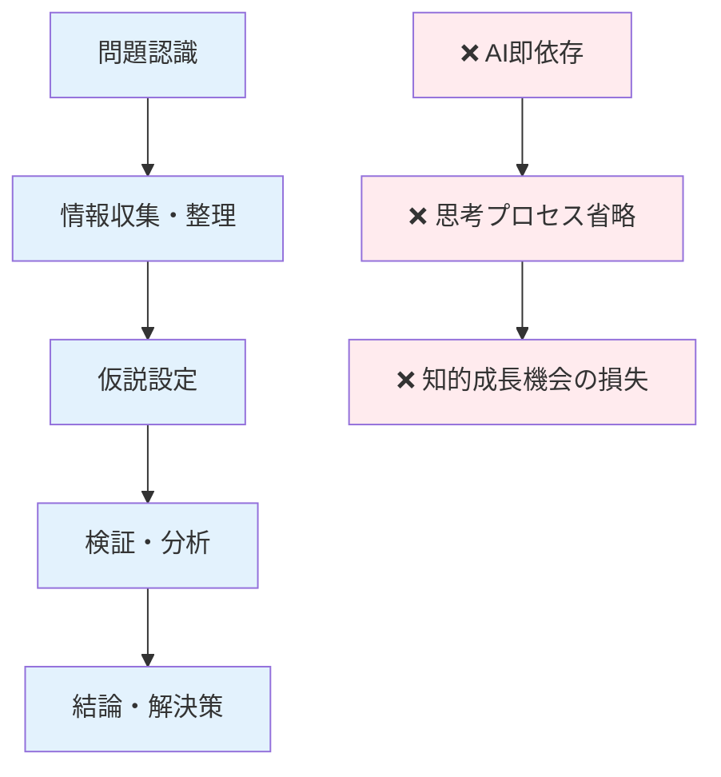
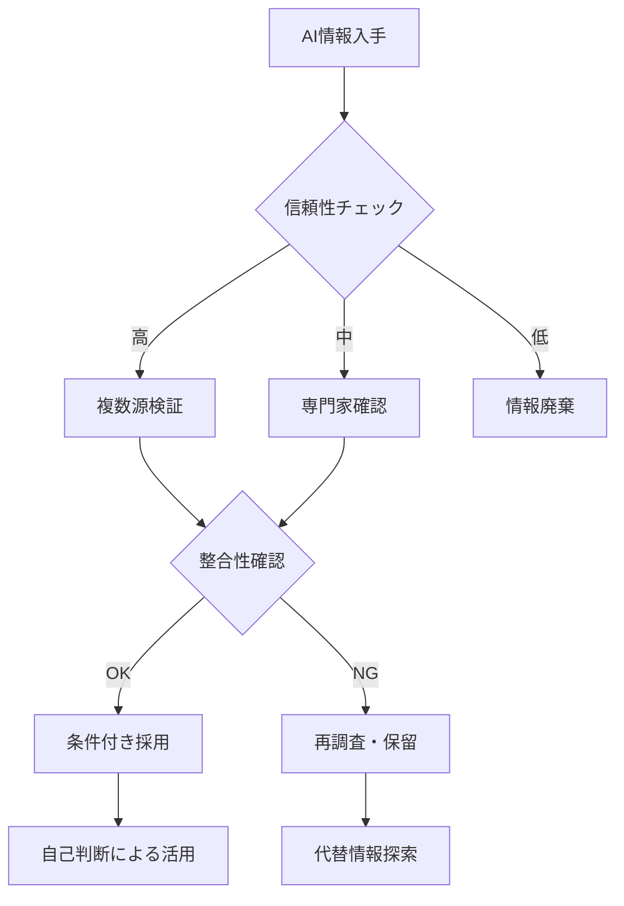
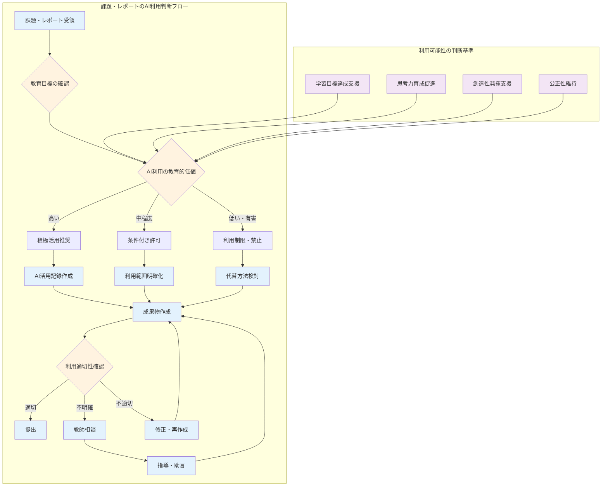

# 自律的学習者としての生徒育成と新時代の評価体系

## この章の目的

**本章の学習目標**
- AI時代に必要な指導方針と評価方法の確立
- 生徒が生成AIと適切に協働できる自律的学習者への育成
- 認知負債のリスク回避と人間らしい思考力の育成
- 創造性を育む具体的な指導手法の習得

:::message
**重要**: 目指すのはAI依存ではなく、AIと対等に協働できる自律的な学習者の育成である。このためには、生徒への適切な指導と新しい評価方法の確立が不可欠である。
:::

**教育のパラダイムシフト**

生成AI技術の急速な普及により、教育現場は根本的な転換期を迎えている。

**将来社会での生徒の学習環境**
- AIと協働しながら社会で活躍することが前提
- 技術と人間の知恵を組み合わせた学習体験
- 継続的な学習と適応能力の重要性

**教師の役割の変化**
- **従来**: 知識の伝達者
- **現在**: 思考力と創造性の開発支援者
- **未来**: AIとの協働を通じた学習促進者

**教育目標の根本的変化**

**従来の教育重点**
- 正確な知識の記憶と再生
- 決まった手順に従った問題解決
- 標準化された回答への導き

**AI時代に求められる新しい能力**
- **批判的思考力**: AIが提供する情報を批判的に検証
- **創造的活用力**: 情報を独自の視点で再構成
- **人間らしい判断力**: 個人的価値観と感性に基づく意思決定
- **協働能力**: AIと人間の強みを組み合わせた問題解決

**統合的能力育成の重要性**

重要なのは、これらの能力を統合的に育成することである。AI時代に求められるスキルは単独で機能するものではなく、相互に関連し合いながら人間らしい判断力と創造性を支える基盤となる。

本章では、生成AIリテラシー教育から課題・レポートでの適切な利用ルール設定、さらには従来の評価方法を超えた新しい評価体系まで、AI時代の教育に必要な包括的な指導方針について詳述する。



## 生徒への生成AIリテラシー教育

### 適切な利用方法の体系的指導

### **生成AIの基本理解**

**基盤的理解の確立**

生成AIリテラシー教育の基盤となるのは、生徒が生成AIの基本的な仕組みと特性を理解し、学習や創造活動において適切に活用できるようになることである。この指導では、単に操作方法を教えるだけでなく、以下の本質的理解を深めることが重要である：

**必須理解項目**
- AIとは何か、どのような仕組みで動作するのか
- どのような能力と限界を持つのか  
- 人間の知的活動とどのように違うのか
- 学習パートナーとしての適切な関係性

**指導すべき基本要素**:
- **技術的理解**: 大量のテキストデータから学習したパターンを基に新しいテキストを生成する仕組み
- **能力の範囲**: 情報整理・要約・文章生成・アイデア提案など、AIが得意とする分野
- **限界の認識**: 創造性・感情理解・体験的知識・価値判断などの人間固有の領域
- **協働の視点**: AIを道具として使うのではなく、学習パートナーとして活用する姿勢

#### **効果的な基本操作指導**

**技術的仕組みの説明**:
- 大量のテキストデータから学習したパターンを基に新しいテキストを生成する技術
- 学習データの質と量が出力の質に直接影響する関係性
- 確率的生成による出力の変動性と限界の理解

**適切なプロンプト作成技術**:
1. **明確性の原則**: あいまいな表現を避け、具体的な指示を心がける
2. **構造化された質問**: 「何を」「どのように」「どの程度」を明確に分離
3. **文脈の提供**: 背景情報や制約条件を適切に含める
4. **段階的な指示**: 複雑な作業は小さなステップに分割

**指導時のチェックポイント**:
- [ ] 生徒が求める結果の形式を明確に述べられるか
- [ ] 必要な詳細レベルを適切に指定できるか
- [ ] 複数の観点から検討する視点を持っているか
- [ ] プロンプトの改善点を自ら見つけられるか

#### **学習パートナーとしてのAI活用法**

**基本的な活用パターン**:
1. **概念理解の支援**
   - 難解な概念の多角的説明要求
   - 抽象的理論の具体例生成
   - 専門用語の分かりやすい言い換え

2. **自己学習の促進**
   - 学習内容に基づく問題生成依頼
   - 理解度確認のための質問作成
   - 復習用の要点整理支援

3. **思考の整理・発展**
   - アイデアの分類・構造化支援
   - 異なる視点からの問題検討
   - 論理的思考の整理・検証

**批判的活用の習慣形成**:
- **情報の照合**: 既存知識との整合性確認
- **多源検証**: 複数の情報源との比較検討
- **論理的検証**: 因果関係や根拠の妥当性判断
- **限界の認識**: AI情報の不完全性・偏見の可能性を常に意識

**実践的な指導例**:
```
悪い例：「この問題の答えを教えて」
良い例：「この問題を解くための考え方の筋道を、3つの異なるアプローチで示してください。それぞれの長所と短所も含めて説明してください」
```

#### **創造活動における適切な協働**

**AI活用が適切な創造的作業**:
- **ブレインストーミング段階**: アイデアの種となる多様な提案獲得
- **構成検討段階**: 文章・プレゼンテーション等の構造パターン提示
- **視点拡張段階**: 異なる立場・観点からの検討材料提供
- **表現技法段階**: 修辞技法・文体パターンの参考例提示

**人間が主導すべき創造的領域**:
- **独自の視点**: 個人的な価値観・経験に基づく独特な見方
- **感性的判断**: 美的感覚・直感・情緒的反応
- **体験的洞察**: 実際の経験から得られる深い理解と気づき
- **価値選択**: 何を重視し、何を表現したいかの根本的な決定

**創造プロセスでの役割分担**:


**指導上の重要原則**:
> 「AIは創造の出発点を豊かにするが、創造の核心と完成は必ず人間が担う」

## 認知負債のリスクと予防指導

### **認知負債とは何か**

**定義と本質**:
認知負債とは、便利な技術に過度に依存することで、本来人間が持つべき思考力や判断力が低下してしまう現象である。生成AIの普及により、この認知負債のリスクは特に深刻な教育課題となっている。

**認知負債の具体的な現れ方**:
- **思考の外部化**: 考えるプロセスそのものをAIに委ねてしまう傾向
- **判断力の低下**: 情報の真偽や適切性を自ら判断する能力の衰退
- **創造性の萎縮**: 独自のアイデアを生み出す意欲・能力の減退
- **問題解決力の停滞**: 困難に直面した時の自力での解決力低下

認知負債とは、便利な技術に過度に依存することで、本来人間が持つべき思考力や判断力が低下してしまう現象である。生成AIの普及により、この認知負債のリスクは特に深刻な教育課題となっている。生徒に対して、このリスクを正しく理解し、健全な活用方法を身につける指導が不可欠である。

### **過度な依存による思考力低下の危険性**

**具体的なリスクパターン**:

1. **論理構築能力の低下**
   - 現象: 複雑な問題に対して段階的思考ができなくなる
   - 例: 数学の証明問題で、すぐにAIに解法を求めてしまう
   - 影響: 因果関係の理解力、推論能力の未発達

2. **批判的分析力の衰退**
   - 現象: 情報を受動的に受け入れ、疑問を持たなくなる
   - 例: 歴史の出来事について、AIの説明を検証なしに信じる
   - 影響: 情報リテラシー、判断力の未成熟

3. **創造的発想力の萎縮**
   - 現象: 独自のアイデアを生み出す努力を避けるようになる
   - 例: 作文や企画書でAIのアイデアをそのまま使用
   - 影響: オリジナリティ、問題設定能力の欠如

**知的プロセス全体への影響**:


### **健全なAI活用方法の確立**

**基本原則：「Think First, AI Second」**

**段階的活用プロセス**:
1. **自力思考段階（必須）**
   - 現在の知識・経験での考察実施
   - 自分なりの仮説・アイデア構築
   - 理解できない部分・疑問点の明確化

2. **AI協力段階（選択的）**
   - 特定の目的でのAI活用（情報収集・視点拡張等）
   - 自分の考えとAI提案の比較検討
   - AIの回答に対する批判的検証

3. **統合・判断段階（必須）**
   - 自分の考えとAI情報の統合
   - 最終的な判断・結論の自己決定
   - 成果に対する責任の自己受容

**批判的検討の3つの問い**:
- **根拠の問い**: 「なぜそうなるのか？論理的根拠は十分か？」
- **代替の問い**: 「他の可能性・解釈・アプローチはないか？」
- **関連の問い**: 「自分の経験・知識と照らしてどうか？」

**指導時の具体的チェックリスト**:
- [ ] 生徒が最初に自分で考える時間を取ったか
- [ ] AI活用の目的と範囲が明確か
- [ ] AI回答に対して複数の角度から検証したか
- [ ] 最終的な判断を自分で下したか

### **自立的思考力育成の具体的方策**

**構造的な思考習慣形成**:

**1. 時間管理による思考力保護**
- **「AI禁止時間」の設定**: 週に数時間、完全にAIを使わない学習時間を設ける
- **「思考タイム」の確保**: 課題開始時、必ず15分間は自力で考える時間を設定
- **「振り返りタイム」**: AI活用後、自分の思考プロセスを言語化する時間を確保

**2. アナログ思考の活用推進**
- **手書き思考マップ**: 複雑な問題の整理・分析を手書きで実施
- **ペーパーベース企画書**: アイデア出しの初期段階は紙とペンで実施
- **対話的思考**: 友人・教員との議論を通じた思考の深化

**3. 批判的思考の習慣化**

**「3つの疑問」の習慣**:
- **なぜ？（Why）**: 根拠・理由の追求
- **本当に？（Really）**: 事実・信頼性の検証
- **他には？（What else）**: 代替案・多角的視点の模索

**日常的な実践方法**:
```
朝の思考トレーニング（5分間）
1. 今日学ぶ内容について、現時点での理解を言語化
2. 予想される疑問点・困難点を3つ挙げる
3. 学習後に自分の理解がどう変化したかを比較
```

**能動的知識構築者への転換**:
- **情報の受け手** → **知識の創造者**
- **答えを待つ姿勢** → **問いを立てる姿勢**
- **正解探し** → **最適解構築**
- **個人作業** → **協働的思考**

## リスクと責任の理解促進

### **AI利用における法的・倫理的責任の理解**

生成AI利用に関わる法的・倫理的リスクと責任について、生徒が将来社会人として活動する際に必要な知識と判断力を育成する。これらの知識は、単に規則として暗記するのではなく、なぜそのような配慮が必要なのか、社会全体にとってどのような意味を持つのかを理解させることが重要である。

**指導の基本方針**:
- **社会的責任の理解**: 個人の行動が社会全体に与える影響の認識
- **将来への準備**: 社会人として必要な基本的リテラシーの習得
- **倫理的判断力**: 法律だけでなく道徳的な判断基準の確立
- **実践的対応力**: 具体的な場面での適切な行動選択能力

#### **著作権と学術的誠実性の指導**

**AI利用と著作権の複雑な関係**:

**基本的な理解事項**:
- **学習データの問題**: AIが学習に使用したデータには著作権保護された作品が含まれる可能性
- **生成物の地位**: AI生成コンテンツの著作権的地位の不明確性
- **利用責任**: AI生成物を使用する際の使用者責任の重要性

**禁止される行為と理由**:
1. **無断転用（盗作）**
   - 行為: AI生成文章をそのまま自分の作品として提出
   - 問題: 学術的不正行為、知的誠実性の欠如
   - 影響: 信頼失墜、評価の無効化、処分対象

2. **出典隠蔽**
   - 行為: AI利用の事実を隠して成果物を提出
   - 問題: 透明性の欠如、評価基準の混乱
   - 影響: 公正な評価の阻害、信頼関係の破綻

**適切な引用・参照の実践方法**:

**AI利用の明記フォーマット例**:
```
【参考】生成AI利用箇所
・使用AI: ChatGPT (OpenAI, GPT-4)
・利用日時: 2024年○月○日
・利用目的: アイデア出し・構成検討
・利用範囲: 第2章の論点整理段階
・独自性: 最終的な判断・結論は筆者による
```

**実践的な区別方法**:
- **AI生成部分**: 「生成AIによる提案を参考に」等の明示
- **自己考察部分**: 「筆者の分析では」「個人的見解として」等の明記
- **統合部分**: AI情報と自己判断の統合プロセスの説明

#### **個人情報保護とプライバシー意識**

**AIサービスと個人情報の関係**:

**データの流れと利用実態**:
1. **入力データの保存**: 多くのAIサービスが会話履歴を保存
2. **学習データ利用**: 入力内容が将来の学習に利用される可能性
3. **第三者アクセス**: 法執行機関の要請によるデータ開示の可能性
4. **サービス終了リスク**: データの取り扱いが変更される可能性

**絶対に入力してはいけない情報**:
- **個人識別情報**: 氏名・住所・電話番号・学籍番号等
- **他者の情報**: 友人・家族・教員等の個人情報
- **機密情報**: 学校の内部情報・テスト問題・成績情報
- **画像データ**: 人物写真・身分証明書・私的な画像

**具体的なリスクシナリオ**:

**ケース1: 友人情報の無断入力**
```
危険な例:
「私の友人の田中太郎（○○高校2年、バスケ部）について、
 彼の性格分析をしてください。彼は最近...」

問題点:
・友人の同意なき個人情報利用
・特定可能な情報の外部流出
・信頼関係の破綻リスク
```

**ケース2: 学校情報の漏洩**
```
危険な例:
「来週の数学テストの問題は以下の通りです。
 解答と解説を作成してください...」

問題点:
・試験の公正性阻害
・教員の著作物無断利用
・学校への信頼失墜
```

**安全な利用のためのガイドライン**:
- **匿名化原則**: 特定可能な情報は一切含めない
- **一般化原則**: 具体的固有名詞を避け、一般的表現を使用
- **最小限原則**: 必要最小限の情報のみを入力
- **確認原則**: 入力前に「この情報は公開されても問題ないか」を自問

#### **批判的思考力の実践的育成**

**AI情報の限界と偏見の理解**:

**AI生成情報の特性**:
- **確率的生成**: 最も「らしい」回答を生成するが、必ずしも正確ではない
- **学習データ依存**: 訓練データの偏りがそのまま反映される
- **時点固定**: 学習データの時点以降の情報は反映されない
- **文脈誤解**: 複雑な文脈や微妙なニュアンスの理解に限界

**特に注意が必要な情報分野**:

**1. 社会的敏感事項**
- **政治・宗教**: 特定の立場に偏った情報の可能性
- **社会問題**: 一面的な見解や古い情報に基づく判断
- **歴史認識**: 解釈が分かれる事項での特定視点の強調

**2. 科学的・医学的情報**
- **最新研究**: 学習データ以降の新発見が反映されない
- **専門的判断**: 医療・法律等の専門的助言は不適切
- **統計データ**: 古いデータや不正確な数値の可能性

**実践的な検証手法**:

**多角的検証の5段階プロセス**:
1. **一次情報確認**: 原典・公式文書・専門機関の情報を確認
2. **複数源比較**: 3つ以上の独立した情報源で内容を比較
3. **専門家見解**: 当該分野の専門家・学者の見解を調査
4. **時系列確認**: 情報の新しさ・更新状況を確認
5. **論理的整合性**: 内容の論理的一貫性・矛盾点を検証

**判断基準確立のための思考フレームワーク**:



**日常的な批判的思考の習慣**:
- **情報源の多様化**: 異なる立場・視点からの情報収集
- **反対意見の探索**: 自分の考えと異なる見解の積極的収集
- **証拠の要求**: 主張に対する具体的根拠・データの確認要求
- **論理の分析**: 結論に至る推論過程の妥当性検証

## 課題・レポートでの利用ルール

### **利用ルール設定の基本理念**

課題・レポートにおけるAI利用ルールは、単なる制限ではなく、学習効果を最大化し、公正な評価を実現するための教育的枠組みである。生徒の成長を促進しながら、学術的誠実性を保持し、将来社会で必要なAI協働スキルを育成することを目的とする。

### **利用可能範囲の教育的設定**

課題やレポートにおける生成AI利用ルールの設定は、学習の公正性を保ちながら、同時にAI時代に必要なスキル育成を実現する重要な取り組みである。このルール設定では、何を目的として課題を出すのか、どのような能力を評価したいのかを明確にし、その教育目標に応じた適切な利用範囲を定めることが重要である。

**教育目標とAI利用のマトリックス**:

| 教育目標 | 許可されるAI利用 | 制限すべきAI利用 | 理由 |
|------------|-------------------|------------------|------|
| **思考プロセス育成** | 情報収集・観点提示 | 結論導出・判断代行 | 自立的思考力保護 |
| **文章表現力評価** | アイデア整理・構成検討 | 文章生成・文体修正 | 表現能力の正確な測定 |
| **知識応用力確認** | 理論確認・例示収集 | 解答作成・計算代行 | 真の理解度測定 |
| **創造性発揮** | 素材収集・パターン研究 | アイデア生成・作品制作 | オリジナリティ保護 |

#### **教育目標と整合した利用基準**

**具体的な利用許可例**:

**1. 思考プロセス重視の課題**
- ✅ **許可される活用**:
  - アイデア出しのためのブレインストーミングパートナー
  - 異なる視点・立場からの意見収集
  - 専門用語・概念の定義確認
  - 論点の整理・構造化支援

**2. 文章表現力評価の課題**
- ❌ **制限すべき活用**:
  - 文章の直接生成・自動作成
  - 文体・表現の自動修正
  - 文章構成の全体的な代行

**3. 知識応用・問題解決の課題**
- ✅ **限定的許可**:
  - 理論・公式の確認
  - 類似例・参考例の探索
  - 解決手順のパターン研究
- ❌ **制限すべき活用**:
  - 解答の直接作成
  - 計算・推論の全面代行

**生徒が自己判断できるガイドライン**:

**5つのチェックポイント**:
1. **学習目標確認**: 「この課題で何を学び、何を評価されるのか？」
2. **AI活用目的**: 「なぜAIを使いたいのか？目的は適切か？」
3. **自己成長判断**: 「AIを使うことで自分の成長につながるか？」
4. **オリジナリティ確認**: 「最終的な成果物に自分の考え・判断が十分反映されているか？」
5. **透明性確保**: 「AI利用の事実と範囲を適切に開示できるか？」

#### **禁止事項とその教育的理由**

**明確に禁止される行為と影響**:

**1. 課題の直接的丸写し**
- **行為**: AIに課題をそのまま入力し、出力をそのまま提出
- **学習への害**: 思考プロセスの完全な省略
- **能力発達阻害**: 問題理解・分析・結論導出力の未発達
- **将来への影響**: 自立的問題解決能力の欠如

**2. AI生成文章の無批判採用**
- **行為**: AIの出力を検証なしに自分の成果として利用
- **学習への害**: 批判的思考・情報精査能力の習得機会失失
- **能力発達阻害**: 情報リテラシー・判断力の未成熟
- **社会的リスク**: フェイクニュースや誤情報への脆弱性

**3. 他者のAI利用結果の模写**
- **行為**: 同級生等のAI生成成果物のコピー
- **学習への害**: 個別学習の意味全面的消失
- **能力発達阻害**: 独自性・創造性・個性の発達阻害
- **公正性問題**: 評価の信頼性・妄当性の損失

**4. 評価対象スキルの全面代替**
- **行為**: 評価したい能力をAIに完全に代行させる
- **学習への害**: 目標とする能力の習得機会完全消失
- **能力発達阻害**: 基礎的スキルの習得不完全
- **将来への影響**: AIに頼らない状況でのパフォーマンス低下

**理解と納得を促す指導方法**:

```
指導例：「なぜ禁止なのか」の説明

教員：「なぜ課題の丸写しが禁止なのか、考えてみよう。そもそも課題を出す目的は何だったかな？」

生徒：「自分で考える力を伸ばすため...」

教員：「その通り！では、AIが代わりに考えてしまったら、その目的は達成される？」

生徒：「されないですね...。自分の考える力は伸びない...」

教員：「だから禁止なんだ。筋トレで機械が代わりに重量を持ち上げたら、筋力はつかないでしょ？それと同じことなんだよ。」
```

#### **グレーゾーンへの体系的対応**

**判断困難な状況と対応プロセス**:

**「事前相談」の体系化**:
- **基本原則**: 「迷った時は教師に相談」を徹底
- **相談タイミング**: 課題開始時・作業中・提出前の3段階
- **相談方法**: オフィスアワー・メール・チャットシステム等の多様な窓口

**AI利用記録の義務化**:

**記録フォーマット例**:
```
AI利用ログ - [2024/○○/○○ 課題名]

1. 利用日時: ○月○日 ○時○分〜○時○分
2. 使用AI: ChatGPT / Bard / Claude 等
3. 利用目的: [具体的目的を記載]
4. 入力内容: [プロンプトの要約]
5. 出力の活用方法: [どの部分をどう活用したか]
6. 自己判断: [なぜこの使い方が適切だと考えたか]
7. 学び: [この体験から学んだこと]
```

**段階的判断能力育成プログラム**:

**初級段階（高校1年前半）**
- 明確なガイドラインに基づく判断
- 教師との频繁な確認・相談
- 具体例を用いた繰り返し学習

**中級段階（高校1年後半〜2年前半）**
- 教育目標を意識した判断
- グレーゾーンでの自立的対応
- 同級生との討論を通じた判断基準清化

**上級段階（高校2年後半〜3年）**
- 独立した責任ある判断
- 後輩への指導・アドバイス
- 新しい状況への応用能力

**判断能力育成の進捗状況チェック**:
- [ ] ガイドラインを理解して実践できる
- [ ] 具体的な状況で適切な判断ができる
- [ ] 自分の判断の根拠を言語化できる
- [ ] 他者の利用方法を評価・アドバイスできる
- [ ] 新しいツールや状況でも応用できる



### **引用・参照ルールの設定と学術的誠実性**

AI時代における引用・参照ルールは、従来の学術的誠実性の概念を拡張し、生成AI利用の透明性を確保する新しい基準を確立する必要がある。これらのルールは、知的誠実性を保持しながら、AIとの協働による学習効果を最大化することを目的としている。

**新しい学術的誠実性の3本柱**:
1. **透明性（Transparency）**: AI利用の事実と範囲の明示
2. **責任性（Accountability）**: 成果物に対する自己責任の受容
3. **貢献性（Contribution）**: 独自の知的労力と価値の明確化

#### **生成AI利用の詳細な明記方法**

**不十分な明記例 vs 適切な明記例**:

**❌ 不十分な例**:
- 「ChatGPTを使用しました」
- 「AIの助けを借りました」
- 「生成AIで情報収集しました」

**✅ 適切な明記例**:
- 「アイデア出し段階でChatGPTを用いてブレインストーミングを実施。提案された10個のアイデアから自分なりの判断で3個を選択し、それらを発展させる形で論論を構築」

- 「第2章の結論部分で、論理の一貫性を確認するためにClaudeを使用。『私の主張に論理的矛盾がないか検証してください』と尋ね、疑問点の指摘を受けて論論を修正」

**明記テンプレート**:
```
【AI利用記録】
● 使用ツール: [AIサービス名]
● 利用段階: [作業のどのフェーズで使用したか]
● 具体的目的: [何を達成するために使用したか]
● 入出力の概要: [どんな情報を入力し、どんな出力を得たか]
● 活用方法: [得られた情報をどう活用したか]
● 自己貢献: [自分なりの判断・分析・解釈をどこで加えたか]
```

**読み手（教師）にとってのメリット**:
- **適切な評価**: 生徒の実際の能力を正確に把握可能
- **個別指導**: AI利用適切性の個別アドバイスが可能
- **成長追跡**: AI利用スキルの向上過程を把握可能
- **公正性確保**: 同一基準での一貫した評価が可能

#### **AI生成コンテンツの新しい引用形式**

**従来引用 vs AI引用の違い**:

| 項目 | 従来の文献引用 | AI生成コンテンツ引用 |
|------|------------------|-------------------|
| **著者** | 明確な著者名 | 著者不在（AIシステム） |
| **出版年** | 明確な出版年 | 利用日時 |
| **再現性** | 同一文書で再確認可能 | 再現困難（確率的生成） |
| **責任主体** | 著者・出版社 | 利用者 |

**AI引用の標準フォーマット**:

**基本形式**:
```
「[AI生成内容または参考情報]」
AI名 (GPT-4/Claude/Bard等), 利用日: 2024年○月○日,
プロンプト: 「[入力した質問・指示の要約]」
```

**具体例**:

**1. 直接引用の場合**:
```
「気候変動は多様な要因が複雑に絡み合って生じる現象であり、太陽活動、海洋循環、大気中の温室効果ガス濃度の変化などが主要な要因として挙げられる」
ChatGPT (GPT-4), 利用日: 2024年4月15日,
プロンプト: 「気候変動の主要な原因を分かりやすく説明してください」
```

**2. 参考・発展の場合**:
```
生成AIの提案を参考に、気候変動要因を本研究では「自然由来要因」と「人為的要因」の2つに大別して考察する。(参考: ChatGPT, 2024年4月15日, 気候変動原因に関する情報収集)
```

**引用時の注意事項**:
- **再現可能性の限界**: 同じプロンプトでも異なる結果が得られる可能性を明記
- **利用目的の明示**: 情報収集・アイデア発想・表現改善等の目的を明確化
- **信頼性の評価**: AI情報の信頼性を自分で検証した結果を付記

#### **オリジナリティ確保の基本原則**

**AIと人間の役割分担明確化**:

**AIが担うべき役割（支援的機能）**:
- 情報収集・整理・提供
- アイデアの発想支援・拡張
- 論理構造のパターン提示
- 異なる視点・立場の提示
- 文章表現の技術的改善提案

**人間が必ず担うべき役割（主体的機能）**:
- **問題設定**: 何を研究・考察するかの本質的決定
- **仮説構築**: 自分なりの予測・仮説の立案
- **批判的分析**: 情報の真偽・妥当性・信頼性の判断
- **結論導出**: 最終的な判断・意見形成
- **個人的洞察**: 体験・価値観に基づく独自の解釈

**オリジナリティ評価の必須要素**:

**1. 独自の問いの設定**
```
良い例: 「なぜ日本の高齢化社会対策は他国と異なるアプローチが必要なのか？」
悪い例: 「高齢化社会の対策を教えて」(問いがない)
```

**2. 個人的体験との結びつけ**
```
良い例: 「祖父母の介護経験を通じて、制度的支援だけでは限界があることを実感した。地域コミュニティの役割が...」
悪い例: 「一般的に高齢化社会では...」(体験の異化なし)
```

**3. 批判的考察の展開**
```
良い例: 「この統計データは都市部中心のものであり、農村部では異なる傾向が予想される。また、収集時期が...」
悪い例: 「このデータが示す通り...」(批判的検討なし)
```

**オリジナリティの段階的評価基準**:
- **初級レベル**: 既存情報を自分なりに整理・要約できる
- **中級レベル**: 複数の情報を結びつけ新しい解釈を提示できる
- **上級レベル**: 独自の視点から新たな問題を発見・提起できる

## 生成AI時代の評価方法

### **評価パラダイムの転換**

生成AIの普及により、教育評価は根本的な親綴を求められている。従来の「結果重視・知識再現型」から「プロセス重視・思考能力型」への転換が不可欠であり、これは単なる手法の変更ではなく、教育哲学の根本的変革を意味している。

**評価パラダイムの変化**:

| 従来の評価 | AI時代の評価 | 転換の理由 |
|------------|------------|------------|
| **結果重視** | **プロセス重視** | AIが結果生成を代行可能 |
| **知識再現** | **思考スキル** | AIが情報提供を代行可能 |
| **一時点評価** | **継続的評価** | 学習の長期的追跡が重要 |
| **定量的測定** | **質的評価** | 創造性・批判思考は数値化困難 |
| **標準化テスト** | **個別化評価** | AI活用スキルは個人差大 |

**教育者に求められる意識変革**:
- **「正解」から「最適解」へ**: 一つの正答ではなく、状況に応じた最適な判断を評価
- **「教える」から「育てる」へ**: 知識の伝達ではなく、思考力の育成を重視
- **「結果責任」から「プロセス支援」へ**: 成果の評価よりも学習過程の支援を優先

### **プロセス重視評価の実践的導入**

**プロセス重視評価への転換**

従来の教育評価は主に最終成果物（テスト結果、レポート、作品など）に基づいて行われてきた。しかし、AI時代の評価では学習プロセス自体を重視する新しいアプローチが必要である。

**転換の必要性**
- 生成AIが高品質な成果物を短時間で生成可能
- 最終成果物だけでは学習者の真の能力測定が困難
- 学習過程での思考力・判断力の評価が重要
- プロセスを通じた成長の軌跡把握が必要

**新しい評価の特徴**
- 学習プロセスの可視化と記録
- 思考過程の段階的評価
- 継続的な成長追跡
- 多面的・質的評価の重視

**思考プロセスの可視化手法**

学習者の思考プロセスを記録・評価する具体的方法：

**基本的な記録方法**
- **学習ジャーナル**: 日々の学習過程と気づきの記録
- **思考マップ**: 概念の関連性と思考の構造化
- **段階的提出物**: 初期構想→中間レポート→最終成果の追跡
- **振り返りシート**: 各段階での自己評価と改善点の記録

**AI活用時の特別な記録項目**
- なぜその場面でAIを使用したのか（利用の判断根拠）
- AI提供情報をどのように検証・活用したのか
- 自分なりの判断や解釈をどのように加えたのか
- AIとの協働における自己の貢献部分の明確化

これらの記録により、学習の軌跡を詳細に追跡可能にする。

**対話的評価による深い理解の確認**

成果物の背景にある思考プロセスや判断根拠を、教師との対話を通じて詳細に確認する。

**基本的な確認項目**
- **方法選択の根拠**: 「なぜこの方法を選んだのか」
- **結論の妥当性**: 「この結論に至った根拠は何か」
- **代替案の検討**: 「他の可能性も考慮したか」
- **論理的整合性**: 「全体を通じて一貫性があるか」

**AI活用時の特別な確認項目**
- **採用判断の根拠**: 「AIの提案をなぜ採用した（しなかった）のか」
- **信頼性の判断**: 「AI情報の信頼性をどのように判断したか」
- **検証プロセス**: 「情報の正確性をどのように確認したか」
- **独自性の確保**: 「自分なりの解釈や判断をどこで行ったか」

この対話を通じて、表面的な理解と深い理解を区別し、批判的思考力の発達を評価する。

**ポートフォリオ評価による継続的成長追跡**

一定期間にわたる学習の軌跡と成長過程を総合的に評価する。

**記録・評価対象**
- **能力の変化**: 初期の理解レベルから最終的な達成レベルまで
- **問題対応力**: 困難に直面した際の対応方法と改善
- **学習方法進化**: 学習スタイルの改善過程と自己調整
- **AI活用成長**: AI活用スキルの向上と適切化
- **メタ認知**: 自分の学習プロセスへの理解深化

**評価の重点**
- 完璧な成果物ではなく、試行錯誤を含む真正な学習プロセスを重視
- 成長の軌跡と変化の質を細かく分析
- 個人の学習スタイルと特性への理解深化

### 創造性と批判的思考の評価

AI時代において最も重要な能力の一つである創造性と批判的思考の評価には、従来の定量的評価方法を超えたアプローチが必要です。これらの能力は数値化が困難でありながら、未来社会で最も価値を持つ人間固有の能力として位置づけられます。

独自性の評価基準では、単なるユニークさではなく、個人的な体験、価値観、洞察に基づいた独自の視点や解釈を評価します。AIが提供する一般的な情報や視点を出発点としても、そこから学習者がどのような独自の考察を展開したか、個人的な経験とどのように関連付けたか、従来の枠組みをどのように発展させたかを評価基準とします。完全にオリジナルであることよりも、既存の知識を自分なりに再構成し、新しい意味を見出す能力を重視します。

批判的検証能力の測定では、情報の信頼性判定、論理的矛盾の発見、隠された前提の特定、異なる視点からの検討などの能力を評価します。AIが提供する情報に対して、「本当にそうなのか」「他の解釈はないのか」「根拠は十分か」といった批判的な態度を示せるかを重要な評価要素とします。また、複数の情報源を比較検討し、矛盾や不整合を発見し、より信頼性の高い結論を導出する能力も評価対象とします。

協働スキルの評価では、他者（人間およびAI）との効果的な協働能力を測定します。グループプロジェクトにおいてAIツールを適切に活用しながら、同時に人間同士の創造的な対話を促進できるか、AI生成アイデアを出発点として、グループでさらに発展的な議論を展開できるかなどを評価します。重要なのは、AIを単なる道具として使用するだけでなく、人間の創造性を増幅させるパートナーとして活用できる能力です。

このような新しい評価方法の実施には、教師自身の評価能力の向上も必要です。定量的な採点から質的な評価への転換、標準化された基準から個別化された基準への移行、一時点の評価から継続的評価への変化など、評価パラダイムの根本的な見直しが求められます。**21世紀型スキルの結実**

しかし、これらの変化を通じて、真に21世紀型スキルを身につけた自律的学習者を育成することが可能になる。

**育成される能力**
- 批判的思考力と創造性の統合
- AIとの健全な協働関係の構築
- 継続的な学習と成長への意欲
- 社会の変化に対する適応力と柔軟性

**人間らしい学びの促進を目指して**

生成AI時代の生徒指導と評価は、技術との適切な距離感を保ちながら、人間らしい学びと成長を促進することを目的としている。

**目指すべき生徒像**
- AIを恐れるのでもなく、盲信するのでもないバランス感覚
- 適切な活用を通じて自らの能力を最大限に発揮する力
- 人間としての独自性と創造性を大切にする姿勢
- 変化する社会で主体的に学び続ける意欲

これこそが、AI時代の現代教育が果たすべき重要な使命である。