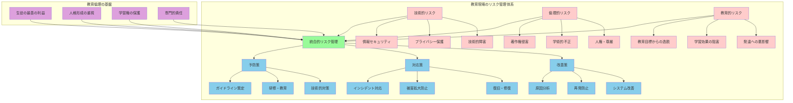

# 教育倫理を基盤とした責任ある生成AI活用

**教育の本質を守る責任ある活用**

教育現場における生成AI活用は、その革新的な可能性と同時に、重大な責任を伴う。技術の進歩がもたらす利便性と効率性を追求する一方で、教育者として最も重要な使命である生徒の人格形成、学習権の保護、そして教育の本質的価値の維持を決して忘れてはならない。

**包括的リスク管理の必要性**

本章では、以下の領域にわたる包括的なリスク管理体制について詳述する：
- **情報セキュリティとプライバシー保護**
- **著作権と学術的誕実性**  
- **教育倫理と専門性の維持**
- **組織的なリスク管理体制の構築**

**先進技術活用における新しい課題**

現代の教育現場では、デジタル技術の活用が日常化している一方で、その安全性と倫理性への配慮が十分でない場合がある。

**生成AI固有のリスク**
- 従来の情報リテラシー教育では対応困難な新しいリスク
- 高度な技術的知識と倫理的判断の両立が必要
- 教育者としての専門性と個人的対応の限界

**求められる総合的アプローチ**

教師一人ひとりが技術的な知識を身につけるだけでなく、教育者としての倫理観と専門的判断力を基盤として、生徒の最善の利益を最優先に考えた活用を実現する必要がある。

**積極的リスク管理の理念**

重要なのは、リスク管理を単なる規則の遵守や問題の回避として捉えるのではなく、教育の質向上と生徒の成長支援を目的とした積極的な取り組みとして位置づけることである。

**リスク管理の目指す成果**
- 生成AIの教育的価値の最大限活用
- 生徒の安全と尊厳の確実な保護
- 教育の質的向上と持続可能性の実現
- 学習者の成長と発達への積極的貢献

適切なリスク管理により、これらの目標を同時に達成することが可能になる。



## 情報セキュリティとプライバシー

### 個人情報・機密情報の厳格な取り扱い

**個人情報保護の重要性**

教育現場において生成AIを活用する際、最も重要な配慮事項の一つが個人情報と機密情報の適切な取り扱いである。

**学校で扱う機微情報の特性**
学校で扱う情報の多くは、以下のような極めて機微な個人情報を含んでいる：
- **学習関連情報**: 成績、学習状況、特別な支援ニーズ
- **健康関連情報**: 健康状態、病歴、アレルギー情報
- **家庭環境情報**: 経済状況、家族構成、住所情報
- **進路・将来計画**: 進学・就職希望、将来の多画

**情報漏洩の深刻な影響**
これらの情報が不適切に外部サービスに送信されることで生じるリスクは、単なる情報漏洩にとどまらず、生徒の将来にわたる不利益や人権侵害につながる可能性がある。

入力してはいけない情報の明確化では、生徒の氏名、住所、電話番号、保護者の職業、家庭の経済状況、健康状態、学習困難、行動上の課題など、個人を特定可能な情報や機微な情報を具体的に列挙し、教職員全体で共有します。また、学校固有の情報として、校内のシステム情報、セキュリティ設定、内部の意思決定過程、未公表の方針なども保護すべき機密情報として位置づけます。重要なのは、これらの情報を単に「入力禁止」とするだけでなく、なぜ保護が必要なのか、漏洩した場合にどのような影響があるのかを、教育者として理解することです。

**教育効果を維持するデータ匿名化技法**

データの匿名化については、教育効果を損なわない範囲で個人特定要素を除去し、生成AIを活用する手法を確立する。例えば、「3年A組の田中太郎さんは数学が苦手で、特に二次関数の理解に困難を示している」という情報を「高校3年生の生徒Aは数学の関数分野に学習課題があり、抽象的概念の理解支援が必要である」といった形で一般化します。このような匿名化により、個人のプライバシーを保護しながら、教育的価値のある支援や情報を生成AI から得ることが可能になります。

情報漏洩防止策では、技術的対策と運用上の対策を組み合わせた多層的な保護体制を構築します。技術的対策として、学校専用のアカウント設定、アクセス権限の厳格な管理、通信の暗号化、ログの記録・監視などがあります。運用上の対策として、利用前の情報確認、複数人でのチェック体制、定期的な利用状況の見直し、インシデント発生時の迅速な対応手順の確立などが重要です。

### 生徒情報の包括的保護

生徒に関する情報の保護は、単に法的義務を満たすだけでなく、教育者としての基本的な責任として認識する必要があります。生徒の成長過程にある未成熟さ、将来への影響、社会的立場の脆弱性を考慮し、成人以上に慎重な配慮が求められます。

成績データの扱いにおいては、個々の生徒の学習状況を生成AIで分析する際の適切な方法を確立します。「生徒の成績が低下している」という情報を生成AI に入力する場合、生徒名や学級名を除去し、「ある生徒が特定科目で学習困難を示している状況での効果的な支援方法」として一般化した相談を行います。成績の数値データを活用する場合も、統計的傾向として処理し、個人の特定が不可能な形で活用することが重要です。

個人特定の防止では、複数の情報を組み合わせることで個人が特定される「モザイク効果」への注意も必要です。例えば、「バスケットボール部所属」「数学が得意」「進路希望が工学部」といった情報を組み合わせると、小規模校では個人特定が容易になる場合があります。生成AI への相談では、必要最小限の情報のみを使用し、不要な詳細情報は除去することを徹底します。

保護者への説明では、学校での生成AI 活用について透明性を保ち、信頼関係を築くことが重要です。どのような場面でAIを活用するのか、生徒の情報がどのように保護されるのか、保護者にはどのような権利があるのかを、分かりやすい言葉で説明します。また、保護者から懸念や質問があった場合には、誠実に対応し、必要に応じて活用方法の見直しも検討することを示します。このような透明性と対話により、保護者の理解と協力を得ることができます。

## 著作権と学術的誠実性

### 生成コンテンツの著作権の複雑な現状理解

生成AIが作成するコンテンツの著作権については、現在も法律的解釈が発展途上にある複雑な領域です。教育現場でAI生成コンテンツを活用する際には、この不確実性を認識し、より慎重なアプローチを取ることが求められます。

権利関係の理解では、AI学習データに含まれる著作物の権利、AI生成コンテンツ自体の著作権の有無、利用者の権利と責任について、現時点で明らかになっている法的見解を把握します。多くの生成AIサービスは、大量の既存著作物を学習データとして使用しているため、生成されるコンテンツが既存の著作物に類似する可能性があります。教育現場では、この可能性を常に念頭に置き、AI生成コンテンツを使用する際には追加の検証を行うことが重要です。

利用許諾の確認については、各AIサービスの利用規約を詳細に検討し、教育現場での使用に適用される条件を理解します。商業利用の制限、生成コンテンツの改変可能性、第三者への提供に関する条件など、サービスごとに異なる規約内容を把握し、学校の利用方針と照らし合わせて適切性を判断します。特に、生徒の作品や教材として使用する場合の制約事項については、事前に十分な確認を行います。

二次利用の注意点では、AI生成コンテンツを基に教材を作成したり、他の教師と共有したりする際の適切な方法を確立します。生成コンテンツをそのまま使用するのではなく、教師の教育的判断を加えた編集・改変を行い、教育目的に適した形に調整することが重要です。また、AI生成コンテンツの出典を明記し、どの部分がAI生成でどの部分が教師のオリジナルかを明確に区別します。

### 教育現場での著作権配慮の実践

教育現場における著作権配慮は、法的義務の履行だけでなく、知的財産権の尊重と創作活動への敬意を生徒に示す教育的意義も持ちます。生成AI活用においても、この教育的観点を重視した取り組みが必要です。

授業での利用範囲について、教育目的での著作物利用に関する権利制限規定（著作権法第35条）と生成AI活用の関係を整理します。従来の著作物の教育利用とAI生成コンテンツの利用は異なる考慮事項があるため、両者を明確に区別して扱います。AI生成コンテンツを授業で使用する場合、その内容が既存の著作物に酷似していないか確認し、可能な限り複数の情報源と比較検討を行います。

生徒作品の扱いにおいては、生徒がAIを活用して作成した作品の著作権と、その取り扱いについて明確な方針を定めます。生徒の創造的活動を尊重しながら、AI利用の透明性を確保する方法を確立します。生徒には、AI生成部分と自身の創作部分を明確に区別して記録する習慣を身につけさせ、知的誠実性の重要性を実体験を通じて学習させます。

第三者権利の保護では、AI生成コンテンツに第三者の権利が関わる可能性を常に考慮します。特に、肖像権、プライバシー権、商標権などは著作権とは別個の権利であり、AI生成コンテンツでも侵害のリスクがあります。教育活動で使用する前に、これらの権利への配慮が適切になされているかを確認し、疑義がある場合は使用を控えるか、権利者への確認を行います。

```mermaid
graph TB
    subgraph "著作権・知的財産権の配慮プロセス"
        A[AI生成コンテンツ作成] --> B{既存著作物との類似確認}
        B -->|類似なし| C[教育目的適合性確認]
        B -->|類似あり| D[代替手段検討]
        
        C -->|適合| E[利用規約確認]
        C -->|不適合| D
        
        E -->|問題なし| F[教育的価値評価]
        E -->|制限あり| G[条件内利用検討]
        
        F -->|高い| H[利用実施]
        F -->|低い| I[利用見送り]
        
        G -->|可能| H
        G -->|困難| I
        
        H --> J[利用記録・出典明記]
        
        D --> K[従来手法活用]
        I --> K
        
        J --> L[事後評価・見直し]
        K --> L
    end
    
    subgraph "確認すべき権利・法的側面"
        M[著作権]
        N[著作者人格権] 
        O[肖像権・プライバシー権]
        P[商標権・意匠権]
        Q[利用規約・契約]
        
        M --> B
        N --> B
        O --> B
        P --> B
        Q --> E
    end
    
    classDef process fill:#e3f2fd
    classDef decision fill:#fff3e0
    classDef rights fill:#f3e5f5
    
    class A,C,E,F,H,J,K,L process
    class B,D,G,I decision  
    class M,N,O,P,Q rights
```

## 教育倫理と専門性の維持

### AI活用の教育的適切性の継続的検証

教育現場での生成AI活用においては、技術的な可能性や効率性だけでなく、教育的適切性を継続的に検証することが不可欠です。教育者として、「できること」と「すべきこと」を明確に区別し、常に生徒の最善の利益を最優先に考えた判断を行う必要があります。

教育目標との整合性確認では、AI活用が本来の教育目標達成にどのように貢献するかを常に問い続けます。効率化や便利さだけを目的とした活用は、教育の本質を見失う危険性があります。例えば、レポート作成においてAIが文章の大部分を生成することで時間は短縮されるかもしれませんが、文章表現力や論理的思考力の育成という教育目標から逸脱する可能性があります。各活用場面において、「この活用は生徒の成長にどのように寄与するのか」「教育目標達成に本当に必要なのか」を自問自答することが重要です。

生徒の発達段階への配慮では、高校生という発達過程にある学習者の特性を十分に理解し、AI活用が健全な成長を支援するものとなるよう配慮します。高校生は認知能力が急速に発達する時期であり、批判的思考力、創造性、自律性を育成する重要な段階にあります。AI活用がこれらの能力発達を阻害するのではなく、むしろ促進するような設計を心がけます。また、個人差の大きい時期でもあるため、一律的なAI活用ではなく、個々の生徒の発達状況に応じた柔軟な対応を行います。

人間関係を重視した指導では、教育の根幹である教師と生徒、生徒同士の人間的な関わりを決して軽視してはなりません。AIによる効率化が、人間関係の希薄化や対話機会の減少をもたらすことのないよう注意深く配慮します。むしろ、AI活用により浮いた時間を、より深い人間的交流や個別指導に活用することで、教育の質的向上を図ります。技術と人間性のバランスを常に意識し、技術が人間関係を豊かにする手段として機能するよう努めます。

### 専門職としての判断力と継続的成長

教師は専門職として、常に専門的知識と倫理観を更新し続ける責任を負っています。生成AI時代においては、この専門性がより一層重要になります。技術の進歩に振り回されることなく、教育の本質を見極め、専門的判断力を発揮することが求められます。

技術と教育の調和では、生成AIという新しい技術を教育実践に統合する際の専門的判断基準を確立します。技術的可能性と教育的価値、効率性と学習の深さ、革新性と安定性など、様々な要素を総合的に考慮し、バランスの取れた活用を実現します。また、技術導入が目的化することを避け、常に教育目標達成のための手段として位置づけることを徹底します。専門職として、流行や外圧に左右されることなく、教育的価値に基づいた冷静な判断を行います。

継続的な学習と改善については、生成AI技術の急速な発展に対応するため、自らの知識とスキルを継続的に更新する姿勢を維持します。技術的な理解だけでなく、その教育的活用方法、倫理的課題、社会的影響についても学習を続けます。また、実践を通じて得られた経験や洞察を同僚と共有し、学校全体の専門性向上に貢献します。失敗や課題も貴重な学習機会として捉え、改善に向けた継続的な取り組みを行います。

同僚・保護者との協働では、AI活用に関する方針や実践を独断で決定するのではなく、同僚教師、管理職、保護者との対話と協働を通じて合意形成を図ります。異なる立場や専門性を持つ関係者の意見を尊重し、多角的な視点から最適な活用方法を模索します。特に保護者に対しては、AI活用の教育的意図と配慮事項を丁寧に説明し、理解と協力を得る努力を継続します。

## 組織的なリスク管理体制

### 学校としての統合的ガイドライン策定

個人的な取り組みだけでなく、学校組織として統一されたリスク管理体制を構築することが、安全で効果的な生成AI活用には不可欠です。組織的なアプローチにより、個人の判断のばらつきを減らし、より高い安全性と教育効果を実現できます。

利用規程の作成では、学校の教育方針と価値観に基づいた明確な指針を策定します。技術的な制約事項だけでなく、教育的配慮、倫理的基準、緊急時対応までを含む包括的な規程を作成します。規程の内容は、教職員全員が理解し実践できるよう、具体的で実用的なものとする必要があります。また、技術の進歩や社会情勢の変化に応じて定期的に見直しを行い、常に最適な内容を維持します。

教職員研修の実施では、全教職員が適切なAI活用能力を身につけるための体系的な研修プログラムを開発します。技術的な操作方法だけでなく、教育的活用方法、リスク管理、倫理的配慮についての理解を深める内容を含めます。研修は一回限りではなく、継続的なスキルアップを支援する体制を整えます。また、教科や担当業務に応じた専門的な研修も実施し、実践的な活用能力の向上を図ります。

定期的な見直しでは、AI技術の発展、法規制の変更、教育環境の変化に応じて、ガイドラインや運用方法を適切に更新します。年間を通じて実践状況を記録・分析し、課題や改善点を特定します。また、他校の取り組みや専門機関の提言も参考にしながら、より良い活用方法を模索し続けます。見直し結果は教職員全体で共有し、組織全体の学習と成長につなげます。

### インシデント対応と継続的改善システム

どれほど注意深く準備しても、新しい技術の活用には予期せぬ問題が発生する可能性があります。重要なのは、問題の発生を恐れて技術活用を避けることではなく、適切な対応体制を整備し、問題から学んで改善につなげることです。

問題発生時の対応では、迅速で適切な初動対応により、被害の拡大を防止します。誰に報告すべきか、どのような情報を収集すべきか、どのような応急措置を取るべきかを事前に明確にしておきます。また、生徒や保護者への説明、関係機関への報告、メディア対応なども含めた包括的な対応手順を策定します。問題発生時には、隠蔽や責任逃れではなく、透明性と誠実さを基本とした対応を行います。

再発防止策では、発生した問題の根本原因を詳細に分析し、同様の問題の再発を防ぐための具体的な対策を立案・実施します。個人の注意喚起だけでなく、システムやプロセスの改善により、構造的な解決を図ります。また、類似の問題が発生する可能性がないかを幅広く検討し、予防的な対策も講じます。

継続的改善では、日常的な小さな課題や改善提案も含めて、常に活用方法の向上を図ります。教職員からのフィードバック、生徒の反応、保護者の意見、外部評価などを総合的に分析し、持続的な改善サイクルを回します。改善の成果は定期的に評価し、さらなる向上につなげます。このような継続的改善により、生成AI活用の安全性と教育効果を同時に向上させることができます。

教育現場における生成AI活用のリスク管理は、単に危険を回避するための消極的な取り組みではありません。適切なリスク管理により、技術の教育的価値を最大限に活用しながら、生徒の安全と成長を確実に保護する積極的な教育実践を実現することができるのです。教育者としての専門性と倫理観を基盤として、責任ある活用を続けることで、AI時代の教育における新たな可能性を切り拓いていくことが可能になります。