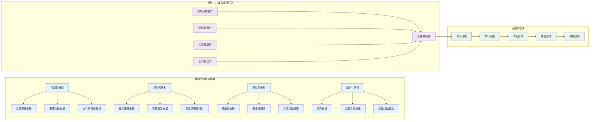
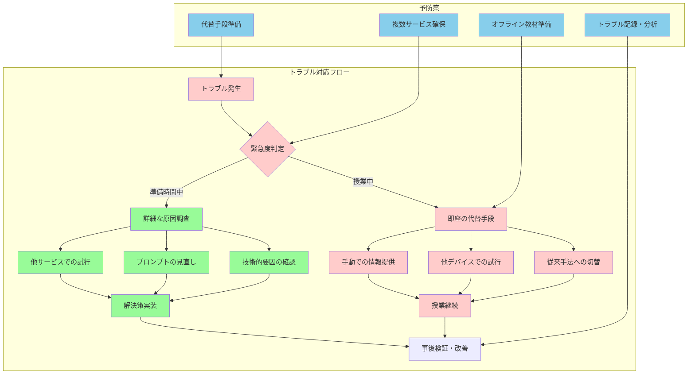

# 教育現場での即戦力となる具体的活用法

**実践に直結する具体的活用法**

理論的な理解から実践への橋渡しとして、本章では教科別・場面別の具体的な活用事例と、実際の教育現場で即座に活用できるテクニック集を提示する。

**実用的手法の体系化**

これまでの章で学んだ基本原則と理論的基盤を踏まえ、日々の教育実践において生成AIを効果的に活用するための実用的な手法について詳述する。

**カスタマイズと専門性の重要性**

重要なのは、これらの実践事例を単に模倣するのではなく、それぞれの教育現場の特性、生徒の実態、教師の専門性に応じて適切にカスタマイズすることである。

**効果を決定する要因**
- 生成AIは強力なツールであるが、その効果は教師の教育的判断と専門性によって大きく左右される
- 各事例を参考にしながら、自らの教育観と生徒の実態に最も適した活用方法を模索することが求められる
- 一律的な適用ではなく、状況に応じた柔軟な対応が必要

また、実践において必ず遭遇する技術的なトラブルや教育的配慮が必要な場面への対処法も含め、現実的で実用性の高い内容を提供します。完璧な活用を目指すのではなく、試行錯誤を通じて徐々に改善していく姿勢を大切にし、生徒の学びと成長を最優先に考えた柔軟な対応を心がけます。

## 教科別実践事例集

### 国語科での深化的活用

**国語科での言語感性育成支援**

国語科における生成AI活用は、言語能力の本質である思考力、表現力、感受性の育成を支援することを目的とする。

**支援者としての位置づけ**
- 重要なのは、AIが言語活動の代替を行うのではなく、生徒の言語的感性と思考を豊かにする支援者として機能することである
- AIは情報提供や背景理解を支援するが、文学作品への感動や個人的な解釈は生徒自身の感性に依存
- 言語としての美しさやリズム、表現の微妙なニュアンスは人間の特権として尊重

現代文指導においては、文学作品の時代背景と現代的意義の関連付けで生成AIを活用します。例えば、夏目漱石の「こころ」を扱う際、明治時代の社会情勢、西洋化の影響、個人主義の台頭といった時代背景を詳細に調査し、現代の人間関係や価値観の変化と比較検討する材料を提供します。しかし、作品を読んだ際の感動や人物への共感、文章表現に対する感受性は、生徒自身の内面で育まれるべきものです。教師は「明治時代の『こころ』と現代社会の人間関係について、当時と現在の社会状況の違いを踏まえて比較分析する資料を作成してください。特に、個人主義の発達、家族制度の変化、コミュニケーション手段の違いに焦点を当ててください」といった具体的な依頼により、生徒の理解を深める補助資料を効率的に準備できます。

複数の文学批評理論による作品分析支援では、構造主義、精神分析学的批評、フェミニズム批評、ポストコロニアル批評など、多様な視点を提示し、生徒の解釈を豊かにします。ただし、これらの理論的視点は生徒自身の感想や解釈を出発点とし、それを深化させるための道具として活用することが重要です。生徒が作品に対して抱いた素朴な疑問や感想を大切にし、それを理論的な視点で検証・発展させることで、より深い文学理解を実現します。

古典指導においては、古語の語源と現代語との繋がりを可視化することで、言語の歴史的変遷を理解させます。「をかし」「あはれ」といった古語の概念を現代的な感情表現と比較し、日本人の美意識や感性の変遷を探ります。しかし、古典作品を音読した際の響きやリズム感、文語表現の美しさは、生徒が直接体験すべき感覚的な学習です。生成AIは古典の現代的価値を発見する支援は行いますが、古典の美しさや深さを感じ取るのは生徒自身の感性に委ねられます。

小論文指導においては、論理的思考力と表現力の両立を目指します。生成AIは論理構成の検討、反対意見の整理、具体例の提案などで支援しますが、最終的な主張や価値判断は生徒自身が行います。「高校生の視点で環境問題について論じる小論文の構成案を作成してください。賛否両論を公正に検討し、具体的な事例も含めて、論理的な流れを示してください」といった依頼により、生徒の思考を整理し、論理的な表現を支援する枠組みを提供できます。

### 数学科での概念理解促進

数学科における生成AI活用は、抽象的な数学概念の理解を深め、論理的思考力を育成することを目的とします。数学的な思考プロセス自体は生徒が主体的に行うべきものですが、概念の理解を支援し、多様なアプローチを提示することで、数学的な見方・考え方を豊かにできます。

基礎力定着指導では、生徒の誤解パターンに応じた個別説明の生成が有効です。例えば、二次関数のグラフの平行移動で多くの生徒が混乱する「y=a(x-p)²+q」の形において、「なぜpが右にp移動するのにマイナスなのか」という典型的な誤解に対し、生成AIは段階的で視覚的な説明を提供します。「高校1年生が二次関数の平行移動で『x-p』の符号で混乱している場合の、直感的で理解しやすい説明方法を、具体例を使って段階的に提案してください」といった依頼により、生徒の認知負荷を軽減しながら本質的理解を促進する説明を作成できます。

抽象的概念の身近な具体例による説明では、数学的概念と実生活の関連を明確に示します。指数関数的増加を新型コロナウイルスの感染拡大や複利計算で説明し、微分概念を車の速度と加速度で理解させるなど、生徒の日常経験と数学概念を橋渡しします。しかし、これらの具体例から抽象的な数学概念を抽出し、一般化する思考プロセスは、生徒自身が経験すべき重要な学習活動です。

応用力育成においては、実生活の問題と数学的概念の結びつきを強化します。「データサイエンス教育を意識して、高校数学の統計分野で扱うべき社会的に意義のある実データと、それを活用した探究課題を提案してください。生徒が統計的思考と社会課題への関心を同時に育成できるような内容を含めてください」といった依頼により、数学的概念の社会的有用性を実感できる学習活動を設計します。

複数の解法パターンの比較検討では、同一問題に対する異なるアプローチを提示し、それぞれの利点や適用場面を考察させます。生徒が自分なりの解法を見つけた後で、他の可能性を検討することにより、数学的思考の柔軟性と深さを育成します。重要なのは、解法の暗記ではなく、なぜその方法が有効なのか、どのような場面で適用できるのかを理解することです。

### 英語科での実践的コミュニケーション能力育成

英語科における生成AI活用は、実際のコミュニケーション場面で使える英語力の育成を目的とします。文法や語彙の知識習得だけでなく、異文化理解と実践的な言語運用能力を統合した学習を実現します。

4技能統合指導では、文化的背景を踏まえたコミュニケーション活動を設計します。例えば、英語圏の高校生との交流を想定した場面において、日本の文化的特徴を英語で説明する活動を行います。生成AIは文化的相違点の整理、適切な語彙や表現の提案、相手の文化的背景の情報提供を行いますが、実際のコミュニケーションや文化的感受性は生徒自身が体験を通じて身につけます。「日本の部活動文化について、アメリカの高校生に英語で説明する際の要点整理と、相手が理解しやすい比較例を提案してください」といった依頼により、国際交流の場面で実際に使える教材を作成できます。

個別最適化学習の実現では、生徒の習熟度に応じた語彙・文法練習問題を生成します。基礎レベルの生徒には身近な話題と基本的な文構造を使った問題を、上級レベルの生徒には抽象的な概念や複雑な文構造を含む問題を提供します。しかし、言語習得の核心である反復練習、音読、実際の使用経験は、生徒自身が積み重ねる必要があります。

発音指導では、視覚的・聴覚的支援資料を作成し、日本語話者が困難とする音素の区別や、英語特有のリズム・イントネーションの習得を支援します。ただし、実際の発音練習、聞き取り練習、口の動きの習得は、生徒の身体的な練習と教師の直接的な指導が不可欠です。生成AIは理論的な説明や練習方法の提案は行いますが、実際の音声産出能力は人間の指導と練習によってのみ向上します。

国際感覚の育成では、英語圏以外の国際的視点も導入し、グローバル社会における多様な価値観や課題について英語で考える機会を提供します。環境問題、人権問題、技術革新などのグローバル課題について、複数の国や地域の視点を比較検討し、英語でディスカッションや発表を行う活動を設計します。

### 理科での探究的学習促進

理科における生成AI活用は、科学的思考力の育成と探究的学習の質向上を目的とします。観察・実験という理科学習の根幹は決して代替されるべきではなく、むしろそれらの教育効果を最大化するための支援として活用されます。

実験・観察重視の指導では、実験の安全性と教育的意義の両立を図ります。生成AIは実験手順の最適化、安全上の注意事項の整理、予想される結果と誤差要因の分析などを支援しますが、実際の実験操作、観察、データ収集は生徒自身が行います。「高校化学の中和滴定実験において、生徒の安全を確保しながら教育効果を最大化するための実験手順と、起こりうるミスと対処法を整理してください」といった依頼により、安全で効果的な実験指導を実現できます。

科学現象の可視化では、抽象的な科学概念を理解しやすい形で表現し、概念理解の深化を支援します。分子の動きやエネルギーの変化など、直接観察困難な現象について、適切な比喩や図解を用いた説明を作成します。しかし、科学的な推論、仮説の設定、実験結果の解釈は、生徒自身の思考プロセスとして経験させる必要があります。

探究活動での論理的思考支援では、仮説設定から検証までの科学的プロセスを体系的に指導します。生成AIは研究方法の選択肢提示、データ分析手法の説明、結論導出の論理チェックなどを支援しますが、研究テーマの設定、仮説の立案、結果の解釈と考察は生徒の主体的な思考活動として行われます。

科学リテラシーの育成では、疑似科学と真の科学の区別を明確に指導し、情報の信頼性を判断する能力を育成します。「血液型占いと科学的根拠の関係について、高校生が批判的思考力を発揮できるような教材を作成してください。科学的方法論の重要性も含めて説明してください」といった依頼により、現代社会で必要な科学リテラシーを育成する実践的な教材を作成できます。

### 社会科での批判的思考力育成

社会科における生成AI活用は、複雑な社会現象の理解と批判的思考力の育成を目的とします。多様な視点と価値観が存在する社会問題について、公正で多角的な検討を可能にする教材と学習活動を提供します。

現代社会への関心喚起では、時事問題と歴史的背景の構造的理解を促進します。例えば、現在の国際紛争を理解するために、歴史的経緯、地政学的要因、経済的利害、文化的背景を統合的に分析する材料を提供します。しかし、これらの情報に基づく価値判断や政治的見解の形成は、生徒自身の思考と議論を通じて行われるべきです。「中東問題について、高校生が多角的に理解できるよう、歴史的背景から現在の状況まで、複数の立場を公正に紹介する教材を作成してください」といった依頼により、バランスの取れた社会認識を育成する教材を準備できます。

主権者教育の充実では、政治参加への関心と理解を促進する実践的な学習活動を設計します。模擬選挙、政策討論、地方議会傍聴などの活動において、争点の整理、政策比較、議論の進め方などを支援します。重要なのは、特定の政治的立場に誘導するのではなく、民主的な合意形成プロセスを体験し、多様な意見を尊重する姿勢を育成することです。

地域理解と愛着の形成では、郷土の歴史・文化の現代的価値を発見し、地域課題解決への主体的参画意識を育成します。地域の特色ある産業、歴史的建造物、伝統文化などについて、その成立背景と現代的意義を探り、地域活性化への具体的提案を考察する学習活動を支援します。グローカルな視点での地域貢献意識の醸成により、地域と世界のつながりを理解した視野の広い市民の育成を目指します。

## 実技・特別活動での活用

### 体育・保健分野での健全な身体発達支援

体育・保健分野における生成AI活用は、生徒の健全な身体発達と健康意識の向上を支援することを目的とします。身体活動そのものは生徒自身が行うべき活動ですが、科学的な知識と個別最適化された指導方法の提供により、教育効果を高めることができます。

体育実技での活用において、スポーツのルールや戦術の視覚的説明資料作成は特に効果的です。複雑なルールや戦術的概念を、図解や動作の段階的説明により理解しやすい形で提示します。「バレーボールのローテーションシステムについて、初心者でも理解できる視覚的な説明資料を作成してください。実際の試合場面での判断方法も含めて、段階的に説明してください」といった依頼により、生徒の理解を促進する教材を効率的に準備できます。

個別の体力向上プログラム設計支援では、生徒一人ひとりの体力測定結果や身体的特徴に基づいた運動プログラムを提案します。ただし、実際の運動指導、フォームの修正、安全管理は教師が直接行う必要があります。また、生徒の身体的・精神的状態の把握は、直接的な観察と対話によってのみ適切に行うことができます。

安全指導資料の作成では、各種運動やスポーツ活動における事故防止策を体系的に整理します。熱中症対策、外傷の応急処置、器具の安全な使用方法などについて、科学的根拠に基づいた情報を提供し、安全意識の向上を図ります。

保健教育での活用においては、健康に関する最新情報の整理と教材化が重要です。生活習慣病の予防、精神的健康の維持、薬物の害などについて、科学的で信頼性の高い情報を分かりやすく整理します。しかし、思春期特有の悩みや個別の健康問題については、教師との直接的な相談と個別対応が不可欠です。生徒の心身の状況は、人間的な関わりを通じてのみ適切に理解し、支援することができます。

### 家庭科での実践的生活スキル育成

家庭科における生成AI活用は、実践的な生活スキルの習得と生活設計能力の育成を目的とします。理論的な知識の整理と計画立案を支援しながら、実際の技能習得は体験的学習を重視します。

生活スキル教育では、栄養バランスを考慮した献立作成支援において、季節の食材、栄養価、調理法、予算などを総合的に考慮した献立提案を行います。「高校生の運動部員に適した1週間の献立を、栄養学的根拠とともに提案してください。家計負担も考慮し、調理の難易度も段階的に設定してください」といった依頼により、実践的で教育的価値の高い教材を作成できます。

家計管理と消費者教育では、ライフステージに応じた家計設計、消費者トラブルの予防、持続可能な消費行動などについて、具体的な事例を用いた教材を作成します。しかし、実際の調理技術、手芸技能、家事のコツなどは、体験を通じた学習が不可欠であり、生成AIによる代替は不適切です。

生活設計教育においては、ライフプランニングの多様なパターン提示により、生徒が自らの将来設計を主体的に考える機会を提供します。結婚、子育て、職業選択、高齢期の生活などについて、様々な生き方の選択肢とそれぞれの特徴を公正に紹介し、生徒の価値観形成を支援します。

### 芸術系教科での感性育成支援

芸術系教科における生成AI活用は、第5章で詳述した原則に基づき、感性と人間性を最重視したアプローチを取ります。創作活動や表現の核心部分は生徒の感性に委ね、知識面と理論面での支援に特化します。

音楽科での知識面支援では、楽曲の歴史的・文化的背景の詳細解説により、音楽的理解を深化させます。ベートーヴェンの交響曲第9番について、作曲の背景、初演時の社会情勢、後世への影響などを詳細に調査し、生徒が楽曲に対するより深い理解と愛着を持てるよう支援します。しかし、楽曲を聴いた際の感動、演奏技術の習得、音楽的感性の発達は、生徒自身の体験と練習によってのみ実現されます。

音楽理論の視覚的・論理的説明では、和声進行、楽式分析、音響学的原理などを理解しやすい形で提示します。抽象的な音楽理論を具体的な楽曲例と関連付けて説明することで、理論と実践の統合を促進します。

美術科での理論面支援においては、美術史の体系的整理と作品分析により、美術作品の理解を深化させます。印象派の技法革新について、光の科学的理解、社会的背景、後の芸術運動への影響などを詳細に解説し、生徒の作品鑑賞を豊かにします。画材・技法の科学的特性の説明では、油彩と水彩の違い、色彩理論、遠近法の原理などを科学的に説明し、技法習得の理論的基盤を提供します。

しかし、色彩に対する感覚、構図の美しさ、表現の独創性などは、生徒の感性と創造性によってのみ発揮されます。創作活動における発想、表現技法の選択、作品に込めるメッセージなどは、生徒の内面的な体験と感性的判断に基づいて行われるべきです。

### 総合的な探究の時間での主体的学習支援

総合的な探究の時間における生成AI活用は、生徒の主体的な学習と探究心の育成を最重視します。課題設定、研究方法、表現方法などの支援を通じて、生徒の探究活動の質を向上させます。

探究活動の質的向上では、社会課題と生徒の関心の接点発見を支援し、意義深い研究テーマの設定を促進します。「地域の少子高齢化問題について、高校生が主体的に取り組める具体的な研究アプローチを提案してください。データ収集の方法と、実現可能な改善提案の方向性も含めてください」といった依頼により、生徒の関心と社会的意義を両立する探究課題を設定できます。

研究方法論の体系的学習支援では、文献調査、アンケート調査、インタビュー、統計分析など、様々な研究手法の特徴と適用場面を説明し、研究目的に応じた適切な方法選択を支援します。しかし、実際の研究テーマの設定、仮説の立案、調査の実施、結果の解釈は、生徒自身の主体的な活動として行われる必要があります。

発表・表現活動の充実では、プレゼンテーション構成の論理性向上、視覚的資料作成のアイデア提供、聞き手に応じた表現方法の工夫などを支援します。しかし、発表内容の核心である生徒自身の発見や考察、問題意識、提案内容は、生徒の思考と体験に基づくものでなければなりません。

## 困った時の対処法とトラブルシューティング

### 技術的トラブルへの現実的対処法

生成AI活用において技術的なトラブルは避けられない現実です。重要なのは、完璧な動作を期待するのではなく、問題が発生した際の適切な対処法を身につけ、教育活動への影響を最小限に抑えることです。

接続エラーの解決方法では、ネットワーク接続の確認、ブラウザの更新、キャッシュのクリア、異なるデバイスでの試行など、段階的な対処手順を確立します。授業中にトラブルが発生した場合の代替手段も事前に準備し、学習の継続性を確保します。「生成AIサービスにアクセスできない場合の授業進行方法」として、従来の教材や指導方法への切り替え手順を明確にしておきます。

回答が得られない場合の対処では、プロンプト（質問文）の見直し、より具体的な指示の追加、段階的な質問への分割などを試行します。また、複数のAIサービスを併用することで、一つのサービスで対応困難な場合の代替手段を確保します。

不適切な回答への対応では、生成AIの限界と特性を理解し、批判的な検証を継続的に行います。事実と異なる情報、偏見を含む内容、教育的に不適切な表現などを発見した場合の対処法を確立し、生徒への適切な説明方法も準備します。これらの経験を教育の機会として活用し、情報の批判的評価能力の育成につなげます。

### 教育的配慮が必要な場面への対応

生成AI活用において、技術的な問題以上に重要なのは、教育的配慮が必要な場面への適切な対応です。これらの対応は、教育者としての専門性と倫理観が試される重要な場面です。

生徒のAI依存への対処では、依存の兆候を早期に発見し、健全な活用習慣の確立を支援します。自分で考える前にすぐAIに頼る、AI回答をそのまま受け入れる、AIなしでは課題に取り組めないなどの行動パターンを注意深く観察し、個別指導を通じて改善を図ります。「まず自分で5分間考える」「AI回答に3つの質問をする」「週1回はAI使用禁止日を設ける」など、具体的で実行可能な改善策を提示します。

保護者からの苦情対応では、AI活用の教育的意図と配慮事項を丁寧に説明し、理解と協力を得る努力を継続します。「AIを使用することで生徒の思考力が低下するのではないか」「不正行為を助長するのではないか」といった懸念に対し、教育目標との整合性、指導上の配慮、評価方法の工夫などを具体的に説明します。また、保護者の意見を真摯に受け止め、必要に応じて活用方法の見直しも検討します。

同僚からの反対意見への対応では、対話と協働を通じた合意形成を重視します。AI活用に慎重な同僚の懸念を理解し、教育効果の実証、リスク管理の徹底、段階的な導入などを通じて信頼関係を築きます。独断での推進は避け、学校全体の教育方針との整合性を確保しながら、持続可能な活用体制を構築します。

管理職への報告・相談では、AI活用の現状と課題を客観的に報告し、専門的な助言と支援を求めます。成功事例だけでなく、困難な点や改善が必要な点も正直に報告し、組織的な支援体制の構築を依頼します。また、法的・倫理的な課題については、必要に応じて専門機関や専門家への相談も提案します。

### 効果実感と継続的改善

生成AI活用を開始したものの、期待した効果が実感できない場合の改善策を体系的に検討します。重要なのは、短期的な効果を性急に求めるのではなく、継続的な改善を通じて徐々に効果を高めていく姿勢です。

プロンプトの見直し方法では、より具体的で明確な指示、適切な文脈情報の提供、段階的な質問設計など、AI とのコミュニケーション方法を改善します。「期待した回答が得られないプロンプト」を分析し、より効果的な表現方法を模索します。同僚との情報交換や専門書籍の参考により、プロンプト作成技術の向上を図ります。

活用場面の再検討では、当初設定した活用目的と実際の教育効果を照合し、より適切な活用場面を模索します。すべての教育活動でAI活用が有効とは限らないため、真に教育的価値の高い場面に集中することが重要です。また、生徒の反応や学習成果を慎重に観察し、活用方法の調整を継続的に行います。

他校の事例調査では、類似の教育環境での成功事例や失敗事例を調査し、自校での活用改善に活かします。教育関係の研究会、学会、研修会などを通じて情報収集を行い、実践知の蓄積を図ります。また、教育委員会や研究機関との連携により、より専門的な知見を獲得します。

専門家への相談では、教育工学、情報教育、教科教育の専門家に助言を求め、科学的で効果的な活用方法を模索します。大学研究者、教育センター職員、先進的な取り組みを行っている教師などとのネットワークを構築し、継続的な学習と改善を実現します。

生成AI活用の実践は、完璧を目指すのではなく、継続的な学習と改善を通じて徐々に質を高めていく過程です。失敗や困難も貴重な学習機会として捉え、生徒の学びと成長を最優先に考えた柔軟で創造的な取り組みを継続することが、真の教育改善につながるのです。