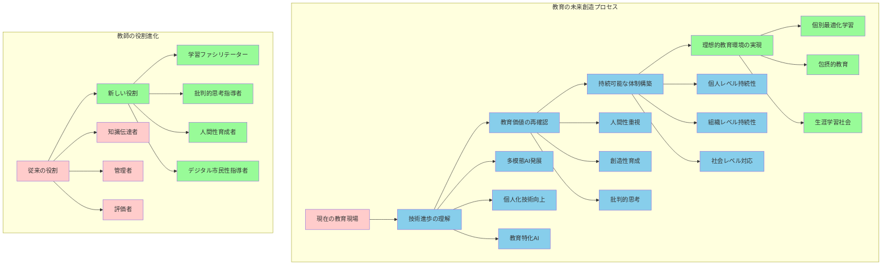
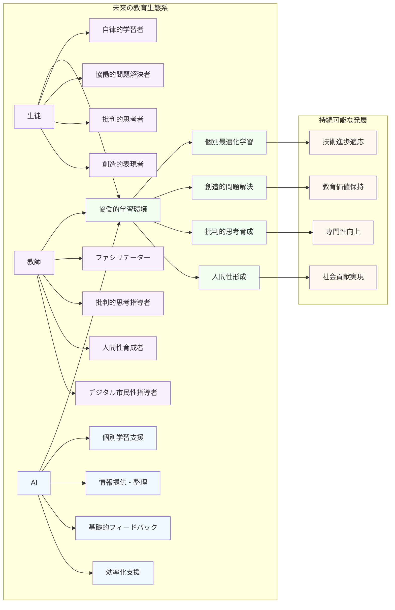

# 技術と人間性の調和による教育の未来創造

**技術と教育の未来を主体的に創造する**

生成AI技術の急速な進歩は、教育の未来に大きな変革をもたらす可能性を秘めている。しかし、技術の発展を受動的に受け入れるのではなく、教育者として主体的に関わり、教育の本質的価値を大切にしながら、より豊かで個性を尊重する教育の実現を目指すことが重要である。

**未来設計の基本理念**

本章では、長期的な視点で教育の未来を見据え、持続可能で教育的価値の高いAI活用計画について考察する。

**人間成長を中心とした教育ビジョン**

未来の教育において重要なのは、技術の進歩に振り回されることなく、教育の根本的な目的である人間の成長と社会の発展に貢献する人材育成を軸に据えることである。

**技術と教育哲学の統合**
- 生成AI技術は、この目的を実現するための強力なツールとなり得るが、その活用方法を決定するのは教育者の専門的判断と教育哲学である
- 技術は手段であり、目的ではないという原則の徹底
- 人間としての本質的価値と尊厳の維持

**教師の主体的役割と使命**

技術と人間の調和による教育の未来創造において、教師は単なる技術の利用者ではなく、教育の未来を積極的に設計し、実現していく主体的な存在として位置づけられる。

**未来教育の使命**
生徒一人ひとりの個性と可能性を最大限に引き出し、多様性を尊重し、創造性と批判的思考力を育成する教育環境の構築が、私たちの使命である。

**キーワード**
- 個性と可能性の最大化
- 多様性の尊重と包括
- 創造性と批判的思考の育成
- 主体的な教育環境の構築

## 生成AI技術の今後の発展

### 技術進歩の方向性と教育への影響

**技術発展の方向性と教育への影響予測**

生成AI技術は現在も急速に進歩を続けており、今後数年間でさらに大きな変化が予想される。

**教育者に求められる先見性**
教育者として、これらの技術発展の方向性を理解し、教育現場への影響を予測することで、適切な準備と対応策を講じることができる。

多模態AIの発展は、テキストだけでなく音声、画像、動画を統合的に処理できる技術として注目されています。この進歩により、従来は文章ベースでしか対話できなかった生成AIが、音声による自然な会話、画像の解析と生成、動画コンテンツの作成と編集を統合的に行えるようになります。教育現場においては、より自然で直感的な学習体験が可能になり、視覚的学習者や聴覚的学習者など、多様な学習スタイルを持つ生徒により適切な支援を提供できるようになります。

例えば、理科の実験において、生徒が実験動画を撮影し、AIがその動画を分析して実験手順の改善点や安全上の注意点を音声でリアルタイムに助言するような活用が可能になるでしょう。また、美術の授業では、生徒の作品写真をAIが分析し、構図や色彩について視覚的なフィードバックを提供しながら、技法の歴史的背景を音声で説明するといった統合的な学習支援が実現されるかもしれません。

個人化・カスタマイズ機能の向上により、生成AIはより精密に個々の学習者の特性、理解度、学習進度を把握し、最適化された学習支援を提供できるようになります。これは単に難易度を調整するだけでなく、学習者の興味関心、認知的特性、文化的背景なども考慮した包括的な個別化を意味します。

この進歩により、教師は30名を超える生徒それぞれに対して、まるで個別指導のような支援を効率的に提供できるようになる可能性があります。しかし、重要なのは、この個人化技術を人間的な関わりの代替としてではなく、教師と生徒の関係をより深く、より意義深いものにするための手段として活用することです。

リアルタイム学習機能の実装は、AIが学習者とのやり取りを通じて継続的に学習し、改善していく能力を意味します。従来の生成AIは事前に学習したデータに基づいて応答していましたが、個々の学習者との相互作用から新しい知識や対応方法を学び、より適切な支援を提供できるようになります。

ただし、この機能には重要な倫理的課題も含まれています。学習者のデータがAIの学習に使用されることのプライバシーへの影響、学習内容の偏向可能性、データの所有権や使用権の問題など、慎重な配慮が必要です。

教育特化型AIの開発は、一般的な生成AIではなく、特定の教科や学習段階に特化したAIシステムの登場を意味します。これらのAIは、教育学習指導要領、発達心理学、教科教育学の知見を深く組み込み、より教育的価値の高い支援を提供できる可能性があります。

### 教育現場への具体的影響予測

これらの技術進歩は、教育現場に段階的で複合的な変化をもたらすと予想されます。重要なのは、これらの変化を単なる技術的変化として捉えるのではなく、教育の本質的改善の機会として活用することです。

授業形態の変化においては、従来の一斉授業から、より柔軟で個別化された学習形態への移行が加速する可能性があります。教師が全体講義を行い、生徒が一斉に同じ内容を学ぶ形式から、生徒それぞれが自分のペースと関心に応じて学習を進め、教師がファシリテーターとして支援する形式への転換が進むでしょう。

しかし、この変化において失ってはならないのは、学級集団としての学びの価値です。協働学習、議論、発表といった集団的学習活動は、個別学習では得られない社会性や協調性を育成する重要な機会であり、AI技術の進歩に関わらず継続されるべき教育活動です。

評価方法の革新では、従来のペーパーテスト中心の評価から、学習プロセスを重視する多面的で継続的な評価への転換が加速します。AIが学習者の思考プロセス、学習履歴、成長パターンを詳細に記録・分析できるようになることで、より公正で教育的価値の高い評価が可能になります。

ただし、評価の人間的側面、すなわち教師による観察、対話を通じた理解、情意面の評価などは、AI技術がいくら進歩しても人間でなければできない重要な領域として残り続けるでしょう。

教員の役割変化は、本書を通じて繰り返し言及してきた重要なテーマです。知識の伝達者から学習の促進者へ、管理者から支援者へ、評価者から成長の伴走者へと、教員の役割は根本的に変化していくと予想されます。

この変化は、教員にとって負担軽減ではなく、より高度で専門的な能力を要求する変化でもあります。単に知識を教えるだけでなく、批判的思考力を育成し、創造性を引き出し、人間性を育む指導者としての役割が、これまで以上に重要になります。

生徒の学習スタイル変化では、受動的な知識受容から能動的な知識構築へ、個人作業中心から協働的問題解決へ、短期的な暗記学習から長期的な理解と応用へと、学習に対する姿勢と方法が大きく変化することが予想されます。

この変化に対応するため、教師は生徒の自律的学習能力、協働スキル、批判的思考力を育成する指導方法を身につける必要があります。また、生徒がAI技術を適切に活用しながら、自らの人間としての独自性と価値を発揮できるよう支援することが重要です。

## 持続可能な活用体制の構築

### 個人レベルでの持続可能性の確保

生成AI活用を一時的な流行ではなく、長期にわたって教育改善に貢献する取り組みとして継続するためには、個人レベルでの持続可能な体制構築が不可欠です。これは単に技術的なスキル維持だけでなく、教育者としての専門性の向上と健全なワークライフバランスの確保を含む包括的な取り組みです。

スキルアップの継続計画では、急速に進歩するAI技術に対応するため、計画的で段階的な学習を継続する必要があります。しかし、すべての新技術を追いかけるのではなく、教育目標達成に真に有効な技術に焦点を絞った学習が重要です。年間を通じた学習計画を立て、専門書籍の購読、オンライン研修への参加、同僚との勉強会開催などを組み合わせた多面的なスキル向上を図ります。

重要なのは、技術的スキルの向上と教育的判断力の向上を並行して進めることです。新しい技術の操作方法を覚えるだけでなく、それを教育現場でどのように活用すべきか、どのような場面で使うべきでないかを判断する能力を継続的に向上させます。

認知負債予防の習慣化は、長期的なAI活用において最も重要な要素の一つです。便利な技術に依存しすぎることで、本来の思考力や判断力が低下するリスクを常に意識し、予防的な習慣を確立します。定期的な「AIデトックス」期間の設定、手書きでの思考整理、同僚との対話による思考の言語化、読書による深い思考の習慣維持などを継続的に実践します。

また、自分の思考プロセスを意識化し、AIに依存している領域とそうでない領域を明確に区別する習慣を身につけます。「この判断は自分で行った」「この情報はAIから得た」「この結論は自分とAIの協働で到達した」といった区別を常に明確にすることで、健全な活用バランスを維持します。

専門性維持の取り組みでは、教科の専門知識、教育方法論、生徒理解など、教師としての核心的専門性を継続的に向上させることが重要です。AI活用により効率化された時間を、より高度な専門性の習得に活用し、教育者としての価値を高めます。

学会への参加、専門誌の購読、研究活動への参加、他校との交流など、専門性向上のための多様な取り組みを継続します。また、自らの実践を振り返り、成功事例と失敗事例を分析し、実践知を蓄積していく姿勢を維持します。

ワークライフバランスの確保では、AI活用による効率化の恩恵を、仕事の質向上と私生活の充実の両方に配分することが重要です。効率化により得られた時間を、さらなる業務に充てるのではなく、自己研鑽、家族との時間、趣味や休養にも適切に配分し、持続可能な働き方を実現します。

長期的な視点で見た時、充実した私生活と健全な心身の状態は、教育者としての質の高い実践に不可欠な要素です。生徒に豊かな人間性を育成する教師自身が、豊かな人間性を維持し続けることが、真の教育改善につながります。

### 学校レベルでの持続可能性の確保

個人の取り組みだけでなく、学校組織として持続可能な活用体制を構築することが、長期的な成功には不可欠です。これは予算、人材、知識、危機管理の各面において、戦略的で組織的な取り組みを要求します。

予算確保の戦略では、AI活用に必要な費用を一時的な出費としてではなく、教育の質向上への投資として位置づけ、持続的な予算配分を実現します。ハードウェア、ソフトウェア、研修費、外部専門家への相談料など、必要な経費を明確に把握し、年次計画に組み込みます。

また、費用対効果を定量的・定性的に評価し、予算確保の根拠を明確にします。「AI活用により教材準備時間が30%短縮され、その分を生徒との個別指導に充てることで学習成果が向上した」といった具体的な成果を記録・蓄積し、継続的な予算確保の根拠とします。

人材育成システムでは、全教職員が段階的にAI活用能力を身につけられる体系的な研修プログラムを確立します。初心者向けの基礎研修から上級者向けの専門研修まで、多層的な研修体系を整備し、個々の教師の習熟度とニーズに応じた学習機会を提供します。

重要なのは、研修を一過性のイベントではなく、継続的な学習プロセスとして設計することです。定期的なフォローアップ研修、実践発表会、困った時の相談体制などを組み合わせ、学び続ける組織文化を醸成します。

知識共有の仕組みでは、個々の教師が獲得した知識や経験を組織全体の財産として蓄積・活用するシステムを構築します。成功事例の文書化、失敗事例から得られた教訓の共有、効果的なプロンプト集の作成、トラブル対処法のデータベース化など、組織的な知識管理を実現します。

また、他校との情報交換、教育委員会や研究機関との連携を通じて、より広範囲な知識ネットワークを構築し、組織的な学習能力を向上させます。

危機管理体制では、技術的トラブル、セキュリティインシデント、教育的問題などに迅速かつ適切に対応する体制を整備します。問題発生時の報告系統、対応手順、復旧方法、再発防止策の策定と実施を組織的に行える体制を確立します。

また、AI技術の進歩や社会情勢の変化により、現在の活用方法が不適切になった場合の対応策も事前に検討しておきます。柔軟性と適応力を持った組織運営により、変化する環境に適切に対応し続けることができます。

## 教育の未来とAIの共生

### 理想的な教育環境の実現

技術の進歩を教育の本質的価値実現に活用することで、これまで困難だった理想的な教育環境の構築が可能になります。重要なのは、技術そのものを目的とするのではなく、生徒一人ひとりの成長と幸福を最優先に考えた教育環境を創造することです。

個別最適化された学習体験の実現では、これまで「個に応じた指導」として理念的に語られてきた教育を、AIの支援により具体的に実現できる可能性があります。生徒の学習進度、理解度、興味関心、学習スタイル、文化的背景など、多様な要素を考慮した個別化された学習支援により、すべての生徒が自分らしい方法で成長できる環境を提供します。

しかし、個別最適化は孤立化を意味するものではありません。個々の違いを認め尊重しながらも、共通の学習目標に向かって協働し、互いから学び合う集団的な学習体験も同時に提供することが重要です。AIは個別支援を行いながら、同時に協働学習を促進し、多様性を活かした豊かな学習環境を創造する役割を担います。

創造性と批判的思考の育成では、AIが提供する情報や提案を出発点として、生徒が独自の発想や解釈を展開できる学習環境を構築します。AIによる効率化により生まれた時間を、深い思考、創造的な活動、批判的な検討に充てることで、21世紀型スキルの育成を実現します。

重要なのは、創造性や批判的思考が特別な才能を持つ一部の生徒だけのものではなく、すべての生徒が発揮できる能力として位置づけることです。AIの支援により、従来は基礎的な知識習得に多くの時間を要していた生徒も、より高次の思考活動に取り組む機会を得ることができます。

多様性を尊重する包摂的教育では、文化的背景、学習能力、身体的特性、経済的状況などの違いを、排除すべき障害ではなく活かすべき多様性として捉える教育環境を構築します。AIの翻訳機能、読み上げ機能、視覚化支援などにより、従来は教育機会に制約があった生徒も、平等に学習に参加できる環境を実現します。

また、多様な背景を持つ生徒同士が互いに学び合い、異なる視点や価値観に触れることで、より豊かな人間理解と社会認識を育成することができます。AIは、この多様性を活かした学習活動を効果的に支援する役割を担います。

生涯学習社会への対応では、高校での学習が人生の特定期間に限定された活動ではなく、生涯にわたって続く学習の基盤づくりであることを意識した教育を実現します。学習方法の習得、学習習慣の確立、学習への動機づけ、自律的学習能力の育成など、生涯学習に必要な基盤的能力を重視した教育を行います。

AIとの適切な協働方法を身につけることは、生涯学習社会における重要なスキルの一つです。情報の批判的評価、創造的活用、倫理的判断などの能力を、高校時代に確実に身につけることで、変化し続ける社会で活躍し続ける基盤を築きます。

### 教員の新しい役割の確立

AIとの協働による教育の未来において、教員の役割は消失するのではなく、より高度で専門的なものへと進化します。技術では代替不可能な、人間の教師だからこそ可能な価値を提供する専門職として、教員の重要性はむしろ高まっていくと考えられます。

学習のファシリテーターとしての役割では、生徒の主体的な学習を促進し、支援する専門性が求められます。単に知識を教授するのではなく、生徒が自ら学習目標を設定し、適切な学習方法を選択し、学習過程で生じる困難を乗り越える力を育成します。

AIが情報提供や基礎的支援を担う中で、教師は生徒の学習動機の喚起、学習方向の調整、学習成果の価値づけなど、より高次の学習支援を行います。生徒とAIの学習活動を観察し、適切なタイミングで適切な介入を行う専門的判断力が重要になります。

批判的思考の指導者としては、情報過多の時代において、信頼できる情報の選別、論理的思考の展開、多角的視点の獲得、価値判断の根拠づけなど、批判的思考力の育成を専門的に指導します。

AI生成情報の検証方法、情報の偏見やバイアスの見抜き方、複数の情報源の比較検討方法、論理的矛盾の発見方法など、デジタル時代に特有の批判的思考スキルの指導が重要な専門領域になります。

人間性・感性の育成者としては、AI技術がいくら発達しても代替不可能な、人間らしさの育成に専門性を発揮します。共感力、想像力、倫理観、美的感受性、他者への思いやりなど、人間の内面的成長を支援する役割は、人間の教師にしか務まらない重要な専門領域です。

生徒の心の動き、成長の兆し、困難への対処、人間関係の悩みなど、複雑で繊細な人間的側面の理解と支援は、高度な専門性を要する人間固有の領域です。この領域での指導力向上が、未来の教師にとって最も重要な専門性の一つになるでしょう。

デジタルシティズンシップの指導者としては、デジタル技術を活用した社会参画の方法、オンライン上での責任ある行動、プライバシーと情報セキュリティ、デジタル格差への対応など、デジタル社会の良き市民として必要な素養を指導します。

AI時代のデジタルシティズンシップには、従来の情報リテラシーを超えた、より複雑で高度な判断力が要求されます。生成AI技術の社会的影響、AI倫理、人工知能と人間の関係性、技術進歩が社会に与える影響などについて、批判的で建設的な思考を促進する指導が求められます。

未来の教育における教師の役割は、技術の進歩により軽減されるのではなく、より本質的で創造的なものへと進化していきます。この進化に対応するため、私たち教育者は継続的な学習と成長を通じて、新しい時代に相応しい専門性を身につけていく必要があります。

生成AIとの協働は、教師としての価値を脅かすものではなく、教育の可能性を大きく拡張し、すべての生徒により豊かな学習体験を提供する機会です。技術と人間性の調和を図りながら、教育の未来を積極的に創造していく。これが、AI時代を迎えた私たち教育者の使命であり、同時に大きな可能性でもあるのです。

教育は人間の営みであり、その核心には常に人間同士の関わりがあります。生成AI技術がいくら発達しても、生徒一人ひとりの心に寄り添い、成長を支え、未来への希望を共に育む教師の役割は、決して代替されることのない、かけがえのない価値を持ち続けるでしょう。私たちは、この確信を持って、技術と人間性が調和した、より良い教育の未来を創造していくことができるのです。