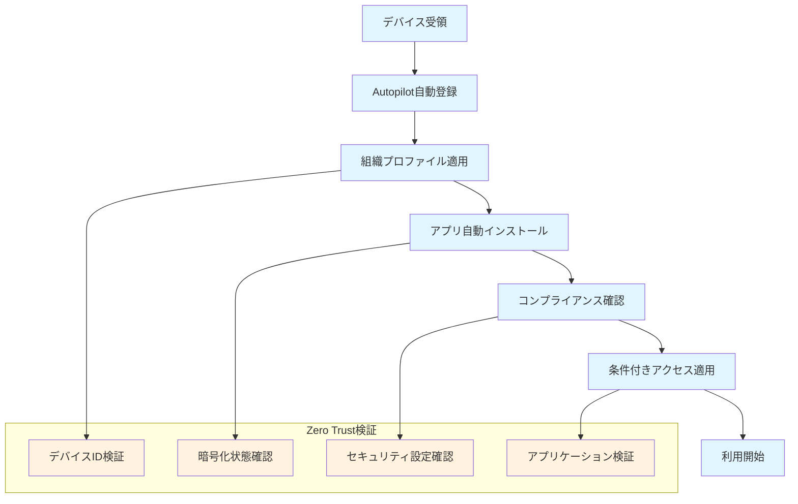
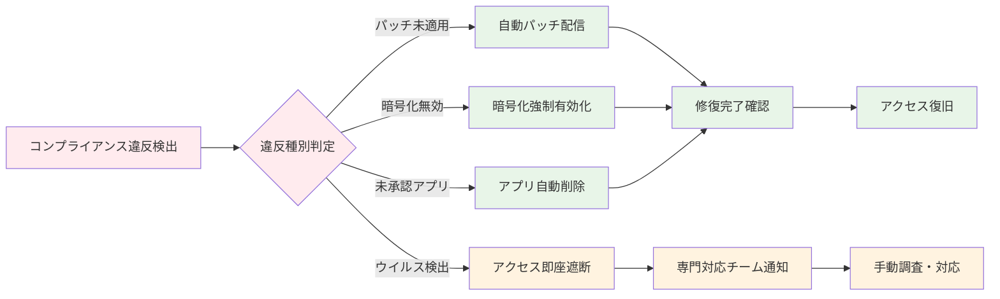
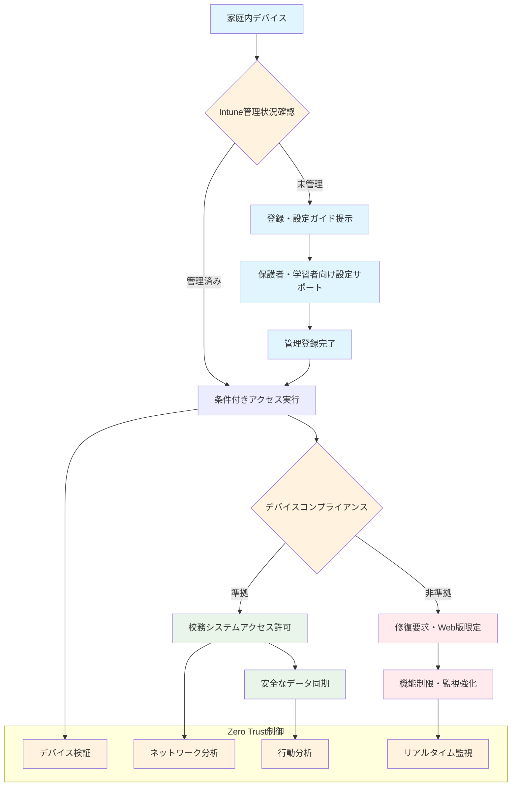
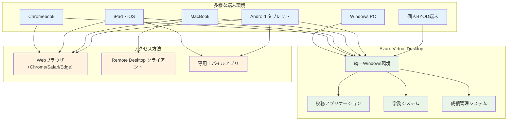
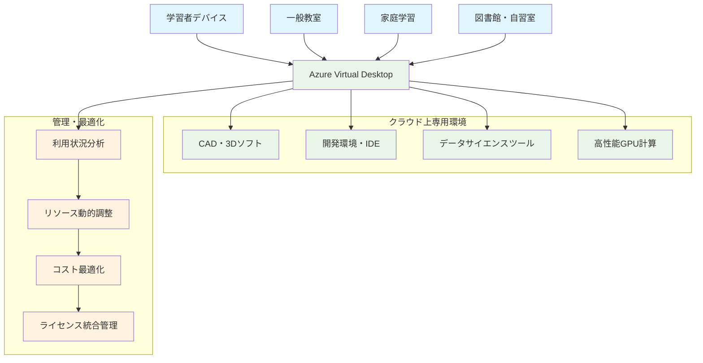
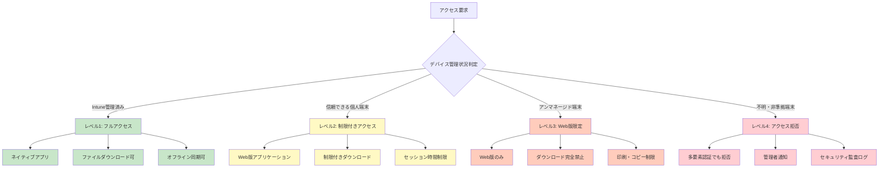
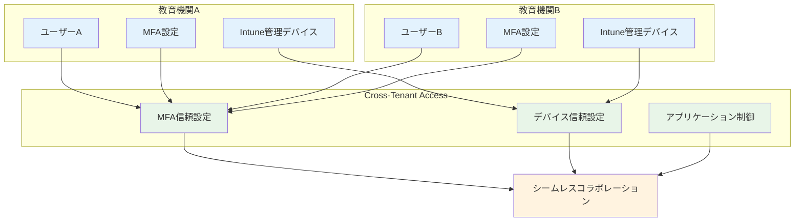

# Zero Trust Device 原則による Intune 戦略

NIST Zero Trust Architecture SP 800-207 では、**デバイスは信頼の境界を形成しない**という原則を明確に示しています。教育機関では1人1台端末環境が標準となった現在、デバイス管理は従来の「管理されたデバイスは安全」という前提から「すべてのデバイスを継続的に検証する」Zero Trust原則への転換が必要です。

## NIST Zero Trust Device 要件と教育機関適用

### デバイス継続検証の実現

Zero Trust Architecture では、デバイス信頼性の**継続的検証**が必須要件です。従来のドメイン参加や証明書配布による「一度信頼したら永続的に信頼」アプローチではなく、アクセスの都度デバイス状態を検証します。

教育機関では以下の継続検証要素を考慮する必要があります。

**デバイスコンプライアンス状況**
- OS・アプリケーションの最新パッチ適用状況
- セキュリティソフトウェアの動作状況
- デバイス暗号化の有効性
- 未承認アプリケーションのインストール状況

**アクセス パターン分析**
- 通常の利用時間・場所からの逸脱
- 異常なデータアクセス量・頻度
- 複数地点からの同時アクセス
- 不審なネットワーク通信

### 最小権限アクセスの実装

NIST要件に基づき、デバイスごと・用途ごとの**最小権限アクセス**を実現します。教育機関特有の権限レベル設定例：

**管理者端末**
- 校務支援システム全機能アクセス
- 個人情報を含む全データ範囲
- システム設定・ユーザー管理権限

**教職員端末**
- 担当クラス・教科の学習者データのみ
- 必要な校務アプリケーションに限定
- 個人情報のダウンロード・印刷制限

**学習者端末**
- 学習コンテンツ・提出課題に限定
- 個人の学習履歴データのみ閲覧可能
- ファイル共有・外部アクセス制限

### 自動コンプライアンス検証・修復

Zero Trust では、ポリシー違反の**自動検出・修復**が重要です。Microsoft Intune では以下の自動化が可能：

**自動検出項目**
- セキュリティパッチ未適用
- ウイルス対策ソフト無効化
- デバイス暗号化無効
- ジェイルブレイク・ルート化

**自動修復アクション**
- コンプライアンス違反時のアクセス遮断
- 必要パッチの自動配信・適用
- セキュリティ設定の強制適用
- 管理者への自動通知・エスカレーション

## Intune による Zero Trust デバイス管理

### 統一デバイス管理基盤

Microsoft Intune は、Zero Trust Device 原則の実現に必要な包括的管理機能を提供します。

**マルチプラットフォーム対応**
- Windows 11 Education（主力プラットフォーム）
- iPad・iPhone（教育現場での高い普及率）
- Android端末（Chromebook代替・低コスト端末）
- macOS（クリエイティブ系授業・教職員端末）

**統合管理コンソール**
- 単一の管理インターフェースですべてのデバイス制御
- デバイス種別を横断したポリシー適用
- 統一されたレポート・監査証跡
- 管理工数・学習コストの大幅削減

### 条件付きアクセス連携による Zero Trust 実現

Intune と Microsoft Entra ID 条件付きアクセスの統合により、デバイス信頼性に基づく動的アクセス制御を実現：

**デバイス信頼度レベル別制御**

**管理済み準拠デバイス**
- 校務支援システム全機能アクセス許可
- 個人情報データの閲覧・編集権限
- オフラインデータ同期許可

**管理済み非準拠デバイス**
- Web版アプリケーションのみアクセス許可
- データダウンロード・印刷禁止
- 修復完了まで機能制限

**未管理デバイス（BYOD等）**
- 基本的な学習コンテンツのみ閲覧許可
- 個人情報・機密データアクセス拒否
- セッション時間・頻度制限

### A3/A5 共通基盤での効率的実装

Intune の基本デバイス管理機能は、A3・A5 ライセンス共通で提供されます。これにより、ライセンス選択に依存せずZero Trustデバイス管理の基盤を構築可能：

**共通利用可能機能**
- デバイス登録・構成プロファイル配布
- アプリケーション配布・更新管理
- コンプライアンスポリシー・監視
- 条件付きアクセス基本機能

**段階的高度化アプローチ**
1. A3での基盤構築・運用安定化
2. 必要に応じてA5高度機能の段階的追加
3. 全体最適化・エンタープライズ機能活用

# 自動化・効率化によるデバイスライフサイクル管理

Zero Trust環境では、手動によるデバイス設定・管理作業は、一貫性・効率性・セキュリティの観点から重大な課題となります。教育機関での数千～数万台規模のデバイス管理では、自動化による効率化が不可欠です。

## Zero Trust 視点でのデバイス自動化戦略

### ゼロタッチ展開の実現

**Windows Autopilot 活用戦略**

Windows Autopilot は、Zero Trust の「デバイス信頼性の継続検証」原則を、デバイス導入段階から実現する重要な機能です。

**教育機関向け自動化プロファイル設計**

教育現場の多様なユーザー・用途に対応した段階的プロファイル設計：

**管理者プロファイル**
- フル管理者権限での展開
- 全校務アプリケーションのプリインストール
- 高度セキュリティ設定の自動適用
- 管理ツール・診断ソフトウェアの配布

**教職員プロファイル**
- 標準ユーザー権限での展開
- 担当教科・校務に応じたアプリ選択配布
- バランス型セキュリティ設定
- 学習者サポート用ツールの配布

**学習者プロファイル**
- 制限ユーザー権限での展開
- 学年・学習レベルに応じたアプリ制限
- 強化セキュリティ設定・ペアレンタルコントロール
- 学習専用アプリケーションのみ配布

### 継続的コンプライアンス自動化

Zero Trust では、デバイスの信頼性を**継続的に検証・維持**する必要があります。Intuneの自動化機能により、常時コンプライアンス状況を監視・修復：

**自動監視項目**
- セキュリティパッチ適用状況
- ウイルス対策ソフトの動作・定義ファイル更新
- デバイス暗号化の継続有効性
- 未承認アプリケーション検出

**自動修復アクション**

## A3/A5 共通：Windows Autopilot 活用戦略

Windows Autopilot は、A3・A5 ライセンスで共通利用可能な強力な自動化基盤です。教育機関での大規模展開に最適化された設計・運用アプローチ：

### ハードウェアベンダー連携戦略

**製造段階での自動登録**
- デバイス製造時点でのAutopilot登録
- 教育機関への出荷前設定完了
- 開封後即座の利用開始実現

**教育機関向け調達戦略**
- ハードウェアベンダーとのAutopilot連携契約
- 教育向け割引とAutopilot設定の組み合わせ
- 段階的調達での設定統一性確保

### 大規模展開効率化

**同時展開管理**
- 数千台レベルでの同時Autopilot実行
- ネットワーク帯域・サーバー負荷の適切な分散
- 展開進捗の一元監視・問題早期発見

**運用コスト削減効果**
- 手動設定作業の95%以上削減
- 現地での設定作業・出張コスト削減
- IT管理者の高付加価値業務への集中

### リモート学習・働き方改革対応戦略

COVID-19 パンデミック以降、教育機関でのリモート学習・テレワークが常態化しており、Zero Trust デバイス管理でこれらに対応する必要があります。

**安全なリモートアクセス確保**

**VPN不要のZero Trustアクセス**
- Microsoft Entra ID条件付きアクセスによる直接認証
- デバイス信頼性・ユーザー認証・位置情報の総合判定
- 従来VPNの複雑性・性能問題の解決

**家庭ネットワーク環境での安全確保**

**オフライン・オンライン連携**
- ネットワーク不安定環境での学習継続性確保
- オフライン作業時のデータ保護・制限
- 再接続時の自動同期・コンプライアンス再確認

# A3/A5共通：高度仮想デスクトップ・Cloud PC戦略

Microsoft 365 A3/A5 ライセンスでは、高度な仮想デスクトップ機能により、Zero Trust Device 管理をさらに高いレベルで実現可能です。これらの機能は、A3・A5両ライセンスで利用可能な重要な高度機能です。

## A3/A5共通：仮想デスクトップによる高度デバイス戦略

### Azure Virtual Desktop（AVD）教育機関活用

**サーバーベース仮想デスクトップ環境**

Azure Virtual Desktop は、ゼロトラストの「デバイスを信頼しない」原則を完全に実現する仮想デスクトップ インフラストラクチャ（VDI）ソリューションです。

**完全な処理・データ分離**
- すべての処理が Azure クラウド上で実行
- デバイスにはスクリーン画像のみ転送
- ローカルストレージへのデータ保存不可
- デバイス侵害時でも校務データの完全保護

**スケーラブルリソース管理**
- 利用者数・処理負荷に応じた動的リソース調整
- ピーク時（成績処理・入試時期）の一時的拡張
- 夏休み等の利用減少時のコスト最適化

**クロスプラットフォーム対応による端末選択の自由度**

教育機関では多様な端末環境が存在しますが、Azure Virtual Desktop により、端末の種類に関係なく統一された  Windows 校務環境を提供できます。

**Chromebook・iPad対応の実践的メリット**

1. **Chromebook活用戦略**
   - Google Workspace for Education 環境との併用実現
   - 低コスト端末でのフル校務システム利用
   - Webブラウザのみでの完全 Windows 環境アクセス
   - ChromeOS 管理と Windows 校務環境の分離運用

2. **iPad・タブレット対応**
   - 直感的タッチ操作でのWindows校務システム利用
   - 持ち運び性を活かした校内移動中の校務処理
   - Apple DEP/VPP管理との共存
   - Microsoft Remote Desktopアプリでの最適化されたUI

3. **BYOD・多様端末への統一対応**
   - 教員の個人端末（Mac・ChromebookPC・iPad等）からの安全な校務アクセス
   - 端末購入・管理コストの大幅削減
   - 操作習熟度に応じた端末選択の自由度確保

### Windows 365 Enterprise 個人専用 Cloud PC と端末多様性対応

**個人専用仮想 PC 環境**

Windows 365 Enterpriseは、各ユーザーに専用の仮想PCを提供し、デバイスに依存しない個人作業環境を実現：

**継続性・パーソナライゼーション**
- 個人設定・データの永続的保存
- デバイス変更・故障時の即座環境復旧
- 自宅・職場・出張先での同一環境利用

**管理・セキュリティ統合**
- Intune・条件付きアクセスとの完全統合
- 物理デバイスと同等のポリシー適用
- 一元的な監視・管理・コンプライアンス確保

**教員向け多様な端末環境への対応**

Windows 365 Enterprise は、教員が使用する様々な端末から同一の Windows 校務環境にアクセスできる柔軟性を提供します。

**Chromebook からの Windows 環境利用**
- Chrome OS 上でフル Windows 校務システムの完全利用
- Google Workspace for Education との併用環境実現
- ハードウェアコストを抑えた校務環境整備
- Webブラウザのみでの完全 Windows 体験
 
**iPad・タブレットからの校務アクセス**
- タッチインターフェースに最適化された Windows 環境
- Apple Pencil 等を活用した直感的な成績入力・文書作成
- 職員室内外での柔軟な校務処理実現
- iOS 管理との共存による統合端末戦略

**BYOD 環境での安全な校務処理**
- 教員個人のMac・PC・タブレットからの安全アクセス
- 個人端末と校務環境の完全分離
- 端末故障・買い替え時の業務継続性確保
- 多様な働き方スタイルへの対応

## 教育機関での仮想デスクトップ活用戦略

### 校務系完全分離による Zero Trust 実現

**個人情報保護の最高レベル実現**

:::message alert
**従来の物理デバイス管理での制約**

従来の物理デバイス中心のアプローチでは、以下のような個人情報・機密データ保護上の制約があります。

1. **物理デバイス依存リスク**
   - デバイス紛失・盗難時の直接的データ漏洩リスク
   - ローカルキャッシュ・一時ファイルでの情報残留
   - 修理・廃棄時のデータ完全消去困難性

2. **BYOD・家庭利用制約**
   - 個人デバイスでの校務データアクセス安全性課題
   - 家族共用端末での情報分離困難性
   - デバイス管理権限・セキュリティ設定制御限界

3. **災害・事故時継続性**
   - 物理デバイス破損時の校務データ復旧困難
   - 代替デバイス調達・設定に要する時間コスト
   - 緊急時の校務継続に必要な情報アクセス困難
:::

:::message
**A3/A5 仮想デスクトップによるリスク軽減策**

Microsoft 365 A3/A5 の Azure Virtual Desktop・Windows 365 Enterprise により、これらの課題を根本的に解決：

1. **完全データ分離**
   - すべての校務データがクラウド上で完結
   - デバイス紛失・盗難時のデータ漏洩リスク消滅
   - 物理デバイス上へのデータ痕跡完全回避

2. **安全なBYOD活用**
   - 個人デバイスでの安全な校務システムアクセス
   - 家族共用端末でも個人専用環境を確保
   - デバイス管理不要での完全セキュリティ実現

3. **災害対応・事業継続性**
   - 任意のデバイスからの即座校務環境アクセス
   - 物理インフラ被災時の完全業務継続
   - 代替デバイスでの設定不要即座利用開始
:::

### 専門教育・高性能アプリケーション提供

**STEM・クリエイティブ教育対応**

教育機関では、以下のような高性能計算・グラフィック処理を要する教育が増加：

**CAD・3Dモデリング教育**
- 工学・建築分野での専門ソフトウェア利用
- 高性能GPU・大容量メモリ要求
- ライセンス費用・ハードウェアコストの効率化

**プログラミング・データサイエンス教育**
- 開発環境・データベース・計算クラスタ利用
- 多様な言語・フレームワーク環境準備
- クラウドサービス・API連携実習

**仮想デスクトップによる効率的提供**

### 仮想デスクトップ導入判断・最適化戦略

仮想デスクトップ機能は A3・A5 で共通利用可能ですが、教育機関の要件・予算に応じた適切な導入判断が重要です。

**導入要件評価**

:::message
**仮想デスクトップ導入判断基準**

教育機関での仮想デスクトップ導入には、以下の要素を総合的に評価：

1. **セキュリティ要件**
   - 高度な個人情報保護が必要な校務環境
   - BYOD環境での安全なデータアクセス要求
   - 災害時・緊急時の業務継続性確保

2. **教育環境要件**
   - 高性能計算・グラフィック処理が必要な専門教育
   - 複数キャンパス・分散環境での統一IT環境
   - 家庭学習・リモート授業での安全なアクセス

3. **運用・コスト要件**
   - 物理デバイス管理・保守コストとの比較
   - ネットワーク帯域・Azure利用料金の考慮
   - IT管理者の専門スキル・運用体制要件
:::

**段階的導入戦略**

:::message
**現実的な仮想デスクトップ導入アプローチ**

A3/A5環境での段階的導入と最適化戦略：

1. **パイロット実装**
   - 特定部門・用途での小規模導入・効果検証
   - コスト・性能・ユーザー満足度の詳細評価
   - 運用プロセス・サポート体制の確立

2. **段階的拡大**
   - 成功事例の水平展開・適用範囲拡大
   - 物理デバイスとのハイブリッド運用最適化
   - 利用状況・コスト効率の継続的監視・改善

3. **全体最適化**
   - 組織全体での仮想・物理デバイス最適配分
   - 長期的なTCO最適化・技術進歩対応
   - 教育イノベーション・学習効果の最大化
:::

**A3/A5 選択最適化**

仮想デスクトップを含む Zero Trust デバイス管理での、教育機関に応じたA3/A5最適選択：

**A3での効果的活用**
- 基本的な仮想デスクトップ・Cloud PC 環境構築
- コスト効率重視の標準的セキュリティレベル
- 段階的高度化への基盤構築

**A5 での高度活用**
- より高度なセキュリティ・コンプライアンス機能
- AI駆動の脅威検出・自動対応機能
- エンタープライズレベルの統合管理機能

**ハイブリッド戦略**
- 重要業務・管理者：A5での高度セキュリティ
- 一般業務・学習者：A3での標準セキュリティ
- 段階的移行・機能評価による最適化

**継続的最適化**
- 利用状況・セキュリティ効果の定期評価
- 技術進歩・脅威環境変化への対応
- 教育機関特性・予算制約での現実的選択

これらの評価により、教育機関の特性・制約・要件に応じたA3/A5最適配分と Zero Trust デバイス管理戦略を策定可能となります。

# アンマネージド端末からの安全なアクセス実現

UK 政府の Microsoft 365 コラボレーションブループリント^[Microsoft 365 Collaboration Blueprint for UK Government Technical Guide: https://cdn-dynmedia-1.microsoft.com/is/content/microsoftcorp/microsoft/mcaps/documents/fy25/Microsoft-365-Collaboration-Blueprint-for-UK-Government-Technical-Guide.pdf]では、**アンマネージド端末**（組織管理外デバイス）からの安全なアクセス実現について詳細な指針を提示しています。教育機関においても、これらの原則を適用することで、セキュリティを維持しながら柔軟な働き方・学習環境を実現できます。

## UK政府ブループリント準拠のアンマネージド端末対応戦略

### 条件付きアクセスによる段階的制御

**デバイス管理状況に応じた差別化アクセス**

UK 政府ブループリントでは、デバイスの管理状況に応じて、以下のような段階的なアクセス制御を推奨しています。

### Web版アプリケーション限定戦略

**アンマネージド端末での安全な作業環境**

UK政府ブループリントで強調されているように、アンマネージド端末からのアクセスでは、**Microsoft 365 Web版アプリケーション**の活用が最重要戦略となります。

**セキュリティ制御機能**
- **ダウンロード禁止**: ファイルをローカル端末に保存不可
- **同期無効化**: OneDriveクライアント同期機能の完全無効化
- **印刷制限**: 機密情報の物理出力防止
- **画面キャプチャ防止**: 可能な範囲でのスクリーンショット制限
- **セッション監視**: リアルタイムでのアクティビティ記録

**感度ラベルとの連携**
- 文書の機密レベルに応じた自動アクセス制御
- 「極秘」ラベル付き文書のアンマネージド端末からの閲覧完全拒否
- 「内部限定」文書の表示のみ許可（編集・ダウンロード不可）

### Cross-Tenant Access Settings活用戦略

**組織間の信頼関係構築**

UK政府ブループリントでは、**Cross-Tenant Access Settings**を活用した組織間協力の安全性確保を重視しています。教育機関においても以下の連携が可能です。

**Multi-Factor Authentication（MFA）信頼**
- 信頼できる教育機関テナント間でのMFAクレーム相互受け入れ
- 外部ユーザーによる重複MFA登録の回避
- シームレスなコラボレーション体験の実現

**デバイスコンプライアンス信頼**
- パートナー組織のIntune管理デバイスに対する信頼設定
- Hybrid Azure AD Joinデバイスの相互認証
- 組織間でのデバイス管理ポリシー整合性の確保

### ゲストユーザー管理とセキュリティ

**外部協力者への適切なアクセス提供**

UK政府ブループリントに基づく、ゲストユーザー（外部教育機関、保護者、地域協力者等）への安全なアクセス提供戦略：

**条件付きアクセス by ゲスト**
- すべてのゲストユーザーに対するMFA必須化
- カスタム利用規約への同意義務
- セッション時間・アクセス頻度の制限

**One-Time Passcode（OTP）認証**
- Microsoft アカウント未保有者への一時的アクセス提供
- 14日間の再認証サイクル
- SharePoint・OneDrive B2B 統合との連携

## 教育機関特有のアンマネージド端末シナリオ

### 多様なデバイス環境への対応

**教職員の働き方多様化**
1. **在宅勤務**: 個人PC・タブレットからの安全な校務アクセス
2. **出張・外出先**: 公共PC・ホテルビジネスセンターからの緊急アクセス
3. **BYOD 対応**: 個人スマートフォン・タブレットでの軽微な校務作業
4. **災害時対応**: 組織端末が利用できない緊急時のバックアップアクセス

**学習者・保護者への配慮**
- 経済的事情による端末格差への配慮
- 家庭環境でのプライバシー保護
- 多言語・アクセシビリティ対応

### 実装の段階的アプローチ

**Phase 1: 基盤構築**
- デバイス登録状況の可視化
- 条件付きアクセス基本ポリシーの設定
- Web 版アプリケーション制限の実装

**Phase 2: 高度制御**
- 仮想デスクトップ環境の構築
- デバイス信頼度に基づく動的制御
- 行動分析・異常検知機能の導入

**Phase 3: 組織間連携**
- 他教育機関との安全な連携設定
- 保護者・地域との適切な情報共有
- 災害時・緊急時のアクセス継続戦略

