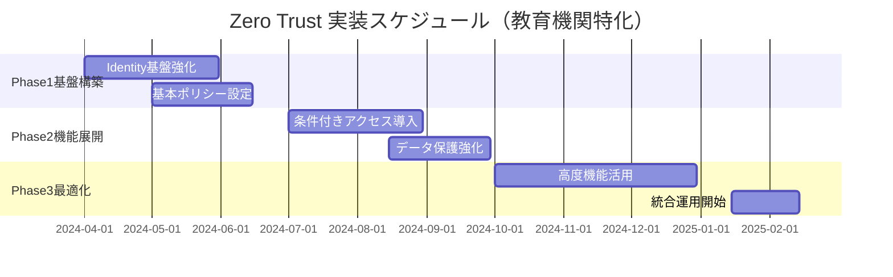
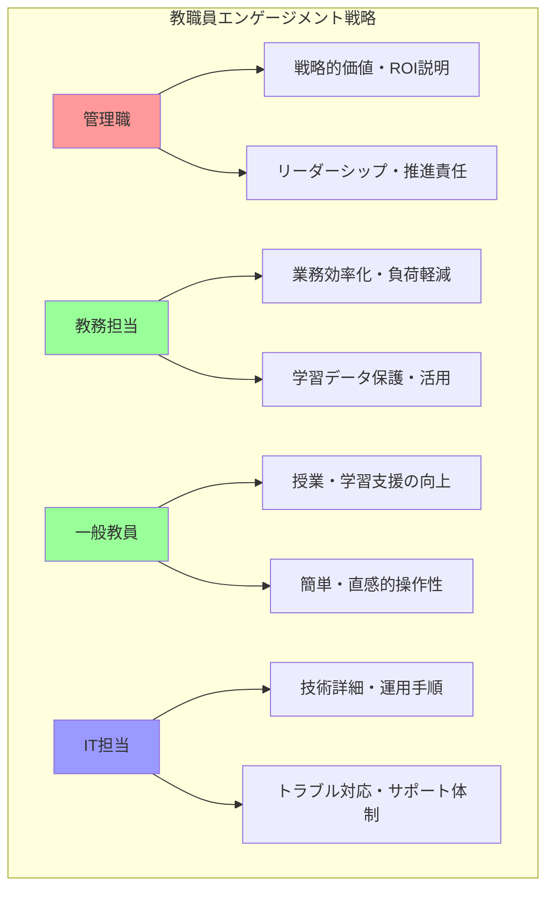
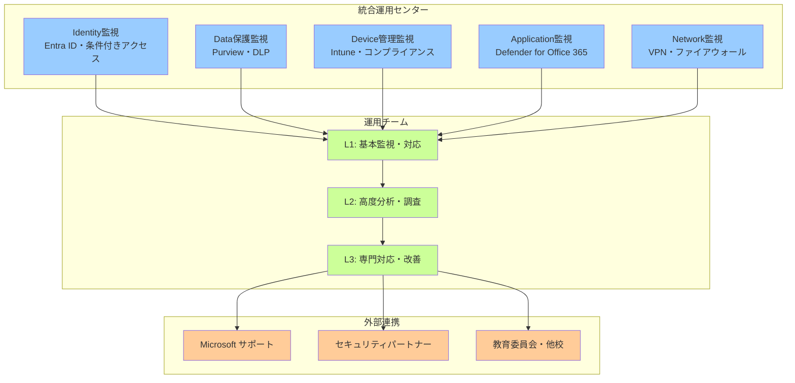
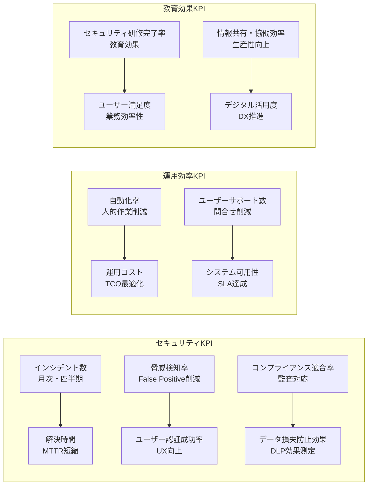

# Zero Trust 実装プロジェクトの戦略的計画

NIST Zero Trust Architecture SP 800-207 では、Zero Trust 実装を「一度の大規模変更」ではなく、**段階的で継続的なプロセス**として捉えています。教育機関では、特有の制約（予算・人員・教育カレンダー・多様なステークホルダー）を考慮した戦略的アプローチが不可欠です。

## NIST Zero Trust 実装の戦略的アプローチ

NIST SP 800-207 では、Zero Trust を「一度の大規模システム更新」ではなく、**既存環境を段階的に変革する継続的プロセス**として定義しています。教育機関では特に、学習活動への影響を最小限に抑えながら、確実にセキュリティレベルを向上させる戦略的アプローチが重要です。

### 段階的実装による戦略的展開

教育機関でのZero Trust実装は、**3つのフェーズ**に分けて段階的に進めることで、リスクを最小化しながら着実にセキュリティレベルを向上させます。各フェーズでは具体的な成果目標を設定し、次フェーズへの移行条件を明確化することが重要です。

**フェーズ1: 基盤構築**
- **Identity 基盤強化**：Microsoft Entra ID による統一認証基盤
- **デバイス登録・管理**：Microsoft Intune による基本デバイス管理
- **基本ポリシー設定**：最小権限アクセスの段階的導入
- **教職員への基礎教育**：Zero Trust 概念・必要性の理解促進

**フェーズ2: 核心機能展開**
- **条件付きアクセス本格導入**：リスクベースアクセス制御の実装
- **データ保護強化**：Microsoft Purview による情報保護ポリシー
- **脅威検出・対応**：Microsoft Defender によるセキュリティ監視
- **A3/A5 差別化活用**：ライセンスレベルに応じた機能最適化

**フェーズ3: 高度化・最適化**
- **AI・機械学習活用**：A5 の高度分析機能による自動化
- **統合運用センター**：全要素の一元的監視・管理体制
- **継続的改善**：運用データに基づく継続的最適化
- **組織全体への浸透**：Zero Trust 文化の完全な定着

### パイロット実証による効果検証

組織全体への展開前に、**限定された範囲でのパイロット実装**により効果と課題を検証することで、本格展開時のリスクを大幅に軽減できます。教育機関では、学習活動への影響を最小化しながら、最大の学習効果を得られる対象選定が重要です。

**パイロット対象選定戦略**
- **管理部門先行**：IT リテラシーが高く、変更受容性の高い部署
- **重要度の高い校務系**：個人情報・機密情報を扱う業務から優先実装
- **技術的制約の少ない領域**：既存システム依存度の低い業務から開始
- **成功事例の可視化**：効果の明確な領域での実証によるモメンタム創出

## 教育機関特有の実装制約・配慮事項

教育機関でのZero Trust実装は、一般企業とは異なる**特有の制約・配慮事項**を考慮する必要があります。教育活動の継続性確保、限られた予算・人材、多様なステークホルダーへの配慮を両立させながら、効果的なセキュリティ強化を実現する戦略的アプローチが求められます。

### 教育カレンダー対応戦略

教育機関での実装スケジュールは、**学期・入試・行事等の教育カレンダー**と密接に連動させる必要があります。学習活動への影響を最小化し、教職員の研修時間を確保するため、休暇期間を戦略的に活用した段階的実装が重要です。

**学期スケジュールとの調和**

**実装タイミングの戦略的選択**
- **春季休暇（3-4月）**：基盤構築・大規模設定変更の実施
- **夏季休暇（7-8月）**：教職員研修・システム更新の集中実施
- **冬季休暇（12-1月）**：中間評価・設定調整・最適化作業
- **学期中**：影響度の低い段階的調整・監視強化にとどめる

### 予算・人員制約での効率的実装

教育機関では**限られた予算・IT人材**の制約下で、最大限の効果を実現する必要があります。一般企業のような段階的なライセンス投資は現実的でないため、選択したライセンス（A3またはA5）内で最大限の活用を図る戦略が重要です。

**現実的な実装戦略**
- **トータルコスト評価**：ライセンス費用＋運用コストでの総合的な比較検討
- **A3リスク軽減策の実現可能性評価**：手動運用・外部連携・教育強化等の対応策実施可能性
- **外部連携・共同調達**：教育委員会・他校との連携による調達効率化
- **人材育成重視**：限られた人材のスキル向上による運用効率化

**A3/A5選択での運用コスト比較検討**
- **A3選択時の追加運用コスト**：手動ログレビュー・外部脅威情報・高頻度教育・専門人材確保
- **A5選択時の運用効率化**：AI自動分析・統合ダッシュボード・自動対応による人的コスト削減
- **リスク軽減策の実施体制**：A3制約を補完する運用体制・外部連携の構築可能性
- **長期的TCO評価**：初期ライセンス差額と運用コスト差の中長期的な総合評価

### 多様なステークホルダーへの配慮

**段階的コミュニケーション戦略**

**教職員層別アプローチ**
- **管理職**：経営戦略・リスク管理観点でのZero Trust必要性説明
- **教務・校務担当**：業務効率向上・セキュリティ強化の具体的効果
- **一般教職員**：日常業務での変化・利便性向上に焦点
- **IT担当者**：技術詳細・実装手順・運用方法の詳細説明

## A3/A5 選択・移行戦略

A3とA5の選択は、単なるライセンス費用の比較ではなく、**組織のリスクレベル・運用能力・トータルコスト**を総合的に評価して決定する戦略的判断です。特に教育機関では、限られた予算内で最大限のセキュリティ効果を実現するため、慎重な評価と現実的な実装計画が重要です。

### リスクベース ライセンス選択

**組織リスク評価マトリクス**

| リスク要因 | A3適用可能 | A5移行推奨 | 評価基準 |
|-----------|------------|------------|----------|
| 個人情報取扱規模 | 小・中規模校 | 大規模校・教育委員会 | 生徒数・データ量 |
| 外部連携度 | 限定的連携 | 多機関連携 | 他校・自治体・企業との連携頻度 |
| コンプライアンス要件 | 基本要件 | 高度要件 | 法的要件・監査基準 |
| IT人材・運用能力 | 限定的 | 充実 | 専任IT人材・外部連携体制 |

### 段階的移行戦略

**A3 → A5 移行判断フレームワーク**

**定量的評価指標**
- **セキュリティインシデント発生率**：月次・四半期評価
- **ユーザー満足度**：業務効率・システム使いやすさ
- **運用コスト**：人件費・外部委託費・システム運用費
- **コンプライアンス適合度**：監査結果・法的要件充足度

**移行タイミング判断**
1. **A3 機能限界の明確化**：具体的制約・課題の特定
2. **A5 導入効果の定量化**：投資対効果・改善効果の算出
3. **組織準備度の評価**：変更受容性・運用体制の整備状況
4. **予算・スケジュールの最適化**：財政状況・実装スケジュールとの整合

# 変更管理・組織変革戦略

Zero Trust 導入は技術的変更だけでなく、**組織文化・業務プロセスの根本的変革**を伴います。教育機関では、多様なステークホルダーの理解と協力を得ながら、段階的な組織変革を実現する戦略が重要です。

## Zero Trust 組織変革の戦略的アプローチ

Zero Trust は技術導入だけでなく、**組織全体の意識・行動・文化の変革**を必要とします。「何も信頼しない」という原則を組織に浸透させるには、段階的なアプローチで理解促進→行動変容→文化定着のプロセスを経る必要があります。教育機関では特に、教育現場の多様性を考慮した柔軟な変革戦略が重要です。

### セキュリティ文化醸成戦略

従来の「境界防御への信頼」から**「継続的検証の習慣化」**への意識転換は、組織文化の根本的変革を伴います。教育機関では、教職員・学習者・保護者という多様な関係者が関わるため、それぞれの立場・理解度に応じた段階的なアプローチが必要です。

**「何も信頼しない」文化の段階的浸透**

**Step1: 意識変革（理解促進）**
- **現状リスクの可視化**：既存システムの脆弱性・潜在リスクの明確化
- **Zero Trust価値の実証**：パイロット実装での具体的効果・改善事例
- **成功事例の共有**：他教育機関での導入成果・ベストプラクティス
- **継続的コミュニケーション**：定期的な説明会・Q&Aセッション

**Step2: 行動変容（習慣化）**
- **業務フローの再設計**：Zero Trust 原則に基づく効率的業務プロセス
- **ツール・システムの使いやすさ向上**：ユーザビリティ重視の設計
- **インセンティブ設計**：セキュリティ行動への正のフィードバック
- **継続的研修・サポート**：スキル向上・問題解決支援体制

**Step3: 文化定着（組織DNA化）**
- **リーダーシップの体現**：管理職・リーダーによる率先垂範
- **評価・人事制度の連動**：セキュリティ意識・行動の人事評価反映
- **組織全体でのセキュリティ責任共有**：部署・個人レベルでの責任明確化
- **継続的改善文化**：現状に満足せず常に改善を追求する姿勢

### 業務プロセス再設計戦略

Zero Trust導入は、単にセキュリティ機能を追加するのではなく、**既存の業務プロセス全体を見直し、セキュリティと効率性を両立する新しいワークフロー**を構築する機会です。教育機関では、教育活動の本質を損なうことなく、むしろデジタル化によって教育効果を向上させる業務プロセス再設計が重要です。

**Zero Trust 前提での効率的業務フロー構築**

**情報共有・コラボレーションの最適化**
- **Microsoft 365 統合活用**：Teams・SharePoint・OneDriveでの安全な協働
- **外部連携の標準化**：ゲストユーザー・B2B連携の安全で効率的な手順
- **モバイル・リモートワーク対応**：場所・時間に依存しない柔軟な働き方
- **ペーパーレス化推進**：デジタル化による効率性・セキュリティ向上

## 教育機関でのステークホルダーエンゲージメント

教育機関では、**教職員・学習者・保護者・教育委員会・地域コミュニティ**という多様なステークホルダーが関わります。Zero Trust導入の成功には、それぞれの立場・関心・理解度に応じた適切なコミュニケーション戦略により、理解と協力を得ることが不可欠です。

### 教職員エンゲージメント戦略

教職員は Zero Trust 実装の**最も重要な成功要因**です。日常的にシステムを利用し、学習者への指導も行う教職員の理解と協力なしには、Zero Trust の効果は実現できません。職種・ITスキル・関心度の違いを考慮した**層別アプローチ**により、それぞれに適したメッセージと支援を提供することが重要です。

**現場教職員のZero Trust理解・協力獲得**

**職種別アプローチ**

**段階的エンゲージメント手法**
- **早期採用者の特定・活用**：変革に積極的な教職員をチャンピオンとして活用
- **小集団での実証・展開**：部署・学年単位での段階的導入・成功体験創出
- **フィードバック収集・改善**：現場意見の積極的収集・システム改善への反映
- **表彰・認知制度**：Zero Trust推進・活用で成果を上げた個人・部署の表彰

### 学習者・保護者説明戦略

学習者と保護者への説明では、**技術的詳細よりも「なぜ必要か」「どう守られるか」「どんな利点があるか」**を分かりやすく伝えることが重要です。特に個人情報保護への不安を払拭し、デジタル学習環境の安全性と教育効果を理解してもらうことで、家庭での協力も得られます。

**セキュリティ強化の必要性・効果の丁寧な説明**

**保護者向けコミュニケーション戦略**
- **個人情報保護の強化**：子どもの学習データ・個人情報の安全な管理
- **学習環境の向上**：安全で効率的なデジタル学習環境の提供
- **家庭との連携強化**：保護者ポータル・連絡システムのセキュリティ向上
- **透明性の確保**：データ利用方針・セキュリティ対策の明確な説明

### 教育委員会・地域連携戦略

単独校での Zero Trust 実装は限界があるため、**教育委員会主導での統一的な推進と地域全体での連携**が効果的です。複数校での共通調達・知識共有・専門人材の効率活用により、限られたリソースでも高いセキュリティレベルを実現できます。

**自治体レベルでのZero Trust推進・標準化**

**広域連携の戦略的価値**
- **スケールメリット**：複数校での共通調達・運用による効率化
- **知識・経験共有**：成功事例・課題解決策の組織間共有
- **専門人材の効率活用**：限られたIT人材の複数校での活用
- **標準化による一貫性**：地域全体での統一したセキュリティレベル確保

## 継続的スキル向上・組織学習戦略

Zero Trust環境は常に進化し、脅威も変化し続けるため、**一度の研修で終わりではなく継続的な学習**が不可欠です。教育機関では限られた人材で運用する必要があるため、効率的なスキル開発プログラムと、組織全体での知識共有・蓄積の仕組み構築が重要です。

### 管理者スキル向上プログラム

IT管理者は Zero Trust 環境の**守護者**として、技術的な設定・運用だけでなく、戦略的な判断・改善提案も求められます。Microsoft 365 の頻繁なアップデートと新機能リリースに対応するため、体系的かつ実践的なスキル開発プログラムが必要です。

**Zero Trust技術・運用スキルの継続的向上**

**技術スキル開発プログラム**
- **Microsoft認定資格取得支援**：MS-500・MS-101等の専門資格取得推進
- **ハンズオン研修**：実際の設定・運用を通じた実践的スキル習得
- **定期的アップデート研修**：機能更新・新技術への継続的対応
- **外部専門機関連携**：大学・研究機関での高度研修受講

### ユーザー教育プログラム

Zero Trust の成否は、**技術よりもユーザーの理解と行動**に大きく依存します。全教職員・学習者がセキュリティの重要性を理解し、日常的に実践できるよう、対象層の特性に応じた継続的な教育プログラムの実施が不可欠です。

**全教職員・学習者のセキュリティリテラシー向上**

**層別教育プログラム設計**

| 対象層 | 教育内容 | 実施方法 | 頻度 |
|--------|----------|----------|------|
| 管理職 | Zero Trust戦略・ROI・リーダーシップ | 役員研修・外部セミナー | 四半期 |
| 教職員 | 日常業務でのセキュリティ実践 | オンライン研修・職員会議 | 月次 |
| 学習者 | デジタルシチズンシップ・情報モラル | 授業・HR活動 | 週次 |
| 保護者 | 家庭での情報セキュリティ | 保護者会・オンライン説明会 | 学期毎 |

### 外部専門家連携体制

教育機関単独では、**急速に進化する脅威・技術への対応に限界**があります。大学・研究機関の知見、セキュリティ企業の専門性、Microsoft の技術支援を効果的に組み合わせることで、限られた内部リソースでも高度なセキュリティ体制を実現できます。

**大学・研究機関・セキュリティ企業との協力体制**

**連携領域と効果**
- **最新技術・脅威情報**：研究機関からの最新セキュリティ動向情報
- **高度人材育成**：大学院・専門課程での高度IT人材育成連携
- **共同研究・実証実験**：教育機関特有のセキュリティ課題研究
- **地域セキュリティ向上**：地域全体でのサイバーセキュリティレベル向上

# 運用・モニタリング・継続改善戦略

Zero Trust の真価は「導入」ではなく「継続的運用・改善」で発揮されます。教育機関では限られたリソースで効率的な運用体制を構築し、環境変化・脅威進化に継続的に対応する戦略が不可欠です。

## Zero Trust 運用体制の確立

Zero Trust は「導入したら終わり」ではなく、**継続的な運用・監視・改善**によって初めて効果を発揮します。教育機関では限られた人員で、Identity・Data・Network・Device・Application の5つの要素を統合的に管理する効率的な運用体制の構築が不可欠です。

### 統合運用センター構築戦略

従来の個別システム監視から、**Zero Trust の5要素を統合的に監視・制御する運用センター**への転換が必要です。教育機関では大規模SOCは現実的でないため、Microsoft 365の統合ダッシュボードと自動化機能を最大限活用し、少人数でも効果的な監視を実現する戦略が重要です。

**Identity・Data・Network・Device・Application の一元監視**

**教育機関版SOC（Security Operations Center）設計**

**運用効率化のための自動化戦略**
- **定型監視の自動化**：アラート・レポート生成・初期対応の自動実行
- **インシデント対応の標準化**：プレイブック・ランブックによる一貫した対応
- **予防的メンテナンス**：定期的なヘルスチェック・最適化作業の自動化
- **AI活用による高度分析**：A5のAdvanced Analytics機能による異常検知

### エスカレーション体制構築

教育機関では専門 IT 人材が限られるため、**問題の緊急度・影響度に応じた適切なエスカレーション経路**の明確化が重要です。初期対応から専門家支援まで、誰が・いつ・どのように対応するかを事前に定義し、迅速かつ効率的な問題解決を実現します。

**インシデント・問題の適切な対応手順**

**段階的エスカレーション設計**

| レベル | 対応者 | 対応時間 | 対応範囲 | エスカレーション条件 |
|--------|--------|----------|----------|---------------------|
| L1 | 一般IT担当者 | 即座〜30分 | 基本的な問い合わせ・既知問題 | 解決困難・影響度大 |
| L2 | シニアIT管理者 | 30分〜2時間 | 高度技術問題・構成変更 | 専門知識要求・システム影響 |
| L3 | 外部専門家・Microsoft | 2時間〜1日 | システム障害・セキュリティ事故 | 組織影響・法的対応要求 |

## 継続的監視・効果測定

Zero Trust の効果を**数値化・可視化**することで、投資対効果の証明と継続的改善の指針を得られます。教育機関では、セキュリティ強化だけでなく、教育活動への貢献度も含めた総合的な効果測定により、関係者の理解と支持を獲得することが重要です。

### KPI・メトリクス設定

適切な KPI 設定により、Zero Trust 実装の**進捗・効果・課題を客観的に把握**できます。教育機関では、技術的指標だけでなく、教育活動への影響、ユーザー満足度、運用効率など多面的な指標を設定し、バランスの取れた評価を行うことが重要です。

**Zero Trust 効果の定量的評価指標**

**セキュリティ効果指標**

### セキュリティダッシュボード構築

複雑な Zero Trust 環境を**一目で把握できるダッシュボード**は、迅速な意思決定と問題対応に不可欠です。Microsoft 365 の各種レポート機能を統合し、役割別（経営層・運用担当者）に最適化された情報提示により、それぞれが必要とする洞察を効率的に提供します。

**リアルタイムでのセキュリティ状況可視化**

**経営層向けダッシュボード**
- **リスク概況**：組織全体のセキュリティリスクレベル・トレンド
- **投資効果**：Zero Trust 投資に対する定量的効果・ROI
- **コンプライアンス状況**：法的要件・監査基準への適合状況
- **将来予測**：脅威動向・必要な追加投資・対策の予測

**運用担当者向けダッシュボード**
- **リアルタイム監視**：現在のセキュリティ状況・アラート状況
- **インシデント管理**：対応中・未対応インシデントの一元管理
- **パフォーマンス監視**：システム性能・ユーザー体験の監視
- **改善提案**：データ分析に基づく設定最適化・改善提案

## 第7章まとめ：実装成功への道筋

本章では、教育機関における Zero Trust 実装を成功に導くための包括的な戦略とプロジェクト管理手法を解説しました。

### 実装成功の鍵となる要素

**1. 段階的・戦略的実装アプローチ**
- 教育カレンダーと調和した計画的実装
- パイロット実証による効果検証と課題抽出
- A3/A5 選択におけるトータルコスト評価の重要性

**2. 組織変革と人材育成**
- 技術導入以上に重要な組織文化の変革
- 多様なステークホルダーへの層別アプローチ
- 継続的学習と外部連携による専門性確保

**3. 効率的な運用体制構築**
- 限られた人員での統合運用センター実現
- 自動化と Microsoft 365 機能の最大活用
- 明確なエスカレーション体制による迅速な問題解決

**4. 継続的改善サイクル**
- KP Iによる効果の定量化と可視化
- 役割別ダッシュボードによる意思決定支援
- データに基づく継続的な最適化

### 教育機関特有の成功要因

教育機関での Zero Trust 実装は、一般企業とは異なる**特有の制約と機会**があります：

**制約への対応**
- 限られた予算・人材での実現方法
- 教育活動への影響最小化
- 多様な利用者層への配慮

**機会の活用**
- 教育委員会・他校との連携によるスケールメリット
- 長期休暇を活用した計画的実装
- デジタルネイティブ世代の学習者の理解と協力

### 実装開始への第一歩

Zero Trust 実装は長い旅路ですが、**最初の一歩を踏み出すことが最も重要**です：

1. **現状評価**: 既存環境のリスク評価とギャップ分析
2. **ビジョン策定**: 組織に適した Zero Trust ゴールの設定
3. **チーム編成**: 推進チームの組成と役割分担
4. **パイロット計画**: 小規模での実証開始
5. **継続的学習**: Microsoft Learn 等を活用したスキル向上

教育機関の未来を守る Zero Trust 実装は、技術的な取り組みであると同時に、組織全体での意識改革と継続的な努力を必要とします。本章で示した戦略的アプローチにより、限られたリソースでも着実に、そして効果的にZero Trust環境を実現できることでしょう。