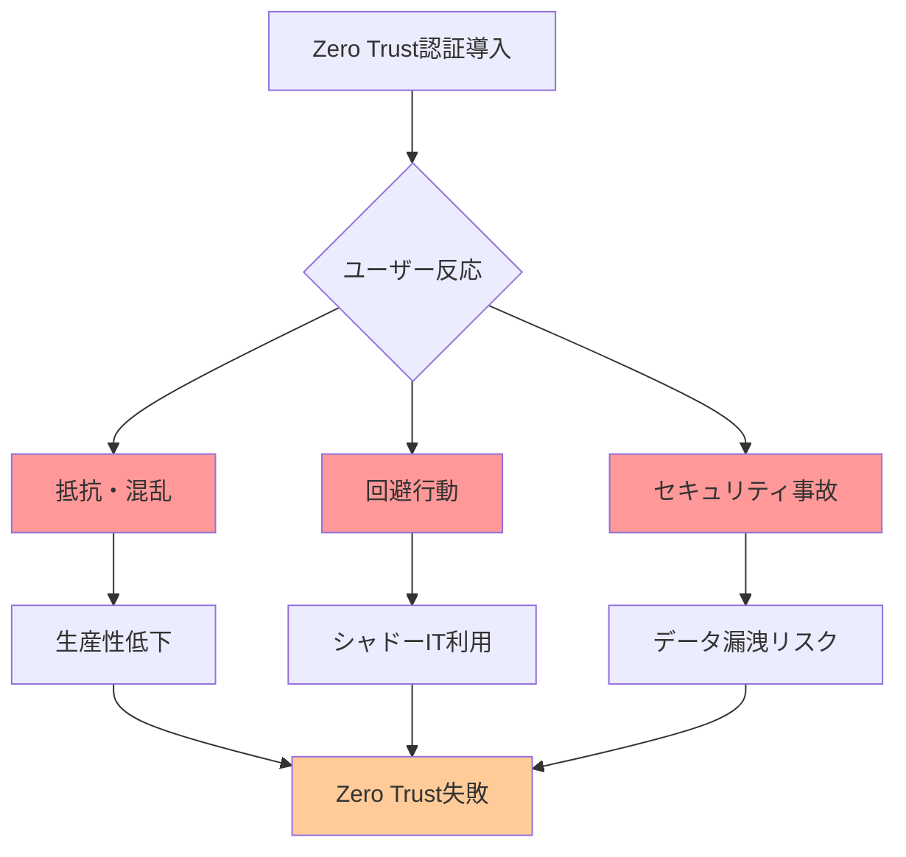
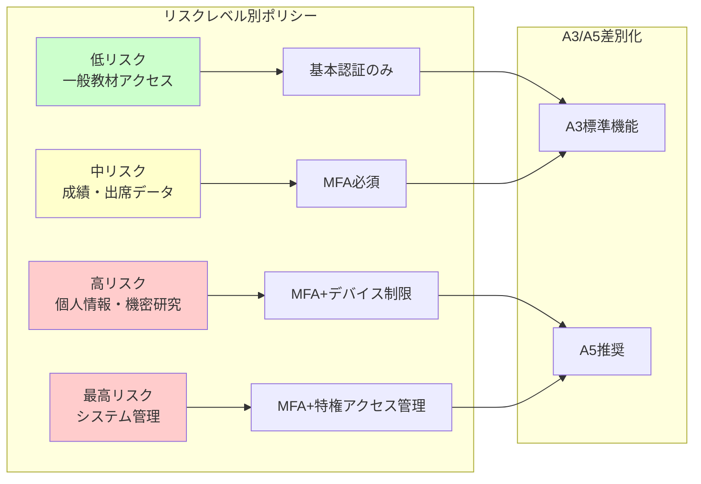
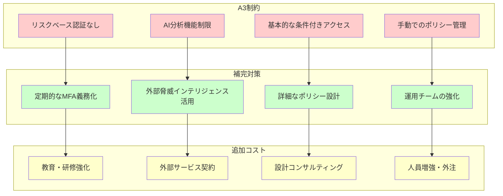
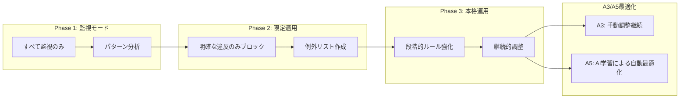
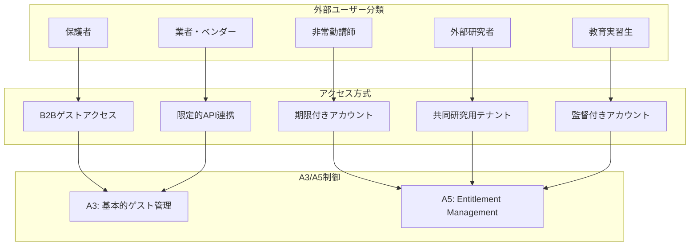
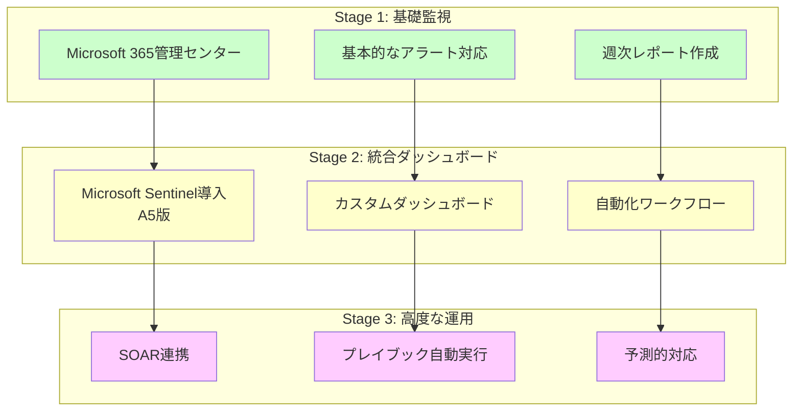
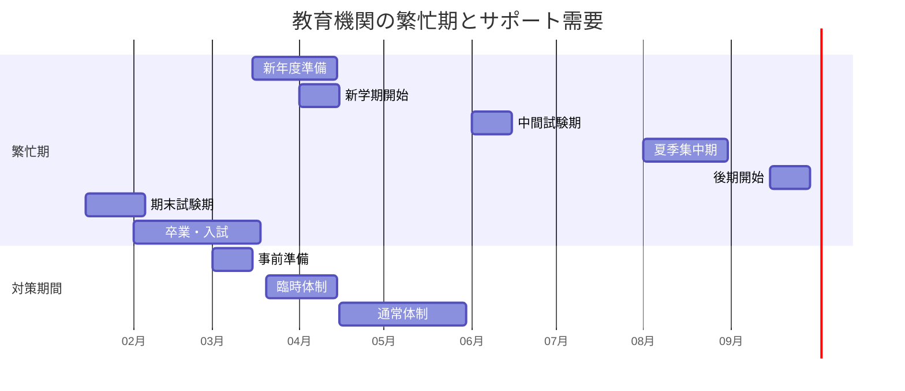
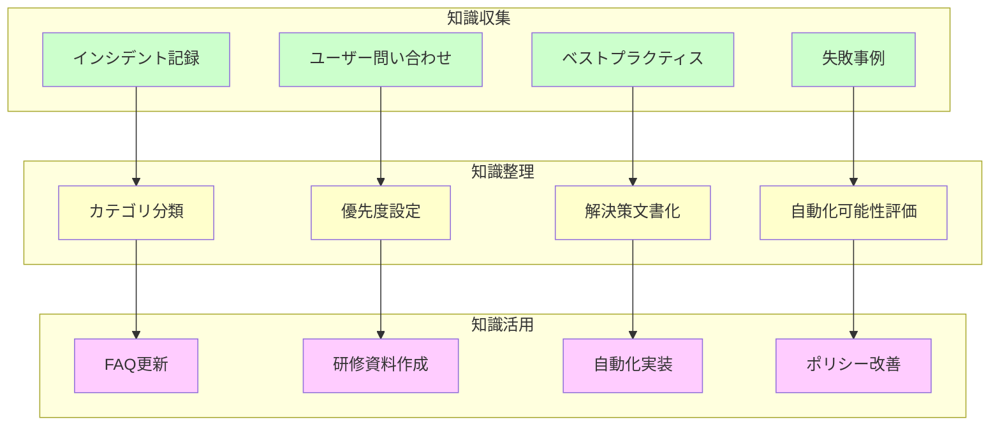

# Zero Trust Identity 課題の戦略的解決

Zero Trust 実装後、多くの教育機関が直面するのは **Identity 管理の複雑性**です。「何も信頼しない」原則は理想的ですが、教育現場の多様性・柔軟性要求との両立は容易ではありません。本章では、実際の運用で発生する課題とその根本原因を分析し、A3/A5 それぞれでの現実的な解決策を提示します。

## 認証問題の根本原因分析・戦略的対応

認証システムの課題は **技術的問題よりも人的・組織的要因**に起因することが多く、表面的な対症療法では根本解決に至りません。システムとしては完璧に動作していても、ユーザーの理解不足や運用プロセスの不備により深刻な問題が生じるため、技術導入と並行した包括的なアプローチが不可欠です。

### ユーザー教育・変更管理の不足による課題

教育機関での Zero Trust Identity 運用における最大の課題は、**技術ではなく人の問題**です。

**典型的な課題パターン**

Zero Trust 導入時、ユーザーの反応は予想以上にネガティブになることが多く、適切な対策なしには **導入失敗に直結**します。以下のフローは、多くの教育機関で観察される失敗への道筋を示しています。

**根本原因と対策**

課題の根本には、**技術的な問題よりも組織的・人的要因**が存在します。これらの原因を正しく理解し、ライセンスレベルに応じた適切な対策を講じることで、スムーズな Zero Trust 移行が可能になります。

| 根本原因 | 具体的症状 | A3での対策 | A5での追加対策 |
|----------|------------|------------|----------------|
| Zero Trust概念の理解不足 | 「なぜこんなに面倒なのか」という不満 | 基本的な説明会・FAQ作成 | AI活用による個別サポート |
| 従来方式への執着 | 「前のやり方の方が良かった」という抵抗 | 段階的移行・並行運用期間 | 適応型認証による負担軽減 |
| ITスキルの格差 | 若手と年配教職員の理解度差 | 層別研修・個別サポート | ユーザー行動分析による支援 |
| 変更への恐怖 | 「間違えたら大変」という不安 | 安全なテスト環境提供 | リスクベース認証での柔軟対応 |

### 多要素認証（MFA）導入の課題と対策

MFA は Zero Trust の基本中の基本ですが、教育機関では **ユーザーの多様性が最大の障壁**となります。技術的に最適な方式が、必ずしも全ユーザーに適さないという現実を踏まえ、段階的かつ柔軟な導入戦略が不可欠です。

**年齢・ITスキル差への配慮**

教育機関では、20代の新任教員から70代の非常勤講師まで、**幅広い年齢層**が同じシステムを利用します。

**段階的MFA展開戦略**

「全員一斉導入」は失敗の元です。ユーザーの **技術習熟度に応じた3段階アプローチ**により、抵抗感を最小化しながら確実にセキュリティレベルを向上させます。各段階で十分な習熟期間を設け、次段階への移行は強制ではなく推奨とすることが重要です。

1. **第1段階：SMS 認証導入**
   - 最も簡単で理解しやすい方式
   - 携帯電話があれば誰でも利用可能
   - A3 環境での標準アプローチ

2. **第2段階：Authenticator アプリ移行**
   - スマートフォン所有者から順次移行
   - アプリ設定サポートの充実
   - QR コード活用による簡易設定

3. **第3段階：パスワードレス認証（A5）**
   - Windows Hello・生体認証活用
   - FIDO2 セキュリティキー導入
   - 最も安全で使いやすい認証実現

**サポート体制の構築**

MFA導入の成否は **サポート体制の充実度**に直結します。技術的な問題解決だけでなく、ユーザーの不安を取り除き、自信を持って利用できるようになるまでの継続的支援が必要です。限られたIT人員でも効果的なサポートを実現する工夫が求められます。

- **ヘルプデスク強化**：MFA専門サポート窓口
- **ピアサポート**：IT得意な教職員による相互支援
- **動画マニュアル**：視覚的に分かりやすい手順説明
- **緊急時バックアップ**：一時的なバイパス手順の確立

## 条件付きアクセス運用での戦略的課題解決

条件付きアクセスは Zero Trust の中核機能ですが、教育機関では **過度に厳格でも緩すぎてもいけない**という難しさがあります。教育・研究の自由と情報セキュリティの両立を実現するには、きめ細かいポリシー設計と継続的な調整が不可欠です。

### ポリシー設計の複雑性への対応

教育機関の条件付きアクセスポリシーは、**セキュリティと利便性の微妙なバランス**が求められます。

**教育現場特有の考慮事項**
- **授業での柔軟性確保**：突発的な外部講師・ゲスト参加への対応
- **研究活動の自由度**：24時間アクセス・海外からのアクセス要件
- **BYOD環境対応**：多様なデバイス・OSへの対応
- **家庭学習支援**：家庭ネットワークからの安全なアクセス

**バランス設計のベストプラクティス**

### 緊急時アクセス確保戦略

Zero Trust の「何も信頼しない」原則は重要ですが、**緊急時には教育活動の継続が最優先**となります。セキュリティを維持しつつ迅速に対応モードを切り替える仕組みを事前に準備することで、想定外の事態でも教育を止めない体制を実現できます。

**災害・感染症等での業務継続性確保**

2020年以降のパンデミック経験から、**緊急時の柔軟性**は教育機関にとって必須要件となりました。

**緊急時対応フレームワーク**

緊急時対応は「いざという時に考える」のではなく、**平時に詳細まで計画しておく**ことが成功の鍵です。以下の3段階フレームワークにより、混乱を最小限に抑えながら、必要なアクセスを確保し、事後のリスクも適切に管理できます。

1. **事前準備**
   - 緊急時ポリシーの事前定義
   - 承認権限者の明確化
   - 切り替え手順の文書化

2. **緊急時発動**
   - 一時的なポリシー緩和
   - 代替認証手段の有効化
   - 監査ログの強化

3. **事後対応**
   - 通常ポリシーへの復帰
   - アクセスログのレビュー
   - 不正アクセスの確認

**A3での緊急時対応**
- 基本的な条件付きアクセスの一時的無効化
- 管理者による手動での例外設定
- 事後の手動ログレビュー

**A5での高度な緊急時対応**
- リスクベース条件付きアクセスの自動調整
- AI によるアノマリー検知継続
- 自動化された事後分析・レポート

### BYOD・家庭環境への対応戦略

**多様なデバイス・ネットワーク環境での安全確保**

原則として**学校支給の Intune管 理端末の使用**が基本ですが、緊急時対応、端末故障、非常勤講師の一時利用など、やむを得ず BYOD 端末を使用せざるを得ない場面が存在します。このような場合でも、最低限のセキュリティを確保しながら教育活動を継続できる**段階的な制御戦略**が必要です。

**デバイス信頼レベル別アクセス制御**

| デバイスタイプ | 信頼レベル | アクセス可能リソース | 必要な制御 |
|---------------|------------|---------------------|------------|
| 組織管理PC | 高 | すべてのリソース | 基本的な条件付きアクセス |
| Intune登録BYOD | 中-高 | 業務データ・アプリ | アプリ保護ポリシー |
| 未管理BYOD | 低-中 | Web版アプリのみ | ダウンロード禁止・セッション制限 |
| 公共/共有PC | 低 | 限定的リソース | 短時間セッション・キャッシュ無効化 |

## A3/A5 別：Identity課題解決戦略の差異

### A3 環境での制約と現実的対応

A3 環境では高度な機能が制限されるため、**運用の工夫と人的対応**で補完する必要があります。

**A3 での課題と対策マトリクス**

A3 の機能制約は避けられませんが、**運用の工夫と追加投資**により相当程度カバー可能です。以下の図は、A3 制約がもたらす課題と、それに対する補完策、さらに補完策実施に必要な追加コストの関係を示しています。重要なのは、これらの追加コストを含めた**トータルでの A3/A5 比較**です。

### A5 環境での高度活用戦略

A5 では、**AI・機械学習**を活用した自動化により、運用負荷を大幅に軽減できます。

**A5高度機能の活用例**
- **リスクベース認証**：ユーザー行動パターン学習による動的認証
- **Identity Protection**：漏洩資格情報の自動検知・対応
- **Privileged Identity Management**：特権アクセスの Just-in-Time 管理
- **Access Reviews**：定期的なアクセス権限の自動レビュー

### 段階的移行判断基準

**A3 から A5 への移行タイミング**

| 判断要因 | A3継続の条件 | A5移行推奨の条件 |
|----------|--------------|------------------|
| インシデント発生率 | 月1件未満 | 月3件以上 |
| 運用工数 | 週40時間未満 | 週40時間以上 |
| ユーザー数 | 1,000名未満 | 3,000名以上 |
| 外部連携数 | 10組織未満 | 30組織以上 |
| コンプライアンス要件 | 基本的要件のみ | 高度な監査要件 |

# Zero Trust Data Protection 課題の戦略的解決

データ保護は教育機関にとって**最も繊細なバランス**が求められる領域です。学習の自由度を保ちながら、個人情報を確実に保護する必要があります。

## DLP・データ分類の運用課題と対策

DLP（Data Loss Prevention）は情報漏洩を防ぐ重要な機能ですが、教育機関では　**「正当な教育活動」と「情報漏洩」の境界が曖昧**　になりがちです。過度に厳格な設定は教育効果を損ない、緩すぎる設定はセキュリティリスクを高めるため、教育現場の実情を深く理解した調整が不可欠です。

### 誤検知・過検知問題への対応

教育現場では、**正当な教育活動が誤ってブロック**される問題が頻発します。

**教育現場特有の誤検知パターン**
- **模擬データの誤検知**：情報授業での仮想個人情報の利用
- **研究データの過剰保護**：学術論文の外部共有制限
- **教材共有の阻害**：正当な教材配布のブロック
- **学生作品の制限**：プログラミング課題提出の妨害

**段階的な最適化アプローチ**

DLP導入で最も重要なのは　**「いきなり完璧を目指さない」**　ことです。まず監視モードで教育現場の実際のデータ利用パターンを把握し、段階的にブロック機能を有効化していくアプローチにより、教育活動を妨げることなく効果的な保護を実現できます。

### データ分類の複雑性解決

**教育機関特有の情報分類基準**

一般企業の「機密・社外秘・公開」という単純な分類では、教育機関の多様なデータを適切に管理できません。**学習・研究・校務・個人情報**が複雑に絡み合う教育データには、その特性を理解した独自の分類体系と、A3/A5それぞれでの現実的な保護手段の組み合わせが必要です。

| データカテゴリ | 機密レベル | 具体例 | A3での保護 | A5での追加保護 |
|---------------|------------|---------|------------|----------------|
| 個人識別情報 | 最高 | 成績・健康・家庭状況 | 暗号化・アクセス制限 | 自動分類・Rights Management |
| 研究データ | 高-最高 | 未発表研究・特許関連 | 基本的な暗号化 | Customer Key・Lockbox |
| 教材・講義資料 | 低-中 | 授業スライド・配布資料 | 基本的なアクセス制御 | 透かし・追跡機能 |
| 学生作品 | 中 | レポート・プログラム | 基本的な保護 | プライバシー保護ラベル |
| 公開情報 | 低 | シラバス・行事案内 | 最小限の制御 | 外部共有の監視 |

## 暗号化・アクセス制御の課題解決

暗号化は情報保護の基本ですが、教育機関では　**「セキュリティ向上」と「使いやすさ維持」の両立**　が特に困難です。限られた予算で調達した端末の性能制約、多様な外部ユーザーとの連携要件、レガシーシステムとの互換性など、技術的制約と教育現場の現実をバランスさせる戦略的アプローチが必要です。

### パフォーマンス影響の最小化

暗号化による**処理速度低下**は、特に古い端末を使用する教育機関では深刻な問題です。

**パフォーマンス最適化戦略**

「すべてを暗号化すれば安全」という発想では、教育現場のユーザー体験を著しく損ないます。**メリハリをつけた暗号化戦略**により、重要なデータは確実に保護しつつ、日常的な教育活動に支障をきたさないバランスを実現することが重要です。

- **選択的暗号化**：真に重要なデータのみ暗号化
- **クライアント最適化**：端末スペックに応じた設定調整
- **ネットワーク最適化**：校内ネットワークでの処理優先
- **時間帯制御**：ピーク時間を避けた重処理実行

### 外部ユーザー対応の現実的アプローチ

**保護者・非常勤職員等への配慮**

教育機関では、**多様な外部ユーザー**が関与するため、画一的なアクセス制御は困難です。

**外部ユーザータイプ別対応策**

教育機関の外部ユーザーは、**アクセス期間・必要な権限・ITスキルレベル**がそれぞれ大きく異なります。一律的な管理では、必要以上に厳しい制限で教育活動を阻害するか、または緩すぎる設定でセキュリティリスクを招くため、ユーザータイプごとの特性に応じた適切なアクセス制御の設計が重要です。

## 教育現場でのデータ保護バランス戦略

データ保護の究極の目的は　**「教育活動を安全に継続すること」**　です。保護のために教育効果が損なわれては本末転倒となります。特に創造性・協働学習・研究活動といった教育の本質的な価値を尊重しながら、同時に個人情報・機密情報を確実に守る高度なバランス感覚が求められます。

### 学習活動への配慮

**創造性・協働学習を阻害しない設計**

過度なセキュリティ制御は、**教育の本質を損なう**リスクがあります。

**教育効果とセキュリティのバランス指針**
1. **基本原則**：教育活動を優先し、リスクレベルに応じた段階的制御
2. **柔軟性確保**：教員判断での一時的な制限解除機能
3. **事後監査**：制限緩和よりも監視強化でリスク管理
4. **教育的価値**：セキュリティ教育の機会として活用

### 法的要件との両立戦略

**個人情報保護法・教育関連法令への対応**

日本の教育機関は、複数の法的要件を**同時に満たす**必要があります。

| 法的要件 | 要求事項 | A3での対応 | A5での高度対応 |
|----------|----------|------------|----------------|
| 個人情報保護法 | 適切な安全管理措置 | 基本的な暗号化・アクセス制御 | 包括的なコンプライアンスセンター |
| 学校教育法 | 成績等の適切な管理 | 手動での管理記録 | 自動監査証跡 |
| 著作権法（授業目的） | 適切な利用範囲管理 | 利用規約での制限 | DRMによる技術的制御 |
| 児童福祉法 | 要保護情報の厳格管理 | 特別なフォルダ管理 | 機密ラベルによる自動保護 |

# Zero Trust　統合運用・サポート戦略

Zero Trust　環境の統合運用は、限られたリソースで**5つの要素を同時に管理**する高度な挑戦です。

## 統合運用センター・SOCでの課題解決

### 複雑性管理の現実的アプローチ

**Identity・Data・Network・Device・Application統合管理**

教育機関では、大規模なSOCは現実的ではないため、**効率的な統合管理**が鍵となります。

**段階的SOC構築戦略**

教育機関では **大規模なSOCは予算的に現実的ではない**ため、既存のMicrosoft 365管理機能から始めて段階的に高度化していくアプローチが効果的です。各段階で確実に運用を定着させてから次のレベルに進むことで、無理のない範囲で着実にセキュリティ運用能力を向上させることができます。

### スキル・人材不足への対応

**限られたIT人材での専門知識習得**

教育機関では限られた予算と人員で、Zero Trust という高度な技術領域をカバーする必要があります。全員がすべての分野のエキスパートになることは現実的ではないため、**戦略的な人材配置と外部リソース活用**により、実効性のある運用体制を構築することが重要です。

教育機関のIT部門は通常**2-5名程度**で、Zero Trust全領域の専門性を持つことは困難です。

**現実的な人材戦略**
1. **コア人材育成**：1-2名をZero Trust専門家として集中育成
2. **外部連携活用**：Microsoft FastTrack・パートナー支援の最大活用
3. **自動化推進**：人的対応を最小化する自動化投資
4. **知識共有**：他校とのコミュニティ形成・ノウハウ共有

## 教育機関特有のサポート課題解決

教育機関のサポート業務は、**多様なユーザー層への同時対応**と **季節的な負荷変動**という、一般企業にはない独特の難しさがあります。年齢・ITスキル・利用頻度が大きく異なる利用者に対し、限られた人員で統一的なサービス品質を提供するには、戦略的なサポート設計が不可欠です。

### 多様なユーザー層への対応

**年齢・ITスキルレベル差への配慮**

教育機関では新任教員からベテラン教職員、学習者から保護者まで、**ITスキルと対応期待が全く異なる**利用者が混在します。一律的なサポートでは、ある層には過剰で別の層には不十分となるため、利用者特性に応じたサポート方式の使い分けが成功の鍵となります。

| ユーザー層 | 特性 | サポート方式 | A3/A5での工夫 |
|------------|------|--------------|---------------|
| 若手教職員 | デジタルネイティブ・自己解決志向 | FAQ・動画マニュアル | A3: 基本的なドキュメント A5: AIチャットボット |
| ベテラン教職員 | 対面サポート選好・詳細説明要求 | 対面研修・電話サポート | A3: 定期研修会 A5: パーソナライズ支援 |
| 学習者 | 即時解決要求・SNS的対応期待 | チャット・モバイル対応 | A3: 基本的なチャット A5: 24時間AIサポート |
| 保護者 | 限定的IT知識・プライバシー重視 | 簡潔な説明・安心感重視 | A3: 定型FAQ A5: 自動応答システム |

### 季節性・繁忙期対応

**教育機関特有の繁忙期パターン**

教育機関のIT需要は **学事暦と密接に連動**し、新学期・試験期・長期休暇等で劇的に変化します。通年で均等な負荷を想定した一般企業の運用体制では、ピーク時にサービス品質が著しく低下するため、教育機関の特性を理解した計画的な体制調整が不可欠です。

**繁忙期対策**
- **事前準備**：予想される問題の事前対応・FAQ更新
- **臨時増強**：外部サポート・学生アルバイト活用
- **自動化強化**：定型作業の自動化・セルフサービス拡充
- **優先度管理**：クリティカル問題への集中対応

## 継続的改善・知識蓄積戦略

Zero Trust 運用の成功には、**失敗・課題から学ぶ仕組み**が不可欠です。教育機関では一般企業と異なる課題パターンが存在するため、他校の事例を含めた知識の蓄積・共有により、同じ問題を繰り返すことなく、より効果的な運用体制を構築することが重要です。

### インシデント分析による予防的対策

**問題の根本原因分析フレームワーク**

| インシデントタイプ | 頻度 | 根本原因 | 予防策（A3） | 予防策（A5） |
|-------------------|------|----------|-------------|-------------|
| パスワードリセット | 高 | 複雑性要件・忘却 | SSPR有効化 | パスワードレス移行 |
| アクセス拒否 | 中 | ポリシー設定ミス | 定期レビュー | ポリシーシミュレーション |
| データ漏洩未遂 | 低 | ユーザーミス | 教育強化 | DLP自動ブロック |
| 不正アクセス試行 | 中 | 資格情報漏洩 | MFA義務化 | リスクベース認証 |

### 知識ベース構築戦略

**教育機関特有の課題・解決策の体系化**

## 第8章まとめ：課題解決の実践的アプローチ

Zero Trust 運用での課題は避けられませんが、**体系的なアプローチ**により確実に解決できます。

### 課題解決の基本原則

1. **根本原因の特定**：表面的な症状ではなく真の原因を追求
2. **段階的アプローチ**：完璧を求めず、継続的改善を重視
3. **A3/A5 の使い分け**：ライセンスレベルに応じた現実的対策
4. **人とプロセスの重視**：技術だけでなく組織的対応を強化

### 成功のための重要ポイント

第8章で詳述した課題解決戦略を成功に導くためには、**3つの重要領域での重点的取り組み**が不可欠です。技術的な完璧さよりも、教育現場の実情に即した実践的なアプローチを継続することで、Zero Trust環境での安定した運用を実現できます。各領域での具体的なポイントを理解し、優先順位をつけて段階的に取り組むことが成功への近道となります。

**Identity課題**
- ユーザー教育と変更管理が最重要
- 多要素認証は段階的に展開
- 緊急時対応手順の事前準備

**Data Protection課題**
- 誤検知を恐れず監視モードから開始
- 教育活動とのバランスを常に考慮
- 法的要件は最優先で対応

**運用・サポート課題**
- 完璧なSOCより実効的な統合管理
- 繁忙期を考慮した体制構築
- 知識の蓄積と共有を重視

教育機関での Zero Trust 運用は、一般企業とは異なる特有の課題がありますが、本章で示した戦略的アプローチにより、限られたリソースでも効果的な課題解決が可能です。重要なのは、完璧を求めるのではなく、**継続的な改善**を通じて、教育活動を支える安全で使いやすい環境を実現することです。