# 校務支援システム運用のためのA3/A5戦略的選択

教育機関でのMicrosoft 365 A3/A5選択は、**校務支援システムの基盤として**一度決めたら数年間変更困難な重要な戦略的判断です。校務系データの機密性・可用性要件、年度予算制度・調達プロセス・議会承認などの制約により、翌年度すぐにアップグレードすることは現実的ではありません。本章では、**校務支援システムの安全な運用を前提**とした初期選択時点での慎重な判断により、コストと運用性を総合的に最適化するアプローチを提示します。

## 校務支援システム基盤としてのMicrosoft 365要件と制約

### 校務系データ保護要件とライセンス選択の重要性

校務支援システムは**学籍管理・成績管理・出欠管理・健康管理**等の機密性の高いデータを扱うため、Microsoft 365のライセンス選択は単なるOfficeアプリケーションの利用ではなく、**教育機関の根幹業務を支えるセキュリティ基盤**の構築です。

**校務支援システムで求められるセキュリティ要件**
- **データ機密性**: 個人情報・成績情報の不正アクセス防止
- **システム可用性**: 授業・事務に影響しない安定稼働
- **監査証跡**: 法的要件に対応した操作履歴・アクセスログ
- **災害対策**: データバックアップ・事業継続性確保

### 教育機関での予算・調達制約の現実

教育機関では**年度予算制度**により、校務支援システム基盤のライセンス変更には以下の困難があります。これらの制約を前提とした初期選択戦略が不可欠です。

**予算変更の現実的制約**
- **年度予算固定**: 予算成立後の年度中変更は極めて困難
- **議会・理事会承認**: ライセンス変更には承認プロセスが必要（3-6ヶ月）  
- **調達手続き**: 公的調達では入札・契約変更に長期間が必要
- **複数年契約**: コスト削減のための複数年契約でさらに変更困難

### 「アップグレード前提」の誤解と現実的選択

**よくある誤解: 「A3から始めてA5にアップグレード」**

多くの教育機関が「まずA3で始めて、慣れたらA5にアップグレード」と考えがちですが、これは**現実的ではない**アプローチです。

```mermaid
graph TD
    subgraph Wrong["❌ 非現実的アプローチ"]
        A[A3導入]
        B[運用習熟]
        C[A5必要性認識]
        D[予算申請]
        E[承認・調達プロセス]
        F[A5移行]
        G[「2-3年後にようやく移行」]
    end
    
    subgraph Right["✅ 現実的アプローチ"]
        H[初期時点での慎重な検討]
        I[3-5年の運用シナリオ分析]
        J[A3/A5のトータルコスト比較]
        K[運用負荷・リスクの定量評価]
        L[適切なライセンス決定]
        M[長期安定運用]
    end
    
    A --> B --> C --> D --> E --> F --> G
    H --> I --> J --> K --> L --> M
    
    classDef wrong fill:#ffcccc
    classDef right fill:#ccffcc
    
    class A,B,C,D,E,F,G wrong
    class H,I,J,K,L,M right
```

### 初期選択判断のための評価フレームワーク

**3-5年運用を前提とした総合評価**

ライセンス選択は、**導入から3-5年間の継続運用**を前提として判断する必要があります。

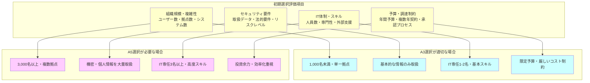

## A3での運用限界とA5の必要性判断

### A3環境での運用課題と追加コスト

A3選択時は、**機能制約による運用負荷増加**と**追加投資の必要性**を正確に把握する必要があります。

| A3制約内容 | 運用への影響 | 対応方法 | 追加コスト/年間 |
|------------|-------------|----------|----------------|
| **Microsoft Entra ID P1制限** | 高度Identity Protection機能なし | 基本条件付きアクセス＋監視強化 | ¥50万円 |
| **PIM（特権管理）なし** | 管理者権限管理手動化 | 手動ローテーション＋監査 | ¥80万円 |
| **リスクベース認証制限** | 基本MFA設定のみ | 標準MFA設定で基本対応 | 基本対応で十分 |
| **Endpoint DLP・Advanced DLP なし** | エンドポイント保護制限 | 基本DLP＋運用ルール強化 | ¥120万円 |
| **統合SIEM/SOAR機能制限** | 高度監視・自動対応制限 | 基本ログ分析＋定期確認 | ¥200万円 |
| **高度コンプライアンス機能制限** | 監査対応の人的作業増 | 手動証跡管理＋文書化 | ¥150万円 |
| **合計追加対応コスト** | - | - | **¥600万円** |

**重要**: これらは「A5と同等機能を実現する場合」の追加コストです。**A3で十分な要件の場合、多くの対応は不要**となります。

**A3選択時の隠れたコスト（2000名教育機関の場合）**

**基本的な運用の場合（多くの教育機関に適用）**
- **A3ライセンス**: 月額¥650 × 2000名 × 12ヶ月 = **年間¥1,560万円**
- **基本的な追加対応**: 年間¥600万円（必要に応じて段階的に導入）
- **実質的な年間コスト**: ¥1,560万円 + ¥600万円 = **¥2,160万円**

**高度なセキュリティが必要な場合**
- A5相当の機能が必要な場合は、追加対応コストが年間¥1,200万円程度まで増加
- この場合は初期からA5選択（年間¥2,332万円）が効率的

**A3が適切な教育機関の特徴**
- **規模**: 2,000名以下の単一拠点中心
- **校務データ**: 基本的な学籍・成績管理が中心、機密度が比較的低い
- **システム連携**: 校務支援システムとの連携が限定的
- **IT体制**: 専任1-3名でシンプルな運用志向
- **リスク要件**: Microsoft Entra ID P1レベルの基本セキュリティで十分

### A5選択が適切な場合（2000名教育機関の場合）

**A5が推奨される教育機関の特徴**
- **規模**: 3,000名以上または複数拠点運営
- **校務データ**: 機密情報・要保護児童情報・健康情報等の高度保護要求
- **システム連携**: 校務支援システムと外部システムとの複雑な連携
- **IT体制**: 専任3名以上またはMicrosoft認定資格保有者
- **リスク要件**: Microsoft Entra ID P2による高度なIdentity Protection・PIM要求あり

**実際の価格に基づく計算**
- **A5ライセンス**: 月額¥1,180 × 2000名 × 12ヶ月 = **年間¥2,832万円**
- **運用効率化効果**: 自動化により年間¥500万円削減
- **実質的な年間コスト**: ¥2,832万円 - ¥500万円 = **¥2,332万円**

**A5選択時の注意点**
- **導入複雑性**: 高度機能による設定・運用の複雑化
- **スキル要件**: 管理者に高度な専門知識が必要
- **変更管理**: ユーザーへの影響が大きく、段階的導入が必須

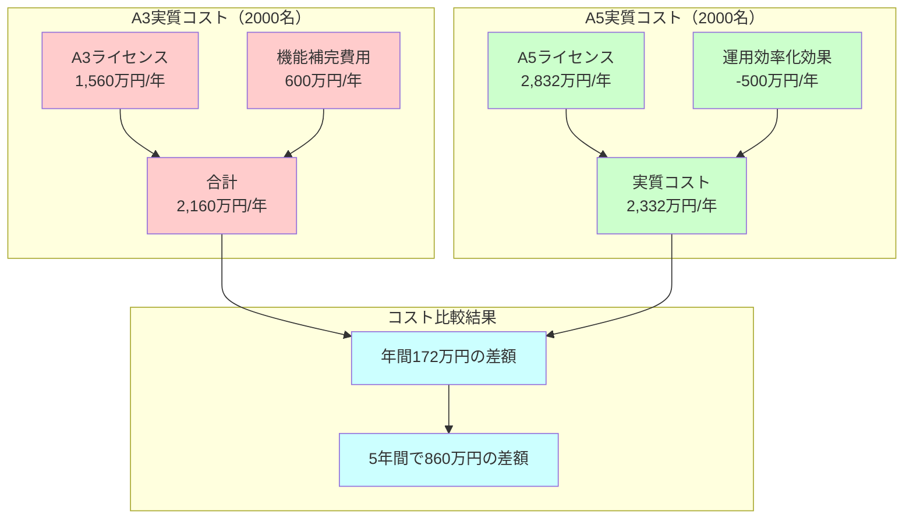

## 組織特性別の初期ライセンス選択戦略

### 小規模教育機関（～1,000名）での選択指針

**A3 選択が適切な条件**

小規模校では以下の条件が揃った場合、A3での長期運用が現実的です。

- **校務データ規模**: 基本的な学籍・成績管理、複雑でない校務プロセス
- **校務支援システム**: シンプルな構成、外部システム連携が限定的
- **IT体制**: 専任1-2名・基本的なスキルレベル
- **予算制約**: 年間IT予算が厳しく制限されている
- **リスク許容度**: Microsoft Entra ID P1レベルの基本セキュリティで十分

**A5 選択を検討すべき条件**

小規模校でも A5 が必要になる場合：

- **機密校務データ**: 健康情報・要保護児童情報・カウンセリング記録等の高度機密データ
- **複雑な校務システム**: 複数の校務支援システム統合、外部教育委員会システムとの連携
- **複数拠点管理**: 本校・分校・学童保育等での統合校務運用
- **IT人材高スキル**: Microsoft認定資格保有者等の専門人材確保済
- **効率化重視**: 人手不足により校務プロセス自動化・効率化が不可欠

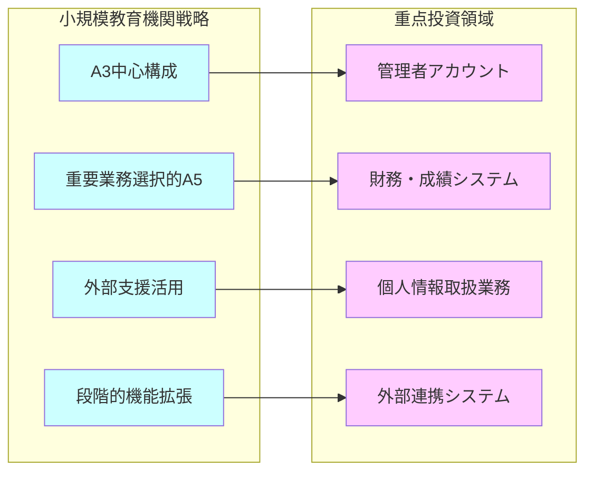

**実装優先順位**
1. **Phase 1**: 基本 MFA・条件付きアクセス（A3）
2. **Phase 2**: 管理者・重要業務A5移行
3. **Phase 3**: 効果測定に基づく拡張判断

**中規模教育機関（1,000～5,000名）戦略**

**バランス型アプローチ**により、コストと機能の最適バランスを実現します。

- **基本戦略**: A3/A5 混在での段階的移行
- **組織分割**: 部門・役割・リスクレベル別の差別化
- **管理効率化**: 統合管理による運用コスト削減
- **拡張性確保**: 将来的な組織成長への対応準備

**大規模教育機関（5,000名～）戦略**

**エンタープライズレベル**での Zero Trust 実装により、規模のメリットを最大化します。

- **包括的A5活用**: 規模効果による単価削減メリット活用
- **高度統合管理**: 複数キャンパス・分散組織の一元管理
- **専門チーム構築**: Zero Trust専門運用体制の確立
- **ベストプラクティス創出**: 他機関への知見共有・標準化貢献

### リスクベース選択判断基準

**セキュリティリスク評価マトリクス**

教育機関特有のリスク要因を体系的に評価し、適切なライセンスレベルを決定します。

| リスク要因 | 低リスク | 中リスク | 高リスク | 推奨ライセンス |
|-----------|---------|---------|---------|---------------|
| 校務データ種別 | 基本学籍・公開情報 | 成績・出席・連絡先 | 健康情報・要保護児童情報・カウンセリング記録 | 低:A3 / 中:A3主体 / 高:A5必須 |
| 校務システム連携度 | 単一校務システム | 複数システム基本連携 | 教育委員会・外部機関との複雑な連携 | 低:A3 / 中:A3/A5混在 / 高:A5推奨 |
| 校務運用重要度 | 補助的利用 | 基幹校務システム | 全校運営の基盤システム | 低:A3 / 中:A5検討 / 高:A5必須 |
| コンプライアンス要件 | 基本的法令遵守 | 教育情報セキュリティ標準準拠 | 高度監査・認証要求 | 低:A3 / 中:A5検討 / 高:A5必須 |

## A5での段階的導入戦略

### A5機能の段階的有効化モデル

A5を選択した教育機関では、**全機能を一度に有効化するのではなく**、組織の準備度に応じて段階的に機能を導入することで、ユーザーへの負荷を最小化しながら確実にZero Trust環境を構築できます。

**Phase 1: 基盤機能導入期（6-9ヶ月）**

A5ライセンスを取得済みですが、まず **A3 相当の基本機能**から段階的に導入し、組織の準備を整えます。

**導入する基本機能（A5 ライセンス使用・基本機能のみ有効化）**
- **Multi-Factor Authentication**: SMS 認証から開始、段階的に Authenticator アプリ移行
- **基本条件付きアクセス**: 場所・デバイス基準の基本ポリシーのみ
- **基本DLP**: 監視モードでのパターン学習・誤検知対策優先
- **Intune基本設定**: デバイス登録・基本コンプライアンス設定

**組織的準備の重点**
- **ユーザー教育**: Zero Trust 基本概念の理解促進
- **サポート体制**: MFA・基本機能に特化したヘルプデスク
- **運用習熟**: 管理画面・基本操作の習得
- **効果測定**: ベースライン設定・ユーザー満足度測定

**Phase 2: A5高度機能展開期（9-18ヶ月）**

Phase 1 で基盤が安定したら、**A5 独自の高度機能**を段階的に有効化していきます。重要度・リスクレベルの高い領域から優先的に導入します。

**A5高度機能の段階的有効化順序**

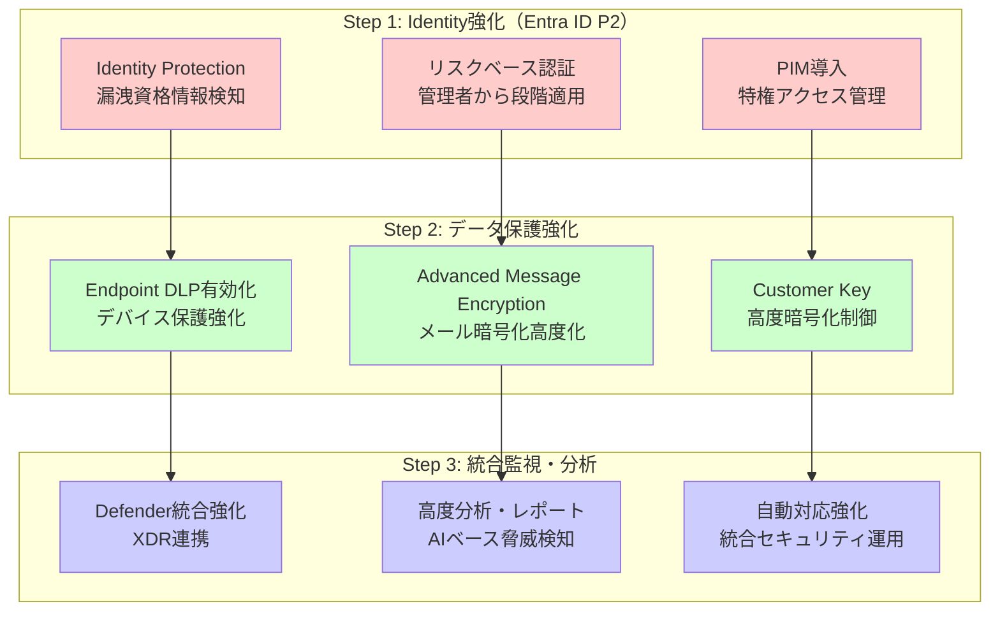

**Phase 3: 完全統合・最適化期（18-24ヶ月）**

すべてのA5機能が稼働し、**AI・機械学習を活用した予測的運用**と継続的最適化を実現します。

**完全統合運用の実現**
- **統合ダッシュボード**: すべてのセキュリティ情報の一元表示・分析
- **AI駆動自動化**: ユーザー行動分析・自動ポリシー調整・予測的対応
- **継続的最適化**: 機械学習によるパフォーマンス改善・誤検知削減
- **戦略的運営**: 運用データに基づく投資判断・リスク評価

**最適化の重点領域**
- **ユーザー体験**: 透明性の高いセキュリティ・業務効率との両立
- **運用効率**: 人的介入最小化・自動化率向上・コスト削減
- **セキュリティ効果**: 脅威検知精度向上・インシデント予防・復旧時間短縮
- **組織成長対応**: スケーラブル設計・将来拡張への準備

### A5機能展開の判断基準

**Phase間移行の客観的指標**

各フェーズの移行は、**明確な成功基準達成**を確認してから次段階に進みます。

| 評価指標 | Phase 1→2移行基準 | Phase 2→3移行基準 | 測定方法 |
|----------|------------------|------------------|----------|
| 基本機能定着度 | MFA利用率95%以上 | A5高度機能稼働率90%以上 | システム利用状況監査 |
| インシデント状況 | 基本セキュリティ事故0件/月 | 高度脅威検知・対応100% | セキュリティログ・対応記録 |
| ユーザー受入度 | 基本機能満足度4.0以上 | 高度機能満足度4.2以上 | 定期アンケート・フィードバック |
| 運用体制準備 | 基本運用100%習熟 | 高度機能運用60%習熟 | スキルアセスメント・認定 |
| 効果実現度 | 基本効率化20%達成 | 高度効率化40%達成 | 工数測定・ROI算出 |

**段階的導入のメリット**

A5ライセンスでの段階的機能展開により、以下の効果を実現：

- **変更負荷軽減**: ユーザーへの急激な変化を避け、段階的適応を実現
- **リスク最小化**: 機能追加による予期しない問題の早期発見・対応
- **学習効果**: 各段階での運用ノウハウ蓄積・組織的スキル向上
- **投資効果**: 段階的な効果測定による追加投資判断の最適化

# 教育機関でのコスト最適化・予算確保戦略

教育機関での Microsoft 365 投資は、**限られた予算内での価値最大化**と**議会・理事会への合理的説明**が重要です。単純なライセンス費用比較ではなく、教育効果・リスク軽減・運用効率化を定量化した説得力のある投資提案により、適切な予算確保を実現します。

## 予算申請・承認のためのTCO分析

### 教育機関での投資説明責任

教育機関では**公的資金の適正使用**が求められるため、投資効果の客観的説明が不可欠です。議会・理事会・保護者への説明責任を果たすため、以下の観点での分析が必要です。

**説明が必要な投資効果**
- **教育の質向上**: 安全なICT環境による学習効果向上
- **業務効率化**: 教職員の本来業務（教育・研究）への集中
- **リスク軽減**: 情報漏洩・システム停止等の事故防止
- **コンプライアンス**: 法的要件遵守・監査対応の効率化

**直接コスト（見えるコスト）**

予算計画で明確に把握できるコスト要素です。しかし、**これだけでは不十分**な投資判断となります。

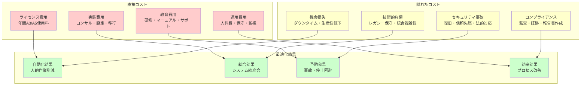

### A3/A5 TCO比較分析フレームワーク

**5年間TCO分析モデル**

教育機関での実装効果は、**中長期で評価**することが重要です。単年度比較では見えない投資価値を可視化します。

**2000名教育機関での5年間TCO分析**

| コスト要素 | A3選択（5年間） | A5選択（5年間） | 差額・効果 |
|-----------|----------------|----------------|-----------|
| **直接ライセンス費用** | ¥1,560万円×5年 = ¥7,800万円 | ¥2,832万円×5年 = ¥14,160万円 | A5が¥6,360万円高 |
| **機能制約補完費用** | ¥600万円×5年 = ¥3,000万円（基本対応） | なし | A5が¥3,000万円安 |
| **実装・移行費用** | ¥800万円（基本実装） | ¥1,200万円（高度実装） | A5が¥400万円高 |
| **運用・保守費用** | ¥300万円×5年 = ¥1,500万円 | ¥100万円×5年 = ¥500万円 | A5が¥1,000万円安（自動化効果） |
| **セキュリティ事故リスク** | ¥600万円×2回 = ¥1,200万円（Entra P1効果） | ¥300万円×1回 = ¥300万円 | A5が¥900万円安（予防効果） |
| **コンプライアンス対応** | ¥320万円×5年 = ¥1,600万円 | ¥50万円×5年 = ¥250万円 | A5が¥1,350万円安（自動化） |
| **生産性向上効果** | なし | +¥500万円×5年 = +¥2,500万円 | A5が¥2,500万円プラス |
| **合計TCO** | ¥15,900万円 | ¥16,110万円 | **ほぼ同等（A3が¥210万円安）** |

## 運用効率化・自動化によるコスト削減

### A3 での基本自動化戦略

A3環境でも、**運用の工夫**により相当な効率化が可能です。人的作業の削減により、限られた人員で効果的な運用を実現します。

**基本自動化の重点領域**

A3での自動化は、**確実性・安定性**を重視した基本機能の活用が中心となります。

- **アカウント管理**: 自動プロビジョニング・グループ管理・権限設定
- **ポリシー適用**: 条件付きアクセス・コンプライアンス・データ保護
- **監視・アラート**: 基本ログ監視・異常検知・定型レポート
- **バックアップ・復旧**: 定期バックアップ・自動復旧・版数管理

**人件費削減効果の定量化**

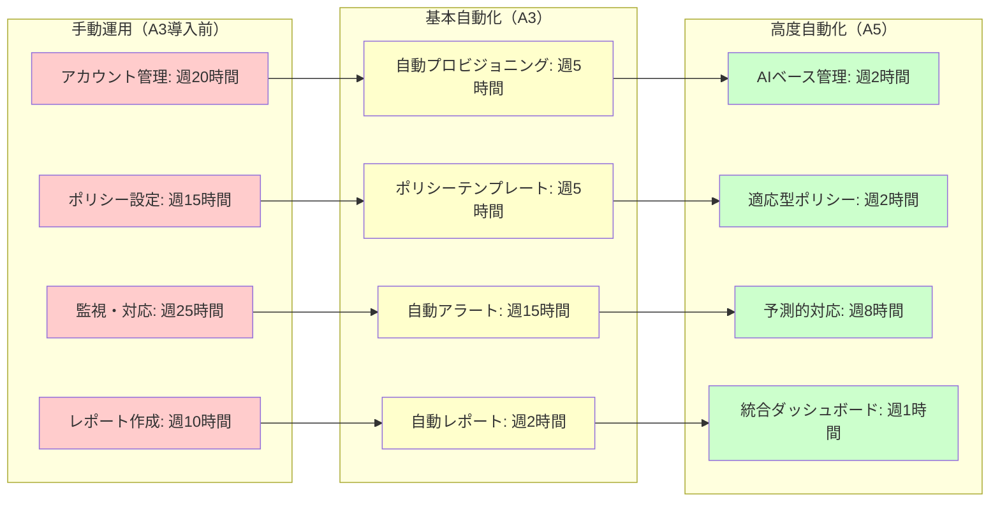

### A5 での高度自動化によるブレークスルー効果

A5 の高度機能により、**人的介入を最小化**した運用が可能になります。特にAI・機械学習機能は、従来不可能だった予測的・適応的管理を実現します。

**AI 駆動による効率化領域**

- **リスクベース認証**: ユーザー行動学習による動的認証要求調整
- **異常検知・対応**: 機械学習による高精度脅威検知・自動隔離
- **ポリシー最適化**: 利用パターン分析による自動ポリシー調整
- **予測的保守**: システム状態予測による予防的対応

**統合管理による複合効果**

A5 での統合管理は、**個別機能の合計以上**の効果を生み出します。

| 統合領域 | 個別管理コスト | 統合管理コスト | 削減効果 | 追加メリット |
|----------|----------------|----------------|----------|-------------|
| Identity + Device | 週30時間 | 週15時間 | 50%削減 | 一貫性向上・エラー削減 |
| Data + Network | 週25時間 | 週10時間 | 60%削減 | 統一ポリシー・可視性向上 |
| Application + Security | 週35時間 | 週12時間 | 65%削減 | 包括的保護・運用簡素化 |
| **全体統合効果** | **週90時間** | **週30時間** | **67%削減** | **戦略的IT運営への転換** |

## リスク軽減・コンプライアンス効果の定量評価

### セキュリティ事故コストの現実的評価

教育機関でのセキュリティ事故は、**直接コストを遥かに超える**長期的影響をもたらします。Zero Trust 投資の効果を適切に評価するには、これらの隠れたコストの定量化が必要です。

**典型的セキュリティ事故のコスト構造**

教育機関の情報セキュリティ事故は、**復旧コストよりも信頼回復コスト**が深刻な影響を与えます。

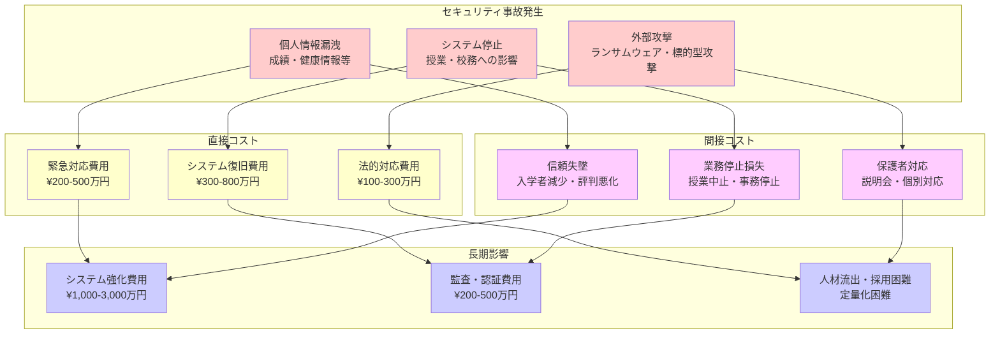

### Zero Trust 予防効果の定量化

**リスク軽減効果の測定方法**

Zero Trust によるリスク軽減効果は、**統計的アプローチ**で合理的に評価できます。

| リスク要因 | 従来環境での発生確率 | Zero Trust環境での発生確率 | 削減効果 | 年間回避コスト |
|-----------|---------------------|---------------------------|----------|----------------|
| パスワード侵害 | 15%/年 | 2%/年（MFA効果） | 87%削減 | ¥130万円 |
| 内部不正アクセス | 8%/年 | 1%/年（監視強化） | 88%削減 | ¥420万円 |
| マルウェア感染 | 25%/年 | 5%/年（統合防御） | 80%削減 | ¥240万円 |
| データ漏洩事故 | 5%/年 | 0.5%/年（DLP・暗号化） | 90%削減 | ¥900万円 |
| システム停止 | 12%/年 | 3%/年（可用性向上） | 75%削減 | ¥180万円 |
| **合計予防効果** | - | - | **平均84%削減** | **¥1,870万円/年** |

### コンプライアンス効率化・法的要件対応

**監査対応の自動化効果**

教育機関は複数の法的要件に同時対応する必要があり、**手動対応では限界**があります。Zero Trust の統合ログ・自動監査機能により、大幅な効率化が実現します。

**法的要件別対応効率化**

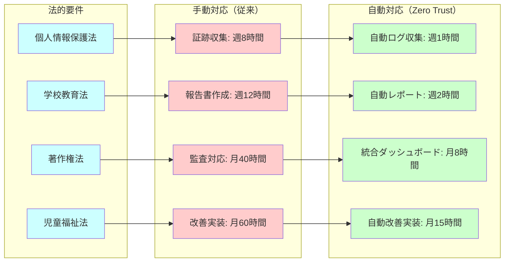

**年間コンプライアンスコスト比較**

| 対応項目 | 手動対応コスト | Zero Trust自動化コスト | 削減効果 |
|----------|----------------|----------------------|----------|
| 証跡管理・保管 | ¥480万円 | ¥120万円 | 75%削減 |
| 定期監査対応 | ¥360万円 | ¥90万円 | 75%削減 |
| インシデント報告 | ¥240万円 | ¥60万円 | 75%削減 |
| 改善実装・追跡 | ¥600万円 | ¥200万円 | 67%削減 |
| **合計** | **¥1,680万円** | **¥470万円** | **72%削減** |

# 継続的最適化・投資効果測定戦略

Zero Trust 投資の真の価値は、**継続的な測定・改善サイクル**により実現されます。単発の導入効果ではなく、組織の成長・技術進歩・脅威環境の変化に対応した動的最適化により、長期的な投資効果を最大化します。

## Zero Trust 投資効果の KPI・測定指標

### 4次元効果測定フレームワーク

Zero Trust 効果は多面的であり、**単一指標では評価困難**です。セキュリティ・運用・コンプライアンス・ユーザー体験の4次元で包括的に測定します。

**セキュリティ効果指標**

Zero Trust の本質的価値である**セキュリティ向上**を定量的に測定します。

| 指標名 | 測定方法 | 目標値 | A3実現レベル | A5実現レベル |
|--------|----------|--------|-------------|-------------|
| **インシデント削減率** | (前年インシデント数-当年インシデント数)/前年×100 | 年50%削減 | 30-40%削減 | 60-80%削減 |
| **平均復旧時間（MTTR）** | インシデント発生から正常化までの時間 | 4時間以内 | 8-12時間 | 2-4時間 |
| **脅威検知率** | 検知された脅威数/実際の攻撃試行数×100 | 95%以上 | 80-85% | 95-98% |
| **誤検知率** | 誤検知数/全検知数×100 | 5%以下 | 10-15% | 2-5% |
| **リスクスコア** | 定期リスク評価での組織セキュリティ成熟度 | レベル4以上 | レベル2-3 | レベル4-5 |

**運用効率指標**

投資に対する**運用コスト削減効果**を具体的に測定します。

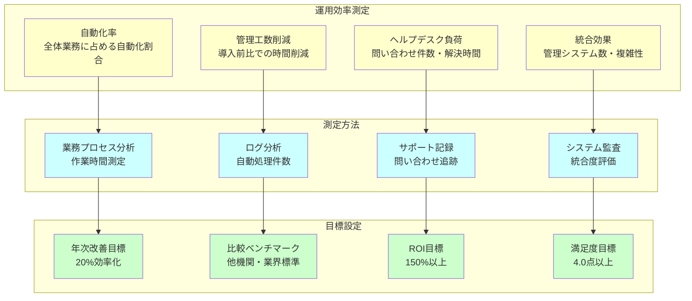

### コンプライアンス効果の可視化

**法的要件遵守の自動化効果**

教育機関特有の複雑な法的要件への対応効率を定量評価します。

| コンプライアンス領域 | 従来対応時間 | Zero Trust対応時間 | 効率化率 | 品質向上効果 |
|---------------------|-------------|-------------------|----------|-------------|
| **個人情報監査対応** | 月40時間 | 月10時間 | 75%削減 | エラー90%削減 |
| **アクセス権限レビュー** | 四半期80時間 | 四半期20時間 | 75%削減 | 网羅性100%確保 |
| **データ保護証跡** | 週20時間 | 週5時間 | 75%削減 | リアルタイム追跡 |
| **インシデント報告** | 事故毎24時間 | 事故毎6時間 | 75%削減 | 自動証拠収集 |

### ユーザー体験・満足度指標

**教育効果への影響測定**

Zero Trust が教育活動に与える影響を**正負両面**で評価し、バランスの取れた最適化を図ります。

**ユーザー満足度調査フレームワーク**

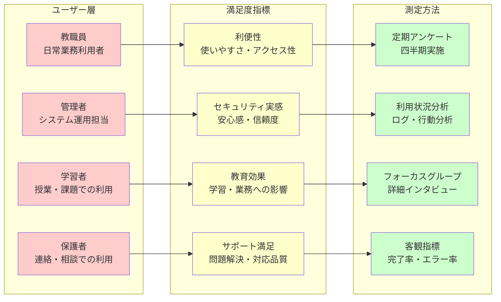

## 継続的最適化・改善プロセス

### 4段階最適化サイクルの確立

継続的最適化には、**体系的な改善サイクル**が必要です。計画→実行→評価→改善の PDCA サイクルを、Zero Trust 特性に適合させて設計します。

**Plan（計画）: 四半期戦略レビュー**

四半期毎に、組織状況・脅威環境・技術進歩を踏まえた**戦略調整**を実施します。

- **現状分析**: KPI実績・ベンチマーク比較・ユーザーフィードバック総合評価
- **環境変化対応**: 新脅威・法制度変更・技術革新への対応計画
- **優先順位再設定**: 限られたリソースでの最大効果実現のための重点設定
- **投資計画調整**: 効果実績に基づく追加投資・最適化投資の判断

**Do（実行）: 段階的改善実装**

計画に基づく**実装優先順位**により、混乱を避けながら着実な改善を実現します。

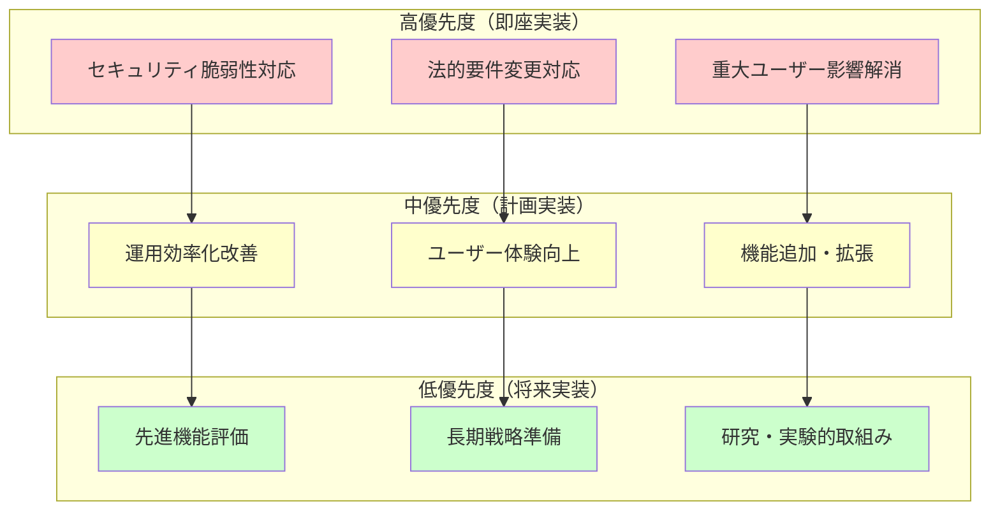

**Check（評価）: 多角的効果測定**

実装効果を**定量・定性**の両面から包括的に評価し、次回改善の基礎データとします。

| 評価軸 | 測定項目 | 評価頻度 | 責任者 | アクション基準 |
|--------|----------|----------|--------|----------------|
| **セキュリティ** | インシデント・脅威検知・復旧時間 | 月次 | CISO・セキュリティ担当 | 目標未達時即座改善 |
| **運用効率** | 自動化率・工数削減・コスト効果 | 四半期 | IT運用責任者 | ROI150%未満時要改善 |
| **コンプライアンス** | 法的要件遵守・監査対応・証跡管理 | 年次 | 法務・監査担当 | 不適合発生時緊急対応 |
| **ユーザー満足** | 利便性・セキュリティ実感・教育効果 | 半年 | 利用部門代表 | 満足度4.0未満時改善計画 |

**Act（改善）: 戦略的調整実装**

評価結果に基づく**根本的改善**により、継続的な価値向上を実現します。

### ベンチマーク比較・業界標準との位置づけ

**他教育機関との比較分析**

同規模・同種の教育機関との比較により、**相対的位置づけ**と改善余地を客観評価します。

| 比較指標 | 自組織実績 | 同規模平均 | 業界上位25% | 改善目標 |
|----------|------------|-------------|-------------|----------|
| **セキュリティ成熟度** | レベル3.2 | レベル2.8 | レベル4.1 | レベル3.8（1年後） |
| **1人当たりIT管理コスト** | ¥15,000 | ¥18,000 | ¥12,000 | ¥13,000（効率化） |
| **インシデント発生率** | 0.8%/月 | 1.2%/月 | 0.3%/月 | 0.5%/月（予防強化） |
| **ユーザー満足度** | 4.1点 | 3.8点 | 4.6点 | 4.4点（体験改善） |
| **コンプライアンス準備時間** | 週15時間 | 週25時間 | 週8時間 | 週10時間（自動化） |

## 長期戦略・投資計画の策定

### 3-5年戦略ロードマップ

Zero Trust 投資は**長期的視点**での戦略的判断が重要です。技術進歩・組織成長・環境変化を見据えた投資計画により、持続的な価値実現を目指します。

**2024-2028年戦略ロードマップ**

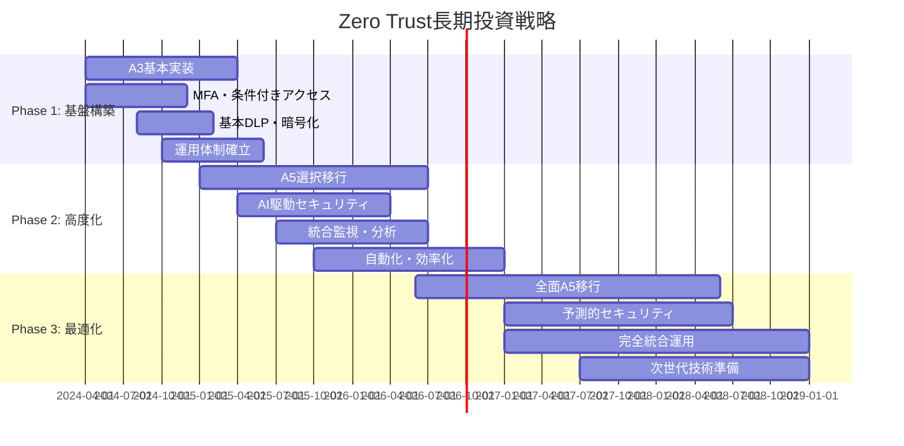

**年次投資計画・予算配分**

| 年度 | 投資重点 | 予算配分 | 期待効果 | ROI目標 |
|------|----------|----------|----------|---------|
| **2024年度** | A3基盤構築・MFA導入 | ¥1,200万円 | セキュリティ基盤確立 | 120% |
| **2025年度** | A5選択移行・統合監視 | ¥1,800万円 | 運用効率化・高度防御 | 150% |
| **2026年度** | 全面最適化・自動化 | ¥2,200万円 | 包括的Zero Trust実現 | 180% |
| **2027年度** | 次世代対応・AI活用 | ¥1,500万円 | 予測的セキュリティ | 200% |
| **2028年度** | 継続最適化・拡張 | ¥1,000万円 | 持続的価値創出 | 220% |

### 技術進歩・組織成長への対応戦略

**新技術統合戦略**

- **AI・機械学習進歩**: より高精度な脅威検知・予測分析・自動対応への対応
- **量子コンピュータ対応**: ポスト量子暗号への移行準備・長期データ保護戦略
- **IoT・エッジコンピューティング**: 教育現場でのスマートデバイス統合セキュリティ
- **クラウドネイティブ進化**: マルチクラウド・ハイブリッド環境での統合管理

**組織成長・変化対応**

- **規模拡大**: キャンパス増設・学生数増加に対応するスケーラブル設計
- **デジタル化進展**: 教育DX加速に伴うセキュリティ要件拡大への対応
- **働き方変化**: ハイブリッドワーク・リモート教育の常態化への対応
- **世代交代**: デジタルネイティブ世代の教職員増加への適応

## 第9章まとめ：初期選択の重要性と成功への道筋

教育機関でのA3/A5選択は、**一度決めたら数年間継続する重要な戦略的判断**です。アップグレード前提ではなく、初期選択時点での慎重な検討が成功の鍵となります。

### 成功のための重要原則

**1. 現実的制約の正確な把握**
- 年度予算制度・調達プロセス・承認手続きの理解
- 「後でアップグレード」という非現実的発想の回避
- 3-5年間の継続運用を前提とした初期選択

**2. 隠れたコストの適切な評価**
- A3機能制約を補完するための追加投資・運用コスト
- A5の自動化・効率化による実質的なコスト削減効果
- 表面的ライセンス費用を超えた総所有コスト（TCO）分析

**3. 組織特性に応じた選択基準**
- 規模・データ種別・外部連携度・IT体制の総合評価
- 画一的な選択ではなく、個別組織の実情に応じた判断
- リスクレベル・予算制約・運用能力のバランス考慮

**4. 説得力のある投資提案**
- 議会・理事会・保護者への客観的な効果説明
- 教育の質向上・業務効率化・リスク軽減の定量化
- 公的資金の適正使用に対する説明責任の履行

### 最終的な選択指針

**A3選択が適切な場合**
- 小規模・単純な校務運用で基本的なセキュリティレベルで十分
- IT 人材・予算に厳しい制約があり、シンプルな校務支援システム運用が必要
- 校務データが基本的な学籍・成績情報中心で、高度な保護要件がない

**A5選択が推奨される場合**  
- 中規模以上・複雑な校務運用で高度なセキュリティが必要
- 校務プロセス効率化・自動化により運用負荷軽減が重要
- 機密性の高い校務情報を取り扱い、包括的な保護が必須

教育機関での Microsoft 365 投資は、**単なるOfficeアプリケーションの導入ではなく校務支援システムの基盤インフラ戦略的強化**です。適切な初期選択により、限られた予算で最大の校務運用効率と安全性を両立することが可能です。