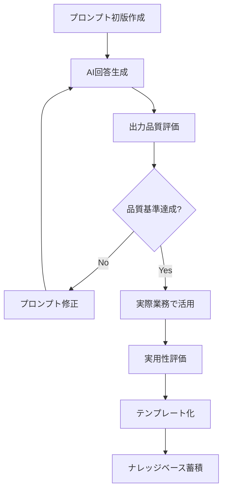

# 地域公共政策における効果的プロンプト設計

## 1. 基本的なプロンプト構造（沖縄版）

### テンプレート構成要素
```
【役割設定】あなたは沖縄の[具体的専門分野]の専門家です。
【前提条件】[沖縄特有の制約・背景]を考慮してください。
【具体的要求】[明確な成果物の指定]
【制約条件】[文字数、形式、期限等]
【検証項目】[確認すべき観点]
```

### Phase別活用指針
- **Phase 1（AI禁止）**：プロンプト作成のみ、実行は禁止
- **Phase 2（制限的活用）**：基本構造のみ使用
- **Phase 3（批判的検証）**：結果の妥当性検証必須
- **Phase 4（統合判断）**：最終判断は人間が実施

## 2. 沖縄観光政策プロンプト集

### 2.1 持続可能観光計画策定
```
【役割設定】
あなたは沖縄の持続可能観光政策の専門家として回答してください。

【前提条件】
- 沖縄の年間観光客数：約1000万人（コロナ前水準）
- 島嶼地域特有の環境収容力の限界
- 地域住民の生活環境との調和必要性
- 米軍基地存在による土地利用制約

【具体的要求】
[市町村名]における持続可能観光戦略の骨子を、以下の要素を含めて提案してください：
1. 観光収容力の適正規模算定
2. 地域住民との共生方策
3. 環境負荷軽減措置
4. 経済効果最大化戦略

【制約条件】
- 提案内容：1500字以内
- 実現可能性を重視
- 地域特性を具体的に反映

【検証項目】
- 沖縄の地理的制約は適切に考慮されているか
- 地域住民の合意形成プロセスは含まれているか
- 環境影響評価の視点は含まれているか
```

### 2.2 離島振興戦略立案
```
【役割設定】
あなたは沖縄離島地域の振興政策専門家として回答してください。

【前提条件】
- 対象離島：[具体的島名]
- 人口：[具体的数値]人（過疎化進行中）
- 主要産業：[農業/漁業/観光等]
- 本島からの交通：[船/航空便の頻度]
- インフラ整備状況：[水道/電力/通信]

【具体的要求】
以下の観点から振興戦略を立案してください：
1. 人口流出防止策
2. 産業振興・雇用創出策  
3. インフラ・生活環境改善策
4. 若者定住促進策
5. 高齢者支援体制

【制約条件】
- 戦略期間：10年間
- 予算制約を現実的に考慮
- 島民の意向を最優先

【検証項目】
- 離島特有の課題は網羅されているか
- 実施体制は実現可能か
- 持続可能性は確保されているか
```

## 3. 防災・危機管理プロンプト集

### 3.1 台風防災計画策定
```
【役割設定】
あなたは沖縄の気象災害対策の専門家として回答してください。

【前提条件】
- 沖縄の台風シーズン：6月〜11月
- 年平均台風接近回数：7〜8個
- 特別警報級台風の影響頻度増加
- 島嶼地域特有の孤立リスク
- 観光客を含めた避難体制必要性

【具体的要求】
[市町村名]における台風防災計画の改善提案を以下の項目で作成：
1. 早期避難体制の確立
2. 観光客への情報提供・避難誘導
3. 孤立集落への対応
4. インフラ復旧優先順位
5. 広域連携体制

【制約条件】
- 計画書形式：A4で5ページ以内
- 実行可能性を重視
- 関係機関の役割分担を明確化

【検証項目】
- 沖縄の台風特性は反映されているか
- 観光地特有のリスクは考慮されているか
- 離島・過疎地域への配慮はあるか
```

### 3.2 津波避難計画立案
```
【役割設定】
あなたは沖縄の津波防災対策の専門家として回答してください。

【前提条件】
- 沖縄周辺の津波リスク：南海トラフ、琉球海溝
- 最大津波高想定：[具体的数値]m
- 津波到達予想時間：地震発生後[具体的時間]分
- 海抜の低い平坦地が多い地形特性
- 海岸線の観光・居住利用度が高い

【具体的要求】
[対象地域名]の津波避難計画を以下の要素で策定：
1. 避難対象区域の設定根拠
2. 避難場所・避難経路の指定
3. 要支援者（高齢者・観光客）への対応
4. 避難誘導体制・情報伝達方法
5. 訓練・啓発計画

【制約条件】
- 避難完了目標時間：[具体的時間]分以内
- 地域住民・観光客両方を考慮
- 実地検証可能な内容

【検証項目】
- 津波特性と地形は適切に分析されているか
- 避難時間は現実的か
- 要支援者への配慮は十分か
```

## 4. 産業振興プロンプト集

### 4.1 農業振興計画策定
```
【役割設定】
あなたは沖縄農業の振興政策専門家として回答してください。

【前提条件】
- 沖縄の主要農産物：さとうきび、ゴーヤー、マンゴー、パインアップル
- 農業従事者の高齢化・後継者不足
- 台風等気象災害リスク
- 本土市場への輸送コスト高
- 島嶼地域特有の限られた農地面積

【具体的要求】
[市町村名]における農業振興戦略を以下の観点から提案：
1. 特産品のブランド化戦略
2. 若手農業者の育成・定着支援
3. 気候変動適応技術の導入
4. 6次産業化の推進方策
5. 輸送・流通システムの改善

【制約条件】
- 実施期間：5年間
- 地域の実情に即した現実的提案
- 費用対効果を明示

【検証項目】
- 沖縄の気候・土壌特性は考慮されているか
- 市場競争力向上策は含まれているか
- 持続可能性は確保されているか
```

### 4.2 IT産業誘致戦略立案
```
【役割設定】
あなたは沖縄のIT産業振興政策の専門家として回答してください。

【前提条件】
- 沖縄IT津梁パーク等の産業集積拠点存在
- 情報通信関連企業の集積進行中
- 若年層の県外流出と人材確保課題
- アジアとの地理的優位性
- 台風等による通信インフラリスク

【具体的要求】
沖縄におけるIT産業のさらなる集積・発展戦略を提案：
1. 企業誘致インセンティブの設計
2. 人材育成・確保戦略
3. インフラ整備・強化策
4. アジア市場進出支援策
5. 地域企業との連携促進

【制約条件】
- 戦略期間：10年間
- 他県との差別化要因を明示
- 地域経済への波及効果を重視

【検証項目】
- 沖縄の地理的優位性は活用されているか
- 人材定着・還流策は含まれているか
- リスク対策は適切か
```

## 5. 教育・人材育成プロンプト集

### 5.1 地域人材育成計画策定
```
【役割設定】
あなたは沖縄の人材育成政策専門家として回答してください。

【前提条件】
- 若年層の県外流出率が全国平均を上回る
- 琉球大学等の高等教育機関の存在
- 地域産業と教育機関の連携課題
- 伝統文化継承と現代教育の両立必要性
- 離島地域における教育機会の格差

【具体的要求】
地域定着型人材育成戦略を以下の要素で提案：
1. 地域課題解決型教育プログラム
2. インターンシップ・実践機会の創出
3. Uターン・Iターン促進策
4. 離島教育格差解消策
5. 伝統文化と現代スキルの融合教育

【制約条件】
- 対象：高校生〜大学生
- 実施主体の役割分担を明確化
- 成果指標を具体的に設定

【検証項目】
- 地域ニーズと教育内容は整合しているか
- 実施体制は持続可能か
- 定着効果測定方法は適切か
```

### 5.2 生涯学習体系構築
```
【役割設定】
あなたは沖縄の生涯学習推進専門家として回答してください。

【前提条件】
- 高齢化率の上昇（全国平均との比較）
- 地域コミュニティの結束力
- 伝統芸能・工芸等の文化資源豊富
- デジタル格差の存在
- 離島・過疎地域でのアクセス課題

【具体的要求】
全世代対応型生涯学習システムを設計：
1. 各世代のニーズに応じた学習機会
2. デジタル技術活用による学習支援
3. 伝統文化継承プログラム
4. 離島・過疎地域への学習機会提供
5. 学習成果の地域還元システム

【制約条件】
- 利用しやすい料金体系
- 離島でも参加可能な仕組み
- 継続参加を促す工夫

【検証項目】
- 世代間交流は促進されるか
- 地域文化継承は図られるか
- 持続的運営は可能か
```

## 6. プロンプト効果測定・改善テンプレート

### 6.1 プロンプト評価シート
```
【プロンプト情報】
- 使用日時：
- 対象課題：
- Phase段階：

【出力品質評価】（5段階評価）
- 具体性： □ 1 □ 2 □ 3 □ 4 □ 5
- 実現可能性： □ 1 □ 2 □ 3 □ 4 □ 5  
- 地域適応性： □ 1 □ 2 □ 3 □ 4 □ 5
- 網羅性： □ 1 □ 2 □ 3 □ 4 □ 5
- 独創性： □ 1 □ 2 □ 3 □ 4 □ 5

【改善すべき点】
1. 
2. 
3. 

【次回使用時の修正案】
1. 
2. 
3. 
```

### 6.2 プロンプト改善サイクル


## 7. 注意事項・倫理的配慮

### 7.1 使用上の注意
1. **思考ファースト原則の厳守**
   - AI使用前に必ず自分なりの考えをまとめる
   - プロンプト作成自体が思考整理の機会と捉える

2. **地域への配慮**
   - ステレオタイプや偏見を含む表現は避ける
   - 地域住民の尊厳と多様性を尊重する

3. **情報の正確性確保**
   - AI出力は必ず事実確認を行う
   - 統計データは最新のものに更新する

### 7.2 品質管理指針
1. **段階的検証**
   - Phase 3では必ず複数の情報源と照合
   - 地域の専門家・関係者への確認を推奨

2. **継続的改善**
   - 使用結果をもとにプロンプトを改善
   - 成功事例・失敗事例を蓄積・共有

3. **倫理的使用**
   - 個人情報やプライバシーに配慮
   - 差別や偏見を助長する内容は使用しない