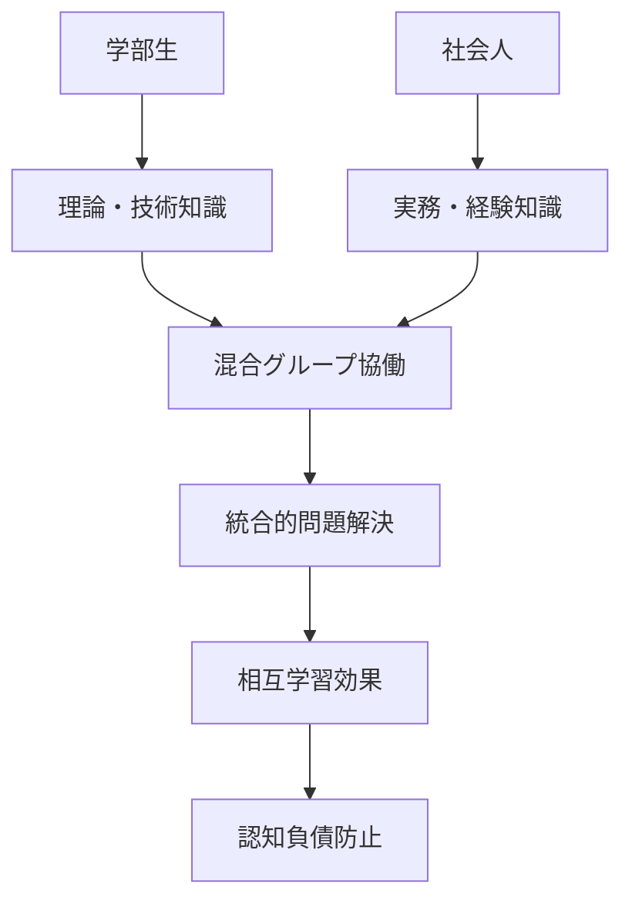

# 学部生と社会人学習者の協働学習システム

## 1. 混合クラス学習の基本原理

### 1.1 学習者特性の理解

#### 学部生（18-22歳）の特徴
**学習面での強み**
- 新しい技術への適応力が高い
- 理論学習に集中できる時間が豊富
- 創造的・実験的アプローチを好む
- デジタルネイティブとしてのAI親和性

**課題・制約**
- 実務経験・社会経験が限定的
- 問題の実質的影響を想像しにくい
- 責任を伴う判断経験が少ない
- 長期的視点での思考が困難

#### 社会人学習者（公務員）の特徴
**学習面での強み**
- 豊富な実務経験と問題解決経験
- 現実的・実用的視点での判断力
- 責任感と継続性
- 地域課題への深い理解

**課題・制約**
- 学習時間の制約（業務・家庭との両立）
- 新技術習得への心理的ハードル
- 既存の思考パターンからの脱却困難
- 失敗を恐れる傾向

### 1.2 相互補完学習モデル

## 2. 効果的な混合グループ編成

### 2.1 基本編成原則

#### グループサイズ
- **推奨人数**：4-5名
- **構成比率**：学部生2-3名：社会人2名

#### 編成基準
1. **専門分野の多様性**
   - 異なる専攻・部署からの参加者
   - 補完的な知識背景の組み合わせ

2. **経験レベルの分散**
   - AI使用経験の差を活用
   - 地域課題への関与度を考慮

3. **学習意欲の均衡**
   - 積極性の異なるメンバーの組み合わせ
   - 相互刺激を促す編成

### 2.2 役割分担システム

#### ローテーション役割
**週次交代制**で以下の役割を担当：

1. **ファシリテーター**
   - 議論進行・時間管理
   - 全員参加の促進

2. **記録係**
   - 学習過程・気づきの記録
   - 成果物の管理

3. **批判的検証係**
   - AI出力の妥当性チェック
   - 異なる視点からの問題提起

4. **統合整理係**
   - 議論の要点整理
   - 最終成果物の取りまとめ

#### 固定役割（特性活用）
- **技術サポート**：IT習熟度の高い学部生
- **実務アドバイザー**：経験豊富な社会人
- **地域文脈説明**：地域出身者・長期居住者

## 3. 段階別学習プログラム

### 3.1 導入段階（第1-2週）

#### 相互理解促進
**アイスブレイク活動（90分）**
1. **自己紹介ワーク（30分）**
   - 名前、背景、学習目標
   - AI使用経験・得意分野
   - 地域への関わり・思い

2. **期待値共有（30分）**
   - 混合学習への期待
   - 不安や懸念の表明
   - 学習成果への希望

3. **グループ憲章作成（30分）**
   - コミュニケーションルール
   - 時間・場所の配慮事項
   - 相互支援の方針

#### 基礎能力確認
**診断テスト（60分）**
- AI使用経験・スキルレベル
- 批判的思考能力
- 協働学習経験
- 地域課題理解度

### 3.2 基礎学習段階（第3-6週）

#### 4-Phase学習法の習得
**段階的トレーニング**

**Week 3: Phase 1（AI禁止）マスター**
- 個人思考 → グループ討議 → 発表
- 世代間の思考差異の発見
- 経験知と理論知の融合練習

**Week 4: Phase 2（制限的AI活用）実践**
- 個人準備 → AI活用 → グループ検証
- AI出力の世代別解釈比較
- 最適な活用方法の模索

**Week 5: Phase 3（批判的検証）強化**
- 学部生：理論的妥当性検証
- 社会人：実務的実現可能性検証
- 相互フィードバックによる多角的分析

**Week 6: Phase 4（統合判断）練習**
- 世代を越えた合意形成
- 最終判断における責任分担
- 成果物の共同作成

### 3.3 応用実践段階（第7-12週）

#### 実践課題への取り組み
**地域課題解決プロジェクト**

**プロジェクト選択基準**
- 両世代にとって学習価値が高い
- 実現可能性があり成果が見える
- 地域社会への貢献可能性

**推奨プロジェクト例**
1. **観光地域活性化計画**
   - 学部生：マーケティング理論・SNS戦略
   - 社会人：地域実情・行政手続き

2. **防災意識向上キャンペーン**
   - 学部生：情報発信技術・デザイン
   - 社会人：災害対応経験・地域ネットワーク

3. **高齢者デジタル支援**
   - 学部生：技術指導・教材作成
   - 社会人：高齢者心理理解・継続支援

## 4. 学習支援システム

### 4.1 時間・場所の配慮

#### ハイブリッド学習環境
**対面学習（週1回・120分）**
- 集中討議・協働作業
- 非言語コミュニケーション活用
- チームビルディング

**オンライン学習（週2回・各60分）**
- 進捗報告・情報共有
- 個別フォローアップ
- 補完的学習活動

#### スケジュール調整
**社会人の制約に配慮**
- 夜間・土日開講オプション
- 録画授業による補完学習
- 非同期コミュニケーション活用

**学部生の制約に配慮**
- 就職活動期間の柔軟対応
- アルバイトとの両立支援
- 試験期間中の負荷調整

### 4.2 学習支援ツール

#### デジタルプラットフォーム
**必須ツール**
- **Slack/Teams**：日常コミュニケーション
- **Zoom**：オンライン会議
- **Miro/Mural**：協働思考支援
- **Notion/OneNote**：ナレッジ共有

**AI活用支援ツール**
- **Copilot Chat**：メイン学習対象
- **プロンプト管理システム**：テンプレート共有
- **学習進捗トラッカー**：個人・グループ進捗可視化

#### アナログ支援ツール
**対面学習用**
- 思考整理用ワークシート
- 付箋・マーカー・模造紙
- タイマー・ホワイトボード

## 5. 評価システム

### 5.1 多面的評価アプローチ

#### 個人評価（40%）
**学習プロセス評価（20%）**
- 4-Phase実践度
- 思考ファースト遵守度
- 自己省察の深さ

**成果物評価（20%）**
- 課題解決提案の質
- AI活用の適切性
- 創造性・実用性

#### グループ評価（30%）
**協働プロセス評価（15%）**
- 世代間協力度
- 役割分担の適切性
- コミュニケーション質

**統合成果評価（15%）**
- 最終プレゼンテーション
- 実践可能な解決策
- 学習目標達成度

#### 相互評価（30%）
**ピアレビュー（20%）**
- 学部生→社会人評価
- 社会人→学部生評価
- 相互学習貢献度

**360度フィードバック（10%）**
- 教員評価
- 外部専門家評価
- 自己評価

### 5.2 評価基準・ルーブリック

#### Phase実践度評価
| レベル | Phase 1 | Phase 2 | Phase 3 | Phase 4 |
|--------|---------|---------|---------|---------|
| 優秀 | AI禁止完全遵守、独創的思考 | 適切な制限、効果的活用 | 多角的検証、根拠明確 | 責任ある最終判断 |
| 良好 | AI禁止遵守、思考過程明確 | 基本的制限、妥当な活用 | 基本的検証、一定の根拠 | 合理的判断 |
| 要改善 | 部分的AI使用、思考不足 | 過度な依存、制限不十分 | 検証不足、根拠薄弱 | 判断根拠不明確 |

#### 世代間協働評価
| 項目 | 優秀 | 良好 | 要改善 |
|------|------|------|--------|
| 経験知活用 | 社会人の経験が効果的に活用され、学部生の理解が深化 | 経験知の基本的活用、一定の学習効果 | 経験知の活用不足、学習効果限定 |
| 新技術導入 | 学部生の技術知識が適切に共有され、社会人が効果的習得 | 技術知識の基本的共有、一定の習得 | 技術知識共有不足、習得困難 |
| 相互支援 | 積極的な相互支援、学習課題の協働解決 | 基本的な相互支援、協力的関係 | 相互支援不足、個別学習中心 |

## 6. トラブル対応ガイド

### 6.1 よくある課題と対策

#### 世代間コミュニケーション課題
**症状**
- 話し合いが噛み合わない
- 互いの視点を理解できない
- 意見対立が解決しない

**対策**
1. **共通言語の確立**
   - 専門用語の定義共有
   - 前提知識の明確化
   - 具体例による説明強化

2. **ファシリテーション強化**
   - 教員による積極的介入
   - 外部ファシリテーター活用
   - 構造化された対話手法導入

3. **相互理解促進**
   - 世代別価値観共有セッション
   - 立場交換ディスカッション
   - 共通目標の再確認

#### 学習ペース格差問題
**症状**
- AI習得速度の差が大きい
- 一部メンバーの学習遅延
- グループ内での役割偏重

**対策**
1. **個別サポート体制**
   - 習熟度別補習実施
   - メンター制度導入
   - 学習リソース個別提供

2. **役割分担調整**
   - 得意分野での貢献重視
   - 段階的責任増加
   - 相互教育機会創出

#### 時間調整困難
**症状**
- 会議設定が困難
- 学習時間の確保困難
- プロジェクト進行遅延

**対策**
1. **柔軟なスケジューリング**
   - 複数の時間枠提供
   - 非同期作業の増加
   - 個別面談による調整

2. **効率化支援**
   - 学習時間短縮のための工夫
   - 自動化ツール活用
   - 優先順位明確化

### 6.2 緊急時対応プロトコル

#### 深刻な対立発生時
1. **即座の介入**：教員が直ちに仲裁
2. **個別面談**：当事者との個別対話
3. **グループ再編**：必要に応じて構成変更
4. **外部支援**：カウンセラー等専門家活用

#### 学習意欲低下時
1. **原因分析**：個別面談による要因特定
2. **目標再設定**：現実的な目標への調整
3. **成功体験創出**：小さな達成感の積み重ね
4. **ペースadjust**：学習スケジュールの見直し

## 7. 継続的改善システム

### 7.1 定期的評価・改善

#### 中間評価（第6週）
- 学習進捗状況確認
- グループ動態評価
- プログラム内容調整

#### 最終評価（第12週）
- 総合学習成果測定
- プログラム満足度調査
- 改善提案収集

### 7.2 長期的発展計画

#### 卒業生ネットワーク
- 修了生同士の継続的交流
- 実務での協働プロジェクト
- 後輩指導への参画

#### プログラム進化
- 評価結果に基づく改善
- 新技術・手法の導入
- 地域課題変化への対応

これらのガイドラインに従って、世代を超えた効果的な学習コミュニティを構築し、認知負債を防止しながら生成AI時代に適応した人材を育成します。