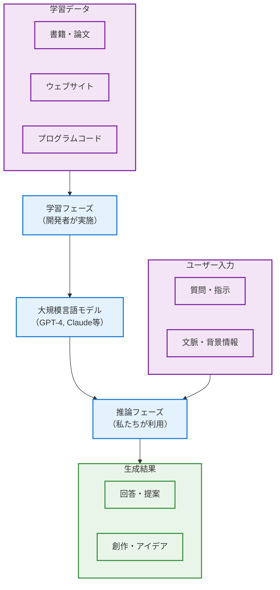
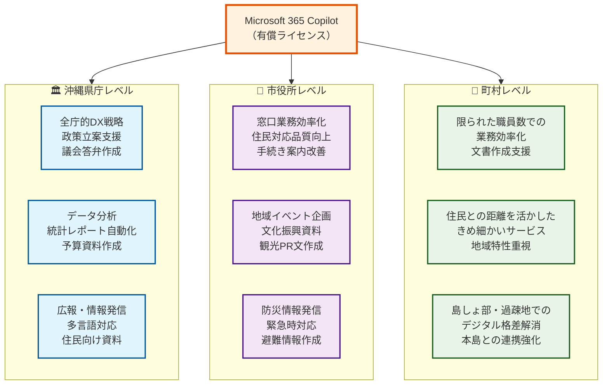
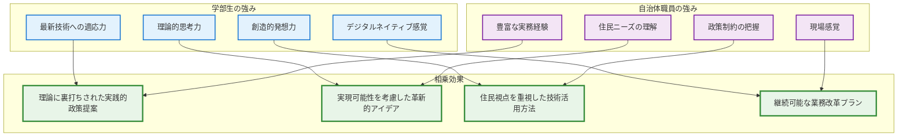

# 地域公共政策士のための生成AI入門

## はじめに

この章では、地域公共政策士を目指す皆さんが知っておくべき生成AI（Generative AI）の基礎知識を学びます。技術的な詳細よりも、実際の業務や学習でどのように活用できるかという実用的な観点から解説します。

琉球大学の混合クラスの特性を活かし、理論と実務の両面から生成AIの理解を深めていきましょう。

## 1.1 生成AIの仕組み - 基本概念の理解

### 1.1.1 AIと生成AIの違い - なぜ今、注目されるのか

**従来のAI（ルールベース）との違い**

これまでのコンピューターは、プログラマーが事前に決めたルールに従って動作していました。例えば：

```
IF 申請書に記入漏れがある THEN エラーメッセージを表示
IF 人口が10万人以上 THEN 市、ELSE 町または村
```

このような明確なルールは行政手続きには適していましたが、複雑で曖昧な判断が必要な政策立案には限界がありました。

**機械学習の登場**

機械学習では、大量のデータからパターンを学習し、新しいデータに対して予測や分類を行います。

- **例：観光客数予測**
  - 過去10年の観光統計、天気、イベント情報から学習
  - 来月の観光客数を予測
  - 精度は高いが、「なぜその予測になるか」の説明は困難

**生成AIの特徴**

生成AIは、学習したデータをもとに**新しいコンテンツを創造**できます。

- **文章生成**: 政策提案書、住民説明資料の作成支援
- **アイデア創出**: 地域課題の解決策のブレインストーミング
- **対話**: 質問に対する自然な回答、議論の相手役

**沖縄での具体例**

- **従来のシステム**: 「台風接近時は避難所を開設」（固定ルール）
- **機械学習**: 過去データから「台風の強さと被害予測」
- **生成AI**: 「今回の台風に適した住民向け避難呼びかけ文作成」「多言語での避難情報提供」「高齢者にも分かりやすい説明文作成」

### 1.1.2 大規模言語モデル（LLM）- Copilot や ChatGPT 正体

**トークンとは何か**

生成AIは文章を「トークン」という単位で処理します。日本語では、概ね以下のような分割になります。

```
「沖縄県の観光政策について」
→ [沖縄] [県] [の] [観光] [政策] [について]
→ 6トークン
```

**トークンの制約と実用性**

- **ChatGPT**: 一回の会話で12.8万トークン
- **Claude**:100万トークン（長文分析に有利）
- **実務への影響**: 長い政策文書は分割して処理する必要

**学習と推論の違い**

生成AIを理解する上で重要なのは、「学習（Training）」と「推論（Inference）」という2つの異なるフェーズがあることです。

**学習フェーズ（Training）**：
- **実施者**: AI開発会社（OpenAI、Anthropic等）
- **目的**: 大量のテキストデータからパターンを学習し、言語モデルを構築
- **データ**: インターネット上の文章、書籍、論文、プログラムコード等
- **処理**: 「次にどの単語が来る確率が高いか」を数億〜数兆のパラメータで学習
- **期間**: 数週間〜数ヶ月の大規模計算処理
- **結果**: 完成した大規模言語モデル（GPT-4、Claude-3等）

**推論フェーズ（Inference）**：
- **実施者**: 私たち利用者
- **目的**: 学習済みモデルを使って、新しい質問に対する回答を生成
- **データ**: 利用者が入力する質問や指示
- **処理**: 学習したパターンに基づいて、最も適切な回答を計算・生成
- **期間**: 数秒〜数十秒の高速処理
- **結果**: 質問に対する具体的な回答やアイデア

**重要な理解ポイント**：
1. **学習は一度きり**: モデルは私たちとの会話から新しいことを学習しない
2. **推論は毎回実行**: 質問のたびに、学習済みの知識を使って回答を生成
3. **知識の固定性**: 学習データの時点（カットオフ日）以降の情報は知らない
4. **個別性の限界**: 個人の特定情報や最新の出来事は学習データに含まれない可能性



**確率的な出力の意味**

生成AIの回答は「最も確率の高い次の単語」を選んで生成されます。

- **同じ質問でも微妙に違う回答**：これは不具合ではなく仕様
- **創造性の源泉**：予想外の視点や発想が生まれる可能性
- **注意点**：事実確認は必須、複数回試すことで多様な視点を得られる

**混合クラスでの理解確認**

- **学部生向け**: 技術的仕組みへの興味を活かした深い理解
- **職員向け**: 業務での実用性重視、制約の理解

## 1.2 主要な生成AIサービス - 実用的選択ガイド

### 1.2.1 Microsoft 365 Copilot Chat - 自治体職員に最適

**個人用 Microsoft 365 Copilot Chat（無償）**

Webブラウザから利用できる対話型AIサービス：

- **基本的なチャット機能**: 質問応答、文章作成支援、アイデア出し
- **ファイルアップロード**: Word、Excel、PDF 等のファイルを読み込んで分析
- **文章作成支援**: レポート下書き、構成案、校正提案
- **注意**: **Word、Excel、PowerPoint、Outlook との直接連携は不可**

**⚠️ 個人用の重要な注意点 - データ保護について**：

**データがAI学習に使用される可能性**：
- **個人アカウント利用時**: 会話内容がMicrosoftのAIモデル学習に使用される場合がある
- **学習データ除外対象**: 
  - 組織アカウント（Entra ID）利用者
  - Microsoft 365 Personal/Family サブスクリプション利用者
  - 未ログイン利用者
  - 18歳未満の利用者
- **プライバシー保護**: 個人特定情報（名前・連絡先等）は除去されてから学習に使用
- **オプトアウト可能**: 設定でモデル学習への使用を拒否できる

**推奨利用方針**：
- **機密性の高い内容は避ける**: 個人情報、組織の内部情報は入力しない
- **一般的な学習支援での活用**: 基本的な質問、公開情報での分析に限定
- **設定の確認**: プライバシー設定でデータ使用設定を確認・調整

**学部生におすすめの活用法**：
- 卒論執筆の構成相談（ファイルアップロード機能活用）
- 統計データの解釈支援（ExcelファイルをアップロードしてAI分析）
- プレゼンテーション構成案の作成
- 英語論文の要約（PDFファイルアップロード機能活用）

**組織用 Microsoft 365 Copilot**

**無償版（組織向けCopilot Chat）**：
- **Webブラウザからのみ利用可能**
- **ファイルアップロード機能**: Word、Excel、PDF 等の分析
- **基本的なチャット機能**: 質問応答、文章作成支援
- **組織データアクセス不可**: SharePoint、OneDrive 等は参照できない

**有償版（Microsoft 365 Copilotライセンス）**：
- **Office統合機能**: Word、Excel、PowerPoint、Teams 内から直接利用
- **組織データ活用**: SharePoint、OneDrive、Exchange 等の情報を参照
- **高度なセキュリティ**: 企業レベルのデータ保護・ガバナンス
- **月額料金**: 1ユーザーあたり3,750円（Microsoft 365ライセンス別途必要）

**導入時の選択指針**：
- **小規模組織・予算重視**: 無償版から開始し、効果検証後に有償版検討
- **大規模組織・セキュリティ重視**: 有償版で組織データ活用とガバナンス確保

**沖縄県内自治体での活用可能性**



**行政特有の活用例**

1. **議会答弁書の草案作成**
   - 過去の答弁書を参照した一貫性のある回答
   - 質問の要点整理と論点構造化
   - 専門用語の分かりやすい説明

2. **住民対応メールの下書き生成**
   - 丁寧で分かりやすい説明文
   - 制度の根拠法令の自動引用
   - 相手の状況に応じた個別対応文

3. **予算資料や報告書の効率的作成**
   - データからのグラフ・表作成
   - 前年比較や推移分析の自動化
   - 住民向け分かりやすい説明資料

4. **住民説明会資料の多言語対応**
   - 基本的な行政情報の英語・中国語対応
   - やさしい日本語への変換
   - 図表を使った視覚的説明

**情報セキュリティとガバナンス**

- **組織のIT部門との連携**: 導入計画と運用ルール策定
- **情報漏洩防止**: 機密情報の適切な取り扱いルール
- **プライバシー保護**: 個人情報の処理制限
- **職員研修**: 適切な利用方法とリスク管理
- **利用ログ管理**: 業務利用の透明性確保

### 1.2.2 リサーチツールとしての生成AI

**Copilot Chat - Web上の公開情報を活用した調査支援**

Microsoft 365 Copilot ChatはBing検索エンジンと連携し、Web上の公開情報を活用して回答を生成できます。

**Web検索機能の特徴**：
- **リアルタイム情報の取得**: 最新のニュース、統計データ、政策情報にアクセス
- **公開情報の統合**: Web上の複数の情報源から関連情報を収集・整理
- **透明性の確保**: 検索に使用したクエリと参照元が表示される
- **プライバシー保護**: 検索クエリは匿名化され、個人情報は除去される

**政策調査での活用例**：
1. **他自治体の先進事例調査**
   ```
   プロンプト例：
   「全国の自治体における子育て支援の先進的な取り組みを
   Web検索を使って調べてください」
   ```

2. **最新の制度改正情報の収集**
   ```
   プロンプト例：
   「2025年度の地方創生関連予算と新しい支援制度について
   最新情報を教えてください」
   ```

3. **統計データの収集と分析**
   ```
   プロンプト例：
   「沖縄県の観光客数の最新動向と全国比較を
   公開されているデータから分析してください」
   ```

**Web検索利用時の注意点**：
- **情報の信頼性確認**: 参照元リンクから一次情報を確認
- **時期の確認**: データや情報の公開日時を必ず確認
- **複数視点の収集**: 一つの情報源に偏らない調査
- **組織データとの区別**: 内部情報と公開情報を明確に分離

**Claude (Anthropic) - 学術研究・政策調査の強い味方**

**特徴と強み**：
- **長文読解能力**: 100万トークンの文書を一度に分析
- **論理的分析**: 複雑な因果関係や論点の整理が得意
- **学術的文章**: 客観的で構造化された文章作成支援

**政策研究での活用方法**：

1. **研究論文の要約と比較分析**
   ```
   プロンプト例：
   「以下の3つの離島振興に関する研究論文を比較し、
   ・共通する課題認識
   ・解決策の違い
   ・沖縄への適用可能性
   をまとめてください」
   ```

2. **政策オプションの整理と評価**
   ```
   プロンプト例：
   「観光オーバーツーリズム対策について、
   環境保護、経済効果、住民生活への影響の
   3つの観点から政策選択肢を評価してください」
   ```

3. **ステークホルダー分析の構造化**
   ```
   プロンプト例：
   「基地跡地利用計画について、関係する
   ステークホルダーとその利害関係を整理し、
   合意形成の課題を分析してください」
   ```

**沖縄特有課題での応用例**：

- **離島政策の他地域比較研究**: 鹿児島県、長崎県の離島政策との比較
- **基地問題の多角的論点整理**: 安全保障、経済、環境、住民生活の視点
- **観光政策の持続可能性分析**: 経済効果と環境負荷のバランス検討

**ChatGPT (OpenAI) - 対話的学習の最適解**

**特徴と強み**：
- **対話的学習**: 質問を重ねながら理解を深める
- **発想支援**: 創造的なアイデア創出が得意
- **プレゼンテーション**: 伝わりやすい説明の構造化

**教育・学習での活用方法**：

1. **複雑な政策概念の理解促進**
   ```
   学生：「地方交付税の仕組みがよく分からない」
   ChatGPT：「家計に例えて説明しますね。国を『親』、
   自治体を『子ども』に例えると...」
   ```

2. **ディベートの論点整理**
   ```
   プロンプト例：
   「カジノ誘致について、賛成・反対それぞれの
   主要論点を3つずつ挙げ、反駁のポイントも
   教えてください」
   ```

3. **プレゼンテーション構造の設計**
   ```
   プロンプト例：
   「離島医療の課題について15分で発表します。
   聴衆は住民の方々です。効果的な構成を
   提案してください」
   ```

**混合クラスでの応用**：

- **学部生と社会人の知識ギャップ埋め**: 基本概念の分かりやすい説明
- **グループワークでの意見整理**: 多様な意見の論点整理
- **学習内容の復習と定着支援**: 理解度チェックと補足説明

**使い分けの原則**

| 場面 | Copilot Chat無償版 | Microsoft 365 Copilot有償版 | Claude | ChatGPT |
|-----|-------------------|------------------------------|--------|---------|
| **日常業務** | ○ ファイル分析・基本対話 | ◎ Office統合で効率化 | △ 業務特化機能少 | △ 業務特化機能少 |
| **学術研究** | ○ 文献ファイル分析 | ○ Office内分析+組織データ | ◎ 長文分析・論理性 | ○ 発想・構造化 |
| **学習支援** | ○ 基本的な質問対応 | ○ Office連携学習 | ○ 理論的説明 | ◎ 対話的理解 |
| **創作・企画** | ○ 基本的なアイデア出し | ○ Office統合企画作業 | △ 創造性やや劣る | ◎ アイデア創出 |
| **組織利用** | ○ 基本セキュリティ | ◎ 企業レベル管理+データ統合 | △ 個人利用中心 | △ 個人利用中心 |

**コスト効率と予算計画**

**個人利用戦略**：
1. **無料版で基本操作習得**: ChatGPT無料版、Claude無料版で練習
2. **Microsoft 365 Copilot Chat**: 無料でファイル分析機能を活用
3. **必要に応じて有料版**: 高度な機能が必要な場合のみアップグレード
4. **Office統合が必要な場合**: Copilot Pro（月額3,200円）を検討

**組織導入戦略**：
1. **ROI分析**: 効率化による時間短縮 vs 導入・運用コスト
2. **段階的展開**: pilot部署での効果検証 → 全庁展開
3. **職員研修**: 適切な利用方法とリスク管理の教育投資

## 1.3 沖縄での生成AI活用可能性

### 1.3.1 地域特性を活かした活用領域

**離島特性への対応**

沖縄県の39の有人離島では、限られた人的資源で多様な行政サービスを提供する必要があります。

**Copilot Chatでの具体的活用例**：

1. **本島との情報格差解消**
   - **文書要約・翻訳**: 県庁の複雑な政策文書をCopilot Chatにアップロードして「石垣島の実情に合わせて要約してください」
   - **制度説明文の作成**: 「介護保険制度について、離島の高齢者にも分かりやすい説明文を作成してください」
   - **住民質問への回答文作成**: 「子育て支援について聞かれました。宮古島の状況を踏まえた回答文を作成してください」

2. **限られた職員での効率的行政運営**
   ```
   # 職員が入力
   「明日の台風対策会議用の資料を作成したい。台風15号が接近中。」
   ```

   ```
   ## Copilot Chat の応答例 
   台風15号対策会議資料（2025年8月）
   1. 台風15号の最新状況
   名称：台風15号（2025年8月現在）
   進路予測：気象庁およびJTWC（米軍）、ECMWF（ヨーロッパ中期予報センター）、Windyによる予測では、
   台風15号は九州南部から本州南岸を通過する可能性が高いとされている。
   勢力：中心気圧1004hPa、最大風速18m/s、最大瞬間風速25m/s（8月28日時点）
   影響地域：九州、四国、近畿、東海、関東地方にかけて強風・豪雨の恐れあり
   接近タイミング：8月30日〜9月1日にかけて本州南岸に最接近の見込み
   2. 気象庁の台風経路図（参考）
   台風経路図は気象庁公式サイトにて随時更新中：気象庁 台風経路図2025年
   3. 自治体の対応事例（過去の台風15号対応からの教訓）
   - 静岡市の対応（令和5年）
     - 災害対策本部の迅速な設置
     - 職員の配備体制の強化
     - 自衛隊・民間事業者との連携協定の活用
     - 被災者支援（避難所運営、物資供給、健康観察）
     - 災害廃棄物の収集・処理体制の整備
   - 磐田市の対応（令和4年）
     - 地域防災計画の風水害対策編の見直し
     - 台風15号災害対応報告書の作成
     - 災害復旧関連工事の迅速な実施
   4. 明日の会議で検討すべき事項
     - 災害対策本部の設置タイミングと体制
     - 避難所の開設準備と物資備蓄状況の確認
     - 高齢者・障がい者等の要配慮者支援計画
     - 交通機関・ライフラインへの影響予測と対応策
     - 情報発信体制（SNS・防災無線・Web）
     - 地域住民への事前周知と避難訓練の実施
   5. 推奨される備え
     - 非常食・水・モバイルバッテリーの確保
     - 家庭での防災グッズの点検（懐中電灯、ラジオ、救急セットなど）
     - ハザードマップの確認と避難経路の把握
     - 台風情報の定期的な確認（気象庁、JTWC、Windyなど）
   ※本資料は2025年8月28日時点の情報に基づいて作成しています。
   最新情報は気象庁および自治体の公式発表をご確認ください。
   ```

3. **文書作成の効率化**
   - **議事録作成支援**: 「本日の委員会での主要論点3つを整理してください」
   - **報告書の下書き**: 既存データをアップロードして「前年比較を含む月次報告書の構成を提案してください」
   - **住民向け通知文の作成**: 「工事のお知らせを、高齢者にも分かりやすい文章で作成してください」

4. **会議・打合せ準備**
   - **資料の事前整理**: 関連文書をアップロードして「明日の打合せの争点を3つに整理してください」
   - **プレゼン構成案**: 「離島医療の現状について15分で説明する構成を提案してください」

**観光産業での革新的活用**

年間1,000万人を超える観光客への対応：

1. **多言語対応文書の作成**
   ```
   観光案内所での活用例：
   「首里城の歴史について、中国語で小学生にも
   分かるように説明文を作成してください」
   → 年齢と言語に適した観光案内文を即座に生成
   ```

2. **観光PR文書の作成支援**
   - **SNS投稿文の作成**: 「今日の美ら海水族館のイベントについて、インスタグラム用の魅力的な投稿文を作成してください」
   - **パンフレット原稿**: 「やんばるの自然体験について、家族向けのパンフレット文を作成してください」
   - **観光ルート提案**: 「2泊3日で沖縄本島を回る初心者向けプランを提案してください」

3. **観光業従事者の実務支援**
   - **外国人対応文の準備**: 「レンタカー利用時の注意事項を英語と中国語で作成してください」
   - **文化説明文の作成**: 「三線の歴史と魅力を外国人観光客に説明する原稿を作成してください」
   - **トラブル対応マニュアル**: 「観光客からの苦情に適切に対応する文例を5つ作成してください」

**文化継承での創新的取り組み**

1. **伝統文化の説明文作成**
   ```
   具体例：
   「エイサーの歴史と意味について、中学生にも分かるように
   500字で説明してください」
   「首里織の技法と特徴について、観光客向けの
   パンフレット用文章を作成してください」
   ```

2. **文化教育コンテンツの作成**
   - **学習教材の原稿**: 「琉球王国の歴史について、小学生向けのクイズを10問作成してください」
   - **文化解説文**: 「沖縄の食文化について、外国人にも理解できる紹介文を作成してください」
   - **体験プログラム説明**: 「三線体験教室の参加者向け説明文を作成してください」

3. **文化イベントの企画文書**
   - **イベント企画書**: 「地域の祭り復活プロジェクトの企画書の構成を提案してください」
   - **広報文の作成**: 「伝統工芸展の告知文を、若い世代にも興味を持ってもらえるように作成してください」
   - **参加者募集文**: 「方言継承教室の参加者募集チラシの文章を作成してください」

**災害対応での実用的活用**

台風の常襲地域としての特性を活かした対策：

1. **災害情報の住民向け文書作成**
   ```
   活用例：
   「台風15号接近に伴う避難情報を、高齢者にも分かりやすく、
   やさしい日本語で作成してください」
   「停電復旧作業の進捗状況を住民向けにお知らせする
   文章を作成してください」
   ```

2. **多言語・多世代対応文書**
   - **高齢者向け**: 「避難所での過ごし方について、大きな文字で読みやすい案内文を作成してください」
   - **外国人向け**: 「台風時の注意事項を英語と中国語で作成してください」
   - **子ども向け**: 「台風の時に気をつけることを、小学生にも分かるように説明してください」

3. **災害対応文書の作成**
   - **避難所運営マニュアル**: 「避難所でのペット対応についてのルールを作成してください」
   - **復旧情報の整理**: 現場報告書をアップロードして「被害状況を地域別に整理してください」
   - **住民説明用資料**: 「復旧作業スケジュールを住民に分かりやすく説明する文章を作成してください」

4. **事前準備文書の作成**
   - **防災マニュアル**: 「離島での台風対策チェックリストを作成してください」
   - **備蓄品案内**: 「家庭での災害備蓄について、沖縄の気候を考慮した案内文を作成してください」

### 1.3.2 混合クラスでの協働学習効果

**理論と実務の融合による相乗効果**



**世代間メンタリングシステム**

1. **逆メンタリング（Reverse Mentoring）**
   - 上級AI知識学生 → 初心者職員への技術指導
   - 新しいツールの使い方やプロンプト技術
   - デジタル世代の感覚の共有

2. **経験伝承（Experience Transfer）**
   - ベテラン職員 → 学部生への実務知識伝授
   - 政策制約や住民対応のリアル
   - 失敗事例から学ぶリスク管理

3. **相互サポート（Peer Support）**
   - 同世代・同レベル学習者同士の支え合い
   - 学習進度に応じたペア・グループ組み

## 1.4 実践演習 - 初めての生成AI体験

### 1.4.1 基本操作の実践

**演習1：自己紹介とAI紹介**

各自、以下のプロンプトで生成AIと「初対面の挨拶」をしてみましょう。

```
私は琉球大学で地域公共政策士を目指して学んでいる○○です。
沖縄の△△（出身地・関心地域）に関心があります。
あなたについて教えてください。また、私の学習を
どのように支援してくれますか？
```

**期待される学習効果**：
- AIとの対話の基本パターン理解
- 自分の関心領域の明確化  
- AIの能力と制限の認識

**演習2：沖縄の基本情報確認**

```
沖縄県について以下の情報を教えてください：
1. 人口と面積
2. 主要産業
3. 特有の課題3つ
4. 最近の政策トピック

情報源も可能な範囲で教えてください。
```

**注意点とディスカッション**：
- 提供された情報の正確性をどう確認するか？
- 古い情報や不正確な情報が混じっていないか？
- 複数のAIで同じ質問をした場合の差異は？

### 1.4.2 問題解決思考の実践

**演習3：地域課題の分析練習**

以下のシナリオで、生成AIを「思考のパートナー」として活用：

```
シナリオ：
あなたの地元（または関心のある沖縄の地域）で
「若い人が島を離れてしまう」という課題があります。

以下の手順で分析してください：
1. まず自分で考えて、考えられる原因を3つ挙げる
2. AIに「他にどんな原因が考えられるか」質問
3. AIの回答と自分の分析を比較
4. 最も重要だと思う原因1つに絞る（自分で判断）
5. その原因への対策案をAIと一緒に考える
```

**このアプローチのポイント**：
- 最初に自分で考える（認知負債の回避）
- AIは追加情報や異なる視点の提供役
- 最終判断は人間が行う
- AIを「答えを教えてくれる存在」ではなく「一緒に考えてくれるパートナー」として位置づける

### 1.4.3 混合クラスでのペアワーク

**演習4：学部生×職員ペアでの課題解決**

**ペア構成**：
- 学部生1名 + 自治体職員1名
- または学部生2名 + 職員1名（経験者がファシリテーター）

**課題**：「AI活用で改善できる行政サービス」の検討

**役割分担**：
- **学部生**: 最新技術情報の収集、理想的な解決策の提案
- **職員**: 現実的制約の指摘、住民ニーズの観点からの評価

**プロセス**：
1. **現状把握**（15分）：職員が実際の業務課題を説明
2. **情報収集**（20分）：学部生がAIで類似事例や技術情報を調査  
3. **解決策検討**（20分）：両者でAIを活用しながらアイデア出し
4. **実現可能性検討**（15分）：職員の経験で現実性をチェック
5. **発表準備**（10分）：他のペアへの発表準備

**期待される成果**：
- 理論と実務の融合したアイデア
- AIの可能性と制約の現実的理解
- 世代・立場の違いを活かした学び合い

### 1.4.4 認知負債防止の基礎演習

この章の最後に、次章以降で学ぶ「認知負債防止」の基礎的な実践を体験します。

**演習：沖縄観光課題の分析（15分間）**

**Phase 1（AI禁止・5分間）**：
```
課題：「沖縄観光の持続可能性」について考える

AI使用禁止で、自分の知識・経験のみで以下を書き出してください：
1. 沖縄観光の現状で気になること（3つ）
2. その原因として考えられること（各1つずつ）
3. 改善策のアイデア（各1つずつ）

【重要】この段階では絶対にAIを使わず、
手書きメモまたは白紙の文書で作業してください
```

**Phase 2（制限的AI活用・5分間）**：
```
AI活用許可：情報収集のみ

先ほど自分で考えた内容について：
「沖縄観光の現状データと課題を教えてください。
特に以下の点について情報提供をお願いします：
- 観光客数の推移
- 地域住民への影響
- 環境への影響」

※AIに課題分析や解決策を求めてはいけません
```

**Phase 3（比較検証・5分間）**：
```
自分の最初の考えとAI情報を比較：
1. 自分の認識で正確だった点
2. 知らなかった情報
3. 自分の分析で不足していた視点

最終的な改善策は自分で判断し、
AIの情報を参考にしながら修正・補強してください
```

**振り返りポイント**：
- AI使用前の自分の思考はどの程度正確でしたか？
- AIに頼らず考える重要性を実感できましたか？
- AIを「情報源」として使う感覚は掴めましたか？

この演習で体験した「思考ファースト」のアプローチが、本書全体を通じて実践する認知負債防止の基本となります。

### 1.4.5 振り返りとまとめ

**個人振り返り（5分）**

以下の点について各自で考える：

1. **AI活用での気づき**
   - 期待通りだった点
   - 予想外だった点
   - 困難に感じた点

2. **自分の学習スタイルとの相性**
   - AIとの対話は学習に役立ちそうか
   - どんな場面で活用したいか
   - 注意すべきリスクは何か

3. **今後の学習計画**
   - どのAIサービスを継続利用したいか
   - 次に挑戦してみたい活用方法
   - 習得したいスキル

**クラス全体での共有（15分）**

- 各ペアの発見の共有
- 成功例・失敗例の共有
- 次章に向けた期待や不安

**この章のまとめ**

第1章では、生成AIの基本的な仕組みから実用的なサービス選択、そして沖縄での活用可能性まで学びました。重要なポイント：

1. **生成AIは「答えを与える道具」ではなく「一緒に考えるパートナー」**
2. **サービスごとの特性を理解した使い分けが重要**
3. **沖縄の地域特性を活かした独自の活用可能性**
4. **混合クラスの多様性が生み出す学習相乗効果**

次の第2章では、認知負債を避けながら効果的にAIを活用する「責任あるプロンプトエンジニアリング」について学びます。AIに振り回されることなく、主体的に思考しながらAIの力を借りる方法を身につけましょう。