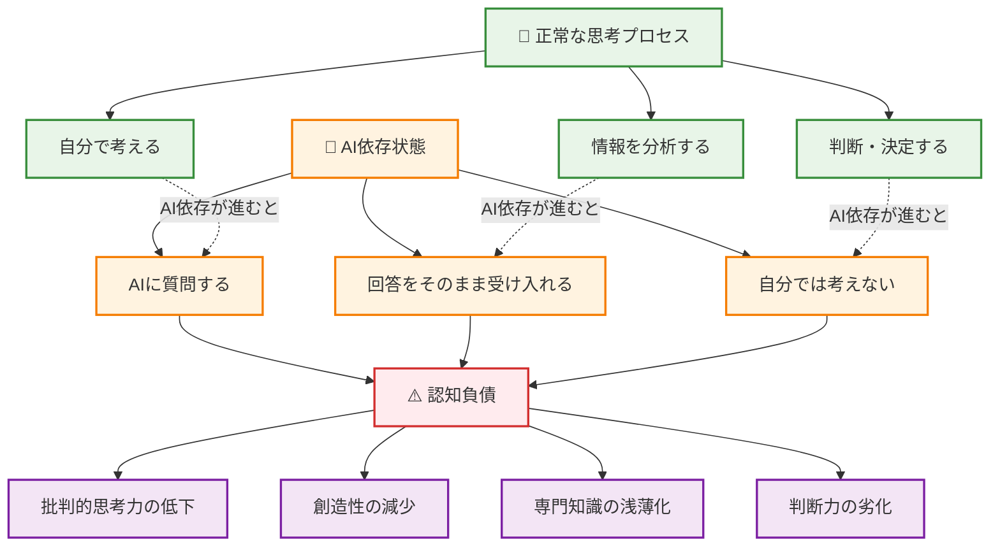
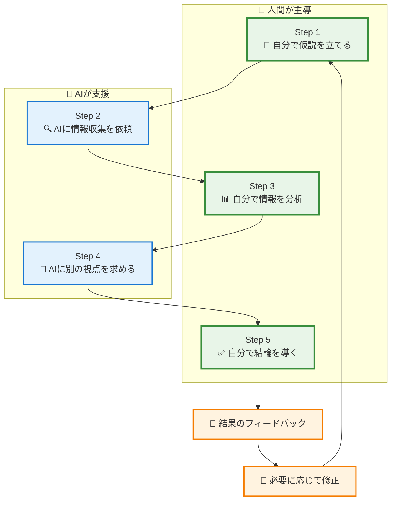
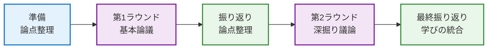

# 認知負債を避けながら効果的にAIと協働する

## はじめに - なぜ「責任ある」プロンプトエンジニアリングなのか

第1章で生成AIの基本を学んだ皆さんは、実際にAIを使い始めて、その便利さに驚いたかもしれません。しかし、ここで立ち止まって考えてみましょう。

**AIは魔法の杖ではありません。**

地域公共政策士として皆さんが目指すのは、住民一人ひとりの生活を向上させることです。そのためには、AIに頼りきりになるのではなく、自分自身の思考力を高めながら、AIを「協働のパートナー」として活用する必要があります。

この章では、MIT研究で明らかになった　**「認知負債」** のリスクを避けながら、主体的な思考を維持するプロンプト設計技術を学びます。

## 2.1 認知負債を避けるプロンプト設計

### 2.1.1 認知負債とは何か - MITが警鐘を鳴らす現象

**認知負債（Cognitive Debt）の定義**

MITメディアラボの研究によると、認知負債とは「大規模言語モデル（LLM）に依存することで、人間の努力的思考プロセスが正常に機能しなくなる状態」を指します。



**地域公共政策士にとっての認知負債リスク**

1. **住民ニーズの複雑さを見落とす**
   ```
   悪い例：
   「高齢者支援政策を教えて」
   → AIの一般的回答をそのまま採用
   → 沖縄の家族構造や文化的背景を考慮せず
   ```

2. **地域の独自性や文脈を軽視する**
   ```
   悪い例：
   「離島振興策を提案して」
   → 本土の事例をそのまま適用提案
   → 島の規模、産業、住民意識の違いを無視
   ```

3. **ステークホルダーとの対話を省略する**
   ```
   悪い例：
   AIで作成した住民説明資料をそのまま使用
   → 住民の声を直接聞くプロセスを省略
   → 合意形成の機会を失う
   ```

4. **政策の倫理的・社会的影響を軽視する**
   ```
   悪い例：
   効率化重視のAI提案をそのまま採用
   → プライバシーや人間関係への影響を考慮せず
   → 住民の尊厳や自律性を損なう可能性
   ```

### 2.1.2 「思考支援型」プロンプトの設計

**基本原則：「答えを教えて」から「一緒に考えて」へ**

認知負債を避けるためには、AIに対するアプローチを根本的に変える必要があります。

| 認知負債を招くプロンプト | 思考支援型プロンプト |
|----------------------|-------------------|
| 「沖縄の観光政策を教えて」 | 「沖縄の観光政策について、私はX,Y,Zの要因が重要だと考えています。他にどのような視点がありますか？」 |
| 「離島振興策を提案して」 | 「離島振興策を考える上で、経済、社会、環境の3つの観点から課題を整理したいと思います。この整理方法の妥当性や不足している視点はありますか？」 |
| 「住民説明資料を作って」 | 「住民説明会で○○について説明したいと思います。住民の関心事や懸念点として、どのような点を考慮すべきでしょうか？」 |

**実践テンプレート集**

**1. 情報収集型プロンプト**
```
【背景】私は○○について調べています
【現在の理解】私は△△だと理解していますが
【支援要請】他にどのような視点や情報がありますか？
【確認事項】私の理解に間違いや不足はありませんか？
```

**2. 分析支援型プロンプト**
```
【データ/状況】以下の情報があります。[データや状況を提示]
【仮説】私は○○が主要な要因だと考えますが
【検証依頼】この仮説を検証するために、
どのような追加情報や分析が必要でしょうか？
【代替案】他にどのような解釈の可能性がありますか？
```

**3. 意思決定支援型プロンプト**
```
【選択肢】A案とB案を検討しています
【評価基準】○○、△△、□□の観点で評価したいと思います
【支援要請】この評価基準の妥当性はどうでしょうか？
他に考慮すべき観点はありますか？
【最終確認】それぞれの案のリスクを教えてください
```

### 2.1.3 段階的思考プロセスの設計

**5段階の協働思考モデル**



**具体例：宮古島の人口減少対策を考える場合**

**Step 1: 自分で仮説を立てる**
```
自分の考え：
宮古島の人口減少の主な原因は
1. 就職機会の不足（特に若年層）
2. 教育機会の限界（高等教育機関の不足）
3. 医療・福祉サービスの不安
の3点だと考える。
```

**Step 2: AIに情報収集を依頼**
```
プロンプト：
「離島の人口減少について、私は就職機会、教育機会、
医療・福祉サービスの3つが主要因と考えています。
これらの要因に関する統計データや研究結果、
または私が見落としている可能性のある要因について
情報を提供してください。」
```

**Step 3: 自分で情報を分析**
```
AI回答の検証：
- 提供された統計は最新か？
- 宮古島特有の状況を反映しているか？
- 新たに提示された要因は妥当か？
→ 自分なりに整理・評価する
```

**Step 4: AIに別の視点を求める**
```
プロンプト：
「私の分析では○○という結論になりましたが、
この分析の弱点や見落としている点はありますか？
また、住民の視点、事業者の視点、行政の視点から
それぞれ異なる見方があるでしょうか？」
```

**Step 5: 自分で結論を導く**
```
総合判断：
- 各種情報を統合した自分なりの分析
- 優先順位の設定（根拠も含めて）
- 具体的なアクションプランの概要
- 不確実性やリスクの認識
```

### 2.1.4 メタ認知を促すプロンプト技術

**メタ認知とは**

自分の思考プロセスを客観視し、「なぜそう考えるのか」「他の考え方はないか」を意識的に検討する能力です。

**メタ認知促進プロンプト集**

**1. 思考プロセスの可視化**
```
「私が○○という結論に至った理由を整理すると：
前提：△△
根拠：□□
論理：××
結論：○○

この思考プロセスに論理的な飛躍や偏見はありませんか？」
```

**2. 反対意見の検討**
```
「私は○○だと考えていますが、
この考えに反対する人はどのような論拠を
持つでしょうか？その反対意見の妥当性を
評価してください。」
```

**3. 前提の検証**
```
「私の分析は△△を前提としていますが、
この前提が間違っていた場合、結論はどう変わりますか？
また、この前提の妥当性をどう検証できますか？」
```

**4. 影響範囲の検討**
```
「この政策案を実行した場合、
意図した効果以外にどのような
副作用や予期しない影響が考えられますか？
特に弱い立場の人々への影響はどうでしょうか？」
```

## 2.2 実践演習 - 思考力を維持するプロンプト練習

### 2.2.1 基礎演習：主体的学習の実践

**演習1：要約演習「まず自分で要点抽出、その後AI確認」**

**題材**：沖縄県の「第6次沖縄県観光振興基本計画」（仮想文書）※付録を参照

**手順**：
1. **自主要約**（15分）：資料を読んで自分で要点を3つ抽出
2. **AI確認**（5分）：自分の要約をAIに確認してもらう
3. **比較検討**（10分）：自分の要約とAIの指摘を比較
4. **改善版作成**（10分）：両方を統合した最終版を作成

**使用プロンプト例**：
```
私は沖縄県観光振興基本計画を読んで、以下の3点が
重要だと考えました：
1. [自分の要約1]
2. [自分の要約2]  
3. [自分の要約3]

この要約の妥当性はどうでしょうか？
重要な点を見落としていたり、
優先順位に問題があったりしませんか？
```

**期待される学習効果**：
- 自分なりの理解を先に形成する習慣
- AIを「答え合わせ」ではなく「気づき」のツールとして活用
- 自分とAIの視点の違いを意識化

**演習2：分析演習「仮説設定後、情報収集と検証」**

**テーマ**：「なぜ若者は沖縄から出て行くのか？」

**手順**：
1. **仮説設定**（10分）：自分の経験・観察から仮説を立てる
2. **情報収集計画**（5分）：仮説検証に必要な情報をリストアップ
3. **AI支援調査**（15分）：AIに情報収集を依頼
4. **仮説検証**（10分）：収集した情報で仮説を検証
5. **修正仮説**（10分）：検証結果を踏まえて仮説を修正

**仮説設定例**：
```
私の仮説：
沖縄の若者流出の主要因は「経済的要因」であり、
具体的には：
1. 就職先の選択肢の少なさ
2. 給与水準の低さ
3. キャリアアップ機会の限定性
が大きく影響している。

この仮説を検証するために、以下の情報が必要：
- 沖縄の就職状況統計
- 県内外の給与比較データ
- 若者へのアンケート調査結果
```

**AI支援調査プロンプト**：
```
沖縄の若者流出について、経済的要因が主要原因という
仮説を立てています。この仮説を検証・反証するために、
どのようなデータや研究結果がありますか？
また、経済的要因以外の重要な要因があれば教えてください。
```

**演習3：文章作成「アウトライン作成後、詳細化」**

**課題**：住民向け「新しいゴミ分別制度」説明資料作成

**手順**：
1. **対象分析**（5分）：読み手（住民）の特性・関心事を分析
2. **構成設計**（10分）：説明資料の構成を自分で考える
3. **AI構成チェック**（5分）：構成の妥当性をAIに確認
4. **詳細執筆**（20分）：構成に基づいて詳細を執筆
5. **AI文章チェック**（10分）：分かりやすさと正確性を確認

**構成設計例**：
```
私が考えた構成：
1. 制度変更の背景（なぜ変更するのか）
2. 新しい分別方法（具体的な変更点）
3. 住民のメリット（なぜ協力すべきか）
4. 実施スケジュール（いつから）
5. 疑問・困ったときの連絡先

この構成で住民に分かりやすく伝わるでしょうか？
順序や内容で改善点があれば教えてください。
```

### 2.2.2 応用演習：協働思考の実践

**演習4：ディベートパートナーとしてのAI活用**

**テーマ**：「沖縄にカジノを誘致すべきか」

**設定**：学生は「賛成派」、AIには「反対派」の役割を依頼

**プロセス**：


**AI役割依頼プロンプト**：
```
あなたにはカジノ誘致反対派の立場で議論をお願いします。
以下の点を重視して反論してください：
- 事実に基づく議論
- 建設的な対話の維持
- 私の論理的弱点の指摘
- 代替案の提示

私の意見を完全に否定するのではなく、
より良い政策を考えるためのパートナーとして
議論してください。
```

**期待される学習効果**：
- 多角的思考能力の向上
- 自分の論理の弱点認識
- 建設的な議論スキル
- 複雑な問題への理解深化

**演習5：複数の立場からの検討**

**シナリオ**：宮古島での大型リゾート開発計画

**役割設定**：
- 学生：政策立案者（中立的立場）
- AI：様々なステークホルダーの代弁

**手順**：
1. **状況設定**（10分）：開発計画の概要を確認
2. **ステークホルダー特定**（10分）：関係者をリストアップ
3. **各立場の意見聴取**（30分）：AIに各立場での意見を求める
4. **利害調整案作成**（20分）：各意見を踏まえた調整案を作成
5. **実現可能性検証**（10分）：調整案の実現可能性をAIと検討

**ステークホルダー別プロンプト例**：

**地元住民の立場**：
```
宮古島の地元住民の立場から、この大型リゾート開発について
どのような懸念や期待があるか教えてください。
特に生活環境、雇用、文化への影響の観点から
率直な意見をお聞かせください。
```

**観光業者の立場**：
```
宮古島で既に観光業を営んでいる事業者の立場では、
この開発をどう評価するでしょうか？
競合関係、協業可能性、業界全体への影響など
ビジネス的な視点からの意見をお願いします。
```

**環境保護団体の立場**：
```
環境保護の観点から、この開発計画について
どのような問題点や配慮すべき事項があるでしょうか？
具体的な環境影響と対策について意見をください。
```

### 2.2.3 批判的思考とAI活用のバランス

**演習6：AI回答の妥当性検証**

**課題**：AIが提供する情報の信頼性を検証する

**手順**：
1. **同一質問を複数AIに投げる**（15分）
2. **回答の差異を分析**（10分）
3. **外部情報源で事実確認**（15分）
4. **AI回答の妥当性評価**（10分）
5. **信頼性の高い情報の再構成**（10分）

**質問例**：「沖縄の基地経済依存度はどの程度ですか？」

**検証観点**：
- 数値データの一致性
- 情報源の明示
- 算出方法の透明性
- 時系列の整合性
- 他の専門家意見との一致

**批判的思考チェックリスト**：
```
□ この情報の出典は明確か？
□ 最新のデータに基づいているか？
□ 異なる立場の意見も考慮されているか？
□ 数値の算出根拠は妥当か？
□ 私の期待に沿いすぎていないか？
□ 反対意見や限界も示されているか？
□ 実際の状況と整合するか？
```

## 2.3 沖縄の実例でのプロンプト技術

### 2.3.1 離島振興政策でのプロンプト実例

**シナリオ**：石垣市の若者流出対策を検討

**段階別プロンプト設計**：

**Phase 1（AI禁止・現状理解）**

まず、AIを使用せずに自分の知識と経験から石垣市の現状を整理します。

```
【自分で考える段階 - AIは使用しない】
石垣市に対する私の理解（自分の知識から、もしくはインターネット検索してまとめる）：
- 人口：約4.8万人、近年微増傾向
- 主要産業：観光業、農業（パイナップル、サトウキビ）
- 課題認識：高校卒業後の本島・本土流出

若者流出の要因（自分の考え）：
- 進学機会の限定（大学がない）
- 地元就職先の不足
- 都市的な刺激・文化体験への憧れ
- キャリア形成機会の限定
```

この段階では、地元の人への聞き取り、統計データの確認、関連資料の収集などを行い、AIに頼らず自分の理解を深めます。

**Phase 2（制限的AI活用・多角的分析）**
```
石垣市の若者流出について、以下の立場それぞれから
どのような課題認識があるでしょうか：

1. 高校生とその保護者の立場
2. 地元企業の立場  
3. 行政の立場
4. 戻ってきた若者（Uターン者）の立場

それぞれの立場で優先すべき対策が異なると思いますが、
どのような違いがあるでしょうか？
```

**Phase 3（批判的検証・政策オプション検討）**
```
石垣市での若者流出対策として、以下の案を考えました：
A. 地元企業のインターンシップ制度充実
B. 遠隔高等教育プログラムの導入
C. 起業支援制度の創設

各案の実現可能性、効果の大きさ、
コストパフォーマンスを評価してください。
また、私が見落としている政策案があれば提案してください。
```

**Phase 4（統合判断・実装検討）**
```
最も有効だと思われる政策について、
実装に向けた具体的なステップと
予想される障害・課題をリストアップしてください。

特に以下の点を重視して検討をお願いします。
- 予算確保の方法
- 関係者の合意形成
- 既存制度との調整
- 効果測定の方法
```

### 2.3.2 観光政策でのプロンプト実例

**シナリオ**：首里城周辺の観光客分散化策

**Phase 1（AI禁止・自己分析）**

まず、AIを使用せずに自分の観察と知識から課題を整理します。

```
【自分で考える段階 - AIは使用しない】
首里城周辺の観光に関する私の認識（実地調査・観察から）：
1. 特定時間帯・場所への観光客集中
2. 地域住民の生活への影響
3. 文化財保護と観光利用のバランス
4. 駐車場不足と交通渋滞
5. 商業施設の偏在
```

この段階では現地調査、住民への聞き取り、観光データの収集を行い、自分の目と耳で課題を把握します。

**Phase 2（制限的AI活用・問題発見型プロンプト）**：
```
首里城周辺の観光について、私は実地調査により以下の課題を認識しました：
1. 特定時間帯・場所への観光客集中
2. 地域住民の生活への影響
3. 文化財保護と観光利用のバランス

この課題認識は適切でしょうか？
また、私が見落としている重要な課題はありますか？
地域住民、観光業者、文化財保護の専門家の視点も含めて
教えてください。
```

**Phase 3（批判的検証・解決策創出型プロンプト）**：
```
首里城周辺の観光客分散化について、以下のような対策を
考えています。

技術的解決策：
- リアルタイム混雑情報提供アプリ
- 事前予約制の導入
- 代替ルートの積極的PR

社会的解決策：
- 地域ガイドの養成・活用
- 住民参加型観光プログラム
- 文化体験プログラムの充実

これらの対策の有効性と実現可能性はどうでしょうか？
また、私が見落としているアプローチがあれば提案してください。
```

**Phase 4（統合判断・効果予測型プロンプト）**：
```
提案した分散化策が成功した場合と失敗した場合の
シナリオを描いてください。

成功シナリオ：
- どのような指標で成功を測るか
- 各ステークホルダーへのメリット
- 持続可能性の確保方法

失敗シナリオ：
- どのような要因で失敗するか
- 失敗時の副作用・リスク
- 失敗を回避するための対策
```

### 2.3.3 災害対応でのプロンプト実例

**シナリオ**：台風災害時の避難情報伝達改善

**Phase 1（AI禁止・現状把握）**

AIを使用せず、自分の経験と調査から課題を整理：

```
【自分で考える段階 - AIは使用しない】
台風災害時の避難情報伝達の課題（自分の認識）：
1. 高齢者への情報伝達の困難
2. 観光客への情報提供不足
3. 離島部での通信インフラ脆弱性
4. 多言語対応の不備
5. 防災無線の聞き取りにくさ

過去の経験から：
- 2023年台風6号での混乱
- 防災アプリの普及率の低さ
- 避難所情報の更新遅延
```

この段階では、過去の災害記録、自治体の報告書、住民アンケートなどを確認します。

**Phase 2（制限的AI活用・現状分析型プロンプト）**：
```
沖縄の台風災害時の避難情報伝達について、
現在の課題として以下を認識しています。

1. 高齢者への情報伝達の困難
2. 観光客への情報提供不足
3. 離島部での通信インフラ脆弱性
4. 多言語対応の不備

これらの課題は実際の災害時にどの程度深刻でしょうか？
また、他にも重要な課題があれば指摘してください。
過去の災害事例も踏まえて教えてください。
```

**改善策検討型プロンプト**：
```
台風災害時の避難情報伝達改善について、
デジタル技術とアナログ手段を組み合わせた
多層的なアプローチを考えています。

デジタル層：
- 多言語対応アプリ
- SNS活用情報発信
- 位置情報連動通知

アナログ層：
- 自治会・近隣住民ネットワーク
- 防災無線の活用継続
- 紙媒体での情報提供

この多層アプローチの有効性と、
各層での具体的な改善点を教えてください。
```

**訓練計画型プロンプト**：
```
提案した避難情報伝達システムの効果を
事前に検証するための訓練計画を立案したいと思います。

訓練の目的：
1. システムの機能確認
2. 住民の理解度・行動変容の測定
3. 課題の早期発見・改善

効果的な訓練方法と評価指標について
アドバイスをお願いします。
また、訓練実施時の注意点があれば教えてください。
```

## 2.4 混合クラス対応のグループワーク

### 2.4.1 世代間協働プロンプト演習

**演習：学部生×自治体職員ペアでの政策立案**

**テーマ**：「デジタルデバイド解消策」

**役割設定**：
- **学部生**：最新技術動向の調査、理想的解決策の提案
- **自治体職員**：現場実情の解説、実現可能性の評価
- **AI**：中立的視点での分析支援、見落とし指摘

**段階別協働プロンプト**：

**Stage 1: 問題理解の共有**
```
私たち（学部生と自治体職員）は、沖縄のデジタルデバイド
解消について検討しています。

学部生の視点：技術的解決策への関心、理想的な姿の追求
職員の視点：予算制約、既存インフラ、住民ニーズの現実

この両方の視点を活かしながら問題を整理するために、
以下について教えてください：
1. デジタルデバイドの定義と現状
2. 世代別・地域別の課題の違い
3. 技術的理想と現実的制約のバランスをとる方法
```

**Stage 2: 解決策の協働検討**
```
学部生提案：「全島Wi-Fi無料化と高齢者向けスマホ教室」
職員からの課題指摘：「予算約50億円必要、維持管理体制未整備」

この提案を現実的な政策に修正するために：
1. 段階的実施計画はどう組むべきか
2. 予算削減のアイデアはないか
3. 持続可能な運営体制をどう作るか
4. 住民の協力をどう得るか

理想性を失わずに現実性を確保する方法を一緒に考えてください。
```

**Stage 3: 実装計画の精緻化**
```
修正案：「市街地先行実施＋住民ボランティア活用型スマホ教室」

この案について以下の観点で検証してください：
- 技術的実現可能性（学部生の関心）
- 行政的実現可能性（職員の関心）
- 住民満足度への影響
- 長期的な持続可能性

また、私たちが見落としている重要な観点があれば指摘してください。
```

### 2.4.2 相互メンタリング支援プロンプト

**パターン1：学部生 → 職員（技術説明）**

**学部生のための説明支援プロンプト**：
```
私は大学生で、自治体職員の方に○○技術について
説明する必要があります。相手は技術専門ではありませんが、
業務での活用可能性に関心があります。

技術内容：[具体的な技術内容]
相手の背景：行政実務経験豊富、住民ニーズに敏感

以下の点を考慮した説明方法を提案してください：
1. 専門用語を使わない分かりやすい説明
2. 具体的な業務での活用例
3. コストや運用面での現実的な情報
4. 住民メリットの明確化
```

**パターン2：職員 → 学部生（実務説明）**

**職員のための説明支援プロンプト**：
```
私は自治体職員で、大学生に○○業務の現実について
説明したいと思います。相手は理論的知識はありますが、
行政実務の経験はありません。

説明したい内容：[具体的な業務内容・制約・課題]
学生の背景：政策理論学習中、理想的解決策志向

学生の理解を促進し、理論と実務のギャップを
建設的に理解してもらうための説明方法を
アドバイスしてください。
```

### 2.4.3 成果統合型グループワーク

**演習：「沖縄版Society 5.0推進計画」の作成**

**グループ構成**：学部生2名 + 自治体職員1名 + AI支援

**統合プロンプト戦略**：

**Phase 1（AI禁止・知識統合）**
```
私たちのグループは以下の特徴があります。
- 学部生A：情報技術専攻、AI・IoT技術に詳しい
- 学部生B：政策学専攻、制度設計・評価に関心
- 職員C：企画課勤務、県の総合計画策定経験あり

沖縄版Society 5.0について、それぞれの専門性を
活かした役割分担と協働方法を提案してください。
また、3者の知見を統合する際の注意点も教えてください。
```

**Phase 2（制限的AI活用・アイデア統合）**
```
私たちが出したアイデア：
技術系学生：「ドローン・AI活用の離島医療支援システム」
政策系学生：「住民参加型のデジタル政策評価システム」
行政職員：「既存インフラ活用の段階的デジタル化計画」

これらのアイデアを統合して、実現可能で効果的な
統合政策案を作るにはどうすればよいでしょうか？
それぞれのアイデアの強みを活かす統合方法を提案してください。
```

**Phase 3（批判的検証・品質保証）**
```
私たちの統合案：[具体的な政策提案]

この提案について、以下の観点で品質をチェックしてください：
1. 技術的実現可能性（学部生Aの専門性）
2. 政策的整合性（学部生Bの専門性）
3. 行政的実現可能性（職員Cの専門性）

また、3つの視点だけでは見落としている重要な観点が
あれば指摘してください。
```

## 2.5 まとめ：責任あるAI活用の基盤構築

### 2.5.1 この章で身につけた能力

**認知負債回避スキル**：
- AIに「答えを求める」のではなく「一緒に考える」姿勢
- 自分の思考プロセスを意識化する習慣
- AIの回答を鵜呑みにせず、批判的に検証する能力

**協働思考スキル**：
- 段階的な思考プロセスの設計・実行能力
- メタ認知を活用した自己反省・改善能力
- 多角的視点での問題分析能力

**実践的プロンプト技術**：
- 思考支援型プロンプトの設計能力
- 沖縄の地域課題に特化したプロンプト活用
- 混合クラスでの協働学習支援プロンプト

### 2.5.2 次章への橋渡し

第2章で学んだ「責任あるプロンプトエンジニアリング」の技術は、第3章「沖縄の地域課題分析手法」で実践的に活用されます。

具体的には：
- **リサーチ段階**：思考支援型プロンプトによる効率的情報収集
- **分析段階**：段階的思考プロセスによる課題構造化
- **政策立案段階**：メタ認知プロンプトによる多角的検討

地域公共政策士として最も重要なのは、**住民の生活向上**という目的を見失わないことです。AIは強力な道具ですが、最終的な判断と責任は常に人間にあります。

次の章では、これまで学んだ基礎知識とプロンプト技術を活用して、実際の地域課題分析に挑戦します。記述式アンケートから政策立案まで、一連のプロセスを通じてAI活用の実践力を身につけていきましょう。

**重要な心構え**：
- AIは手段であって目的ではない
- 住民の声を直接聞くことの重要性は変わらない
- 技術的解決策だけでなく、社会的解決策も重要
- 地域の文化や歴史を尊重した政策立案を心がける

この心構えを持って、次章の実践的な地域課題分析に臨んでください。