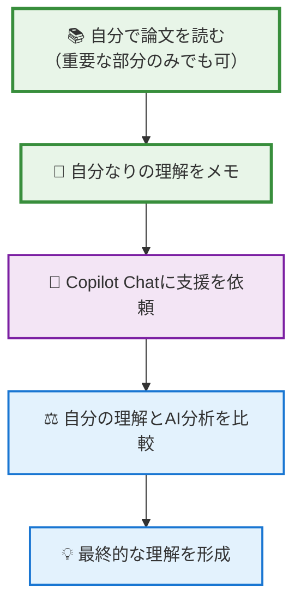
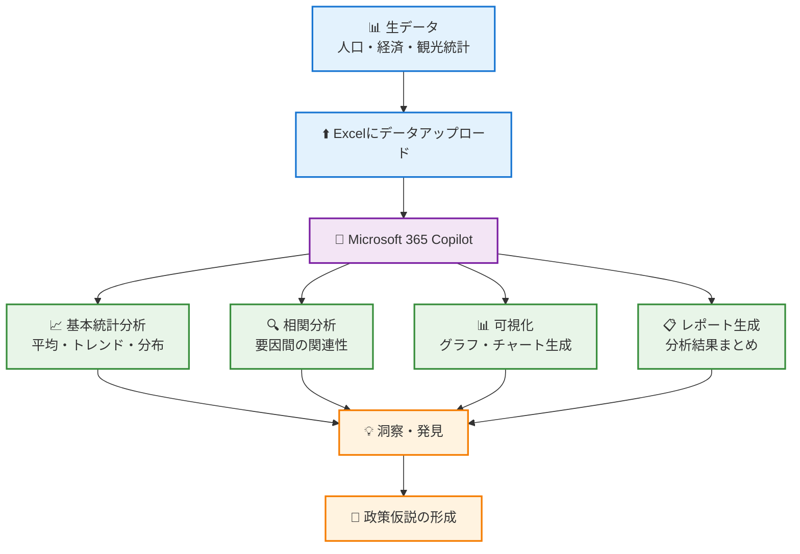
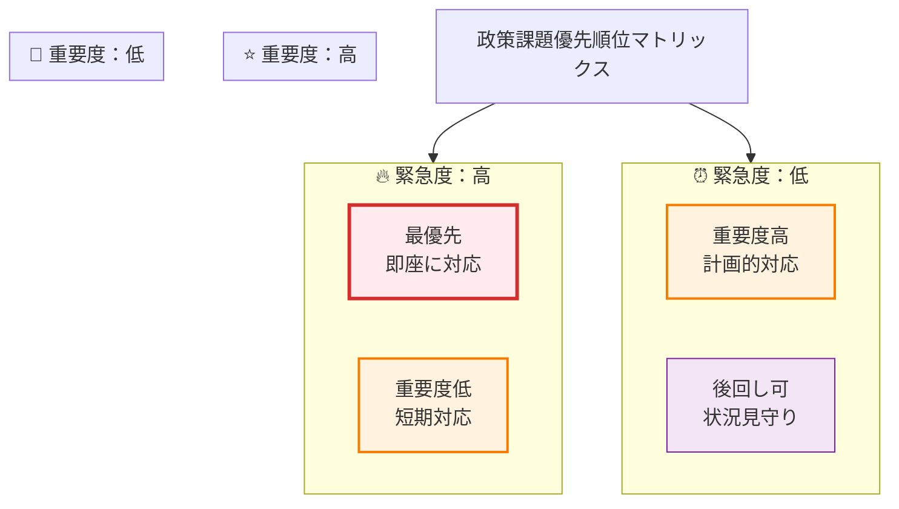

# 生成AIを活用した体系的な地域課題分析から政策立案までの全プロセス

## はじめに - データに基づく政策立案の重要性

地域公共政策士として最も重要な能力の一つは、**住民の真のニーズを把握し、それに基づいて効果的な政策を立案する**ことです。

しかし、「住民のニーズを把握する」と簡単に言っても、実際には非常に複雑なプロセスです。住民は自分の困りごとを必ずしも明確に言語化できるわけではありませんし、声の大きい人の意見だけが行政に届いてしまうこともあります。

この章では、生成AIを活用して以下のプロセスを体系的に学びます。

1. **総合リサーチ** → 先行研究・統計データ・ステークホルダー情報の効率的収集
2. **記述式アンケート** → 住民の生の声から潜在的課題を発見
3. **記述データ分析** → AIによるテキスト分析で課題を構造化
4. **マークシート調査** → 仮説を定量的に検証
5. **統計分析** → 科学的根拠に基づく優先順位決定
6. **政策立案** → エビデンスに基づく政策オプション検討

沖縄の地域特性（離島、観光、基地、災害など）を踏まえた具体例とともに、実践的なスキルを身につけていきましょう。

## 3.1 地域課題発見のための総合リサーチ手法

### 3.1.1 生成AIによる先行研究調査（認知負債回避アプローチ）

政策立案の第一歩は、その分野でこれまでどのような研究や取り組みが行われてきたかを把握することです。**ただし、認知負債を避けるため、必ず「自分でまず考える」→「AIに支援を求める」の順序で進めます。**

**🧠 認知負債回避の基本ステップ**



**Microsoft 365 Copilot Chat活用：学術論文の要約と比較分析**

Copilot Chatのファイルアップロード機能を活用しますが、**必ず事前の自己学習を前提**とします。

**Step 1：事前準備（必須）- 認知負債回避**

論文をCopilot Chatにアップロードする前に、必ず以下を実施：

1. **論文の要旨・結論部分を自分で読む**（5-10分程度）
2. **自分なりの理解をメモに記録**
3. **疑問点・不明点を明確化**

**Step 2：Copilot Chatへの依頼（適切なプロンプト）**

自分の理解をベースに、以下のようにプロンプトします：

```
私は沖縄の観光政策について研究しています。
アップロードした論文について分析をお願いします。

【私が事前に読んで理解した内容】：
- この論文の主要テーマ：[自分の理解を記載]
- 重要だと思った発見：[自分の気づきを記載]  
- よく分からなかった点：[疑問点を記載]

【AIに求める支援】：
1. 私の理解に不足や誤解があれば指摘してください
2. 研究の背景と目的をより詳しく教えてください
3. 政策提言があれば具体的内容を整理してください
4. この研究の限界や今後の課題を教えてください
5. 沖縄での応用可能性について評価してください

※私の事前理解と比較して回答してください。
```

**Step 3：複数論文の比較分析（認知負債回避継続）**

個別論文の分析を終えたら、比較分析に進みます。ここでも**自分の仮説を先に立てる**ことが重要です。

**事前準備**：
1. **自分なりの比較の視点を設定**（例：どの研究が最も実用的か）
2. **予想される共通点・相違点をメモ**
3. **最も重要だと思う発見を仮選定**

**Copilot Chatでの比較分析プロンプト**：

```
先ほど分析した観光政策に関する3つの論文について、
比較分析をお願いします。

【対象論文】：
1. 論文A：持続可能性指標の開発（宮古島事例）
2. 論文B：デジタル技術活用（石垣島事例）  
3. 論文C：住民参加型政策（久米島事例）

【私の事前予想】：
- 共通点の予想：[自分の予想を記載]
- 最も実用的だと思う手法：[理由とともに記載]
- 沖縄の他離島への適用可能性：[自分の仮説を記載]

【AIに求める分析】：
1. 私の予想と実際の比較結果の違いを指摘してください
2. 課題認識の共通点と相違点を整理してください  
3. 解決アプローチの違いと特徴を教えてください
4. 実証データの質と信頼性を比較してください
5. 他の離島への適用可能性を評価してください

※私の事前予想と比較して、見落としていた点を重点的に教えてください。
```

**Step 4：研究ギャップの特定（批判的思考の実践）**

最終段階では、既存研究の限界を特定し、新しい研究や政策の方向性を見出します。ここでも**自分の批判的思考を先に働かせます**。

**事前準備**：
1. **「まだ解決されていない問題」を自分なりにリストアップ**
2. **研究が手薄だと思う分野を予想**
3. **実務者として感じる「研究と現場のギャップ」をメモ**

**研究ギャップ特定プロンプト**：

```
沖縄の観光政策に関する既存研究のレビューを行いました。
私なりの分析について評価とアドバイスをお願いします。

【私の分析】：
よく研究されている分野：
- 持続可能性評価と指標開発
- デジタル技術活用とスマートツーリズム
- 住民参加と合意形成手法

研究が不足していると思われる分野：
- 気候変動と観光の長期的関係
- 軍事基地と観光業の共存方策
- 琉球文化継承と観光活用の両立

実務で感じる「研究と現場のギャップ」：
[自分が感じるギャップを記載]

【AIに求める評価】：
1. 私の分析の妥当性を評価してください
2. 見落としている重要な研究分野があれば指摘してください
3. 実際の政策立案で必要だが研究が不足している領域を教えてください
4. 今後の研究の方向性について提案してください

※現場実務者の視点から見た課題も含めて回答してください。
```

**Copilot Chat活用：政策事例の幅広い収集**

研究論文の分析と並行して、実際の政策事例も収集します。Copilot Chatで対話的に事例を探索できます。

**事例収集プロンプト**：

```
沖縄の離島観光振興の成功事例を教えてください。
特に以下の条件に似た事例を重視してお願いします。

条件：
- 人口1万〜5万人規模の島嶼地域
- 主要産業が観光・農業・漁業
- 本土から一定距離がある離島
- 独自の文化・伝統を持つ

国内外問わず、成功事例とその要因を教えてください。
また、失敗事例があれば、その失敗要因も含めて
教えてください。
```

**適用可能性検討プロンプト**：

```
先ほど教えていただいた事例の中から、
沖縄の離島（石垣島、宮古島、久米島など）に
最も適用しやすいものを3つ選んで、

それぞれについて：
1. 沖縄での適用における利点
2. 沖縄特有の制約・課題（基地問題、台風、離島性など）
3. 適用する場合の修正点
4. 期待される効果と必要な条件

を整理してください。
```

### 3.1.2 統計データの生成AI分析

**Microsoft 365 Copilot活用：Excelデータの自動分析**

沖縄県や各市町村が公開している統計データを効率的に分析できます。

**基本的なデータ分析プロンプト**：



**実際のプロンプト例**：

**傾向分析**：
```
このExcelファイルには過去10年間の宮古島市の
人口・観光客数・農業生産額のデータが入っています。

以下の分析をお願いします。
1. 各指標の年次推移をグラフ化
2. トレンドの特徴（増減傾向・転換点）の特定
3. 指標間の相関関係の分析
4. 特異な数値がある年があれば、その要因推定

分析結果から読み取れる宮古島の特徴と
今後の課題を3点にまとめてください。
```

**比較分析**：
```
沖縄県内の離島（石垣市・宮古島市・久米島町）の
人口動態を比較分析してください。

比較観点：
- 人口減少率の違い
- 年齢構成の変化パターン
- 社会増減（転入・転出）の傾向

そして、各島の特徴と共通課題を整理し、
政策対応の優先順位を提案してください。
```

**将来予測**：
```
過去のトレンドを基に、宮古島市の2030年の
人口・観光客数・農業生産額を予測してください。

予測の前提条件：
- 現在の政策が継続される場合
- 新型コロナ影響が2025年に正常化
- 気候変動の影響は現状程度で推移

予測結果とともに、予測の不確実性や
予測を変える可能性のある要因も教えてください。
```

### 3.1.3 ステークホルダー情報の整理

**関係者マッピング：生成AIによる包括的リスト作成**

地域課題は複数の主体が関係する複雑な問題です。見落としがちなステークホルダーを含めて、包括的に整理することが重要です。

**基本的なステークホルダー特定プロンプト**：

```
宮古島の観光オーバーツーリズム問題について、
関係するステークホルダーを整理したいと思います。

私が考えた主要関係者：
【行政】宮古島市、沖縄県、観光庁
【観光業】ホテル、旅行会社、ガイド業
【住民】地元住民、自治会

これ以外に見落としている重要な関係者はいませんか？
また、それぞれの立場・利害・影響力について
整理してください。

特に、「声が小さいが影響を受ける人々」
「問題解決のキーとなる人々」を重視して
教えてください。
```

**利害関係分析プロンプト**：

```
各ステークホルダーの利害関係を分析してください：

分析観点：
1. 現状に対する満足度（高/中/低）
2. 変化に対する姿勢（推進/慎重/反対）
3. 影響力の大きさ（高/中/低）
4. 問題解決への協力可能性

そして、政策推進において：
- 協力を得やすい関係者
- 説得が必要な関係者
- 対策を講じるべき反対関係者
を特定し、それぞれへのアプローチ方法を
提案してください。
```

**情報収集計画の策定**：

```
ステークホルダー分析を踏まえて、
効率的な情報収集・ヒアリング計画を立てたいと思います。

考慮事項：
- 限られた時間・予算での実施
- 各関係者の都合や立場への配慮
- 偏った意見収集の回避
- 対立する関係者間の調整

具体的な実施方法（個別ヒアリング、グループ討議、
アンケート調査等）と実施順序を提案してください。
```

## 3.2 記述式アンケートによる地域課題の発見

### 3.2.1 記述式アンケート設計（生成AI支援）

記述式アンケートは、住民の生の声から潜在的な課題を発見する重要な手法です。ただし、効果的な記述式アンケートを作るには、質問の設計が非常に重要です。

**質問項目の作成支援プロンプト**：

```
宮古島市の住民向けに、地域課題を発見するための
記述式アンケートを作成します。

アンケートの目的：
- 行政が把握していない住民の困りごとを発見
- 住民のニーズの優先順位を理解
- 解決策への住民の協力可能性を探る

対象者：20歳以上の宮古島市民（約4万人）
回答負担：15分程度で回答可能

以下の点を配慮した質問文を作成してください：
1. 誘導的な質問の回避
2. 幅広い年齢層に理解しやすい表現
3. 批判より建設的意見を引き出す設計
4. 回答しやすい順序・構成

まず5問程度の基本構成を提案してください。
```

**実際のアンケート例（宮古島離島振興）**：

以下は、生成AIの支援を受けて設計されたアンケート例です。

---

**宮古島の未来づくりに関するアンケート**

この調査は、宮古島市がより住みやすい島になるための施策を検討するために実施します。皆様の率直なご意見をお聞かせください。

**問1：日常生活について**
```
宮古島での日常生活において、「もっと良くなったらいいな」
と思うことを、思いつくままに自由にお書きください。
小さなことでも大きなことでも構いません。

例）買い物、交通、仕事、子育て、医療、娯楽 など

[自由記述欄]
```

**問2：島の魅力について**
```
宮古島の良いところ、これからも大切にしたいところを
教えてください。

[自由記述欄]
```

**問3：将来への期待**
```
10年後の宮古島が、どのような島になっていてほしいですか？
あなたの理想の宮古島について教えてください。

[自由記述欄]
```

**問4：行政への期待**
```
宮古島市や沖縄県に最も力を入れて取り組んでほしいことは
何ですか？その理由も含めて教えてください。

[自由記述欄]
```

**問5：島外とのつながり**
```
本島（沖縄本島）や本土との関係で、
改善したい点や強化したい点があれば教えてください。

例）交通アクセス、情報格差、経済的結びつき など

[自由記述欄]
```

---

**質問改善のためのプロンプト**：

```
作成したアンケート案について、以下の観点で改善点を
指摘してください：

1. 質問文の分かりやすさ
   - 専門用語や難しい表現はないか
   - 高齢者にも理解しやすいか
   - 誤解を招く表現はないか

2. 回答のしやすさ
   - 抽象的すぎて答えにくくないか
   - 個人的すぎる質問になっていないか
   - 回答時間は適切か

3. 情報収集の効果
   - 政策立案に必要な情報が得られるか
   - バランスの取れた視点が確保できるか
   - 見落としている重要な視点はないか

改善案とその理由も提示してください。
```

### 3.2.2 回答収集と前処理

**デジタル化支援**

紙のアンケートをデジタル化する際のAI活用：

```
手書きアンケート回答をデジタル化したテキストデータが
あります。分析前の前処理をお願いします。

処理内容：
1. 誤字脱字の修正（意味を変えない範囲で）
2. 表記揺れの統一（例：「こうつう」→「交通」）
3. 読み取りエラーの推定修正
4. 明らかに関係ない記述の除外

ただし、住民の表現や方言は尊重し、
意味が通じる限り原文を活かしてください。

[実際の回答データを貼り付け]
```

**匿名性確保**

```
アンケート回答から個人特定につながる可能性のある
情報を除去してください：

除去対象：
- 具体的な個人名、企業名、店舗名
- 特定の住所・地名（あまりに詳細なもの）
- その他、特定個人を推測できる情報

ただし、分析に必要な地域特性や属性情報は
保持してください。

処理前後の例を示して、適切性を確認させてください。
```

## 3.3 記述式アンケート結果の生成AI分析

### 3.3.1 テキスト分析による課題抽出

**頻出語分析**

住民が多く言及している問題・要望を特定します。

```
以下は宮古島市民100名からの記述式アンケート回答です。
最も頻繁に言及されている課題を5つ抽出し、
それぞれについて以下を整理してください：

1. 言及回数（具体的な数）
2. 主な表現パターン（住民がどう表現しているか）
3. 具体的な困りごとの内容
4. 住民が求めている解決の方向性

[アンケート回答データ全文を貼り付け]

抽出の際は、表面的な語句だけでなく、
住民の困りごとの本質的な内容を重視してください。
```

**感情分析**

住民の課題に対する切迫度・深刻度を測定：

```
各アンケート回答について、住民の感情的トーンを
以下の5段階で評価してください：

【緊急性】1:余裕あり ～ 5:非常に急ぐ
【深刻度】1:軽微な不便 ～ 5:生活に深刻な影響
【期待度】1:諦めている ～ 5:強い期待・要求

そして、総合的な課題の優先度を判定してください。

また、特に切迫感の強い回答については、
その背景にある状況を推測し、
早急な対応の必要性を評価してください。

[個別の回答データを順次貼り付け]
```

### 3.3.2 課題の分類と構造化

**カテゴリー分類**

住民の声を政策分野別に整理：

```
抽出された住民の課題・要望を以下のカテゴリーに
分類してください：

【インフラ・交通】道路、港湾、空港、公共交通、通信等
【経済・雇用】産業振興、就職機会、所得向上、起業支援等
【医療・福祉】病院、介護、子育て支援、障がい者支援等
【教育・文化】学校教育、生涯学習、文化活動、図書館等
【環境・防災】自然環境、ゴミ処理、防災、台風対策等
【行政サービス】窓口サービス、手続き簡素化、情報提供等
【コミュニティ】住民交流、自治会、祭り・イベント等
【その他】上記に分類できない特殊な課題

各カテゴリーごとに：
1. 件数と割合
2. 代表的な意見（原文引用）
3. 共通する課題の特徴
4. 解決の難易度（予測）

をまとめてください。
```

**課題間の関連性分析**

```
抽出された課題間の因果関係や相互影響を分析し、
図式化してください。

分析観点：
1. 根本的な原因となっている課題は何か？
2. 他の問題を引き起こしている連鎖関係はあるか？
3. 一つの解決策で複数の問題に対処できる部分はあるか？
4. 対立する要求や価値観はあるか？

そして、政策立案において：
- 最優先で取り組むべき根本課題
- 波及効果の大きい課題
- 住民合意が困難な課題
を特定してください。

分析結果は、課題の関連性が分かる図表で
視覚化して示してください。
```

### 3.3.3 住民ニーズの定量化準備

記述分析の結果を踏まえて、定量調査で確認すべき仮説を設定：

```
記述式アンケートの分析結果から、以下の仮説が
浮かび上がりました：

仮説1：交通不便さが若者の島外流出の主要因
仮説2：医療アクセスの不安が高齢者の生活満足度を下げている
仮説3：観光業の季節変動が雇用不安定の原因
仮説4：子育て環境への不満が人口流出を促進している
仮説5：行政情報の伝達不足が住民の不信を生んでいる

これらの仮説を定量的に検証するために：
1. どのような測定項目が必要か？
2. どのような属性別分析が有効か？
3. 仮説検証に適した統計手法は何か？
4. サンプルサイズはどの程度必要か？

具体的な調査設計を提案してください。
```

## 3.4 マークシート方式アンケートの作成

### 3.4.1 調査項目の設計（生成AI支援）

**尺度設計**

```
「交通の便の悪さ」について住民の実感を測る
設問を作成してください。

要件：
- 5段階評価で測定
- 中立的で理解しやすい表現
- 年齢・職業によらず回答しやすい
- 政策効果の測定にも使える

以下の要素を含めて設問を作成してください：
1. 日常的な移動（買い物、通院など）
2. 島外とのアクセス（本島・本土）
3. 公共交通の利便性
4. 交通コスト（時間・費用）

設問案とともに、選択肢の設計理由も
説明してください。
```

**設問例**：

---

**問：交通・移動について**

あなたの交通・移動に関する満足度について、それぞれお答えください。

**(1) 日常の買い物での移動の便利さ**
1. とても不便　2. やや不便　3. どちらともいえない　4. やや便利　5. とても便利

**(2) 通院や公共施設利用での移動の便利さ**
1. とても不便　2. やや不便　3. どちらともいえない　4. やや便利　5. とても便利

**(3) 沖縄本島への移動の便利さ**
1. とても不便　2. やや不便　3. どちらともいえない　4. やや便利　5. とても便利

**(4) 移動にかかる費用負担**
1. とても重い　2. やや重い　3. どちらともいえない　4. あまり重くない　5. 全く重くない

---

**バランス配慮のためのプロンプト**：

```
作成したアンケート案について、以下の偏りがないか
チェックしてください：

1. ネガティブな設問に偏っていないか？
2. 行政の取り組みへの評価も含まれているか？
3. 住民の協力意識も把握できているか？
4. 異なる立場の住民の意見が反映されるか？

バランスの取れたアンケート構成を提案し、
追加・修正すべき設問があれば具体的に示してください。
```

### 3.4.2 統計的妥当性の確保

**サンプルサイズ設計**

```
宮古島市（人口約55,000人、世帯数約28,000）で
住民アンケート調査を実施します。

調査条件：
- 20歳以上市民対象
- 信頼度95%、誤差±5%を目標
- 年齢層（20代、30代、40代、50代、60代、70歳以上）別分析
- 地域別（平良地区、城辺地区、下地地区、上野地区、伊良部地区）分析

必要なサンプル数と各層への配分数を計算してください。
また、回収率を考慮した配布数も提案してください。
```

**層化抽出の設計**

```
宮古島市での住民調査において、代表性を確保するための
層化抽出方法を設計してください。

考慮要素：
- 年齢構成（実際の人口構成に比例）
- 地域分布（5地区の人口比率）
- 職業（農業、観光業、公務員、その他）
- 居住歴（生まれてからずっと、Uターン、移住者）

抽出方法の具体的な手順と、各層のサンプル数を
計算して提示してください。
```

## 3.5 マークシート式アンケート結果の統計分析

### 3.5.1 基本統計と記述統計

**📊 基本統計とは何か？**

基本統計（記述統計）は、データの「全体的な傾向」を数値で表したものです。統計学の知識がない方でも理解できるよう、身近な例で説明します。

**主要な指標の意味：**

**1. 平均値（Mean）**
```
例：5人の年収データ
200万円、300万円、400万円、500万円、600万円
平均 = (200+300+400+500+600) ÷ 5 = 400万円
→ 「みんなの真ん中の値」を表す
```

**2. 中央値（Median）**
```
同じデータを小さい順に並べて、真ん中の値
200万円、300万円、【400万円】、500万円、600万円
中央値 = 400万円
→ 極端な値に影響されにくい「本当の真ん中」
```

**3. 標準偏差（Standard Deviation）**
```
データのばらつき具合を表す
小さい → みんなの意見が似ている
大きい → 意見がバラバラ

例：満足度調査（5段階）
パターンA：3.1, 3.2, 3.0, 3.1, 3.0 → 標準偏差0.08（意見が揃っている）
パターンB：1.5, 2.0, 3.0, 4.5, 5.0 → 標準偏差1.56（意見がバラバラ）
```

**政策立案での活用：**
- 平均値：全体的な傾向を把握
- 中央値：極端な意見に左右されない実態把握
- 標準偏差：住民の意見の一致度を測定

**Microsoft 365 Copilot + Excel活用例**

```
宮古島市民アンケートの回答データ（n=400）について
以下の分析を実行してください：

1. 基本統計
   - 各設問の平均値、標準偏差、分布
   - 回答者の属性別集計
   - 無回答・無効回答の処理

2. クロス集計
   - 年齢層×満足度
   - 居住地区×課題認識
   - 職業×政策優先順位

3. グラフ・チャート生成
   - 満足度の分布図
   - 地域別比較グラフ
   - 年代別傾向線グラフ

4. 統計的有意性の検定
   - 地域間の差の検定
   - 年代間の差の検定
   - 相関関係の有意性

分析結果を分かりやすくまとめたレポートも
自動生成してください。
```

### 3.5.2 クロス集計分析と統計的検定

**🔍 クロス集計分析とは何か？**

クロス集計は「グループごとの違い」を調べる分析です。例えば：

**質問：「20代と60代で、交通の満足度は違うか？」**
```
            満足    普通    不満    合計
20代：      15名   25名    40名    80名  → 不満が多い（50%）
60代：      45名   30名    15名    90名  → 満足が多い（50%）
```

この表から「20代は交通に不満、60代は満足」という傾向が見えます。

**⚖️ 統計的有意性とは？**

しかし、「本当に違いがあるのか、偶然なのか？」を判断する必要があります。

**χ²検定（カイ二乗検定）**
```
目的：カテゴリー同士の関連性を調べる
例：年代と満足度に関係があるか？

結果の読み方：
p < 0.05 → 有意差あり（関係がある）
p ≥ 0.05 → 有意差なし（関係があるとは言えない）

例：χ² = 12.5, p = 0.002
→ 年代と満足度には関係がある（99.8%の確信）
```

**t検定（平均値の比較）**
```
目的：2つのグループの平均値に差があるかを調べる
例：男性と女性で満足度の平均に差があるか？

男性の満足度平均：3.2点
女性の満足度平均：2.8点

t検定結果：t = 2.45, p = 0.015
→ 有意差あり（男性の方が満足度が高い）
```

**Microsoft 365 Copilotでのクロス集計実行**

```
宮古島市民アンケートのクロス集計分析をお願いします：

分析項目：
1. 年代別×各分野満足度
   - 20代、30代、40代、50代、60代以上
   - 交通、医療、教育、雇用の満足度

2. 居住地区別×政策要望
   - 5地区（市街地、農村部、海岸部、山間部、離島部）
   - 最重要政策（交通、医療、雇用、教育、観光）

3. 職業別×定住意向
   - 農業、観光業、公務員、会社員、その他
   - 今後も島に住み続けたいか（5段階評価）

各クロス集計について：
- χ²検定による有意性の確認
- 効果の大きさ（Cramérの V）の計算
- 政策的に重要な発見の特定
- 住民グループ別の対応策の提案

を含めて分析してください。
```

**因子分析**

```
住民満足度に関する20項目の回答について
因子分析を実行し、潜在的な満足度構造を
発見してください。

期待される因子：
- インフラ・利便性因子
- 経済・雇用機会因子
- 生活安全・安心因子
- コミュニティ・文化因子

分析手順：
1. 因子数の決定（固有値、寄与率）
2. 因子の命名と解釈
3. 因子得点の計算
4. 属性別因子得点の比較

分析結果から、宮古島住民の満足度構造の特徴と
政策的含意を説明してください。
```

### 3.5.3 相関分析と回帰分析

**📈 相関分析とは何か？**

相関分析は「2つのことがらの関係の強さ」を調べる分析です。

**身近な例で理解する：**
```
正の相関：「勉強時間が長いほど、テストの点数が高い」
負の相関：「年齢が高いほど、SNS利用時間が短い」  
無相関：「身長と数学の成績」（関係なし）
```

**相関係数の読み方：**
```
+1.0 ← → 0 ← → -1.0
完璧な正の相関  無関係  完璧な負の相関

実用的な目安：
0.7以上  ：とても強い関係
0.5～0.7 ：やや強い関係
0.3～0.5 ：弱い関係
0.3未満  ：ほぼ関係なし
```

**🎯 回帰分析とは何か？**

回帰分析は「複数の原因の中で、どれが結果に最も影響するか」を調べる分析です。

**身近な例：「テストの点数」に影響する要因は？**
```
要因1：勉強時間    → 影響度：大（係数 +5.2）
要因2：睡眠時間    → 影響度：中（係数 +2.1）  
要因3：朝食の有無   → 影響度：小（係数 +0.8）
要因4：テレビ視聴   → 影響度：負（係数 -1.5）

解釈：
- 勉強時間を1時間増やすと、点数が5.2点上がる
- 朝食を食べると点数が0.8点上がる
- テレビを1時間見ると点数が1.5点下がる
```

**R²値（決定係数）とは？**
```
モデルがどれだけ現実を説明できるかの指標
R²=0.8 → 80%説明できる（かなり良い）
R²=0.3 → 30%しか説明できない（他の要因もある）
```

**Microsoft 365 Copilotでの相関・回帰分析**

```
以下の変数間の相関関係と回帰分析を実行してください：

【相関分析】
変数リスト：
- 生活満足度（総合）
- 交通満足度、医療満足度、教育満足度
- 雇用満足度、行政満足度
- 定住意向、島への愛着

分析内容：
1. 相関係数マトリックスの作成
2. 有意な相関関係の特定（p<0.05）
3. 強い相関（r≥0.5）の解釈

【回帰分析】
従属変数：生活満足度（総合）
独立変数：各分野満足度（交通、医療、教育、雇用、行政）

分析内容：
1. 重回帰分析の実行
2. 各要因の標準化係数（β）の算出
3. R²値とF検定による有意性確認
4. 最も影響の大きい要因の特定

政策提言：
- 生活満足度向上に最も効果的な分野の特定
- 優先して改善すべき要因の順位付け
- 具体的な政策アプローチの提案
```

### 3.5.4 結果の解釈と可視化

**分析レポート作成支援**

```
統計分析結果から読み取れる住民ニーズの特徴を
3つのポイントにまとめ、それぞれに対する
政策対応の方向性を提案してください。

分析データ：
[具体的な統計結果を貼り付け]

まとめの観点：
1. 最も改善要求の強い分野
2. 住民間で意見が分かれる分野
3. 今後重要性が高まると予想される分野

それぞれについて：
- データの根拠（数値・統計結果）
- 背景にある要因の推測
- 具体的な政策対応案
- 実現に向けた課題

を含めて報告してください。
```

## 3.6 分析結果に基づく政策立案プロセス

### 3.6.1 政策課題の優先順位決定

**緊急度×重要度マトリックス**



**優先順位決定プロンプト**

```
調査結果から抽出された以下の政策課題について、
優先順位を決定したいと思います。

課題リスト：
1. 交通アクセス改善（本島との航空便増便）
2. 医療体制強化（専門医確保）
3. 若者雇用機会創出（IT企業誘致）
4. 高齢者生活支援（買い物・移動支援）
5. 観光客分散化（オーバーツーリズム対策）
6. 子育て支援充実（保育所・学童保育）
7. 防災体制強化（台風・津波対策）
8. 文化継承活動（言語・芸能保存）

以下の基準で評価してください：
- 緊急性（1-5段階）：住民の困窮度・時間的制約
- 重要性（1-5段階）：島の将来への影響度
- 実現可能性（1-5段階）：予算・技術・合意形成
- 波及効果（1-5段階）：他課題への連鎖的改善

総合評価と優先順位を提示し、
上位3課題の重点的推進理由を説明してください。
```

### 3.6.2 政策オプションの生成（生成AI活用）

**解決策ブレインストーミング**

```
宮古島の若者雇用機会創出について、
予算1億円、期間3年で実現可能な政策案を
5つ提案してください。

制約条件：
- 宮古島の地理的特性を活用
- 既存産業（観光・農業）との連携
- 持続可能性の確保
- 若者の定住促進効果

各政策案について：
【内容】具体的な実施方法
【予算配分】3年間の予算計画
【期待効果】雇用創出数・経済効果
【実施体制】必要な人員・組織
【リスク】想定される課題・対策
【成功指標】効果測定の方法

を整理してください。

また、複数案の組み合わせでより効果的に
なる可能性があれば提案してください。
```

**他地域事例の応用**

```
離島での雇用創出に成功した国内外の事例を参考に、
宮古島への適用方法を検討してください。

参考にしたい成功パターン：
- リモートワーク環境整備
- 地域特産品のブランド化
- 体験型観光の充実
- 再生可能エネルギー産業
- 教育・研修機関の誘致

各パターンについて：
1. 成功事例の概要
2. 成功要因の分析
3. 宮古島の条件との適合性
4. 必要な修正・工夫点
5. 実現に向けた段階的計画

を検討し、最も有望な方向性を2-3案に
絞り込んでください。
```

### 3.6.3 政策効果の予測とリスク評価

**シナリオ分析**

```
提案した若者雇用創出政策について、
3つのシナリオで効果を予測してください：

【楽観シナリオ】政策が期待通り機能した場合
- 雇用創出数：○○名
- 定住促進効果：○○名
- 経済波及効果：○○億円
- 実現確率：○○%
- 成功の前提条件

【標準シナリオ】現実的な成果が得られた場合
- 同上の項目

【悲観シナリオ】政策が十分機能しなかった場合
- 同上の項目
- 失敗の要因分析
- 最小限確保すべき成果

そして、悲観シナリオを回避するための
対策・改善点も提案してください。
```

**副作用・リスク評価**

```
若者雇用創出政策の実施によって、
意図しない副作用や負の影響が発生する
可能性を検討してください：

検討観点：
1. 既存産業・従業者への影響
2. 住民間の格差拡大リスク
3. 環境・景観への悪影響
4. 島外資本の参入による地域経済への影響
5. 急激な変化による文化・コミュニティへの影響

各リスクについて：
- 発生可能性（高/中/低）
- 影響の大きさ（大/中/小）
- 対象となる住民・地域
- 予防・軽減策
- モニタリング方法

を整理し、特に注意すべきリスクと
対応策を明確にしてください。
```

## 3.7 政策立案における生成AI活用のポイント整理

### 3.7.1 段階別AI活用マップ

```mermaid
graph TB
    subgraph Research["🔍 リサーチ段階"]
        R1["先行研究調査<br/>Copilot Chat: 論文分析"]
        R2["統計データ分析<br/>Copilot: Excel分析"]
        R3["事例収集<br/>Copilot Chat: 対話的調査"]
    end
    
    subgraph Discovery["🗣️ 課題発見段階"]
        D1["記述アンケート設計<br/>Copilot Chat: 質問文作成"]
        D2["テキスト分析<br/>Copilot Chat: 記述データ分析"]
        D3["課題構造化<br/>Copilot Chat: カテゴリー分類"]
    end
    
    subgraph Verification["📊 仮説検証段階"]
        V1["量的調査設計<br/>Copilot Chat: 統計調査設計"]
        V2["データ分析<br/>Copilot: 統計分析"]
        V3["結果解釈<br/>Copilot Chat: パターン認識"]
    end
    
    subgraph PolicyDesign["📝 政策設計段階"]
        P1["選択肢創出<br/>Copilot Chat: ブレインストーミング"]
        P2["効果予測<br/>Copilot Chat: シナリオ分析"]
        P3["リスク評価<br/>Copilot Chat: 多角的分析"]
    end
    
    subgraph Implementation["⚙️ 実装計画段階"]
        I1["具体的手順<br/>Copilot: プロジェクト計画"]
        I2["予算計画<br/>Copilot: 財務分析"]
        I3["モニタリング設計<br/>Copilot Chat: 評価指標設計"]
    end
    
    Research --> Discovery
    Discovery --> Verification  
    Verification --> PolicyDesign
    PolicyDesign --> Implementation
    
    classDef researchStyle fill:#e3f2fd,stroke:#1976d2,stroke-width:2px
    classDef discoveryStyle fill:#f3e5f5,stroke:#7b1fa2,stroke-width:2px
    classDef verificationStyle fill:#e8f5e8,stroke:#388e3c,stroke-width:2px
    classDef policyStyle fill:#fff3e0,stroke:#f57c00,stroke-width:2px
    classDef implementStyle fill:#ffebee,stroke:#d32f2f,stroke-width:2px
    
    class R1,R2,R3 researchStyle
    class D1,D2,D3 discoveryStyle
    class V1,V2,V3 verificationStyle
    class P1,P2,P3 policyStyle
    class I1,I2,I3 implementStyle
```



### 3.7.2 人間とAIの役割分担

**人間が主導すべき領域**

1. **価値判断・優先順位決定**
   ```
   例：交通改善 vs 医療充実
   - 住民の価値観・文化的背景の理解
   - 長期的な島の将来像との整合性
   - 政治的・社会的実現可能性の判断
   ```

2. **住民との対話・合意形成**
   ```
   例：政策説明会の実施
   - 住民の感情・不安への共感と対応
   - 信頼関係の構築
   - 反対意見への丁寧な応答
   ```

3. **最終的な政策決定**
   ```
   例：予算配分の決定
   - 政治的責任の取得
   - 複数利害の最終調整
   - 住民への説明責任
   ```

**AIが支援できる領域**

1. **データ処理・パターン発見**
   ```
   例：アンケート分析
   - 大量テキストの分類・要約
   - 統計的関連性の発見
   - トレンドの可視化
   ```

2. **情報収集・整理**
   ```
   例：政策事例調査
   - 類似事例の網羅的収集
   - 成功・失敗要因の整理
   - 最新動向の把握
   ```

3. **選択肢生成・効果予測**
   ```
   例：政策案の検討
   - 創造的なアイデア提案
   - 多角的な効果分析
   - リスクの体系的整理
   ```

**協働が効果的な領域**

1. **課題分析・構造化**
   ```
   人間：地域の文脈理解、住民感情の把握
   AI：客観的データ分析、論理的整理
   協働：文脈を踏まえた科学的分析
   ```

2. **政策オプション検討**
   ```
   人間：実現可能性判断、地域適合性評価
   AI：多様な選択肢生成、他地域事例提供
   協働：創造的かつ実現可能な政策設計
   ```

3. **効果測定・評価**
   ```
   人間：定性的変化の観察、住民満足度把握
   AI：定量的データ分析、パフォーマンス測定
   協働：総合的な政策評価と改善
   ```

### 3.7.3 品質管理と検証プロセス

**AI出力の批判的検証**

```
AI分析結果の妥当性をチェックするためのポイント：

1. データの代表性
   □ サンプルは住民全体を代表しているか？
   □ 無回答者の特性は考慮されているか？
   □ 声の小さい住民の意見は含まれているか？

2. 分析手法の適切性
   □ 統計手法の選択は適切か？
   □ 前提条件は満たされているか？
   □ 因果関係と相関関係を混同していないか？

3. 解釈の妥当性
   □ データから言える範囲を超えていないか？
   □ 地域の文脈を適切に反映しているか？
   □ 異なる解釈の可能性は検討されているか？

4. 政策含意の現実性
   □ 提案された政策は実現可能か？
   □ 予期しない副作用は検討されているか？
   □ 持続可能性は考慮されているか？
```

**複数ツールでのクロスチェック**

```
重要な分析については、複数のAIツールで
確認・検証を行ってください：

例：住民アンケートの分析
1. Copilot Chat：詳細なテキスト分析と論理的解釈
2. Microsoft 365 Copilot：Excel統合での統計的分析と数値検証
3. 複数回の問いかけ：異なる視点からの分析と創意工夫

各ツールの結果を比較し：
- 共通する発見事項（信頼性の高い結果）
- 相違する解釈（さらなる検討が必要）
- 補完的な洞察（総合的理解の深化）

を整理して、より確実な政策判断の基盤を
構築してください。
```

**専門家レビューの重要性**

```
AI分析結果について、以下の専門家からの
意見を求めることを推奨します。

1. 統計・調査の専門家
   - 調査設計の妥当性
   - 分析手法の適切性
   - 結果解釈の信頼性

2. 地域政策の専門家
   - 政策オプションの実現可能性
   - 他地域での類似政策の成果
   - 実施上の課題と対策

3. 住民代表・地域リーダー
   - 分析結果の住民感覚との一致
   - 見落とされている重要な視点
   - 政策受容性の評価

4. 行政実務経験者
   - 予算・人員の現実的制約
   - 既存制度との調整方法
   - 議会・住民への説明方法

専門家からの指摘を受けて、分析・提案を
修正・改善することで、より質の高い
政策立案が可能になります。
```

## まとめ：データドリブンな地域政策立案の実践

この第3章では、生成AIを活用した地域課題分析から政策立案までの体系的なプロセスを学びました。重要なポイントを振り返りましょう：

### 学習成果

1. **総合的リサーチ能力**
   - 先行研究の効率的収集・分析
   - 統計データの多角的分析
   - ステークホルダー分析の体系化

2. **住民ニーズ把握能力**
   - 記述式アンケートの効果的設計
   - テキストデータの構造化分析
   - 量的調査による仮説検証

3. **エビデンスベース政策立案能力**
   - データに基づく課題優先順位決定
   - 創造的かつ現実的な政策オプション生成
   - 効果予測とリスク評価の実施

### 次章への展開

第4章では、この章で学んだ分析手法を活用して、琉球大学の混合クラス（学部生×自治体職員）でのワークショップを実施します。理論と実務を融合させながら、実際の沖縄の政策課題に取り組みます。

### 重要な心構え

- **住民中心主義**：すべての分析・政策立案は住民の生活向上が目的
- **科学的厳密性**：データと事実に基づく客観的分析の重視  
- **地域文脈の尊重**：沖縄・各離島の特殊性への深い理解
- **持続可能性**：短期的効果だけでなく長期的影響の考慮
- **透明性・説明責任**：住民への分かりやすい説明と合意形成

生成AIは強力な分析ツールですが、それを活用するのは皆さん自身です。技術に振り回されることなく、地域公共政策士としての使命感を持って、住民のための政策立案に取り組んでください。