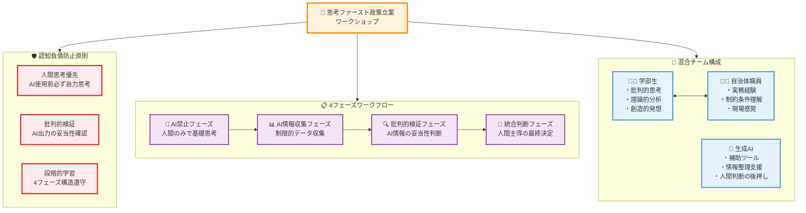
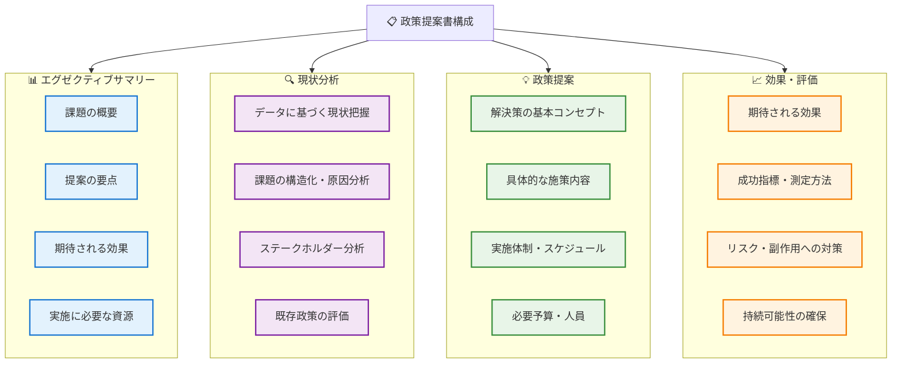
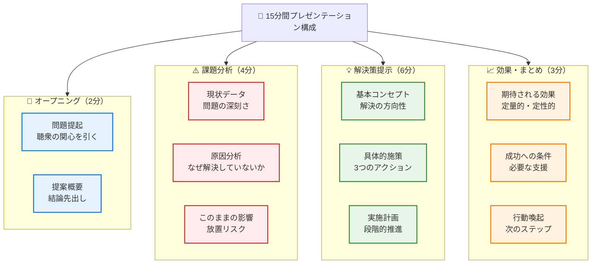
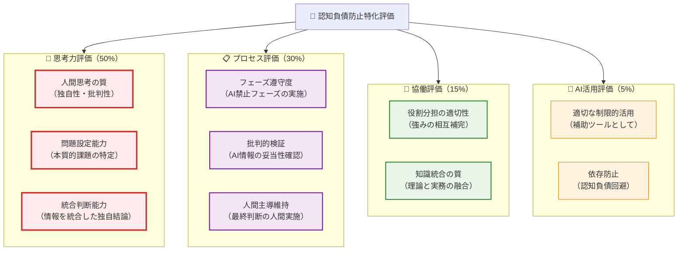
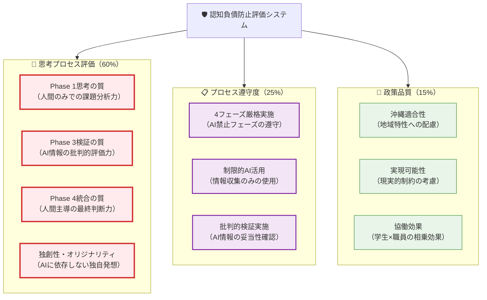

# 思考ファースト政策立案ワークショップ（認知負債防止特化）

## はじめに - 人間主導のAI協働政策立案

第3章までで学んだ生成AI活用の技術を、**認知負債を蓄積させない方法で** 実際の政策立案に活用する時が来ました。この章では、琉球大学の混合クラスの特性を最大限に活かしながら、**「思考ファースト」原則** に基づいた実践的なワークショップを行います。

## 🚨 認知負債防止の重要性

政策立案は地域住民の生活に直接影響する重要な作業です。AIに依存した「答え探し」ではなく、**人間の批判的思考力を主軸とした「問題解決」** のプロセスを確立することが不可欠です。

**このワークショップの独自性**：
- **認知負債防止**：AIに依存しない思考力を維持しながらAI活用
- **4フェーズ構造**：AI禁止→情報収集→批判的検証→統合判断の段階的学習
- **異世代協働**：20代の学部生と30-50代の職員が対等に議論
- **理論×実務**：学術的知識と現場経験の融合
- **人間主導AI活用**：最新技術を人間の思考を補助する手段として活用
- **沖縄特化**：地域の実情に根ざした具体的課題への取り組み

単なる「グループワーク」ではなく、将来的に実際の政策として採用される可能性のある本格的な政策提案を目指します。



## 4.1 認知負債防止型テーマ設定プロセス

### 4.1.1 4フェーズテーマ選定プロセス

### 🚫 Phase 1: AI禁止思考フェーズ（30分）

**重要原則**: この段階では**絶対にAIを使用しません**。人間の思考力のみで課題を特定・分析します。

**Step 1: 個人思考タイム（15分）**

各個人が**AIを一切使わずに**、自身の知識・経験・直感のみで課題を特定します。

**学部生の思考プロセス（AI禁止）**：
```
【紙とペンのみ使用】

自分の知識・経験から沖縄の政策課題を考える：

1. 日常生活で気になることは？
   - 交通渋滞、基地問題、観光客の多さ、就職先の少なさ...

2. 大学で学んだ理論から見える問題は？
   - 授業で聞いた話、教科書の内容、レポートで調べたこと...

3. 自分が解決したいと思うのはどれ？
   - 理由：なぜその問題に関心があるのか
   - 影響：誰がどう困っているのか
   - 可能性：自分に何ができそうか

⚠️ インターネット検索・AI相談は厳禁
⚠️ スマートフォンは机の上に置き、裏返す
```

**自治体職員の思考プロセス（AI禁止）**：
```
【紙とペンのみ使用】

実務経験から沖縄の政策課題を振り返る：

1. 住民から最もよく聞く苦情・要望は？
   - 窓口対応、電話相談、町民会議での発言...

2. 現場で最も対応に困っている問題は？
   - 予算不足、人手不足、法的制約、関係機関との調整...

3. 解決できれば住民生活が大きく改善される問題は？
   - 具体的な効果の想像、成功事例の記憶...

⚠️ 既存の政策文書・データ検索は禁止
⚠️ AIツールへの相談は厳禁
⚠️ スマートフォンは机の上に置き、裏返す
```

**Step 2: 人間同士の対話マッチング（15分）**

**AI使用禁止継続**。人間同士の対話のみで、学部生の関心と職員の課題認識をマッチングします。

**人間主導マッチングプロセス**：
```
【対話ルール - AI使用厳禁】

1. 相互発表（5分）
   学部生：自分の関心課題を3つ説明
   職員：自分の重要課題を3つ説明

2. 質問・対話（7分）
   - 「なぜその課題が重要だと思うのか」
   - 「その課題で最も困るのは誰か」
   - 「解決されたら誰がどう喜ぶか」
   - 「自分の強みが活かせそうな部分は」

3. 共通テーマ探し（3分）
   - 両者の関心が重なる分野は？
   - 学生の理論+職員の経験で解決できそうな課題は？
   - 沖縄らしさが活かせるテーマは？

⚠️ この段階でのスマートフォン・PC使用禁止
⚠️ 既存の政策資料参照禁止
⚠️ 人間の直感と経験のみで判断
```

### 📊 Phase 2: AI情報収集フェーズ（45分）

**解禁条件**: Phase 1で人間のみの基礎思考が完了した後のみAI使用可能

**Step 1: 制限的情報収集（30分）**

前フェーズで特定したテーマについて、**制限的に**AIを活用して情報収集を行います。

**制限的AI活用ルール**：
```
✅ 許可される活用：
- 基本的なデータ・統計の収集
- 他地域の類似事例の検索
- 専門用語・制度の基本的説明
- 既存研究の概要把握

🚫 禁止される活用：
- 解決策・アイデアの提案依頼
- 政策案の作成依頼  
- 分析結果の解釈・判断依頼
- 「どう思うか」「どうすべきか」の質問

⚠️ 重要原則：
- AIは「情報の検索エンジン」として使用
- 思考・判断は人間が実施
- 1つの情報源として扱い、鵜呑みにしない
```

**情報収集プロンプト例**：
```
沖縄県の[選定テーマ]について、以下の基本情報を
収集してください：

1. 現状データ（過去5年間の統計）
2. 関連する法令・制度の概要
3. 他の都道府県での類似事例（成功・失敗問わず）
4. この分野の専門家・研究者の見解

⚠️ 注意：解決策や政策提案は求めません。
⚠️ 客観的な情報のみ提供してください。
```

**Step 2: 情報整理と疑問点抽出（15分）**

収集した情報を**人間が主体的に**整理し、さらに調査が必要な点を特定します。

```
【人間による情報整理作業】

1. 信頼性チェック
   - この情報源は信頼できるか？
   - 最新の情報か？
   - 沖縄の実情と合っているか？

2. 重要度評価
   - 政策立案に必要な情報か？
   - 自分たちの課題設定と関連があるか？
   - 住民生活に直結する情報か？

3. 不足情報の特定
   - 何が分からないまま？
   - どの情報が古すぎる？
   - 沖縄特有の情報が不足している？
```

### 🔍 Phase 3: 批判的検証フェーズ（30分）

AIから得た情報の妥当性を人間の判断で厳しく検証します。

### 4.1.2 沖縄特有課題の具体例と批判的アプローチ

**テーマ例1：台風常襲地域における避難行動促進策**

**Phase 1 (AI禁止) での思考例**：
```
学部生の人間思考：
- 自分の体験：去年の台風で友人の家族が避難しなかった
- 授業の記憶：心理学で「現状維持バイアス」を学んだ
- 疑問：なぜ危険と分かっていても人は避難しないのか？

職員の人間思考：
- 現場経験：避難勧告を出しても避難率は30%程度
- 住民の声：「避難所が不便」「ペットが心配」
- 課題：高齢者ほど「いつもの台風」と軽視する傾向
```

**Phase 2 (制限的AI活用) での情報収集例**：
```
✅ 適切な質問：
「過去10年間の沖縄県内での台風による避難者数の統計を教えて」
「日本国内の避難行動に関する研究論文の概要を教えて」

🚫 不適切な質問：
「避難行動を促進する最適な政策を提案して」
「この問題をどう解決すべきか教えて」
```

**Phase 3 (批判的検証) での検証例**：
```
批判的思考チェックリスト：
□ AIが提供したデータの出典は明確か？
□ 全国データは沖縄の実情に当てはまるか？
□ 過去の成功事例は本当に効果があったのか？
□ 失敗事例やリスクについても調べたか？
□ 住民の実際の声と統計データは一致しているか？
```

### 🤝 Phase 4: 統合判断フェーズ（45分）

人間主導でAI情報と現場知識を統合し、最終的な政策方向性を決定します。

**統合思考プロセス例**：
```
【人間による統合判断 - AI依存禁止】

1. 情報統合（20分）
   学部生の理論知識：
   - 行動経済学の「現状維持バイアス」
   - 災害心理学の「正常化バイアス」
   
   職員の現場知識：
   - 実際の避難率データ
   - 住民からの具体的苦情・要望
   
   AI収集情報：
   - 他地域の避難促進事例
   - 避難行動に関する研究データ

2. 批判的統合（15分）
   - 理論は現実的に適用可能か？
   - 他地域事例は沖縄で応用できるか？
   - データは住民の実感と一致しているか？
   - 予算・組織的制約は考慮されているか？

3. 独自解決策の創出（10分）
   - 沖縄特有の条件（島嶼性、文化等）を活かせる案は？
   - 学生の新しい視点と職員の経験を組み合わせた案は？
   - 実現可能性と革新性を両立できる案は？
```

**テーマ例2：観光地での住民生活と観光業の調和策**

**学部生の貢献**：
- 観光学、都市計画学の理論的フレームワーク
- オーバーツーリズムに関する国際的研究動向
- デジタル技術を活用した観光客分散システム

**職員の貢献**：
- 住民からの苦情・要望の具体的内容
- 観光業界との調整における現実的制約
- 既存の観光客誘導施策の効果と限界

**AI活用ポイント**：
- 観光客行動パターンの分析
- 住民意識調査データの分析
- 調和策の効果シミュレーション

**テーマ例3：離島における若者定住促進策**

**学部生の貢献**：
- 人口移動論、地域経済学の理論適用
- リモートワーク等新しい働き方の可能性
- 他地域の成功事例の学術的分析

**職員の貢献**：
- 若者流出の実際の要因（ヒアリング結果）
- 地元企業の雇用創出の現実的制約
- U・Iターン支援策の実施状況と課題

**AI活用ポイント**：
- 人口移動データの多角的分析
- 雇用創出政策の他地域事例調査
- 若者向けの魅力的な情報発信コンテンツ作成

### 4.1.3 認知負債防止型調査計画の策定

**4フェーズ調査設計プロセス**：

**Phase 1: AI禁止調査計画（人間思考のみ）**
```
【紙とペンのみ使用 - 20分間】

限られた時間（2週間）・リソースで何を調べるべきか、
人間の判断のみで優先順位を決める：

調査リソース：
- 人員：学部生1名、職員1名、指導教員1名
- 予算：調査経費なし
- 時間：平日夜間・土日の合計20時間程度

人間思考による優先順位付け：
1. 最も重要な疑問は何か？（住民の声、実態把握）
2. 最も実現可能な調査は何か？（既存資料、ヒアリング）  
3. 最も時間効率の良い調査は何か？（一石二鳥の調査）
4. 最も信頼性の高い情報源は？（一次情報、現場関係者）

⚠️ AI相談・インターネット検索禁止
⚠️ 人間の常識と経験のみで判断
```

**Phase 2: 制限的AI活用調査支援**
```
【情報収集ツールとしてのみAI使用 - 30分間】

Phase 1で決定した調査項目について、基礎情報を収集：

✅ 適切なAI活用：
- 「沖縄県内でのXXに関する既存調査・統計を教えて」
- 「XXについてヒアリングすべき関係者・組織を教えて」
- 「XX分野の専門家・研究者のリストを教えて」

🚫 不適切なAI活用：
- 「調査計画を作成して」
- 「どの調査手法が最適か教えて」
- 「調査結果をどう分析すべきか教えて」
```

**Phase 3: 批判的検証**
```
【AI情報の妥当性検証 - 20分間】

収集した調査関連情報を人間が検証：

検証チェックリスト：
□ 提案された調査手法は実際に実行可能か？
□ 想定される調査対象者は協力してくれそうか？
□ 調査期間・予算の制約内で実施できるか？
□ 沖縄の地域特性・文化的配慮は十分か？
□ 学生・職員それぞれの強みを活かせる分担か？
```

**Phase 4: 統合調査計画決定**
```
【人間主導の最終計画策定 - 30分間】

各フェーズの成果を統合し、実行可能な調査計画を確定：

最終計画の要素：
1. 調査の核心目的（1文で表現）
2. 必須調査項目（3つ以内）
3. 実施方法・分担（具体的）
4. スケジュール（週単位）
5. 成果物の形式（報告書構成）
6. リスク対策（Plan B）

⚠️ この段階でもAIは情報整理のみ
⚠️ 判断・決定は必ず人間が実施
```

## 4.2 認知負債防止型政策提案作成

### 4.2.1 4フェーズ提案書作成プロセス

**政策提案書の標準構成**：



**認知負債防止原則での各セクション作成**

### 🚫 Phase 1: AI禁止アウトライン作成（30分）

**人間のみで提案書の骨格を作成**：
```
【紙とペンのみ使用】

学部生・職員が協力して以下を人間思考で作成：

1. 問題の本質是握（10分）
   - 「誰が、なぜ、どんなことで困っているのか」
   - 「解決されない本当の理由は何か」
   - 「位民の生活にどんな影響を与えているか」

2. 解決策の方向性検討（10分）
   - 「アプローチA：制度・システムで解決」
   - 「アプローチB：意識・行動変化で解決」
   - 「アプローチC：リソース・人材で解決」

3. 実現可能性の現実チェック（10分）
   - 「予算・人員の制約は？」
   - 「法令・制度の制約は？」
   - 「関係者の協力が得られるか？」

⚠️ この段階ではスマートフォン、PC使用厳禁
⚠️ 人間の判断と常識のみで構成を作成
```

### 📊 Phase 2: 制限的AI支援フェーズ（45分）

**情報補強のみでAI使用可能**

**2.1 エグゼクティブサマリー作成支援（15分）**：
```
以下の人間が作成した提案骨格について、
簡潔で分かりやすい表現に整理してください：

人間が作成した骨格：
[前フェーズで作成した内容を貼付]

整理の方針：
- A4用紙1枚以内（800字程度）
- 数値・データを効果的に活用
- 専門用語は最小限、平易な表現で
- 論理的で追いやすい構成

⚠️ 重要：内容の判断・変更はしないこと
⚠️ 表現の整理・明确化のみ
```

**2.2 現状分析セクション作成支援（15分）**：
```
人間が調査で収集したデータ・情報を
論理的な構成に整理してください：

収集データ：
[人間が収集した具体的な情報を記載]

整理の観点：
1. データ間の関連性の明確化
2. 時系列変化のパターン抽出
3. 地域関の特徴整理
4. グラフ・表の推奨形式

⚠️ 重要：データの解釈・判断はしない
⚠️ 情報の構造化・可視化のみ
⚠️ 「原因」「対策」の提示は禁止
```

**2.3 政策オプション整理支援（15分）**：
```
人間が検討した政策オプションを
比較検討しやすい形式に整理してください：

人間が検討したオプション：
[前フェーズで人間が検討した内容を記載]

整理の方針：
- 比較表形式での整理
- 実施難易度の分類
- 必要リソースの明確化
- 時間軸での整理（短期・中期・長期）

⚠️ 重要：オプションの追加・判断は禁止
⚠️ 人間のアイデアの構造化のみ
```

### 🔍 Phase 3: 批判的検証フェーズ（30分）

**AI情報の妥当性を人間が厳しく検証**

```
【批判的検証チェックリスト】

1. 表現・構成の整理結果検証（10分）
   □ 人間の意図が正確に伝わる表現になっているか？
   □ 重要な情報が漏れていないか？
   □ 不適切な表現や誇張が含まれていないか？

2. 情報の精度検証（10分）
   □ AIが整理したデータの正確性は確認できているか？
   □ 数値・統計に誤りはないか？
   □ 引用・参考情報は信頼できるか？

3. 沖縄適合性検証（10分）
   □ 沖縄の地域特性が適切に反映されているか？
   □ 全国一律の理論を機械的に適用していないか？
   □ 住民の実感と乳離した内容になっていないか？
```

### 🤝 Phase 4: 統合判断・最終化フェーズ（45分）

### 4.2.2 人間主導の最終統合プロセス

**役割分担の最適化**

```
学部生担当セクション：
✅ 理論的背景・先行研究レビュー
✅ 他地域事例の調査・分析
✅ データ分析・可視化
✅ 革新的アイデアの提案

職員担当セクション：
✅ 現場実態の詳細説明
✅ 実現可能性の評価
✅ 予算・法令制約の整理
✅ 実施体制・スケジュール

共同作業セクション：
🤝 課題設定・問題意識の共有
🤝 政策オプションの比較検討
🤝 最終提案の統合・調整
🤝 プレゼンテーション準備
```

**人間主導の最終統合プロセス**：
```
【紙とペンでの最終作業 - 45分間】

1. 素材の整理・統合（15分）
   人間思考の成果：
   [前フェーズで人間が作成した素材]
   
   AI整理の成果：
   [前フェーズでAIが整理した素材]
   
   批判的検証の結果：
   [前フェーズで人間が検証した結果]

2. 人間判断による統合方針決定（15分）
   - どの情報を最終提案に反映するか？
   - どの情報は参考程度に止めるか？
   - 沖縄特有の要素をどこに組み込むか？
   - 学生・職員の知見をどう融合させるか？

3. 独自性のある最終提案作成（15分）
   - AIの提案をそのまま採用するのではなく
   - 人間の思考を主軸とした独自性のある提案を作成
   - 沖縄らしさ、チームらしさを活かした内容に

⚠️ AIの提案を組み合わせただけの提案は禁止
⚠️ 最終的な判断・決定は必ず人間が実施
```

### 4.2.3 認知負債防止型品質管理

**人間主導の最終品質チェック**：

```
【人間による最終検証 - 30分間】

1. 認知負債チェック（10分）
   □ AIの情報に過度に依存した箇所はないか？
   □ 人間の獨自思考が十分に反映されているか？
   □ AIの提案をそのままコピーした箇所はないか？

2. 沖縄適合性チェック（10分）
   □ 地域の実情・文化・特性が適切に反映されているか？
   □ 住民の実感と乳離した内容になっていないか？
   □ 沖縄らしい独自性のある解決策になっているか？

3. 協働品質チェック（10分）
   □ 学生の理論的知識が活かされているか？
   □ 職員の実務経験が活かされているか？
   □ 両者の知見の融合により新しい価値が生まれているか？

最終的な品質判断：
- この提案は人間が主導して作成したものか？
- AIは適切に補助ツールとして活用されたか？
- 将来の政策作業でも人間の思考力を維持できるか？
```

**セルフチェックシートの作成**：

```
各チームは以下のセルフチェックシートで最終確認：

【認知負債防止チェック】
☐ Phase 1でAIを一切使用せず人間思考で基礎を作った
☐ Phase 2でAIを情報収集のみに制限して使用した
☐ Phase 3でAI情報を人間が批判的に検証した
☐ Phase 4で人間主導の最終統合・判断を行った
☐ 最終成果物に人間の独自性・創造性が反映されている

【学習成果チェック】
☐ AIに依存せずに政策立案できる能力が身についた
☐ AIを適切な補助ツールとして活用できるようになった
☐ 人間同士の協働で高い価値を創造する経験を得た
☐ 沖縄の課題への理解と解決意欲が高まった
☐ 批判的思考力と問題解決力が向上した
```

## 4.3 認知負債防止型プレゼンテーション準備

### 4.3.1 効果的プレゼンテーション設計

**聴衆別プレゼンテーション戦略**

政策提案のプレゼンテーションでは、聴衆によってアプローチを変える必要があります。

**聴衆分析プロンプト**：
```
以下の聴衆に対する政策提案プレゼンテーション（15分）の
構成と訴求ポイントを提案してください：

聴衆構成：
- 自治体幹部職員（部長・課長級）：40%
- 議会議員（与野党混合）：30%
- 住民代表（自治会長等）：20%
- 学識経験者（大学教員）：10%

各層の関心事：
- 幹部職員：実現可能性、予算、効果測定
- 議員：住民への説明責任、政治的インパクト
- 住民代表：生活への具体的影響、負担軽減
- 学識経験者：理論的妥当性、革新性

時間配分と各パートでの訴求ポイントを
具体的に提案してください。
```

**スライド構成テンプレート**：



**スライド作成支援プロンプト**：
```
政策提案プレゼンテーション用のスライドを作成します。
以下の内容を、視覚的に分かりやすく、
説得力のあるスライドに構成してください：

提案内容：[具体的な政策提案]
調査データ：[主要な数値・グラフ]
期待効果：[定量的な効果予測]

各スライドについて：
1. スライドタイトル
2. キーメッセージ（1文）
3. 表示する情報・データ
4. 視覚化の方法（グラフ、図表、画像等）
5. 話すべきポイント（3-4点）

特に重視すること：
- 1スライド1メッセージの原則
- 数値データの効果的な可視化
- 専門用語の平易な説明
- ストーリー性のある流れ
```

### 4.3.2 質疑応答対策の準備

**想定質問への準備**

政策提案に対する質問を予測し、適切な回答を準備します。

**想定質問作成プロンプト**：
```
以下の政策提案について、各ステークホルダーから
出されそうな質問・懸念を予測し、
それぞれへの適切な回答を準備してください：

政策提案：[具体的な提案内容]

想定される質問者：
1. 予算担当者：コストと財源に関する質問
2. 法務担当者：法的根拠と手続きに関する質問  
3. 現場職員：実施上の困難さに関する質問
4. 住民代表：生活への影響に関する質問
5. 反対派：政策の問題点・リスクに関する質問

各質問について：
- 質問内容（具体的に）
- 質問の背景・真意
- 効果的な回答内容
- 使用すべきデータ・事例
- 避けるべき回答

特に難しい質問には複数の回答パターンを
用意してください。
```

**反論対応戦略**：
```
政策提案に対する批判的意見への対応戦略を
検討してください：

予想される反論：
1. 「予算がかかりすぎる」
2. 「効果が不確実だ」  
3. 「他にもっと重要な課題がある」
4. 「住民の負担が大きい」
5. 「前例がなく危険だ」

対応の基本方針：
- 感情的にならず、データ・事実で応答
- 相手の懸念に共感を示す
- 代替案・修正案の提示
- 段階的実施によるリスク軽減
- 成功事例・専門家意見の活用

各反論に対する3段階対応：
1. 理解・共感の表明
2. 事実・データによる説明
3. 建設的な解決策の提示
```

### 4.3.3 認知負債防止特化評価システム

**思考力中心の評価システム**



**評価シート作成プロンプト**：
```
政策提案プレゼンテーションの評価シートを作成してください。

評価対象：
- 混合チーム（学部生+職員）による政策提案
- 15分間のプレゼンテーション + 質疑応答
- 生成AI活用を含む政策立案プロセス

評価者：
- 指導教員（学術的観点）
- 自治体幹部職員（実務的観点）  
- 住民代表（市民的観点）
- 他の学習者（相互評価）

評価項目：
各項目を5段階（優秀5-普通3-要改善1）で評価

1. 政策内容（50点）
2. プレゼンテーション技術（30点）
3. 協働プロセス（20点）

各項目の具体的な評価基準と、
総合評価のフィードバック方法を
設計してください。
```

## 4.4 認知負債防止プロセスによる実際の沖縄政策事例ワークショップ

### 4.4.1 認知負債防止型ケーススタディ1：宮古島の水資源管理政策

**背景設定**：
宮古島は地下水に依存する離島で、近年の観光客増加と気候変動により水資源の安定確保が課題となっています。このケーススタディでは、**4フェーズ認知負債防止プロセス**を厳格に適用します。

### 🚫 Phase 1: AI禁止思考フェーズ（45分）

**重要原則**: この段階では**絶対にAIを使用しません**。人間の知識・経験・直感のみで課題分析を行います。

**Step 1: 個人思考タイム（20分）**

**学部生の人間思考プロセス（AI厳禁）**：
```
【紙とペンのみ使用】

宮古島の水資源問題を自分の知識で考える：

1. 授業・教科書で学んだ水資源管理理論は？
   - 地下水の持続可能利用原則
   - 水需要予測の方法論
   - 環境保全と経済発展のバランス

2. 一般的な離島の水問題として知っているものは？
   - 淡水レンズの脆弱性
   - 塩水侵入のリスク
   - 技術者不足の問題

3. 観光と水資源の関係で考えられる問題は？
   - ピーク時の需要集中
   - 施設（ホテル・ゴルフ場）の大量使用
   - 住民生活への影響

⚠️ インターネット検索・AI相談は厳禁
⚠️ スマートフォンは電源OFF
⚠️ 既存資料の参照禁止
```

**職員の人間思考プロセス（AI厳禁）**：
```
【紙とペンのみ使用】

実務経験から宮古島の水問題を振り返る：

1. 住民からの苦情で多いものは？
   - 水圧低下、水質の問題
   - 渇水時の給水制限への不満
   - 水道料金値上げへの反発

2. 現場で対応に困った事例は？
   - 大口利用者との料金交渉
   - 老朽管の漏水対策
   - 技術職員の人材確保

3. 島民と観光客の水利用で見た問題は？
   - ホテルの節水協力への温度差
   - 緊急時の優先順位の調整
   - 住民理解の必要性

⚠️ 既存の政策資料・データ検索は禁止
⚠️ AIツールへの相談は厳禁
⚠️ 人間の記憶と経験のみで思考
```

**Step 2: 人間同士対話による課題統合（25分）**

```
【対話ルール - AI使用絶対禁止】

1. 相互発表（10分）
   学部生：理論的観点からの課題認識を説明
   職員：実務経験から見た課題認識を説明

2. 課題の優先順位付け（10分）
   - 最も緊急性の高い問題は？
   - 最も影響の大きい問題は？
   - 最も解決しやすい問題は？

3. 人間思考による仮説設定（5分）
   - なぜこの問題が発生しているのか？
   - どういう解決の方向性が考えられるか？
   - 何を調べれば解決策が見えるか？

⚠️ この段階でのデジタル機器使用完全禁止
⚠️ 人間の直感と経験の対話のみ
```

### 📊 Phase 2: 制限的AI活用フェーズ（60分）

**解禁条件**: Phase 1での人間主導の基礎分析完了後のみAI使用可能

**Step 1: 制限的情報収集（40分）**

**制限的AI活用ルール**：
```
✅ 許可される活用：
- 宮古島の基本的統計データ（人口、観光客数、水使用量）
- 地下水・水道に関する技術的基礎知識
- 他の離島での水資源管理事例
- 関連法令・制度の概要

🚫 厳格に禁止される活用：
- 解決策・政策提案の作成依頼
- 「どうすべきか」「どう思うか」の質問
- 分析結果の解釈・評価依頼
- 意思決定に関する助言要求

⚠️ 重要原則：
- AIは情報検索エンジンとしてのみ使用
- 思考・判断・評価は100%人間が実施
```

**情報収集プロンプト例**：
```
宮古島の水資源管理について、以下の客観的データを
収集してください：

1. 過去10年間の年間降水量データ
2. 地下水位の変動データ（あれば）
3. 観光客数と水使用量の関係データ
4. 他の離島（久米島、石垣島等）での水資源対策事例
5. 海水淡水化・雨水利用の技術概要とコスト

⚠️ 重要：解決策や政策提案は一切求めません
⚠️ 客観的事実・数値データのみ提供してください
⚠️ 評価・判断・意見は含めないでください
```

**Step 2: 人間による情報整理と疑問点抽出（20分）**

```
【人間主導の情報整理作業】

1. 信頼性チェック（7分）
   学部生担当：データの学術的妥当性確認
   職員担当：実務的な現実性確認
   - この情報は信頼できるか？
   - 宮古島の実情と一致しているか？
   - 最新の情報か？

2. 重要度評価（8分）
   - 政策立案に必須の情報は？
   - Phase 1の仮説と一致/矛盾する情報は？
   - さらに詳細な調査が必要な分野は？

3. 不足情報の特定（5分）
   - 重要だが入手できていない情報は？
   - 宮古島特有の情報で不足しているものは？
   - 住民の実態に関する情報で足りないものは？
```

### 🔍 Phase 3: 批判的検証フェーズ（45分）

**AI情報の妥当性を人間が厳格に検証**

**Step 1: データ妥当性の批判的分析（25分）**

```
【批判的思考チェックリスト】

技術的妥当性（学部生主導）：
□ 提供されたデータの出典は明確で信頼できるか？
□ 統計データの収集方法は適切か？
□ 他地域事例は宮古島に適用可能な条件か？
□ 技術的解決策のコストは現実的に計算されているか？
□ 環境への影響評価は十分に考慮されているか？

実務的妥当性（職員主導）：
□ 提供された情報は現場の実感と一致しているか？
□ 予算・人員の制約は現実的に反映されているか？
□ 住民・事業者の協力確保は可能な内容か？
□ 法令・制度上の制約は正確に把握されているか？
□ 実施体制は現実的に構築可能か？

地域適合性（共同検証）：
□ 宮古島の島嶼性は十分考慮されているか？
□ 地元文化・住民性は配慮されているか？
□ 台風などの気象条件は考慮されているか？
```

**Step 2: 情報の統合的評価（20分）**

```
【人間による統合評価プロセス】

1. 情報源の多角的検証（8分）
   - 複数の情報源で一致している内容は？
   - 情報源によって異なる見解がある内容は？
   - どの情報源が最も信頼できるか？

2. 宮古島固有性の考慮（7分）
   - 全国データは宮古島に当てはまるか？
   - 他離島事例は宮古島で応用できるか？
   - 宮古島特有の条件で修正すべき点は？

3. 仮説の再検証（5分）
   - Phase 1で設定した仮説は正しかったか？
   - 新しい情報で修正すべき仮説は？
   - さらに検証が必要な仮説は？
```

### 🤝 Phase 4: 統合判断フェーズ（90分）

**人間主導で全情報を統合し、独自の政策提案を創出**

**Step 1: 情報統合と課題の再構造化（30分）**

```
【人間による統合思考プロセス - AI依存厳禁】

1. 課題の根本原因特定（15分）
   学部生の理論的分析：
   - 水資源管理の理論から見た構造的問題
   - 持続可能性の観点から見た長期的課題
   
   職員の実務的分析：
   - 現場で直面する具体的問題
   - 住民・事業者の実際のニーズと制約
   
   統合分析：
   - 理論と実務の両面から見た真の課題は？

2. 解決の基本方針決定（15分）
   - 短期的緊急対策と長期的解決策の両立
   - 技術的解決と制度的解決の組み合わせ
   - 住民参加と専門性確保のバランス
```

**Step 2: 独自解決策の創出（35分）**

```
【宮古島オリジナル政策の創出】

1. 宮古島特化型解決策の発想（20分）
   - 島の地理的・文化的特性を活かした独自案
   - 学生の新しい視点 × 職員の現場経験
   - 他地域にはない宮古島ならではの強みは？

2. 実現可能性と革新性の両立（15分）
   - 現実的制約内で実現可能な革新的提案
   - 段階的実施による実現性向上
   - リスクを最小化する実施戦略

⚠️ この段階でもAIは情報整理のみ
⚠️ 政策の方向性・内容決定は100%人間が実施
```

**Step 3: 最終政策提案の完成（25分）**

```
【人間主導の最終統合】

政策提案「宮古島型持続可能水資源管理システム」

1. 基本コンセプト（5分）
   - 人間が決定した独自の政策哲学
   - 宮古島らしさを活かした解決アプローチ

2. 具体的施策パッケージ（15分）
   - 緊急対策（1年以内）
   - 中期戦略（3年以内）
   - 長期ビジョン（10年後）

3. 実施体制と評価システム（5分）
   - 住民参加型管理システム
   - 継続的モニタリング体制
   - 政策効果の測定・評価方法

⚠️ 最終決定は必ず人間が主導
⚠️ AIの提案をそのまま採用することは禁止
```

### 4.4.2 認知負債防止型ケーススタディ2：石垣島における外国人観光客対応策

**背景設定**：
石垣島では台湾・韓国からの観光客が急増していますが、言語・文化の違いによるトラブルや、観光サービスの質向上が課題となっています。このケーススタディでも**4フェーズ認知負債防止プロセス**を厳格に適用します。

### 🚫 Phase 1: AI禁止思考フェーズ（45分）

**重要原則**: **絶対にAIを使用せず**、人間の経験・知識・直感のみで課題を分析します。

**Step 1: 個人思考タイム（20分）**

**学部生の人間思考プロセス（AI厳禁）**：
```
【紙とペンのみ使用】

石垣島の外国人観光客問題を自分の知識で考える：

1. 授業・メディアで知った外国人観光客の問題は？
   - 言語バリア、文化摩擦、マナー問題
   - オーバーツーリズム、地域住民との対立
   - インフラ・サービス不足

2. 自分が石垣島で外国人観光客と接した経験は？
   - 道案内で困った場面
   - 店舗・交通機関での言語問題
   - 文化的違いを感じた瞬間

3. 国際観光の理論から考える課題は？
   - 受入れ体制の整備
   - 地域文化の保護と活用
   - 持続可能な観光開発

⚠️ インターネット検索・AI相談は厳禁
⚠️ スマートフォンは電源OFF
⚠️ 既存データの参照禁止
```

**職員の人間思考プロセス（AI厳禁）**：
```
【紙とペンのみ使用】

実務経験から外国人観光客対応問題を振り返る：

1. 窓口・現場で実際に困った事例は？
   - 言語が通じない緊急時対応
   - 文化的誤解によるトラブル処理
   - 制度・手続きの説明の困難

2. 住民・事業者からの苦情で多いものは？
   - 騒音・マナー問題
   - 交通渋滞の悪化
   - 地元利用施設の混雑

3. 現在の対応で限界を感じる部分は？
   - 通訳・翻訳の人材不足
   - 多言語対応の予算制約
   - 関係機関との連携不足

⚠️ 既存の政策資料・統計参照禁止
⚠️ AIツールへの相談は厳禁
⚠️ 人間の記憶と経験のみで思考
```

**Step 2: 人間同士対話による課題統合（25分）**

```
【対話ルール - AI使用絶対禁止】

1. 相互発表（10分）
   学部生：理論・知識から見た課題認識を説明
   職員：現場経験から見た課題認識を説明

2. 課題の分類と優先順位（10分）
   - 緊急性が高く即座に対応が必要な問題は？
   - 影響が大きく根本的解決が必要な問題は？
   - 比較的解決しやすい問題は？

3. 人間思考による解決仮説（5分）
   - 問題の根本原因は何だと考えるか？
   - どのようなアプローチで解決できそうか？
   - 何を調査すれば具体策が見えてくるか？

⚠️ デジタル機器の使用完全禁止
⚠️ 人間の対話と思考のみで進行
```

### 📊 Phase 2: 制限的AI活用フェーズ（60分）

**解禁条件**: Phase 1での人間主導の基礎分析完了後のみAI使用可能

**Step 1: 制限的情報収集（40分）**

**制限的AI活用ルール**：
```
✅ 許可される活用：
- 石垣島の外国人観光客数の基本統計
- 他地域での外国人観光客対応事例の概要
- 多言語対応サービスの基本的な種類・コスト
- 観光トラブル対応に関する制度・法令の概要

🚫 厳格に禁止される活用：
- 解決策・対応策の提案依頼
- 「どうすべきか」「どう対応すべきか」の質問
- 政策案・施策の作成依頼
- 効果的な対応方法の判断依頼

⚠️ 重要原則：
- AIは情報収集ツールとしてのみ使用
- 分析・判断・意思決定は100%人間が担当
```

**情報収集プロンプト例**：
```
石垣島における外国人観光客対応について、
以下の客観的情報を収集してください：

1. 過去5年間の国別観光客数データ
2. 外国人観光客関連のトラブル・苦情の種類と件数
3. 他の観光地（沖縄本島、京都、箱根等）での多言語対応事例
4. 観光案内・緊急時対応の多言語サービスの種類
5. 外国人観光客対応に関する法的義務・制度

⚠️ 重要：解決策や対応方法は求めません
⚠️ 客観的データ・事例の概要のみ提供
⚠️ 評価・推奨・判断は含めないこと
```

**Step 2: 人間による情報整理と検証（20分）**

```
【人間主導の情報整理作業】

1. 信頼性・適用性チェック（8分）
   学部生担当：データの学術的妥当性、他地域事例の理論的適用性
   職員担当：実務的実現可能性、石垣島の実情との整合性
   - 情報源は信頼できるか？
   - 石垣島の状況に適用できるか？

2. 重要度・緊急度評価（7分）
   - Phase 1の仮説を支持する情報は？
   - Phase 1で見落としていた重要な問題は？
   - 最も深刻で緊急性の高い課題は？

3. 追加調査の必要性判断（5分）
   - さらに詳細な情報が必要な分野は？
   - 石垣島特有の情報で不足しているものは？
   - 住民・観光業者の生の声で必要なものは？
```

### 🔍 Phase 3: 批判的検証フェーズ（45分）

**AI情報の妥当性を人間が厳格に検証**

**Step 1: 情報の批判的検証（25分）**

```
【批判的思考チェックリスト】

理論的妥当性（学部生主導）：
□ 提供されたデータの収集方法は適切か？
□ 他地域事例は石垣島の条件に適用可能か？
□ 観光学・国際関係論の理論と整合しているか？
□ 多言語対応の効果は科学的に実証されているか？
□ 文化摩擦の解決方法は理論的に妥当か？

実務的妥当性（職員主導）：
□ 現場の実感と提供された情報は一致するか？
□ 予算・人員制約は現実的に反映されているか？
□ 関係機関との連携は実際に可能な内容か？
□ 住民・事業者の協力は得られる内容か？
□ 法的・制度的制約は正確に把握されているか？

石垣島適合性（共同検証）：
□ 石垣島の規模・特性に適した内容か？
□ 離島特有の制約条件は考慮されているか？
□ 地元文化・住民性との調和は可能か？
```

**Step 2: 情報源の信頼性検証（20分）**

```
【情報源の多角的検証】

1. データの信頼性検証（8分）
   - 官公庁統計と民間調査結果は整合しているか？
   - 情報が古すぎる、または偏った視点でないか？
   - 石垣島の実情を正確に反映したデータか？

2. 他地域事例の適用可能性（7分）
   - 成功事例の条件は石垣島にも当てはまるか？
   - 失敗事例・課題についても十分に検討したか？
   - 規模・予算・制約条件は類似しているか？

3. 情報の網羅性チェック（5分）
   - 重要な観点・ステークホルダーが漏れていないか？
   - 短期・長期両面の視点が含まれているか？
   - リスク・副作用についても情報があるか？
```

### 🤝 Phase 4: 統合判断フェーズ（90分）

**人間主導で全情報を統合し、石垣島独自の対応策を創出**

**Step 1: 課題の根本原因分析（30分）**

```
【人間による統合思考プロセス - AI依存厳禁】

1. 真の課題構造の特定（15分）
   学部生の理論的分析：
   - 国際観光の理論から見た構造的問題
   - 異文化コミュニケーションの課題
   
   職員の実務的分析：
   - 現場で直面する具体的困難
   - 住民・事業者の真のニーズ
   
   統合分析：
   - 表面的問題と根本的問題の区別
   - 理論と実務の両面から見た真の課題

2. 石垣島固有の条件整理（15分）
   - 離島であることの制約と可能性
   - 地元文化・住民性の特徴
   - 利用可能なリソースと制約条件
```

**Step 2: 石垣島オリジナル対応策の創出（35分）**

```
【独自性のある解決策創出プロセス】

1. 石垣島らしい解決アプローチの発想（20分）
   - 地域の文化的特性を活かした対応は？
   - 住民と観光客が win-win になる方法は？
   - 他地域にはない石垣島独自の強みは？
   - 学生の新鮮な視点 × 職員の実務経験 = ？

2. 実現可能性と効果性の両立（15分）
   - 限られた予算・人員で最大効果を得る方法
   - 段階的実施による着実な改善
   - 失敗リスクを最小化する工夫

⚠️ AIは情報整理の補助のみ
⚠️ 政策方針・内容は100%人間が決定
```

**Step 3: 最終政策パッケージの完成（25分）**

```
【石垣島型外国人観光客対応政策の完成】

政策提案「石垣島版おもてなし多文化共生システム」

1. 基本理念・コンセプト（5分）
   - 石垣島らしい「おもてなし」の具現化
   - 文化的対立から文化的共生への転換

2. 具体的対応策パッケージ（15分）
   緊急対応（6ヶ月以内）：
   - 即効性のある多言語対応システム
   中期改善（2年以内）：
   - 地域全体の受入れ体制強化
   長期ビジョン（5年後）：
   - 持続可能な多文化共生観光地の実現

3. 実施・評価システム（5分）
   - 住民・観光業界・行政の連携体制
   - 効果測定と継続的改善のしくみ

⚠️ 最終判断は人間が主導
⚠️ AIの提案をそのまま採用することは厳禁
```

### 4.4.3 認知負債防止特化型成果発表と相互評価

**認知負債防止を重視した発表会設計**

**発表形式**：各チーム20分（発表15分+認知負債防止プロセス説明3分+質疑2分）

**評価者構成と評価観点**：
- **学術評価者**（指導教員、外部研究者）：理論的妥当性、独創性、思考の深度
- **実務評価者**（自治体幹部、関連業界代表）：実現可能性、現場適用性
- **認知負債専門評価者**（心理学・教育学専門家）：人間主導思考の維持度
- **市民評価者**（住民代表、NPO関係者）：住民目線での説得力・共感度

**認知負債防止プロセスの発表要件**：

```
各チームは政策内容に加えて、以下を必ず発表：

1. 4フェーズ実施状況（3分）
   - Phase 1（AI禁止）での人間思考の成果
   - Phase 2（制限的AI活用）での情報収集範囲
   - Phase 3（批判的検証）での検証プロセス
   - Phase 4（統合判断）での人間主導決定

2. 認知負債防止の効果実感
   - AIに依存せずに思考できた実感
   - 人間の判断力向上の体感
   - チーム内協働の質的変化

⚠️ 単なる政策発表ではなく、認知負債防止プロセスの
⚠️ 学習成果を重視した発表内容とする
```

**認知負債防止特化型評価システム**：



**認知負債防止効果の測定**：

```
【発表後の認知負債防止効果測定】

1. 個人レベルの変化測定（15分）
   Before（ワークショップ前）→ After（ワークショップ後）
   
   □ AI使用前に自力で考える習慣ができたか？
   □ AI情報を批判的に検証する能力が向上したか？
   □ 人間主導で最終判断を下す自信がついたか？
   □ AIに過度に依存する傾向が減少したか？

2. チームレベルの協働効果測定（20分）
   
   □ 人間同士の対話の質が向上したか？
   □ 異なる背景の知識を統合する能力が身についたか？
   □ AIに頼らずに問題解決する集団思考力が向上したか？
   □ 将来の政策立案でも同様のプロセスを実行できるか？

3. 認知負債蓄積防止の確認（10分）
   
   □ AIの提案をそのまま採用したくなる誘惑を resist できたか？
   □ 「AIが言ったから正しい」という思考パターンを避けられたか？
   □ 人間の直感・経験・価値判断を重視できたか？
   □ 長期的な思考力維持への意識が高まったか？
```

**優秀提案の認知負債防止基準による選定**

```
認知負債防止観点での優秀提案選定基準：

⭐ 最優秀賞（思考力維持賞）：
- Phase 1での人間思考が最も深く、独創的
- AI情報の批判的検証が最も厳格
- 最終提案に人間の価値判断が明確に反映

🏆 協働優秀賞：
- 学生×職員の知識統合が最も効果的
- 人間同士の対話による価値創造が顕著
- AI活用と人間主導のバランスが最適

🎯 実用性優秀賞：
- 沖縄の実情に最も適合した現実的提案
- 住民・事業者の共感を最も得られる内容
- 実際の政策化の可能性が最も高い

重要原則：
- AI依存度が高い提案は評価対象外
- 人間の思考プロセスが不明確な提案は低評価
- 認知負債防止効果の体感が薄い場合は要再考
```

**実政策化への認知負債防止継続**

```
優秀提案の実政策化プロセスでも認知負債防止を継続：

実政策化の各段階で人間主導を維持：
1. 関係自治体への提案書提出
   → 人間が作成した提案の価値を強調
2. 担当部署での検討・評価  
   → AI分析の補助は可、最終判断は人間
3. 提案内容の修正・調整
   → 人間の価値判断を優先した修正
4. 議会・住民への説明
   → AIではなく人間が作成した政策であることを明示
5. 試行実施・効果検証
   → 人間による質的評価とAI分析の組み合わせ

学習の継続：
- 実政策化プロセス全体を通じて認知負債防止を実践
- 政策実現の過程でも人間主導の意思決定を貫く
- 将来の政策立案への応用可能なプロセスとして習得
```

## まとめ：認知負債防止による健全な政策立案能力の確立

### 4.4.4 認知負債防止ワークショップから得られる学習成果

**認知負債防止による個人レベルの成果**

**学部生の認知負債防止効果**：
- **人間優先思考力**：AI使用前に自力で課題分析する習慣の確立
- **批判的AI活用能力**：AI情報を鵜呑みにせず検証する力
- **理論実用化能力**：人間の判断で学術知識を現実的政策に応用
- **独立思考力**：AIに依存せずに創造的アイデアを発想する能力

**職員の認知負債防止効果**：
- **経験価値の再認識**：AIでは代替できない現場経験の価値を理解
- **人間主導判断力**：最終決定を人間が下す責任感と能力
- **AI補助活用力**：AIを道具として使いこなし、依存しない技術
- **創造的問題解決力**：既存の枠を超えた独自解決策の発想力

**認知負債防止による協働効果**

- **人間中心協働**：AIに頼らず人間同士の対話で価値を創造
- **相補的思考統合**：異なる知識・経験を人間の判断で統合
- **集団批判的思考**：チーム全体でAI情報を検証・評価する能力
- **持続可能な協働力**：将来もAIに依存しない協働関係の構築

**認知負債防止による社会的影響**

- **人間主導政策文化**：AIに依存しない政策立案文化の創造
- **思考力重視評価**：効率性より人間の思考力を重視する価値観
- **技術と人間の適切な関係**：AIを道具として活用する健全なモデル
- **将来世代への継承**：認知負債を回避する政策立案方法の継承

### 認知負債防止の長期的効果

**10年後の姿（認知負債を防止できた場合）**：

```
✅ 期待される効果：

個人レベル：
- AIに依存せずに独立して政策立案ができる
- 常に批判的思考でAI情報を検証する習慣
- 人間の価値判断と創造性を維持・向上
- 技術変化に振り回されない安定した思考力

組織レベル：
- 人間主導の意思決定文化が定着
- AI活用と人間の判断の適切な役割分担
- 長期的視点に基づく政策立案能力
- 住民の信頼を得る透明性の高い政策プロセス

社会レベル：
- 技術に振り回されない安定した政策運営
- 人間の尊厳を重視した地域運営
- 持続可能で住民中心の政策文化
- 他地域のモデルとなる健全なAI活用
```

**10年後の姿（認知負債を防止できなかった場合のリスク）**：

```
⚠️ 回避すべきリスク：

個人レベル：
- AI提案を検証せずに採用する習慣化
- 独立した政策立案能力の著しい低下
- 批判的思考力の減退と依存体質
- 創造性・独創性の喪失

組織レベル：
- AI依存による政策品質の低下
- 人間の責任感・当事者意識の希薄化
- 長期的視点を欠いた短絡的政策
- 住民ニーズとかけ離れた技術優先政策

社会レベル：
- 技術企業に政策を依存する危険性
- 人間性を軽視した非人道的政策運営
- 地域特性を無視した画一的政策
- 住民の政治への信頼失墜
```

### 次章への発展：認知負債防止の継続

第4章で確立した認知負債防止プロセスを、第5章「市民参加と合意形成」でも継続適用します。住民との対話・合意形成プロセスでも**「思考ファースト」**原則を貫き、AIを道具として活用しながら人間主導で進める手法を学びます。

**第5章での認知負債防止継続ポイント**：
- 住民との対話でもAI依存を回避
- 合意形成プロセスで人間の価値観を重視
- タウンホールミーティング等での人間中心コミュニケーション
- 市民の声の分析でもAI補助・人間判断の原則維持

### 認知負債防止の根本的価値

**人間の尊厳を守る政策立案**

この章で皆さんが身につけたのは、単なる「効率的なAI活用スキル」ではありません。それは、**AIが進歩しても人間の思考力・判断力・創造性を維持し、技術を人間が制御する健全な関係を確立する能力**です。

**地域公共政策士としての使命**

皆さんは、**「AIと健全に協働し、認知負債を回避しながら、住民の幸福と地域の持続可能な発展を人間主導で実現する次世代の地域公共政策士」**として成長しました。

この能力は：
- **沖縄県民の生活を真に向上させる政策を生み出す力**
- **技術の進歩に振り回されない安定した政策運営能力**  
- **人間の価値観・文化・尊厳を重視した地域運営力**
- **他地域・他国のモデルとなる健全なAI時代の政策立案力**

として、AI時代の沖縄、日本、そして世界の未来を、**人間主導で**切り開く原動力となるのです。

**認知負債防止は、単なる学習技法ではなく、人間としての尊厳を守り、民主主義を維持し、地域住民の幸福を実現するための、必須の能力なのです。**