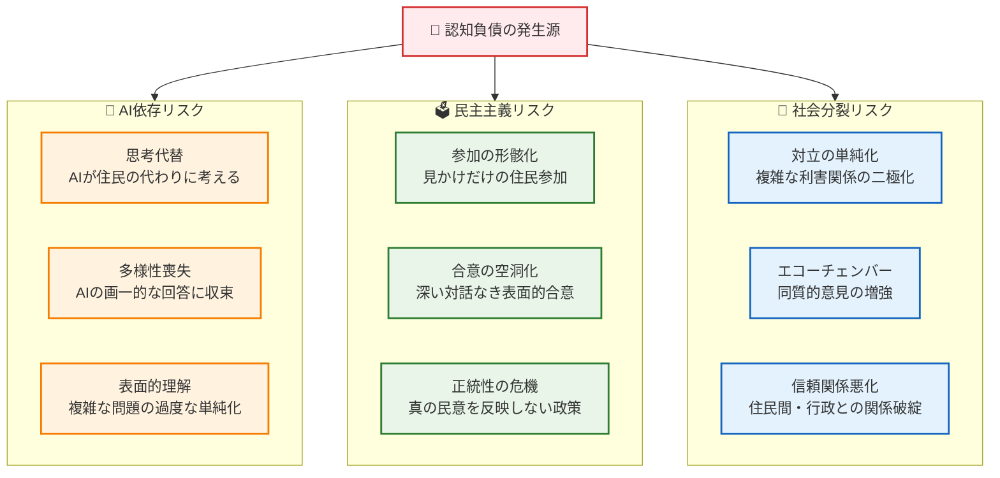
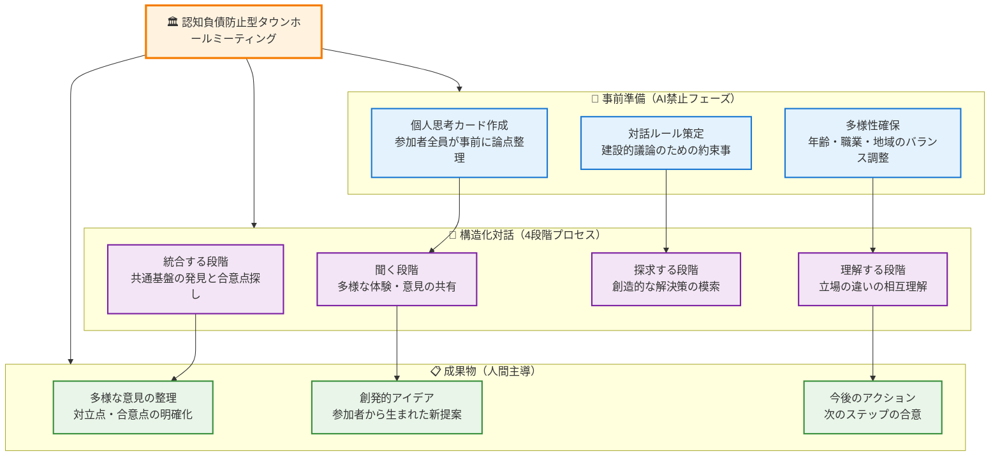
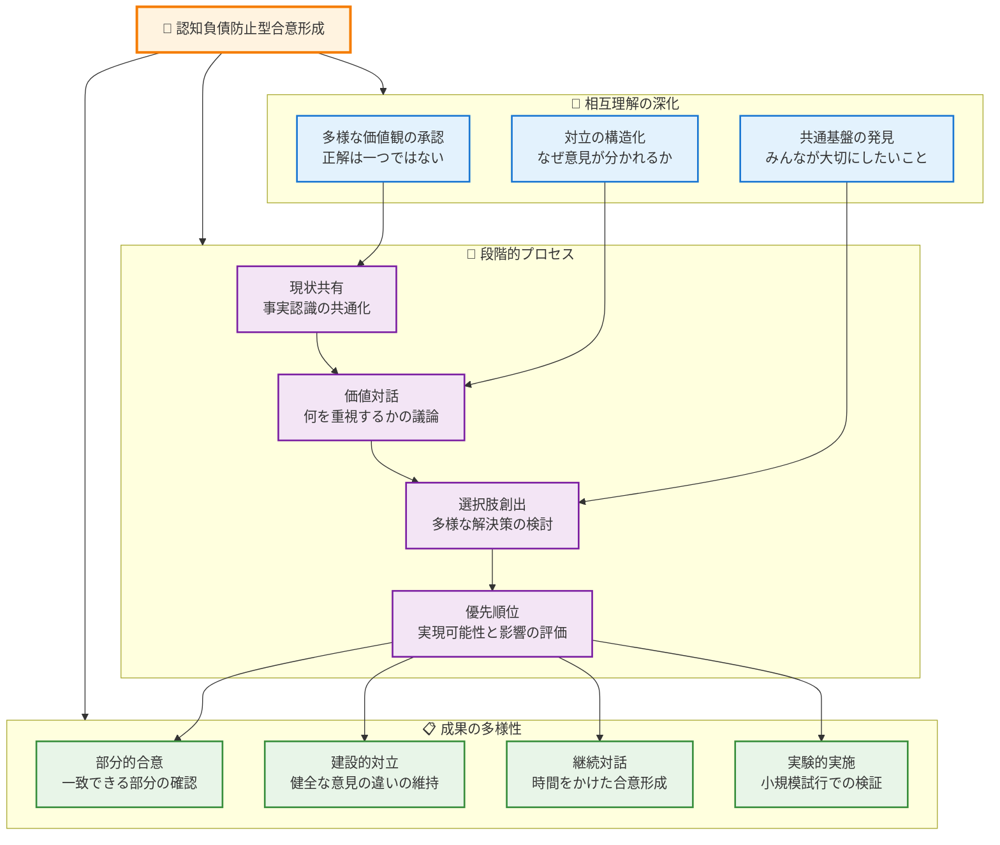

# 住民参加型政策形成

## はじめに - 人間主導の民主的プロセス設計

第4章で習得した「思考ファースト」原則を、より幅広い市民参加と合意形成に展開します。この章では、**住民一人ひとりの批判的思考力を育て、民主主義を深化させるAI活用手法**を学びます。

## 🚨 市民参加における認知負債の深刻なリスク

市民参加プロセスでAIに依存すると、以下の深刻な問題が発生します：

- **思考の画一化**：AIが示す「模範的な意見」に住民が収束し、多様性が失われる
- **議論の浅薄化**：複雑な問題をAIが単純化し、本質的な対話が阻害される
- **民主主義の形骸化**：住民の真の意見形成プロセスがAIに代替され、民主的正統性が失われる
- **社会の分裂加速**：AIが作る「分かりやすい対立構造」が住民間の溝を深める



## 5.1 認知負債防止型住民説明会の設計

### 5.1.1 4フェーズ住民説明プロセス

**従来の説明会の問題点**：
- 行政からの一方的な情報提供
- 住民の受動的な質疑応答
- AIが作成した「完璧な資料」による思考停止
- 表面的な理解による形式的な合意

**思考ファースト住民説明会の設計**：

### 🚫 Phase 1: AI禁止事前思考フェーズ（住民個人作業）

**実施期間**: 説明会の1週間前
**参加方法**: 各家庭での個人作業

```
【住民への事前課題 - AI使用厳禁】

政策案について、以下の質問に「紙とペンのみ」で答えてください：

1. 個人的関心・影響の整理（15分）
   - この政策によって、あなたや家族の生活はどう変わりそうですか？
   - どんな点で良い影響がありそうですか？
   - どんな点で心配や不安がありますか？
   - 今の生活で関連する経験はありますか？

2. 地域への影響予想（15分）
   - あなたの住んでいる地区にとってどんな変化が起こりそうですか？
   - 近所の人たちはどんな反応を示しそうですか？
   - 地域の特色や文化にどんな影響がありそうですか？
   - この政策で一番困りそうな人は誰ですか？

3. 疑問・質問の整理（10分）
   - この政策について、どんなことが知りたいですか？
   - 実施方法で不明な点は何ですか？
   - 費用や期間について気になることは？
   - 他の地域での事例があるか知りたいですか？

⚠️ インターネット検索・AI相談は厳禁
⚠️ 家族・知人との相談も個人思考終了後に
⚠️ 人間の直感・経験・常識のみで回答
```

### 📊 Phase 2: 制限的AI情報提供フェーズ（説明会当日前半）

**AI活用の厳格なルール**：

```
✅ 許可されるAI活用：
- 基本的な用語・制度の説明
- 他地域の類似事例の紹介
- 統計データの分かりやすい表示
- 実施スケジュールの整理

🚫 禁止されるAI活用：
- 政策の「良い点」「悪い点」の判断提示
- 住民にとっての「最適解」の提案
- 反対意見・懸念への「回答」の生成
- 「住民の理解促進」を目的とした説得材料の作成

⚠️ 重要原則：
- AIは「情報整理ツール」としてのみ使用
- 判断・評価は住民が独自に実施
- 複数の観点を平等に提示
```

**情報提供プロセス例**：

```
【説明会当日前半 - 60分間】

1. 政策概要の客観的説明（20分）
   行政職員が政策の基本的な仕組みを説明
   （AIで整理した資料を補助的に使用）

2. 制限的AI情報提供（30分）
   住民からの事前質問に対して、AIツールで収集した
   客観的情報のみを提示：
   - 類似事例の実施結果（成功・失敗両方）
   - 関連する統計データ
   - 法的制度的背景
   - 実施に必要な期間・予算

3. 質問・疑問の追加受付（10分）
   Phase 1で住民が準備した質問を集約
   新たに生まれた疑問点を整理
```

### 🔍 Phase 3: 批判的検証フェーズ（説明会当日中盤）

住民主導で情報の妥当性を検証し、多角的な議論を行います。

```
【住民主導の批判的検証 - 45分間】

1. 情報信頼性チェック（15分）
　小グループ（5-6人）での作業：
   ✓ 提供されたデータは信頼できるか？
   ✓ 他地域事例は沖縄の状況に当てはまるか？
   ✓ 見落とされている観点はないか？
   ✓ 都合の良い情報だけ選んでいないか？

2. 多角的影響分析（20分）
   各グループが異なる視点で検討：
   - 高齢者グループ：高齢者への影響
   - 子育て世代グループ：子ども・教育への影響
   - 商工業者グループ：地域経済への影響
   - 環境・文化グループ：自然・文化への影響

3. 懸念・リスク洗い出し（10分）
   各グループが想定されるリスクを率直に議論：
   - 実施に失敗した場合どうなるか？
   - 予想外の副作用があり得るか？
   - 途中で中止する場合の影響は？
   - 他の重要課題への影響は？

⚠️ この段階でも住民同士の対話が中心
⚠️ AI相談や行政への依存は避ける
⚠️ 多様な意見の尊重・対立の許容
```

### 🤝 Phase 4: 人間主導合意形成フェーズ（説明会当日後半）

最終的な意見集約と今後の方向性を人間主導で決定します。

```
【住民主導の合意形成 - 60分間】

1. 各グループ発表（20分）
   Phase 3で各グループが検討した結果を発表：
   - 政策への評価（良い点・問題点）
   - 想定されるリスクと対策の必要性
   - 実施に当たっての条件・要望
   - 代替案があれば提案

2. 全体討議（30分）
   住民同士の直接対話：
   - 異なる立場での意見交換
   - 共通の関心事項の確認
   - 対立点の明確化と相互理解
   - 妥協案・修正案の検討

3. 今後の進め方決定（10分）
   政策に対する住民の総意をまとめ：
   - 賛成・条件付き賛成・反対の分布確認
   - 追加検討が必要な事項の特定
   - 次回住民集会の開催方法決定
   - 継続的な意見交換の方法確定

⚠️ 行政は進行役に徹し、誘導は避ける
⚠️ AIツールでの「合意案生成」は禁止
⚠️ 住民の生の声を最大限尊重
⚠️ 対立があることも含めて正確に記録
```

## 5.2 認知負債防止型住民アンケートの実施

### 5.2.1 思考誘発型質問設計

**従来アンケートの問題**：
- 選択肢が住民の思考を制限
- AIが生成した「誘導的」な設問
- 複雑な問題の単純化による本質の見落とし

**認知負債防止型アンケート設計**：

```
【思考ファースト住民アンケート設計原則】

1. オープンエンド質問の積極活用
   ❌「この政策に賛成ですか？ 1.賛成 2.反対 3.どちらでもない」
   ✅「この政策について、あなたはどう考えますか？あなたの言葉で自由にお書きください」

2. 体験・経験に基づく質問
   ❌「観光客の増加についてどう思いますか？」
   ✅「あなたが日常生活で観光客の増加を実感した具体的な場面があれば教えてください」

3. 段階的思考を促す質問構成
   ❌ いきなり政策評価を求める
   ✅ 現状認識→影響分析→評価→要望の順で思考を深化

4. 多角的視点を引き出す質問
   ❌「地域にとって良いかどうか」だけを聞く
   ✅ 個人・家族・地域・将来世代への影響をそれぞれ聞く

5. AIに依存しない回答の促進
   ❌ 「正しい答え」があることを前提とした質問
   ✅ 「あなたならでは」の体験・価値観に基づく回答を促す質問
```

### 5.2.2 4フェーズアンケート実施プロセス

**Phase 1: AI禁止事前思考質問（第1回アンケート）**

```
【第1回アンケート - AI使用禁止】

実施タイミング：政策案公表直後
回答方法：紙のアンケート（オンライン回答不可）
回答時間：制限なし（じっくり考えて回答）

設問例：

問1：この政策に関連して、あなたが過去に経験した出来事があれば、具体的に教えてください。

問2：この政策が実施された場合、あなたの日常生活にどのような変化が起こると想像しますか？良い変化、気になる変化の両方について、できるだけ具体的にお書きください。

問3：あなたの住んでいる地域の特色や文化を考えた時、この政策はどのような影響を与えると思いますか？

問4：この政策について、家族や近所の人、職場の同僚などと話したことがあれば、どのような反応や意見が出たか教えてください。

問5：この政策に関して、行政に詳しく説明してほしい点、質問したい点があれば教えてください。

⚠️回答欄にはAI使用禁止の注意書きを明記
⚠️インターネット検索も使わず、ご自身の体験・感覚でご回答ください
```

**Phase 2: 制限的AI活用情報提供（補足資料配布）**

第1回アンケート結果を踏まえ、住民が求めた情報を客観的に提供します。

```
【補足情報資料 - AI活用による情報整理】

住民アンケートで多かった質問への回答：

✅ 適切なAI活用例：
「他県での類似政策の実施結果（成功・失敗事例）」
「関連する統計データの整理・可視化」
「法的制度的な背景の分かりやすい説明」
「実施に必要な期間・予算の詳細」

❌ 不適切なAI活用例：
「政策への住民の望ましい反応」の生成
「懸念や反対意見への『適切な回答』」の作成
「住民説得用の論理構成」の設計
「『バランスの取れた意見』」の提示

注意事項：
- この資料はあくまで情報提供です
- 判断・評価はご自身で行ってください  
- 疑問があれば第2回アンケートでお書きください
```

**Phase 3: 批判的検証質問（第2回アンケート）**

```
【第2回アンケート - 批判的検証】

問1：補足資料をご覧になって、新たに気づいたこと、疑問に思ったことがあれば教えてください。

問2：他地域の事例は参考になりましたか？沖縄（あなたの地域）との違いで気になる点があれば教えてください。

問3：提供されたデータや情報で、「本当だろうか？」「他の見方もあるのでは？」と感じた点があれば教えてください。

問4：この政策の良い面だけでなく、リスクや副作用についてあなたはどう考えますか？

問5：政策実施に当たって、「これだけは確認・配慮してほしい」という条件があれば教えてください。
```

**Phase 4: 統合判断・合意形成質問（第3回アンケート）**

```
【第3回アンケート - 最終的な意見集約】

問1：これまでの情報と議論を踏まえて、この政策に対するあなたの総合的な考えを教えてください。

問2：もしこの政策を実施するとしたら、どのような条件や配慮が必要だと思いますか？

問3：もしこの政策に課題があるとしたら、どのような代替案や修正案が考えられますか？

問4：今回の政策検討プロセスについて、良かった点・改善すべき点があれば教えてください。

問5：今後、同様の政策を検討する際に、どのような住民参加の方法が良いと思いますか？

最後に：この政策検討を通じて、あなた自身の地域への関心や政策への理解に変化があったかどうか、率直にお聞かせください。
```

## 5.3 認知負債防止型タウンホールミーティング

### 5.3.1 思考主導対話プロセスの設計

**従来のタウンホールミーティングの問題**：
- 声の大きい人の意見に偏る
- 対立が感情的になり建設的議論にならない
- AIが用意した「模範的発言」に収束
- 複雑な問題が単純化されて本質を見失う

**認知負債防止型タウンホールミーティング**：



### 5.3.2 事前準備：AI禁止個人思考カード

**実施期間**：ミーティングの1週間前
**参加者**：事前申込をした住民（40名程度）

```
【個人思考カード - AI使用厳禁】

参加者の皆様へ：
タウンホールミーティングを建設的にするため、事前にご自身の考えを整理してください。

カード1：あなたの立場・関心（10分）
- あなたはどのような立場から、この問題に関心を持っていますか？
- この問題があなた・あなたの家族に与える影響は？
- あなたが最も大切にしている価値観は何ですか？

カード2：あなたの体験・観察（10分）
- この問題に関連して、あなたが実際に体験したことは？
- 日常生活でこの問題を実感した場面は？
- 周囲の人（家族・友人・同僚）からどんな声を聞いていますか？

カード3：あなたの質問・疑問（10分）
- この問題について、どんなことが知りたいですか？
- 他の参加者にどんなことを聞いてみたいですか？
- 行政にどんな質問・要望がありますか？

カード4：あなたの提案・アイデア（10分）
- この問題を解決するために、どんな方法が考えられますか？
- 他の地域や過去の経験で参考になりそうなことは？
- 「こんなことができたらいいな」という理想があれば教えてください。

⚠️ AIツール・インターネット検索は使用しないでください
⚠️ 正解を探すのではなく、あなたらしい考えをお書きください
⚠️ 他人と相談せず、まずはご自身の考えをまとめてください
```

### 5.3.3 4段階構造化対話プロセス

**Stage 1: 聞く段階（60分）**

```
【多様な体験・意見の共有】

1. 個人発表（5分×8人、計40分）
   - 8つのテーブルに分かれて着席（各テーブル5名）
   - 各自が作成した思考カードを基に発表
   - 他の参加者は質問禁止、批判禁止で「聞くだけ」
   - ファシリテーターが時間管理と要点記録

2. テーブル内共有（20分）
   - 聞いて印象に残った体験・意見の振り返り
   - 「知らなかった」「なるほど」と思った点の共有
   - 多様な立場があることの確認
   
⚠️ この段階では議論・反論は行わない
⚠️ 「聞く」ことに集中し、理解に努める
⚠️ AI支援での「要点整理」も禁止（人間が手書きメモ）
```

**Stage 2: 理解する段階（45分）**

```
【立場の違いの相互理解】

1. 質問タイム（30分）
   - 他の人の発言で詳しく聞きたい点を質問
   - 「なぜそう思うのか」「どんな体験に基づくのか」を深掘り
   - 批判ではなく理解を深めるための質問に限定
   - 答える側も率直に背景・理由を説明

2. 共通点・相違点の整理（15分）
   - テーブルごとに参加者間の共通点を確認
   - 立場・価値観の違いを整理（対立として捉えない）
   - 「なぜ違った見方をするのか」の理由を理解
   
⚠️「正しい・間違っている」の判断は避ける
⚠️ 違いがあることを自然なこととして受け入れる
⚠️ 相手の立場に立って理解する努力
```

**Stage 3: 探求する段階（60分）**

```
【創造的な解決策の模索】

1. 課題の本質探求（30分）
   - 表面的な対立の奥にある本質的な課題は何か？
   - みんなが本当に求めているものは何か？
   - 今の延長線上では解決できない理由は？
   - テーブルを越えてディスカッション（2テーブル合同）

2. 創造的アイデア出し（30分）
   - 既存の枠を超えた解決策のブレインストーミング
   - 「こんなことできたらいいな」レベルでのアイデア出し
   - 他地域事例、過去の成功体験からヒントを得る
   - 批判・実現可能性の検討は後回し
   
⚠️ この段階でも「AI案の検索」は禁止
⚠️ 人間の創造性・直感を最大限活用
⚠️ 突拍子もないアイデアも歓迎
```

**Stage 4: 統合する段階（45分）**

```
【共通基盤の発見と合意点探し】

1. 全体共有（25分）
   - 各テーブルから創造的アイデアを全体発表
   - 他テーブルのアイデアへの感想・発展案
   - 「これは良い」「これは難しいかも」の率直な反応

2. 合意点と今後の方向性（20分）
   - 参加者の多くが共感できる方向性の確認
   - 対立点が残る部分の整理（解消を無理しない）
   - 次に必要な調査・検討事項の特定
   - 継続的な対話の必要性と方法の合意
   
⚠️ 無理な合意形成は避ける
⚠️ 対立があることも含めて正確に記録
⚠️ 参加者全員が納得できる「次のステップ」を見つける
```

## 5.4 認知負債防止型オンライン市民参加

### 5.4.1 デジタルデバイドに配慮した制度設計

**オンライン市民参加特有の認知負債リスク**：
- AI チャットボットによる誘導的対話
- アルゴリズムによる意見の選別・操作
- デジタルツールの操作に不慣れな住民の排除
- オンラインでの表面的な議論による深い思考の阻害

**包括的参加システム**：

```
【3つの参加チャンネルの並行運用】

チャンネル1: 対面参加 🏛️
- 従来型の住民集会・説明会
- 高齢者・デジタル機器が苦手な住民の参加確保
- 直接的な対話による深い議論の実現

チャンネル2: 郵送・電話参加 📮
- 郵送アンケート・電話インタビュー
- 仕事・育児で集会参加困難な住民への配慮
- じっくり考える時間を提供

チャンネル3: オンライン参加 💻
- 認知負債防止原則に基づくデジタルツール
- 時間・場所の制約を受けない参加
- 若い世代・ITリテラシーの高い住民の積極的参加

重要原則：
- どのチャンネルでも同等の影響力を確保
- チャンネル間での意見交換・統合を実施
- デジタルデバイドによる排除を防止
- 各チャンネルの特性を活かした制度設計
```

### 5.4.2 認知負債フリーなオンラインプラットフォーム

**プラットフォーム設計原則**：

```
【認知負債防止オンライン参加システム】

1. AI機能の厳格な制限
   ❌ 禁止機能：
   - AI チャットボットによる回答支援
   - 自動的な意見分析・要約機能
   - アルゴリズムによる関連情報の推薦
   - 意見の自動分類・タグ付け

   ✅ 許可機能：
   - 基本的な入力支援（誤字脱字チェックのみ）
   - 情報のシンプルな表示・整理
   - アクセシビリティ機能（音声読み上げ、文字拡大）

2. 思考を促進する画面設計
   - 段階的な質問フォーム（一度に全問表示しない）
   - 十分な回答欄（文字数制限は最小限）
   - 途中保存機能（時間をかけて考えられる）
   - 他人の意見は回答後のみ表示

3. 多様な参加形態の保証
   - テキスト入力だけでなく音声録音も可能
   - 写真・図表のアップロード機能
   - 複数回に分けての回答投稿可能
   - 匿名・記名の選択制
```

**オンライン4フェーズプロセス**：

```
【Phase 1: 個人思考フェーズ（1週間）】
参加者個人のオンライン思考空間：
- ログイン後、他の参加者の意見は非表示
- 自分の考えのみ記録できる個人スペース
- 段階的な質問に順次回答（前問答えないと次に進めない）
- AI支援機能は完全無効化

【Phase 2: 情報収集フェーズ（3日間）】
制限的な情報提供：
- 行政からの客観的資料のみ表示
- 関連データの基本的な可視化
- 他地域事例の事実情報のみ
- 検索・推薦機能は無効

【Phase 3: 相互学習フェーズ（1週間）】
他の参加者との意見交換：
- Phase 1での他の参加者の意見が閲覧可能に
- 質問・コメント機能の開放（建設的議論ルール適用）
- グループ分けによる深い議論
- モデレーター（人間）による進行支援

【Phase 4: 統合判断フェーズ（3日間）】
最終的な意見集約：
- 全フェーズを通じた自分の意見の変化を振り返り
- 最終的な意見・提案の提出
- 今後の参加方法についての希望表明
```

## 5.5 合意形成における認知負債防止策

### 5.5.1 対立解消ではなく相互理解促進

**従来の合意形成の問題**：
- AIが「最適解」を提示し、住民の思考を停止させる
- 表面的な合意を急ぎ、根本的な対立構造を無視
- 声の大きい意見に収束し、少数意見を排除
- 「科学的・合理的」な根拠で住民の感情・価値観を軽視

**認知負債防止型合意形成**：



### 5.5.2 AI支援合意形成の危険性と代替手法

**AI支援合意形成の問題点**：

```
🚨 AI合意形成ツールの危険な機能

❌ 「最適解」自動生成機能
- 複雑な価値観の対立をアルゴリズムで解決
- 住民の真の合意を経ない表面的な解決案
- 少数意見の排除・多様性の削減

❌ 意見分析・パターン抽出機能  
- AI が「合理的な意見」「非合理的な意見」を分類
- 感情的・直感的な意見の軽視
- 地域文化・伝統的価値観の見落とし

❌ 自動要約・論点整理機能
- AIの価値観に基づいた情報選別
- 重要な対立点・ニュアンスの消失
- 住民自身の言葉による表現の機会剥奪

❌ 「バランスの取れた」合意案生成
- 見かけ上中立な案による本質的対立の隠蔽
- 誰も本当には満足しない妥協案の量産
- 創造的な第三の道の発見機会を阻害
```

**人間主導の代替手法**：

```
✅ 認知負債フリーな合意形成手法

1. ストーリー共有サークル
   - 参加者が政策に関する個人的体験を語る
   - 数字やデータではなく「人間の物語」を中心とした理解
   - 共感を基盤とした相互理解の促進

2. 価値観マッピング
   - 参加者それぞれが大切にする価値観を可視化
   - 対立の背景にある価値観の違いを構造化
   - 価値観の優先順位付けを個人・グループで実施

3. 未来シナリオ作成
   - 政策実施・不実施の複数シナリオを参加者が協働作成
   - 10年後、20年後の地域の姿を具体的に想像
   - 世代間での影響の違いを丁寧に検討

4. 段階的実施計画
   - 全面実施ではなく段階的な試行実施を検討
   - 小規模実験での効果検証を踏まえた本格実施
   - 住民参加による継続的な評価・修正システム

5. 対立共存モデル
   - 異なる意見が並存することを前提とした制度設計
   - 地区別・世代別の選択制導入
   - 多様性を活かした複数解の並行実施
```

### 5.5.3 沖縄らしい合意形成文化の活用

**沖縄の伝統的合意形成「ユイマール」の現代的適用**：

```
【ユイマールの精神を活かした現代的合意形成】

1. 相互扶助の精神（ユイ）
   - 個人の利益よりも共同体全体の利益を重視
   - 困っている人・少数派の意見に特に配慮
   - 「みんなで支え合う」政策設計の優先

2. 結（むすび）の文化
   - 人と人とのつながりを基盤とした意思決定
   - 顔の見える関係性での対話重視
   - デジタルツールも「つながり」を強化する方向で活用

3. 時間をかけた話し合い（グスーヨー・チャービラサイ）
   - 拙速な合意を避け、じっくりと対話を重ねる
   - 高齢者の知恵と若者の発想の両方を大切にする
   - 季節・時期を考慮した議論のタイミング

4. 自然・祖先との共生
   - 環境・文化的持続可能性を重視した政策評価
   - 将来世代への責任を常に意識した議論
   - 地域の歴史・文化・自然を尊重した解決策

5. 多様性の受容（チャンプルー文化）
   - 異なる意見・価値観の共存を自然なこととして受け入れ
   - 一つの正解を求めず、多様な解決策の並行実施
   - 外来文化と伝統文化の調和を図る発想
```

**実践例：島嶼地域特有の合意形成プロセス**：

```
【離島での認知負債防止合意形成モデル】

Phase 1: シマ（集落）レベルでの話し合い
- 各集落での小規模ディスカッション（10-20名）
- 高齢者・青年会・女性会・PTAなど既存組織を活用
- 地域の方言での自由な意見交換
- AI翻訳ツールで方言を標準語化（記録のみの目的）

Phase 2: 島全体での意見統合
- 各シマ代表による全島会議
- 集落間の利害調整・相互理解促進
- 島外事例の情報共有（AI支援での情報整理）
- 島の将来ビジョンとの整合性確認

Phase 3: 沖縄本島との調整
- 県・国の政策との整合性確認
- 予算・法制度面での実現可能性検討
- 他離島との連携・協力可能性の探索
- 本島住民との理解促進・支援確保

Phase 4: 実施・評価・修正
- 島民主導での政策実施体制確立
- 定期的な効果測定・住民意識調査
- 必要に応じた政策修正・改善
- 成功事例の他離島への共有

重要な配慮事項：
- 島の人口規模・世代構成に応じた参加方法の調整
- 本島との情報格差解消のためのサポート
- 伝統的権威（区長・長老）と新しい世代のバランス
- 観光業・農漁業等の基幹産業への影響を丁寧に検討
```

## まとめ：認知負債のない民主主義の実現に向けて

### 5.5.4 次世代市民参加システムの展望

**本章で学んだ認知負債防止の核心**：

1. **人間主導の思考プロセス**：AIが答えを出すのではなく、市民一人ひとりが自分の頭で考え、判断する

2. **多様性の尊重と活用**：異なる意見を統一するのではなく、多様な価値観が共存できる仕組み作り

3. **段階的・継続的な対話**：一度の会議で合意を目指すのではなく、時間をかけた理解深化

4. **地域文化の活用**：沖縄の伝統的合意形成文化を現代的にアップデート

5. **技術との健全な関係**：AIを排除するのではなく、人間の思考を支援するツールとして適切に活用

**この学習で身につけた能力**：

- 住民の真の声を引き出し、認知負債を防ぐファシリテーション能力
- AIツールの限界を理解し、適切な場面でのみ活用する判断力
- 対立を恐れず、建設的な議論を促進するコミュニケーション能力
- 沖縄らしさを活かした独自の合意形成システムの設計・運用能力
- デジタル時代における民主主義の質を高める実践力

### 次章への発展：認知負債防止の制度化

第6章「政策評価と改善サイクル」では、本章で学んだ市民参加手法で決定された政策が、実際に実施され、評価され、改善されていく継続的なプロセスを扱います。

特に重要なのは、政策の効果測定や改善提案の段階でも**住民の批判的思考力を維持し続けること**です。AIが「客観的な評価結果」を示したとしても、それを鵜呑みにするのではなく、住民自身が現場感覚と照らし合わせて検証し、より良い改善策を生み出していく—そうした持続可能な政策改善サイクルの構築方法を学びます。

**沖縄の未来を創る主体として**：

皆さんが第5章で習得したのは、単なる「住民参加の技術」ではありません。それは、**AIが席巻する時代においても、住民一人ひとりが主体的に地域の未来を考え、多様な価値観を尊重しながら合意を形成していく—そうした本物の民主主義を実現する力**です。

この力を活用して、沖縄が日本、そして世界に向けて「AIと人間が健全に共生する民主的社会」のモデルを示していくことができるのです。