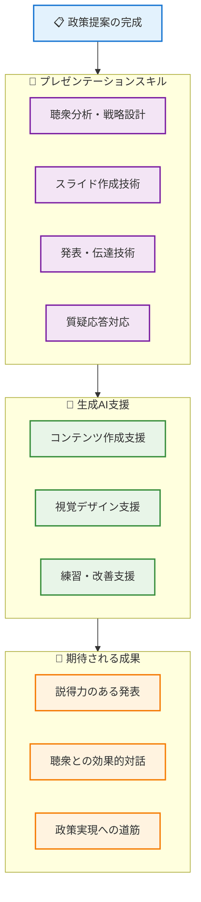
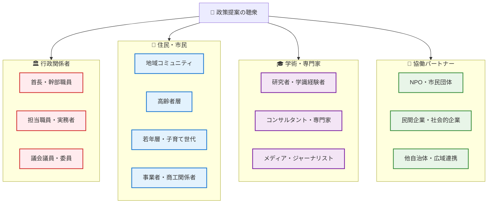
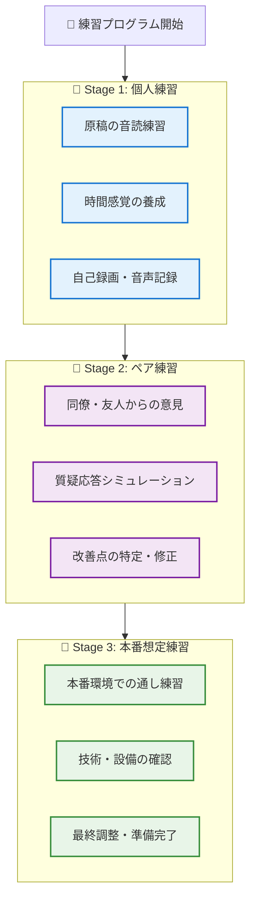
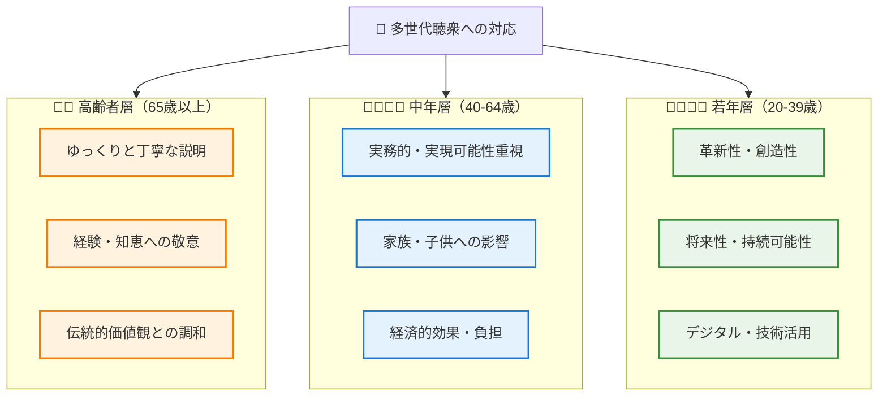
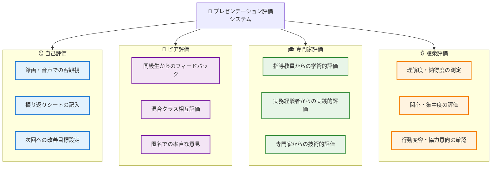

# 効果的な政策提案のための発表技術

## はじめに - 政策提案を伝える力の重要性

第4章で政策立案の技術を学び、第5章で市民参加・合意形成の手法を習得した皆さんは、いよいよ自分たちの政策提案を他者に効果的に伝える技術を身につける段階に来ました。地域公共政策士として活動する際、どんなに優れた政策案を作成しても、それを関係者に適切に伝えることができなければ実現には至りません。

**この章の学習目標**：
- 聴衆に応じたプレゼンテーション戦略の設計
- 生成AIを活用した効果的なスライド作成技術
- 認知負債を避けながらの発表準備と練習方法
- 沖縄の地域特性を活かした説得力のある発表技術



## 6.1 聴衆分析と発表戦略の設計

### 6.1.1 地域公共政策におけるステークホルダー分析

**政策提案の聴衆となる多様なステークホルダー**

地域公共政策の提案では、多様なバックグラウンドを持つ聴衆に対して発表する機会があります。それぞれの特性を理解し、適切なアプローチを設計することが重要です。

**主要なステークホルダーと特徴**：



**生成AIを活用した聴衆分析**：

```
聴衆分析支援プロンプト例：

「以下の政策提案について、各ステークホルダーの関心事と
懸念点を分析してください：

政策提案：[具体的な提案内容]
主要聴衆：[想定される参加者構成]

各ステークホルダーについて：
1. 最も関心を持つポイント
2. 懸念・反対する可能性のある点
3. 説得に必要な情報・データ
4. 効果的なアプローチ方法
5. 使用すべき言葉遣い・表現

を整理してください。」
```

### 6.1.2 沖縄特有の文化的配慮とコミュニケーション

**沖縄の地域特性を活かした発表戦略**

沖縄には独特の文化的特性があり、これを理解してプレゼンテーションに活かすことで、より効果的な政策提案が可能になります。

**沖縄の文化的特徴とプレゼンテーション戦略**：

```
🌺 沖縄の文化的特性とプレゼンテーションへの活用

【ゆいまーる（相互扶助）の精神】
プレゼンテーション戦略：
✅ 「みんなで協力して解決しましょう」という協働のメッセージ
✅ 対立構造ではなく協力関係の構築を強調
✅ 地域全体の利益を重視した提案構成

【島時間（ゆったりとした時間感覚）】
プレゼンテーション戦略：
✅ 急かさず、じっくりと理解を促進する進行
✅ 質疑応答時間を十分に確保
✅ 段階的な説明で理解を深める構成

【年長者・経験者への敬意】
プレゼンテーション戦略：
✅ 地域の長老や先輩職員の知見を引用・尊重
✅ 伝統的な知恵と現代的解決策の融合提示
✅ 謙虚な姿勢での提案・相談スタイル

【共同体意識（地域のつながり）】
プレゼンテーション戦略：
✅ 地域アイデンティティを大切にしたメッセージ
✅ 住民同士のつながりを強化する政策効果の強調
✅ 「ウチナーンチュ」としての誇りに訴えかける内容
```

**生成AIを活用した沖縄特化型発表準備**：

```
沖縄文化配慮プロンプト例：

「沖縄県内での政策提案プレゼンテーションについて、
以下の文化的特性を考慮した発表構成を提案してください：

政策内容：[具体的な政策提案]
聴衆：[沖縄県内のステークホルダー構成]

考慮すべき沖縄の文化的特性：
- ゆいまーる（相互扶助）の重視
- 島時間（ゆったりとした時間感覚）
- 年長者・経験者への敬意
- 共同体意識・地域のつながり
- 琉球王国の歴史・伝統文化
- 基地問題・戦争体験の記憶

これらを踏まえた効果的な：
1. オープニングメッセージ
2. 政策説明のアプローチ
3. 住民の心に響く表現
4. 質疑応答での対応方針
を提案してください。」
```

### 6.1.3 発表形式別の戦略設計

**多様な発表機会に対応した戦略**

地域公共政策士として活動する際、様々な形式の発表機会があります。それぞれに適した戦略を設計する能力が必要です。

**発表形式別戦略マトリックス**：

| 発表形式 | 時間 | 聴衆規模 | 重点ポイント | AI活用領域 |
|---------|------|----------|-------------|------------|
| **議会答弁** | 5-10分 | 20-50名 | 簡潔性・正確性 | データ整理・想定問答 |
| **住民説明会** | 20-30分 | 50-200名 | わかりやすさ・共感 | 資料の平易化・事例収集 |
| **学会発表** | 15-20分 | 30-100名 | 学術的妥当性 | 先行研究整理・分析支援 |
| **庁内報告** | 10-15分 | 10-30名 | 実現可能性・効率性 | 実装計画・リスク分析 |
| **協働会議** | 15-25分 | 10-20名 | 協調性・合意形成 | ステークホルダー分析 |

**生成AIを活用した発表形式別準備**：

```
発表形式別準備プロンプト例：

「以下の発表機会について、最適な発表戦略を設計してください：

発表形式：[住民説明会/議会答弁/学会発表 等]
政策内容：[具体的な提案]
時間制限：[分]
聴衆構成：[参加者の属性・人数]
目的：[理解促進/合意獲得/承認獲得 等]

以下の要素を含む発表戦略を提案してください：
1. オープニング戦略（最初の1-2分）
2. 本論の構成（時間配分含む）
3. 使用すべきデータ・事例の種類
4. 避けるべき表現・リスク要因
5. クロージングメッセージ
6. 質疑応答対策

沖縄の地域特性も考慮してください。」
```

## 6.2 スライド作成の基本技術

### 6.2.1 認知負債を避けたスライド設計プロセス

**人間主導のスライド作成プロセス**

効果的なスライドを作成するには、生成AIに依存せず、まず人間がしっかりと構成を考えることが重要です。

**認知負債防止型スライド作成の4ステップ**：

**Step 1: 人間による基本設計（AI使用禁止）**
```
【紙とペンでの設計作業 - 30分】

1. 発表の目的・ゴールの明確化（5分）
   - 聴衆に何を理解してもらいたいか？
   - どんな行動・判断を促したいか？
   - 発表後の理想的な反応は？

2. メッセージの骨格作成（10分）
   - 核心メッセージを1文で表現
   - 3つの根拠・サポート要素
   - 結論・行動提案

3. ストーリーライン設計（15分）
   - 導入：問題提起・背景説明
   - 展開：分析・解決策提示
   - 結論：まとめ・提案・行動促進

⚠️ この段階ではPC・スマートフォン使用禁止
⚠️ 人間の思考と判断のみで構成を作成
```

**Step 2: 制限的AI活用による情報収集**
```
【情報収集・整理支援 - 45分】

✅ 適切なAI活用：
- 説明に必要なデータ・統計の検索
- 他地域の類似事例の概要調査
- 専門用語の平易な説明文作成
- グラフ・図表の基本的な構成案

🚫 避けるべきAI活用：
- スライド全体の構成作成依頼
- メッセージ・結論の作成依頼
- デザイン・レイアウトの全面委託
- 発表原稿の自動生成依頼

情報収集プロンプト例：
「政策提案『○○』について、聴衆『△△』に説明するための
基礎データと事例を収集してください。解釈や提案は不要です。」
```

**Step 3: 人間による情報統合・検証**
```
【収集情報の批判的検証 - 30分】

1. データの妥当性確認（10分）
   - 情報源は信頼できるか？
   - 数値・事実に誤りはないか？
   - 沖縄の実情に適用できるか？

2. 聴衆適合性の評価（10分）
   - 聴衆の理解レベルに適しているか？
   - 関心・ニーズと合致しているか？
   - 時間制限内で説明可能か？

3. メッセージとの整合性確認（10分）
   - Step 1で設計した構成と一致するか？
   - 核心メッセージを効果的に支援するか？
   - 不要・重複する情報はないか？
```

**Step 4: 人間主導のスライド完成**
```
【最終的なスライド作成 - 60分】

1. スライド構成の確定（15分）
   - 必要スライド数の決定
   - 各スライドの役割・内容決定
   - タイミング・時間配分の設計

2. 視覚デザインの方針決定（15分）
   - 色彩・フォントの統一方針
   - 図表・画像の使用方針
   - 読みやすさ・アクセシビリティ配慮

3. コンテンツ作成・調整（30分）
   - 各スライドの詳細作成
   - 一貫性・流れの最終確認
   - 練習用メモの作成

⚠️ AI支援は情報整理のみ
⚠️ 最終的な判断・調整は必ず人間が実施
```

### 6.2.2 効果的なスライドデザインの原則

**1スライド1メッセージの原則**

効果的なプレゼンテーションスライドの基本原則を理解し、実践します。

**基本デザイン原則**：

```
🎨 効果的スライドデザインの5原則

【1. 1スライド1メッセージ】
- 各スライドで伝えたいことは1つだけ
- タイトルでメッセージを明確に示す
- 情報の詰め込みすぎを避ける

【2. 視覚的階層の構築】
- 重要度に応じたフォントサイズ
- 色・太さで情報の優先順位を表現
- 余白を効果的に活用

【3. 統一性・一貫性の維持】
- 色彩・フォント・レイアウトの統一
- 全スライドを通じた一貫したトーン
- ブランディング・組織イメージとの調和

【4. 読みやすさ・アクセシビリティ】
- 十分なフォントサイズ（最小24pt）
- コントラストの確保（背景と文字）
- 色覚多様性への配慮

【5. ストーリーテリング】
- 論理的な流れ・構成
- 聴衆の関心を引きつける導入
- 明確な結論・行動提案
```

**生成AIを活用したデザイン改善**：

```
スライドデザイン改善プロンプト例：

「以下のスライド内容について、視覚的な改善提案をしてください：

現在のスライド内容：
[スライドのテキスト・構成]

聴衆：[参加者の属性]
発表時間：[分数]

以下の観点から改善提案をお願いします：
1. 1スライド1メッセージが守られているか
2. 情報の優先順位は明確か
3. 聴衆にとって読みやすいか
4. 視覚的に印象に残るか
5. アクセシビリティは配慮されているか

具体的な修正提案と理由も示してください。」
```

### 6.2.3 データ可視化とビジュアル要素の活用

**政策提案に効果的なデータ表現**

政策提案では、複雑なデータを聴衆にわかりやすく伝える能力が重要です。

**データ可視化の基本原則**：

| データの種類 | 適切なグラフ | 使用場面 | 注意点 |
|-------------|------------|----------|--------|
| **時系列変化** | 折れ線グラフ | 政策効果の推移 | 縦軸の起点に注意 |
| **構成比較** | 円グラフ・帯グラフ | 予算配分・人口構成 | 項目数は7つ以下 |
| **カテゴリ比較** | 棒グラフ | 地域間比較・政策オプション | 並び順に意味を持たせる |
| **相関関係** | 散布図 | 要因分析・効果検証 | 因果関係と混同させない |
| **地理的分布** | 地図・ヒートマップ | 地域特性・課題分布 | 色の選択に配慮 |

**生成AIを活用したグラフ作成支援**：

```
データ可視化支援プロンプト例：

「以下のデータを効果的に可視化する方法を提案してください：

データ内容：[具体的なデータの説明]
伝えたいメッセージ：[グラフで強調したいポイント]
聴衆：[参加者の属性・専門レベル]

以下について提案してください：
1. 最適なグラフの種類と理由
2. 軸・項目の設定方法
3. 色・デザインの方針
4. グラフタイトル・説明文
5. 誤解を避けるための注意点
6. アクセシビリティへの配慮

沖縄の地域データであることも考慮してください。」
```

**沖縄特有データの効果的な表現**：

```
🌺 沖縄データの特徴と可視化のポイント

【離島・地理的特性】
✅ 地図を基調とした可視化を積極活用
✅ 本島・離島の区別を明確に表示
✅ 距離・アクセス時間の視覚的表現

【観光・季節変動】
✅ 月次・季節変動を強調したグラフ
✅ 観光客数と住民生活への影響の関連表示
✅ ピーク・オフピーク期間の明確な区分

【多文化・言語】
✅ 日本語・英語併記での表示検討
✅ 文化的配慮を考慮した色彩選択
✅ 方言・地域性を活かした表現

【基地・特殊事情】
✅ センシティブなデータの慎重な表現
✅ 客観的・中立的な数値表示
✅ 住民感情に配慮した色・デザイン
```

## 6.3 発表準備と練習方法

### 6.3.1 発表原稿の作成戦略

**認知負債を避けた原稿作成**

効果的な発表のためには、生成AIに依存せず、自分の言葉で原稿を作成することが重要です。

**人間主導の原稿作成プロセス**：

**Phase 1: 基本構造の設計（AI使用禁止・30分）**
```
【手書きでの原稿構成作業】

1. キーメッセージの言語化（10分）
   - 核心的主張を1文で表現
   - 自分の言葉で「なぜ重要か」を説明
   - 聴衆への期待・お願いを明確化

2. 話の流れの設計（15分）
   - 導入：問題意識の共有
   - 本論：分析・解決策の提示
   - 結論：行動・協力の呼びかけ

3. 時間配分の計画（5分）
   - 各パートの目安時間設定
   - 質疑応答時間の確保
   - 余裕を持ったスケジュール

⚠️ PC・スマートフォンは使用しない
⚠️ 自分の頭で考え、自分の言葉で構成
```

**Phase 2: 制限的AI活用による表現改善**
```
【表現・言い回しの改善支援 - 30分】

✅ 適切なAI活用：
- 専門用語の平易な説明への変換
- 冗長な表現の簡潔化
- 敬語・丁寧語の適切な使用確認
- 時間内に収まる文量への調整

🚫 避けるべきAI活用：
- 原稿全体の作成依頼
- 主要メッセージの変更提案
- 個人的体験・感情の代筆
- 発表者の個性を無視した画一化

表現改善プロンプト例：
「以下の発表原稿について、聴衆『○○』により伝わりやすい
表現に改善してください。内容・メッセージは変更せず、
表現のみを調整してください。」
```

**Phase 3: 人間による最終調整・個性化**
```
【最終的な原稿完成 - 45分】

1. 個人的な体験・エピソード追加（15分）
   - 自分なりの問題体験・気づき
   - 沖縄での具体的な経験
   - 聴衆との共通体験・感情の共有

2. 発表者らしさの反映（15分）
   - 自然な話し方・口調
   - よく使う表現・言い回し
   - 熱意・情熱が伝わる部分の強調

3. 実際の声出し練習での調整（15分）
   - 読みやすい文章への修正
   - 息継ぎ・間の取り方の調整
   - 強調すべき部分のマーキング

⚠️ 最終的な内容は必ず人間が決定
⚠️ AIの提案を無批判に採用しない
```

### 6.3.2 効果的な練習方法と改善プロセス

**段階的な練習プログラム**

発表技術の向上には、体系的で継続的な練習が必要です。

**3段階練習プログラム**：



**Stage 1: 個人練習（AI支援活用）**

```
【個人練習での生成AI活用法】

音読練習支援：
「発表原稿を音読する際の改善点を指摘してください：

・読みにくい文章・単語はありますか？
・息継ぎのタイミングが不自然な箇所は？
・時間内に収まらない場合の短縮提案は？
・強調すべき部分の提案は？

ただし、内容の変更は最小限にしてください。」

時間管理支援：
「15分の発表について、以下の構成での時間配分を
提案してください：

[現在の原稿構成]

各パートの目安時間と、時間調整のポイントを
教えてください。」
```

**Stage 2: ペア練習（混合クラス活用）**

```
🤝 琉球大学混合クラスでのペア練習活用

【学部生 × 社会人職員のペア練習メリット】

学部生が発表者の場合：
✅ 職員：実務的視点からの質問・指摘
✅ 職員：住民目線での理解度確認
✅ 職員：実現可能性・制約条件のアドバイス

社会人職員が発表者の場合：
✅ 学部生：理論的整合性の確認
✅ 学部生：若い世代の視点からの意見
✅ 学部生：最新技術・手法の提案

【相互フィードバックの観点】
- 内容の理解しやすさ
- 説得力・根拠の妥当性
- 発表技術（声の大きさ、速度、姿勢）
- 時間配分・構成の適切性
- 質疑応答での対応力
```

**Stage 3: 本番想定練習（技術確認含む）**

```
【本番環境での最終確認】

技術・設備チェック：
✅ プロジェクター・スクリーンとの互換性
✅ 音響設備・マイクの使用方法
✅ リモコン・レーザーポインターの操作
✅ 配布資料・補助教材の準備

環境・状況対応：
✅ 会場の広さ・照明に応じた声量調整
✅ 立ち位置・移動範囲の確認
✅ 聴衆との距離感・アイコンタクト練習
✅ 予想外の状況（機材不調等）への対策

最終調整：
✅ 緊張対策・リラックス方法の確認
✅ 開始前の心構え・準備動作
✅ 終了後の質疑応答・交流への準備
```

### 6.3.3 質疑応答対策

**想定質問の準備と対応戦略**

政策提案では、様々な立場からの質問・反対意見が予想されます。これらに適切に対応する準備が重要です。

**生成AIを活用した想定問答作成**：

```
想定問答作成プロンプト例：

「以下の政策提案について、各ステークホルダーからの
想定質問と適切な回答を準備してください：

政策提案：[具体的な提案内容]
発表場面：[住民説明会/議会答弁/庁内報告 等]

想定される質問者：
1. 賛成派：[具体的な立場・関心事]
2. 慎重派：[具体的な懸念・心配事]
3. 反対派：[反対理由・代替案]
4. 中立派：[詳細確認・理解促進]

各立場から3-5個の具体的質問を作成し、
それぞれに対する簡潔で説得力のある回答例を
提示してください。

沖縄の地域特性・文化的配慮も含めてください。」
```

**質疑応答の基本的な対応フレームワーク**：

```
🎯 効果的な質疑応答の3ステップ

【Step 1: 質問の理解・確認（30秒）】
✅ 質問を最後まで聞く
✅ 質問の要点を復唱・確認する
✅ 不明な点があれば丁寧に確認する
✅ 感情的な質問でも冷静に対応

【Step 2: 構造化された回答（60-90秒）】
✅ 結論ファーストで回答開始
✅ 根拠・理由を2-3点で説明
✅ 具体例・データで補強
✅ 質問者の立場・懸念への配慮

【Step 3: 確認・フォローアップ（30秒）】
✅ 回答が質問に答えているか確認
✅ 追加説明の必要性を確認
✅ 感謝・敬意の表明
✅ 個別相談の機会提供（必要時）

⚠️ 知らないことは「知らない」と正直に答える
⚠️ その場での約束・決定は避ける
⚠️ 攻撃的な質問でも敬意を持って対応
```

**困難な質問への対応戦略**：

| 質問タイプ | 対応戦略 | 使用表現例 |
|-----------|----------|-----------|
| **専門的すぎる質問** | 後日回答を約束 | 「詳細なデータを調査して、後日回答いたします」 |
| **感情的な反対** | 共感を示し冷静に対応 | 「そのお気持ちはよく理解できます。一方で...」 |
| **予算・実現性への疑問** | 段階的実施を提案 | 「まずは試行的に実施し、効果を確認しながら...」 |
| **他の優先課題の指摘** | 相互補完関係を説明 | 「どちらも重要な課題であり、相互に関連しています」 |
| **過去の失敗例の指摘** | 違いと改善点を明確化 | 「過去の事例から学び、以下の点を改善しました」 |

## 6.4 沖縄特有の発表技術とコツ

### 6.4.1 地域文化を活かした効果的な表現

**沖縄の言語・文化的要素の活用**

沖縄での発表では、地域の文化的特性を理解し、適切に活用することで聴衆との親近感を高めることができます。

**沖縄文化を活かした発表技術**：

```
🌺 沖縄文化を活かした発表表現技術

【言語・表現での工夫】
✅ 適度な方言・沖縄の表現の使用
   - 「ちゅらさん（美しい）」「ちむぐりさ（心苦しい）」
   - 地域への愛着を表す自然な表現
   
✅ 地域への敬意と愛情の表現
   - 「私たちのうちなー（沖縄）」
   - 「先輩方のご指導をいただきながら」

✅ 共同体意識を強調する表現
   - 「みんなで一緒に」「いちゃりばちょーでー」
   - 「地域全体で取り組む」

【内容・事例での工夫】
✅ 沖縄の歴史・文化への言及
   - 琉球王国時代からの知恵
   - 戦後復興での住民協力の経験
   - 伝統的な問題解決手法

✅ 地域の誇りと課題の両面提示
   - 沖縄の美しさ・魅力の確認
   - 課題解決による更なる発展への期待

✅ 具体的な地域名・場所の活用
   - 「首里」「那覇」「宮古島」等の具体的地名
   - 参加者が知っている場所・施設の例示
```

**生成AIを活用した沖縄らしい表現の改善**：

```
沖縄文化配慮表現改善プロンプト：

「以下の発表内容を、沖縄の文化・地域性を活かした
親しみやすい表現に改善してください：

[現在の発表原稿]

改善の方針：
1. 沖縄への愛着・誇りが感じられる表現
2. 地域の協力・結束を重視する内容
3. 年長者・経験者への敬意を示す表現
4. 過度にならない程度の方言・地域表現

ただし、以下は維持してください：
- 政策提案の核心メッセージ
- 客観的データ・根拠
- 専門用語の適切な使用
- 公式発表としての品格

バランスの取れた改善提案をお願いします。」
```

### 6.4.2 多様な世代・立場への配慮

**混合した聴衆への効果的アプローチ**

沖縄での政策提案発表では、多様な世代・職業・立場の参加者が同席することが多く、それぞれに配慮したアプローチが必要です。

**世代別コミュニケーション戦略**：



**立場別アプローチ戦略**：

| 参加者の立場 | 重要視する観点 | 効果的なアプローチ | 使用すべき表現 |
|------------|-------------|-----------------|-------------|
| **行政職員** | 実現可能性・法的根拠 | 具体的手順・制度設計 | 「段階的に実施」「法的検討」 |
| **住民代表** | 生活への直接的影響 | 具体例・身近な事例 | 「日常生活で」「実感として」 |
| **事業者** | 経済効果・負担軽減 | コスト・収益への影響 | 「事業機会」「負担軽減」 |
| **NPO関係者** | 社会的意義・公益性 | 社会課題解決の観点 | 「社会貢献」「地域のため」 |
| **専門家・研究者** | 学術的妥当性・新規性 | 理論的背景・データ分析 | 「科学的根拠」「革新的手法」 |

### 6.4.3 オンライン・ハイブリッド発表への対応

**デジタル時代の新しい発表形式**

コロナ禍以降、オンライン・ハイブリッド形式での発表機会が増加しています。これらの形式では、従来とは異なる技術・配慮が必要です。

**オンライン発表での特別配慮**：

```
💻 オンライン発表での成功要因

【技術的準備】
✅ 安定したインターネット接続環境の確保
✅ 高品質なカメラ・マイクの使用
✅ 適切な照明・背景の設定
✅ 画面共有・資料表示の事前練習

【コミュニケーション技術】
✅ カメラ目線での発表（聴衆とのアイコンタクト）
✅ 明確で大きな声での発話
✅ ジェスチャー・表情の意識的な使用
✅ 画面上での資料・ポインター活用

【聴衆エンゲージメント】
✅ チャット機能での質疑応答活用
✅ ブレイクアウトルーム等での小グループ対話
✅ 投票・アンケート機能での参加促進
✅ 双方向性を重視した進行

【沖縄特有の配慮】
✅ 離島からの参加者への特別配慮
✅ インターネット環境の格差への対応
✅ 高齢者のデジタル不安への配慮
✅ 方言・地域表現の聞き取りやすさ確認
```

**生成AIを活用したオンライン発表準備**：

```
オンライン発表最適化プロンプト：

「以下の発表内容を、オンライン形式での実施に
最適化してください：

[現在の発表内容]
発表時間：[分数]
参加者数：[人数]
参加者構成：[属性・地域分布]

最適化の観点：
1. オンラインでの集中力維持方法
2. 画面越しでも伝わりやすい表現
3. インタラクティブな要素の追加
4. 技術的トラブルへの対策
5. 沖縄の離島参加者への配慮

具体的な改善提案をお願いします。」
```

## 6.5 プレゼンテーション評価と改善

### 6.5.1 自己評価とピア評価の活用

**継続的改善のための評価システム**

プレゼンテーション技術の向上には、客観的で建設的な評価とフィードバックが不可欠です。

**多面的評価システム**：



**自己評価チェックリスト**：

```
📝 プレゼンテーション自己評価シート

【内容・構成】(25点)
□ メッセージは明確で一貫していたか？ (5点)
□ 論理的な構成・流れになっていたか？ (5点)
□ 根拠・データは十分で適切だったか？ (5点)  
□ 時間配分は適切だったか？ (5点)
□ 結論・提案は具体的で実行可能だったか？ (5点)

【発表技術】(25点)
□ 声の大きさ・速度は適切だったか？ (5点)
□ アイコンタクト・身振り手振りは効果的だったか？ (5点)
□ スライド・資料は見やすく活用できたか？ (5点)
□ 緊張せずに自然に発表できたか？ (5点)
□ 時間内に適切に終了できたか？ (5点)

【聴衆対応】(25点)
□ 聴衆のレベル・関心に適した内容だったか？ (5点)
□ 質疑応答に適切に対応できたか？ (5点)
□ 聴衆の反応を読み取り調整できたか？ (5点)
□ 沖縄の地域性・文化に配慮できたか？ (5点)
□ 協力・行動を促すことができたか？ (5点)

【AI活用】(25点)
□ 認知負債を避けて準備できたか？ (5点)
□ AIを適切に補助ツールとして活用したか？ (5点)
□ 最終的な判断・表現は自分で行ったか？ (5点)
□ AI依存せずに質疑応答できたか？ (5点)
□ 人間らしい温かさ・個性を表現できたか？ (5点)

総合評価： /100点
改善すべき上位3点：
1. _________________________________
2. _________________________________  
3. _________________________________
```

### 6.5.2 琉球大学混合クラスでの相互評価

**異なる背景を活かした効果的フィードバック**

琉球大学の混合クラス（学部生×社会人職員）の特性を活かした相互評価システムを構築します。

**混合クラス相互評価の利点**：

```
🤝 学部生 × 社会人職員の相互評価メリット

【学部生による職員発表への評価】
✅ 若い世代の視点・感覚からの意見
✅ 理論的妥当性・最新性のチェック
✅ デジタル技術・AI活用の評価
✅ 将来世代への訴求力の確認

【職員による学部生発表への評価】
✅ 実務経験に基づく実現可能性の評価
✅ 住民視点・現場感覚からの意見
✅ 政策制約・法的問題の指摘
✅ 行政組織での実用性の確認

【世代を超えた共通評価観点】
✅ 沖縄への愛着・理解の深さ
✅ 地域住民への配慮・敬意
✅ 協働・合意形成への意識
✅ プレゼンテーション技術の効果
```

**ペア評価シート（混合クラス用）**：

```
👥 混合クラス ペア評価シート

評価者：[学部生/社会人職員] 被評価者：[学部生/社会人職員]
発表タイトル：_________________________________
評価日：_____________

【発表者の強み】
最も印象的だった点：
_________________________________________________

【学習・参考になった点】
自分の発表改善に活かしたい点：
_________________________________________________

【建設的改善提案】
より良い発表にするための提案：
_________________________________________________

【世代・立場特有の観点】
※学部生→職員：理論・将来性の観点から
※職員→学部生：実務・現実性の観点から

_________________________________________________

【沖縄らしさ評価】
地域特性・文化への配慮：
□ 非常に良い □ 良い □ 普通 □ 改善の余地あり

【総合印象】
□ 非常に説得力があった
□ 説得力があった  
□ 普通
□ やや物足りなかった
□ 大幅な改善が必要

【個人的感想・メッセージ】
_________________________________________________
```

### 6.5.3 継続的改善と成長戦略

**プレゼンテーション技術の長期的向上**

プレゼンテーション技術は一度で習得できるものではなく、継続的な練習と改善が必要です。

**段階的成長プログラム**：

| 学習段階 | 目標レベル | 重点スキル | 練習方法 |
|---------|-----------|-----------|----------|
| **初級（1-3回目）** | 基本的な伝達 | 明確な発話・時間管理 | 個人練習・録画確認 |
| **中級（4-7回目）** | 説得力の向上 | 聴衆分析・構成技術 | ペア練習・フィードバック |
| **上級（8回目以上）** | 影響力の発揮 | 感情的訴求・行動促進 | 実際発表・社会実装 |

**生成AIを活用した継続的改善支援**：

```
継続的改善支援プロンプト：

「以下の発表評価結果を分析し、次回への改善計画を
提案してください：

前回発表の評価結果：
[具体的な評価点数・コメント]

発表回数：[○回目]
現在のレベル：[初級/中級/上級]
次回発表の予定：[内容・聴衆・時期]

以下を含む改善計画を提案してください：
1. 重点的に取り組むべき改善項目（3つ）
2. 具体的な練習方法・スケジュール
3. 活用すべきリソース・サポート
4. 達成目標・評価指標
5. リスク・困難の予想と対策

沖縄での政策提案活動の長期的成長も考慮してください。」
```

**キャリア発展とプレゼンテーション技術**：

```
🎯 地域公共政策士としてのプレゼンテーション技術発展

【短期目標（6ヶ月-1年）】
✅ 基本的な政策提案発表の習得
✅ 住民説明会での効果的コミュニケーション
✅ 同僚・上司への報告・相談技術
✅ AI支援を活用した効率的準備

【中期目標（1-3年）】
✅ 議会答弁・公式発表での安定した実力
✅ メディア対応・取材での適切な応答
✅ 複雑な利害関係者間での調整・説得
✅ 専門性を活かした学会・研修での発表

【長期目標（3年以上）】
✅ 沖縄県内での政策リーダーとしての発信力
✅ 全国・国際会議での沖縄代表としての発表
✅ 後進指導・人材育成での指導力
✅ 社会変革・地域発展への影響力

【継続的成長のために】
- 多様な機会での発表経験の積極的な確保
- 異なる聴衆・場面での練習・挑戦
- フィードバックに基づく継続的改善
- 沖縄への愛情と責任感の保持・深化
```

## まとめ：効果的なプレゼンテーション技術の習得

### 第6章の学習成果

この章を通じて、皆さんは単なる「発表技術」ではなく、**地域公共政策士として政策提案を効果的に伝え、住民・関係者の理解と協力を得る総合的なコミュニケーション能力**を習得しました。

**習得した核心技術**：

```
🎤 プレゼンテーション技術の総合習得

【戦略設計力】
✅ 聴衆分析に基づく発表戦略の設計
✅ 沖縄の文化的特性を活かした親近感の構築
✅ 多様な世代・立場への配慮したアプローチ

【コンテンツ作成力】  
✅ 認知負債を避けた人間主導のスライド・原稿作成
✅ データ可視化とビジュアル要素の効果的活用
✅ 1スライド1メッセージの原則に基づく明確な構成

【発表実践力】
✅ 自然で説得力のある発話・ジェスチャー
✅ 時間管理と構成に基づく効果的な進行
✅ 質疑応答での適切で建設的な対応

【継続改善力】
✅ 多面的評価に基づく客観的な自己分析
✅ 混合クラス環境での相互学習・相互支援
✅ 長期的なキャリア発展を見据えた技術向上
```

### 次章への展開

第6章で習得したプレゼンテーション技術は、次章以降でさらに発展・応用されます：

- **第7章データリテラシー**では、技術習得したスライド作成技術をより高度なデータ表現・分析結果の発表に応用
- **第8章産官学民連携**では、多様なステークホルダーとのコミュニケーション技術として活用
- **最終プロジェクト**では、学習の集大成として総合的なプレゼンテーション技術を実践

**重要な原則の再確認**：

皆さんが身につけたのは、単なる「上手な発表技術」ではありません。それは、**人間の温かさと誠実さを保ちながら、AIを適切に活用し、沖縄への愛と住民への責任感を持って政策提案を伝える能力**です。

どんなに技術が進歩しても、最終的に人々の心を動かし、協力を促し、地域の未来を創るのは、皆さんのような人間の力なのです。

この技術を活かし、沖縄県民の幸福と地域の持続可能な発展のために、効果的なコミュニケーションを続けてください。
