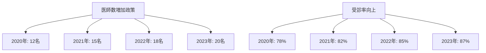
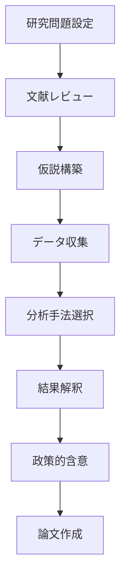

# データで読み解く沖縄 - 初心者から上級者まで

沖縄の地域課題を科学的に分析し、エビデンスに基づいた政策立案を行うためには、データリテラシーが不可欠です。本章では、AI知識レベル別（初心者9名、初級13名、中級6名、上級2名）に配慮した学習設計で、沖縄の具体的データを用いた実践的な分析手法を習得します。

## 7.1 沖縄データで学ぶ統計基礎（初心者グループ対応）

デジタル技術に不慣れな自治体職員や学生が、沖縄の身近なデータを通じて統計の基本概念を体感的に理解できるよう設計されています。

### 7.1.1 沖縄の具体データで学ぶ基本統計量

**認知負債防止アプローチ**：
- Phase 1（AI禁止）: まず自分でデータを眺め、傾向を予想
- Phase 2（制限的AI活用）: 計算補助のみAI使用
- Phase 3（批判的検証）: AI結果と自分の予想を比較
- Phase 4（統合判断）: 最終的な解釈は自分で決定

#### 観光客数データで学ぶ平均・中央値・最頻値

**実習データ**: 沖縄県月別観光客数（2023年）

```
Step 1: 手作業でのデータ観察（AI禁止期）
問いかけ例：「どの月が最も多いと思いますか？年間平均は何万人くらいでしょうか？」
```

🧠 **学習ポイント**：
- 予測力と直感を養う
- 季節性やイベントの影響を考慮する力
- データに対する仮説を立てる力

```
Step 2: Web検索によるデータ収集
プロンプト例：「沖縄県の2023年月別観光客数データを公式サイトや統計資料から調べて教えてください」
```

🧠 **学習ポイント**：
- 公的データの探し方（信頼性のある情報源の選定）
- 検索キーワードの工夫
- データの読み取りと整理力

```
Step 3: 計算支援としてのAI活用

観光客数データ（千人単位）：
1月: 610, 2月: 590, 3月: 720, 4月: 740, 5月: 780, 6月: 730,
7月: 850, 8月: 870, 9月: 720, 10月: 740, 11月: 710, 12月: 720

計算結果：
・平均（Average）：731.67 千人
・中央値（Median）：725.0 千人
・最頻値（Mode）：720 千人

計算方法の説明：
・平均：合計値 ÷ 月数（12）
・中央値：昇順に並べた中央の値（偶数個なので中央2つの平均）
・最頻値：最も頻繁に出現した値
```

🧠 **学習ポイント**：
- 統計指標の意味と使い分け
- データの分布を理解する力
- AIを使った計算の正確性と効率性

```
Step 4: 結果の検証と考察

予想と実際の比較：
・予想よりも夏季（7〜8月）の観光客数が突出して多い
・平均よりも中央値がやや低く、最頻値が720千人と安定している

考察ポイント：
・夏休み・お盆などの季節要因
・クルーズ船や国際線の再開によるインバウンド増加
・台風や天候による月別変動の可能性
```

🧠 **学習ポイント**：
- データの季節性パターンの理解
- 外部要因が統計量に与える影響の分析
- 予測と実績の差異から学ぶ洞察力

#### 住民満足度調査で分散を理解

**実習事例**: 那覇市と久米島の住民満足度比較

```
Phase 1（自分で考える）:
「那覇市民100名と久米島住民50名の行政サービス満足度（10点満点）
那覇市：平均6.2点　久米島：平均6.1点
どちらの住民がより均質な満足度を持っていると思いますか？」

Phase 2（AI支援計算）:
「以下のデータで分散と標準偏差を計算してください：
那覇市：[5,7,6,8,4,9,3,7,6,8...] (標準偏差: 1.8)
久米島：[6,6,6,7,5,6,6,7,5,6...] (標準偏差: 0.7)」

Phase 3（結果解釈）:
「久米島の方が分散が小さい。これは何を意味するでしょうか？
離島と都市部の違いが背景にあるかもしれません」
```

**学習効果**：
- 平均が同じでも「ばらつき」は異なる
- 地域特性がデータにどう現れるか
- 政策立案時の考慮事項（均質性vs多様性）

### 7.1.2 相関関係の理解（因果関係との区別）

#### 収入と教育レベルの相関分析

**沖縄県内41市町村データでの実習**：

```
Phase 1（仮説設定）:
「沖縄県内で、平均年収が高い市町村ほど大学進学率も高いと思いますか？
まず自分の仮説を立ててください」

Phase 2（データ可視化支援）:
「以下のデータで散布図を作成してください：
市町村名, 平均年収(万円), 大学進学率(%)
那覇市, 425, 67
浦添市, 398, 62
石垣市, 342, 45
久米島, 298, 31...」

Phase 3（相関係数の計算と解釈）:
「相関係数r=0.73が出ました。これは何を意味しますか？
また、『年収が高いから進学率が高い』と結論できますか？」
```

**重要な学び**：
- 相関関係 ≠ 因果関係
- 第3の要因（人口規模、産業構造）の可能性
- 政策判断における慎重さの必要性

### 7.1.3 データの落とし穴と注意点

#### サンプリングバイアスの実例

**ケーススタディ**: 観光客満足度調査のバイアス

```
「那覇空港で実施した観光客満足度調査で『沖縄旅行満足度92%』
という結果が出ました。この結果をどう解釈しますか？」

考慮すべきポイント：
・空港にたどり着けた観光客のみが対象
・途中で帰った不満足な観光客は含まれない
・回答を拒否した観光客の特徴
・「帰国直前」の心理状態の影響
```

#### 疑似相関の見抜き方

**沖縄特有の例**：
```
「アイスクリーム売上高と海水浴場利用者数に強い相関（r=0.89）
が見られます。アイスクリームを売れば海水浴客が増えるでしょうか？」

正解：気温という共通要因
・暑い日にはアイスクリーム売上が伸びる
・暑い日には海水浴客も増える
・直接的な因果関係はない
```

## 7.2 グラフ作成と解釈（実務志向）

沖縄の自治体職員が実際の業務で使えるデータ可視化技術を習得します。

### 7.2.1 グラフの種類と用途（実践例豊富）

#### 棒グラフ・折れ線グラフ（政策効果の表現）

**実習例**: 離島医療政策の効果測定



**AI活用プロンプト例**：
```
Phase 1（グラフ選択を自分で判断）:
「医師数の経年変化と受診率の経年変化を表現するのに
最適なグラフの種類を選択してください」

Phase 2（作成支援）:
「Excelで以下のデータを使って複合グラフを作成してください：
年度, 医師数, 受診率
2020, 12, 78
2021, 15, 82...」

Phase 3（解釈と政策評価）:
「このグラフから読み取れる政策効果を3点挙げてください」
```

#### 散布図・ヒートマップ（地域特性の分析）

**実習**: 沖縄県内市町村の特性分析

```
人口密度 vs 一人当たり税収のヒートマップ作成

Phase 1（分析目的の明確化）:
「41市町村の人口密度と税収の関係から何を読み取りたいですか？」

Phase 2（データ整理）:
「市町村データを人口密度で分類（都市部/中間/過疎）し、
税収レベルで色分けしたヒートマップを作成してください」

Phase 3（政策的含意の抽出）:
「過疎地域の税収確保策として何が考えられますか？」
```

### 7.2.2 GISデータを活用した地図可視化

#### 台風被害状況の可視化

**認知負債防止の実践**：

```
Step 1（手作業での地図確認）:
「2023年台風6号の被害状況を紙の沖縄県地図で確認し、
被害が大きかった地域に印をつけてください」

Step 2（デジタル地図での検証）:
「GIS データを使って被害状況をデジタル地図上に表示してください」

Step 3（比較と考察）:
「手作業での予想とデジタルデータは一致しましたか？
相違点がある場合、その理由を考えてください」
```

### 7.2.3 ミスリーディングを避ける設計原則

#### 軸の設定と情報操作のリスク

**実例**: 観光客数減少の印象操作

```
正しいグラフ vs 誤解を招くグラフの比較

誤解を招く例：
・Y軸を95万人から100万人に設定
・96万人→97万人の変化が巨大に見える

正しい例：
・Y軸を0から始める
・実際の変化率（1.0%増）が正確に伝わる
```

**AI活用での注意点**：
```
「観光客数の増減を強調したグラフを作成してください」
→この指示は危険！

改善版：
「観光客数の実際の変化を正確に伝えるグラフを作成してください。
軸の設定理由も教えてください」
```

## 7.3 中級・上級レベル向け高度分析

技術系学生や上級者向けの発展的な内容です。

### 7.3.1 回帰分析と予測モデル

#### 観光客数予測モデルの構築

**実習プロジェクト**: 沖縄県月別観光客数の予測

```python
# Phase 1: 自分でモデル設計を検討
「観光客数に影響する要因を5つ挙げてください：
1. 気温・降水量
2. 航空運賃
3. 本土の経済情況
4. 為替レート（外国人観光客）
5. イベント・祭り」

# Phase 2: AI支援でのモデル構築
「以下のデータで線形回帰モデルを構築してください：
月, 観光客数, 平均気温, 降水量, 航空運賃
1, 67, 18.7, 112, 28500
2, 58, 19.1, 95, 25000...」

# Phase 3: モデルの妥当性検証
「R²=0.78の結果をどう解釈しますか？
予測精度を高めるにはどんな改善が必要でしょうか？」
```

### 7.3.2 テキストマイニングによる住民意見分析

#### 市民アンケート自由記述の分析

**高度実習**: 石垣市住民アンケートの分析

```
Phase 1（分析設計）:
「1,200件の自由記述回答から住民ニーズを分析する手法を
設計してください」

Phase 2（AI支援分析）:
「以下の自由記述を感情分析・トピック分析してください：
『観光客が多すぎて地元住民の生活が...』
『もっと島内の道路整備を...』
『若者の働く場所がない...』」

Phase 3（政策提案への転換）:
「分析結果から優先すべき政策課題を3つ特定し、
それぞれに対する解決策の方向性を示してください」
```

### 7.3.3 個人研究プロジェクトオプション

研究志向の学生向けに、独自のデータ分析プロジェクトを支援します。

#### プロジェクト例：「離島間格差の定量分析」

**研究フレームワーク**：



**Phase 1（問題設定）**:
```
「離島間の格差」について研究したい場合：
1. 何の格差を測定するか（所得、医療、教育、交通）
2. どの島々を比較するか（本島、宮古、石垣、久米島）
3. 格差の原因として何を仮定するか
まず自分なりの研究計画を立ててください
```

**Phase 2（AI支援でのデータ収集）**:
```
「沖縄県統計サイトから以下のデータを収集してください：
- 各離島の人口推移（過去20年）
- 一人当たり所得
- 医療機関数
- 高校進学率
- 本島との交通費・所要時間」
```

**Phase 3（独立分析と検証）**:
```
「収集データの分析は自分で実施し、
結果の解釈についてのみAIに助言を求めてください。
最終的な結論と政策提案は必ず自分で決定してください」
```

## 7.4 混合クラスでの学び合い設計

学部生と社会人学生の相互学習を促進する仕組みです。

### 7.4.1 レベル別ペアワーク

**技術×実務ペアの例**：
- **玉城康平（理学部・上級AI）×宮良健司（県庁・都市計画）**
  - 玉城：統計分析とプログラミング担当
  - 宮良：データの実務的解釈と政策妥当性判断
  - 成果物：技術的に正確で実務的に有用な分析レポート

📊 **ペアワークの効果**：
- **技術面の効果**：実務データに触れることで、理論と実践のギャップを理解
- **実務面の効果**：最新の分析手法を学び、業務効率化のヒントを獲得
- **相乗効果**：技術的正確性と実務的妥当性を両立した高品質な成果物

### 7.4.2 世代間知識交換システム

**逆メンタリング（Reverse Mentoring）**：
- 上級学生（2名）→初心者職員（9名）への技術指導
- ベテラン職員→学部生への実務経験伝授
- 相互補完による学習効果の最大化

🔄 **知識交換の効果**：
- **若手→ベテランへの効果**：デジタルツールの活用法、最新のAI技術の理解促進
- **ベテラン→若手への効果**：実務での意思決定プロセス、政策立案の実際を学習
- **組織全体への効果**：世代間ギャップの解消、知識の継承と革新の両立

### 7.4.3 成果発表と評価

**混合クラス特有の評価基準**：

1. **技術的正確性**（主に学部生評価軸）
2. **実務適用可能性**（主に社会人評価軸）  
3. **説明能力**（全員共通）
4. **相互学習貢献度**（混合クラス特有）

## 7.5 認知負債防止のデータ分析プロセス

本章全体を通じて、AI依存を避けながらデータリテラシーを向上させる方法論です。

### 7.5.1 段階的思考プロセスの徹底

**Phase 1: AI禁止期**
```
・データを目視で確認し、パターンを予想
・手計算で基本統計量を算出
・自分なりの仮説を立てる
・予想される結果の範囲を設定
```

**Phase 2: 制限的AI活用期**
```
・計算の検証のみAIを使用
・データクリーニングの補助
・グラフ作成の技術的支援
・結果の解釈はまだ行わない
```

**Phase 3: 批判的検証期**
```
・AI結果と自分の予想を比較
・相違点の原因を考察
・代替的な解釈の可能性を検討
・専門知識との整合性を確認
```

**Phase 4: 統合判断期**
```
・最終的な結論は自分で決定
・政策的含意の抽出
・実務への応用方法の検討
・継続的な検証計画の立案
```

### 7.5.2 メタ認知スキルの強化

**自己評価プロンプト例**：
```
分析終了後の振り返り：
1. 「今回の分析で、私はどの部分を理解できましたか？」
2. 「AIに頼りすぎた部分はありませんでしたか？」
3. 「もう一度同じ分析をする場合、何を改善しますか？」
4. 「この分析結果を他の人に説明できますか？」
```

## 7.6 実践課題と評価

本章の学習成果を確認する課題設計です。

### 7.6.1 レベル別課題設定

**初心者グループ課題**：
```
「あなたの担当地域（市町村）の人口推移データを使って：
1. 過去10年の変化を正確に読み取る
2. 要因を3つ挙げる  
3. 住民説明用のグラフを作成する」
```

**中級・上級グループ課題**：
```
「沖縄県の特定の政策課題について：
1. 複数のデータソースから情報収集
2. 統計的分析を実施
3. 政策提案レポートを作成
4. プレゼンテーション準備」
```

### 7.6.2 成果発表会（混合クラス合同）

**発表形式**：
- **学部生**: 技術的手法と分析プロセスの説明
- **社会人学生**: 実務への応用と課題の説明
- **全員**: 質疑応答とピアレビュー

**相互評価項目**：
1. データの正確な読み取り
2. 分析手法の適切性
3. 結果解釈の妥当性
4. 政策的含意の実用性
5. プレゼンテーション技術

本章を通じて、沖縄の具体的なデータを使いながら、AI知識レベルに関係なく全員が科学的な分析能力を身につけ、エビデンスに基づいた政策立案ができるようになることを目指しています。認知負債を避けながら生成AIを効果的に活用し、沖縄の課題解決に貢献できるデータリテラシーを習得してください。