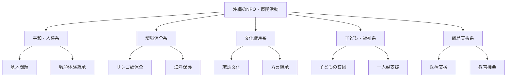
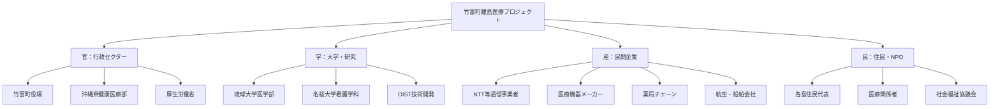

# セクター間の橋渡し役として - 沖縄の協働型社会づくり

地域公共政策士の最も重要な役割の一つが、産業界（産）・行政（官）・大学（学）・市民社会（民）の4つのセクター間をつなぐコーディネーターとしての機能です。本章では、沖縄の特殊な地域事情を踏まえた産官学民連携の実践手法を、生成AIを活用しながら体系的に学びます。

## 8.1 ステークホルダー分析と関係構築

沖縄における産官学民連携を成功させるためには、まず各セクターの特徴と制約を正確に理解することが重要です。

### 8.1.1 セクター別の特徴と沖縄特有の事情

#### 行政セクター（官）の論理と制約

**沖縄県レベルの特徴**：
```
組織的特徴：
・予算規模：年間約7,000億円（振興予算含む）
・職員数：約10,000名（全国比では小規模）
・意思決定：県議会の影響力が強い
・政策領域：基地問題、離島振興、観光振興が主軸

制約要因：
・国との関係：基地問題による特殊な政治的制約
・地理的制約：離島への政策展開の困難さ  
・財政制約：自主財源比率が低い（約30%）
・人材制約：専門職員の確保が困難
```

**市町村レベルの多様性**：
```
大規模自治体（那覇市、沖縄市等）：
・職員数：1,000-2,000名
・専門部署：企画、観光、都市計画等の専門課
・民間連携：経験豊富、複数の連携実績

小規模離島自治体（竹富町、座間味村等）：
・職員数：50-150名
・兼務体制：一人で複数業務を担当
・民間連携：限定的、個人的関係に依存
・特殊事情：観光と住民生活のバランス調整
```

#### 民間企業セクター（産）の利益追求と社会貢献

**沖縄経済界の構造的特徴**：

```
Phase 1（自分で分析）：
「沖縄の代表的企業を5社挙げ、それぞれの特徴を書いてください」

Phase 2（AI支援情報収集）：
「沖縄県内の主要企業の事業内容、売上規模、従業員数、
社会貢献活動について整理してください」

Phase 3（実情との照合）：
「AI情報と沖縄の実情を比較し、相違点や不足点はありますか？」
```

**主要企業カテゴリー**：

1. **金融機関**：
   - 沖縄銀行、琉球銀行：地域密着型経営、県内シェア90%超
   - 特徴：保守的経営、安定性重視、地域貢献意識高
   - 連携ポイント：長期的視点、信頼関係重視

2. **エネルギー・インフラ**：
   - 沖縄電力、りゅうせき：生活インフラの責任
   - 特徴：公共性と収益性のバランス調整
   - 連携ポイント：環境政策、離島サービス維持

3. **観光・サービス業**：
   - 各種ホテルチェーン、航空会社、レンタカー
   - 特徴：観光客数に業績が直結、季節変動大
   - 連携ポイント：持続可能観光、地域住民との共存

4. **建設・不動産**：
   - 地場建設会社、開発業者
   - 特徴：公共事業依存度高、地域密着
   - 連携ポイント：災害対応、景観保全

#### NPO・市民社会セクター（民）のミッションと活動

**沖縄特有のNPO・市民活動の特徴**：




#### 大学・研究機関セクター（学）の研究と教育使命

**沖縄の高等教育・研究機関の特色**：

1. **琉球大学**：
   - 総合大学としての幅広い研究領域
   - 地域密着研究（海洋、農業、医学、教育）
   - 学生の約80%が沖縄出身、地域定着率高

2. **沖縄科学技術大学院大学（OIST）**：
   - 国際的研究機関、教員の半数以上が外国人
   - 最先端科学技術研究
   - 産学連携、ベンチャー創出に積極的

3. **名桜大学等私立大学**：
   - 実学重視、地域産業との連携
   - 観光、福祉、看護等の専門分野

### 8.1.2 利害関係の整理と Win-Win の探索

#### ステークホルダーマッピング手法

**実習例：石垣島エコツーリズム推進プロジェクト**

```
Phase 1（手作業でのマッピング）：
「石垣島でエコツーリズムを推進する場合の関係者を
影響度×関心度のマトリクスで整理してください」

関係者リスト：
・石垣市役所（観光文化課）
・石垣市観光交流協会
・地元ホテル・民宿経営者
・ダイビングショップ等アクティビティ業者
・地元住民（特に白保地区等）
・環境保護団体
・琉球大学（理学部）
・観光客
・沖縄県（観光政策課）
・国（環境省、観光庁）

Phase 2（AI支援での詳細情報収集）：
「各ステークホルダーの具体的な利益・懸念・制約について
詳細情報を収集してください」

Phase 3（対立点と共通点の分析）：
「収集した情報から、対立しやすい論点と
協力可能な共通利益を抽出してください」

Phase 4（Win-Win シナリオの設計）：
「全ステークホルダーが受益できる
エコツーリズム推進策を提案してください」
```

**典型的な対立構造と解決の方向性**：

| 対立軸 | 対立内容 | Win-Win解決策 |
|--------|----------|---------------|
| 経済vs環境 | 観光開発vs自然保護 | 持続可能な観光モデル |
| 住民vs観光客 | 生活環境vs観光需要 | 住民参加型観光計画 |
| 短期vs長期 | 即効性vs持続性 | 段階的実施計画 |
| 中央vs地方 | 国の方針vs地域の実情 | 地域特性反映制度設計 |

## 8.2 協働プロジェクトの設計と運営

理論的な分析から実際の協働プロジェクトの実践に移ります。

### 8.2.1 プロジェクト立ち上げの実践手法

#### キックオフミーティングの設計

**実習：宮古島水資源管理協議会の立ち上げ**

```
認知負債防止プロセス：

Phase 1（事前準備を自分で計画）：
「以下の参加者でのキックオフミーティングを企画してください」

参加者：
・宮古島市役所（水道局、企画政策部）
・宮古島地下水委員会
・農業協同組合
・ホテル協会
・住民代表（上野地区、城辺地区）
・琉球大学（工学部）
・沖縄県（環境部）

Phase 2（AI支援での資料準備）：
「キックオフミーティングで必要な資料リストを作成し、
各資料の概要を整理してください」

Phase 3（シナリオ検証）：
「想定される議論の流れと対立点を予測し、
ファシリテーション戦略を検討してください」

Phase 4（実践計画の確定）：
「実際のミーティング進行計画を作成してください」
```

**キックオフミーティング進行例**：

```
1. 開会・趣旨説明（15分）
   - プロジェクト背景と目的
   - 期待される成果と社会的意義

2. 現状認識の共有（45分）
   - 各セクターからの現状報告
   - データ・事実の確認
   - 課題認識の差異の確認

3. 役割分担と責任の明確化（30分）
   - 各参加者の貢献可能領域
   - 意思決定プロセスの設計
   - 予算・リソース分担

4. コミュニケーション計画（20分）
   - 定例会議の設定
   - 情報共有方法
   - 緊急時の連絡体制

5. 今後のスケジュール（10分）
   - マイルストーンの設定
   - 次回までの課題分担
```

#### 合意形成のための対話技術

**沖縄特有の合意形成文化への配慮**：

```
Phase 1（文化的背景の理解）：
「沖縄の会議文化や意思決定スタイルの特徴を
自分の経験や観察から整理してください」

沖縄の特徴：
・直接的対立を避ける傾向
・年長者・地位者への敬意
・「ゆいまーる」精神（相互扶助）
・時間に対する柔軟性
・非公式な場での調整を重視

Phase 2（対話技術の学習）：
「これらの文化的特徴を活かしながら
効果的な合意形成を行う技術を調査してください」

Phase 3（実践方法の設計）：
「宮古島の事例で、文化的配慮をした
具体的な対話プロセスを設計してください」
```

### 8.2.2 進捗管理と軌道修正

#### 定例会議の効果的運営

**実習：久米島スマートアイランド推進協議会の運営**

```
月次定例会議の標準アジェンダ：

1. 前月の進捗確認（20分）
   各セクターからの報告
   数値目標に対する達成度確認

2. 課題・障害の共有（15分）
   発生した問題の報告
   解決に必要なサポートの確認

3. 調整・協議事項（20分）
   セクター間の調整が必要な案件
   方針変更の検討

4. 今月の重点取組（10分）
   優先課題の確認
   役割分担の再確認

5. その他・次回予告（5分）
```

**生成AI活用による効率化**：

```
Phase 1（会議準備の自動化検討）：
「定例会議の準備作業で、AIが支援できる部分と
人間が直接行うべき部分を区別してください」

AI支援可能：
・前回議事録からのアクションアイテム抽出
・進捗データの整理・グラフ化
・資料の体裁統一・レイアウト調整

人間が担当：
・参加者との事前調整
・微妙な利害対立の把握
・非公式情報の収集・分析

Phase 2（実際の支援ツール作成）：
「議事録から自動的に次回会議資料の叩き台を
作成するプロンプトを設計してください」

Phase 3（運用テストと改善）：
「実際に使用してみて、改善点を特定し
プロンプトや運用方法を調整してください」
```

#### 早期課題発見システム

**認知負債を避けた課題発見プロセス**：

```
Phase 1（人間による直感的把握）：
定例会議やインフォーマルな場で：
・参加者の表情や発言の変化
・積極性の低下や遅刻・欠席の増加
・セクター間のコミュニケーション減少

Phase 2（データによる客観的確認）：
・進捗指標の推移分析
・コミュニケーション頻度の測定
・予算執行状況の確認

Phase 3（AI支援での要因分析）：
「以下の兆候が見られる場合の原因分析をしてください：
・住民代表の会議参加率が70%→40%に低下
・民間企業からの提案件数が減少
・行政側の資料提出が遅れがち」

Phase 4（対策の立案と実行）：
人間が最終判断して適切な介入策を決定
```

## 8.3 沖縄特有課題への産官学民連携適用

沖縄の特殊な地域事情に対応した連携事例を通じて実践的スキルを習得します。

### 8.3.1 基地返還後土地利用計画での連携

**事例：普天間飛行場返還後の土地利用計画**

```
ステークホルダー構成：
・国（内閣府沖縄担当部局、防衛省）
・沖縄県（企画部、土木建築部）
・宜野湾市（企画部、都市建設部）
・地権者組織（普天間飛行場跡地利用推進協議会）
・周辺住民（自治会連合会）
・経済界（沖縄商工会議所、建設業協会）
・学術機関（琉球大学、沖縄国際大学）
・市民団体（平和団体、環境保護団体）

Phase 1（現状分析と課題整理）：
各セクターの立場と利害を整理
・国：跡地利用の円滑推進、経済効果創出
・県：県土発展の拠点、雇用創出
・市：住民サービス向上、財政基盤強化
・地権者：適切な補償、土地の有効活用
・住民：生活環境改善、交通渋滞解消
・経済界：開発需要獲得、新事業機会
・学術：研究・教育機能の充実
・市民団体：平和利用の徹底、環境保全

Phase 2（対立点の分析）：
・開発規模：大規模開発vs持続可能開発
・機能配置：商業vs住宅vs公共vs緑地
・交通計画：アクセス向上vs環境負荷
・財政負担：開発コストの分担方法

Phase 3（Win-Win解決策の模索）：
「全ステークホルダーが納得できる土地利用計画の
基本方針を提案してください」
```

### 8.3.2 離島医療確保での連携事例

**事例：竹富町離島医療確保プロジェクト**

竹富町（竹富島、黒島、小浜島、鳩間島、新城島、波照間島、西表島）の医療体制充実を目指した産官学民連携の実践例です。



**連携プロジェクトの実践プロセス**：

```
Phase 1（問題定義の共有）：
「離島医療の課題を各セクターの視点で整理してください」

官の視点：
・医師・看護師の確保困難
・医療機器の維持管理コスト
・緊急搬送体制の限界

学の視点：
・遠隔医療技術の実証フィールド
・地域医療教育の実習場
・離島医療モデルの研究対象

産の視点：
・遠隔医療システムの市場
・物流効率化の必要性  
・新技術実装の機会

民の視点：
・日常的医療アクセスの改善
・緊急時対応への不安
・高齢化進行への対応

Phase 2（解決策の協働設計）：
「各セクターの強みを活かした統合的解決策を
設計してください」

統合ソリューション例：
1. 遠隔診療システム
   - 学：琉球大学医学部が診療支援
   - 産：通信事業者がインフラ提供
   - 官：制度整備と財政支援
   - 民：住民が利用者として参加・フィードバック

2. 医療従事者育成・確保
   - 学：名桜大学が看護師養成課程で離島実習
   - 官：奨学金制度と勤務義務付け
   - 産：勤務環境改善投資
   - 民：地域での生活支援

3. 予防医療・健康増進
   - 学：健康データ分析研究
   - 産：健康機器・アプリ提供
   - 官：健診制度充実
   - 民：コミュニティでの健康活動

Phase 3（実装と評価）：
実際のプロジェクト運営における課題と対応策
```

### 8.3.3 持続可能観光での連携モデル

**事例：石垣島オーバーツーリズム対策協議会**

```
Phase 1（現状認識の共有）：
各セクターが抱える課題：

観光業界（産）：
・繁忙期の人手不足
・宿泊施設の稼働率向上圧力
・サービス品質維持の困難

行政（官）：
・インフラへの負荷増大
・住民生活への影響
・環境保全との両立

住民（民）：
・交通渋滞と騒音
・生活コスト上昇
・地域文化への影響

研究機関（学）：
・観光と環境の両立研究
・観光客行動分析
・政策効果測定

Phase 2（協働戦略の設計）：
「オーバーツーリズム解決のための協働戦略を
各セクターの役割分担とともに提案してください」

提案例：
1. 観光客分散化システム
   - 産：代替観光地の魅力向上
   - 官：交通・情報インフラ整備
   - 学：観光行動データ分析
   - 民：地域資源の再発見・提供

2. 住民参加型観光計画
   - 民：観光計画への意見反映
   - 官：住民意見集約システム
   - 学：合意形成手法研究
   - 産：住民提案の事業化
```

## 8.4 生成AIを活用した連携プロジェクト管理

産官学民連携プロジェクトにおける生成AIの効果的活用方法を実践します。

### 8.4.1 情報共有とコミュニケーション支援

**多様なステークホルダー間の情報格差解消**：

```
認知負債防止の情報共有プロセス：

Phase 1（情報の人間による整理）：
各セクターが持つ情報を担当者が整理
・専門用語の使用状況確認
・前提知識の違いの把握
・重要度認識のギャップ確認

Phase 2（AI支援での翻訳・調整）：
「以下の技術仕様書を、行政職員と住民代表にも
理解できるよう書き直してください」

例：
原文（技術仕様）:
「IoTセンサーによるリアルタイム水質監視システムにより、
DO値、pH値、濁度等のパラメータを常時測定し、
閾値を超過した場合は自動的にアラートを発信する」

AI支援後:
「川や海の水の汚れ具合を24時間自動で監視する装置を設置し、
水が汚れすぎた場合にはすぐに関係者に連絡が行くシステム」

Phase 3（内容の人間による確認）：
・情報の正確性維持確認
・各セクターにとっての理解しやすさ確認
・重要な詳細情報の欠落チェック
```

### 8.4.2 合意形成プロセスの支援

**多様な意見の構造化と整理**：

```
Phase 1（手作業での意見収集）：
各ステークホルダーから直接意見聴取
・対面ミーティング
・個別インタビュー
・アンケート調査

Phase 2（AI支援での意見分析）：
「以下の様々な意見を論点別に整理し、
対立点と共通点を明確にしてください」

収集された意見例（石垣島観光問題）:
住民A「観光客が多すぎて生活に支障」
事業者B「観光客がいないと経済が成り立たない」
行政C「バランスの取れた発展を目指したい」
研究者D「持続可能性の指標が必要」

AI分析結果:
論点1：観光客数の適正レベル
論点2：経済効果vs生活環境
論点3：測定・評価方法
論点4：具体的対策の実現可能性

Phase 3（人間による合意点の模索）：
AI整理結果を参考に、合意可能な解決策を探索
```

### 8.4.3 プロジェクト評価と改善

**成果測定と次期計画への反映**：

```
Phase 1（評価項目の人間による設定）：
プロジェクトの成功指標を各セクターの視点で設定
・定量的指標（数値で測定可能）
・定性的指標（満足度、関係性の改善等）

Phase 2（データ収集と分析支援）：
「以下のプロジェクト実績データから、
成功要因と改善点を分析してください」

Phase 3（人間による総合判断）：
AI分析結果を参考に、プロジェクトの総合評価と
次期計画への改善提案を決定
```

## 8.5 混合クラス特化の学習活動

琉球大学混合クラスでの産官学民連携学習を効果的に行うための特別設計です。

### 8.5.1 学部生×社会人学生のペア連携

**理論×実務の融合学習**：

```
最適ペア例：
比嘉美咲（学部生・観光学関心）× 照屋正博（県庁観光政策課）

共同課題：「石垣島持続可能観光モデルの提案」

学部生の貢献：
・最新の持続可能観光研究の調査
・海外事例の収集と比較分析
・理論的フレームワークの構築

社会人学生の貢献：
・現場の実情と制約要因の説明
・政策実現可能性の評価
・関係者調整の実務知識提供

協働プロセス：
1. 課題の共有と役割分担
2. それぞれの専門性を活かした調査
3. 定期的な情報交換と議論
4. 統合された最終提案の作成
```

### 8.5.2 世代間知識伝承システム

**経験豊富な社会人から学部生への実務知識伝承**：

```
メンタリングペア例：
宮良健司（県庁都市計画課・15年経験）→ 学部生3名

伝承内容：
・利害関係者との調整技術
・会議運営と合意形成のコツ
・行政内部での意思決定プロセス
・住民との対話における注意点

実践方法：
・月1回の個別面談
・実際のプロジェクトでの同席・見学
・経験談の共有と質疑応答
・学生の提案に対する実務的フィードバック
```

### 8.5.3 成果発表と相互評価

**混合クラス特有の多角的評価システム**：

```
発表会形式：
・学部生：理論的分析と提案の論理性
・社会人：実現可能性と実務的価値
・全体討議：実理論と実務の統合度評価

評価観点：
1. 理論的根拠の確かさ（主に学部生評価軸）
2. 実務的実現可能性（主に社会人評価軸）
3. ステークホルダー理解度（共通評価軸）
4. 協働プロセスの質（混合クラス特有）
5. プレゼンテーション技術（共通評価軸）
```

## 8.6 実践課題と振り返り

本章の集大成として、実際の産官学民連携プロジェクトを企画・運営します。

### 8.6.1 最終課題：連携プロジェクト企画

**課題設定**：
```
「沖縄の特定の地域課題について、産官学民連携による
解決プロジェクトを企画し、実行計画を作成してください」

選択可能テーマ：
1. 離島の人口減少対策
2. サンゴ礁保全と観光の両立
3. 基地返還跡地の平和利用
4. 台風災害に強いコミュニティづくり
5. 琉球文化の継承と観光活用

提出物：
・ステークホルダー分析レポート
・プロジェクト実行計画書
・想定される課題と対応策
・成果測定指標と評価方法
・プレゼンテーション資料
```

### 8.6.2 学習成果の振り返りと自己評価

**認知負債防止の振り返りプロセス**：

```
Phase 1（自己分析）：
「本章の学習を通じて、あなたの産官学民連携に対する
理解はどう変化しましたか？」

振り返り項目：
・各セクターの特徴理解の深化
・沖縄特有の課題への理解
・実践的スキルの習得状況
・生成AI活用能力の向上

Phase 2（AI支援での客観化）：
「私の学習記録と成果物を分析し、
強化された能力と今後の課題を整理してください」

Phase 3（今後の学習計画）：
「分析結果を参考に、地域公共政策士として
さらに向上すべき能力と学習方法を計画してください」
```

本章を通じて、沖縄の多様なセクター間をつなぐコーディネーターとしての実践的スキルを習得し、生成AIを効果的に活用しながら、認知負債に陥ることなく主体的な判断力を保った産官学民連携の専門家として成長することを目指してください。