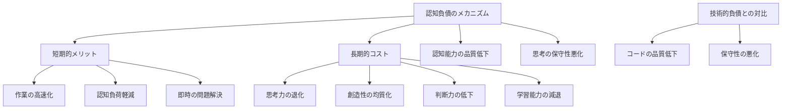
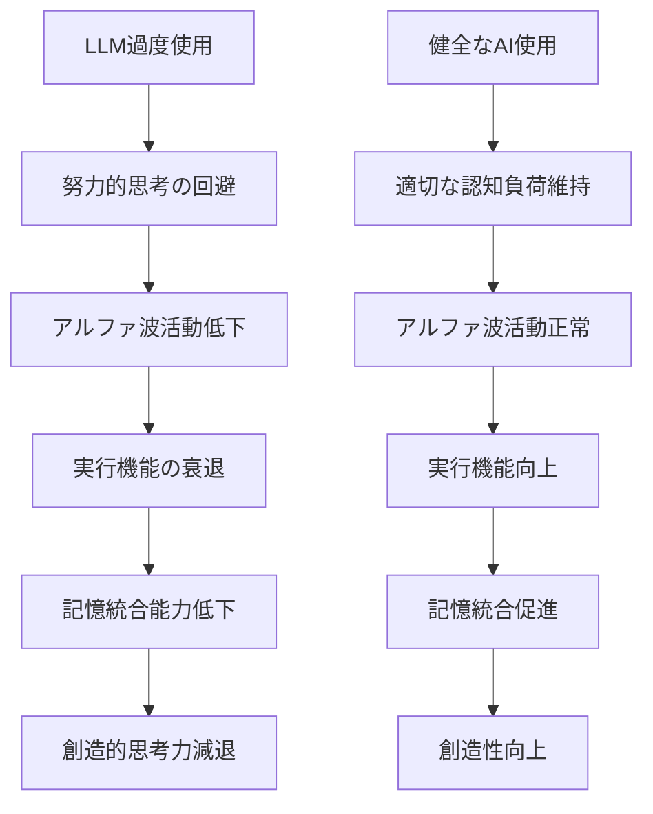
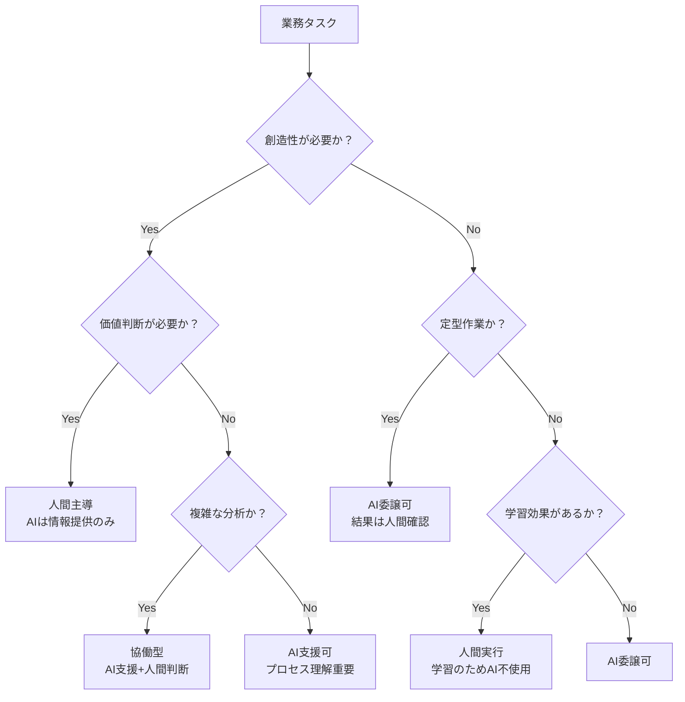
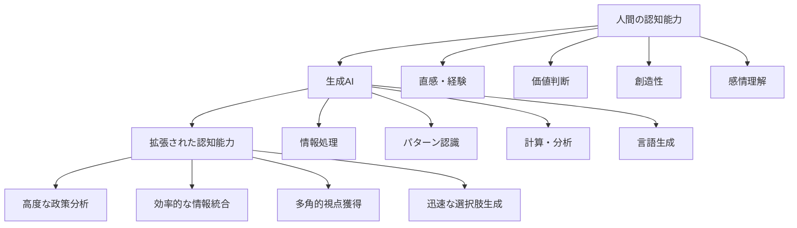

# 認知負債を理解し、健全なAI活用を実現する

本章は本書の理論的基盤となる最重要章です。MIT発の最新研究に基づく「認知負債」の概念を深く理解し、地域公共政策士として生成AIを「認知エクソスケルトン」として健全に活用する方法を習得します。単なる便利ツールとしてではなく、主体的思考力を保ちながら協働する真のパートナーとして生成AIを活用する能力を身につけることが目標です。

## 9.1 認知負債の基礎理解

### 9.1.1 認知負債とは何か - MIT研究の核心

#### 認知負債の定義と本質

**認知負債の正確な定義**：
「大規模言語モデル（LLM：ChatGPT等の生成AI基盤技術）に過度に依存することで、人間の努力的思考プロセス（System 2 thinking：深く考える脳の働き）が正常に機能しなくなる状態。短期的な認知作業の効率化と引き換えに、長期的な思考能力の劣化という『負債』を負うこと」



**技術的負債（Technical Debt）との類似点と相違点**：

| 項目 | 技術的負債 | 認知負債 |
|------|------------|----------|
| 発生原因 | 短期的効率重視のコード | 短期的効率重視のAI依存 |
| 短期効果 | 開発速度向上 | 認知作業速度向上 |
| 長期影響 | コード保守困難 | 思考能力劣化 |
| 対象 | ソフトウェアシステム | 人間の認知システム |
| 可視性 | バグやエラーで発覚 | 気づきにくい漸進的劣化 |
| 返済方法 | リファクタリング | 意識的な思考訓練 |

#### 「精神的なクレジットカード」としてのAI

**認知負債防止の自己診断**：

```
Phase 1（現状の自己分析 - AI使用禁止）：
以下の質問に、AIに頼らず自分で答えてください：

□ 最近、何かを深く考え続けた時間はどのくらいありますか？
□ AI無しで複雑な文章を書いたのはいつが最後ですか？
□ 難しい問題に直面したとき、すぐにAIを使いたくなりますか？
□ AIの回答を疑ったり、検証したりすることがありますか？
□ 新しいアイデアを自分で思いつくことができていますか？

Phase 2（行動パターンの分析）：
「過去1週間のAI使用記録を詳細に記録し、
依存度レベルを分析してください」

使用記録例：
- 月曜日：レポート作成でChatGPT使用3時間、自分で考えた時間30分
- 火曜日：プレゼン資料作成でCopilot使用2時間、自分で構成検討1時間
- 水曜日：...

Phase 3（依存度の客観的評価）：
記録を見返し、健全な使い分けができているか自己評価

危険信号：
・AIの回答をそのまま使用することが多い
・AIなしでは作業が進まない不安を感じる
・自分で考える時間よりAIとの対話時間が長い
・AIの提案に疑問を持たなくなっている
```

### 9.1.2 MITメディアラボの研究結果と科学的根拠

#### 実証実験の詳細と結果

**研究概要**（MIT Computer Science and Artificial Intelligence Laboratory, 2024）：

```
実験設計：
- 参加者：54名（大学生・大学院生）
- 期間：8週間の長期追跡調査
- 測定項目：アルファ波活動（脳波の一種）、実行機能（適切な判断をする脳力）、記憶定着率
- 実験群：LLM高使用群 vs 対照群：従来手法群

主要発見：
1. アルファ波ネットワーク（8-12Hz：集中時に出る脳波）の活動低下
   - 高使用群：基線から平均23%低下
   - 対照群：ほぼ変化なし

2. 「実行関与」（Executive Engagement：意識的に集中して考える能力）の減退
   - 問題解決時の前頭前皮質（考えることを司る脳領域）活動低下
   - 計画立案能力の有意な低下（p<0.01）

3. 記憶定着率の悪化
   - 長期記憶形成：高使用群で平均18%低下
   - 知識のネットワーク化能力の減退
```

**脳科学的メカニズムの解明**：



#### System 1 vs System 2 思考への影響

**ダニエル・カーネマン（心理学者）の二重プロセス理論との関連**：

```
System 1（自動的思考：直感・反射的な思考）：
- 特徴：高速、直感的、努力不要
- AI使用効果：さらに高速化、便利さ向上
- 認知負債：System 1への過度依存促進

System 2（努力的思考：論理的・意識的な思考）：
- 特徴：低速、論理的、努力必要
- AI使用効果：代替・回避の誘惑
- 認知負債：System 2の萎縮・劣化

健全なAI活用原則：
- System 1作業のAI委譲：○（データ整理、定型作業等）
- System 2作業のAI委譲：×（分析、判断、創造等）
- System 2→AI→System 2の循環：◎（理想的協働）
```

### 9.1.3 大学生・地域公共政策士に特有のリスク

#### デジタルネイティブ世代の認知負債リスク

**学生タイプ別の認知負債リスク分析**：

```
1. 高技術スキル学生の認知負債リスク：
   特徴：
   - プログラミングや情報技術に精通
   - AI活用の技術的手法を熟知
   - 効率化への強いインセンティブ
   
   認知負債リスク：
   - 「技術的にできる」＝「使うべき」の思考回路
   - 手段と目的の混同（AI使用自体が目的化）
   - 深く考える必要性への軽視
   - アルゴリズム的思考への偏重

2. 効率重視学生の認知負債リスク：
   特徴：
   - 短時間での成果完成を重視
   - 多忙な生活スタイル（バイト、サークル等）
   - 即座の回答・解決策を求める
   
   認知負債リスク：
   - 思考プロセスのスキップ癖
   - 表面的理解で満足する習慣
   - 試行錯誤体験の回避
   - 批判的検証時間の省略

3. AI依存学生の認知負債リスク：
   特徴：
   - レポートや課題でAIを多用
   - AIなしでは不安を感じる
   - AI回答への盲目的信頼
   
   認知負債リスク：
   - 自力での文章構成力低下
   - 論理的思考力の未発達
   - オリジナリティの欠如
   - AI出力の質的判断力不足

4. 学習方法混乱学生の認知負債リスク：
   特徴：
   - 従来学習法とAI活用法の使い分けに迷い
   - 何をAIに任せ、何を自分で行うべきか不明
   - 学習効果への不安
   
   認知負債リスク：
   - 一貫性のない学習アプローチ
   - メタ学習スキル（学び方を学ぶ力）の未発達
   - 自己評価能力の低下
   - 学習目標の不明確化

5. 研究志向学生の保護要因：
   特徴：
   - 深い探究心と批判的思考習慣
   - 論文執筆での厳密性重視
   - 独創性への価値観
   
   保護要因：
   - 情報源の批判的検証習慣
   - 段階的思考プロセスの重視
   - AI出力への健全な懐疑心
   - 自己の思考過程への意識
```

#### キャリア形成期の思考力低下リスク

地域公共政策士としてのキャリア形成期（大学生から社会人初期）は、将来の専門能力を決定づける極めて重要な時期です。この時期に生成AIに過度に依存することで発生する認知負債は、長期的なキャリア発展に深刻な影響を及ぼします。

**地域公共政策士に求められる能力との関連**：

地域公共政策士には5つの核心的能力が求められますが、それぞれに特有の認知負債リスクが存在します。

**批判的思考力**は政策提案の多角的検証において不可欠です。政策には必ず多様な利害関係者が存在し、一つの角度からの分析では見落としが生じます。しかし、AIの回答を無批判に受容する習慣が身につくと、情報の信頼性評価や論理的整合性の検証を怠るようになります。特に生成AIは説得力ある文章を生成するため、内容の妥当性を見極める能力が退化しやすくなります。

**創造的問題解決力**は、既存の政策枠組みでは対応できない新しい課題に対して、独創的なアプローチを発見する能力です。しかし、AIが提案する「最適解」に依存する習慣は、多様な可能性を探索する思考プロセスを阻害します。AIの提案は過去のデータパターンに基づくため、真に革新的な解決策は人間の創造性から生まれることを理解する必要があります。

**複雑性理解力**は、地域の多様なステークホルダーの利害調整において必須の能力です。地域課題は単純な因果関係では説明できない複雑なシステムです。しかし、AIの簡潔な回答に慣れると、複雑さを受け入れ、曖昧さの中で判断する能力が衰退します。結果として、表面的な解決策で満足し、根本的な課題構造を見逃すリスクが高まります。

**長期的視点**は、持続可能な政策設計において重要な要素です。政策の効果は数年から数十年にわたって現れるため、短期的な効果だけでなく長期的な影響を予測する能力が必要です。しかし、AIの即座の回答に慣れると、時間をかけて深く考察する忍耐力が低下し、短期的な解決策に飛びつく傾向が強まります。

**コミュニケーション力**は、住民や関係者との対話において自分の言葉で思いを伝える能力です。AIが作成した文書や説明に依存すると、自分自身の考えを相手に合わせて表現する能力が未発達のままになります。特に住民との対話では、共感や信頼関係の構築が重要であり、これは人間固有の能力として維持・発展させる必要があります。

```
必要能力 vs 認知負債リスク：

1. 批判的思考力
   ✓ 必要性：政策の多角的検証
   ⚠️ リスク：AI回答の無批判受容

2. 創造的問題解決
   ✓ 必要性：新しい政策アプローチ発見
   ⚠️ リスク：AI提案への依存、独創性低下

3. 複雑性理解
   ✓ 必要性：多様なステークホルダー調整
   ⚠️ リスク：AI簡略化への依存

4. 長期的視点
   ✓ 必要性：持続可能政策設計
   ⚠️ リスク：即座の回答への依存

5. コミュニケーション力
   ✓ 必要性：住民・関係者との対話
   ⚠️ リスク：AI作成文書への依存
```

## 9.2 認知負債の予防とガードレール

### 9.2.1 「ショートカットする部分」と「自分で考える部分」の明確な分離

#### タスクの意識的分類システム

**地域公共政策士業務のAI活用判断フレームワーク**：



**具体的業務分類の実践例**：

```
Phase 1（自分でタスク分類）：
以下の政策立案業務を上記フレームワークで分類してください：

1. 過去の議事録からの論点抽出
2. 住民アンケートの自由記述分析  
3. 政策の優先順位決定
4. 他自治体事例の収集
5. ステークホルダーとの利害調整戦略
6. 予算案の計算
7. 住民説明会での質疑応答
8. 政策効果の評価指標設定

Phase 2（AI支援での詳細検討）：
「各業務について、AI活用の適切な範囲と
人間が担うべき部分を具体的に提案してください」

Phase 3（実践ガイドラインの確定）：
AI提案を参考に、自分の職場・学習環境に適した
具体的なAI活用ルールを策定

実践ガイドライン例：
【AI委譲可】
・データ収集・整理（結果確認必須）
・定型文書の下書き作成（内容調整必須）
・計算・集計作業（検算必須）

【協働型】  
・複雑データの分析（解釈は人間）
・政策案のブレインストーミング（選択は人間）
・文献レビュー（評価・判断は人間）

【人間主導】
・政策の価値判断・優先順位決定
・ステークホルダーとの交渉戦略
・住民との直接対話
・最終的な政策決定
```

#### 定期的なバランス見直しシステム

**月次セルフチェックシステム**：

```
Phase 1（使用実態の記録 - AI使用禁止）：
毎日の業務終了時に手書きで記録：
・AI使用した業務とその時間
・自分で考えた業務とその時間
・AI回答をそのまま使用した回数
・AI回答を修正・検証した回数

Phase 2（月次パターン分析）：
「1ヶ月の記録を分析し、AI依存度の変化と
思考能力への影響を評価してください」

Phase 3（改善計画の立案 - 人間主導）：
分析結果を基に、来月の改善目標を設定：

改善目標例：
・AI使用前に必ず5分間自分で考える
・AI回答の検証時間を使用時間の30%確保  
・週に1日は「AIフリーデー」を設定
・複雑な課題は必ずAI無しで最初の仮説を立てる
```

### 9.2.2 能動的好奇心の培養

認知負債を防ぐ最も効果的な方法の一つが、能動的好奇心の培養です。生成AIが即座に答えを提供してくれる環境では、「なぜ？」と問い続ける習慣が失われがちです。しかし、この好奇心こそが深い理解と独創的な洞察を生み出す原動力となります。特に地域公共政策の分野では、表面的な解決策ではなく、問題の根本原因を理解することが持続可能な政策立案の鍵となります。

#### 「なぜ？」を大切にする習慣の構築

**沖縄地域課題での実践的好奇心トレーニング**：

```
実践例1：観光客数減少問題

従来のAI依存パターン：
「沖縄の観光客数が減少している原因と対策を教えてください」
→ AI回答をそのまま受容

能動的好奇心パターン：
Phase 1（自分の仮説）：
「なぜ観光客数が減少したのか、私なりの仮説を3つ立ててみよう」
1. コロナ禍の影響が継続？
2. 競合他地域の魅力向上？  
3. 沖縄の魅力の変化？

Phase 2（情報収集）：
「私の仮説を検証するデータを探してください」

Phase 3（批判的検討）：
「AIが提供した情報で、疑問に思う点や
他の解釈可能性はありませんか？」

Phase 4（深堀り）：
「なぜそのような変化が起きたのか、
さらに根本的な原因は何でしょうか？」
```

**好奇心促進プロンプト集**：

```
基本の「なぜ？」プロンプト：
・「この結論に至った理由をもっと詳しく説明してください」
・「他にはどんな可能性が考えられますか？」
・「この情報の信頼性をどう判断すべきでしょうか？」
・「逆の立場からはどう見えるでしょうか？」

沖縄特化の「なぜ？」プロンプト：
・「なぜこの問題は沖縄特有なのでしょうか？」
・「本土との違いの根本的な原因は何ですか？」
・「離島と本島でなぜ状況が異なるのでしょうか？」
・「沖縄の歴史的背景がどう影響していますか？」
```

#### 異なる視点からの継続的検討

**多角的思考のシステム化**：

```
「6つの帽子」思考法のAI活用版：

Phase 1（白い帽子 - 事実）：
AIに依頼「客観的な事実とデータのみを提供してください」

Phase 2（赤い帽子 - 感情）：
自分で考察「この問題に対する住民の感情はどうか？」

Phase 3（黄い帽子 - 楽観）：
AIに依頼「この提案の利点と可能性を整理してください」

Phase 4（黒い帽子 - 慎重）：
自分で分析「AIの楽観論のどこに問題があるか？」

Phase 5（緑の帽子 - 創造）：
協働「全く新しいアプローチはないでしょうか？」

Phase 6（青い帽子 - 管理）：
自分で統合「すべての視点を総合してどう判断するか？」
```

### 9.2.3 メタ認知スキルの強化

メタ認知スキルとは「自分の思考について考える能力」、つまり自分が何を知っていて何を知らないかを把握し、自分の思考プロセスを客観視する能力です。認知負債の予防において、このスキルは極めて重要な役割を果たします。生成AIの支援を受けながらも、自分がどの部分で思考し、どの部分でAIに依存しているかを意識的にコントロールすることで、健全なAI活用が可能になります。特に地域公共政策士にとって、複雑な政策課題に対する自分の理解度や判断プロセスを客観視する能力は、質の高い政策立案に直結します。

#### 自分の思考プロセスの意識化

**思考プロセス可視化トレーニング**：

```
実践課題：「宮古島の水資源管理政策立案」

従来パターン（認知負債リスク高）：
「宮古島の水資源管理政策を作成してください」
→ AI出力をほぼそのまま使用

メタ認知強化パターン：

Step 1（思考プロセス設計）：
「この政策立案で私が考えるべきプロセスを整理します」
1. 現状把握（データ収集・分析）
2. 課題特定（問題の構造化）
3. 選択肢生成（政策オプション創出）
4. 評価・選択（最適案決定）
5. 実装計画（具体的手順設計）

Step 2（各段階での自己モニタリング）：
現状把握段階：
「今、私は何を理解し、何を理解していないか？」
「どの情報をAIに頼り、どの判断を自分で行ったか？」

課題特定段階：
「私の問題理解は適切か？見落としはないか？」
「AI分析に影響されすぎていないか？」

Step 3（振り返りと調整）：
各段階終了後：
「このステップで私の思考はどう変化したか？」
「AI依存度は適切だったか？」
「同じ課題に再度取り組む場合、何を改善するか？」
```

#### AI依存度のセルフモニタリングシステム

**依存度測定ツールの開発と活用**：

```
日次セルフチェック項目：

認知的依存度（1-5点で自己評価）：
□ AI無しで作業を始められたか？
□ AI回答を批判的に検証したか？
□ 自分なりの結論を先に考えたか？
□ AI回答に疑問を持てたか？
□ 代替案を自分で考えられたか？

週次パターン分析：
「今週のスコア変化から、私の認知負債リスクは
増大・維持・減少のどの傾向にありますか？」

月次改善計画：
リスク増大の場合：
・AI使用前の思考時間を強制的に確保
・AI回答の検証を必須化
・週1日のAI断食日設定

リスク維持の場合：
・現在のバランスを維持
・新しいチャレンジで思考力向上

リスク減少の場合：
・健全な活用パターンを他者と共有
・より高度なAI協働に挑戦
```

## 9.3 AI倫理とリスク管理

### 9.3.1 AI倫理の原則と地域公共政策への適用

地域公共政策において生成AIを活用する際、技術的な有効性だけでなく、倫理的な責任も同時に考慮する必要があります。住民の生活に直接影響を与える政策決定において、AIの判断プロセスが不透明であったり、特定の集団に不利益をもたらしたりすることは許されません。特に沖縄のような多様な文化的背景を持つ地域では、AI倫理への配慮がより重要になります。地域公共政策士は、AI技術の恩恵を享受しながらも、住民への説明責任と公平性を確保する責務を負っています。

#### 透明性と説明責任の確保

**政策立案プロセスでの透明性確保**：

```
Phase 1（AI使用の明示義務）：
政策資料・報告書での記載例：
「本政策案の策定において、データ分析の一部で生成AIを活用しました。
使用箇所：人口動態データの傾向分析、他自治体事例の整理
最終的な政策判断：担当職員が実施
検証プロセス：専門家レビューを実施」

Phase 2（説明可能性の確保）：
住民説明会での対応準備：
「AIが分析した内容について、その根拠と限界を
住民に分かりやすく説明できるよう準備してください」

説明例：
「コンピューターが過去のデータから傾向を分析しましたが、
最終的な政策決定は私たち職員が、住民の皆様の声や
地域の実情を総合的に判断して行いました」

Phase 3（検証プロセスの制度化）：
・AI活用政策は必ず複数人でレビュー
・外部専門家による妥当性確認
・住民参加での政策検証機会設定
```

#### 公平性と非差別の保証

**沖縄特有の多様性への配慮**：

```
実践課題：多文化共生政策でのAI活用

Phase 1（バイアス要因の事前特定）：
沖縄の多様性：
・沖縄系住民と移住者
・離島と本島住民  
・年齢層（戦争体験世代から平成世代まで）
・言語（標準語、沖縄方言、離島方言）
・外国人住民（米軍関係者、アジア系労働者等）

AIバイアスのリスク：
・標準語データに偏った分析
・本島中心の政策提案
・高齢者のデジタル排除
・少数派住民の意見軽視

Phase 2（公平性確保の具体策）：
「多文化共生政策において、すべての住民グループが
公平に扱われるAI活用方法を設計してください」

公平性確保策例：
・多言語データでのAI学習
・離島データの意図的な重み付け
・高齢者意見の別途収集・統合
・少数派コミュニティとの直接対話

Phase 3（継続的モニタリング）：
実施後の公平性検証：
・各グループの政策恩恵測定
・排除されたグループの特定
・改善策の継続的実施
```

### 9.3.2 バイアスの認識と対応

生成AIは訓練データに含まれる社会的偏見やデータ収集の偏りを学習し、それを出力に反映させる可能性があります。地域公共政策において、このようなバイアスは特定の住民グループの不利益につながり、政策の公平性を損なう深刻な問題となります。沖縄では、本土と離島、世代間、文化的背景など多様な軸での格差が存在するため、AIバイアスの影響を受けやすい環境にあります。地域公共政策士は、AIの出力を批判的に検証し、潜在的なバイアスを識別・修正する能力を身につける必要があります。

#### アルゴリズムバイアスとデータバイアスの識別

**沖縄データでのバイアス検出実習**：

```
実習例：観光政策立案でのバイアス分析

Phase 1（データバイアスの検出）：
「沖縄観光データを分析する際の潜在的バイアスを
自分で特定してください」

典型的バイアス：
・季節バイアス：夏季データの過度重視
・地域バイアス：那覇・本島中心のデータ収集
・言語バイアス：日本語話者データに偏重
・プラットフォームバイアス：特定SNSデータのみ
・経済バイアス：高所得観光客データ中心

Phase 2（AI分析での検証）：
「以下の観光データ分析結果について、
どのようなバイアスが含まれている可能性がありますか？」

分析結果例：
「沖縄観光客の満足度は92%と高く、特に海洋アクティビティ
（85%）と郷土料理（78%）の評価が高い」

潜在的バイアス：
・回答者属性の偏り（回答する人の特徴）
・質問設計の偏り（満足していない人は回答しない）
・データ収集方法の偏り（デジタル調査に偏重）

Phase 3（バイアス軽減策の設計）：
「特定されたバイアスを軽減し、より公正な
観光政策立案を行う方法を提案してください」
```

#### 社会的バイアスと文化的配慮

**沖縄特有の社会文化バイアスへの対応**：

```
文化的バイアス事例と対応：

1. 「ウチナーンチュ vs ナイチャー」バイアス
問題：移住者の意見が軽視される傾向
対応：意図的な移住者意見収集、統合分析

2. 年齢・世代バイアス  
問題：デジタル世代の意見が過重視
対応：非デジタル手段での意見収集併用

3. 離島・周辺部バイアス
問題：中心部（那覇等）データに分析が偏重
対応：離島データの重み付け、個別分析

4. 経済格差バイアス
問題：高所得層意見の過重視
対応：所得階層別分析、低所得層への配慮

実践的対応策：
「沖縄の住宅政策を検討する際、これらのバイアスを
回避しながらAIを活用する具体的方法を設計してください」
```

### 9.3.3 実務的リスク対策

理論的な倫理原則を理解するだけでなく、日常業務において生成AIを安全に活用するための具体的なリスク対策が必要です。地域公共政策士が直面する実務的リスクには、AI情報の信頼性問題（ハルシネーション）、機密情報の取り扱い、著作権侵害などがあります。これらのリスクは住民サービスの質や自治体の信頼性に直接影響するため、事前の対策と組織的な取り組みが不可欠です。実務レベルでの適切な対策により、生成AIの恩恵を最大化しながらリスクを最小限に抑えることができます。

#### ハルシネーション対策の徹底

**地域公共政策分野でのファクトチェック体制**：

```
Phase 1（ハルシネーション高リスク分野の特定）：
地域政策でハルシネーションが危険な領域：
・法令・制度の解釈（間違いが法的問題に）
・統計データ・数値（政策判断に直結）
・他自治体事例（存在しない事例の創作リスク）
・予算・財政情報（金額の間違いが致命的）
・住民意見・世論（存在しない声の創作）

Phase 2（検証プロセスの設計）：
「AI回答の信頼性を確認する3段階チェック体制を
設計してください」

3段階チェック例：
Level 1（即座確認）：
・数値の桁数・単位確認
・常識的範囲内かの判断
・明らかな矛盾の有無

Level 2（資料確認）：
・公式データとの照合
・複数情報源での確認  
・専門書・論文での検証

Level 3（専門家確認）：
・当該分野専門家への相談
・先輩職員・同僚とのディスカッション
・外部機関への確認依頼

Phase 3（組織的対応の制度化）：
・AI使用ガイドラインの策定
・チェック体制の組織的確立
・研修・教育プログラムの実施
```

#### 情報漏洩とプライバシー保護

**自治体業務でのセキュリティ確保**：

```
実務的セキュリティ対策：

Phase 1（機密情報の分類）：
取扱注意レベル別のAI使用可否：

【使用禁止】：
・個人情報（氏名、住所、連絡先等）
・機密性の高い政策検討内容
・他機関との調整内容
・人事・給与情報

【匿名化後使用可】：
・統計データ（個人特定不可能）
・一般的な政策課題
・公開済み情報の分析

【使用可】：
・公開情報の整理
・一般的な制度説明
・学術的な調査・分析

Phase 2（技術的対策）：
「自治体職員がAIを安全に使用するための
技術的ガイドラインを作成してください」

技術対策例：
・組織専用AI環境の構築
・データ境界の明確な設定
・ログ記録・監査体制
・アクセス権限の適切な管理

Phase 3（運用ルールの確立）：
職員向け運用ガイドライン：
・使用前の情報分類確認
・上司への事前相談ルール
・使用記録の保存義務
・問題発生時の報告体制
```

## 9.4 健全なAI活用の実践モデル

### 9.4.1 「認知エクソスケルトン」としてのAI活用

「認知エクソスケルトン」とは、身体機能を支援する外骨格装置の概念を認知機能に応用した考え方です。生成AIを人間の思考を代替するものではなく、認知能力を拡張・強化するパートナーとして位置づけます。エクソスケルトンが身体の力を増幅しながらも操作者の意志に従うように、AIは人間の知的能力を拡張しながらも、最終的な判断と責任は人間が保持します。この協働モデルにより、地域公共政策士は限られた時間とリソースの中で、より質の高い政策立案と住民サービスを実現できます。

#### 人間の認知能力を拡張する協働モデル

**エクソスケルトン（外骨格）概念の応用**：



**実践例：複雑な地域課題解決での協働**：

```
課題：「石垣島における観光と住民生活の調和」

Phase 1（人間の直感・経験）：
・現地視察で感じた住民の不安
・観光業者との会話での課題認識  
・過去の類似課題での経験
・地域文化への理解

Phase 2（AIとの協働分析）：
・観光統計データの詳細分析（AI支援）
・他地域事例の包括的調査（AI支援）
・ステークホルダー意見の構造化（AI支援）
・政策オプションのブレインストーミング（AI支援）

Phase 3（人間の判断・決定）：
・地域特性を踏まえた政策選択
・住民感情への配慮決定
・実現可能性の最終判断
・責任を持った政策決定

Phase 4（協働での実装設計）：
・実施計画の詳細化（AI支援）
・リスク対策の網羅的検討（AI支援）
・評価指標の設計（AI支援）
・最終調整と責任明確化（人間主導）
```

#### 相互補完関係の構築

**人間とAIの最適な役割分担**：

```
【人間が得意・責任を持つべき領域】：
1. 価値判断・倫理的判断
   - 政策の優先順位決定
   - トレードオフの価値選択
   - 倫理的ジレンマの解決

2. 感情・関係性の理解
   - 住民の不安や期待の把握
   - ステークホルダー間の微妙な関係
   - 文化的背景の理解

3. 創造的・直感的思考
   - 全く新しいアプローチの発想
   - 常識を超えた解決策
   - 芸術的・感性的判断

【AIが得意・支援すべき領域】：
1. 大量情報の処理・分析
   - 統計データの分析
   - 文献レビュー
   - パターン認識

2. 客観的・論理的分析
   - 因果関係の分析
   - 論理的整合性チェック
   - 複数選択肢の比較

3. 定型的・反復的作業
   - 資料作成・整理
   - 計算・集計
   - フォーマット統一

【協働が最適な領域】：
1. 複雑な問題分析
   - 人間：問題の本質把握
   - AI：データ分析・要因整理
   - 統合：総合的理解

2. 政策案の創出・評価
   - 人間：基本方針・価値観設定
   - AI：具体案生成・影響分析
   - 統合：最終案決定
```

### 9.4.2 継続的学習と適応システム

生成AI技術は急速に進歩しており、新しい機能やサービスが次々と登場しています。地域公共政策士は、この技術進歩に適応しながらも、認知負債に陥ることなく健全な活用を続ける必要があります。そのためには、基本的な倫理原則や思考プロセスを維持しながら、新しい技術を批判的に評価し、段階的に導入する継続的学習システムが重要です。また、個人レベルだけでなく、組織全体として健全なAI活用文化を醸成することで、持続可能な技術活用が可能になります。

#### AI進化への適応能力の構築

**技術進歩に対応する学習システム**：

```
Phase 1（基本原則の確立）：
変わらない基本原則：
・人間の主体性と責任
・批判的思考の重要性
・倫理的判断の必要性
・地域特性への理解

適応すべき要素：
・AI技術の新機能
・使用方法・インターフェース
・効率化の新しい可能性
・新たなリスクへの対応

Phase 2（継続学習システム）：
月次技術動向チェック：
「新しいAI技術・サービスについて調査し、
地域公共政策分野での活用可能性を評価してください」

評価観点：
・業務効率化への貢献度
・認知負債リスクの程度
・セキュリティ・プライバシー対応
・コスト・導入難易度

Phase 3（実験的導入と評価）：
新技術の段階的導入：
1. 小規模実験（個人レベル）
2. 効果・リスク評価
3. 組織的検討・議論
4. 正式導入または見送り決定
```

#### 組織的な学習文化の醸成

**自治体・大学での健全なAI活用文化構築**：

```
組織レベルでの取り組み：

1. AI活用方針の明確化
組織としての基本スタンス：
「AIは業務効率化のツールであり、
職員の判断力・思考力を代替するものではない」

2. 研修・教育プログラム
・認知負債の理解促進
・健全な活用方法の共有
・事例研究・ケーススタディ
・継続的なスキルアップ

3. 評価・フィードバックシステム
・AI活用の適切性評価
・認知負債リスクのモニタリング
・優良事例の組織内共有
・改善提案の収集・実施

個人レベルでの実践：
・日々の振り返り習慣
・同僚との相互学習
・外部研修・勉強会参加
・専門知識の継続的更新
```

## 9.5 混合クラス特化の学習活動

学部生と社会人学生が共に学ぶ混合クラスでは、世代間の認知特性やAI活用経験の違いを活用した特別な学習活動が可能になります。デジタルネイティブ世代の学部生は技術操作に長けている一方で批判的検証を怠りがちであり、実務経験豊富な社会人学生は慎重な判断力を持つ一方でAI活用に戸惑うことがあります。これらの違いを相互補完的に活用し、それぞれの認知負債リスクを軽減しながら、より高次の学習効果を実現する学習設計が重要です。

### 9.5.1 世代別認知負債リスクの理解

異なる世代が持つ認知特性とAI活用パターンを理解することで、各グループの強みを活かしながら弱点を補い合う学習環境を構築できます。この相互学習により、単独の世代では気づきにくい認知負債リスクを発見し、より包括的な対策を講じることが可能になります。

**学部生と社会人学生の相互学習**：

```
学部生（デジタルネイティブ）の特徴：
強み：AI操作に慣れている、新技術への適応力
リスク：批判的検証を怠りがち、効率重視で思考省略

社会人学生（経験豊富）の特徴：  
強み：実務経験による直感、慎重な判断力
リスク：AI活用の過度な警戒、または過信

相互学習プログラム：
・学部生→社会人：技術操作の指導、新しい活用法紹介
・社会人→学部生：慎重な検証方法、実務での注意点共有
・合同討議：世代を超えた認知負債防止策の検討
```

### 9.5.2 実践的ケーススタディ

理論的な認知負債防止策を実際の地域政策課題に適用し、段階的にAI活用レベルを変化させながら学習効果とリスクを比較検証します。沖縄特有の複雑な課題を題材とすることで、認知負債がもたらす実務的な影響を体感的に理解し、実践的な対策スキルを身につけることができます。

**沖縄特有課題での認知負債防止実習**：

```
ケーススタディ：「宮古島水資源管理政策における
認知負債防止プロセス」

参加者役割分担：
・学部生チーム：最新研究調査、データ分析支援
・社会人チーム：実務制約の説明、実現可能性評価
・混合チーム：統合的政策提案作成

各チームのAI活用制限：
Phase 1（1週目）：AI使用完全禁止
Phase 2（2週目）：情報収集のみAI使用可
Phase 3（3週目）：分析支援でAI使用可
Phase 4（4週目）：協働型AI活用（最終判断は人間）

比較評価：
・各段階での成果物の質
・思考プロセスの深さ
・創造性・独創性の変化
・最終提案の実用性
```

## 9.6 実践課題と自己評価

認知負債の理論的理解から実際の防止実践へと移行するため、具体的な課題設定と継続的な自己評価システムが必要です。個人の学習段階と業務環境に応じた実践計画を策定し、定量的指標による効果測定を通じて、持続可能な健全AI活用スキルを確立します。

### 9.6.1 認知負債防止の個人実践計画

理論学習から実践への橋渡しとして、段階的かつ体系的な個人実践プログラムを設計します。3ヶ月という期間で基礎習慣の確立から応用技術の習得、そして統合的実践まで進めることで、認知負債防止スキルを確実に身につけることができます。

**3ヶ月実践プログラム**：

```
Month 1：基礎習慣の確立
目標：AI使用の意識化と基本的な防止策実践

Week 1：現状分析とベースライン設定
・AI使用記録開始
・認知負債リスク自己診断
・改善目標設定

Week 2-4：基本防止策実践
・AI使用前の5分思考時間確保
・AI回答の必須検証
・週1日のAIフリーデー実施

Month 2：協働スキルの向上
目標：健全な人間・AI協働関係の構築

Week 5-8：協働パターン最適化
・タスク分類システム実践
・エクソスケルトン型活用実験
・メタ認知スキル強化

Month 3：組織・社会への応用
目標：地域公共政策分野での実践的活用

Week 9-12：実務適用と評価
・実際の政策課題での実践
・倫理・リスク管理の徹底
・成果と改善点の評価
```

### 9.6.2 最終評価と継続的改善

3ヶ月の実践期間を経て、認知負債防止スキルがどの程度身についたかを客観的に評価し、今後の継続的改善につなげます。定量的指標と定性的評価を組み合わせることで、多面的な学習効果を測定し、個人の特性に応じた継続的な成長計画を策定できます。

**自己評価指標**：

```
Phase 1（定量的評価 - AI支援で客観化）：
「3ヶ月の実践記録を分析し、以下の指標で
改善度を測定してください」

1. 認知的自立度：AI無しでの作業遂行能力
2. 批判的思考力：AI回答への疑問・検証頻度
3. 創造性維持：独自アイデアの創出頻度
4. 効率性：適切なAI活用による作業効率化
5. 倫理的判断：リスク認識と対応の適切性

Phase 2（定性的評価 - 人間主導で総合判断）：
「数値では測れない変化について自己評価してください」

・思考の深さの変化
・問題解決アプローチの変化
・AI技術への態度変化
・地域課題への理解深化
・将来の学習意欲

Phase 3（継続改善計画の策定）：
「評価結果を基に、今後6ヶ月の改善目標を
設定してください」

改善計画例：
・認知負債リスクが高い分野の集中改善
・新しいAI技術への適応方法の確立
・組織・チームでの健全活用文化構築
・地域公共政策での実践事例蓄積
```

本章を通じて、生成AIを「便利な道具」としてではなく「思考を拡張するパートナー」として適切に活用し、地域公共政策士として主体的な判断力と創造性を保ちながら、沖縄の複雑な地域課題解決に貢献できる能力を身につけることを目指してください。認知負債を避けた健全なAI活用こそが、持続可能で創造的な政策立案の基盤となります。