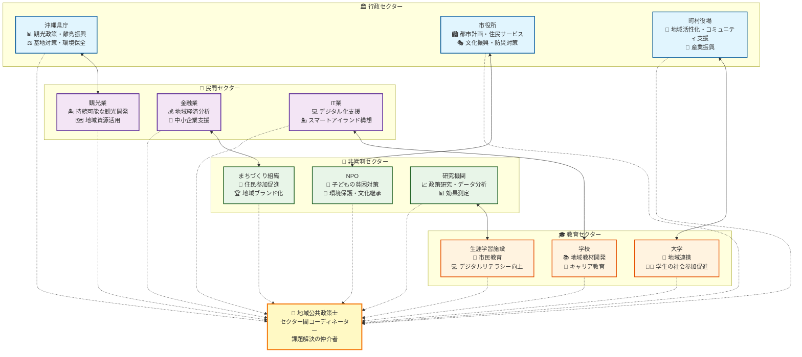
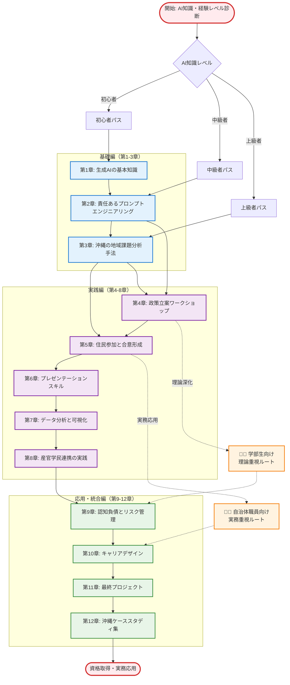

# はじめに - 琉球大学での新しい学び

沖縄の青い海と空に囲まれた琉球大学のキャンパスで、今まさに新しい学びの形が始まろうとしています。この教室には、将来の夢に向かって歩む学部生と、日々住民のために働く現役の自治体職員が机を並べて座っています。年齢も経験も異なる人たちが一堂に会して学ぶテーマは **「DX（デジタルトランスフォーメーション）の活用による地域課題解決」** です。

この授業の目的は、**DXの活用による地域社会が抱える様々な課題の解決を担う、地域公共人材養成** です。具体的には、地域課題解決にDXをどのように適用するかについてアイデアソンで検討し、グループで提案書を作成することを通して、実践的なスキルを身につけます。

なぜ今、地域公共政策士にとってDX、特に生成AIの学習が必要なのでしょうか。そしてなぜ、学部生と自治体職員が一緒に学ぶことに意味があるのでしょうか。この序章では、変化する時代の中で地域公共政策士に求められる新しい能力と、沖縄という地域特性を踏まえた生成AI活用の可能性について考えていきます。

## 0.1 地域公共政策士とは - 沖縄の未来を担う人材

### 0.1.1 資格制度の概要と琉球大学での取り組み

地域公共政策士は、一般財団法人地域公共人材開発機構（COLPU）が認証する民間資格です。**「産官学民の連携を通じて地域の社会的課題や経済的課題を解決する思考と能力を有する人材」** を育成し、その能力を保証する職能資格として、2011年から運用が開始されました。

琉球大学では、「沖縄産学官協働人財育成円卓会議」の提言を受け、**令和元年（2019年）度**から「初級地域公共政策士」資格取得のための科目認証制度をスタートしました。これは京都に次ぐ**全国で2番目**の認証であり、沖縄県の地域特性を活かした独自のプログラムとして注目されています。

**琉球大学プログラムの特色**：
- 社会人のキャリア形成となる実践的なプログラム
- 社会人と学生が協働で地域課題解決に取り組む「協学型」学習
- 日曜日午後のオンライン集中講義（Zoomを活用）
- フィールドワークを含むハイブリッド型授業

**これまでの実績**：
令和元年度の開始から令和6年度までの間で、初級地域公共政策士の資格取得者は累計で**131名**に達しています。各年度の主要な実績は以下の通りです：

- **令和2年度**：20名（社会人12名、学生8名）が資格取得
- **令和3年度**：32名が資格取得、延べ220名が受講
- **令和6年度**：14名（社会人9名、学生5名）が資格取得、延べ258名が受講

この実績は、沖縄県から多くの地域公共人材を輩出していることを示しており、全国的にも注目される成果となっています。

沖縄県においてこの資格が持つ意義は特に大きいと言えます。本土から約1,000km離れた島々からなる沖縄は、独特な歴史と文化を持ち、同時に現代的な課題に直面しています。

**沖縄特有の地域課題**
- **基地問題**: 在日米軍専用施設の約70%が集中
- **離島振興**: 有人離島39島の持続可能な発展
- **観光依存経済**: 年間1,000万人を超える観光客への対応
- **自然災害対応**: 台風の常襲地域としての防災・減災
- **人口格差**: 本島と離島、都市部と地方部の格差
- **文化継承**: 琉球文化・言語の保存と活用

これらの課題は、単一のセクターでは解決が困難であり、まさに「産官学民の連携」が不可欠です。地域公共政策士は、これらの複雑で多様な課題に対して、異なるセクターを結びつけ、総合的な解決策を見出すコーディネーターとしての役割を担います。

### 0.1.2 初級と上級の違い - キャリアパスの展望

地域公共政策士には二つのレベルがあります。

**初級地域公共政策士**（学部レベル）
- 基礎的な地域政策の知識とスキル
- セクター間連携の基本的理解
- 地域課題の分析と整理能力
- 住民参加の促進とファシリテーション

**地域公共政策士**（大学院レベル）
- 高度な政策立案と評価能力
- 複雑なステークホルダー調整
- 地域イノベーションの創出
- 政策研究と実践の統合

本書は主に初級地域公共政策士の取得を目指す学習者を対象としていますが、将来的に上級資格への挑戦を見据えた内容も含んでいます。特に琉球大学の混合クラス環境では、学部生が将来のキャリア展望を描きながら、現役職員が実務経験を活かしてより高度な資格取得を目指すという、相乗効果が期待できます。

### 0.1.3 沖縄における地域公共政策士の活躍領域

沖縄県内で地域公共政策士が活躍できる領域は多岐にわたります。

**行政セクター**
- 沖縄県庁：観光政策、離島振興、基地対策、環境保全
- 市役所：都市計画、住民サービス、文化振興、防災対策
- 町村役場：地域活性化、コミュニティ支援、産業振興

**民間セクター**
- 観光業：持続可能な観光開発、地域資源活用
- 金融業：地域経済分析、中小企業支援
- IT業：デジタル化支援、スマートアイランド構想

**非営利セクター**
- NPO：子どもの貧困対策、環境保護、文化継承
- まちづくり組織：住民参加促進、地域ブランド化
- 研究機関：政策研究、データ分析、効果測定

**教育セクター**
- 大学：地域連携、学生の社会参加促進
- 学校：地域教材開発、キャリア教育
- 生涯学習施設：市民教育、デジタルリテラシー向上

この図は、地域公共政策士が4つのセクター（行政・民間・非営利・教育）の中心に位置し、各セクター間の連携を促進するコーディネーター役割を視覚的に表現しています。沖縄の地域特性を反映した具体的な活動内容も示されており、皆さんの将来の活躍領域をイメージしやすくなっています。

## 0.2 なぜ今、生成AIを学ぶのか - デジタル変革の時代

### 0.2.1 地域課題の複雑化とデジタル化の必要性

21世紀の地域課題は、かつてないほど複雑化・多様化しています。沖縄においても、以下のような変化が急速に進んでいます。

**社会構造の変化**
- 急速な人口減少と高齢化（特に離島部）
- 働き方の多様化とリモートワークの普及
- 外国人観光客・住民の増加による多文化共生の必要性
- デジタルネイティブ世代の価値観変化

**技術環境の変化**
- スマートフォンの普及によるデジタル格差の拡大
- ビッグデータと IoT の活用可能性
- 5G通信網の整備と新しいサービスの創出
- AI・自動化技術の社会実装

**経済・産業構造の変化**
- 観光業のデジタル変革（DX）
- 伝統産業の後継者不足と技術継承
- 新しいビジネスモデルの創出需要
- 持続可能性（SDGs）への対応

これらの変化に対応するためには、従来の経験や直感だけでは限界があります。データに基づく客観的な分析、多様な意見の整理・統合、効率的な情報処理と発信など、デジタル技術の活用が不可欠となっています。

### 0.2.2 生成AIがもたらす変革の可能性

生成AI（Generative AI）は、人工知能の一分野で、新しいコンテンツを生成する能力を持つ技術です。代表的なものにCopilot、ChatGPT、Claude、Gemini などがあります。これらの技術は、地域公共政策の分野において以下のような変革をもたらす可能性があります。

**情報収集・整理の革新**
- 膨大な政策文書や研究論文からの情報抽出
- 多言語資料の翻訳と要約
- 住民意見の分類・整理と傾向分析
- 他地域事例の効率的な調査

**政策立案プロセスの支援**
- 課題整理と論点の構造化
- 複数の政策オプションの比較検討
- ステークホルダー分析と利害関係の整理
- 政策効果の予測とシミュレーション

**住民との対話・参加の促進**
- 分かりやすい政策説明資料の作成
- 多様な意見を取り入れた合意形成支援
- アクセシブルな情報提供（やさしい日本語、多言語対応）
- オンライン参加機会の拡充

**業務効率化と質の向上**
- 定型業務の自動化
- 会議録作成や報告書執筆の支援
- データ分析結果の可視化
- プレゼンテーション資料の作成支援

### 0.2.3 沖縄の地域特性と生成AI活用の機会

沖縄の地域特性を踏まえると、生成AIの活用には特に大きな可能性があります。

**離島特性への対応**
- 限られた人的資源での効率的な行政運営
- 本島との情報格差解消
- 遠隔地でのサービス提供質向上
- 離島間の連携強化

**観光産業での活用**
- 多言語対応の自動化
- 観光客ニーズの分析と予測
- 個別化された観光情報提供
- 観光業従事者の業務支援

**文化継承での活用**
- 琉球語・方言のデジタル保存
- 伝統文化の現代的な紹介方法
- 若い世代への文化継承促進
- 文化資源のデータベース化

**災害対応での活用**
- 台風情報の分かりやすい提供
- 避難情報の多言語化
- 被災状況の迅速な整理・報告
- 復興計画の策定支援

## 0.3 認知負債への警鐘 - 健全なAI活用のために

### 0.3.1 認知負債とは何か

生成AIの可能性について語る前に、その利用に伴うリスクについても理解しておく必要があります。特に重要な概念が「認知負債」です。

認知負債（Cognitive Debt）とは、MITメディアラボなどの研究で明らかになった概念で、「大規模言語モデル（LLM）に依存し、人間の努力的思考プロセスが正常に機能しなくなる状態」を指します。これは、技術的負債（Technical Debt）の概念をヒントに生まれた用語で、「精神的なクレジットカード」とも例えられます。

**認知負債の兆候**
- 自分で考える前にAIに頼る習慣
- AIの回答を批判的に検討しない態度
- 複雑な問題を単純化してAIに丸投げする傾向
- 学習や記憶への動機の低下

**地域公共政策士にとってのリスク**
- 住民ニーズの複雑さを見落とす
- 地域の独自性や文脈を軽視する
- ステークホルダーとの対話を省略する
- 政策の倫理的・社会的影響を軽視する

### 0.3.2 沖縄の文脈における認知負債のリスク

沖縄という地域特性を考えると、認知負債のリスクはより深刻になる可能性があります。

**文化的コンテキストの軽視**
- 琉球の歴史や文化的背景の理解不足
- 本土とは異なる社会構造への配慮不足
- 地域住民の価値観や生活スタイルの軽視

**地域固有課題の単純化**
- 基地問題の複雑な側面を見落とす
- 離島の実情を十分に理解しない政策立案
- 観光業の多面的影響を軽視する

**住民参加の軽視**
- AIによる効率化を優先し、住民との対話を省略
- 多様な意見の収集・調整プロセスを簡略化
- 合意形成の重要性を軽視する

### 0.3.3 健全なAI活用の原則

認知負債を避けながら、生成AIのメリットを活用するためには、以下の原則が重要です。

**「協働」としてのAI活用**
- AIに「答えを求める」のではなく「一緒に考える」
- 人間の判断を支援する道具として位置づける
- 最終的な決定は常に人間が行う

**批判的思考の維持**
- AIの回答に対して常に「なぜ？」を問う
- 複数の視点から検証する習慣
- 地域の実情と照らし合わせて評価する

**住民中心の視点の堅持**
- 効率化よりも住民の声を優先する
- 技術的解決策ではなく社会的解決策を重視する
- プロセスの透明性と説明責任を確保する

**継続的な学習姿勢**
- AIに頼らず自分の専門性を高める
- 地域の歴史や文化について深く学ぶ
- 他の専門家や住民から学ぶ謙虚さを持つ

## 0.4 琉球大学混合クラスで学ぶ意味

### 0.4.1 異世代・異立場が生み出す学習効果

琉球大学のこの講座の最大の特徴は、学部生と現役の自治体職員が一緒に学ぶ「混合クラス」という点です。これは単なる偶然ではなく、地域公共政策士の育成にとって理想的な学習環境を意図的に作り出したものです。

**学部生がもたらす価値**
- 新しい技術への適応力と学習意欲
- 固定観念にとらわれない自由な発想
- 最新の学術研究や理論的知識
- デジタルネイティブとしての技術感覚

**自治体職員がもたらす価値**
- 豊富な実務経験と現場感覚
- 政策制約や実現可能性の理解
- 住民ニーズや地域実情の深い知識
- 長期的な政策効果への洞察

**相互学習による効果**
- 理論と実務の架け橋
- 世代を超えた知識の継承
- 多角的な視点からの課題分析
- 革新性と実現性のバランス

### 0.4.2 沖縄アイデンティティの共有

この混合クラスにはもう一つ重要な意味があります。それは、沖縄という地域アイデンティティの共有です。参加者の多くは沖縄出身者であり、県外出身者も沖縄に魅力を感じて琉球大学を選んだ人々です。この共通基盤が、学習効果を高める重要な要素となります。

**共通の地域課題認識**
- 基地問題への複雑な感情
- 離島や地方部への想い
- 観光と地域生活のバランスへの関心
- 自然環境保全への意識

**文化的背景の共有**
- 琉球の歴史と文化への理解
- 「ゆいまーる」（相互扶助）の精神
- 多様性を受け入れる「チャンプルー」文化
- 平和への強い願い

### 0.4.3 実践的学習の場としての沖縄

沖縄は、地域公共政策を学ぶ上で格好の「実習フィールド」でもあります。この講座では、机上の理論学習にとどまらず、沖縄の実際の政策課題を題材とした演習を多く取り入れています。

**生きた教材としての沖縄**
- 現在進行形の政策課題
- 複雑なステークホルダー関係
- 成功事例と失敗事例の両方
- 改善の余地がある現実的な問題

**実践機会の豊富さ**
- 自治体との連携プロジェクト
- 住民との対話機会
- NPOや民間企業との協働
- 他大学や研究機関との交流

## 0.5 本書の構成と学習の進め方

### 0.5.1 章構成の考え方

本書は12章＋演習編＋付録で構成されています。各章は段階的に学習が進むよう設計されており、AI知識レベルやキャリア志向の違いに応じて、複数の学習パスを提供しています。

**基礎編（第1-3章）**
- 生成AIの基本知識
- 責任あるプロンプトエンジニアリング
- 沖縄の地域課題分析手法

**実践編（第4-8章）**
- 政策立案ワークショップ
- 住民参加と合意形成
- プレゼンテーションスキル
- データ分析と可視化
- 産官学民連携の実践

**応用・統合編（第9-12章）**
- 認知負債とリスク管理
- キャリアデザイン
- 最終プロジェクト
- 沖縄ケーススタディ集

この図は、学習者のAI知識レベルや立場（学部生・自治体職員）に応じた柔軟な学習パスを示しています。基礎から応用まで段階的に進みながら、個人のニーズに合わせてカスタマイズできる構造になっています。

### 0.5.2 混合クラスでの学習方法

この講座では、講義だけでなく、以下のような多様な学習方法を採用します。

**ペアワーク**
- 学部生と自治体職員がペアを組んでの課題取り組み
- 理論と実務、新しい視点と経験の融合
- 相互メンタリング（逆メンタリング含む）

**グループワーク**
- 多様なバックグラウンドを持つメンバーでのチーム活動
- 役割分担による効率的な学習
- 合意形成プロセスの実践

**ケーススタディ**
- 沖縄の実際の政策事例を用いた分析
- 成功要因と失敗要因の検証
- 改善提案の作成と発表

**実地調査**
- 自治体や関連機関への訪問
- 住民インタビューの実施
- 現場の声を直接聞く機会

### 0.5.3 学習成果の評価方法

混合クラスという特殊な環境を踏まえ、評価方法も工夫されています。

**多様な評価基準**
- AI知識レベル別の達成目標設定
- 学部生と社会人学生の異なる評価観点
- プロセス重視と成果重視のバランス

**相互評価の重視**
- ペアワークでの相互フィードバック
- グループ内でのピア評価
- 学習者同士の成長認識

**実践的成果の重視**
- 実際の業務や学習での活用実績
- 地域課題解決への具体的貢献
- 継続的な学習・改善への姿勢

## おわりに - 沖縄から始まる新しい地域公共政策

生成AIという新しい技術は、確実に社会を変えています。しかし、技術そのものが目的ではありません。大切なのは、この技術を使って、どのような社会を作っていくかです。

地域公共政策士として活動するということは、住民一人ひとりの暮らしをより良くするために働くということです。そのためには、最新の技術を学ぶことも重要ですが、同時に地域の歴史や文化を深く理解し、住民の声に耳を傾け、多様なステークホルダーと協働していく姿勢が不可欠です。

琉球大学のこの混合クラスは、そうした総合的な能力を身につける絶好の機会です。学部生の皆さんには、将来のキャリアへの第一歩として、現役職員の皆さんには、業務の質向上と新しい可能性の発見として、この学習機会を最大限に活用していただければと思います。

そして何より、この講座を通じて育まれるネットワークは、皆さんの将来にとって貴重な財産となるはずです。沖縄の未来を担う仲間との出会いと学び合いを大切にしながら、地域公共政策士として、そして一人の市民として成長していくことを期待しています。

ではここから、皆さんと一緒に「地域公共政策士のための生成AI」の学習を始めていきましょう。うちなーんちゅの「ゆいまーる」の精神で、互いに支え合いながら学んでいきましょう。

---

**琉球大学「地域公共政策士のための生成AI入門」講座開始にあたって**

*「一人では遠くに行けないが、みんなでなら早く行ける」*  
*"If you want to go fast, go alone. If you want to go far, go together."*

沖縄の美しい海のように広がる可能性と、ガジュマルの木のように深く根ざした地域愛を持って、新しい学習の航海に出発しましょう。