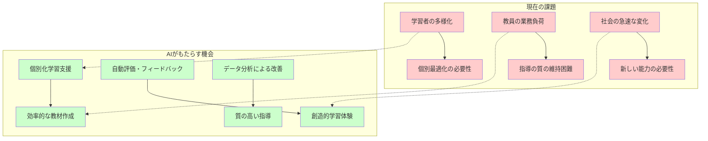
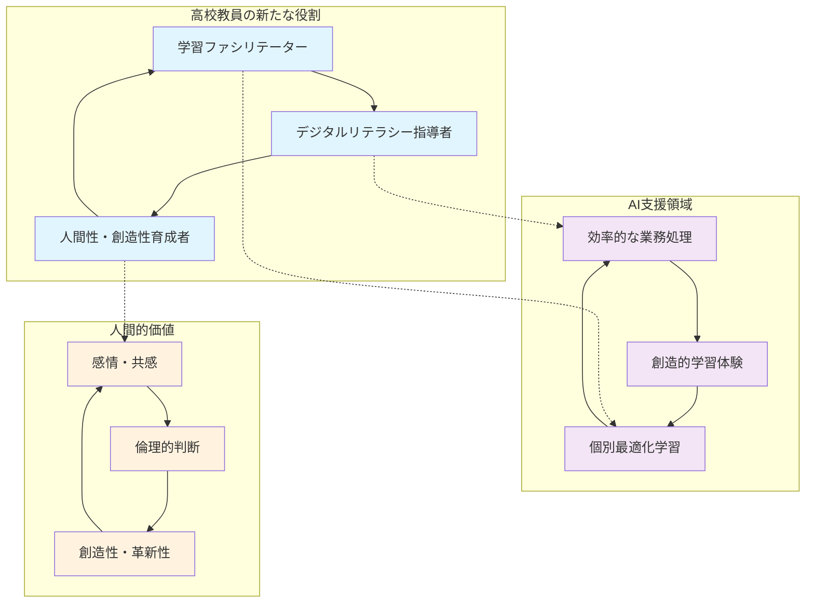

2022年のChatGPT登場以降、生成AI技術は教育現場に革命的な変化をもたらしています。特に高校教育は、大学入試制度改革、新学習指導要領の完全実施、そして18歳成人という社会的変化の中で、従来とは全く異なる教育アプローチが求められています。

**神経科学的背景の重要性**：

近年の神経科学研究により、高校生期（15-18歳）の脳発達とAI技術活用との関係について重要な知見が明らかになっています。この時期は前頭前野の発達が完成に向かう重要な時期であり、認知機能の基盤が確立される極めて重要な発達段階です。

- **前頭前野の発達完成期**: 実行機能、注意制御、作業記憶などの高次認知機能が最終的に完成
- **神経回路の精緻化**: 使用頻度の低い神経結合が除去（pruning）され、効率的な脳構造が確立
- **認知的可塑性の高さ**: 学習環境や経験が脳構造に長期的影響を与える重要な時期

León-Domínguez (2024) のニューロンリサイクリング仮説によると、外部技術への認知的オフローディングは「神経ニッチ」を通じて認知的要求を減少させ、将来世代の認知発達に潜在的な影響を与える可能性があります。

本章では、この神経科学的知見を踏まえながら、現在の高校教育が直面する課題を整理し、生成AIがもたらす可能性と変革の方向性を探ります。

## 1.1 高校教育が直面する現代的課題

### 1.1.1 学習者の多様化と個別最適化の必要性

#### 1.1.1.1 生徒の多様性の拡大

現代の高校生は、これまでにない多様性を示しています。

**学力・能力の多様化**：
- 中学校での基礎学力定着度の格差拡大
- 特別支援を必要とする生徒の増加（約2.9%→約8.8%に増加）
- 外国にルーツを持つ生徒の増加
- ICTスキルの個人差の拡大

**進路・キャリア志向の多様化**：
- 大学進学率の頭打ちと多様な進路選択
- 就職・専門学校進学者への対応
- 起業・フリーランス志向の増加
- 国際的キャリア志向の高まり

**学習環境・背景の多様化**：
- 経済格差による学習機会の差
- 家庭でのICT環境の格差
- 地域による教育リソースの差
- 新型コロナウイルスによる学習経験の差

#### 1.1.1.2 従来の一斉授業の限界

この多様性に対して、従来の一斉授業形式では十分な対応ができないという課題が浮き彫りになっています。

**共通の課題**：
- 習熟度別指導の困難さ
- 個別フィードバックの時間的制約
- 生徒の興味・関心に応じた学習内容の提供の難しさ
- 自主的・主体的学習態度の育成の困難



### 1.1.2 新学習指導要領への対応課題

#### 1.1.2.1 「主体的・対話的で深い学び」の実現

2022年度から実施されている新学習指導要領では、従来の知識詰め込み型から、生徒が主体的に学習に取り組む姿勢の育成が重視されています。

**求められる学習の姿**：
- **主体的な学び**: 自ら課題を見つけ、解決に取り組む力
- **対話的な学び**: 他者との協働を通じて理解を深める力  
- **深い学び**: 知識を関連付け、活用する力

**実現に向けた課題**：
- 教員の指導方法の転換の必要性
- 評価方法の抜本的見直し
- ICT環境の整備と活用
- 時間的制約の中での実現方法

#### 1.1.2.2 探究学習・課題研究の充実

「総合的な探究の時間」の必修化により、生徒の探究的な学習能力の育成が必須となりました。

**探究学習の特徴**：
- 生徒自身による課題設定
- 多角的・多面的な情報収集・分析
- 論理的思考と創造的発想の統合
- 成果の効果的なプレゼンテーション

**指導上の困難**：
- 適切な課題設定への指導
- 情報リテラシー教育の必要性
- 個別指導の時間確保
- 評価基準の設定と運用

### 1.1.3 大学入試制度改革の影響

#### 1.1.3.1 新しい入試制度への対応

大学入学共通テストの導入や各大学の入試改革により、高校教育に求められる能力が大きく変化しています。

**新しい評価の観点**：
- **知識・技能**: 基礎的な知識の確実な習得
- **思考力・判断力・表現力**: 知識を活用した問題解決
- **主体性・多様性・協働性**: 他者との協働による学習

**高校教育への影響**：
- 暗記中心から思考力重視への転換
- 記述式問題への対応強化
- 多面的・総合的評価の導入
- ポートフォリオ活用の推進

#### 1.1.3.2 大学教育との接続強化

高大接続改革により、高校教育と大学教育の連携強化が求められています。

**接続強化の方向性**：
- 高校での学習成果の大学での活用
- 大学教員との連携授業
- 大学レベルの探究活動への参加
- 早期からのキャリア教育

### 1.1.4 教員の業務負荷と専門性向上の課題

#### 1.1.4.1 増大する業務負荷

現代の高校教員は、従来の教科指導に加えて多様な業務を担当する必要があります。

**主要な業務項目**：
- **教科指導**: 授業準備・実施・評価
- **生徒指導**: 生活指導・進路指導・カウンセリング
- **学校運営**: 委員会活動・行事運営・保護者対応
- **研修・研究**: 授業改善・教材研究・自己研鑽

**業務負荷増大の要因**：
- ICT活用に関する研修・準備
- 個別指導の必要性増大
- 保護者・地域からの期待増大
- 働き方改革への対応

#### 1.1.4.2 専門性向上の必要性

AI時代における教員の役割変化に伴い、新たな専門性の習得が必要となっています。

**求められる新しい専門性**：
- **ICTリテラシー**: デジタル技術の教育活用
- **ファシリテーション能力**: 生徒の主体的学習の支援
- **カリキュラム・マネジメント**: 教科横断的な学習設計
- **データ分析能力**: 学習データの活用と改善

## 1.2 生成AIが教育にもたらす変革の可胍性

### 1.2.1 個別最適化学習の実現

#### 1.2.1.1 AI支援による学習の個別化

生成AIは、これまで困難だった大規模な個別最適化学習を現実的に実現する可能性を秘めています。

**個別最適化学習の神経科学的基盤**：

Kosmyna et al. (2025) の研究では、54名を対象とした4ヶ月間のEEG脳波測定実験により、以下の重要な知見が得られています。

- **学習方法による脳活動パターンの違い**: LLM使用者は検索エンジンユーザーや自力学習者と比較して、神経・言語・行動レベルで一貫して異なるパターンを示す
- **記憶・引用能力への影響**: LLMユーザーは自分の執筆内容の記憶や引用が困難になる傾向
- **脳内接続パターンの弱化**: LLMに依存した学習では、脳内ネットワークの結合強度が低下

これらの研究結果は、AI支援学習の設計において、単なる効率化ではなく、**脳の健全な発達を促進する**個別化アプローチの重要性を示しています。

**個別化の具体的手法**：

#### 1. 適応的学習コンテンツの生成
```
例：数学の二次関数学習での個別化
- 基礎的理解が不足している生徒
  → 一次関数の復習から段階的に導入
- 発展的内容を求める生徒  
  → 最大・最小問題の応用課題を提供
- 視覚的理解を好む生徒
  → グラフを重視した解説を生成
```

#### 2. 学習進度の最適化
- 生徒の理解度に応じた学習ペース調整
- 苦手分野の集中的サポート
- 得意分野での発展的学習機会の提供

#### 3. 多様な学習スタイルへの対応
- 視覚型・聴覚型・体験型学習者への対応
- 文系・理系思考の違いに応じた説明方法
- 文化的背景の違いを考慮した事例選択

#### 1.2.1.2 学習支援システムの高度化

**AI活用による支援システム**：

#### リアルタイム学習支援
- 質問への即座の回答・ヒント提供
- 学習過程での適切なフィードバック
- 誤解や理解不足の早期発見・対応

#### 学習履歴の分析と活用
- 個人の学習パターンの分析
- 効果的な学習方法の提案
- 将来の学習課題の予測

### 1.2.2 創造的な学習体験の拡大

#### 1.2.2.1 プロジェクト型学習の支援

生成AIは、従来困難だった高度なプロジェクト型学習を支援する強力なツールとなります。

**具体的な支援内容**：

#### 1. 課題設定の支援
- 生徒の興味・関心に基づく適切な課題の提案
- 実現可能性と教育的価値のバランス調整
- 社会的意義のある課題の発見支援

#### 2. 研究プロセスの指導
- 情報収集・整理方法の具体的アドバイス
- 分析手法の選択と実施支援
- 論理的な結論導出の支援

#### 3. 成果発表の改善
- 効果的なプレゼンテーション構成の提案
- 視覚的資料作成の支援
- 質疑応答への準備支援

#### 1.2.2.2 創造性育成の新手法

**AI活用による創造性育成**：

#### アイデア創出の支援
- ブレインストーミングの促進
- 異分野からの発想転換支援
- 創造的思考プロセスの可視化

#### 表現方法の多様化
- 文章・図表・動画など多様な表現形式
- 生徒の得意分野を活かした表現支援
- 国際的な発信への対応

### 1.2.3 教員の専門性向上と業務効率化

#### 1.2.3.1 教育活動の質的向上

生成AIは、教員の本来の専門性をより発揮できる環境を提供します。

**専門性向上の領域**：

#### 1. 授業設計・改善
- データに基づく授業効果の分析
- 個別ニーズに応じた指導計画の最適化
- 創造的な教材・活動の開発

#### 2. 生徒理解の深化
- 多角的な生徒分析による理解促進
- 個別の成長パターンの把握
- 適切な支援方法の選択

#### 3. 評価・フィードバックの精緻化
- 多面的・継続的な評価の実施
- 個別に最適化されたフィードバックの提供
- 成長の可視化と動機づけ

#### 1.2.3.2 業務効率化による時間創出

**AI活用による効率化の例**：

#### 事務的業務の自動化
```
例：定期テスト関連業務
従来：問題作成→印刷→採点→集計→分析（5-6時間）
AI活用：問題自動生成→自動採点→データ分析（1-2時間）
→ 創出された時間を生徒との対話や授業改善に活用
```

#### 教材作成の効率化
- 学習目標に応じた教材の自動生成
- 既存教材の個別化・多様化
- 多言語対応教材の作成

#### 保護者対応の改善
- 個別の学習状況レポートの自動生成
- 面談前の情報整理・分析
- 効果的なコミュニケーション内容の提案

## 1.3 高校教員に求められる新たな役割

### 1.3.1 学習ファシリテーターとしての機能強化

#### 1.3.1.1 従来の「教える」から「支援する」への転換

AI時代の教員は、知識の伝達者から学習の支援者・促進者への役割転換が必要です。

**新しい教員の役割**：

#### 1. 学習環境デザイナー
- 生徒の主体的学習を促進する環境設計
- AI活用と人間的関わりの最適な組み合わせ
- 安全で創造的な学習空間の構築

#### 2. 学習コーチ・メンター
- 個別の学習目標設定の支援
- 学習プロセスでの適切な介入とサポート
- 困難克服への精神的支援

#### 3. 批判的思考力育成の専門家
- 情報の真偽判断能力の指導
- 多角的・論理的思考の促進
- AI生成内容の適切な評価能力の育成

#### 1.3.1.2 メタ認知能力の育成支援

**メタ認知能力とは**：
自分の学習プロセスを客観視し、効果的な学習方法を選択・調整する能力

**メタ認知の神経科学的基盤**：

前頭前野（特に前頭前皮質）は、メタ認知機能の中核を担う脳領域です。高校生期（15-18歳）はこの領域の発達が完成に向かう重要な時期であり、適切な刺激と訓練により、メタ認知能力の基盤を確立できます。

Gerlich (2025) の666名を対象とした研究では、AI利用頻度と批判的思考能力（メタ認知の重要な要素）に強い負の相関（r = -0.68）が確認されており、AI依存がメタ認知能力の発達を阻害する可能性が示されています。

**AIチャットボット誘発性認知萎縮（AICICA）**：
Dergaa et al. (2024) により提唱された概念で、過度なAI依存により以下の認知機能の萎縮が生じる可能性が指摘されています。
- 自己調整学習能力の低下
- 問題解決過程の外部依存
- 批判的思考プロセスの簡素化

**具体的な指導内容**：
- 学習計画の立案・修正方法（前頭前野の実行機能強化）
- 自己評価・省察の習慣化（メタ認知的知識の蓄積）
- 効果的な学習方法の発見・活用（メタ認知的方略の習得）
- 学習成果の自己分析・改善（メタ認知的経験の活用）

### 1.3.2 デジタルリテラシー指導の責任

#### 1.3.2.1 21世紀型スキルの育成

高校教員は、生徒が社会で活躍するために必要なデジタルリテラシーを育成する責任を担います。

**主要なデジタルリテラシー**：

#### 1. 情報リテラシー
- 情報の収集・整理・分析・活用能力
- 情報の信頼性・妥当性の判断
- 著作権・知的財産権の理解
- プライバシー保護の意識

#### 2. メディアリテラシー
- 多様なメディアの特性理解
- 批判的なメディア消費能力
- 効果的な情報発信技術
- デジタル・シチズンシップの育成

#### 3. AI・データリテラシー
- AI技術の基本的理解
- データ分析・解釈の基礎能力
- AI活用の適切な判断力
- AI生成コンテンツの評価能力

#### 1.3.2.2 情報倫理・デジタル市民権の指導

**重要な指導内容**：

#### サイバーセキュリティ意識
- 個人情報保護の重要性
- 安全なインターネット利用方法
- サイバー攻撃への対策
- デジタル足跡の管理

#### デジタル市民としての責任
- オンラインコミュニケーションのマナー
- フェイクニュース・偽情報への対応
- 他者の権利尊重
- 建設的なデジタル社会への参加

### 1.3.3 人間性・創造性重視の教育

#### 1.3.3.1 AI では代替不可能な人間的価値の育成

AI技術が高度化する中で、人間ならではの価値を育成することが教員の重要な役割となります。

**人間的価値の具体例**：

#### 1. 感情・共感能力
- 他者への共感・理解力
- 感情の適切な表現・調整
- 人間関係構築能力
- 協働・チームワークスキル

#### 2. 倫理的判断力
- 道徳的・倫理的思考力
- 社会的責任感
- 公正性・正義感
- 多様性・包摂性の理解

#### 3. 創造性・革新性
- 独創的なアイデアの創出
- 既存の枠を超えた発想
- 芸術的感性・美的感覚
- 問題解決における創造性

**創造性の神経科学的基盤**：

創造性は主に以下の脳領域の協働により実現されます。
- **デフォルトモード・ネットワーク（DMN）**: 自由な発想・アイデア生成を担当
- **実行制御ネットワーク**: アイデアの評価・選択を担当
- **顕著性ネットワーク**: 両ネットワーク間の切り替えを調整

Abbas et al. (2024) の研究では、ChatGPT使用学生において記憶機能（β=0.274）と学業成績（β=-0.104）の有意な低下が確認されており、これらの認知機能低下は創造的思考に必要な記憶の連想処理にも影響を与える可能性があります。

高校生期の創造性育成においては、AI技術の活用と同時に、これらの脳領域の自然な発達を阻害しない配慮が極めて重要です。

#### 1.3.3.2 文化継承と社会形成への参画

**教育の社会的使命**：

#### 文化的価値の継承
- 言語・文学・芸術の深い理解
- 歴史・伝統文化の継承
- 地域社会との連携
- 国際的視野の育成

#### 社会形成者としての育成
- 民主的社会への参画意識
- 社会課題への関心・行動力
- リーダーシップの発揮
- 持続可能な社会への貢献



この変革の時代において、高校教員は単なる技術の使い手ではなく、AI時代の教育を牽引する専門家として、新たな役割を積極的に担っていく必要があります。

**神経科学的知見を踏まえた教育実践の重要性**：

The Lancet (2025) の医療分野での研究では、AI使用3ヶ月後に専門技能（腺腫検出率）が28%から22%に低下する「AI誘発デスキリング」が初めて文書化されました。この現象は医療分野に限らず、教育分野でも同様のリスクが存在する可能性を示唆しています。

高校生期の脳発達の特殊性を考慮すると、以下の神経科学的配慮が教育実践において極めて重要です。

1. **前頭前野機能の保護**: 実行機能、注意制御、作業記憶などの高次認知機能の健全な発達確保
2. **神経可塑性の活用**: 学習による脳構造変化を促進する適切な刺激環境の提供
3. **認知的オフローディングの制御**: 外部技術への過度な依存による神経発達阻害の予防

次章では、これらの神経科学的知見を基盤として、特に注意すべき「認知負債」の概念について詳しく解説し、安全で効果的なAI活用の基盤を築いていきます。