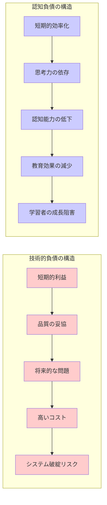
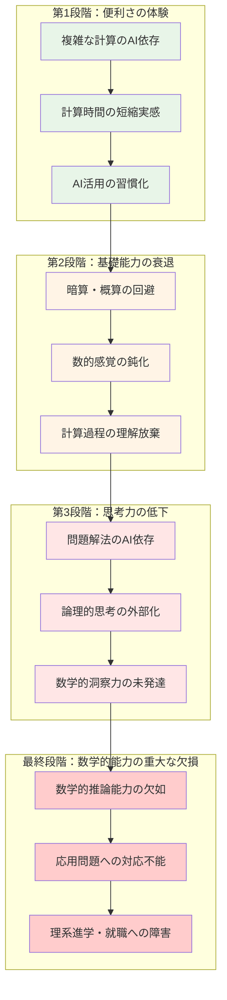
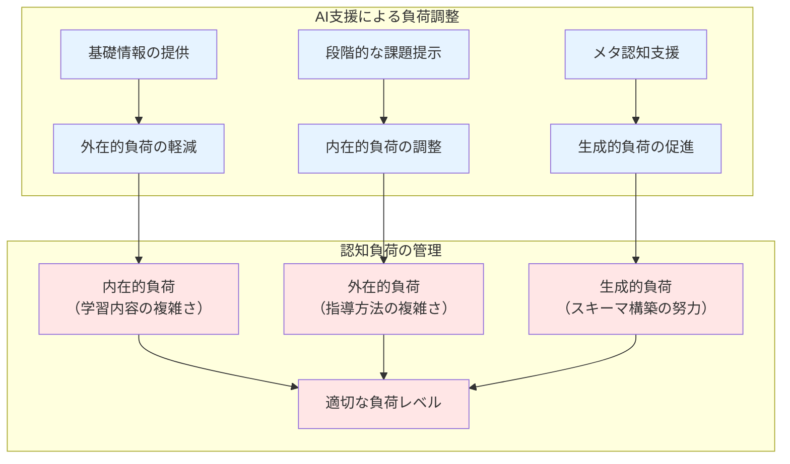

生成AIの教育活用において最も重要でありながら、しばしば見過ごされる概念が**認知負債**です。この概念は、AI活用の光と影を理解し、持続可能で責任ある教育実践を行うための基盤となります。本章では、高校教育の文脈で認知負債がなぜ深刻な問題となるのか、そしてどのように防止できるのかを詳しく解説します。

## 2.1 認知負債とは何か - 基本概念の理解

### 2.1.1 技術的負債から認知負債へ

#### 2.1.1.1 技術的負債の概念

**技術的負債**とは、ソフトウェア開発において、短期的な利益（開発スピード向上、コスト削減）を優先した結果、長期的に維持・改善が困難になる状況を指します。



#### 2.1.1.2 認知負債の定義と実証的証拠

**認知負債**とは、便利なAI技術に過度に依存することで、人間本来の認知能力（思考力、判断力、創造力など）が段階的に低下し、長期的な学習効果や人間的成長が損なわれる現象です。

**最新の実証研究による科学的裏付け**：

**1. 神経科学的証拠（Kosmyna et al., 2025）**
- **研究方法**: 54名を対象とした4ヶ月間のEEG脳波測定実験
- **主要発見**: LLMユーザーは検索エンジンや自力執筆群と比較して最も弱い脳内接続パターンを示した
- **重要な知見**: 神経・言語・行動レベルで一貫して低パフォーマンス、自分の執筆内容の記憶・引用が困難

**2. 批判的思考への負の影響（Gerlich, 2025）**
- **研究方法**: 666名を対象とした混合手法研究、Halpern批判的思考評価使用
- **主要発見**: AI利用頻度と批判的思考能力に強い負の相関（r = -0.68）
- **重要な知見**: 認知的オフローディングがAI使用と批判的思考低下の関係を媒介

**3. 学業成績への直接的影響（Abbas et al., 2024）**
- **研究方法**: 494名の大学生を対象とした三波時間遅延設計
- **主要発見**: ChatGPT使用学生で先延ばし行動（β=0.309）、記憶喪失（β=0.274）が有意に増加、学業成績（CGPA）が低下（β=-0.104）

**4. 専門技能への影響（The Lancet, 2025）**
- **研究方法**: 4医療センターでの縦断的フィールド実験
- **主要発見**: AI使用3ヶ月後、AI支援なしでの腺腫検出率が28%から22%に低下
- **重要な知見**: 臨床実践におけるAI誘発デスキリングの初の文書化された証拠

**5. 神経科学的メカニズム（León-Domínguez, 2024）**
- **理論的枠組み**: ニューロンリサイクリング仮説をAIツールに適用
- **主要概念**: 認知的オフローディングが「神経ニッチ」を通じて認知的要求を減少
- **将来への懸念**: 将来世代の認知発達への3つの仮説を提示

**認知負債の特徴（実証研究により確認）**：
- **段階性**: 徐々に、気づかないうちに進行（4ヶ月にわたる一貫した低下を確認）
- **不可逆性**: 一度失われた能力の回復は困難（神経接続パターンの弱化）
- **累積性**: 小さな依存が積み重なって大きな問題となる（β係数の累積効果）
- **隠蔽性**: 表面的には効率化されているため発見が困難（短期的効果vs長期的影響の乖離）

### 2.1.2 認知負債が高校教育で特に深刻な理由

#### 2.1.2.1 高校生の発達段階の特性

高校生期（15-18歳）は、認知能力の発達において極めて重要な時期です。

**脳科学的観点**：
- **前頭前野の発達**: 論理的思考、計画性、抑制機能の完成期
- **神経回路の精緻化**: 使われない回路の削減（pruning）が進行
- **認知的可塑性**: 学習による脳構造変化の重要な時期
- **メタ認知能力の確立**: 自分の思考を客観視する能力の発達

**教育心理学的観点**：
- **抽象的思考の発達**: 形式的操作期の完成
- **批判的思考力の形成**: 多角的・論理的分析能力の発達
- **創造性の発現**: 独創的なアイデア創出能力の伸長
- **学習方略の確立**: 効果的な学習方法の習得

#### 2.1.2.2 この時期の認知負債のリスク

**永続的影響の可能性**：
高校期に形成された思考パターンや学習習慣は、その後の人生に長期的な影響を与えます。

**具体的なリスク例**：

#### 1. 基礎的認知能力の未発達
```
例：数学学習における認知負債
- AI依存：複雑な計算を全てAIに任せる
- 短期的効果：計算時間の短縮、正答率の向上
- 長期的影響：数的感覚の未発達、概算能力の欠如
- 深刻な結果：大学数学・理系科目への適応困難
```

#### 2. 言語能力の発達阻害
```
例：国語・英語学習における認知負債
- AI依存：文章作成・翻訳を全面的にAIに依存
- 短期的効果：高品質な文章の迅速な作成
- 長期的影響：語彙力・表現力・文法理解の停滞
- 深刻な結果：大学での論文作成能力の不足
```

#### 3. 創造的思考力の萎縮
```
例：探究学習における認知負債
- AI依存：課題設定から結論まで全てAI提案に従う
- 短期的効果：効率的な探究活動の完成
- 長期的影響：独創性・批判的思考力の未発達
- 深刻な結果：社会人として求められる問題解決能力の欠如
```

## 2.2 高校教育における認知負債の具体例

### 2.2.1 教科別にみる認知負債のパターン

#### 2.2.1.1 国語科での認知負債

#### 読解能力への影響

読解能力は、文章から情報を正確に読み取り、筆者の意図を理解し、内容を批判的に検討する総合的な言語能力です。高校生期は、複雑な論説文や文学作品を読解する高度な読解力を獲得する重要な時期であり、この時期のAI過依存は、生涯にわたる読解能力の発達に深刻な影響を与える可能性があります。

**問題のある活用例**：
```
シナリオ：現代文読解でのAI活用
× 悪い例：
  1. 文章の要約を全てAIに依存
  2. 文学作品の解釈をAI分析のみに頼る
  3. 小論文の構成・論理展開をAI生成に任せる

結果として生じる認知負債：
- 文章の論理構造を把握する能力の未発達
- 文学的感性・美的感覚の未熟
- 自分の言葉で表現する能力の低下
- 批判的読解力の欠如
```

**健全な活用例**：
```
○ 良い例：
  1. 自分なりの読解→AI分析との比較→差異の分析
  2. 複数の解釈可能性をAIと議論→多角的理解の深化
  3. 論文構成案作成後、AIからの改善提案を検討

認知能力への正の影響：
- メタ読解能力の向上
- 多様な視点の習得
- 論理的思考力の強化
```

#### 表現・作文能力への影響

表現・作文能力は、自分の思考や感情を言語化し、読み手に効果的に伝える能力です。この能力は単なる文章技術ではなく、思考を整理し、論理的に構成し、独自の視点を表現する総合的な知的活動です。AIへの過度な依存は、この創造的プロセスを外部化し、生徒自身の言語表現力の発達を根本的に阻害する危険性があります。

**段階的な能力低下のプロセス**：

以下の4段階は、一見便利なAI支援から始まり、最終的に自力での文章作成が困難になるまでの典型的な認知負債の蓄積過程を示しています。各段階は徐々に進行し、生徒自身も教員も気づきにくいという特徴があります。

1. **第1段階**: AIによる文章校正への依存
   - 誤字脱字の自動修正に慣れる
   - 文法チェック機能への依存

2. **第2段階**: 文章構成のAI依存
   - 段落構成をAIに委ねる
   - 論理展開の組み立てを放棄

3. **第3段階**: 内容生成のAI依存
   - アイデア創出をAIに頼る
   - 自分の考えを言語化する努力の放棄

4. **最終段階**: 表現能力の著しい低下
   - 自分の言葉で文章を書けない
   - 創造的・独創的な表現の不可能

#### 2.2.1.2 数学科での認知負債

#### 計算能力・数的感覚への影響

計算能力と数的感覚は、数学的思考の基盤となる能力です。これらは単に答えを導き出す技術ではなく、数の関係性を直感的に理解し、問題の構造を把握し、解法の妥当性を判断する総合的な認知能力です。高校数学における概念理解や論理的思考の発達は、これらの基礎能力の上に築かれるため、AI計算への過度な依存は数学的思考力全体の発達を妨げる可能性があります。

**認知負債の進行プロセス**：



**具体的な影響例**：

#### 代数・解析分野
```
認知負債の例：二次方程式の解法
× 問題のある依存：
  - 解の公式の暗記を放棄（AIが計算するから不要と判断）
  - 因数分解の手順をAIに全て委ねる
  - グラフの概形を描かずにAI生成グラフのみ使用

長期的影響：
  - 関数の性質への理解不足
  - 数式の意味の理解不足
  - 高次方程式・微積分への適応困難
```

#### 幾何分野
```
認知負債の例：図形の性質・証明
× 問題のある依存：
  - 図形の作図をCADソフト任せ
  - 証明の手順をAI生成に依存
  - 空間認識を3Dモデル表示のみに頼る

長期的影響：
  - 空間認識能力の未発達
  - 論理的証明能力の欠如
  - 工学・建築分野への適応困難
```

#### 2.2.1.3 英語科での認知負債

英語学習における認知負債は、言語習得の本質的なプロセスを阻害する深刻な問題です。第二言語習得は、音韻・文法・語彙・文化的理解を統合的に内在化する複雑な認知プロセスであり、AI翻訳への過度な依存は、このプロセスを短絡化し、真の言語運用能力の発達を妨げます。特に高校期は、実践的な英語コミュニケーション能力を確立する重要な時期であり、この時期の認知負債は将来の国際的活動能力に長期的な影響を与える可能性があります。

#### 4技能への複合的影響
**聞く（Listening）能力への影響**：
- 自動字幕・翻訳への過度の依存
- 英語音韻の識別能力の未発達
- 文脈理解力の低下

**話す（Speaking）能力への影響**：
- 発音矯正AIへの依存による自然な音韻習得の阻害
- リアルタイム翻訳ツールによる英語思考力の未発達
- コミュニケーション意欲の減退

**読む（Reading）能力への影響**：
```
段階的な能力低下：
1. 単語・熟語の自動翻訳依存
   → 語彙力の蓄積停止
2. 文法構造分析のAI依存
   → 文法理解力の未発達
3. 文章全体の自動翻訳依存
   → 英語的思考力の未形成
4. 文学作品の解釈AI依存
   → 文化的理解・感性の未発達
```

**書く（Writing）能力への影響**：
- 文法チェック機能への過度の依存
- 自動翻訳による日本語思考からの脱却不能
- 英語ライティングの論理構造習得の阻害

#### 2.2.1.4 理科での認知負債

理科教育における認知負債は、科学的探究プロセスの本質を損なう重大な問題です。科学的思考力は、観察・仮説設定・実験・検証という一連のプロセスを通じて育成される総合的な認知能力であり、AI依存はこの探究的学習の機会を奪います。高校理科では、自然現象への好奇心を持ち、データから法則を見出し、批判的に検証する能力を養う重要な時期であり、この時期の認知負債は将来の科学的リテラシーや研究能力に深刻な影響を与える可能性があります。

#### 科学的思考力への影響
**実験・観察能力の低下**：
```
認知負債の進行：
1. データ収集の自動化依存
   → 観察力・洞察力の未発達
2. データ分析のAI依存
   → 科学的推論力の欠如
3. 仮説設定のAI提案依存
   → 創造的思考力の萎縮
4. 結論導出のAI依存
   → 論理的思考力の未形成
```

**概念理解への影響**：
- 物理現象の数値計算AI依存による本質理解の不足
- 化学反応式の自動バランシング依存による化学的思考の未発達
- 生物学的データ分析AI依存による生命現象理解の表面化

#### 2.2.1.5 社会科での認知負債

社会科における認知負債は、民主主義社会の市民として必要な批判的思考力と判断力の発達を阻害する極めて深刻な問題です。社会科教育の本質は、複雑な社会現象を多角的に分析し、様々な価値観や立場を理解し、根拠に基づいて自分の意見を形成する能力の育成にあります。AI依存による情報処理の外部化は、この主体的な思考プロセスを奪い、情報に流されやすい受動的な市民を生み出すリスクがあります。

#### 批判的思考力への深刻な影響
**情報分析能力の低下**：
```
現代社会での認知負債例：
問題：複雑な社会問題（例：地球温暖化対策）の分析

× AI過依存パターン：
1. 情報収集をAI検索のみに依存
2. 多角的分析をAIまとめに依存
3. 自分の意見形成をAI提案に依存
4. 反対意見への反駁をAI生成に依存

結果：
- 情報の信頼性判断能力の欠如
- 多面的・立体的思考力の未発達
- 主体的な価値判断能力の不足
- 民主的討議能力の欠如
```

**歴史的思考力への影響**：
- 史料批判能力の未発達
- 歴史的文脈理解の表面化
- 因果関係分析力の低下
- 現代への教訓抽出能力の欠如

## 2.3 認知負債防止の基本原則

### 2.3.1 意図的・計画的なAI活用

認知負債を防ぐための最も重要な原則は、AIを「なんとなく」「便利だから」という理由で使用するのではなく、明確な教育的意図と計画に基づいて活用することです。意図的・計画的なAI活用とは、教育目標を達成するための手段としてAIを位置づけ、その使用時期・方法・評価を事前に設計し、生徒の認知能力への影響を常に監視しながら実践することを意味します。

#### 2.3.1.1 目的の明確化原則

AI活用の前に、必ず以下を明確にする必要があります。

**必須確認事項**：
1. **教育目標**: 何を身につけさせたいのか
2. **AI活用の理由**: なぜAIを使う必要があるのか
3. **期待する効果**: どのような改善を期待するか
4. **評価基準**: 成功をどう判断するか
5. **リスク評価**: どのような負の影響が考えられるか

**実践例：英語ライティング指導**
```
○ 適切な目的設定：
目標：生徒の英語表現力向上
AI活用理由：文法・語彙の基礎固めの効率化
期待効果：基礎力定着により創造的表現に時間を割ける
評価基準：自力での英作文能力の向上
リスク評価：AI依存による独創性の低下に注意

具体的実践：
1. まず生徒が自力で英作文
2. AIで文法・語彙をチェック
3. AI提案と自分の表現を比較分析
4. 最終的に自分の言葉で再構成
```

#### 2.3.1.2 段階的導入原則

**4段階導入モデル**：

この段階的導入モデルは、生徒の認知能力を保護しながらAIの教育的価値を最大化するための体系的アプローチです。各段階は、前段階で確立された能力を基盤として次の段階へ進むよう設計されており、最終段階では生徒がAI支援なしでも自立的に課題解決できることを確認します。このモデルにより、AI活用の恩恵を享受しつつ、認知負債のリスクを最小限に抑えることが可能となります。

#### 第1段階：基礎習得期（AI使用なし）
```
目的：基本的な思考プロセスの確立
期間：単元の30-40%
内容例（数学・二次関数）：
- 手計算による関数値の計算
- 手描きによるグラフの作成
- 基本的な性質の発見・理解
重点：基礎的な数的感覚・概念理解の確立
```

#### 第2段階：支援活用期（限定的AI使用）
```
目的：AI支援による理解の深化
期間：単元の30-40%
内容例：
- 複雑な計算のAI支援（過程は自分で追跡）
- AIグラフと手描きグラフの比較検証
- AI解法と自分の解法の比較分析
重点：AIを活用した効率化と理解深化の両立
```

#### 第3段階：創造活用期（積極的AI活用）
```
目的：AI活用による創造的学習
期間：単元の20-30%
内容例：
- AI支援による応用問題の探究
- 新しい問題設定とAI解法の検証
- 実社会問題への数学的アプローチ
重点：AIとの協働による創造的問題解決
```

#### 第4段階：自立確認期（AI使用なし）
```
目的：習得した能力の自立的発揮確認
期間：単元の10-20%
内容例：
- AIなしでの総合的な問題解決
- 学習成果の自己評価・省察
- 次の学習への展望設定
重点：認知負債の有無確認と自立性の確保
```

### 2.3.2 人間主導の学習プロセス維持

学習の本質は、人間が主体的に知識を構築し、理解を深め、能力を発達させるプロセスにあります。AIは強力な支援ツールですが、学習の主体はあくまで生徒自身でなければなりません。人間主導の学習プロセスを維持することは、生徒の思考力・判断力・創造性を保護し、真の学力形成を実現するための不可欠な条件です。AIに学習プロセスを委ねることは、表面的な効率化と引き換えに、深い理解と自立的学習能力を失うことを意味します。

#### 2.3.2.1 主体性確保の原則

**AIはツール、人間が主役**の原則を徹底します。

#### 意思決定の主体性維持
```
× AI主導パターン（認知負債リスク大）：
1. AIが学習計画を立案
2. AI提案の学習方法をそのまま採用
3. AI評価をそのまま受け入れ
4. AI提示の課題設定をそのまま使用

○ 人間主導パターン（認知負債リスク小）：
1. 自分で学習目標・計画を設定
2. 複数の学習方法を比較検討してAI提案も参考
3. AI評価と自己評価・他者評価を総合判断
4. 自分の興味・関心に基づく課題設定にAI支援を活用
```

#### 思考プロセスの可視化
**メタ認知の促進**：
生徒が自分の思考プロセスを意識化できるよう支援します。

**実践的手法**：
```
思考プロセス記録シート例：

1. 問題理解段階
   - 自分の理解：________________
   - AI分析との比較：____________
   - 気づいた違い：______________

2. 解決方法検討段階
   - 自分のアプローチ：__________
   - AI提案の方法：______________
   - 採用する方法とその理由：____

3. 実行・検証段階
   - 実行結果：__________________
   - AI予測との比較：____________
   - 改善点：____________________

4. 振り返り段階
   - 学んだこと：________________
   - 次回への改善：______________
```

#### 2.3.2.2 創造性・批判性の積極的育成

創造性と批判的思考力は、AI時代において人間が保持すべき最も重要な能力です。これらの能力は、既存の知識を組み合わせて新しい価値を生み出し、情報の真偽を見極め、独自の視点から問題を解決する力の源泉となります。AIを活用しながらも、これらの能力を積極的に育成することは、生徒がAIを道具として使いこなし、AIには生み出せない独創的な価値を創造できる人材となるための必須条件です。

#### 独創的思考の促進

独創的思考とは、既存の枠組みにとらわれず、新しい視点やアイデアを生み出す能力です。AIは既存データの組み合わせは得意ですが、真に独創的な発想は人間の特権です。AIを触媒として活用しながら、生徒自身の独創性を引き出し、AIが提示する以上の創造的価値を生み出す力を育成することが重要です。

**AI提案を出発点とした創造的発展**：

```
創造性育成のプロセス例（美術科での実践）：

1. 個人の発想段階
   - まず自分でアイデアスケッチを3案作成
   - 各案の独自性・表現意図を言語化

2. AI対話段階
   - 自分のアイデアをAIに説明・相談
   - AI提案を複数獲得（5-10案）

3. 批判的検討段階
   - AI案の長所・短所を分析
   - 自分の案との組み合わせ可能性を検討
   - 独創性の観点からAI案を評価

4. 統合・発展段階
   - 最も魅力的な要素を統合
   - 完全にオリジナルな第4の案を創出
   - AI提案を超越する表現の追求
```

#### 批判的思考力の強化

批判的思考力は、情報を鵜呑みにせず、論理的・多角的に検証し、根拠に基づいて判断する能力です。AI時代においては、大量の情報が瞬時に生成される中で、その真偽や妥当性を見極める力がより重要になります。AIが提示する情報や分析を批判的に検討し、自分自身で思考・判断できる力を育成することは、情報に振り回されない自立した市民を育てるために不可欠です。

**情報の真偽判断能力の育成**：

```
批判的思考力育成のプロセス（社会科での実践）：

1. 情報収集段階
   - 複数の情報源（AI含む）から情報収集
   - 各情報源の特性・信頼性を記録

2. 情報分析段階
   - 情報の一致点・相違点を整理
   - AI情報の根拠・論理性を検証
   - バイアスや偏見の可能性を検討

3. 判断形成段階
   - 複数の判断軸を設定
   - AI判断と自己判断を比較
   - 最終的な自己判断とその根拠を明確化

4. 議論・検証段階
   - 他者（クラスメート）との議論
   - 自己判断の妥当性を検証
   - 必要に応じて判断を修正・発展
```

### 2.3.3 バランスの取れたAI活用戦略

#### 2.3.3.1 効率化と深い学習の両立

効率化と深い学習の両立は、AI活用における最も重要な課題の一つです。AIは学習の効率を大幅に向上させる可能性を持つ一方で、安易な効率化は表面的な理解に留まり、深い学習を阻害するリスクがあります。真のAI活用とは、時間的効率を追求しつつも、認知的な深さと理解の質を維持・向上させることです。このバランスを実現するためには、学習時間の戦略的配分と認知負荷の適切な管理が不可欠です。

#### 時間配分の最適化

学習時間の戦略的配分は、認知負債を防ぎながらAIの恩恵を最大化するための重要な手法です。以下の50-30-20ルールは、基礎能力の確立を最優先としつつ、AI支援による効率化と創造的発展をバランスよく実現するための実証的な配分モデルです。この配分により、生徒は自立的学習能力を保持しながら、AIを効果的に活用できるようになります。

**50-30-20ルール**（推奨配分）：

```
学習時間の配分例：

1. 基礎・自力学習（50%）
   - AI使用なしでの基本的な学習
   - 基礎的な思考プロセスの確立
   - 基本的な技能の習得・定着

2. AI支援学習（30%）
   - AIとの対話・協働による理解深化
   - 効率的な反復練習・確認
   - 個別化された学習支援

3. 創造・応用学習（20%）
   - AI活用による創造的探究
   - 実社会問題への応用
   - 新しい知識・技能の統合
```

#### 認知負荷の適切な管理

認知負荷理論は、人間の情報処理能力の限界を理解し、効果的な学習を実現するための重要な理論的枠組みです。AI活用においては、AIが認知負荷をどのように軽減・調整するかを慎重に設計する必要があります。適切な認知負荷管理により、生徒の作業記憶の負担を軽減しつつ、深い理解とスキーマ構築を促進することが可能となります。重要なのは、負荷を完全に取り除くのではなく、学習に必要な生成的負荷は維持することです。

**認知負荷理論に基づくAI活用**：



#### 2.3.3.2 短期的成果と長期的成長の調和

AI活用教育における最大の課題の一つは、目に見える短期的成果と真の長期的成長をいかに調和させるかです。AIは即座に成果を示すため、短期的な効果に注目しがちですが、認知負債は長期的に蓄積される問題です。教育の真の価値は生徒の生涯にわたる学習能力と人間的成長にあるため、短期的な効率化を追求しつつも、長期的な視点を失わないバランスが重要です。

#### 評価の多元化

効果的なAI活用のためには、多様な観点からの評価が不可欠です。短期的な学習効率や成績向上だけでなく、長期的な思考力や自立性の発達を総合的に評価することで、真の教育効果を把握できます。この多元的評価により、認知負債の早期発見と適切な介入が可能となり、AI活用の質的改善につながります。

**即時的効果と長期的効果の両方を評価**：

**短期的評価指標**：
- 学習効率の向上（時間短縮、正答率向上）
- 学習意欲・関心の向上
- 基本的な理解度の向上

**長期的評価指標**：
- 自立的な問題解決能力
- 創造的・批判的思考力
- メタ認知能力の発達
- 学習方略の習得

**評価方法の具体例**：
```
数学科での評価例：

短期的評価（毎時間・毎単元）：
□ 基本問題の正答率
□ 計算スピード
□ 学習への積極性
□ AI活用の適切性

長期的評価（学期・学年単位）：
□ AI支援なしでの問題解決能力
□ 新しい問題への適応力
□ 数学的な推論・説明能力
□ 自己調整学習能力

評価ツール：
- 定期的な「AI使用禁止」テスト
- ポートフォリオによる成長記録
- 自己評価・相互評価の活用
- メタ認知インタビューの実施
```

#### 継続的なモニタリング体制

認知負債は徐々に蓄積される性質があり、生徒や教員が気づいた時には深刻な状態になっている場合があります。そのため、定期的で体系的なモニタリング体制の構築が不可欠です。早期発見・早期介入により、認知負債の進行を防ぎ、健全なAI活用を維持することができます。このモニタリング体制は、客観的な指標と主観的な観察を組み合わせ、多角的に生徒の認知状態を把握することを目的とします。

**認知負債早期発見システム**：

```
月次チェックポイント：

□ 基礎的な計算・記憶能力の維持
□ 自分の言葉での説明能力
□ 困難な問題への粘り強さ
□ 独創的なアイデアの創出
□ AI出力への批判的検討

警告サインの例：
× AI なしでは何もできない
× AI 提案をそのまま受け入れる
× 自分で考えることを面倒がる
× 困難を避けてAI解決を求める
× 創造的な発想が出てこない

対応策：
1. 一時的なAI使用制限
2. 基礎的な能力の再訓練
3. 段階的な自立性回復プログラム
4. 個別相談・指導の実施
```

認知負債の概念と防止原則を理解することで、AI活用の真の価値を実現できます。次章では、これらの原則を具体的な教育実践に適用するための教育理論的基盤について詳しく解説します。