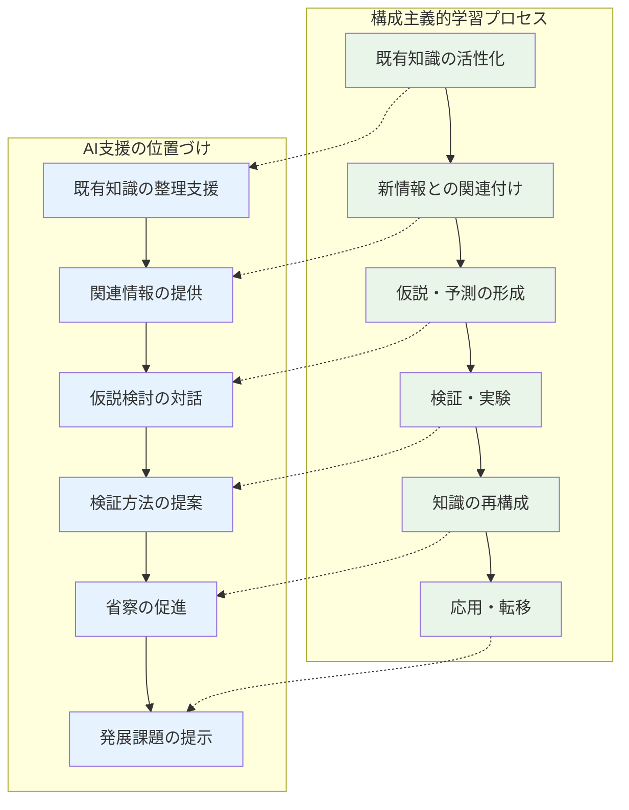

前章で認知負債の概念と防止原則を学んだ今、私たちは具体的なAI活用の実践に向けて、確固たる理論的基盤を構築する必要があります。本章では、高校教育に関わる主要な学習理論を基盤として、生成AIを安全かつ効果的に活用するための体系的な枠組みを確立します。

**重要な前提**: 高校教員の皆さんは、それぞれ異なる教科専門性、経験年数、技術習熟度、教育観を持っています。本書を執筆するにあたり、ペルソナ分析を行い、教員の多様性は少なくとも20パターン以上に分類され、それぞれが**独自のAI活用パス**を必要とすることが明らかになりました。本章の理論は、この多様性を前提に、各教員が自分の状況に応じて選択・適用できる柔軟な枠組みとして提示します。画一的な導入ではなく、個別最適化されたAI活用を目指します。

## 3.1 学習理論とAI活用の統合

高校教育におけるAI活用を成功させるためには、確固たる教育理論的基盤が不可欠です。本章では、現代の学習科学で重要視される5つの理論的枠組みを取り上げ、それぞれがAI活用にどのような示唆を与えるかを詳しく解説します。

**本章で扱う主要理論**：
1. **構成主義学習理論**: 学習者の能動的な知識構築プロセス
2. **社会的構成主義**: 社会的相互作用を通じた学習
3. **認知負荷理論**: 学習者の認知処理能力への配慮
4. **メタ認知理論**: 学習についての学習
5. **改訂版 Bloom's Taxonomy**: 認知的学習目標の階層的体系

これらの理論は相互に補完し合い、AI活用における教育実践の質を高めるための理論的ガイダンスを提供します。特に、**認知負債の防止**という観点から、各理論がどのような配慮を求めているかに注目しながら読み進めてください。

### 3.1.1 構成主義学習理論とAI支援

#### 3.1.1.1 構成主義の基本原理

**構成主義学習理論**は、学習者が既有知識と新しい情報を関連付けながら、能動的に知識を構成していくプロセスを重視する理論です。高校教育におけるAI活用は、この構成主義の原理に基づいて設計されるべきです。

**構成主義の核心概念**：
- **能動的学習**: 学習者が主体的に学習に参加
- **既有知識の活用**: 過去の経験・知識を基盤とした学習
- **意味構成**: 個人の文脈の中での理解形成
- **社会的相互作用**: 他者との対話を通じた理解深化

**教員タイプ別の構成主義AI活用適合度**：

✅ **高適合**: 創作・表現系教員（現代文・美術・音楽等）
- 生徒の個性的な表現を重視する指導スタイル
- AI支援による創造的探究を積極的に取り入れ可能

✅ **中適合**: 概念重視系教員（数学・理科・技術等）  
- 概念理解プロセスを重視する指導経験
- AI対話を通じた概念構築支援に親和性

△ **要配慮**: 知識伝達系教員（古典・受験指導中心等）
- 効率的な知識伝達を重視する指導経験
- 段階的に構成主義的要素を導入する必要

#### 3.1.1.2 AI活用における構成主義の実現

構成主義学習理論をAI活用で実現するということは、**生徒が受動的に情報を受け取るのではなく、AIとの対話を通じて自ら知識を構築していく**プロセスを支援することです。ここで重要なのは、AIが答えを教えるのではなく、生徒の思考を促し、発見を支援する **「学習パートナー」** として機能することです。

従来の一方向的な教授法では、教師が知識を伝達し、生徒がそれを受容するという図式でした。しかし構成主義では、学習者が既有の知識や経験を基盤として、新しい情報を自分なりに解釈・統合し、個人的な理解を構築していきます。AIはこのプロセスで、適切な質問や示唆を提供し、生徒の思考を深化させる役割を担います。

**問題解決プロセスの支援例（数学科）**：



**具体的実践例**：

#### 二次関数の概念構成（数学I）

この例では、生徒が既に学習した一次関数の知識を基盤として、二次関数の概念を自ら発見・構築していくプロセスを示しています。AIは教師役ではなく、生徒の思考を引き出し、気づきを促進する対話相手として機能します。

```
構成主義的アプローチ：
1. 既有知識の活性化
   生徒：「一次関数 y = ax + b は直線だった」
   AI：「一次関数の特徴をもう少し詳しく教えてください」
   
   【解説】生徒の既有知識を呼び起こし、学習の出発点を明確にします。
   AIは答えを与えるのではなく、生徒に説明させることで理解を確認・整理させます。

2. 新情報との関連付け
   生徒：「y = x² のグラフを描いてみた」
   AI：「一次関数のグラフとどこが違いますか？」
   
   【解説】新しい情報（二次関数）を既知の情報（一次関数）と比較させることで、
   違いを意識化し、新たな概念への気づきを促進します。

3. 仮説形成
   生徒：「曲線になりそう」
   AI：「どんな形の曲線だと予想しますか？理由も含めて説明してください」
   
   【解説】生徒自身に予測・仮説を立てさせることで、主体的な学習態度を育成。
   「理由も含めて」という要求で論理的思考も促進します。

4. 検証・実験
   AI：「いくつかの点を計算して、実際に確かめてみましょう」
   
   【解説】仮説を実際のデータで検証するプロセスを支援。
   計算自体は生徒が行い、AIは方向性を示すに留めます。

5. 知識の再構成
   生徒：「放物線という特別な曲線になった」
   AI：「一次関数との共通点と相違点を整理してみましょう」
   
   【解説】新しい知識（二次関数）を既有知識（一次関数）と統合し、
   より包括的な理解（関数概念）を構築させます。
```

#### 3.1.1.3 認知負債を防ぐ構成主義的配慮

構成主義的なAI活用では、生徒の主体性と思考プロセスを最優先に考える必要があります。AIは「便利な答え提供機」ではなく、「思考を促進するパートナー」として位置づけることが重要です。

**注意すべきポイント**：

#### 1. 主体性の維持

生徒が学習の主体であり、AIはあくまで支援者である関係性を常に保つ必要があります。

```
× 認知負債リスクの高い活用：
- AI が概念説明を完全に代替
  → 生徒は受動的な情報受容者になってしまう
- 生徒の思考プロセスを省略
  → 考える力が育たない
- 結論だけを提示
  → 発見的学習の機会を奪う

○ 構成主義に基づく健全な活用：
- 生徒の既有知識を出発点とする
  → 個人の理解基盤から構築開始
- AI は対話相手として機能
  → 双方向的な学習プロセスの実現
- 生徒自身による意味構成を支援
  → 深い理解と応用力の育成
```

#### 2. 個人的意味の構築促進
```
実践例：古典文学の理解（国語科）
× 避けるべき方法：
  AI による作品解釈の一方的提示
  → 生徒の個人的な読みの体験が失われる

○ 推奨される方法：
  1. 生徒が自分なりに作品を読む
  2. 疑問点・印象をAI と対話
  3. 多様な解釈の可能性を探る
  4. 自分なりの解釈を再構築
```

### 3.1.2 社会的構成主義の視点

社会的構成主義は、学習が社会的相互作用を通じて行われるという理論です。個人の認知発達は、他者との関わりの中で形成されるという立場を取り、高校教育におけるAI活用においても、この社会的側面を重視する必要があります。

**社会的構成主義の核心概念**：
- **社会的相互作用**: 学習は他者との対話・協働を通じて促進される
- **文化的道具**: 言語、記号、技術などが学習を媒介する
- **共同体での学習**: 学習者は学習共同体の一員として成長する
- **状況的学習**: 文脈や状況に埋め込まれた学習の重要性

高校教育でのAI活用では、AIを単なる個別学習ツールとして捉えるのではなく、**社会的学習を促進する媒介ツール**として位置づけることが重要です。AIとの対話を通じて、生徒同士の議論や協働学習が活性化され、より豊かな学習共同体が形成されることを目指します。

#### 3.1.2.1 ヴィゴツキーの発達理論とAI

**ヴィゴツキーの社会文化的理論** は、人間の高次精神機能が社会的相互作用を通じて発達するという考えに基づいています。彼の理論の中核である **最近接発達領域（ZPD: Zone of Proximal Development）** は、高校教育におけるAI活用の理論的基盤として極めて重要です。

**最近接発達領域（ZPD）とは**：
学習者が一人では達成できないが、より有能な他者（教師、先輩、AI）の適切な支援があれば達成可能な課題の範囲を指します。この領域こそが、真の学習と発達が起こる場所であり、AI活用の最適なポイントとなります。

**ZPDの教育的意義**：
- **現在の能力**: 学習者が自力でできること（実際的発達レベル）
- **潜在的能力**: 支援があればできること（潜在的発達レベル）
- **発達の方向性**: 支援を通じて自立に向かう過程（発達の最近接領域）

高校教育では、AIを「より有能な他者」として活用し、生徒のZPD内での学習を支援することで、認知負債を避けながら真の能力向上を実現できます。重要なのは、AIが生徒の代わりに課題を解決するのではなく、生徒が自分で解決できるよう適切な水準の支援を提供することです。

#### 3.1.2.2 AI による足場かけ（Scaffolding）

**足場かけ（Scaffolding）** は、学習者が困難な課題に取り組む際に、一時的で段階的な支援を提供し、最終的にその支援を除去して学習者の自立を促す教育手法です。建物建設時の足場のように、学習プロセスを支える一時的な構造として機能します。

**足場かけの基本原理**：
- **意図性**: 明確な教育目標に基づく計画的支援
- **適切性**: 学習者の現在のレベルに適した支援の水準
- **一時性**: 学習者の能力向上に応じた段階的な支援の削減
- **移行性**: 支援から自立への円滑な移行プロセス

AI活用による足場かけでは、従来の人間による支援では困難だった**個別最適化された支援**が可能になります。AIは学習者一人ひとりの理解度や進捗を継続的に把握し、その時点で最も適切な支援レベルを提供できます。ただし、AIによる足場かけでも、最終目標は生徒の自立した学習能力の育成であることを忘れてはなりません。

**段階的支援の設計原則**：

#### レベル1：最小限の支援
```
例：英語ライティング指導
生徒の状況：基本的な文法は理解しているが、文章構成に自信がない

AI支援：
- 「まず、言いたいことを日本語で整理してみましょう」
- 「3つのポイントがありますね。どの順番で説明しますか？」
- 必要最小限のヒントのみ提供
```

#### レベル2：構造的支援
```
生徒の状況：文章構成の基本パターンが身についていない

AI支援：
- 「英語のパラグラフ構造を一緒に確認しましょう」
- 「Topic sentence → Supporting details → Concluding sentence」
- 具体的な構造を提示して練習支援
```

#### レベル3：包括的支援
```
生徒の状況：英語での表現に大きな困難を抱えている

AI支援：
- 基本的な語彙・文法の確認から開始
- 段階的な文章作成練習
- 豊富な例文・表現パターンの提供
```

**重要な原則**：
支援は段階的に削減し、最終的に学習者の自立を目指します。これにより認知負債を防ぎながら、真の能力向上を実現できます。

#### 3.1.2.3 協働学習におけるAI活用

協働学習におけるAI活用は、人間同士の社会的相互作用を促進し、集合知を活用した深い学習を実現するための支援に焦点を当てます。AIは個々の学習者を支援するだけでなく、グループ全体の学習プロセスを最適化し、効果的な議論や知識共有を促進する役割を担います。重要なのは、AIが人間の相互作用を代替するのではなく、より質の高い協働を可能にする触媒として機能することです。

**社会的相互作用の促進**：

社会的相互作用は、協働学習の核心であり、個人では到達できない深い理解と洞察を生み出す源泉です。AIは、学習者間の効果的な対話を促し、建設的な議論を支援し、多様な視点の共有を促進することで、社会的相互作用の質を向上させます。AIの役割は、グループダイナミクスを最適化し、全ての参加者が積極的に貢献できる環境を整えることです。

#### ピア学習の支援
```
協働的問題解決の例（物理科）：
1. 個人思考段階
   - 各自が問題に取り組む
   - AI は個別の疑問に対応

2. ペア討議段階
   - 解法を相互に説明
   - AI は議論の観点を提示

3. 全体共有段階
   - 多様な解法を比較
   - AI は解法の特徴を整理

4. 統合・深化段階
   - 最適解を協働で導出
   - AI は発展的課題を提示
```

### 3.1.3 認知負荷理論との関連

**認知負荷理論**（Cognitive Load Theory）は、人間の作業記憶には限界があることを前提に、学習を効果的にするための教材設計・指導法を提案する理論です。高校教育でのAI活用においても、この理論に基づいて生徒の認知的負担を適切に管理することが重要です。

**作業記憶の特性**：
- **容量制限**: 同時に処理できる情報は7±2項目程度
- **時間制限**: 保持できる時間は約18秒程度
- **処理制限**: 複雑な情報ほど処理能力を消費

AI活用では、これらの制限を理解し、生徒の認知的負担を適切にコントロールすることで、学習効果を最大化できます。

#### 3.1.3.1 認知負荷の3つの分類

認知負荷理論では、学習時の認知負荷を3つのタイプに分類し、それぞれ異なる対応策を提案しています。

**内在的負荷（Intrinsic Load）**：
学習内容自体の複雑さに由来する負荷。概念の抽象度や要素間の関連性によって決まり、学習内容を変更しない限り削減困難。

**外在的負荷（Extraneous Load）**：
指導方法や教材設計の不備により生じる不必要な負荷。教育設計の工夫により削減可能で、AI活用の主要なターゲット。

**生成的負荷（Germane Load）**：
スキーマ構築や自動化のために必要な有益な負荷。学習にとって本質的な認知的努力であり、適切に促進する必要がある。

**AI活用における負荷管理の原則**：
1. 外在的負荷を最小化する（UI設計、情報提示方法の最適化）
2. 内在的負荷を適切に調整する（段階的な複雑化、前提知識の活用）
3. 生成的負荷を促進する（深い思考を促す質問、関連付けの支援）

#### 3.1.3.2 AI活用による認知負荷の最適化

認知負荷理論を基盤としたAI活用では、学習者の認知的リソースを効率的に配分し、学習効果を最大化することを目指します。AIは外在的負荷（不適切な指導方法による負荷）を軽減し、内在的負荷（学習内容固有の複雑さ）を適切に調整し、生成的負荷（スキーマ構築に必要な認知的努力）を促進する役割を担います。重要なのは、負荷を単純に減らすのではなく、学習に必要な負荷は維持しつつ、不要な負荷のみを除去することです。

#### 外在的負荷の軽減例
```
化学科での分子構造学習：
× 負荷増大要因：
- 複雑な化学式の暗記要求
- 3次元構造の把握困難
- 専門用語の一斉説明

○ AI による負荷軽減：
- 段階的な構造説明
- 視覚的な3Dモデル提示
- 個人の理解度に応じた用語説明
```

#### 生成的負荷の促進例
```
世界史での因果関係理解：
AI支援による思考促進：
1. 「この出来事の原因として考えられることは？」
2. 「他の地域・時代との関連は？」
3. 「もし○○がなかったら、どうなっていたでしょう？」
4. 「現代への影響をどう評価しますか？」

→ 深い理解とスキーマ構築を促進
```

### 3.1.4 メタ認知能力の育成

**メタ認知**（Metacognition）とは、「認知についての認知」、つまり**自分の学習プロセスを客観視し、効果的に調整する能力**です。高校生期は、このメタ認知能力が飛躍的に発達する重要な時期であり、AI活用はこの発達を促進する強力なツールとなります。

**なぜメタ認知が重要か**：
- **自律的学習者**への成長：教師に依存せず、自分で学習を調整できる
- **転移可能なスキル**：どの教科・場面でも活用できる汎用的能力
- **生涯学習の基盤**：変化する社会で継続的に学び続ける力
- **問題解決能力**：困難な課題に直面した時の対処法を身につける

AI活用では、生徒のメタ認知的気づきを促進し、学習プロセスを可視化することで、より効果的な学習方略の獲得を支援できます。

#### 3.1.4.1 メタ認知の構成要素

メタ認知は大きく2つの要素に分けられ、それぞれが学習の質に大きく影響します。

**メタ認知的知識**（Metacognitive Knowledge）：
学習に関する知識・理解
- **学習方略についての知識**: どの方法が効果的かの理解
- **課題の特性についての知識**: 課題の難易度・特徴の判断
- **自分の学習特性についての知識**: 得意・不得意な分野や方法の自覚

**メタ認知的制御**（Metacognitive Regulation）：
学習プロセスの実際の調整・管理
- **計画**: 学習目標の設定、方略の選択、時間配分
- **監視**: 理解度の確認、進捗の把握、困難の察知
- **評価**: 成果の振り返り、方略の有効性評価、改善点の特定

#### 3.1.4.2 AI支援によるメタ認知育成

メタ認知能力は、自分の思考や学習プロセスを客観的に把握し、制御する能力であり、自立した学習者の育成に不可欠です。AI支援によるメタ認知育成では、AIが学習者の思考プロセスを反映し、適切な問いかけを通じて自己省察を促進します。AIは、人間の教員では困難な個別化されたメタ認知支援を継続的に提供し、学習者が自分の学習方法を意識化し、改善していく能力を育成します。

#### 学習プロセスの可視化
```
メタ認知促進のAI対話例（数学科）：

AI：「今回の問題解決で、どの部分が一番難しかったですか？」
生徒：「式を立てるところです」
AI：「式を立てる時に、どんなことを考えましたか？」
生徒：「何が分からないかを整理しようとしました」
AI：「それは良い方法ですね。他にも式を立てる方法はありますか？」

→ 自分の思考プロセスを客観視する能力を育成
```

#### 学習方略の選択支援
```
英語科でのメタ認知育成：

1. 方略の選択肢提示
   AI：「新しい英単語を覚える方法として、どんな方法を知っていますか？」

2. 効果の比較・検討
   AI：「それぞれの方法の長所・短所を考えてみましょう」

3. 個人適性の分析
   AI：「あなたにとって最も効果的な方法はどれでしょう？」

4. 実践・評価
   AI：「1週間後に、どの方法が実際に効果的だったか振り返りましょう」
```

### 3.1.5 改訂版 Bloom's Taxonomy（ブルームの改訂版分類学）

**改訂版 Bloom's Taxonomy**は、教育目標を認知的な複雑さに応じて階層的に体系化した理論フレームワークです。1956年にベンジャミン・ブルームによって開発された原版が、2001年にアンダーソンらによって改訂され、現代の教育実践により適合した形に発展しました。高校教育におけるAI活用では、この分類学が学習目標の明確化、適切な課題設定、評価基準の体系化において極めて重要な指針となります。

**改訂版の主要な変更点**：
- **名詞形から動詞形へ**: 学習者の実際の行為に焦点を当てた表現
- **総合→創造への変更**: 創造性をより高次の認知活動として位置づけ
- **2次元モデルの採用**: 認知プロセス次元と知識次元の組み合わせ
- **現代的な学習観の反映**: 構成主義的学習理論との整合性向上

#### 3.1.5.1 認知プロセス次元の6段階

改訂版 Bloom's Taxonomy の認知プロセス次元は、学習者の思考の深さと複雑さを6段階で表現します。高校教育では、すべてのレベルをバランスよく育成することが重要ですが、従来の暗記中心の学習から、より高次の思考力育成へのシフトが求められています。

**AI活用と各段階の関係**：
AI技術は、低次の認知プロセスを効率化し、高次の認知プロセスに多くの時間と労力を割けるよう支援します。ただし、基礎的な認知プロセスを完全に省略すると認知負債を招くため、適切なバランスが重要です。

#### 第1段階：記憶（Remembering）

**定義と特徴**：
記憶は最も基本的な認知プロセスで、関連する知識を長期記憶から想起することです。単なる丸暗記ではなく、**意味のある情報の構造化された記憶**を目指します。

**高校教育での意義**：
- **知識の基盤形成**: より高次の思考活動の基礎となる知識体系の確立
- **自動化の促進**: 基本的な知識・技能の自動化による認知負荷の軽減
- **文化的継承**: 学問分野の基本的概念・用語の継承

**AI活用のポイント**：
```
○ 効果的なAI活用：
- 重要事実・概念の整理と構造化支援
- 記憶の定着を促進する反復練習システム
- 個人の記憶特性に応じた学習方法提案
- 知識間の関連性の可視化

× 避けるべき活用：
- 記憶の完全な外部化（覚える努力の放棄）
- 意味理解を伴わない単純記憶の促進
- 基礎知識構築プロセスの省略
```

**教科別実践例**：

**歴史科での記憶段階**：
```
従来の課題：膨大な年代・人名・事件名の単純暗記
AI支援の改善：
- 歴史的事象の因果関係図自動生成
- 時代背景と関連付けた人物・事件の整理
- 個人の興味に応じた歴史ストーリー構成
- 記憶の定着度に応じた反復スケジュール調整

学習者の行動例：
「1853年にペリーが来航した背景として、アメリカの西漸運動と
太平洋進出政策があったことを、関連する地図と資料を見ながら
AI対話で確認し、記憶を定着させる」
```

**英語科での記憶段階**：
```
語彙・文法の効率的記憶：
- 語源・語族に基づく体系的語彙整理
- 使用文脈に応じた語彙の意味ネットワーク構築
- 個人の学習履歴に基づく最適復習タイミング
- 音韻・綴りパターンの規則性発見支援

認知負債防止の配慮：
- 単語の丸暗記でなく、文脈での使用体験を重視
- 機械的翻訳依存を避け、自然な言語感覚の育成
- 基本語彙の確実な定着を前提とした発展学習
```

#### 第2段階：理解（Understanding）

**定義と特徴**：
理解は、教えられた内容の意味を構成することです。情報を受動的に受け取るだけでなく、既有知識と関連付けて**個人的な意味を構築**するプロセスです。

**高校教育での重要性**：
- **概念的理解**: 表面的な知識から深い理解への転換
- **転移可能性**: 類似の場面での知識応用の基礎
- **学習の意味化**: なぜその知識が重要かの理解

**AI活用による理解促進**：
```
理解段階でのAI支援例：

1. 概念説明の個別化
   - 学習者の既有知識レベルに応じた説明調整
   - 複数の表現方法（言語・図表・類推）での概念提示
   - 誤解しやすい点の事前警告・丁寧な説明

2. 類推・比較による理解支援
   - 身近な事例との類推提示
   - 類似概念・対立概念との比較
   - 抽象概念の具体例による説明

3. 理解度の診断・調整
   - リアルタイムでの理解度確認
   - つまずきポイントの早期発見
   - 理解不足の領域への重点的支援
```

**数学科での理解段階実践例**：
```
二次関数の概念理解：
問題：多くの生徒が公式暗記に頼り、概念理解が不十分

AI支援による改善：
1. 視覚的理解促進
   「放物線の形が a の値でどう変わるか、実際に値を変えて
   グラフの変化を観察してみましょう」

2. 実生活との関連付け
   「ボールを投げた時の軌道、噴水の水の軌跡、
   橋のアーチなど、身近な放物線を見つけてみましょう」

3. 理解の確認・深化
   「なぜ二次関数のグラフは放物線になるのか、
   一次関数との違いを考えながら説明してください」

認知負債防止：
- グラフ作成の基本技能は手作業で確実に習得
- AI解析結果を鵜呑みにせず、自分で検証・考察
- 数学的直感・洞察力の育成を最優先
```

#### 第3段階：適用（Applying）

**定義と特徴**：
適用は、学習した原理や手順を新しい状況で使用することです。単なる機械的な当てはめではなく、**状況に応じた適切な知識・技能の選択と実行**が求められます。

**高校教育での意義**：
- **知識の実用化**: 学んだことを実際の問題解決に活用
- **手続き的知識の発達**: 宣言的知識を手続き的知識に転換
- **自信・達成感**: 学習成果の実感による動機向上

**AI支援による適用能力育成**：
```
適用段階でのAI活用原則：

1. 多様な適用場面の提供
   - 学習した知識・技能を使える様々な場面設定
   - 現実的で興味深い問題状況の創出
   - 難易度の段階的調整

2. 適用過程での支援
   - 適切な知識・手順の選択支援
   - 実行中の適宜な指導・修正
   - 結果の評価・フィードバック

3. メタ認知的支援
   - 「なぜその方法を選んだのか」の振り返り促進
   - より効果的な適用方法の探索支援
   - 適用経験の一般化・転移促進
```

**理科（化学）での適用段階実践例**：
```
化学反応式とモル計算の適用：
学習内容：化学反応式の意味とモル計算の手順

AI支援による適用練習：
1. 実生活問題への適用
   「鉄1kgが完全に錆びるのに必要な酸素の質量を計算しよう。
   まず、どの化学反応式を使うべきでしょうか？」

2. 段階的支援
   - 反応式の選択：4Fe + 3O₂ → 2Fe₂O₃
   - モル関係の把握：Fe と O₂ の係数比の確認
   - 計算実行：段階的な計算プロセス支援
   - 結果検証：答えの妥当性確認

3. 発展的適用
   「工業的な鉄の生産で、実際に必要な酸素量を考えるとき、
   他にどんな要因を考慮すべきでしょうか？」

認知負債防止：
- 基本的な計算は自力で実行
- AI結果の検証・確認を必須とする
- 化学的思考プロセスの理解を重視
```

#### 第4段階：分析（Analyzing）

**定義と特徴**：
分析は、情報を構成要素に分解し、各部分の関係や全体構造を理解することです。**批判的思考の基礎**となる重要な認知プロセスで、情報の真偽判断や論理的な推論に不可欠です。

**高校教育での特別な意義**：
- **批判的思考力**: 情報過多社会で真に重要な能力
- **論理的思考**: 大学での学術的思考の基礎
- **問題解決の基盤**: 複雑な問題の構造的理解

**AI時代における分析能力の重要性**：
AI技術が高度な分析を瞬時に行える現在、人間の分析能力の価値がより問われています。AIの分析結果を鵜呑みにするのではなく、**AIの分析を批判的に検討し、独自の視点で再分析する能力**が必要です。

**AI支援による分析能力育成**：
```
分析段階でのAI活用戦略：

○ 推奨される活用：
1. 多角的視点の提示
   - 一つの事象を複数の視点から分析
   - 見落としがちな要素の指摘
   - 異なる分析枠組みの提案

2. 分析プロセスの可視化
   - 複雑な情報の構造化・整理
   - 要素間の関係性の図示
   - 分析手順の段階的提示

3. 批判的検討の促進
   - AI分析結果の限界・偏見の指摘
   - 代替的解釈の可能性提示
   - 根拠・論拠の妥当性検証支援

× 避けるべき活用：
- AI分析結果への無批判的依存
- 自分なりの分析努力の省略
- 複雑な情報の安易な単純化受け入れ
```

**社会科（現代社会）での分析段階実践例**：
```
テーマ：「少子高齢化問題の多面的分析」

従来の課題：表面的・一面的な理解に留まる
AI支援による改善：

1. 問題構造の分析
   生徒：「少子高齢化の原因は何でしょうか？」
   AI：「経済的・社会的・文化的側面から分析してみましょう。
   まず、どの側面から考えてみますか？」

2. データの批判的分析
   AI：「統計データを見ると出生率は低下していますが、
   このデータの背景にある社会変化も考えてみましょう。
   データだけでは見えない要因は何でしょうか？」

3. 多面的考察の促進
   AI：「経済面では確かに労働力不足が問題ですが、
   一方で技術革新による代替可能性もあります。
   この矛盾をどう分析しますか？」

4. 批判的思考の育成
   生徒が分析した結果をAIが批判的に検討：
   「その分析は一理ありますが、○○の要因も考慮すると
   異なる解釈も可能です。両方の視点を統合するとどうなるでしょうか？」
```

#### 第5段階：評価（Evaluating）

**定義と特徴**：
評価は、基準や規準に基づいて判断を下すことです。単なる好みや感情的判断ではなく、**明確な基準に基づく論理的・客観的な判断**を行う高次の認知プロセスです。

**高校教育での重要性**：
- **価値判断力**: 多様な価値観が存在する現代社会での意思決定能力
- **質的思考**: 量的分析だけでない質的な判断力
- **倫理的思考**: 社会的責任を持った判断能力

**AI時代の評価能力の特殊性**：
AI時代では、情報の真偽判断、AI生成コンテンツの質的評価、技術利用の倫理的判断など、**AI関連の新しい評価能力**が求められています。

**AI支援による評価能力育成**：
```
評価段階でのAI活用アプローチ：

1. 評価基準の明確化支援
   - 多様な評価観点の提示
   - 判断根拠の構造化支援
   - 価値基準の意識化促進

2. 多元的評価の促進
   - 複数の評価軸での検討
   - ステークホルダー別の評価視点
   - 短期・長期の時間軸での評価

3. 評価プロセスの省察
   - 評価判断の妥当性検証
   - 個人の価値観・偏見の自覚化
   - 評価能力の継続的改善

注意点：
- 価値判断の主体は常に人間
- AI は判断材料提供・整理に留める
- 多様性・個性を尊重した評価観の育成
```

**国語科（小論文指導）での評価段階実践例**：
```
テーマ：「SNS利用の是非について論じる」

評価能力育成のプロセス：

1. 評価基準の設定
   AI：「小論文の評価基準として、どんな観点が重要でしょうか？
   論理性、根拠の適切さ、表現力、独創性...
   あなたはどの基準を重視しますか？」

2. 自己評価の実践
   生徒が執筆した小論文を自己評価：
   - 論理構成の一貫性
   - 根拠・データの信頼性
   - 反対意見への配慮
   - 表現の適切性

3. 相互評価での視点拡大
   AI支援による建設的な相互評価：
   「○○さんの論文の良い点は...
   さらに改善するとしたら...
   異なる立場からの反論として...」

4. 評価の省察・改善
   AI：「あなたの評価判断を振り返ってみましょう。
   どんな価値観・基準に基づいて判断しましたか？
   他の可能性も考慮すると、評価は変わるでしょうか？」

メタ認知的な気づき：
- 評価基準の多様性・相対性の理解
- 自分の価値観・偏見の自覚
- 建設的な批判・評価の技術習得
```

#### 第6段階：創造（Creating）

**定義と特徴**：
創造は、要素を組み合わせて一貫性のある機能的な全体を形作ることです。最も高次の認知プロセスで、**独創性・革新性・統合性**が求められます。

**高校教育での創造の意義**：
- **21世紀型スキル**: AI時代に最も価値ある人間固有の能力
- **統合的思考**: 学習した知識・技能の創造的統合
- **個性・独創性**: 画一化されない個人の特性発揮

**AI時代の創造活動の特徴**：
AI技術により、従来困難だった創造活動が容易になる一方で、**人間にしかできない創造性の価値**がより重要になります。AIを創造的パートナーとして活用しながら、人間独自の創造性を発揮することが求められます。

**AI支援による創造能力育成**：
```
創造段階でのAI活用原則：

○ 効果的な活用：
1. アイデア生成の支援
   - ブレインストーミングの促進
   - 異分野からの発想転換支援
   - 制約条件の中での創造性発揮

2. 創造プロセスの支援
   - 試行錯誤の効率化
   - 中間成果物のフィードバック
   - 段階的な改善・発展支援

3. 創造的統合の支援
   - 多様な要素の効果的組み合わせ
   - 全体の一貫性・機能性確保
   - 独創性と実用性のバランス

× 避けるべき活用：
- AI生成物への無批判的依存
- 人間の創造的努力の放棄
- 個性・独創性の軽視
- 安易な模倣・複製の受け入れ
```

**美術科での創造段階実践例**：
```
課題：「環境問題をテーマとしたポスター作成」

創造プロセスでのAI活用：

1. インスピレーション段階
   生徒：「地球温暖化をどう視覚的に表現するか悩んでいます」
   AI：「過去の環境アートの事例を見て、
   どんな表現技法が効果的か一緒に探ってみましょう。
   ただし、あなた独自の視点を大切にしてください」

2. アイデア展開段階
   AI：「氷河の融解をモチーフにするアイデアですね。
   色彩・構図・象徴的要素をどう組み合わせますか？
   いくつかのバリエーションを検討してみましょう」

3. 制作プロセス支援
   AI：「作品の進行状況はいかがですか？
   当初のコンセプトと現在の作品の整合性は？
   改善できる点があれば一緒に考えましょう」

4. 省察・発展段階
   完成作品についてAIと対話：
   「この作品で最も伝えたかったメッセージは何ですか？
   表現手法の選択理由は？
   次回作への発展可能性は？」

創造性の保護：
- 生徒の独創的アイデアを最優先尊重
- AI提案は参考資料の一つとして位置づけ
- 技術的支援に留め、芸術的判断は生徒主体
- 個性・感性の発達を何より重視
```

### 3.1.6 知識次元との統合

改訂版 Bloom's Taxonomy では、認知プロセス次元と知識次元を組み合わせた2次元モデルが採用されています。知識次元は以下の4つのタイプに分類されます。

**1. 事実的知識（Factual Knowledge）**：
- 基本的要素、専門用語、特定の詳細情報
- 例：歴史年代、科学用語、数学公式

**2. 概念的知識（Conceptual Knowledge）**：
- 分類・カテゴリー、原理・法則、理論・モデル
- 例：生物分類、物理法則、経済理論

**3. 手続き的知識（Procedural Knowledge）**：
- 技能・アルゴリズム、技法・方法、判断基準
- 例：実験手順、作文技法、問題解決方法

**4. メタ認知的知識（Metacognitive Knowledge）**：
- 認知に関する知識、課題に関する知識、方略に関する知識
- 例：学習方法、思考プロセス、自己調整技術

**AI活用における知識次元の考慮**：
- **事実的知識**: AI支援による効率的記憶・検索、関連付け促進
- **概念的知識**: 可視化・具体化による理解促進、多角的視点提供
- **手続き的知識**: 段階的指導、個別ペース対応、反復練習支援
- **メタ認知的知識**: 学習プロセス可視化、自己調整能力育成支援

### 3.1.7 高校教育での実践原則

**Bloom's Taxonomyに基づくAI活用の実践原則**：

以下の実践原則は、高校教育におけるAI活用を教育学的に意味のある活動とするための指針です。これらの原則に従うことで、AIを単なる効率化ツールではなく、生徒の認知的発達を体系的に支援する教育的手段として活用できます。

1. **階層性の尊重**: 低次から高次への段階的発達を支援
2. **バランスの確保**: すべてのレベルをバランスよく育成
3. **個別対応**: 生徒の発達段階に応じた適切な目標設定
4. **創造性の重視**: 最高次の創造活動への到達を最終目標
5. **認知負債防止**: 基礎的認知プロセスの確実な育成

この理論的基盤により、AI活用は単なる便利ツールではなく、**体系的な教育目標達成のための戦略的手段**として位置づけられます。

# 3.2 TPACKフレームワークの高校版適応

## 3.2.1 TPACKの基本概念

**TPACK（Technology, Pedagogy, and Content Knowledge）** は、教育におけるテクノロジー統合の質を高めるための理論的枠組みです。単に技術を導入するだけでなく、**技術知識・教育方法知識・教科内容知識の3つが相互に関連し合った時**に、真に効果的な教育が実現されるという考えに基づいています。

**TPACKが重要な理由**：
- **技術中心主義の回避**: 技術ありきではなく教育目標を重視
- **統合的思考の促進**: 3つの知識領域のバランスの取れた発達
- **実践の質向上**: 理論に基づいた体系的な教育技術活用
- **専門性の向上**: 教員の技術統合能力の段階的発達

高校教育では、大学入試、進路多様化、新学習指導要領などの特有の課題があり、TPACKフレームワークをこれらの文脈に適応させる必要があります。特にAI技術の急速な発展により、**Technology（技術）の領域が大きく変化**しており、それに応じたPedagogy（教育方法）とContent（教科内容）の再考が求められています。

**現実的な教員TPACK発達パターン**：
教員のペルソナ分析の結果、教員のTPACK統合能力は以下の4パターンに分類されます。

1. **技術先行型**（情報科教員・若手教員等）: TK→PK→CKの順で統合
2. **教育重視型**（人文系・特別支援教員等）: PK→CK→TKの順で統合  
3. **バランス型**（理数系・進路指導教員等）: 3領域の並行発達
4. **実践統合型**（管理職・ベテラン教員等）: 現場ニーズから逆算した統合

### 3.2.1.1 3つの知識ドメインと教員特性

TPACKフレームワークにおける3つの知識ドメイン（技術知識・教育方法知識・教科内容知識）は、それぞれ独立した専門領域でありながら、相互に関連し合って効果的な教育実践を生み出します。高校教員は、これらの知識を段階的に習得し、統合することで、AIを活用した質の高い教育を実現できます。重要なのは、各教員の現在の知識レベルと特性を踏まえた現実的な習得目標を設定することです。

#### Technology Knowledge（技術知識）
**レベル別の現実的習得目標**：

**初級レベル**（技術慎重派教員向け）：
- 基本的なAI操作（ChatGPT等の基本使用）
- 教育用途での安全な利用方法
- プライバシー・セキュリティの基本理解

**中級レベル**（技術積極派教員向け）：
- プロンプトエンジニアリングの基礎
- 教科特性に応じたAI活用技術
- リスク管理と適切な使用判断

**上級レベル**（技術リーダー教員向け）：
- 高度なAI活用技術の開発
- 他教員への技術支援・研修
- 新技術の教育的評価・導入支援

#### Pedagogy Knowledge（教育方法知識）
**高校教育特有の教育方法知識**：
- 新学習指導要領の理念と実践
- 主体的・対話的で深い学びの実現方法
- 多様な学習者への個別対応
- 探究学習・課題研究の指導法

#### Content Knowledge（教科内容知識）
**各教科の専門的知識**：
- 教科の本質的な概念・原理
- 学習者の典型的な理解困難点
- 教科特有の思考方法・技能
- 他教科との関連性・統合性

## 3.2.2 高校教育特有の統合課題

### 3.2.2.1 TCK（Technology-Content Knowledge）の課題

**TCK（Technology-Content Knowledge）** は、特定の教科内容とテクノロジーの統合に関する知識領域です。高校教育では、各教科が高度に専門化されており、AI技術の適用においても**教科固有の特性と技術の相性**を慎重に検討する必要があります。

**TCK統合の重要な観点**：
- **教科の本質との整合性**: AI活用が教科の本質的な学習目標を支援するか
- **認知プロセスの適合性**: 教科特有の思考プロセスとAI支援の相性
- **学習者の発達段階**: 高校生の認知発達レベルに適したAI活用
- **評価との整合性**: 大学入試や定期考査との関連性

高校教育における各教科は、長い歴史の中で培われてきた独自の教育方法論と評価体系を持っています。AI技術の導入にあたっては、これらの教科文化を尊重しながら、真に教育効果を高める活用法を模索することが重要です。

#### 教科特性とAI技術の適合性

各教科には固有の学習目標、思考様式、評価方法があり、AI技術との親和性も大きく異なります。以下では主要教科における適合性を具体的に分析し、効果的な活用領域と注意すべき領域を明確化します。

**数学科でのTCK統合分析**：

数学は論理性・客観性を重視する教科特性があり、AI技術との基本的親和性は高いものの、数学的思考力の育成では慎重な配慮が必要です。

○ **適合性の高い活用領域**：
- **複雑な計算の検証**: AI による計算結果確認で概念理解に集中
- **グラフ・図形の視覚化**: 動的な視覚表現による概念の具体化
- **問題パターンの分析**: 大量の類似問題の生成と分類

△ **注意が必要な領域**：
- **証明の論理構成**: 論理的思考の段階的発達が阻害される可能性
- **数学的直感の育成**: 暗算・概算能力等の基礎的センスの衰退リスク
- **抽象的概念の理解**: AI説明への依存による概念構築プロセスの省略

**数学科TCK統合の指針**：
基本的な計算技能と論理的思考の確実な育成を前提として、AI を理解深化と発展的探究の支援ツールとして活用する。

**国語科でのTCK統合分析**：

国語は言語感覚・文学的感性・個人の表現力を重視する教科であり、AI活用には特に慎重な教育的配慮が求められます。

○ **適合性の高い活用領域**：
- **文章構成の支援**: 論理的な文章構成パターンの学習支援
- **語彙・表現の拡充**: 多様な表現技法の提示と選択支援
- **多角的な解釈の提示**: 作品理解の視点拡大と批判的思考促進

△ **注意が必要な領域**：
- **文学的感性の育成**: 個人的な感動・共感体験の代替不可能性
- **個人的な読みの体験**: AI解釈への依存による主体的読解力の未発達
- **創造的表現の発達**: 独自の表現スタイル・個性の発達への影響

**国語科TCK統合の指針**：
生徒の主体的な読み・表現体験を最優先とし、AI は多様な視点提示と技術的支援にとどめ、感性・創造性の発達を阻害しない活用を徹底する。

**理科でのTCK統合分析**：

理科は観察・実験・仮説検証を重視する教科であり、AI活用は科学的思考プロセスの支援に焦点を当てる必要があります。

○ **適合性の高い活用領域**：
- **データ分析・可視化**: 実験データの統計処理と傾向把握
- **シミュレーション**: 危険・困難な実験の仮想体験
- **仮説生成支援**: 多角的な仮説検討と検証方法の提案

△ **注意が必要な領域**：
- **観察技能**: 実物観察による気づき・発見能力の育成
- **実験技能**: 器具操作・測定技術等の実践的技能
- **科学的直感**: 現象への素朴な疑問・興味の育成

**社会科でのTCK統合分析**：

社会科は批判的思考・多面的理解・価値判断を重視する教科であり、AI活用には特に倫理的・教育的配慮が必要です。

○ **適合性の高い活用領域**：
- **情報収集・整理**: 多様な資料・データの効率的収集と整理
- **多角的分析支援**: 複数の視点からの事象分析
- **論理構成支援**: 説得力のある論証構造の構築支援

△ **注意が必要な領域**：
- **価値判断能力**: 社会問題への主体的な価値判断力
- **批判的思考**: 情報の真偽判断・バイアス検出能力
- **市民性育成**: 民主的社会への参画意識・責任感

**高校教育におけるTCK統合の原則**：

1. **教科の本質的価値の保持**: AI活用は教科固有の教育目標達成を支援するものであり、代替するものではない
2. **段階的な統合**: 基礎的な教科能力の確実な習得を前提とした発展的な技術活用
3. **批判的検討**: 各教科の専門性に基づくAI活用の適切性の継続的評価
4. **個別最適化**: 教科特性と生徒の学習特性を考慮したカスタマイズされた技術統合

**TCK統合における共通課題**：
- **認知負債の防止**: 基礎的な教科技能の確実な育成
- **創造性の保護**: 人間固有の創造的・表現的能力の発達支援
- **批判的思考の促進**: AI生成内容の適切な評価・判断能力の育成
- **個性の尊重**: 画一的な技術活用ではなく、多様な学習スタイルへの配慮

### 3.2.2.2 TPK（Technology-Pedagogy Knowledge）の課題

**TPK（Technology-Pedagogy Knowledge）** は、テクノロジーと教育方法の統合に関する知識領域です。高校教育では、新学習指導要領が求める「主体的・対話的で深い学び」の実現と、AI技術の教育的活用をいかに調和させるかが重要な課題となります。

**TPK統合の核心的課題**：

TPK統合における最大の挑戦は、技術的可能性と教育的価値を両立させることです。AIは多くの教育活動を効率化できますが、その過程で失われる可能性のある教育的体験や人間的成長の機会を慎重に検討する必要があります。以下の課題は、高校教育におけるAI活用の方向性を決定する重要な要素です。

- **教育方法論の革新**: 従来の指導法とAI支援の効果的な組み合わせ
- **学習者中心への転換**: 教師主導から学習者主体への指導スタイル変革
- **個別最適化の実現**: 多様な学習者ニーズへの同時対応
- **評価方法の進化**: AI時代に適した新しい評価・フィードバック手法

**高校教育特有のTPK課題**：
高校段階では、大学入試への対応、進路の多様化、生徒の自立性向上など、独特の教育的要求があります。これらの要求を満たしながら、AI技術を活用した革新的な教育方法を開発することが求められています。

特に重要なのは、**効率性と教育的価値のバランス**です。AI活用により指導効率は大幅に向上しますが、それが人間的な成長や深い学びを犠牲にしてはなりません。技術的可能性と教育的理想の調和点を見つけることが、TPK統合の鍵となります。

#### AI活用による指導方法の革新

AI技術は、従来困難だった大規模な個別最適化学習や、リアルタイムでの学習支援を可能にします。しかし、これらの技術的可能性を真の教育的価値につなげるには、教育方法論の根本的な見直しが必要です。

**個別最適化指導の実現**：

個別最適化指導は、AI技術の最も大きな貢献領域の一つです。従来の一斉授業では対応困難だった生徒一人ひとりの学習ニーズに、きめ細かく対応することが可能になります。

**従来指導法の限界とAI支援による革新**：
```
従来の指導法の制約：
- 学級全体のペースに合わせた画一的進行
- 理解度差への対応の困難
- 個別フィードバックの時間的制約
- 学習履歴の継続的把握の限界

↓ AI支援による改善

AI支援指導法の特徴：
- 個人の理解度・進捗に応じた柔軟な対応
- リアルタイムでの学習状況把握
- 即座の個別フィードバック提供
- データに基づく継続的な指導改善
```

**個別最適化の具体的実現方法**：

個別最適化の実現には、単に学習内容を個人に合わせるだけでなく、学習プロセス全体を個別化する包括的なアプローチが必要です。AIの強みである継続的データ分析と適応的対応を活用しながら、教員の専門的判断と組み合わせることで、真の個別最適化が可能となります。以下の方法は、技術的効率性と教育的配慮を両立させる実践的手法です。

1. **多面的事前診断**: 学力・学習スタイル・興味関心の包括的把握
2. **適応的課題設定**: 個人の最近接発達領域に応じた課題の動的調整
3. **即時的支援提供**: つまずきの瞬間での適切なヒント・解説
4. **進度の個別管理**: 各自のペースでの確実な理解積み上げ
5. **学習履歴の活用**: 過去のデータに基づく予測的支援

**教育的配慮事項**：

個別最適化を追求する際には、学習の効率化だけでなく、生徒の全人的な成長と社会性の発達にも十分な配慮が必要です。AI活用による個別最適化が、意図せず生徒の孤立や依存を生み出すリスクを回避し、教育的価値を最大化するための重要な配慮事項です。

- 個別最適化が孤立化につながらないよう、適度な協働機会の確保
- AI依存を避ける自立学習能力の並行育成
- 標準的な学習進度・内容との整合性維持

**協働学習の質的向上**：

AI支援は、協働学習の質を根本的に向上させる可能性を持っています。従来の協働学習では、グループダイナミクスや個人差により、必ずしも全員が効果的に参加できるとは限りませんでした。AI技術は、これらの課題を解決し、より包摂的で効果的な協働学習を実現します。

**AI支援による協働学習の革新**：

以下の革新的手法は、従来の協働学習が抱える構造的課題を解決し、全ての参加者が効果的に貢献できる協働環境を創出します。AIの客観的分析力と継続的モニタリング能力を活用することで、人間だけでは実現困難だった精密で公平な協働学習が可能となります。

1. **科学的グループ編成**
   - 学習能力・スタイル・性格特性の多角的分析
   - 最適な学習効果を生む組み合わせの提案
   - 個人の成長目標と集団目標の調和

2. **役割分担の動的最適化**
   - 各メンバーの強み・専門性の客観的把握
   - タスクに応じた効果的な役割配分
   - 個人の貢献度の可視化と公平性確保

3. **議論プロセスの高度化**
   - 論点整理・構造化の自動支援
   - 多角的視点の提示による思考の拡張
   - 建設的な対話を促進する介入

4. **学習成果の統合・共有**
   - 個人学習と協働学習の効果的統合
   - 集合知の形成と活用
   - 学習成果の組織的蓄積・活用

**協働学習における教育的配慮**：

AI支援による協働学習の効率化・高度化を追求する一方で、協働学習の本質的価値である人間性の育成と社会性の発達を決して軽視してはなりません。以下の配慮事項は、技術的革新と人間的成長を両立させるための重要な指針です。

- **人間関係スキル**: AI支援に依存せず、自然なコミュニケーション能力を育成
- **多様性の尊重**: AI分析による画一化を避け、個性・多様性を積極評価
- **責任感の育成**: AI支援があっても個人の責任と貢献を明確化
- **リーダーシップの育成**: AI提案を参考にしつつ、人間的なリーダーシップを発揮

**高校教育でのTPK統合原則**：

高校教育におけるTPK統合は、教育の質的向上と生徒の全人的成長を最優先とする原則に基づいて実施されるべきです。以下の原則は、技術導入の際の指針となり、持続可能で教育的に意味のあるAI活用を実現するための基本的枠組みです。

1. **段階的統合**: 基礎的な教育方法の確立 → AI支援の導入 → 高度な統合
2. **バランス重視**: 効率性と教育的価値、個別化と協働性の適切なバランス
3. **継続的評価**: TPK統合の教育効果を多角的・継続的に評価・改善
4. **教師の専門性**: AI活用を通じた教師の教育方法論の深化・発展
5. **生徒の成長**: 最終的な判断基準は生徒の全人的成長・発達への貢献

### 3.2.2.3 PCK（Pedagogy-Content Knowledge）の深化

**PCK（Pedagogy-Content Knowledge）** は、特定の教科内容を効果的に教えるための教育方法に関する知識です。これは単なる教科知識と一般的な教育方法の単純な組み合わせではなく、**特定の教科内容をどのように教えるかという統合的な専門知識**を指します。

**PCKの本質的特徴**：
- **教科固有性**: 各教科の特性に根ざした独自の教育方法論
- **統合性**: 内容知識と教育方法知識の有機的統合
- **実践性**: 実際の授業場面での有効性を重視
- **発展性**: 時代や社会の変化に応じた継続的発展

高校教育におけるPCKは、中学校までの基礎的内容から大学レベルの専門的内容への橋渡しという特殊性があります。また、大学入試、進路多様化、社会人基礎力育成など、多重の教育目標を同時に達成する必要があり、極めて高度で複合的な専門性が求められます。

**AI時代におけるPCKの変革**：
AI技術の登場により、各教科の教育方法論は根本的な見直しを迫られています。従来有効だった指導法が、AI時代には適切でない場合もあり、新しい時代に適したPCKの再構築が急務となっています。

#### 教科教育学の発展

AI時代の教科教育学では、従来のPCKを基盤としながらも、**AI技術の存在を前提とした新しい教育方法論**の開発が必要です。これは単なる技術追加ではなく、教科の本質的価値を再考し、人間にとって真に必要な学習とは何かを問い直す作業でもあります。

**AI時代の教科教育学の特徴**：

AI時代の教科教育学は、従来の教科固有の知識と指導法を基盤としつつ、AI技術の存在により根本的に変革される新たな学問領域です。各教科が持つ固有の価値と学習の本質を見つめ直し、人間とAIの協働により実現される新しい学習体験を設計することが求められます。以下の特徴は、全ての教科に共通する変化の方向性を示しています。

- **本質的価値の再定義**: AIが代替可能な部分と人間固有の部分の明確化
- **学習目標の高次化**: 知識習得から創造・判断・表現への重点移行
- **方法論の革新**: AI支援を前提とした新しい指導技術の開発
- **評価観の転換**: 記憶中心から思考プロセス・応用力重視へ

**主要教科でのPCK拡張例**：

**英語科での例**：
```
従来のPCK：
- 4技能（聞く・話す・読む・書く）統合指導法
- コミュニケーション重視の授業設計
- 文法・語彙の体系的指導
- ペアワーク・グループワーク活用

AI時代のPCK拡張：
- AI翻訳時代の英語学習意義の再定義
- 人間的コミュニケーションの独自価値の強調
- 創造的・批判的思考を伴う英語使用
- グローバル市民としての英語活用
- AI支援下でのより高次な言語活動
```

**数学科での例**：
```
従来のPCK：
- 具体から抽象への段階的指導
- 問題解決プロセスの重視
- 数学的思考・表現の育成
- 実生活との関連付け

AI時代のPCK拡張：
- 計算技能と概念理解のバランス再考
- AI検証を活用した仮説思考の促進
- 数学的モデリング能力の重点化
- データサイエンス・統計思考の統合
- 人間の数学的直感・洞察力の特別重視
```

**国語科での例**：
```
従来のPCK：
- 読解力・表現力の段階的育成
- 文学的感性の涵養
- 言語文化への理解深化
- 創造的表現活動の重視

AI時代のPCK拡張：
- AI生成文章との比較による人間的表現の価値理解
- より高次な読解・解釈能力の育成
- 個人的・創造的表現の一層の重視
- メディアリテラシー・情報評価力の統合
- 言語の美的・芸術的価値の再認識
```

**理科での例**：
```
従来のPCK：
- 観察・実験を重視した科学的思考育成
- 仮説設定・検証プロセスの体験
- 自然現象の科学的理解
- 科学技術と社会との関連

AI時代のPCK拡張：
- AI分析と人間の科学的直感の協働
- より高度なデータ分析・解釈能力
- 科学的倫理・責任の重視
- 学際的・複合的問題への対応力
- 科学コミュニケーション能力の強化
```

**社会科での例**：
```
従来のPCK：
- 多角的・多面的な社会認識
- 批判的思考力の育成
- 社会参画意識の醸成
- 歴史的思考力の発達

AI時代のPCK拡張：
- 情報の真偽判断・批判的評価能力の重視
- AI時代の市民性・デジタルシチズンシップ
- より高次な価値判断・倫理的思考
- グローバル・複合的課題への対応力
- 人間的な共感・理解力の特別重視
```

**PCK深化の基本原則**：

AI時代における教員の専門性向上を実現するためには、従来のPCKの枠組みを越えた新たな専門的知識の統合と深化が必要です。これらの原則は、技術革新と教育本質の両立を図り、持続可能な教育発展を支える指針となります。以下の5つの原則に基づいて、AI時代の教員として必要な総合的専門性を構築していきます。

1. **本質的価値の堅持**: 各教科の根本的価値・意義を見失わない
2. **人間性の重視**: AI技術では代替不可能な人間的能力を最優先
3. **統合的発展**: 従来PCKの蓄積を活かした発展的統合
4. **実践的有効性**: 現実の高校教育現場での実用可能性
5. **継続的革新**: 技術・社会の変化に応じた柔軟な発展

## 3.2.3 TPACK統合の実践モデル

これまで解説してきたTPACKフレームワークの3つの知識領域（Technology・Pedagogy・Content）を実際の高校授業でどのように統合するかの具体的モデルを提示します。TPACK統合の真の価値は、**3つの知識が相互に作用し合い、単独では実現不可能な高次の教育効果を生み出す**ことにあります。

**TPACK統合実践の基本原則**：
- **相互作用性**: 各知識領域が独立ではなく、相互に影響し合う設計
- **段階性**: 単純な統合から複雑な統合への段階的発展
- **文脈性**: 具体的な授業文脈での実用可能性の確保
- **発展性**: 一回限りではなく、継続的な発展・改善を前提

**統合レベルの段階**：
1. **二項統合**（TC・TP・PC）: 2つの領域の基本的統合
2. **三項統合**（TPACK）: 3つの領域の高次統合
3. **動的統合**: 授業展開に応じた統合パターンの柔軟な変化
4. **創発的統合**: 予想を超える教育効果の創出

高校教育では、生徒の発達段階、教科の特性、大学入試との関連、進路多様性など、複合的な要因を考慮したTPACK統合が求められます。以下では、具体的な授業例を通じてその実践方法を詳しく解説します。

### 3.2.3.1 高校数学でのTPACK統合例

数学科は論理性・客観性という特性により、AI技術との親和性が高く、TPACK統合の効果が顕著に現れやすい教科です。しかし同時に、数学的思考力・直感の育成という人間固有の能力開発も重要であり、技術統合には慎重な配慮が必要です。

#### 二次関数の指導設計

本例では、高校数学I「二次関数」の単元（8時間扱い）において、TPACKの3つの知識領域を段階的に統合し、最終的に高次のTPACK統合を実現する授業設計を示します。

**Technology（技術知識）の活用**：
- **動的グラフ作成ソフト**: パラメータ変化による関数の変化を視覚化
- **AI関数分析支援**: 複雑な関数の性質分析と解説生成
- **自動問題生成システム**: 個人の理解度に応じた練習問題の提供
- **リアルタイム学習分析**: 生徒の理解状況の即座の把握

**Pedagogy（教育方法知識）の適用**：
- **構成主義的発見学習**: 生徒が自ら概念を発見・構築するプロセス
- **協働的問題解決**: ペア・グループでの概念理解の共同構築
- **段階的抽象化**: 具体→半具象→抽象への段階的概念発展
- **個別最適化支援**: 各生徒の理解度に応じた個別指導

**Content（教科内容知識）の体系化**：
- **二次関数の本質理解**: 定義・性質・特徴の深い理解
- **表現間の関連**: 式・表・グラフの相互関係の把握
- **数学的モデリング**: 実世界現象の二次関数による表現
- **問題解決への応用**: 最大・最小値問題等への活用

**段階別TPACK統合実践モデル**：

**第1-2時：導入段階（TC統合中心）**
```
目標：既習知識の活性化と新概念への興味喚起

TC統合の実践：
- AI対話システムで一次関数の復習
  「一次関数 y = ax + b の特徴を教えてください」
- 動的グラフソフトで y = x² の視覚化
- 生徒の驚き・疑問をAIが記録・分析

技術的支援：
- 個人の既習状況に応じたAI復習内容調整
- グラフの動的変化による視覚的理解促進

期待される効果：
- 既習事項の確実な想起
- 新概念（二次関数）への自然な導入
- 学習意欲の向上
```

**第3-5時：展開段階（PCK中心・TPK統合）**
```
目標：二次関数の概念構築と性質理解

PCK専門知識の発揮：
- 数学的概念の段階的構築指導
- 生徒の思考過程に応じた適切な支援
- 誤概念の予防と修正

TPK統合の実践：
- グループでの協働探究活動
- AI支援による多角的な問題検討
- 個別理解度に応じた課題設定

具体的活動：
1. ペアでの仮説形成
   「y = ax² のaが変わるとグラフはどう変化するか？」
2. AI支援での仮説検証
   「パラメータを変えてグラフの変化を確認しよう」
3. 全体討議での概念統合
   「発見したことを整理し、法則を見つけよう」

教師の役割：
- 生徒の発見を価値付け・体系化
- 数学的な厳密性の確保
- 概念間の関連付け支援
```

**第6-7時：定着段階（TCK統合中心）**
```
目標：理解の定着と個別最適化練習

TCK統合の実践：
- AI生成の個別練習問題
- 自動採点による即時フィードバック
- 間違いパターンの分析・対策

技術活用の工夫：
- 生徒の解答パターンをAI分析
- 苦手分野に特化した問題を自動生成
- 段階的ヒントシステムによる自力解決支援

個別最適化：
- 理解度に応じた問題難易度調整
- 学習ペースの個別管理
- 苦手克服のための重点的支援

認知負債防止：
- 基本計算は手計算で確実に実施
- AI解答の検証を生徒が実行
- 概念理解を最優先とした技術活用
```

**第8時：発展段階（TPACK完全統合）**
```
目標：創造的問題解決と実社会への応用

TPACK統合の特徴：
- 3つの知識領域が有機的に結合
- 予想を超える学習効果の創出
- 生徒の創造性・問題解決力の発揮

統合実践例：
「学校の中庭に噴水を設置する最適設計問題」

Technology活用：
- AIによる多様な設計案の生成・比較
- 3Dシミュレーションでの設計効果確認
- データ分析による最適解の探求

Pedagogy実践：
- 協働的なプロジェクト型学習
- 役割分担による専門性の発揮
- プレゼンテーションによる学習成果発表

Content統合：
- 二次関数による物理現象のモデル化
- 数学的最適化理論の実践的応用
- 他教科（物理・美術・技術）との学際的統合

創発的成果：
- 数学の実用性・美しさの深い理解
- 問題解決への数学活用能力
- 協働による新たな発見・創造
```

**TPACK統合評価の観点**：

AI時代の教員育成において、Technology（技術知識）、Pedagogy（教育方法知識）、Content（教科内容知識）の統合的活用能力を適切に評価することは極めて重要です。単なる個別知識の評価ではなく、これらが相互作用することで生まれる創発的な教育効果を測定し、継続的な改善につなげるための評価観点を以下に示します。

1. **知識統合度**: 3つの知識がどの程度効果的に統合されたか
2. **学習効果**: 単独活用では達成困難な高次学習の実現
3. **生徒の変化**: 数学への理解・関心・能力の総合的向上
4. **創発性**: 予想を超える学習成果・発見の創出
5. **持続性**: 他単元・他教科への転移可能な能力の獲得

# 3.3 個別最適化学習とAI支援

**個別最適化学習**とは、一人ひとりの学習者の特性・ニーズ・進度に応じて学習内容・方法・ペースを調整し、すべての学習者が最大限の成長を遂げられるよう支援する教育アプローチです。高校教育においては、生徒の多様性が一層顕著になる中で、この個別最適化の重要性が高まっています。

**高校段階での個別最適化の必要性**：
- **能力差の拡大**: 中学までの学習経験の蓄積により個人差が拡大
- **進路の多様化**: 大学進学、就職、専門学校など多様な進路希望
- **学習動機の個別性**: 興味・関心、将来目標の多様化
- **学習スタイルの確立**: 個人の学習特性がより明確に

従来の一斉授業では対応困難だったこれらの多様性に対して、AI技術は**大規模な個別最適化**を可能にします。ただし、技術的な個別化だけでなく、**教育的な個別化**—つまり、一人ひとりの人間的成長を支援する個別化—を実現することが重要です。

## 3.3.1 生徒の多様性への対応

高校教育における生徒の多様性は、単なる学力差にとどまらず、認知特性、学習背景、文化的背景、将来志向など、極めて多面的で複雑です。この多様性を適切に理解し、それぞれの特性を活かした教育を提供することが、AI支援による個別最適化学習の核心となります。

**教員の多様性対応経験によるアプローチの差**：

🌟 **高い対応経験**（特別支援教員・実業系教員・進路指導教員等）:
- 既に個別対応の実践経験豊富
- AI技術を既存の個別支援に追加するアプローチ
- 他教員への助言・支援役として機能可能

📚 **標準的対応経験**（多くの教科担当教員）:
- 一斉授業中心だが個別配慮の必要性は理解
- AI活用により個別対応能力を段階的に向上
- 同僚教員との協働による学習が効果的

⚠️ **限定的対応経験**（進学校の受験指導中心教員）:
- 高い学力層への指導に特化した経験
- 多様性対応の意識改革から必要
- 成功事例の共有による動機付けが重要

**高校生の多様性の主要な側面**：
- **認知特性の多様性**: 学習スタイル、情報処理パターン、注意特性の違い
- **文化的多様性**: 家庭環境、価値観、言語的背景の違い
- **経験的多様性**: 生活体験、学習経験、社会体験の差異
- **志向性の多様性**: 将来目標、興味関心、学習動機の個別性
- **能力の多様性**: 得意分野、学習ペース、発達段階の違い

**AI支援による多様性対応の原則**：
1. **包摂性**: すべての生徒を排除せず、それぞれの特性を価値あるものとして扱う
2. **適応性**: 固定的な対応ではなく、生徒の成長に応じた柔軟な調整
3. **補完性**: 弱みを補うだけでなく、強みをさらに伸ばす両面的支援
4. **統合性**: 個別対応と集団学習の効果的な組み合わせ

高校段階では、生徒の自我同一性形成が進む重要な時期でもあります。AI活用による個別最適化は、単なる学習効率の向上だけでなく、**一人ひとりが自分らしい学び方を発見し、自信を持って学習に取り組める環境づくり**を目指します。

### 3.3.1.1 学習スタイルの多様性

**学習スタイル**とは、個人が情報を受け取り、処理し、記憶する際の特徴的なパターンです。高校生期は、自分の学習スタイルが明確になってくる時期であり、これを理解して活用することで、学習効果を大幅に向上させることができます。

**学習スタイル理解の教育的意義**：
- **学習効率の向上**: 自分に適した方法での効率的学習
- **学習意欲の増進**: 成功体験による自己効力感の向上
- **メタ認知の発達**: 自分の学習特性への気づきと調整能力
- **多様性の理解**: 他者の学習方法への理解と尊重

**AI支援による学習スタイル対応の特徴**：
従来は教師一人では対応困難だった多様な学習スタイルに対して、AI技術は同時並行的で個別化された支援を提供できます。ただし、学習スタイルの固定化を避け、柔軟性と成長可能性を重視することが重要です。

**主要な学習スタイルとAI支援**：

#### 視覚型学習者（Visual Learners）

**特徴と学習傾向**：
視覚型学習者は、**図表、グラフ、画像、色彩、空間的配置**などの視覚的情報を通じて最も効果的に学習します。全体の約65%の人がこのタイプに該当すると言われ、高校生でも最も多い学習スタイルです。

**視覚型学習者の認知的特徴**：
- **空間認識能力**: 図形や空間の関係を直感的に理解
- **パターン認識**: 視覚的なパターンや規則性の発見が得意
- **記憶の視覚化**: 情報を画像やイメージとして記憶
- **全体把握**: 部分より全体構造の理解を好む

AI支援による視覚型学習の最適化：

基本的支援：
- 抽象概念の図解・視覚化自動生成
- データのグラフ・チャート化
- 学習内容のマインドマップ自動作成
- カラーコーディングによる情報整理

高度な支援：
- 3次元モデル・AR/VR体験の提供
- 動的アニメーションによる過程の可視化
- 個人の理解に応じた視覚的表現の調整
- 複雑な概念の段階的視覚化

実践例（化学科）：
「原子の構造理解」
- AI による原子モデルの3D可視化
- 電子軌道の動的表示
- 化学結合の形成過程アニメーション
- 分子構造の対話的操作体験

効果的な活用ポイント：
- 視覚的表現を段階的に複雑化（簡単→詳細）
- 色彩・形状による情報カテゴリー化
- 静止画と動画の適切な使い分け
- 個人の視覚的理解パターンの学習と調整


#### 聴覚型学習者（Auditory Learners）

**特徴と学習傾向**：
聴覚型学習者は、**音声、音楽、リズム、言葉の響き**などの聴覚的情報を通じて最も効果的に学習します。全体の約30%の人がこのタイプに該当し、特に言語系教科で力を発揮します。

**聴覚型学習者の認知的特徴**：
- **言語処理能力**: spoken wordを理解・記憶することが得意
- **音韻認識**: 音の違いやパターンを敏感に察知
- **順序性理解**: 時系列・手順を音声情報で理解
- **対話的学習**: 討論・質疑応答での理解深化

```
AI支援による聴覚型学習の最適化：

基本的支援：
- テキストの音声読み上げ（自然な音声合成）
- 学習内容の音声解説・説明生成
- 重要ポイントの音声強調・反復
- 背景音楽による集中力向上支援

高度な支援：
- 個人の理解度に応じた説明音声調整
- 多言語対応（英語学習等）での発音指導
- 音声による記憶術・暗記支援
- 対話形式での理解確認・深化

実践例（英語科）：
「リスニング能力向上」
- AI によるネイティブ発音の段階的提示
- 個人のレベルに応じた速度調整
- 発音練習でのリアルタイムフィードバック
- シャドーイング練習の自動評価

効果的な活用ポイント：
- 音声情報の明瞭性・聞き取りやすさの確保
- 重要情報の音声による強調・繰り返し
- 個人の聴覚特性（音域・速度）への対応
- 視覚情報との適切な組み合わせ
```

#### 体験型学習者（Kinesthetic/Tactile Learners）

**特徴と学習傾向**：
体験型学習者は、**身体的体験、実体験、操作活動**を通じて最も効果的に学習します。「やってみて覚える」タイプで、実習・実験・実作業での理解力に優れています。

**体験型学習者の認知的特徴**：
- **運動記憶**: 身体の動きと組み合わせた記憶形成
- **実践的理解**: 具体的体験を通じた概念把握
- **試行錯誤学習**: 実際にやってみることで理解を深める
- **感覚統合**: 触覚・運動感覚による情報処理

```
AI支援による体験型学習の最適化：

基本的支援：
- バーチャル実験・シミュレーション環境
- ハンズオン活動の段階的ガイダンス
- 失敗・試行錯誤を許容する学習環境
- 身体動作との連動学習支援

高度な支援：
- AR/VR による仮想体験環境
- 触覚フィードバック装置との連携
- 実世界問題への実践的アプローチ
- 個人の活動パターン分析・最適化

実践例（理科）：
「化学実験の安全で効果的な実施」
- AI による実験手順の段階的ガイド
- 危険回避のリアルタイム警告
- 実験結果の即座の分析・フィードバック
- 仮想実験による事前練習機会

効果的な活用ポイント：
- 安全性を確保した上での自由な試行錯誤
- 実体験とバーチャル体験の効果的組み合わせ
- 個人の活動ペース・スタイルの尊重
- 失敗からの学習を価値づける評価
```

**学習スタイル統合の教育的配慮**：

1. **複合型への対応**: 多くの生徒は複数の学習スタイルを併せ持つため、マルチモーダルなAI支援を提供

2. **発達的変化**: 成長に伴う学習スタイルの変化を考慮した柔軟な調整

3. **メタ認知育成**: 自分の学習スタイルへの気づきと、状況に応じた学習方法選択能力の育成

4. **多様性の尊重**: 特定の学習スタイルを優劣で判断せず、すべてを価値あるものとして扱う

5. **協働学習の促進**: 異なる学習スタイルの生徒同士の学び合いによる相互理解・補完

これらの学習スタイル対応を通じて、AI技術は真に個別最適化された学習環境を提供し、すべての高校生が自分らしい学び方を発見し、確立できるよう支援します。

### 3.3.1.2 学習進度の個別化

高校教育では、生徒の学習進度の差が中学校段階よりもさらに顕著になります。同じクラスの中でも、基礎的な内容の定着が不十分な生徒から、発展的な内容を求める生徒まで幅広く存在します。この進度差に対応することが、すべての生徒の学習意欲維持と学力向上の鍵となります。

**進度差の主な要因**：
- **既習事項の定着度差**: 中学までの学習内容の理解・定着状況の違い  
- **学習時間・環境差**: 家庭学習時間、学習環境、支援体制の違い
- **認知発達差**: 抽象的思考能力の発達タイミングの個人差
- **動機・興味差**: 教科・分野への興味関心、将来目標の違い

**AI支援による進度個別化のアプローチ**：

現代の高校教育では、生徒一人ひとりの学習進度に応じたきめ細かい指導が求められています。AI技術を活用することで、従来困難だった大規模な個別化学習を実現し、すべての生徒が自分のペースで確実に学力を向上させることが可能になります。ここでは、認知負債を防止しながら効果的な個別化を実現するための科学的アプローチを紹介します。

#### 動的レベル調整システム
```
個別進度管理の仕組み：

1. 初期診断・継続診断
   - 既習内容の理解度確認
   - 学習スタイル・特性の把握
   - リアルタイムでの理解度追跡

2. 適応的コンテンツ提供
   - 個人の理解度に応じた課題自動生成
   - 段階的難易度調整
   - 補充学習・発展学習の自動判定

3. 個別ペース管理
   - 必要に応じた学習時間の延長・短縮
   - 重点分野の特定と集中学習
   - 進度遅れの早期発見と対策
```

### 3.3.1.3 興味・関心に基づく学習

高校生は、将来への志向性が明確になってくる時期であり、興味・関心の個人差も大きくなります。この多様な興味・関心を学習動機として活用することで、より効果的で持続的な学習を実現できます。

**興味・関心の多様性**：
- **進路志向**: 大学進学、就職、専門学校など多様な進路希望
- **学問分野**: 理系・文系、特定分野への強い関心
- **実社会との関連**: 社会問題、技術発展への興味
- **表現・創作**: 芸術、文学、音楽などへの創造的関心

**AI支援による興味関心活用**：

生徒の学習意欲を最大化し、持続的な学びを実現するためには、一人ひとりの興味・関心を的確に把握し、それを学習内容と効果的に結びつけることが重要です。AI技術を活用することで、生徒の多様な興味を分析し、教科学習との自然な接続を図りながら、内発的動機に基づく深い学びを促進することができます。

#### パーソナライズド学習パス
```
興味関心に基づく学習設計：

1. 興味プロファイル作成
   - 学習者の関心分野の詳細分析
   - 将来目標との関連性把握
   - 学習動機のパターン特定

2. 関心連動型教材開発
   - 個人の興味に関連する事例・素材の選択
   - 実社会問題との関連付け
   - キャリア目標に応じた応用例提示

3. 動機維持システム
   - 学習成果の可視化・達成感醸成
   - 興味分野での深い学習機会提供
   - 同じ関心を持つ仲間との協働機会
```

### 3.3.1.4 特別支援教育への配慮

高校段階でも、学習困難や発達特性を持つ生徒が在籍しており、これらの生徒が他の生徒と共に学べるインクルーシブな教育環境の実現が重要です。AI技術は、個々の特性に応じたきめ細かな支援を提供し、すべての生徒が自分らしく学べる環境づくりに貢献します。

**特別支援が必要な生徒の特性例**：
- **学習障害（LD）**: 読字・書字・計算などの特定分野での困難
- **注意欠陥・多動性障害（ADHD）**: 注意集中・衝動統制の困難
- **自閉スペクトラム症（ASD）**: コミュニケーション・社会性の特性
- **感覚統合障害**: 感覚情報の処理・統合の困難

#### インクルーシブ教育の推進
```
学習困難への支援例：

読字困難（ディスレクシア）：
- テキストの音声読み上げ機能
- 文字サイズ・フォント・色彩の調整
- 読解支援ツールの提供
- 視覚的な情報整理支援

書字困難（ディスグラフィア）：
- 音声入力による文章作成支援
- テンプレートを活用した構造化支援
- 自動校正・文法チェック機能
- 段階的な書字指導プログラム

計算困難（ディスカリキュア）：
- 視覚的な数量表現ツール
- 段階的な計算プロセス支援
- 個別ペースでの反復練習
- 概念理解重視の指導支援

注意・集中困難：
- 短時間集中型学習プログラム
- 注意喚起・リマインダー機能
- 環境調整支援（音・光・色彩）
- 達成感を重視したフィードバック
```

**特別支援教育でのAI活用の原則**：

特別な支援を必要とする生徒に対するAI活用では、通常の教育以上に慎重で個別化されたアプローチが求められます。生徒の多様な特性や困難さを理解し、それぞれの強みを活かしながら学習を支援することで、すべての生徒が安心して学べる環境を創出する必要があります。以下の原則は、インクルーシブな教育環境でのAI活用における基本指針となります。

1. **個別性の尊重**: 一人ひとりの特性に応じたカスタマイズ
2. **段階的支援**: 小さなステップでの確実な成長支援
3. **成功体験の重視**: 達成感・自己効力感の醸成
4. **自立性の促進**: 支援を受けながらも自立に向かう力の育成
5. **包摂性の確保**: 他の生徒と共に学べる環境の維持

# 3.4 協働学習とAI支援

**協働学習**は、複数の学習者が共通の目標に向かって互いに協力し、それぞれの知識・技能を共有しながら学習する教育方法です。新学習指導要領で重視される「主体的・対話的で深い学び」の中核を成すアプローチであり、AI時代においてますます重要性が高まっています。

**教員の協働学習実践経験による段階的アプローチ**：

教員の協働学習に対する実践経験や習熟度は大きく異なるため、AI支援の導入においても個々の教員の経験レベルに応じた段階的なアプローチが必要です。経験豊富な教員は即座に高度な活用ができる一方、協働学習に不慣れな教員には基礎的な支援から始める必要があります。以下は、教員の実践経験レベル別のAI活用指針です。

🌟 **積極的実践者**（社会科・英語科・文系教員等）:
- 協働学習の教育的価値を熟知
- AI支援による協働学習の質向上を目指す
- 他教員への実践モデル提供が可能

📚 **部分的実践者**（多くの教科担当教員）:
- グループワーク経験はあるが体系的でない
- AI活用により協働学習の効果的実践を学習
- 成功体験の積み重ねによる段階的発展

⚠️ **未経験・消極的**（受験指導中心の教員）:
- 個別指導・講義中心の指導スタイル
- まず小規模な協働活動から開始
- AI支援による負担軽減効果の実感から導入

**AI時代に協働学習が重要な理由**：
- **人間的スキルの育成**: AIでは代替困難なコミュニケーション・協調性
- **多様な視点の統合**: 集合知による創造的問題解決
- **社会性の発達**: 民主的社会の構成員として必要な能力
- **学習の深化**: 説明・議論を通じた理解の深化

AI支援による協働学習では、**人間同士の相互作用を促進・支援**することが主目的となります。AIが人間関係を代替するのではなく、より質の高い協働を可能にする環境を整備し、個人では到達困難な学習成果の実現を目指します。

## 3.4.1 グループワークの質向上

### 3.4.1.1 効果的なグループ編成

協働学習の成功は、適切なグループ編成から始まります。生徒の学力、性格、学習スタイル、コミュニケーション能力など、多様な要因を総合的に考慮した編成により、相互補完的で建設的な学習環境を創出できます。AI技術を活用することで、教員の経験的判断を補強し、より科学的で効果的なグループ編成を実現することが可能になります。

**AI支援によるグループ編成最適化**：

```
編成要因の分析：
1. 学力・習熟度バランス
2. 学習スタイルの多様性
3. コミュニケーション特性
4. リーダーシップ・フォロワーシップ
5. 個人の興味・関心領域

AI による最適化：
- 多様な観点からの分析
- 過去の協働学習データの活用
- 個人の成長目標との整合
- 動的なグループ調整提案
```

### 3.4.1.2 協働プロセスの支援

協働学習の質を決定する要因の一つは、学習プロセス全体を通じた適切な支援です。グループメンバーが効果的に協力し、各自の強みを活かしながら共通目標に向かって進むためには、明確な役割分担、円滑なコミュニケーション、適切な進行管理が不可欠です。AI技術は、これらの協働プロセスを客観的に分析し、リアルタイムで最適な支援を提供することができます。

#### 役割分担の明確化
```
社会科での調べ学習例：
テーマ：「地球温暖化の影響と対策」

AI支援による役割分担：
1. 情報収集担当
   - 科学的データの収集・整理
   - AI による信頼性のある情報源の推奨

2. 分析担当
   - データの解釈・分析
   - AI による統計的分析支援

3. 対策検討担当
   - 解決策の立案・評価
   - AI による多角的な対策案検討

4. 発表準備担当
   - 成果の統合・可視化
   - AI による効果的なプレゼン構成支援
```

#### 議論の深化促進
```
AI による議論支援例：

1. 論点の整理
   「今の議論のポイントを3つに整理すると...」

2. 異なる視点の提示
   「別の角度から考えると、こんな見方もありますが...」

3. 根拠の明確化促進
   「その判断の根拠をもう少し詳しく説明してもらえますか？」

4. 建設的な批判の支援
   「○○さんの意見の良い点は...。さらに改善するとしたら...」
```

## 3.4.2 ピア評価の支援

ピア評価（同僚評価・相互評価）は、生徒同士が学習成果や取り組みを相互に評価し合う活動であり、協働学習の重要な構成要素です。適切に実施されることで、評価する側・される側双方の学習が深まり、メタ認知能力や批判的思考力の向上が期待できます。AI技術を活用することで、より公正で建設的なピア評価環境を整備し、生徒の学習成長を効果的に支援することができます。

### 3.4.2.1 評価観点の明確化

ピア評価を効果的に実施するためには、評価する観点や基準を生徒にとって分かりやすく明確に設定することが不可欠です。曖昧な評価基準では主観的で偏った評価になりがちですが、具体的で客観的な観点を設定することで、公正で建設的な相互評価が可能になります。AI技術を活用して多様な評価観点を整理し、生徒が理解しやすい評価基準を作成することができます。

**ルーブリックの共同作成**：
```
AI支援による評価基準設定：

1. 評価観点の洗い出し
   - 各教科の重要な観点
   - 21世紀型スキルの観点
   - 協働性・コミュニケーションの観点

2. 評価基準の段階化
   - 4段階評価の具体的記述
   - 判断の根拠・エビデンス
   - 改善のための具体的提案

3. 評価例の提示
   - 各段階の典型例
   - 判断の分かれる微妙な例
   - 評価者間の信頼性確保
```

### 3.4.2.2 フィードバックの質向上

ピア評価の教育的効果は、フィードバックの質によって大きく左右されます。単なる感想や表面的なコメントではなく、具体的で建設的なフィードバックを行うことで、受け手の学習改善と成長を促進できます。AI技術を活用することで、生徒がより効果的なフィードバックを提供できるよう指導し、相互学習の質を向上させることができます。

#### 建設的フィードバックの指導
```
AI による フィードバック指導例：

× 避けるべきフィードバック：
「よくできています」
「もう少し頑張りましょう」
「分かりやすかったです」

○ 建設的なフィードバック：
「グラフの使い方が効果的で、データの傾向がよく分かりました。
さらに改善するとしたら、なぜその傾向が生じるのかの説明があると、
より説得力のあるプレゼンになると思います。」

AI支援：
- フィードバックの構造化支援
- 具体的な改善提案の促進
- 肯定的側面の発見支援
- 成長志向マインドセットの育成
```

## 3.4.3 集合知の活用

協働学習における集合知の活用は、個人の知識や視点を組み合わせることで、一人では到達できない深い理解や創造的な解決策を生み出します。AI技術は、多様な意見や情報を効率的に収集・整理し、グループ全体の知的能力を最大化する支援を提供します。これにより、学習者同士の相互作用を通じて、より質の高い学習成果を実現できます。

### 3.4.3.1 知識共有システムの構築

効果的な知識共有システムは、学習者が持つ異なる知識や経験を組織的に蓄積し、必要な時に適切な情報にアクセスできる環境を提供します。AIを活用することで、個人の学習成果を自動的に分類・タグ付けし、関連する知識を発見しやすくすることができます。これにより、学習者間の知識交流が促進され、継続的な学びの循環が生まれます。

**AI支援による知識統合**：
```
探究学習での知識共有例：

1. 個人研究の成果蓄積
   - 各自の研究成果をデータベース化
   - AI による自動タグ付け・分類

2. 関連研究の発見
   - 類似テーマ・方法論の自動抽出
   - 異分野からの知見活用提案

3. 集合的な知識構築
   - 複数の研究成果の統合・比較
   - 新たな仮説・課題の発見支援

4. 継続的な改善
   - 後続学習者への知識継承
   - 研究方法・内容の改善提案
```

## 3.5 理論統合から実践へ

本章では、高校教育における生成AI活用の理論的基盤として、4つの重要な学習理論を詳しく解説しました。これらの理論は、単独で機能するのではなく、**相互に補完し合いながら統合的に活用**することで、真に効果的なAI活用が実現されます。

**理論統合のポイント**：

1. **構成主義×社会的構成主義**: 個人の能動的学習と社会的相互作用の両立
2. **認知負荷理論×メタ認知**: 適切な負荷管理と学習プロセスの自己調整
3. **TPACK×個別最適化**: 技術・教育・内容の統合と多様性への対応
4. **すべての理論×認知負債防止**: 理論に基づく健全なAI活用の実現

**実践への橋渡し**：
これらの理論的理解を基盤として、次章では具体的なプロンプト設計の技術を学びます。理論なき実践は盲目であり、実践なき理論は空虚です。教育理論に根ざした実践的技術の習得により、認知負債を防ぎながら真の教育効果を実現できるAI活用が可能になります。

## 3.6 教員タイプ別の実践スタートガイド

教員のペルソナ分析の結果を踏まえ、異なる特性を持つ教員が本章の理論を実際に活用するための具体的な指針を提示します。

### 3.6.1 技術積極派教員の実践指針
**該当例**: 情報科教員、新任教員、創作系教員（現代文・美術等）など

**推奨アプローチ**：
- **理論→技術→実践**の順序で理解を深める
- 高度なAI活用技術の開発・実験に積極的取り組み
- 成功・失敗事例の記録・分析による知見蓄積
- 他教員への支援・指導役としての貢献

**注意点**：
- 技術偏重にならず教育理論とのバランス維持
- 認知負債防止の原則を常に意識
- 生徒の人間的成長を最優先とした判断

### 3.6.2 教育重視慎重派教員の実践指針  
**該当例**: 古典教員、受験指導中心教員、管理職、特別支援教員など

**推奨アプローチ**：
- **教育理論→実践検証→技術習得**の順序で段階的導入
- 既存の優れた教育実践にAI支援を慎重に追加
- 教育的価値の確認を最優先とした選択的活用
- 豊富な教育経験を活かしたAI活用の質的評価

**注意点**：
- 技術恐怖症にならず基本操作から着実に習得
- 若手教員との協働により技術習得を加速
- 伝統的教育の良さとAI活用の利点の両立

### 3.6.3 実践志向派教員の実践指針
**該当例**: 実業系教員、実験系理科教員、保健体育教員など

**推奨アプローチ**：
- **業務効率化→教育効果向上→高度活用**の段階的発展
- 即効性のあるAI活用から開始し成功体験を積み重ね
- 実務的な課題解決を通じた理論理解の深化
- 実践コミュニティでの知見共有・改善

**注意点**：
- 効率性重視が教育の質的側面を軽視しないよう配慮
- 理論的理解なき活用の危険性を意識
- 長期的な教育効果への視点も重視

### 3.6.4 協働重視派教員の実践指針
**該当例**: 英語科教員、社会科教員、フィールドワーク重視の理科教員

**推奨アプローチ**：
- **協働学習基盤→AI支援統合→コミュニティ拡大**の発展パターン
- 既存の協働学習実践にAI支援を有機的に統合
- 教員間・生徒間のAI活用協働コミュニティ形成
- 集合知による創造的なAI活用法の開発

**注意点**：
- 人間関係重視がAI依存に転じないよう注意
- 協働学習の本来価値を維持した技術統合
- 多様な参加者への包摂的配慮

## 3.7 継続的な成長のための実践指針

AI活用における教員の専門性向上は、一度の研修や技術習得では完結しません。技術の急速な進歩、教育環境の変化、生徒のニーズの多様化に対応するためには、継続的な学習と成長が不可欠です。ここでは、すべての教員が長期的な視点で自らの専門性を向上させ、持続可能なAI活用実践を築くための指針を示します。重要なのは、完璧を目指すのではなく、着実で継続的な成長を重視することです。

**すべての教員に共通する重要指針**：

1. **理論と実践の往復**: 理論理解→実践試行→成果検証→理論深化の循環
2. **認知負債防止の徹底**: すべてのAI活用において生徒の主体性・成長を最優先
3. **段階的発展**: 個人の特性・経験に応じた無理のないペースでの能力向上
4. **協働による学習**: 同僚との対話・協働を通じた継続的な専門性向上
5. **生徒中心の判断**: 技術的可能性より教育的価值を優先した意思決定

**成功の鍵は多様性の受容**: 
20人の教員には20通りのAI活用パスがあります。他者との比較ではなく、自分らしいAI活用の道を見つけ、歩み続けることが真の専門性向上につながります。


## 3.8 探究型学習における認知レベル診断の重要性

**探究型学習**は、新学習指導要領で重視される「主体的・対話的で深い学び」の具体的実現形態として、高校教育の中核を成す学習アプローチです。従来の知識伝達型授業とは根本的に異なり、学習者が**自ら課題を設定し、情報収集・分析・総合・評価を通じて新たな知識を構築**していく過程を重視します。このような学習を成功させるためには、**学習者の現在の認知レベルを正確に把握**し、それに応じた適切な支援を提供することが不可欠です。

**探究型学習が求められる背景**：
- **社会の複雑化**: 正解が一つでない複合的問題への対応力
- **情報過多時代**: 膨大な情報から必要なものを選別・統合する能力
- **AI時代への対応**: 人間にしかできない創造的・批判的思考力
- **生涯学習の基盤**: 自立的に学び続ける能力の育成

高校段階の探究型学習では、「総合的な探究の時間」をはじめ、各教科での探究的活動、課題研究、卒業研究など、様々な形態で実施されます。しかし、従来の探究型学習指導では、**学習者の認知発達レベルや既有知識の状況を十分に把握せずに一律の指導**を行うことが多く、結果として表面的な調べ学習に留まったり、高次思考に到達できなかったりする課題がありました。

### 3.8.1 認知レベル診断が探究学習に与える影響

探究型学習の成功は、学習者の現在の認知発達レベルを正確に把握し、それに応じた適切な支援を提供できるかどうかにかかっています。従来の一律的な指導では、認知レベルに応じた個別対応が困難でしたが、AI技術を活用した精密な診断により、各学習者の認知特性を踏まえた最適な探究活動を設計することが可能になります。この診断システムは、表面的な調べ学習を深い思考活動へと転換し、真の探究学習を実現する鍵となります。

**認知レベルの適切な把握がもたらす効果**：

#### 1. 適切な課題設定の実現

学習者の現在の認知レベルを把握することで、**最近接発達領域（ZPD）** に適した課題設定が可能になります。

```
認知レベル別の課題設定例：

記憶・理解レベル中心の学習者：
× 不適切：「地球温暖化の解決策を提案せよ」
○ 適切：「地球温暖化の現状と原因を調べ、既存の対策を整理せよ」
→ 段階的に分析・評価レベルへ導く

分析・評価レベルに達している学習者：
× 不適切：「地球温暖化について調べてまとめよ」
○ 適切：「地球温暖化対策の社会的・経済的影響を多角的に分析し、
         実現可能で効果的な新たな解決策を提案せよ」
→ 創造レベルでの探究活動を促進
```

#### 2. 個別最適化された学習プロセスの設計

認知レベル診断により把握された個々の学習者の特性を基に、探究学習の各段階で最適な学習プロセスを設計することができます。一律の探究活動ではなく、学習者の認知発達に応じたカスタマイズされたプロセスを提供することで、すべての学習者が自分のペースで確実に高次思考力を身につけることが可能になります。この個別最適化により、探究学習は真に効果的な深い学びの場となります。

**段階的な認知プロセス発達の支援**：

```
探究学習プロセスの認知レベル対応設計：

Phase 1: 課題発見・設定段階
- 記憶レベル：既習事項の整理・確認
- 理解レベル：問題の本質的理解
- 適用レベル：類似事例への知識適用
→ AI支援：関連情報の構造化、視点の提示

Phase 2: 情報収集・整理段階  
- 記憶レベル：基本的事実・データの収集
- 理解レベル：情報の意味・背景の把握
- 分析レベル：情報の信頼性・妥当性評価
→ AI支援：情報の真偽判断支援、多角的視点提示

Phase 3: 分析・考察段階
- 分析レベル：データの構造的分析
- 評価レベル：根拠に基づく判断・評価
- 創造レベル：新たな知見・解決策の創出
→ AI支援：分析フレームワーク提示、批判的検討促進

Phase 4: 統合・発表段階
- 評価レベル：研究プロセス・成果の客観評価
- 創造レベル：独創的な表現・提案の構成
→ AI支援：論理構成支援、プレゼンテーション技術向上
```

#### 3. 効果的な足場かけ（Scaffolding）の提供

学習者の認知レベルに応じた**段階的で適切な支援**を提供できます。

**認知レベル診断に基づくAI支援の調整**：

```
低次認知レベル（記憶・理解中心）の学習者への支援：
- 基本的概念・用語の丁寧な解説
- 具体例・視覚教材による理解促進
- 段階的な情報整理・構造化支援
- 基礎的な分析手法の具体的指導

中次認知レベル（適用・分析中心）の学習者への支援：
- 多角的な分析視点の提示
- 論理的思考プロセスの可視化
- 批判的検討のためのフレームワーク提供
- 根拠と結論の関係性明確化支援

高次認知レベル（評価・創造中心）の学習者への支援：
- 創造的発想のためのブレインストーミング促進
- 異分野からの知見統合支援
- 独創性と実現可能性のバランス調整
- 研究成果の社会的意義・価値の検討支援
```

### 3.8.2 AI活用による認知レベル診断の高度化

従来の認知レベル把握は、教師の主観的判断や限定的なテストに依存していましたが、AI技術により**リアルタイムで多面的な診断**が可能になります。

**AI支援による認知レベル診断の特徴**：

#### 1. 継続的・リアルタイム診断

```
診断の継続性：
- 探究活動中の発言・記述内容の分析
- 情報検索・整理行動の観察
- 問題解決プロセスの追跡
- 他者との協働場面での反応分析

リアルタイム調整：
- 学習者の理解状況に応じた即時的支援
- つまずきポイントでの適切な介入
- 成長に応じた課題レベルの動的調整
- 個人の学習ペースに配慮した進行管理
```

#### 2. 多元的・総合的評価

**Bloom's Taxonomyの6段階を総合的に評価**：

```
包括的認知レベル診断システム：

言語分析による診断：
- 使用語彙の抽象度・専門性分析
- 文章構成の論理性・複雑性評価
- 根拠と結論の関係性分析
- 批判的・創造的表現の検出

行動分析による診断：
- 情報検索戦略の分析
- 時間配分・優先順位付けパターン
- 試行錯誤・修正プロセスの観察
- 協働場面での貢献度・役割分析

成果物分析による診断：
- レポート・発表資料の質的分析
- 創造性・独創性の評価
- 論理構成・根拠の妥当性評価
- 知識統合・応用の程度分析
```

#### 3. 予測的・発展的診断

```
学習者の認知発達予測：
- 現在の認知レベルから次段階到達時期の予測
- 個人の学習特性に基づく最適学習経路の提案
- 潜在的能力・興味領域の発見
- 長期的な学習目標設定への示唆

課題・支援の最適化：
- 認知レベルに最適な課題難易度の自動調整
- 個人の認知特性に応じた学習方法提案
- グループ学習での効果的役割分担支援
- 教師への個別指導ポイント提示
```

### 3.8.3 探究型学習での実践例

**高校「総合的な探究の時間」での認知レベル診断活用**：

ここでは、高校2年生の「総合的な探究の時間」において、AI技術を活用した認知レベル診断システムを導入した具体的な実践例を紹介します。この実践では、学習者一人ひとりの認知発達レベルを詳細に分析し、それに基づいて個別最適化された探究活動を設計することで、従来の画一的な指導では実現困難だった真の深い学びを実現します。全ての学習者が自分の認知特性を活かしながら段階的に高次思考力を身につけられる具体的なプロセスを示します。

#### テーマ：「地域活性化プロジェクト」

**Phase 1：認知レベル診断と課題設定**

```
AI診断による学習者分類：

Aグループ（記憶・理解レベル中心）：
診断結果：基本的事実収集は得意だが、分析・統合が課題
課題設定：「地域の現状と課題の詳細調査」
AI支援：情報の構造化、重要ポイントの整理

Bグループ（適用・分析レベル中心）：
診断結果：情報分析力はあるが、創造的発想が限定的
課題設定：「他地域の成功事例分析と地域特性との比較」
AI支援：多角的分析視点の提示、批判的検討支援

Cグループ（評価・創造レベル到達）：
診断結果：高次思考力を発揮、独創的アイデア創出可能
課題設定：「革新的な地域活性化戦略の企画・提案」
AI支援：創造的発想促進、実現可能性検証支援
```

**Phase 2：プロセス中の継続診断と支援調整**

```
リアルタイム診断による支援調整：

Aグループの進展：
週2：情報収集力向上 → より複雑な資料提供
週4：理解力深化確認 → 分析課題を段階的導入
週6：分析活動開始 → Bグループレベルの支援に移行

Bグループの進展：
週3：分析の深化確認 → より高度な分析フレームワーク提供
週5：評価能力の芽生え → 創造的課題を部分的に導入
週7：創造段階への移行 → Cグループとの協働機会創出

動的グループ再編成：
認知レベルの変化に応じたグループメンバー調整
異なるレベル間での相互学習機会提供
個人の成長に応じた役割・責任の段階的拡大
```

**Phase 3：統合評価と次段階への準備**

```
多面的な成長評価：

認知発達の評価：
- 探究開始時と終了時の認知レベル比較
- 各段階での思考プロセスの質的変化
- 個人の強み・課題の明確化
- 次の探究活動への準備状況評価

探究能力の評価：
- 課題設定・情報収集・分析・統合・発表の各能力
- 批判的思考・創造的思考の発達程度
- 協働性・コミュニケーション能力の向上
- 自己調整・メタ認知能力の発達

将来への展望：
- 個人の適性・興味に基づく進路指導
- 大学での研究活動への準備状況
- 社会人として必要な問題解決能力の基盤形成
- 生涯にわたる学習者としての基礎能力評価
```

### 3.8.4 認知レベル診断実施上の留意点

AI技術を活用した認知レベル診断は、学習者の個別最適化支援において強力なツールとなりますが、その実施には慎重な配慮が必要です。診断結果の解釈や活用方法を誤ると、学習者のレッテル貼りや固定的な能力観の形成につながる危険性があります。ここでは、認知レベル診断を教育的に意味のある方法で実施し、すべての学習者の成長と発達を支援するための重要な留意点を示します。

**教育的配慮事項**：

1. **診断の目的明確化**: 学習者の序列化ではなく、個別最適化支援のため
2. **成長可能性の重視**: 現在の診断結果は固定的でなく、発達可能なもの
3. **多様性の尊重**: 認知レベルの違いを優劣ではなく特性として理解
4. **プライバシー保護**: 診断結果の適切な管理と活用範囲の限定
5. **教師の専門性**: AI診断を参考にしつつ、最終判断は教師が実施

**探究型学習の本質保持**：

- 学習者の主体性・創造性を最優先とし、診断は支援の手段に留める
- 画一的な指導に陥らず、個性と多様性を重視した探究活動を促進
- 認知レベル診断により、すべての学習者が自分らしい探究を深められる環境を整備

この認知レベル診断システムにより、探究型学習は**真に個別最適化された深い学び**として実現され、すべての高校生が自分の認知特性を活かした探究活動を通じて、21世紀型の問題解決能力を育成できるようになります。