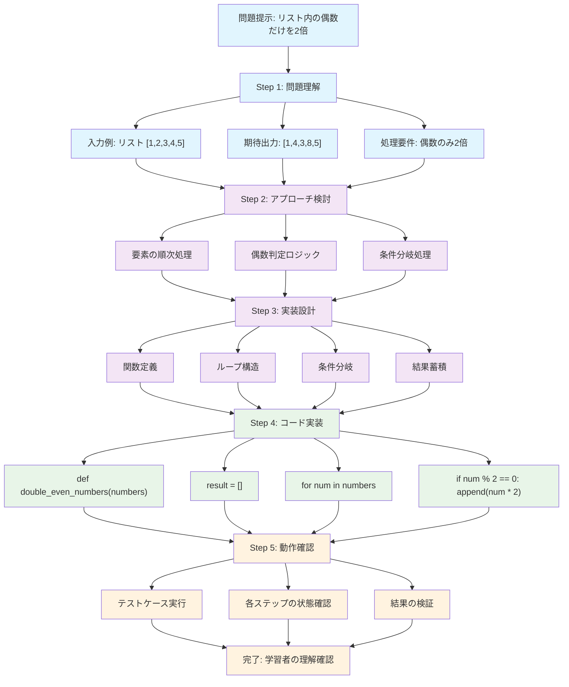

## はじめに

前章で認知的自律性の重要性を確認しました。しかし、**「認知的自律性を育む」** という目標を掲げても、具体的にどのようにAIを活用すれば良いのか、その設計原理が明確でなければ実践は困難です。本章では、John Swellerらによって体系化された認知負荷理論（Cognitive Load Theory）を基盤として［6］、生成AI時代の学習設計原則を提示します。

認知負荷理論は、人間の認知アーキテクチャの制約を考慮した上で、効果的な学習環境を設計するための理論的枠組みです。ワーキングメモリの容量制限という基本的な制約から出発し、学習効果を最大化するための具体的な指針を提供します。生成AIという新たな認知的ツールの登場により、この理論の応用範囲は大きく拡張されました。

本章では、認知負荷理論の基本概念を解説した後、生成AIが各種の認知負荷にどのような影響を与えるか、そしてそれをどのように最適化すべきかを詳細に検討します。

## 2.1 認知負荷の3つのタイプと生成AI

### 認知負荷理論の基本概念

認知負荷理論の中核は、人間のワーキングメモリ（作業記憶）には厳しい容量制限があるという事実です。Miller（1956）の研究以来、ワーキングメモリは一度に7±2個の情報しか保持できないことが知られています［15］。さらに、複雑な処理を行う場合、この容量はさらに制限されます。

学習とは、新しい情報をワーキングメモリで処理し、既存の知識構造（スキーマ）と統合して長期記憶に保存するプロセスです。

:::message
**知識構造(スキーマ)とは何か？**
スキーマ（schema）とは、関連する知識や概念が体系的に組織化された認知的な枠組みのことです。例えば：
- 「レストラン」のスキーマ：入店→席に着く→メニューを見る→注文→食事→会計という一連の行動パターン
- 「プログラミングの関数」のスキーマ：入力を受け取る→処理を実行→結果を返すという基本構造
- 「自転車の乗り方」のスキーマ：バランスを取る、ペダルを漕ぐ、ハンドル操作などの統合された動作パターン

既存のスキーマがあると、新しい情報を効率的に理解・記憶できます。例えば、Pythonの関数を理解している人は、JavaScriptの関数も「既存のスキーマ」を活用して素早く学習できるのです。
:::

このプロセスで生じる認知的な負担が「認知負荷」です。Swellerらは、この認知負荷を以下の3つのタイプに分類しました［19］。

1. **内在的認知負荷（Intrinsic Cognitive Load）**
2. **外在的認知負荷（Extraneous Cognitive Load）**
3. **関連認知負荷（Germane Cognitive Load）**

それぞれの認知負荷が生成AIとどのように関わるかを詳しく見ていきましょう。

### 2.1.1 内在的認知負荷とAI支援

#### 内在的認知負荷の本質

内在的認知負荷は、学習内容そのものの複雑性から生じる負荷です。この負荷の大きさは、主に以下の要因によって決まります。

**要素の相互作用性（Element Interactivity）**
- 学習内容に含まれる要素の数
- 要素間の関係の複雑さ
- 同時に処理すべき情報の量

例えば、「2 + 2 = 4」という単純な計算の内在的認知負荷は低いですが、「微分方程式を解く」という課題の内在的認知負荷は高くなります。これは、後者が多くの概念と手順を同時に考慮する必要があるためです。

**学習者の事前知識**
- 既存のスキーマの有無
- 関連知識の豊富さ
- 自動化された処理の程度

エキスパートにとっては低い内在的認知負荷の課題も、初心者にとっては高い負荷となります。これは、エキスパートが効率的なスキーマを持っているためです［20］。

#### AIによる内在的認知負荷の管理

生成AIは、内在的認知負荷を直接的に減らすことはできません（学習内容の本質的な複雑性は変わらないため）。しかし、以下の方法で学習者が内在的認知負荷を効果的に管理できるよう支援できます。

**1. 段階的な複雑性の提示**

AIを活用して、複雑な概念を段階的に提示することができます。

> 学習者：「機械学習のニューラルネットワークについて教えてください」
> 
> AI活用例：
> Step 1: まず、単一のニューロン（パーセプトロン）の動作を説明
> Step 2: 複数のニューロンを組み合わせた単純なネットワーク
> Step 3: 多層ネットワークと誤差逆伝播法
> Step 4: 実際の応用例と最新の発展

このような段階的アプローチにより、各段階での内在的認知負荷を管理可能なレベルに保つことができます。

**2. 概念の分解と再構成**

複雑な概念を理解可能な要素に分解し、学習者のペースで再構成する。

> 複雑な概念：「量子コンピューティング」
> 
> AIによる分解：
> - 基礎要素1：量子ビット（キュービット）の概念
> - 基礎要素2：重ね合わせの原理
> - 基礎要素3：量子もつれ
> - 統合：これらがどのように組み合わさって計算能力を生むか

**3. 個別化された説明の生成**

学習者の背景知識に応じて、適切なアナロジーや例を提供：

> プログラミング経験者への説明：
> 「量子ビットは、従来のビットが0か1の値を持つのに対し、
> 0と1の重ね合わせ状態を持つことができます。
> これは、変数が同時に複数の値を持てるようなものです」
> 
> 物理学の背景がある学習者への説明：
> 「量子ビットは、電子のスピン状態のように、
> |0⟩と|1⟩の線形結合として表現されます」

#### 実践的なAI活用戦略

**スキーマ構築の支援**

AIを使って、新しい情報を既存の知識構造に結びつける。

1. **関連概念のマッピング**
   - 学習者の既知の概念を確認
   - 新しい概念との関連性を明示
   - 視覚的な概念マップの作成支援

2. **類推と比較の提供**
   - 馴染みのある領域からの類推
   - 類似概念との比較対照
   - 違いと共通点の明確化

3. **具体例の生成**
   - 抽象的概念の具体化
   - 文脈に応じた例の提供
   - 段階的な抽象度の調整

### 2.1.2 外在的認知負荷の削減戦略

#### 外在的認知負荷の特徴

外在的認知負荷は、不適切な教授設計や情報提示方法によって生じる「無駄な」負荷です。この負荷は学習に直接貢献せず、むしろ学習を妨げる要因となります。典型的な外在的認知負荷の原因には以下があります。

**情報提示の問題**
- 分散した情報源（Split-attention effect）
- 冗長な情報（Redundancy effect）
- 不明瞭な説明や指示
- 不適切な媒体の使用

**認知的な迷路**
- 複雑すぎるナビゲーション
- 不必要な認知的ステップ
- 目的が不明確なタスク
- 過度に複雑なインターフェース

#### AIによる外在的認知負荷の最小化

生成AIは、外在的認知負荷を劇的に削減する可能性を持っています。

**1. 情報の統合と整理**

分散した情報を統合し、一貫性のある形で提示：

> 従来の問題：
> - 教科書の説明（ページ32）
> - 図表（ページ45）
> - 練習問題（ページ78）
> - 解答（巻末）
> 
> AIによる解決：
> すべての関連情報を統合し、学習の流れに沿って提示
> 必要な図表を文脈に埋め込み
> 即座にフィードバックを提供

**2. 適応的な説明生成**

学習者の理解度に応じて、最適な説明を生成：

> 初回の説明：
> 「関数とは、入力に対して出力を返す処理のまとまりです」
> 
> 理解度確認後の補足：
> 「もう少し具体的に言うと、関数は材料（引数）を受け取って、
> レシピ（処理）に従って料理（戻り値）を作る
> キッチン（関数本体）のようなものです」

**3. 認知的負荷の可視化**

学習内容の複雑さを事前に提示し、学習者が準備できるようにする。

> AIによる学習内容の分析：
> - 予想学習時間：45分
> - 難易度：中級
> - 前提知識：基礎的なプログラミング概念
> - 新しく学ぶ概念：5個
> - 実践演習：3問

#### 実践的な削減テクニック

**1. マルチメディア原理の適用**［8］

AIを使って、最適なメディア形式を選択・生成：

- **テキストと図の統合**：説明と視覚的表現を適切に組み合わせる
- **音声説明の活用**：視覚的に複雑な図には音声説明を追加
- **アニメーションの段階的提示**：複雑なプロセスを段階的に表示

**2. 作業例（Worked Examples）の効果的活用**

作業例とは、問題の解決過程を段階的に示した完全な解答例のことです［23］。学習者は「どのように考えて」「どのような手順で」「なぜそうするのか」を学びます。AIが段階的な解決プロセスを示すことで、効率的な学習が可能になります。



**作業例の学習効果**

この段階的プロセスにより、学習者は以下の利点を得られます。

**1. 外在的認知負荷の削減**
- 「何をすればいいかわからない」悩みを解消
- 考える順序を明確に示すことで、内容理解に集中可能
- 試行錯誤によるムダな時間を削減

**2. 関連認知負荷の促進**
- 問題解決の思考パターンを学習
- 似た問題への応用方法を理解
- 効果的な解決手順を記憶に定着

**3. 段階的な理解の深化**
- 複雑な問題を理解可能な単位に分解
- 各段階での集中すべき要素を明確化
- 段階的な成功体験による自信向上

**AIとの対話による作業例**

学習者がAIと対話しながら作業例を学ぶプロセス：

> 学習者：「リスト内の偶数だけを2倍にする問題がわかりません」
> 
> AI：「段階的に解決方法を学びましょう。まず完全な解答例をお見せします。
> 
> 【Step 1: 問題理解】
> - 入力：数値のリスト [1, 2, 3, 4, 5]
> - 処理：偶数のみ2倍にする
> - 出力：[1, 4, 3, 8, 5]（2と4が2倍になった）
> 
> 【Step 2: 解決手順】
> 1. 結果用の空リストを作る
> 2. 元のリストを1つずつチェック
> 3. 偶数なら2倍して追加、奇数ならそのまま追加
> 
> 【Step 3: 実装】
> def double_even_numbers(numbers):
>     result = []                    # 空リスト作成
>     for num in numbers:           # 1つずつチェック
>         if num % 2 == 0:          # 偶数判定
>             result.append(num * 2) # 2倍して追加
>         else:
>             result.append(num)     # そのまま追加
>     return result
> 
> どの部分について詳しく知りたいですか？」
> 
> 学習者：「偶数判定のnum % 2 == 0がよくわからないです」
> 
> AI：「『%』は余りを計算する演算子です。
> - 4 % 2 = 0（4÷2=2余り0）→ 偶数
> - 5 % 2 = 1（5÷2=2余り1）→ 奇数
> 
> 偶数は2で割り切れるので余りが0になります。
> 実際に確認してみましょうか？」

この対話形式により、学習者は自分のペースで理解を深められます。

**3. 認知的負荷の動的調整**

学習者の反応に基づいて、リアルタイムで負荷を調整：

- **理解度の確認**：簡単な質問で理解度をチェック
- **ペースの調整**：学習者の反応時間に基づいて速度を調整
- **補足情報の提供**：必要に応じて追加説明を提供

### 2.1.3 関連認知負荷の促進

#### 関連認知負荷の重要性

関連認知負荷は、スキーマの構築と自動化に直接貢献する「生産的な」負荷です。この負荷は学習の本質的な部分であり、深い理解と長期的な記憶保持に不可欠です。関連認知負荷を通じて以下が実現されます。

**スキーマの構築**
- 個別の事実から一般的な原理の抽出
- 概念間の関係性の理解
- 知識の体系的な組織化

**自動化の促進**
- 基本的なスキルの無意識的実行
- 認知資源の解放
- より高次の思考への集中

#### AIによる関連認知負荷の最適化

生成AIは、関連認知負荷を適切なレベルに維持し、深い学習を促進できます。

**1. 精緻化（Elaboration）の促進**

AIが学習者に深い処理を促す質問を生成：

> 学習内容：「光合成のプロセス」
> 
> AIによる精緻化質問：
> - なぜ植物は緑色に見えるのでしょうか？
> - 光合成と呼吸の関係を説明してください
> - もし地球上のすべての植物が消えたらどうなりますか？
> - 人工光合成の可能性について考えてみましょう

**2. 自己説明（Self-Explanation）の支援**

学習者が自分の言葉で説明することを促す。

> AIプロンプト：
> 「今学んだ概念を、10歳の子供に説明するとしたら、
> どのように説明しますか？」
> 
> 学習者の説明に対するAIフィードバック：
> - 正確性の確認
> - 不足している要素の指摘
> - より良い説明方法の提案

**3. 変動性のある練習（Varied Practice）**

異なる文脈での応用を促す。

> 基本概念：「比例関係」
> 
> AIによる変動性のある練習問題：
> 1. 料理：レシピの分量調整
> 2. 地図：縮尺と実際の距離
> 3. 経済：為替レートの計算
> 4. 物理：速度と時間の関係
> 5. 芸術：黄金比の応用

#### 深い理解を促すプロンプト設計

**1. メタ認知的プロンプト**

学習者の思考プロセスを意識化させる。

> 効果的なプロンプト例：
> - 「この問題を解く前に、どのような戦略を使いますか？」
> - 「なぜその方法を選んだのか説明してください」
> - 「別の解法はありますか？それぞれの利点は？」
> - 「この解法が使えない場合はどんな時ですか？」

**2. 概念間の関連付け**

異なる概念をつなげる思考を促す。

> AIによる関連付け支援：
> 「今学んだ『エネルギー保存の法則』は、
> 先週学んだ『運動量保存の法則』とどのように関連していますか？
> 両者の共通点と相違点を挙げてみましょう」

**3. 生成的学習活動**

受動的な情報受容ではなく、能動的な知識構築を促す。

> 生成的活動の例：
> - 概念マップの作成
> - 要約の作成
> - 類推の生成
> - 問題の作成
> - 説明ビデオの脚本作成

## 2.2 最適な認知負荷ゾーンの設定

### Zone of Proximal Development（ZPD）と認知負荷

Vygotskyの最近接発達領域（ZPD）の概念は、認知負荷理論と密接に関連しています［17］。ZPDは、学習者が独力では達成できないが、適切な支援があれば達成できる課題のレベルを指します［21］。認知負荷の観点から見ると、ZPDは以下のような特徴を持ちます。

**最適な挑戦レベル**
- 簡単すぎず、難しすぎない
- 適度な認知的努力を要求
- 達成可能性を感じられる

**動的な調整**
- 学習者の成長に応じて変化
- 個人差を考慮した設定
- 継続的なモニタリングと調整

### AIを活用したZPDの特定と維持

#### 1. 診断的評価

AIが学習者の現在のレベルを正確に把握：

> AIによる診断プロセス：
> 
> 初期評価：
> - 基礎知識のチェック（簡単な質問から開始）
> - 段階的に難易度を上げる
> - つまずきポイントの特定
> 
> 詳細分析：
> - 概念理解の深さ
> - 手続き的知識の習熟度
> - 応用力のレベル
> 
> 結果の解釈：
> 「あなたは基本的な概念は理解していますが、
> 複雑な応用問題で論理的な推論に課題があるようです。
> 次のレベルに進むために、まず...」

#### 2. 適応的な課題設定

学習者のZPD内に課題を設定するために、AIは学習者のパフォーマンスを継続的にモニタリングし、課題の難易度を動的に調整します。

**課題難易度の調整原則**

AIは学習者の正答率と反応パターンを分析し、以下の基準で難易度を調整します：

**高パフォーマンス時（正答率80%以上）の対応：**
- より複雑な要素を段階的に追加
- 複数の概念を統合した問題を提示
- 具体的な例から抽象的な原理への移行を促進
- 応用問題や例外的なケースを導入

**低パフォーマンス時（正答率50%未満）の対応：**
- 複雑な課題を理解可能な小さな単位に分解
- より具体的で身近な例を豊富に提供
- 段階的なヒントやガイダンスを増やす
- 基本概念の復習機会を組み込む

**最適ゾーン（正答率50-80%）での対応：**
- 現在の難易度を維持しながら、問題のバリエーションを提供
- 同じ概念を異なる文脈で適用する機会を創出
- 学習者の興味や関心に応じた問題設定
- 適度なチャレンジと成功体験のバランスを保持

この適応的なアプローチにより、学習者は常に「頑張れば達成できる」レベルの課題に取り組むことができ、学習意欲を維持しながら着実にスキルを向上させることができます。

#### 3. スキャフォールディングの最適化

必要十分な支援を提供：

> 段階的な支援レベル：
> 
> レベル1（最小限の支援）：
> 「この問題について考えてみてください」
> 
> レベル2（方向性の示唆）：
> 「まず、与えられた条件を整理してみましょう」
> 
> レベル3（部分的な手がかり）：
> 「最初のステップは変数を定義することです。
> x = ... として始めてみましょう」
> 
> レベル4（詳細なガイダンス）：
> 「Step 1: 変数を定義（x = 速度）
>  Step 2: 方程式を立てる（距離 = 速度 × 時間）
>  Step 3: 与えられた値を代入」
> 
> レベル5（完全な解法提示）：
> 「解法の全プロセスを示します...」

### 認知負荷の最適バランス

#### 理想的な認知負荷配分

効果的な学習のための認知負荷の配分は以下のようになります。

> 総認知容量（100%）の配分：
> 
> 理想的な配分：
> - 内在的認知負荷：40-60%
> - 外在的認知負荷：0-10%（最小限に）
> - 関連認知負荷：30-50%
> - 予備容量：10-20%（柔軟性のため）
> 
> 問題のある配分：
> - 内在的認知負荷：70%
> - 外在的認知負荷：25%
> - 関連認知負荷：5%
> - 予備容量：0%（認知的過負荷）

#### モニタリング指標

AIが認知負荷レベルをモニタリングする指標：

**行動的指標**
- 反応時間の変化
- エラー率の推移
- ヘルプ要求の頻度
- タスク放棄率

**言語的指標**
- 説明の詳細さ
- 使用語彙の複雑さ
- 質問の質
- 自己評価コメント

**生理的指標（将来的に）**
- アイトラッキングデータ
- 心拍変動
- 脳波パターン
- 皮膚電気反応

## 2.3 AIが軽減すべき負荷と維持すべき負荷

### 認知負荷の選択的管理

すべての認知負荷を減らせば良いというわけではありません。学習にとって本質的な負荷は維持し、非生産的な負荷のみを軽減することが重要です。

#### 軽減すべき認知負荷

**1. 機械的な情報処理**

AIに任せるべきタスク：
- 大量のデータの整理・分類
- 単純な計算や変換
- 定型的なパターンの認識
- 情報の検索と抽出

```
例：研究論文の要約
学習者：「この20本の論文の主要な発見を整理してください」
AI：各論文の要点を構造化して提示
→ 学習者は内容の理解と統合に集中できる
```

**2. 表面的な記憶タスク**

暗記より理解を重視：
- 単純な事実の羅列
- 公式の丸暗記
- 用語の定義の機械的記憶

```
従来のアプローチ：
「元素周期表を暗記する」

AIを活用したアプローチ：
「元素の性質がなぜ周期的に変化するか理解する」
→ AIが必要な情報を提供し、パターンの理解に集中
```

**3. 形式的な作業**

本質的でない作業の自動化：
- フォーマットの調整
- 引用文献の整形
- コードの構文チェック
- スペルチェック

#### 維持すべき認知負荷

**1. 概念形成に関わる負荷**

深い理解に必要な思考：
- 抽象化のプロセス
- 一般化の思考
- 原理の発見
- 関係性の把握

```
AIの適切な使用例：
学習者：「これらの事例から、どんな法則が見えますか？」
AI：「事例を整理しましたが、パターンを見つけるのはあなたの仕事です。
    ヒントが必要な場合は言ってください」
```

**2. 批判的思考を要する負荷**

判断力を養う活動：
- 証拠の評価
- 論理的推論
- 仮説の検証
- 意思決定

```
議論の分析タスク：
AI：「この議論の前提と結論を整理しました」
学習者の仕事：
- 前提の妥当性を評価
- 論理的飛躍の発見
- 反例の検討
- 結論の妥当性判断
```

**3. 創造的思考の負荷**

オリジナリティを生む思考：
- 新しいアイデアの生成
- 独自の解決策の考案
- 芸術的表現
- イノベーティブな組み合わせ

### 学習目的に応じた負荷配分の設計

#### スキル習得段階での配分

**初級段階（認知的負荷を慎重に管理）**

```
負荷配分方針：
- 内在的負荷：最小限の要素から開始
- 外在的負荷：徹底的に削減
- 関連負荷：基本的なスキーマ構築に集中

AIの役割：
- 手厚いサポート
- 頻繁なフィードバック
- エラーの即時修正
- 成功体験の確保
```

**中級段階（負荷を段階的に増加）**

```
負荷配分方針：
- 内在的負荷：複雑性を段階的に増加
- 外在的負荷：引き続き最小限に
- 関連負荷：より深い処理を促進

AIの役割：
- 部分的なサポート
- 考える時間の提供
- ヒントベースの支援
- 自己発見の促進
```

**上級段階（自律的な負荷管理）**

```
負荷配分方針：
- 内在的負荷：実世界の複雑性に対応
- 外在的負荷：自己管理
- 関連負荷：高度な統合と創造

AIの役割：
- リソースとしての活用
- 高度な対話パートナー
- 批判的フィードバック
- 新たな視点の提供
```

#### 学習目標別の最適化戦略

**概念理解を目的とする場合**

```
重点配分：
- 関連認知負荷を最大化
- 多様な例での適用
- 概念間の関連付け
- 深い処理の促進

AI活用例：
「この概念を別の文脈で説明してみましょう」
「類似の概念との違いは何ですか？」
「この原理が成り立たない例を考えてください」
```

**スキル自動化を目的とする場合**

```
重点配分：
- 反復練習の効率化
- 段階的な複雑性増加
- 即時フィードバック
- 変動性のある練習

AI活用例：
- 個別化された練習問題生成
- パフォーマンスの詳細分析
- 弱点の特定と強化
- 進捗の可視化
```

**問題解決能力の育成**

```
重点配分：
- 構造化されていない問題への対処
- 複数の解法の探索
- 失敗からの学習
- メタ認知的スキルの発達

AI活用例：
「問題の本質は何だと思いますか？」
「別のアプローチを考えてみましょう」
「なぜその方法がうまくいかなかったのでしょう？」
```

## 2.4 発達段階に応じた認知負荷の調整

### 認知発達と容量の変化

認知容量は年齢とともに発達し、それに応じて処理できる認知負荷も変化します。

#### 児童期（6-12歳）の認知容量

**特徴：**
- ワーキングメモリ容量：3-5チャンク
- 具体的思考が中心
- 注意の持続時間：15-20分
- 文脈依存的な学習

**AI活用の指針：**

```
適切な認知負荷レベル：
- 一度に1-2個の新概念
- 具体例を豊富に使用
- 短いセッションで区切る
- ゲーム要素の導入

AIプロンプト例（8歳向け）：
「分数を学びましょう！
ピザを友達と分ける場面を想像してください。
1枚のピザを4人で同じ大きさに分けたら、
1人分はどれくらいになるでしょう？」
```

#### 青年期（13-18歳）の認知容量

**特徴：**
- ワーキングメモリ容量：5-7チャンク
- 抽象的思考の発達
- 注意の持続時間：30-45分
- メタ認知能力の向上

**AI活用の指針：**

```
適切な認知負荷レベル：
- 複数の概念の関連付け
- 抽象的な原理の理解
- 自己調整学習の促進
- 批判的思考の育成

AIプロンプト例（15歳向け）：
「二次方程式の解の公式を導出してみましょう。
まず、一般形 ax² + bx + c = 0 から始めて、
平方完成を使って解を求める過程を
ステップごとに考えてみてください」
```

#### 成人期の認知容量

**特徴：**
- ワーキングメモリ容量：7±2チャンク
- 高度な抽象思考
- 持続的な集中力
- 豊富な事前知識

**AI活用の指針：**

```
適切な認知負荷レベル：
- 複雑な問題解決
- 学際的な統合
- 自律的な学習設計
- 創造的な応用

AIプロンプト例（成人向け）：
「機械学習モデルのバイアス問題について、
技術的側面と倫理的側面の両方から分析し、
実装時の具体的な対策を提案してください」
```

### 個人差への対応

#### 認知スタイルの違い

学習者によって情報処理の好みが異なります。

**視覚型学習者へのAI支援**
```
特徴：図表やイメージで理解
AI活用：
- 概念の視覚化
- マインドマップの生成
- インフォグラフィックの作成
- 図解を含む説明
```

**聴覚型学習者へのAI支援**
```
特徴：音声情報で理解
AI活用：
- 音声での説明生成
- リズムやパターンの活用
- 対話的な学習
- 音声フィードバック
```

**体感型学習者へのAI支援**
> 特徴：実践を通じて理解
> AI活用：
> - シミュレーション
> - インタラクティブな演習
> - 実践的なプロジェクト
> - 試行錯誤の支援

#### 事前知識レベルの考慮

**初心者への配慮**
```
認知負荷管理：
- 既知の概念との関連付け
- スモールステップ
- 豊富な例示
- 頻繁な確認

AIプロンプト調整：
「プログラミング未経験者に変数を説明する場合、
『箱』のメタファーを使って...」
```

**中級者への配慮**
```
認知負荷管理：
- 概念の深化
- 応用例の提示
- 比較と対照
- 統合的理解

AIプロンプト調整：
「基本的なプログラミング経験がある人に、
オブジェクト指向の概念を...」
```

**上級者への配慮**
```
認知負荷管理：
- 高度な抽象化
- 例外的ケース
- 最新の発展
- 研究レベルの課題

AIプロンプト調整：
「経験豊富な開発者に、
関数型プログラミングパラダイムの利点を...」
```

### 適応的な認知負荷調整システム

#### リアルタイム調整メカニズム

AIが学習者の状態を継続的にモニタリングし、認知負荷を動的に調整するシステムの仕組みについて説明します。

**認知負荷の継続的な評価**

AIシステムは学習者との各インタラクションにおいて、認知負荷の状態を多角的に評価します。具体的な評価指標として以下があります：

- **反応時間の分析**：回答までの時間を測定し、通常よりも長い場合は認知的な困難を示唆
- **正確性の評価**：答えの正しさだけでなく、推論過程の論理性も含めて判断
- **言語使用の複雑さ**：学習者が使用する語彙や文構造の複雑さから理解度を推測
- **ヘルプ要求の頻度**：質問や説明要求の回数から困難度を把握

これらの指標を総合的に分析することで、現在の認知負荷レベルを0から1のスケールで数値化します。

**動的な難易度調整の仕組み**

システムは最適な認知負荷レベル（通常は0.7程度）を目標として設定し、学習者の現在のレベルと比較して以下のように調整を行います：

**認知負荷が過度に高い場合（目標レベル+0.1以上）：**
- 課題の複雑性を段階的に削減
- 情報量を適切に分割して提示
- より多くのガイダンスやヒントを提供
- 基礎的な概念の復習を組み込む

**認知負荷が不足している場合（目標レベル-0.1以下）：**
- より高度な概念や問題を導入
- 複数の要素を統合した課題を提示
- より抽象的な思考を要求する問題へ移行
- 創造的な解決策を求める課題を追加

**最適範囲内の場合：**
- 現在の難易度を維持しながら内容にバリエーションを追加
- 学習者の興味や強みに応じた問題設定
- 異なる文脈での応用機会を提供
- 学習の継続性を保つための工夫を実施

このリアルタイム調整により、学習者は常に適切なチャレンジレベルを維持し、効果的な学習を継続できます。

#### 長期的な適応戦略

学習者の成長に合わせた段階的な調整：

**週次レベルの調整**
```
Week 1-2: 基礎構築期
- 認知負荷：低〜中
- 焦点：基本概念の理解
- サポート：高レベル

Week 3-4: 発展期
- 認知負荷：中〜高
- 焦点：概念の統合
- サポート：中レベル

Week 5-6: 応用期
- 認知負荷：高
- 焦点：実践的応用
- サポート：低レベル
```

## 本章のまとめ

本章では、認知負荷理論を基盤として、生成AI時代の学習設計原則を詳細に検討しました。主要なポイントは以下の通りです。

1. **3つの認知負荷の理解と管理**
   - 内在的認知負荷：AIによる段階的提示と個別化
   - 外在的認知負荷：徹底的な削減と情報統合
   - 関連認知負荷：深い処理と理解の促進

2. **最適な認知負荷ゾーンの維持**
   - ZPDに基づく課題設定
   - 動的な難易度調整
   - 個人差への適応

3. **選択的な負荷管理**
   - 機械的タスクはAIに委譲
   - 本質的な思考は学習者が維持
   - 学習目的に応じた最適化

4. **発達段階への対応**
   - 年齢に応じた認知容量の考慮
   - 個人差への細やかな配慮
   - 長期的な成長を見据えた設計

次章では、これらの理論的基盤を実践に移すための具体的なフレームワーク「SPARK」について詳しく解説します。理論と実践を橋渡しする体系的なアプローチを提示し、実際の学習場面での活用方法を明らかにしていきます。

