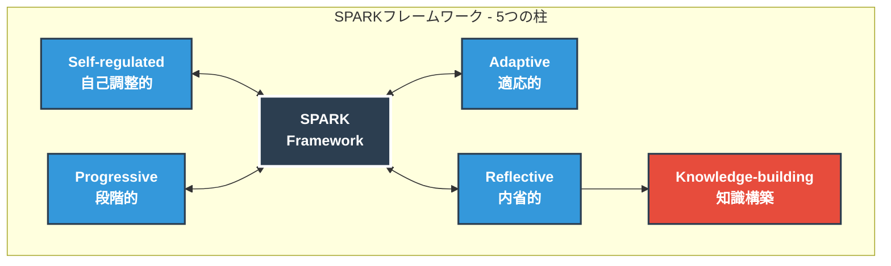
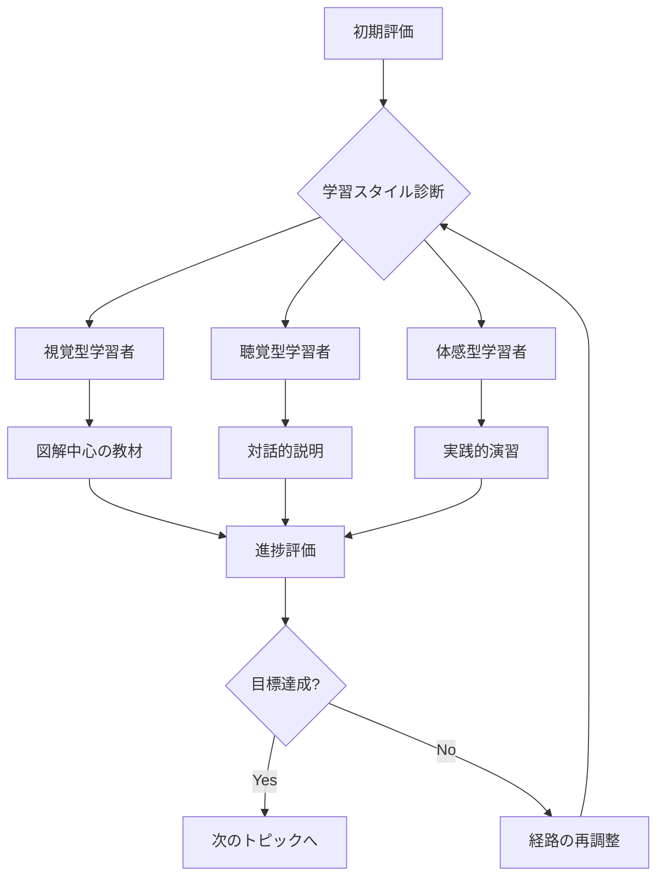
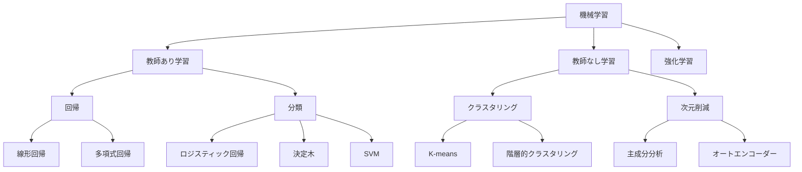

## はじめに

前章までに、認知的自律性の概念と認知負荷理論という理論的基盤を確立しました。しかし、理論だけでは実践への橋渡しが困難です。本章では、これらの理論を統合し、実践可能な形に具体化した「SPARKフレームワーク」を提示します。

SPARKは、**S**elf-regulated（自己調整的）、**P**rogressive（段階的）、**A**daptive（適応的）、**R**eflective（内省的）、**K**nowledge-building（知識構築）の頭文字を取った、生成AI時代の学習設計フレームワークです。このフレームワークは、学習者が主体となってAIを活用し、認知的自律性を育みながら深い学びを実現することを目的としています。

本章では、SPARKフレームワークの各要素を詳細に解説し、具体的な実装方法と活用例を提示します。また、学習者の発達段階に応じた適用方法や、プロンプトエンジニアリングの段階的習得についても詳しく説明します。

## 3.1 SPARKフレームワークの概要

### フレームワーク開発の背景

SPARKフレームワークは、以下の課題意識から生まれました。

1. **理論と実践のギャップ**：認知科学の知見をどのように日常の学習に適用するか
2. **AI活用の体系化**：散発的なAI利用から体系的な活用へ
3. **学習者の主体性**：AIに依存するのではなく、AIと協働する方法論の必要性
4. **発達段階への対応**：年齢や習熟度に応じた柔軟な適用

### SPARKの5つの柱

SPARKフレームワークは、相互に関連し合う5つの要素から構成されています。



これらの要素は独立しているのではなく、学習プロセス全体を通じて有機的に結びついています。以下、各要素について詳しく見ていきましょう。

### 3.1.1 Self-regulated（自己調整的）学習

#### 概念と重要性

自己調整学習は、学習者が自身の学習プロセスを主体的に管理する能力です［24］。AI時代においては、この能力がさらに重要になります。なぜなら、AIという強力なツールを適切に活用するためには、明確な目的意識と戦略的な判断が必要だからです。

#### 目標設定とAI活用計画

**SMART目標の設定**

効果的な目標設定には、SMART原則（Specific, Measurable, Achievable, Relevant, Time-bound）を適用します［25］。

例：学習目標の設定（学年別）

**小学校高学年向け**
× 悪い例：「理科ができるようになりたい」
○ 良い例：「2ヶ月後までに、身の回りの植物について、なぜそこに生えているのか理由を説明できるようになる」

**中学校向け**
× 悪い例：「数学を理解したい」
○ 良い例：「1学期末までに、一次関数のグラフを見て、身の回りの変化（気温、人口など）を説明できるようになる」

**高校向け**
× 悪い例：「世界史を覚えたい」
○ 良い例：「3ヶ月後までに、現代の国際問題を歴史的背景から分析し、自分の意見を根拠とともに述べられるようになる」

AIを活用した目標の具体化：

> 学習者：「植物について学びたいです。身の回りの植物がなぜそこに生えているのか理解できるようになりたいです」
> 
> AI：「素晴らしい目標ですね！段階的な学習計画を提案します。
> 第1段階：植物の基本的なつくりと働きを学ぶ
> 第2段階：植物が生きるのに必要な条件を調べる
> 第3段階：実際に外に出て観察し、理由を考える
> どの段階から詳しく始めましょうか？」

**AI活用戦略の立案**

目標に応じて、AIの活用方法を戦略的に計画します。

1. **基礎理解フェーズ**
   - 概念の理解：AIに基本概念をわかりやすく説明してもらう
   - 疑問解決：「なぜ？」「どうして？」の質問を気軽にできる
   - 学習経路の設計：個人に合った学習の進め方の提案

2. **実践・演習フェーズ**
   - 問題の解き方解説：段階的なヒントをもらう
   - 間違い直し支援：なぜ間違えたかの分析と改善点
   - 類似問題の生成：理解を深めるための練習問題作成

3. **応用・発展フェーズ**
   - アイデア発想：学んだことを使った新しい提案
   - 関連分野への展開：他の教科や実生活との関連付け
   - 発表・説明の準備：学んだことを人に伝える方法

#### 進捗モニタリングの方法

**定量的指標の追跡**

学習進捗を効果的に管理するためには、体系的な記録システムが必要です。以下の要素を含む進捗管理フレームワークを構築します。

**学習目標の管理**
- 各目標の詳細説明と期限を設定
- 大きな目標を達成可能な小目標に分解
- 目標設定日と進捗状況を記録

**学習セッションの記録**
- 各学習セッションで扱ったトピック
- 学習に費やした時間の正確な測定
- セッション終了時の理解度の自己評価（1-10段階）

**進捗レポートの生成**
AIを活用して以下の指標を分析します。
- 累計学習時間と時間配分の効率性
- カバーした学習トピック数
- 理解度評価の平均値と傾向
- 個別化された改善提案の生成

**定性的振り返り**

AIを対話パートナーとして活用した振り返り：

週次振り返りのプロンプト例：

> 学習者：「今週のPython学習を振り返りたいです。関数とクラスについて学びましたが、クラスの継承がまだよく理解できていません」
> 
> AI：「振り返りをサポートします。以下の質問に答えてみてください：
> 
> 1. 関数について、最も理解が深まった点は何ですか？
> 2. クラスの継承で特に困難を感じた部分は？
> 3. 来週の学習で重点を置くべき領域は？
> 
> また、継承の概念を別の角度から説明しましょうか？」

#### 自己評価とフィードバック活用

**ルーブリックベースの自己評価**

明確な評価基準を設定し、客観的な自己評価を促進：

| スキルレベル | 記述 | 具体例 |
|------------|------|--------|
| 初級 | 基本概念を理解し、簡単なコードが書ける | 変数宣言、基本的な関数の作成 |
| 中級 | 複数の概念を組み合わせて問題解決できる | クラスを使ったプログラム設計 |
| 上級 | 効率的で保守性の高いコードが書ける | デザインパターンの適用、最適化 |
| エキスパート | 新しい解決策を創造し、他者を指導できる | フレームワークの開発、技術記事の執筆 |

**AIからのフィードバック活用**

コードレビュー要請の例：

> 学習者：「以下のPythonコードをレビューしてください。特に効率性と可読性の観点からフィードバックが欲しいです」
> 
> ```python
> def calculate_average(numbers):
>     total = 0
>     count = 0
>     for num in numbers:
>         total = total + num
>         count = count + 1
>     return total / count
> ```
> 
> AI：「コードレビューの結果です。
> 
> 良い点：
> - 基本的なロジックは正しく実装されています
> - 変数名が分かりやすい
> 
> 改善提案：
> 1. Pythonの組み込み関数を活用：
>    return sum(numbers) / len(numbers)
> 
> 2. エラーハンドリングの追加：
>    if not numbers:
>        return 0  # または例外を発生
> 
> 3. 型ヒントの使用：
>    def calculate_average(numbers: list[float]) -> float:
> 
> これらの改善により、コードがより簡潔で堅牢になります」

### 3.1.2 Progressive（段階的）スキル習得

#### 学習の段階性の重要性

認知負荷理論に基づき、学習は段階的に進めることが効果的です。SPARKフレームワークでは、明確な段階設定により、学習者が無理なく成長できる環境を提供します。

#### 初級・中級・上級の段階設定

**初級段階：基礎の確立**

特徴：
- 単一概念の理解に焦点
- 具体的な例を中心に学習
- 高いレベルのAIサポート

AI活用例：

> 学習者：「変数とは何か教えてください」
> 
> AI：「変数を『ラベル付きの箱』として考えてみましょう。
> 
> 例えば：
> age = 25  # 'age'という箱に25を入れる
> name = "田中"  # 'name'という箱に"田中"を入れる
> 
> この箱の中身は後で変更することもできます。
> age = 26  # 誕生日が来たので更新
> 
> 簡単な練習問題を解いてみましょうか？」

**中級段階：統合と応用**

特徴：
- 複数概念の組み合わせ
- 問題解決への応用
- 部分的なAIサポート

AI活用例：

> 学習者：「ユーザー管理システムのクラス設計を考えています。アドバイスをください」
> 
> AI：「クラス設計を考える際のポイントを示します。
> 
> 考慮すべき要素：
> 1. 責任の分離（各クラスの役割を明確に）
> 2. データのカプセル化
> 3. 継承 vs コンポジション
> 
> まず、必要な機能をリストアップしてみてください。その後、一緒に適切なクラス構造を検討しましょう」

**上級段階：創造と指導**

特徴：
- 独自の解決策の開発
- 批判的思考の適用
- AIとの協働的創造

AI活用例：

> 学習者：「マイクロサービスアーキテクチャのパフォーマンス最適化について議論したい」
> 
> AI：「興味深いトピックですね。以下の観点から議論しましょう：
> 
> 1. 現在のボトルネックの特定方法
> 2. サービス間通信の最適化戦略
> 3. データ一貫性とパフォーマンスのトレードオフ
> 
> あなたの経験から、特に課題となっている領域はありますか？具体的なケースを基に、解決策を探っていきましょう」

#### 各段階での到達目標

**段階別到達目標マトリックス**

| 段階 | 認知的スキル | 技術的スキル | 自律性レベル |
|------|------------|------------|------------|
| 初級 | 記憶・理解 | 基本操作の習得 | AIの指示に従って学習 |
| 中級 | 応用・分析 | 複合的な問題解決 | AIと対話しながら学習 |
| 上級 | 評価・創造 | 革新的な解決策の開発 | AIを道具として活用 |

#### 移行のための評価基準

**段階移行チェックリスト**

初級→中級への移行：
- [ ] 基本概念を自分の言葉で説明できる
- [ ] 簡単なプログラムを独力で作成できる
- [ ] エラーメッセージを理解し、基本的なデバッグができる
- [ ] AIへの質問が具体的になってきた

中級→上級への移行：
- [ ] 複数の解決策を比較検討できる
- [ ] コードの効率性や保守性を考慮できる
- [ ] 他者のコードをレビューできる
- [ ] AIの提案を批判的に評価できる

### 3.1.3 Adaptive（適応的）支援システム

#### 学習者の状態に応じたAI活用

適応的支援は、学習者の現在の状態（知識レベル、感情状態、学習スタイル）に応じて、最適な支援を提供することを目指します。

**学習者プロファイルの構築**

学習者プロファイルシステムは、個々の学習者の特性、進捗状況、学習パターンを総合的に把握し、個別最適化された学習体験を提供するための基盤となります。このシステムは以下の5つの主要な要素から構成されています。

**1. 知識状態の管理**
学習者が各トピックにおいてどの程度の理解度を持っているかを継続的に追跡します。各トピックについて、現在の理解レベル、最後に学習した日時、自信度を記録し、学習進捗の可視化と次の学習ステップの決定に活用します。

**2. 学習スタイルの特定**
視覚型、聴覚型、体感型などの学習者の認知的傾向を特定し、最適な学習コンテンツの提供方法を決定します。学習者の反応パターンや好みに基づいて、説明方法や例示の仕方を調整します。

**3. 学習ペースの調整**
学習者の情報処理速度や集中力の持続時間を考慮し、適切な学習量と進行速度を設定します。個人差に応じた学習計画の調整により、過度な負荷や退屈感を避けます。

**4. 感情状態の考慮**
学習時の感情状態（集中度、疲労度、モチベーション）を把握し、学習効果を最大化するための支援レベルを調整します。ストレスや困惑を感じている際には、より丁寧な説明や励ましを提供します。

**5. 学習履歴の蓄積**
過去の学習成果、困難を感じた部分、効果的だった学習方法などを記録し、長期的な学習戦略の改善に活用します。この履歴データから学習パターンを分析し、より効果的な学習経路を提案します。

これらの情報を統合することで、AIは学習者の状態に応じて説明の深度、例題の複雑さ、支援の強度、対話スタイルを動的に調整し、個人に最適化された学習体験を提供できます。

**動的な支援レベルの調整**

学習者の状態検出と対応：

ケース1：理解に苦戦している場合
検出指標：
- 同じ質問の繰り返し
- エラーの頻発
- フラストレーションを示す言葉

> AI対応：「少し難しく感じているようですね。別の角度から説明してみましょう。まず、より簡単な例から始めて、段階的に理解を深めていきましょう」

ケース2：順調に理解している場合
検出指標：
- 素早い理解
- 発展的な質問
- 自信を示す表現

> AI対応：「素晴らしい理解度ですね！より挑戦的な問題に取り組んでみましょう。また、学んだ概念を応用する興味深いプロジェクトアイデアもあります」

#### パーソナライズされた学習経路

**学習経路の動的生成**



**個別化されたコンテンツ提供**

個別化されたコンテンツ提供とは、学習者一人ひとりの特性、学習スタイル、理解度、進捗状況に応じて、最適化された学習コンテンツを動的に生成・提供するシステムです。AIの強力な情報処理能力を活用することで、従来の「一律的な教育」から「個人最適化された学習」への転換を実現します。

**個別化の主要な要素**

1. **学習者特性の分析**
   - 認知スタイル：視覚型、聴覚型、運動感覚型の学習傾向
   - 学習ペース：理解速度と情報処理能力の個人差
   - 興味・関心：学習動機を高める分野や話題の特定
   - 既存知識：前提となる基礎知識レベルの把握

2. **コンテンツの適応化**
   - 説明方法の調整：抽象的概念vs具体例、理論的説明vs実践的応用
   - 情報量の最適化：認知負荷を考慮した適切な情報密度
   - 表現形式の選択：テキスト、図表、動画、インタラクティブ要素
   - 難易度の調整：学習者の習熟度に合わせた段階的な複雑性

3. **動的な調整メカニズム**
   - リアルタイム適応：学習過程での理解度変化に応じた即座の調整
   - 継続的最適化：長期的な学習データに基づく改善
   - フィードバック統合：学習者の反応を次回コンテンツに反映

**実践例：学習スタイル別の個別化**

視覚型学習者への対応例：

学習者：「再帰関数について教えてください」

AI：「再帰関数を視覚的に理解しましょう。階段を降りる例で考えます。

| 階層 | 状態 | 説明 |
|------|------|------|
| 5階 (n=5) | start | 開始地点 |
| 4階 (n=4) | 再帰呼び出し | 一つ下の階層を呼び出し |
| 3階 (n=3) | 再帰呼び出し | 一つ下の階層を呼び出し |
| 2階 (n=2) | 再帰呼び出し | 一つ下の階層を呼び出し |
| 1階 (n=1) | 基底条件 | 終了条件に到達 |

再帰関数の基本構造：
- 基底条件（終了条件）の定義
- 自己呼び出しによる問題の分割
- 段階的な問題解決プロセス

視覚的なアニメーションで実行プロセスを確認してみましょうか？」

聴覚型学習者への対応例：

AI：「再帰関数を音楽のように考えてみましょう。メロディーの繰り返しで表現すると：
『ド』で始まり、『レ』『ミ』『ファ』と上がって、また『ド』に戻る。
この『戻る』部分が再帰の概念です。

関数が自分自身を呼び出す＝メロディーが自分自身を参照する
基底条件＝音楽の終止符

実際に声に出して読んでみることで、理解が深まります」

体験型学習者への対応例：

AI：「実際に手を動かして再帰を体験しましょう。
まず、紙に『5』と書いてください。
次に、その下に『4』、そして『3』『2』『1』と順番に書きます。
これが再帰の『降りていく』プロセスです。

今度は実際にプログラムを書いて実行してみましょう。
エラーが出ても大丈夫、一緒にデバッグしながら理解を深めます」

**個別化システムの効果**

1. **学習効率の向上**
   - 最適な認知負荷での学習により、理解速度が向上
   - 個人の強みを活かした学習経路で、より短時間での習得が可能

2. **学習動機の維持**
   - 適切な難易度設定により、挫折感と退屈感を回避
   - 個人の興味に合わせた内容で、内発的動機を促進

3. **認知的自律性の育成**
   - 自分の学習特性を理解する機会を提供
   - 個別化プロセスを通じて、メタ認知能力を向上

#### 動的な難易度調整

**適応的難易度アルゴリズム**

動的な難易度調整とは、学習者のパフォーマンスと理解度に基づいて、リアルタイムで課題の難易度を最適化する仕組みです。この手法により、学習者は常に適切なチャレンジレベルを維持し、フロー状態での学習を継続できます。

**動的調整の基本原理**

1. **パフォーマンス監視**
   - 問題解決の成功率を継続的に追跡
   - 解答時間と思考プロセスの分析
   - エラーパターンと理解度の評価

2. **最適難易度の維持**
   - 目標成功率：約70%を基準とした調整
   - 過度な成功（90%以上）：難易度を段階的に上昇
   - 低い成功率（50%以下）：難易度を段階的に下降

3. **段階的調整メカニズム**
   - 急激な変化を避け、学習者の適応を促進
   - 指数移動平均による成功率の平滑化
   - 個人差を考慮した調整幅の最適化

**実践的な難易度調整システム**

**レベル1：基礎理解段階（難易度1-3）**
- 基本概念の確認問題を中心とした構成
- 明確な正解が存在する選択肢問題
- 即座のフィードバックによる理解の定着
- 学習者の自信構築を重視した設計

学習者が基礎概念を70%以上の確率で正解できるようになったら、次の段階へ移行します。

**レベル2：応用理解段階（難易度4-6）**
- 複数概念を組み合わせた応用問題
- 問題解決プロセスの重視
- 部分点による段階的評価
- 思考過程の言語化を促進

この段階では、単純な暗記ではなく、概念間の関連性の理解を重視します。

**レベル3：創造的思考段階（難易度7-10）**
- 創造的思考を要する発展問題
- 複数の正解が存在する開放的課題
- 独自のアプローチの評価
- 知識の転移と応用能力の測定

**適応的調整の具体例**

理科学習における動的難易度調整：

**初期状態（難易度5）**
問題：「植物の根、茎、葉のそれぞれの働きを説明し、なぜそれぞれが必要なのか理由を考えてみてください」

**成功率が高い場合（難易度7に上昇）**
問題：「身近な環境で生きている異なる植物（木、草花、シダなど）を観察し、それぞれが持つ特徴がどのような環境に適応するためのものか、複数の視点から分析してみてください」

**成功率が低い場合（難易度3に下降）**
問題：「まず、身の回りの植物を一つ選んで観察し、どんな部分があるかスケッチしてみましょう。根っこ、茎、葉っぱが見つけられますか？」

**学習効果の最大化**

動的難易度調整により、以下の学習効果が期待できます。

1. **フロー状態の維持**
   - 適切なチャレンジレベルによる集中状態の継続
   - 退屈感と不安感の両方を回避
   - 内発的動機の持続的な維持

2. **個人最適化された学習経路**
   - 学習者固有の強みと弱点に対応
   - 個人のペースに合わせた進捗管理
   - 多様な学習スタイルへの適応

3. **継続的な成長促進**
   - 段階的なスキルアップの実現
   - 適度な困難による認知的成長
   - 自己効力感の段階的な向上

### 3.1.4 Reflective（内省的）実践

#### AI対話を通じた振り返り

内省的実践は、学習プロセスを意識的に振り返り、改善していく重要な要素です。AIは、この振り返りを構造化し、深化させる役割を果たします。

**構造化された振り返りセッション**

日次振り返りテンプレート：

> AI：「今日の学習セッションを振り返りましょう。以下の質問に答えてください：
> 
> 1. 今日学んだ最も重要な概念は何でしたか？
> 2. 最も難しいと感じた部分はどこでしたか？
> 3. 明日に向けて、どんな準備が必要ですか？」
> 
> 学習者：「1. 植物の光合成のしくみについて学びました
> 2. 二酸化炭素と酸素の関係が難しかった
> 3. 実際に植物を観察して確かめてみたい」
> 
> AI：「良い振り返りですね。光合成の理解を深めるため、明日は以下のような実践演習を提案します。
> 
> - 水草を使った酸素発生の観察実験
> - 明るさを変えて光合成の変化を調べる
> - 植物がない環境との比較実験
> 
> これらの演習を通じて、概念の実践的理解を目指しましょう」

#### 学習ジャーナルの活用

**デジタル学習ジャーナルの構造**

学習ジャーナルは、学習プロセスを体系的に記録し、内省を促進するためのツールです。デジタル形式で作成することで、AIによる分析やパターン認識が可能になり、より深い学習インサイトを得ることができます。

**効果的なジャーナル構造の5つの要素**

1. **学習目標の明確化**
学習セッション開始時に、その日の具体的な目標を設定します。目標は測定可能で、達成可能な範囲で設定することが重要です。単に「理科を学ぶ」ではなく、「植物の光合成の仕組みを理解し、身近な植物で酸素が作られていることを説明できるようになる」といった具体性が必要です。

2. **学習内容の構造化された記録**
学習内容を以下の観点から整理して記録します。
- **概念理解**: 新しく学んだ理論や概念の要点
- **実践的応用**: 実際に試した実験や観察、演習結果
- **関連付け**: 既存知識との結びつきや類似概念
- **疑問点**: 理解しきれなかった部分や追加で調べたい内容

3. **気づきと内省の記録**
学習過程で得た洞察や発見を記録します。これには以下が含まれます。
- 思考プロセスの変化や新しい視点の獲得
- 困難に感じた部分とその原因の分析
- 予想と異なった結果や意外な発見
- 学習方法自体への気づき

4. **AIとの対話記録**
AIとの学習セッションで交わした重要な質問と回答を記録します。
- 質問内容とその背景
- AIからの回答の要点
- 追加で生まれた疑問や発展的な問いかけ
- 対話を通じて得られた新しい理解

5. **次回への計画と展望**
学習の継続性を保つため、次回の学習計画を明確にします。
- 今回の学習を踏まえた次のステップ
- 具体的な実践課題や演習計画
- 重点的に取り組む領域の特定
- 期待される成果や達成目標

**AIによるジャーナル分析システム**

デジタル学習ジャーナルの真価は、蓄積されたデータをAIが分析することで発揮されます。AI分析により以下のインサイトが得られます。

**学習パターンの識別**
- 最も生産的な学習時間帯の特定
- 効果的な学習方法や環境の傾向分析
- 集中力のピークタイムと持続時間の把握
- トピック別の理解速度の違いの発見

**知識ギャップの発見**
- 理解が不十分な概念や分野の特定
- 繰り返し質問される内容の傾向分析
- 基礎知識の穴や関連付けの弱い部分の明確化
- 優先的に補強すべき学習領域の提案

**進捗トレンドの分析**
- 時間経過に伴う理解度の変化
- 概念の定着率と忘却曲線の把握
- 学習効率の改善傾向の測定
- 目標達成率と計画精度の評価

**個別化された推奨事項の生成**
- 学習者の特性に応じた最適な学習戦略の提案
- 弱点克服のための具体的なアクションプラン
- 強みを活かした発展的学習の方向性
- 学習習慣の改善提案と実装方法

**ジャーナル活用の実践例**

プログラミング学習におけるジャーナル活用例：

ある学習者がPythonのデコレーター機能について学習した場合、ジャーナルには以下のような内容が記録されます。

学習目標として「Pythonのデコレーター機能を理解し、実際のWebアプリケーション開発で活用できるようになる」を設定。学習内容では、デコレーターが関数を包む関数であることを理解し、@記法が糖衣構文であることを学習。実践的には、ログ記録用のデコレーターを作成し、実際のコードで動作を確認。

気づきとして、デコレーターの入れ子構造が複雑に感じられ、実際の開発現場での活用場面についてより深く学びたいという課題を特定。AIとの対話では、認証チェックやキャッシング機能での実用例について質問し、より具体的な活用方法を理解。

次回の計画として、FlaskフレームワークでのWeb認証システムにデコレーターを適用する実践演習を設定。これにより、理論から実践への橋渡しを図る構成となっています。

このような体系的な記録により、学習者は自身の成長過程を客観的に把握し、より効果的な学習戦略を構築できるようになります。

#### メタ認知の促進方法

**メタ認知的問いかけ**

効果的な学習を促進するため、学習プロセスの各段階で適切な自問自答を行うことが重要です。以下の体系的な問いかけを通じて、学習者は自身の思考プロセスを客観視し、改善していくことができます。

**学習前の準備段階での問いかけ**
学習を開始する前に、明確な方向性を設定するための問いかけを行います。この段階では、学習セッションの目的、採用する学習方法、予想される困難を事前に整理します。具体的には、その日の学習で何を達成したいのか、どのような方法でアプローチするのか、どのような困難が予想されるのかを明確にします。

**学習中の調整段階での問いかけ**
学習を進める過程で、継続的に自分の理解度と方法の効果性を評価します。現在の理解度がどの程度なのか、採用している学習方法が効果的かどうか、別のアプローチを試す必要があるかどうかを定期的に確認します。この段階的な確認により、学習の質を向上させることができます。

**学習後の評価段階での問いかけ**
学習セッション終了後には、包括的な振り返りを行います。設定した目標が達成できたかどうか、どの方法が効果的で、どの方法が非効果的だったかを分析し、次回の学習に向けた改善点を特定します。この振り返りプロセスにより、継続的な学習改善が可能になります。

**メタ認知スキルの段階的発展**

メタ認知能力は段階的に発展していく特性があります。以下の5段階を通じて、学習者は自身の思考プロセスを深く理解し、効果的に制御できるようになります。

**第1段階：気づきの段階**
この段階では、学習者が「理解できていない部分がある」という認識を持つことから始まります。これは「あ、ここが分からない」という素朴な気づきですが、メタ認知の出発点として極めて重要です。

**第2段階：分析の段階**
気づきから一歩進んで、「なぜ分からないのか」という原因分析を行います。概念の複雑さ、前提知識の不足、学習方法の不適切さなど、理解を妨げる要因を特定します。

**第3段階：戦略の段階**
分析結果を基に、「どうすれば理解できるか」という具体的な方法を検討します。異なる学習アプローチの比較、追加リソースの活用、学習順序の変更など、戦略的な選択肢を評価します。

**第4段階：実行の段階**
選択した戦略を実際に実施し、進捗に応じて調整を行います。計画の柔軟な修正と、継続的な改善を通じて、効果的な学習を実現します。

**第5段階：評価の段階**
実行結果を包括的に評価し、成功要因と改善点を明確にします。この評価結果を次回の学習計画に反映させることで、継続的な学習改善のサイクルを確立します。

### 3.1.5 Knowledge-building（知識構築）

#### 概念マップとAI

知識構築は、断片的な情報を体系的な知識へと昇華させるプロセスです。AIは、このプロセスを視覚化し、構造化する支援を行います。

**AIアシスト概念マップ生成**


> 学習者：「機械学習の主要概念をマップにしたい」
> AI：「機械学習の概念マップを作成しましょう：



> この基本構造に、あなたが特に深めたい領域を追加していきましょう」

#### 知識の体系化支援

**知識の階層的整理**

知識の体系化支援とは、学習者が獲得した断片的な情報や概念を、構造化された知識体系へと統合するプロセスを支援することです。AIを活用することで、個人の学習進度と理解度に応じた最適な知識構造の構築が可能になります。

**階層的知識整理の基本原理**

知識の階層的整理は、認知科学における「スキーマ理論」に基づいています。人間の記憶は個別の事実を独立して保存するのではなく、関連する概念をまとまりとして構造化して保存します。この構造化プロセスを意識的に支援することで、より効果的な学習と記憶の定着が実現できます。

**1. 概念の階層レベル設定**

学習内容を以下の階層レベルに分類します。

- **レベル0（基礎概念）**: 分野の根本的な原理や定義
- **レベル1（主要概念）**: 基礎概念から派生する重要な概念群
- **レベル2（応用概念）**: 主要概念を組み合わせた応用技術
- **レベル3（統合概念）**: 複数の応用概念を統合した高次の理解

この階層構造により、学習者は知識の「土台」から「応用」まで段階的に理解を深めることができます。

**2. 概念間の関連性マッピング**

単独の概念ではなく、概念間の関係性を明確化します。

- **前提関係**: ある概念を理解するために必要な前提知識
- **派生関係**: 基本概念から発展した応用概念
- **補完関係**: 相互に補完し合う並行概念
- **対比関係**: 対照的な特徴を持つ概念ペア

**3. 理解度の継続的評価**

各概念の理解度を数値化（0-100%）し、学習進捗を可視化します。

- **0-30%**: 概念の存在を認識している段階
- **31-60%**: 基本的な定義や特徴を理解している段階
- **61-80%**: 他の概念との関連性を理解している段階
- **81-100%**: 概念を自由に応用・創造的に活用できる段階

**実践的な知識体系化プロセス**

**理科学習における階層的整理例**

基礎レベル（レベル0）として「植物の生きる仕組み」を設定し、その下に主要概念（レベル1）として「つくり」「栄養」「成長」を配置します。

つくり概念については、根・茎・葉のはたらき、花と実のでき方などの下位概念を関連付けます。理解度が90%に達している場合、この概念は十分に習得されていると判断し、次の学習ステップへ進むことができます。

栄養概念では、光合成、呼吸、水の吸収などの要素を段階的に学習し、理解度75%の時点で実践的な観察や実験が可能になります。

成長概念については、種子の発芽（理解度40%）と植物の一生（理解度20%）という下位概念があり、これらの理解度が低い場合は重点的な学習が必要であることが明確になります。

**知識ギャップの特定と学習経路の最適化**

体系化された知識構造から、学習者固有の知識ギャップを特定します。

- **基礎知識の欠如**: 上位概念は理解しているが、前提となる基礎概念の理解が不十分
- **応用力の不足**: 個別概念は理解しているが、概念間の関連性や統合的活用ができない
- **深度の偏り**: 特定分野は深く理解しているが、関連分野の知識が薄い

これらのギャップ分析に基づき、最も効果的な学習順序を提案します。一般的には、理解度の低い基礎概念から優先的に学習し、段階的に上位概念へと進むアプローチが推奨されます。

**AIによる動的な知識構造の更新**

学習の進捗に応じて、知識構造を動的に調整します。

- **新概念の追加**: 学習の深化に伴い、より詳細な下位概念や関連概念を追加
- **関連性の再評価**: 理解の深まりとともに、概念間の関係性を再定義
- **学習経路の最適化**: 個人の学習パターンと進捗に基づき、最適な学習順序を継続的に更新

**体系化による学習効果**

知識の階層的整理により、以下の学習効果が期待できます。

1. **理解の深化**: 個別の事実ではなく、構造化された知識体系として理解
2. **記憶の定着**: 関連性のある情報群として記憶することで、長期記憶への定着が促進
3. **応用力の向上**: 概念間の関係性を理解することで、新しい状況への応用が容易
4. **学習効率の向上**: 体系的な学習順序により、効率的なスキル習得が可能

このような体系的アプローチにより、学習者は単なる知識の蓄積ではなく、活用可能な知識体系を構築できるようになります。

#### 創造的知識生成

**AIとの協働による新しい洞察**

> 知識統合セッション例：
> 
> 学習者：「理科で学んだ光合成と、社会科で学んだ環境問題を組み合わせて、
>         何か新しいことを考えてみたい」
> 
> AI：「とても良い着眼点ですね！2つの分野の知識を組み合わせることで、
>     新しい発見や提案ができそうです：
> 
> 1. 都市緑化による環境改善プロジェクト
>    - 理科の知識：植物の光合成でCO₂を酸素に変える
>    - 社会科の知識：都市のヒートアイランド現象や大気汚染
>    - 提案：どこにどんな植物を植えれば効果的か調べる
> 
> 2. 学校の環境改善計画
>    - 理科の知識：植物が空気をきれいにする仕組み
>    - 社会科の知識：快適な生活環境の大切さ
>    - 提案：学校に緑を増やす具体的な計画を立てる
>    
> 3. 地域の環境問題解決アイデア
>    - 植物の力を使って地域の環境をよくする方法
>    - 地域の人たちと協力できる活動を考える
>    
> どのテーマに興味がありますか？
> 詳しく調べて発表できるように一緒に計画しましょう」

**知識の転移と応用**

> 領域横断的な知識応用：
> 
> 学習者：「算数で学んだ割合の考え方を
>         他の教科でも使えますか？」
> 
> AI：「割合の考え方は多くの場面で使える便利な道具です。
> 
> 算数の割合:
> 1. 全体を100として考える
> 2. 部分がどのくらいかを数字で表す
> 3. 比較して大小を判断する
> 4. 変化を数値で確認する
> 
> 他教科への応用：
> 
> 【理科での活用】
> 1. 実験結果の比較（成功率何％？）
> 2. 濃度の計算（食塩水の濃さ）
> 3. 天気の記録（晴れの日の割合）
> 4. 植物の成長率の比較
> 
> 【社会科での活用】
> 1. 人口の変化（増加率・減少率）
> 2. 産業の比較（農業・工業の割合）
> 3. 選挙結果の分析（得票率）
> 4. 貿易のデータ理解（輸出入の比率）
> 
> このように、一つの考え方を覚えると、
> いろいろな場面で活用できるようになります」

## 3.2 初級・中級・上級レベルの活用パターン

### レベル別学習シナリオの設計

各レベルにおける典型的な学習パターンと、AIの活用方法を具体的に示します。

### 初級レベル：ガイド付き探索

**特徴と目標**
- 基礎概念の確実な理解
- 学習習慣の確立
- AIとの適切な対話方法の習得

**典型的な1日の学習フロー（小学5年生・理科の例）**

> 15:30 - 学習準備
> 学習者：「今日は植物の発芽について勉強します。
>         どんな条件で芽が出るのか知りたいです」
> 
> AI：「植物の発芽の学習を始めましょう！今日の学習プランです。
>     1. 発芽って何だろう？（10分）
>     2. 芽が出るのに必要なものを考える（15分）
>     3. 実験の計画を立てる（15分）
>     4. 今日学んだことのまとめ（10分）
>     準備はできましたか？」
> 
> 15:40 - 概念学習
> AI：「発芽というのは、種から芽が出ることです。
>     
>     身近な例：
>     - 朝顔の種をまくと緑の芽が出る
>     - 大豆を水につけると白い芽が出る
>     
>     種の中には小さな植物（幼植物）が入っています。
>     この幼植物が大きくなって外に出てくるのが発芽です」
> 
> 15:55 - 考える時間
> AI：「芽が出るには何が必要だと思いますか？
>     
>     ヒント：
>     - 私たちが生きるのに必要なものを考えてみて
>     - 種を植えるとき、どんなことをするかな？
>     
>     思いついたことを教えてください」
> 
> 16:10 - 振り返り
> AI：「今日の学習を振り返りましょう：
>     ✓ 発芽とは何かがわかりました
>     ✓ 芽が出るのに必要なものを考えました
>     
>     明日は実際に実験をして、
>     本当に必要なものを確かめてみましょう」

**初級者向けプロンプトテンプレート**

初級者が効果的にAIと対話するためには、明確で具体的なプロンプトの構造を理解することが重要です。以下は、初級者が頻繁に使用する5つの基本的なプロンプトパターンです。

**1. 概念説明の依頼**
新しい概念について理解を深めたい場合：「〇〇について、小学生にもわかるように説明してください」
このパターンでは、自分の学習レベルを明示することで、適切な難易度の説明を得ることができます。

**2. 具体例の要求**
抽象的な概念を具体的に理解したい場合：「〇〇の身近な例を3つ教えてください」
複数の例を求めることで、概念の多様な側面を理解し、パターンを把握できます。

**3. 疑問解決の支援**
わからないことがあった際の解決策を求める場合：「〇〇がよくわかりません。どう考えればいいですか？」
具体的な疑問点を提示することで、的確な解説やヒントを得ることができます。

**4. 理解度の確認**
自分の理解が正しいか検証したい場合：「私の理解が正しいか確認させてください。〇〇は△△ということですか？」
学習者が主体的に理解度をチェックし、誤解を早期に発見できる重要なパターンです。

**5. 練習問題の依頼**
学習した内容を定着させたい場合：「〇〇について、簡単な問題を出してください」
適切な難易度の問題で実践的な理解を深めることができます。

これらのテンプレートを活用することで、初級者でも効果的なAI対話を行い、学習効果を最大化できます。

### 中級レベル：探索的学習

**特徴と目標**
- 複数概念の統合的理解
- 問題解決能力の向上
- AIとの対話的な知識構築

**プロジェクトベースの学習例（中学2年生・総合的な学習）**

> プロジェクト：地域の環境問題調査と解決提案
> 
> Week 1 - テーマ設定と計画立案
> 学習者：「地域の環境問題について調べたいです。
>         どこから始めればいいですか？」
> 
> AI：「地域の環境問題について調べるのは素晴らしいテーマですね！
> 段階的に進めましょう：
> 
> 【調査の進め方】
> 1. 身の回りの環境問題を見つける（ゴミ、騒音、川の汚れなど）
> 2. 一つの問題に焦点を当てる
> 3. 原因を調べる（なぜその問題が起きているか）
> 4. 解決方法を考える
> 5. 実際にできることを提案する
> 
> まず、あなたの住んでいる地域で気になることはありますか？」
> 
> Week 2 - 情報収集と分析
> 学習者：「近くの川にゴミが多いことが気になります。
>         この問題について詳しく調べたいです」
> 
> AI：「川のゴミ問題は重要な環境問題ですね。
>     調べるポイントを整理しましょう：
> 
> 1. どんなゴミが多いか観察する
> 2. ゴミがどこから来るか考える
> 3. 川の生き物への影響を調べる
> 4. 他の地域ではどう解決しているか調べる
> 
> 安全に観察するための注意点も説明しましょうか？」
> 
> Week 3 - 解決策の検討
> 学習者：「調査結果をまとめました。
>         解決策を考えたいのですが...」
> 
> AI：「調査お疲れさまでした！解決策を考える時のポイントは：
> 
> 1. 個人でできること
> 2. 学校でできること  
> 3. 地域の人と協力してできること
> 4. 行政に提案できること
> 
> あなたの調査結果に基づいて、
> どんなアイデアが思い浮かびますか？」

**中級者の課題解決パターン**

中級レベルの学習者は、複合的な問題に対して体系的なアプローチを取る能力を身につける必要があります。効果的な問題解決支援システムは、以下の5段階のプロセスを通じて学習者の思考を構造化します。

**問題解決の5段階プロセス**

**1. 問題の明確化**
問題の本質を正確に把握するための質問を提供します。具体的には「何が期待通りに動作していないか」「エラーメッセージの内容」「問題の発生タイミング」などの視点から問題を特定し、曖昧さを排除します。

**2. 原因の特定**
可能性のある原因を体系的に整理し、学習者が論理的に原因を絞り込めるようガイドします。入力データの問題、ロジックのエラー、環境設定の問題など、分野に応じたチェックリストを提供し、優先順位をつけた原因分析を支援します。

**3. 解決策の探索**
特定された原因に対する複数の解決策を提示し、それぞれの長所と短所を比較検討する機会を提供します。学習者が自分で最適な解決策を選択できるよう、判断材料を整理します。

**4. 実装と検証**
選択した解決策の実装方法を具体的にガイドし、実装後の動作確認方法についても指導します。テストケースの作成や、部分的な検証の手法も含めて支援します。

**5. 最適化と改善**
解決後の振り返りを通じて、より効率的な解決方法や、類似問題への対処法について学習者と議論します。この段階で得られた知見を今後の問題解決に活かせるよう、知識の定着を図ります。

このプロセスを通じて、学習者は単に問題を解決するだけでなく、問題解決能力そのものを向上させることができます。

### 上級レベル：創造的協働

**特徴と目標**
- 新しい解決策の創造
- AIとの高度な協働
- 知識の体系化と共有

**イノベーティブなプロジェクト例**

> プロジェクト：学校環境改善システムの開発（高校生・総合的な探究の時間）
> 
> 学習者：「学校の環境問題を調査・改善する
>         システムを作りたい。AIを活用して、
>         効果的な解決策を提案するアイデアがある」
> 
> AI：「素晴らしいプロジェクトですね！
>     実現可能性と取り組み方を整理しましょう：
> 
> 【調査・分析の仕組み】
> 1. データ収集レイヤー
>    - 環境データの測定（温度、騒音、ゴミなど）
>    - アンケート調査の設計と実施
>    - 過去のデータとの比較分析
> 
> 2. AI分析レイヤー
>    - 問題パターンの特定
>    - 原因と結果の関係性分析
>    - 解決策の優先順位付け
> 
> 3. 提案・実行レイヤー
>    - 具体的な改善案の作成
>    - 実施計画の立案
>    - 効果測定の仕組み作り
> 
> 【取り組む課題】
> - データの収集方法
> - 分析結果の信頼性
> - 実際の改善に向けた行動
> 
> どの部分から詳細を検討しましょうか？」
> 
> 学習者：「まず効果的なデータ収集と
>         分析方法を深掘りしたい」
> 
> AI：「データ収集と分析の戦略を検討しましょう：
> 
> 1. 定量的データの収集
>    - 温度・湿度の定期測定
>    - 騒音レベルの時間別記録
>    - エネルギー使用量の追跡
>    - ゴミの種類別重量測定
> 
> 2. 定性的データの収集
>    - 生徒・先生への聞き取り調査
>    - 快適度に関するアンケート
>    - 改善要望の分類・整理
>    - 成功事例の収集
> 
> 3. 分析と可視化
>    - データの傾向分析
>    - 問題の優先順位付け
>    - 解決策の効果予測
>    - 結果の分かりやすい発表資料作成
> 
> 実際の調査計画を一緒に設計してみましょうか？」

**上級者のAI活用パターン**

> 1. 研究設計の検討
> 「この環境調査の手法についてどう思う？
> 見落としている要因や改善点を指摘してほしい」
> 
> 2. 最新の取り組み動向の議論
> 「SDGsと地域の環境問題の組み合わせで
> 中高生ができる新しい活動パターンは？」
> 
> 3. 学習方法の哲学的議論
> 「探究的な学習とAIツールの活用の
> バランスをどう考えるべきか議論しよう」
> 
> 4. 地域社会への貢献
> 「この地域の環境保護活動に参加したい。
> 効果的な関わり方を教えて」

## 3.3 プロンプトエンジニアリングの段階的習得

### プロンプトエンジニアリングの基礎

効果的なAIとの対話には、適切なプロンプト（指示や質問）の設計が不可欠です［26］。これは学習可能なスキルであり、段階的に向上させることができます。

### 初級：明確な質問の構成

**基本原則**

1. **具体性**：曖昧な表現を避ける
2. **文脈提供**：背景情報を含める
3. **目的明示**：何のために聞いているか明確にする

**改善例**

> ❌ 悪い例：
> 「理科について教えて」
> 
> ✅ 良い例：
> 「植物の光合成について教えてください。
> なぜ植物は光が必要なのか知りたいです」
> 
> ✅ さらに良い例：
> 「小学5年生です。植物の光合成について学んでいます。
> 光合成で酸素ができることはわかりましたが、
> なぜ植物にとって光合成が大切なのか、
> 身近な例で説明してもらえますか？」

**初級者向けプロンプト構築手法**

初級者が効果的なプロンプトを作成するために、以下の構造化されたフレームワークを活用します。

**プロンプトテンプレートの構成要素**
- **学習レベル**: 初心者であることを明示
- **学習内容**: 具体的なトピックの指定
- **具体的な質問**: 明確で焦点を絞った質問
- **期待する回答**: 求める回答の形式や詳細度
- **背景・文脈**: 学習の目的や現在の状況

**実際の活用例**
例えば、Python学習において「リストから特定の要素を削除する方法」について質問する場合：
- 学習内容：Python リスト操作
- 具体的な質問：リストから特定の要素を削除する方法
- 期待する回答：コード例と使用時の注意点
- 背景・文脈：ToDoリストアプリケーションの開発中

このように構造化することで、初心者でも効果的なAI対話が可能になります。

### 中級：文脈を含む対話設計

**対話の継続性**

> 対話例：段階的な深掘り
> 
> Turn 1:
> 学習者：「Djangoでユーザー認証を実装したいです。
>         基本的な流れを教えてください」
> 
> AI：[基本的な認証フローの説明]
> 
> Turn 2:
> 学習者：「ありがとうございます。
>         それでは、カスタムユーザーモデルを使う場合は
>         どう変更すればいいですか？」
> 
> Turn 3:
> 学習者：「なるほど。セキュリティ面で
>         特に注意すべき点はありますか？」

**制約条件の明示**

> 効果的なプロンプト例：
> 
> 「React Hooksを使った状態管理について説明してください。
> 以下の条件で：
> - クラスコンポーネントは使わない
> - TypeScriptを使用
> - 小規模なアプリケーション向け
> - Reduxは使わない」

### 上級：創造的プロンプト設計

**メタプロンプティング**

> 「以下のタスクに最適なプロンプトを設計してください：
> 
> タスク：機械学習モデルの性能改善
> 現状：精度75%、データセットは10,000件
> 目標：精度85%以上
> 制約：計算リソースは限定的、1週間以内
> 
> どのような質問をすれば、効果的な改善策が得られるでしょうか？」

**ロールベースプロンプト**

> 「あなたは経験豊富なソフトウェアアーキテクトです。
> 以下のシステム要件に対して、スケーラブルな
> アーキテクチャを提案してください：
> 
> - 同時接続数：100万ユーザー
> - レスポンス時間：100ms以下
> - 可用性：99.99%
> - 予算：限定的
> 
> 特に、コスト効率を重視した設計をお願いします」

**連鎖的思考プロンプト**

> 「次の問題を段階的に解いてください：
> 
> 問題：N個の要素から重複なくK個を選ぶ組み合わせ数を
>       効率的に計算するアルゴリズム
> 
> ステップ1：問題の数学的定式化
> ステップ2：naive実装の提示
> ステップ3：最適化の機会の特定
> ステップ4：最適化された実装
> ステップ5：時間・空間計算量の分析
> 
> 各ステップで思考過程を明示してください」

## 3.4 自己調整学習サイクルの構築

### PDCAサイクルとAI活用の統合

自己調整学習を持続可能にするため、PDCAサイクルにAI活用を組み込んだ学習システムを構築します［27］。

### Plan（計画）フェーズ

**AIアシスト学習計画**

学習計画の作成において、AIを効果的に活用するための体系的なアプローチを構築します。

**学習計画システムの構成要素**
- **学習目標の管理**: 明確で測定可能な目標の設定と整理
- **マイルストーンの設定**: 段階的な達成目標の定義
- **リソースの特定**: 必要な学習材料とツールの整理

**AIとの協働による計画作成プロセス**
学習計画を作成する際は、以下の情報をAIに提供します。
- 学習目標の詳細（何を、どのレベルまで習得したいか）
- 利用可能な期間（週単位、月単位での時間枠）
- 現在のスキルレベル（初心者、中級者、上級者）

**計画に含めるべき要素**
1. 週次マイルストーン：各週の具体的な達成目標
2. 必要なリソース：教材、ツール、参考資料
3. 評価方法：進捗を測定する具体的な指標
4. 予想される困難と対策：想定される課題への対処法

**動的な計画調整メカニズム**
進捗状況に応じて計画を柔軟に調整します。
- 進捗が遅れている場合（完了率70%未満）：基礎の復習時間を増加
- 予定より進んでいる場合（完了率120%超）：発展的内容を追加

### Do（実行）フェーズ

**実行支援システム**

```
日次実行チェックリスト：

□ 学習環境の準備（5分）
  - 開発環境の起動
  - 必要な資料の準備
  - AIツールの準備

□ ウォームアップ（10分）
  - 前日の復習
  - 今日の目標確認
  
□ メイン学習セッション（45分×2）
  - 新規概念の学習
  - 実践演習
  - AIとの対話

□ クールダウン（15分）
  - 学習内容の整理
  - 疑問点の記録
  - 明日の準備
```

**集中力維持のテクニック**

効果的な学習を維持するため、ポモドーロテクニック［28］を基盤とした集中力管理システムを構築します。

**時間管理の基本設定**
- **集中時間**: 25分間の集中的な学習セッション
- **短い休憩**: 5分間のリフレッシュタイム
- **長い休憩**: 15分間の本格的な休息
- **サイクル管理**: 4回の短いセッション後に長い休憩を取る

**学習セッション管理プロセス**
1. **セッション開始**: 学習開始の明確な宣言と集中状態への移行
2. **集中時間の維持**: 25分間の中断のない学習活動
3. **セッション完了**: 達成感の確認と次のステップの準備
4. **休憩の最適化**: セッション数に応じた適切な休憩時間の確保

**休憩活動の提案**
- **短い休憩**: 軽いストレッチ、深呼吸、水分補給
- **長い休憩**: 散歩、軽食、完全に学習から離れた活動

このシステムにより、学習の質と持続性を両立させることができます。

### Check（評価）フェーズ

**多面的評価システム**

学習の成果を包括的に評価するため、複数の観点から学習状況を分析します。

**評価の5つの次元**
- **知識レベル**: 基本概念と理論的理解の程度
- **応用力**: 学んだ知識を実際の問題解決に活用する能力
- **学習速度**: 新しい概念を習得するペースと効率性
- **定着度**: 学習した内容の長期記憶への定着状況
- **創造性**: 既存の知識を組み合わせて新しいアイデアを生成する力

**包括的評価プロセス**
1. **知識テスト**: 基本概念の理解度を客観的に測定
2. **応用力評価**: 実践的な課題を通じたスキル確認
3. **AI活用による質的評価**: 学習過程とアウトプットの質的分析
4. **統合的評価**: 定量的データと質的フィードバックの総合判断

**評価結果の活用**
- **定量的指標**: 各次元の数値的評価とトレンド分析
- **質的フィードバック**: AIによる詳細な学習状況の分析
- **改善提案**: 個別化された学習改善の具体的推奨事項

**セルフアセスメントツール**

```
週次自己評価フォーム：

【理解度評価】
□ 概念を自分の言葉で説明できる
□ 他の概念との関連を理解している
□ 実践的な応用ができる

【スキル評価】
□ 独力で基本的なタスクを完了できる
□ エラーを自己解決できる
□ 効率的なコードが書ける

【学習プロセス評価】
□ 計画通りに学習が進んでいる
□ 適切な質問ができている
□ AIを効果的に活用している

【改善点の特定】
- 最も困難だった部分：
- 改善が必要な領域：
- 次週の重点事項：
```

### Act（改善）フェーズ

**継続的改善のためのアクション**

評価結果を基に体系的な改善策を実施し、学習効果を継続的に向上させます。

**改善プロセスの枠組み**
1. **弱点の特定**: 評価結果から最も改善が必要な領域を明確化
2. **改善策の生成**: 特定された課題に対する具体的な対策の立案
3. **アクションプランの作成**: 実行可能な改善計画の策定

**領域別改善戦略**

**知識の定着が課題の場合**
- **間隔反復学習の導入**: 記憶の忘却曲線に基づいた復習スケジュール
- **アクティブリコールの実践**: 受動的な復習ではなく能動的な思い出し訓練
- **教える活動の追加**: 他者への説明を通じた理解の深化

**応用力が課題の場合**
- **プロジェクトベース学習の増加**: 実際の成果物作成を通じた実践経験
- **実世界の問題への適用**: 学習内容を現実の課題解決に活用
- **オープンソースへの貢献**: コミュニティでの実践的活動参加

このような段階的なアプローチにより、具体的で測定可能な改善を実現します。

**学習方法の最適化**

> 改善サイクルの実例：
> 
> Week 1 評価：
> - 理解度：70%
> - 実践スキル：50%
> - 問題：コーディング時間が不足
> 
> Week 2 改善：
> - アクション：理論学習を30%削減、コーディング時間を50%増加
> - 結果：実践スキル65%に向上
> 
> Week 3 最適化：
> - アクション：ペアプログラミングセッションを追加
> - 結果：理解度80%、実践スキル75%
> 
> Week 4 定着：
> - アクション：学んだ内容でミニプロジェクト実施
> - 結果：知識の定着と自信の向上

### 持続可能な学習習慣の形成

**習慣化のメカニズム**

持続可能な学習習慣を形成するため、心理学的な習慣形成理論を基盤とした体系的なアプローチを構築します。

**習慣追跡システムの要素**
- **日次記録**: 毎日の学習完了状況の記録
- **連続日数管理**: 学習継続の「ストリーク」の追跡
- **報酬システム**: 達成マイルストーンに対する適切な報酬

**マイルストーン報酬の設計**
継続学習を促進するため、以下の節目で達成感を与えます。
- **7日連続**: 1週間の習慣確立
- **21日連続**: 習慣の基礎定着
- **30日連続**: 1ヶ月の継続達成
- **60日連続**: 長期継続の確立
- **100日連続**: 習慣の完全な定着

**学習ルーティンの構築**

**朝の準備セッション（07:00-07:30）**
- 活動：前日の復習とAIとの今日の計画確認
- 目的：記憶の定着と学習方向性の明確化

**メインセッション（20:00-21:30）**
- 活動：新規学習内容の習得とプロジェクト作業
- 目的：核となるスキル向上と実践的応用

**夜の振り返りセッション（22:00-22:15）**
- 活動：学習ジャーナルの記入と一日の総括
- 目的：メタ認知の促進と継続的改善

## 本章のまとめ

本章では、SPARKフレームワークを通じて、生成AI時代の学習を体系的に設計する方法を提示しました。主要なポイントは：

1. **SPARKの5要素の統合**
   - Self-regulated：主体的な学習管理
   - Progressive：段階的なスキル向上
   - Adaptive：個別最適化された支援
   - Reflective：継続的な内省と改善
   - Knowledge-building：体系的な知識構築

2. **レベル別活用パターン**
   - 初級：ガイド付き学習
   - 中級：探索的学習
   - 上級：創造的協働

3. **プロンプトエンジニアリング**
   - 段階的なスキル向上
   - 効果的な対話設計
   - 創造的な活用方法

4. **自己調整学習サイクル**
   - PDCAとAIの統合
   - 継続的改善
   - 習慣化の仕組み

次章では、このフレームワークを支える重要な概念である「認知的スキャフォールディング」について、AIを活用した具体的な実践方法を詳しく解説します。

