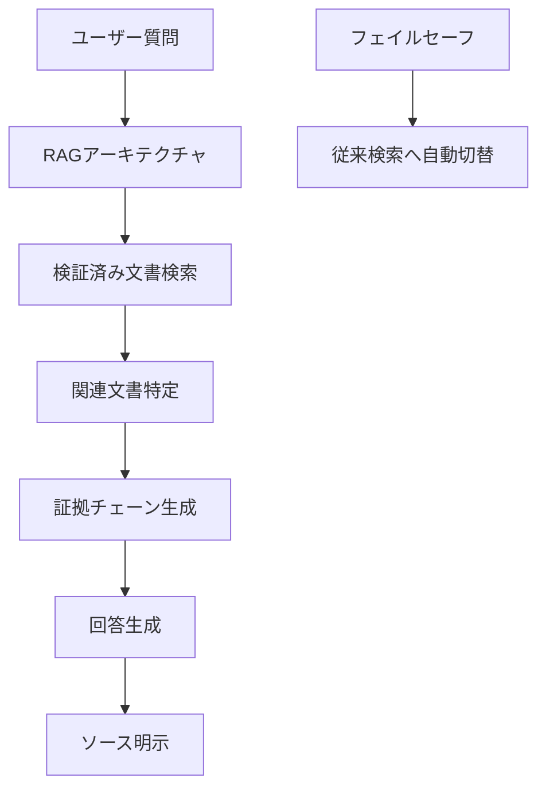
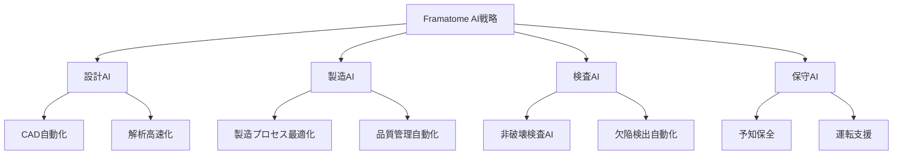

# 原子力×AI融合における国際競争の現況

原子力工学における生成AI活用は、もはや実験段階を超えて本格的な商用導入期に突入している。本章では、世界の最新動向を地域別に体系的に分析し、**米国の先行優位**、**欧州の協調アプローチ**、**アジアの急速な台頭**という三極構造の形成過程と、それぞれの戦略的特徴を明らかにする。

原子力学会会員および原子力発電関係者の皆様にとって、これらの国際動向の把握は、今後の技術開発方針や事業戦略立案において極めて重要な意味を持つ。特に日本の原子力産業が国際競争において優位性を維持・拡大するためには、各地域の戦略的アプローチを深く理解し、我が国独自の強みを活かした差別化戦略を構築する必要がある。

## 2.1 米国：商用化実装での圧倒的リーダーシップ

### 2.1.1 米国の圧倒的な先行優位

米国は原子力×AI融合において、商用化実績、投資規模、政策支援、技術開発のすべての面で世界を圧倒的にリードしている。2025年のトランプ政権発足以降、この傾向はさらに加速し、**原子力とAIの統合を国家安全保障の最優先事項**として位置づけている。この圧倒的なリーダーシップの実態を、4つの重要な側面から詳細に分析する。

### 2.1.2 PG&Eディアブロキャニオン原発：世界初の商用導入革命

#### 歴史的意義と技術的詳細

2024年11月、太平洋沿岸の美しい丘陵地帯に立つディアブロキャニオン原子力発電所で、原子力業界の歴史が変わった。PG&E（パシフィック・ガス・アンド・エレクトリック）とAtomic Canyon社による生成AI導入は、**米国、そして世界の原子力発電所における初の本格的商用生成AI導入**として記録された[^23][^24]。

この導入が原子力産業に与える影響は計り知れない。従来、原子力発電所での新技術導入は極めて慎重に行われ、実証から商用化まで10年以上を要することが一般的であった。しかし、生成AIの導入は、その有用性の明確さと安全性の確保により、わずか2年という異例の速度で商用化を実現した。

#### 技術アーキテクチャの革新性

システムの心臓部は、**NVIDIA H100 Tensor Core GPU 8台**から構成される最先端のオンサイトAIインフラである。

```
ハードウェア仕様：
├── GPU: NVIDIA H100 × 8台
│   ├── メモリ: 80GB HBM3 per GPU
│   ├── 演算能力: 約30 teraflops (FP64) per GPU
│   └── 総演算能力: 約240 teraflops
├── AIモデル: FERMI (Atomic Canyon製)
│   ├── アーキテクチャ: 原子力特化言語モデル
│   ├── 学習基盤: ORNL Frontier スーパーコンピュータ
│   ├── データソース: NRC規制文書
│   └── 学習データ: NRC ADAMS 5,300万ページ
└── セキュリティ: 完全エアギャップ環境
```

このアーキテクチャの革新性は、単なる高性能コンピューティングを超えて、原子力特有の要求事項を完全に満たしていることにある。特に、約240 teraflopsという演算能力は、従来の原子力施設のコンピューティング能力を桁違いに向上させている。

#### 驚異的な性能指標

このシステムが達成した性能は、原子力業界の常識を覆すものだった。

| 指標 | 従来手法 | AI導入後 | 改善率 |
|------|----------|----------|--------|
| 文書検索時間 | 年間15,000時間 | 秒単位 | **99.9%短縮** |
| 検索精度（上位10件） | 60-70% | **98%** | 40%向上 |
| 検索精度（上位5件） | 50-60% | **93%** | 65%向上 |
| 年間コスト削減 | - | **225万ドル** | - |

:::message
**実際の活用例**：コンクリート構造物の交換プロジェクトでは、従来は設計基準、メンテナンス履歴、NRC基準の個別調査に数日を要していたが、統合検索により**数秒で関連情報を取得**できるようになった。
:::

これらの数値は、単なる効率化を超えて、原子力発電所の運営パラダイムを根本的に変革する可能性を示している。年間225万ドルのコスト削減は、1基あたりの運営費を約0.5%削減することに相当し、業界全体に適用された場合の経済効果は数十億ドル規模に達する。

#### セキュリティ設計の徹底

原子力施設でのAI運用において最重要となるセキュリティ対策は、以下の多層的アプローチで実現されている。

**エアギャップ環境の実装**
- **完全オフライン運用**：インターネットとの接続を物理的に遮断
- **機密情報の流出防止**：内部文書が施設外に出ることは絶対にない
- **NRC/DOE要件準拠**：すべての核情報要件を満足

**AI「幻覚」対策**


このRAG（Retrieval-Augmented Generation）アーキテクチャにより、AIが生成する回答は常に検証可能な文書に基づいており、「幻覚」による誤情報のリスクを最小化している。

### 2.1.3 技術大手の巨額投資：16億ドル、5億ドル等の戦略的投資

原子力×AI分野における米国の優位性を決定づけているのが、GAFAM（Google、Amazon、Facebook/Meta、Apple、Microsoft）を筆頭とする技術大手による前例のない大規模投資である。これらの投資は単なる電力確保を超えて、**AI技術と原子力技術の戦略的融合**を目指している。

#### Microsoft：16億ドルの包括的原子力戦略

**Three Mile Island再稼働への歴史的投資**
Microsoftの16億ドル投資は、原子力業界におけるテック企業投資の象徴的事例である[^25]。

| 項目 | 詳細 |
|------|------|
| **投資総額** | 16億ドル |
| **電力容量** | 835MW（1号機のみ） |
| **契約期間** | 20年間の長期電力購入契約 |
| **運転開始** | 2028年目標 |
| **用途** | AIデータセンター専用電源（100%） |

この投資の戦略的意義は、単なる電力購入契約を超えている。Microsoftは実質的に、一つの原子炉の電力出力をほぼ独占的に確保し、AI開発に最適化された電力供給体制を構築している。

**原子力技術開発への本格参入**
Microsoftは電力購入だけでなく、原子力技術開発そのものに参入している。
- **原子力技術ディレクター**の採用（アーチー・マノハラン氏）
- **6ヶ月のAI開発プログラム**で原子力プロジェクト承認加速
- **INLとの戦略的パートナーシップ**による認可プロセス革新

#### Amazon：5億ドルのSMR生態系構築

**X-energy戦略投資の全貌**
Amazonの5億ドル投資は、SMR技術の商用化を加速する包括的取り組みである[^15]。

```
Amazon原子力戦略:
├── X-energy投資: 5億ドル
├── 目標容量: 最大5GW（2039年）
├── 技術選択: Xe-100高温ガス冷却炉
└── 展開戦略: 複数パートナーとの分散展開
    ├── Dominion Energy（バージニア州）
    ├── Energy Northwest（ワシントン州）
    └── AWS統合サービス
```

Amazonの戦略は、単一技術への集中投資ではなく、複数のパートナーと協力した分散型展開を特徴としている。これにより、技術リスクの分散と市場拡大の同時達成を図っている。

#### Google：500MW契約＋AI技術統合

**Kairos Powerとの戦略的提携**
Googleのアプローチは、**電力購入と技術開発の同時進行**に特徴がある[^16]。
- **電力購入契約**：500MW（2030年代運転開始）
- **技術協力**：溶融塩冷却原子炉の共同開発
- **展開規模**：2035年までに6-7基のHermes SMR

**AI×原子力技術の深度融合**
- **Google Cloud**とWestinghouse HiVe™システムの統合
- **Vertex AI、Gemini、BigQuery**を活用したAI強化原子炉開発
- **機械学習**による建設・運転最適化

#### Meta：1-4GWの大規模原子力調達

Metaの戦略は、**メタバース展開を見据えた大規模電力確保**である。
- **RFP発行規模**：1-4GWの原子力容量
- **導入時期**：2030年代初頭
- **技術選択**：SMR、大型炉の両方を検討
- **地理的戦略**：リスク分散と効率性の両立

#### 投資の戦略的意義

これらの巨額投資が示すのは、以下の戦略的転換である。

:::message
**パラダイムシフト**：
- 従来：電力は「コスト」
- 現在：電力は「戦略資源」
- 将来：電力は「技術競争力の源泉」
:::

| 企業 | 投資額 | 容量 | 戦略的焦点 |
|------|--------|------|------------|
| Microsoft | **16億ドル** | 835MW | AI統合・技術開発 |
| Amazon | **5億ドル** | 5GW | SMR生態系構築 |
| Google | **非公開** | 500MW | AI技術融合 |
| Meta | **調達中** | 1-4GW | 大規模電力確保 |

### 2.1.4 トランプ政権の原子力AI統合政策：国家戦略の全面展開

#### 包括的政策フレームワーク

2025年に発足したトランプ政権は、原子力×AI統合を**国家安全保障の最優先課題**として位置づけ、以下の野心的な目標を設定した[^17]。

**核心的政策目標**
```
2050年原子力ビジョン:
├── 容量4倍増: 100GW → 400GW
├── AI統合: 全新設炉でAI標準装備
├── SMR加速: 30ヶ月以内の連邦施設配備
└── 輸出戦略: アメリカ技術の世界展開
```

**具体的政策手段**
1. **大統領令「国家安全保障のための先進原子炉技術展開」**
   - 連邦施設への30ヶ月以内SMR配備指令
   - AIインフラへの電力供給を最優先に位置づけ
   - 規制プロセスの大幅簡素化

2. **NRC改革指令**
   - 「最終認可決定まで18ヶ月以内」の目標設定
   - AI支援による審査プロセスの効率化
   - リスクベースアプローチの全面採用

3. **連邦施設指定プログラム**
   - 16の連邦施設をデータセンター・原子力統合開発拠点に指定
   - 各施設でのパイロットプロジェクト実施
   - 成功モデルの民間展開支援

#### 予算・投資の大幅拡大

政府投資の規模も前政権から大幅に拡大している。

| 項目 | 2024年度 | 2025年度要求 | 増加率 |
|------|----------|--------------|--------|
| NRC AI関連予算 | 73万ドル | **443万ドル** | **約607%** |
| DOE核エネルギー局予算 | - | **13.7億ドル** | - |
| SMR開発支援 | 5億ドル | **20億ドル** | **300%** |

これらの予算拡大は、政府レベルでの原子力×AI統合への本格的なコミットメントを示している。特に、NRC予算の約607%増は、規制機関自体のAI対応能力の強化を意味している。

### 2.1.5 国立研究所の先端研究

**オークリッジ国立研究所（ORNL）** の取り組みも注目される。
- **Frontierスーパーコンピュータ** での大規模AI学習
- **原子力特化LLM** の開発とライセンス化
- **デジタルツイン技術** との統合研究

**アイダホ国立研究所（INL）** では
- **Microsoft連携** による認可プロセス革新
- **SMR統合AI** の実証研究
- **サイバーセキュリティ対策** の高度化

### 2.1.6 成功要因の分析

米国の圧倒的優位の背景には、以下の構造的要因がある。

**1. 産官学連携の効率性**
- 政府政策と民間投資の完璧な連携
- 規制当局の迅速な対応と柔軟性
- 研究機関の実用化志向

**2. 市場メカニズムの活用**
- 競争原理による技術革新の加速
- 投資リスクの適切な分散
- スケールメリットの最大化

**3. 国家安全保障との統合**
- エネルギー安全保障の戦略的位置づけ
- 技術覇権確保への強い意志
- 国際標準化への積極的関与

## 2.2 欧州：協調的イノベーションと規制調和

### 2.2.1 欧州の独自アプローチ

欧州は原子力×AI融合において、米国とは対照的なアプローチを展開している。**規制調和**、**持続可能性**、**国際協調**を重視し、技術開発と社会的受容性の両立を図る戦略的アプローチが特徴である。単純な競争ではなく、**責任あるイノベーション**の実現を目指している点で、世界的な規範形成において重要な役割を果たしている。

### 2.2.2 フランスEDFのAI統合EPR2プロジェクト：67.4億ユーロの野心的計画

#### 欧州最大の原子力AI統合プロジェクト

フランスは欧州における原子力×AI融合の最前線を走っている。その中核となるのが、**EDF（フランス電力公社）による67.4億ユーロ規模のEPR2原子炉建設プロジェクト**である[^18]。このプロジェクトは、設計段階からAI技術を統合した次世代原子炉の商用化を目指している。

**EPR2プロジェクトの全体像**
```
EDF EPR2統合戦略:
├── 総投資額: 67.4億ユーロ（約11兆円）
├── 建設計画: 6基のEPR2原子炉
├── AI統合: 設計・建設・運転の全工程
├── 展開サイト: Penly、Gravelines、Bugey
└── 運転開始: 2030年代前半～中期
```

#### EDFの革新的技術・財務戦略

**記録的な業績と投資拡大**
EDFは2024年に原子力事業で**記録的な114億ユーロの純利益**を達成し、この収益をデジタル変革と技術投資の拡大に活用している[^19]。

| 指標 | 2023年 | 2024年 | 変化率 |
|------|--------|--------|--------|
| **純利益** | 52億ユーロ | **114億ユーロ** | **119%増** |
| **設備投資額** | 19.1億ユーロ | **22.4億ユーロ** | **17%増** |
| **原子力発電量** | 320.8 TWh | **361.7 TWh** | **13%増** |

**EPR2でのAI技術活用計画**
EPR2プロジェクトでは、設計・建設・運転の各段階でのAI技術導入が検討されている。

**設計段階での活用検討**
- **最適化アルゴリズム**の炉心設計への応用研究
- **デジタルツイン**技術による設計検証プロセスの検討
- **機械学習**を活用した材料劣化予測手法の開発
- **AI支援ツール**による設計レビュー効率化の検討

**建設段階での活用検討**
- **ロボティクス**とAIを組み合わせた施工自動化の研究
- **画像認識技術**による品質検査システムの開発
- **AI最適化手法**による工程管理システムの検討
- **デジタル技術**によるサプライチェーン最適化の研究

#### Framatomeの技術パートナーシップ

フランスの原子力機器メーカーFramatomeも、**46.76億ユーロの売上（11.8%成長）** を記録し、AI統合技術開発を加速している[^20]。

**主要な技術開発領域**


### 2.2.3 ドイツの廃炉AI技術開発

ドイツは脱原子力政策を採用しているが、**廃炉技術におけるAI活用**で世界をリードしている。

**主要な技術開発**
- **ロボティクス**による危険区域作業の自動化
- **AI画像解析**による構造物状態診断
- **最適化アルゴリズム**による廃棄物分別・処理
- **プロジェクト管理AI**による工程最適化

### 2.2.4 英国のSMR×AI戦略

英国は**SMRとAIの統合開発**に注力している。

**Rolls-Royce SMRプログラム**
- AI支援設計による開発期間短縮
- モジュラー製造でのAI品質管理
- 運転・保守の完全自動化を目指した制御システム

### 2.2.5 EU規制枠組みとイノベーション促進策

**AI Act（AI規制法）**
- 原子力分野での高リスクAI用途への特別要件
- 透明性とアカウンタビリティの確保
- 段階的導入による安全性確保

**Horizon Europe研究プログラム**
- 原子力×AI融合研究への大規模資金投入
- 国際協力による知識共有促進
- 中小企業の参入支援

## 2.3 アジア：技術自立と輸出志向の台頭

### 2.3.1 アジアの急速な台頭

アジア太平洋地域は、原子力×AI融合において**第三の極**として急速に台頭している。米国の競争主義、欧州の協調主義とは異なり、**国家戦略による技術自立**と**輸出志向の産業化**を軸とした独自のアプローチを展開している。特に韓国、中国、日本の3カ国は、それぞれ異なる強みを活かしながら、世界市場での存在感を急速に高めている。

### 2.3.2 韓国のAI統合APR1400輸出成功

韓国は**APR1400原子炉**の輸出実績を基盤として、AI統合技術の海外展開を加速している。

**主要な取り組み**
- **韓国電力技術株式会社（KEPCO E&C）** によるAI設計システム開発
- **韓国原子力研究院（KAERI）** でのAI安全解析システム
- **UAEバラカ原発** でのAPR1400成功実績（AI統合は計画段階）
- **AI統合APR1400+** の次世代炉開発

**輸出戦略の特徴**
- パッケージ型輸出モデルの確立
- 現地技術者への包括的な技術移転
- 長期的なパートナーシップ構築

### 2.3.3 中国の大規模統合戦略

中国は**国家主導の大規模投資**により、原子力×AI分野での急速な追い上げを図っている。

**主要なプロジェクト**
- **中核集団（CNNC）** による第四世代炉AI統合開発
- **国家電投** のAP1000/CAP1400 AI強化プロジェクト
- **華為技術（Huawei）** 等との技術協力関係構築
- **清華大学** 等での基礎研究の強化

**戦略的特徴**
- 内製技術による完全な技術自立
- 一帯一路政策との連携した海外展開
- 大規模データセンターとの統合開発

### 2.3.4 日本の現状：技術力はあるが商用実装で遅れ

#### 技術的優位性の維持

日本は原子力×AI分野において、**技術力では決して劣っていない**が、**商用実装の速度で明確に遅れ**を取っている状況である。日本原子力学会も技術報告書において、AI技術の融合における課題と機会について詳細な分析を行っている[^21]。

**日本の技術的強み**

**世界最高水準の安全文化**
- 福島事故後に培われた徹底的な安全重視の姿勢
- 多層防護概念の深い理解と実践
- リスク評価・管理手法の高度化

**豊富な運転経験と技術蓄積**
- 54基の原子炉運転実績（累計1,500炉年以上）
- 高い設備利用率の維持技術
- 長期運転・高経年化対応技術

**先進的な研究開発力**
- JAEA（日本原子力研究開発機構）の基礎研究力
- 電力会社の実証研究能力
- メーカーの技術開発力

#### 政府レベルの政策展開

**第7次エネルギー基本計画の戦略的転換**
2025年2月に承認された **第7次エネルギー基本計画** は、従来の慎重姿勢から **「原子力の最大限活用」** への大幅な政策転換を示している[^22]。

```
第7次エネルギー基本計画:
├── 基本方針: 原子力の最大限活用
├── 2040年目標: 20-22%の電源構成
├── 先端技術: AI等の革新技術活用推進
├── 投資目標: 年間2,000億円規模
└── 国際協力: アジア市場でのリーダーシップ
```

**経済産業省のAI統合指針**
経済産業省が2024年4月に発表した **「ビジネス向けAIガイドライン Ver 1.0」** は、原子力を含む産業全体での生成AI統合に対応した包括的な指針を提供している[^23]。

**主要な政策要素**
- **リスク管理**：原子力特有の安全要求への対応
- **段階的導入**：パイロット→実証→商用の段階的アプローチ
- **国際標準**：IEEE/ANS基準との整合性確保
- **人材育成**：AI×原子力融合人材の育成支援

#### 産業界の取り組み

**電力業界のAI導入動向**
日本の電力業界では、生成AI技術の活用検討が進んでいる。各社が **DX推進の一環として** AI技術の導入可能性を模索している段階にある。

**主要企業の技術開発**

**三菱重工業：TOMONI統合プラットフォーム**
- 全社的なAI・デジタル変革プラットフォーム「TOMONI」展開
- ΣSynXをコアとしたシステム構築
- 宇宙グレードAI「AIRIS」の原子力応用

**日立GEニュークリア・エナジー**
- 米国DOEからBWRX-300小型モジュール炉のAI対応デジタルツイン開発契約獲得
- GE研究所との予知保全AI共同開発
- MIT連携のモデルベース故障検出システム

**東芝エネルギーシステムズ**
- AIを活用した原子力施設管理システム展開（2020-2024年）
- IoTプラットフォーム統合による柔軟なシステム構築

#### 研究機関の基盤整備

**JAEA（日本原子力研究開発機構）の先進的取り組み**
JAEAは**機密情報の漏洩リスクを排除**しながら生成AIを活用できる環境として、**所内スーパーコンピュータ上にLLM実行環境**を構築した[^25]。

**内製LLM環境の特徴**
- **完全内製**：外部サービス非依存
- **機密保持**：インターネット接続なし
- **実用性**：研究データ・報告書の要約・検索
- **拡張性**：将来的な機能拡張に対応

**具体的成果事例**
- **放射線マップ作成AI**：名古屋大学との共同開発
- **精度向上**：従来手法比で30%向上
- **時間短縮**：1時間以上→数分に短縮
- **実用化**：福島避難区域マッピングに活用

### 2.3.5 アジア太平洋地域の市場ポテンシャル

アジア太平洋地域は、世界の原子力市場の**60%以上**を占める最大の成長市場である。

**市場規模予測（2030年）**
- **新設炉建設**：約500億ドル/年
- **AI統合システム**：約50億ドル/年
- **運転・保守サービス**：約200億ドル/年
- **燃料・廃棄物管理**：約150億ドル/年

## 2.4 三極構造の戦略的含意

### 2.4.1 競争優位性の源泉

各地域の競争優位は以下のように整理できる。

| 地域 | 主要強み | 戦略的焦点 | 成功要因 |
|------|----------|------------|----------|
| **米国** | 商用化速度、投資規模 | 技術覇権確保 | 産官学連携の効率性 |
| **欧州** | 規制調和、持続可能性 | 責任あるイノベーション | 国際協調の実効性 |
| **アジア** | 技術自立、輸出志向 | 市場拡大と技術移転 | 国家戦略の一貫性 |

### 2.4.2 今後の競争構図

**2025-2027年：技術確立期**
- 米国：商用化モデルの確立と輸出展開
- 欧州：規制框組の完成と標準化主導
- アジア：技術追い上げと差別化戦略

**2028-2030年：市場拡大期**
- グローバル市場での本格競争開始
- 技術標準化を巡る国際的な主導権争い
- 新興国市場での差別化競争

**競争環境の変動要因**
- AIデータセンター電力需要の急激な変化（年率15-20%増）
- SMR商用化進展による技術パラダイム変化
- 地政学的要因による供給チェーン再編

### 2.4.3 日本への戦略的示唆

国際競争の現況分析から、日本が取るべき戦略的方向性

**短期戦略（2025-2026年）**
1. **米国との技術協力強化**：SMR技術開発、AI統合標準策定での連携
2. **欧州との規制調和**：IAEA AI-原子力シンポジウムへの積極参画
3. **アジア市場での差別化**：高温ガス炉技術等での優位性確立

**中長期戦略（2027年以降）**
1. **独自技術領域の確立**：日本の強みを活かした差別化
2. **アジア統合戦略**：地域リーダーとしての地位確立
3. **グローバル標準への貢献**：安全・品質面でのベンチマーク提供

---

## 参考文献

[^12]: PG&E Corporation, "PG&E Launches First Commercial Deployment of On-Site Generative AI Solution for the Nuclear Energy Sector at Diablo Canyon," Press Release, November 13, 2024.
URL: https://investor.pgecorp.com/news-events/press-releases/press-release-details/2024/PGE-Launches-First-Commercial-Deployment-of-On-Site-Generative-AI-Solution-for-the-Nuclear-Energy-Sector-at-Diablo-Canyon/default.aspx

[^13]: "AI solution deployed at Diablo Canyon - World Nuclear News," November 14, 2024.
URL: https://www.world-nuclear-news.org/articles/ai-solution-deployed-at-diablo-canyon-in-nuclear-industry-first

[^14]: Constellation Energy, "Constellation to Launch Crane Clean Energy Center, Restoring Jobs and Carbon-Free Power to The Grid," Press Release, September 20, 2024.
URL: https://www.constellationenergy.com/newsroom/2024/Constellation-to-Launch-Crane-Clean-Energy-Center-Restoring-Jobs-and-Carbon-Free-Power-to-The-Grid.html

[^15]: X-energy, "Amazon Invests in X-energy to Support Advanced Small Modular Nuclear Reactors and Expand Carbon-Free Power," Press Release, October 16, 2024.
URL: https://x-energy.com/media/news-releases/amazon-invests-in-x-energy-to-support-advanced-small-modular-nuclear-reactors-and-expand-carbon-free-power

[^16]: Google, "Google signs advanced nuclear clean energy agreement with Kairos Power," The Keyword (Google Blog), October 14, 2024.
URL: https://blog.google/outreach-initiatives/sustainability/google-kairos-power-nuclear-energy-agreement/

[^17]: 原子力産業新聞, "米大統領令 新設の促進やNRC改革を指示," May 24, 2025.
URL: https://www.jaif.or.jp/journal/oversea/28116.html

[^18]: EDF Group, "EDF and the French State Agree on €70 Billion Plan for EPR2," Press Release, 2024.
URL: https://www.edf.fr/en/the-edf-group/dedicated-sections/journalists/all-press-releases

[^19]: EDF Group, "2024 Annual Results: Record €11.4 billion net profit despite revenue decline," Financial Report, February 21, 2025.
URL: https://www.edf.fr/en/the-edf-group/dedicated-sections/journalists/all-press-releases/2024-annual-results

[^20]: Framatome, "Results 2024: Framatome increases its revenue by 11.8% compared to 2023," Press Release, 2025.
URL: https://www.framatome.com/medias/framatome-reports-2024-financial-results/

[^21]: 日本原子力学会, "原子力とAI技術の融合に関する技術報告書," 日本原子力学会誌, Vol.66, No.10, 2024年.

[^22]: 経済産業省, "第7次エネルギー基本計画," 2025年2月18日閣議決定.
URL: https://www.meti.go.jp/shingikai/enecho/denryoku_gas/denryoku_gas/pdf/070_01_00.pdf

[^23]: 経済産業省・総務省, "AIビジネス活用ガイドライン Ver 1.0," 2024年4月19日.
URL: https://www.meti.go.jp/english/press/2024/0419_002.html

[^24]: 関西電力株式会社, "生成AI活用の推進に関するOpenAI社との戦略的連携について," プレスリリース, 2024年.

[^25]: 日本原子力研究開発機構（JAEA）, "セキュアな生成AI実行環境の構築と活用に関する報告書," 2024年度技術報告書.