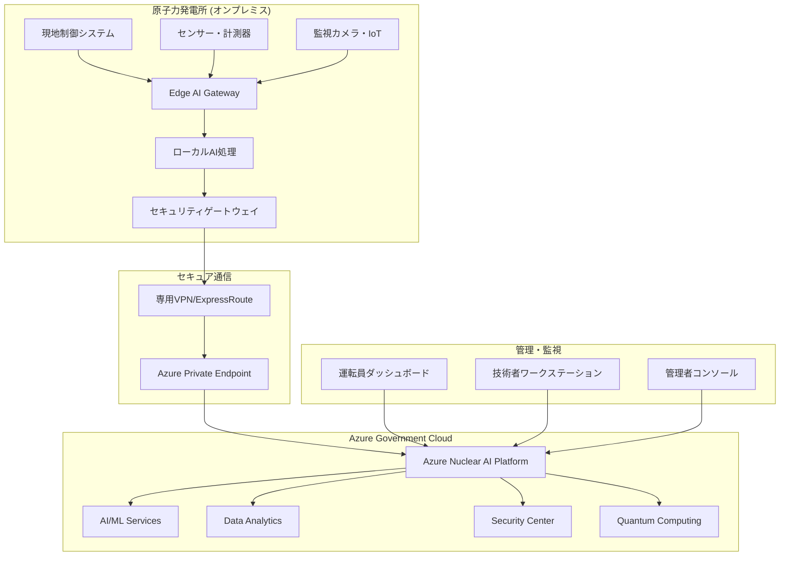
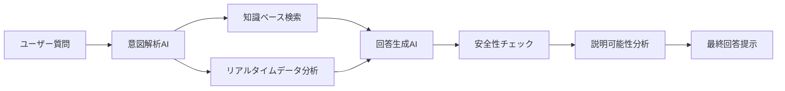
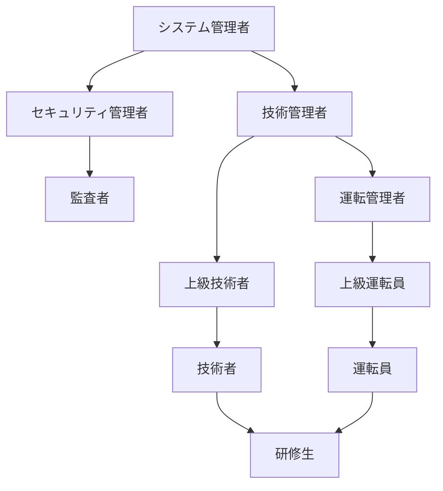

# Microsoft Nuclear AI Platform システム設計書

## 文書情報

**文書名**: Microsoft Nuclear AI Platform システム設計書
**バージョン**: 1.0
**作成日**: 2025年1月
**対象プロジェクト**: 日本マイクロソフト 原子力AI技術プロジェクト（基本参加型）
**機密区分**: 社外秘

## 1. システム概要

### 1.1 システムの目的・概念

**Microsoft Nuclear AI Platform** は、原子力発電所の安全性・効率性・信頼性を飛躍的に向上させるため、Microsoft Azureの先進技術を原子力分野に特化して統合した包括的AIプラットフォームです。

**設計原則**:
- **安全性最優先**: 如何なる場合も安全を最優先とする設計
- **深層防護**: 多層的な安全機能・フェイルセーフ機能
- **説明可能性**: AI判断の根拠を明確に説明可能
- **人間中心**: 人間の最終判断権・オーバーライド機能確保
- **段階的導入**: 実績に基づく慎重な機能拡張

### 1.2 システム適用範囲

**対象施設**: 日本国内原子力発電所
**対象機能**: 
- 予知保全・異常検知
- 運転最適化・効率向上
- 安全監視・リスク評価
- 文書管理・知識支援
- 人材育成・トレーニング

**除外範囲**:
- 原子炉安全保護系への直接制御
- 人間判断の完全代替
- 単独での緊急時対応

## 2. システムアーキテクチャ

### 2.1 全体アーキテクチャ



### 2.2 物理アーキテクチャ

#### 2.2.1 エアギャップ・セキュリティ設計

**物理分離レベル**
- **レベル1**: 原子炉安全保護系 - 完全物理分離
- **レベル2**: 運転制御系 - セキュリティゲートウェイ経由接続
- **レベル3**: 情報管理系 - 暗号化通信・認証接続

**ネットワーク分離**
```
原子炉安全保護系 [エアギャップ] ← 完全分離
     ↑
運転制御系 [セキュリティGW] ← Microsoft AI Platform
     ↑
情報管理系 [暗号化通信] ← Azure Government Cloud
```

#### 2.2.2 Azure Government Cloud 専用環境

**専用インフラ構成**
- **データセンター**: 日本国内Azure Government専用DC
- **物理分離**: 専用ラック・専用ネットワーク機器
- **セキュリティ**: 24時間物理警備・生体認証
- **冗長性**: N+1冗長・自動フェイルオーバー

### 2.3 論理アーキテクチャ

#### 2.3.1 4層アーキテクチャ設計

**第1層: データ収集・前処理層**
- センサーデータ収集・正規化
- リアルタイムデータストリーミング
- データ品質チェック・異常値検出
- Edge AI による初次処理

**第2層: AI・機械学習処理層**
- 予知保全AI・異常検知AI
- 運転最適化AI・リスク評価AI
- 自然言語処理・文書解析AI
- 説明可能AI（XAI）エンジン

**第3層: 統合・意思決定支援層**
- 複数AI結果の統合・評価
- 人間-AI協調インターフェース
- ワークフロー・承認管理
- アラート・通知システム

**第4層: ユーザーインターフェース層**
- 運転員ダッシュボード
- 技術者分析ツール
- 管理者監視コンソール
- モバイル・リモートアクセス

## 3. コンポーネント設計

### 3.1 Azure Nuclear AI Platform Core

#### 3.1.1 Microsoft Copilot for Nuclear Operations

**概要**: 原子力運転員・技術者専用のAI助手システム

**主要機能**:
- **運転支援**: リアルタイム運転状況分析・推奨操作提示
- **文書検索**: 運転手順書・技術文書の高度検索・要約
- **トラブル支援**: 異常時の原因分析・対応手順提示
- **学習支援**: 新人教育・継続研修での知識提供

**技術仕様**:
- **基盤モデル**: GPT-4 + 原子力専用ファインチューニング
- **知識ベース**: 原子力技術文書・運転実績データ
- **応答時間**: < 3秒（通常時）、< 1秒（緊急時）
- **精度**: 95%以上の正答率



#### 3.1.2 予知保全AIシステム

**概要**: 設備故障を事前予測し、最適な保全計画を提案

**主要機能**:
- **振動解析**: ポンプ・タービン等回転機器の異常予兆検知
- **温度傾向分析**: 熱交換器・配管系統の劣化予測
- **電気系統監視**: 電動機・制御機器の故障予測
- **保全計画最適化**: コスト・リスクを考慮した保全スケジュール

**AI/MLアルゴリズム**:
- **時系列解析**: LSTM・Transformer による傾向予測
- **異常検知**: Isolation Forest・One-Class SVM
- **画像解析**: CNN による設備状態判定
- **最適化**: 遺伝的アルゴリズム による保全計画最適化

**技術仕様**:
- **データ取得頻度**: 1秒〜1分間隔
- **予測精度**: 故障予測90%以上、誤報率5%以下
- **予測期間**: 1週間〜6ヶ月先
- **対象設備**: 主要設備500台以上

#### 3.1.3 運転最適化AIシステム

**概要**: プラント運転パラメータをリアルタイム最適化

**最適化対象**:
- **出力調整**: 需給変動に応じた最適出力制御
- **効率最大化**: 熱効率・燃料効率の最大化
- **環境負荷最小化**: 排水温度・放射性廃棄物最小化
- **経済性最適化**: 燃料費・運転コスト最小化

**制約条件**:
- **安全制限値**: 原子炉安全解析で定められた制限値
- **運転制限条件**: 技術仕様書に定められた運転条件
- **環境制限**: 環境影響評価・法規制による制限
- **経済制約**: 燃料交換・定期検査スケジュール

**最適化手法**:
- **リアルタイム最適化**: モデル予測制御（MPC）
- **多目的最適化**: パレート最適解による均衡点探索
- **強化学習**: 運転経験蓄積による継続的改善
- **物理制約**: Physics-Informed Neural Networks

### 3.2 データ管理・分析基盤

#### 3.2.1 Nuclear Data Lake

**概要**: 原子力発電所の全データを統合管理するデータレイク

**データカテゴリ**:
- **プロセスデータ**: 温度・圧力・流量・中性子束等
- **設備データ**: 振動・電流・状態信号等
- **運転データ**: 操作履歴・アラーム・ログ等
- **保全データ**: 点検結果・交換履歴・故障情報等
- **文書データ**: 手順書・報告書・図面等

**技術仕様**:
- **ストレージ容量**: 初期100TB → 拡張500TB
- **データ取り込み**: リアルタイム（1秒間隔）〜バッチ（日次）
- **データ保存期間**: 運転データ10年、保全データ40年
- **アクセス性能**: クエリ応答時間 < 5秒

#### 3.2.2 リアルタイム分析基盤

**概要**: ストリーミングデータのリアルタイム処理・分析

**技術スタック**:
- **ストリーミング処理**: Azure Stream Analytics
- **イベント処理**: Azure Event Hubs
- **リアルタイムDB**: Azure Cosmos DB
- **キャッシュ**: Azure Redis Cache

**処理能力**:
- **スループット**: 100万イベント/秒
- **レイテンシ**: < 100ms（エンドツーエンド）
- **可用性**: 99.99%（年間ダウンタイム < 1時間）

### 3.3 セキュリティ・ガバナンス

#### 3.3.1 Microsoft Defender for Nuclear Infrastructure

**多層防護セキュリティ**:

**第1層: ネットワークセキュリティ**
- Azure Firewall Premium: 次世代ファイアウォール
- DDoS Protection: 分散サービス拒否攻撃対策
- Network Security Groups: セグメント単位アクセス制御
- Virtual Network Service Endpoints: プライベート接続

**第2層: ID・アクセス管理**
- Azure AD Privileged Identity Management: 特権アクセス管理
- Multi-Factor Authentication: 多要素認証必須
- Conditional Access: リスクベースアクセス制御
- Just-In-Time Access: 最小権限・時限アクセス

**第3層: データ保護**
- Azure Information Protection: データ分類・暗号化
- Customer Managed Keys: 顧客管理暗号化キー
- Double Encryption: 二重暗号化（AES-256）
- Data Loss Prevention: データ漏洩防止

**第4層: 脅威検知・対応**
- Azure Sentinel: SIEM・セキュリティ監視
- Microsoft 365 Defender: 統合脅威保護
- Azure Security Center: セキュリティ態勢管理
- Threat Intelligence: 脅威インテリジェンス

#### 3.3.2 AI特有セキュリティ対策

**敵対的攻撃対策**:
- 入力データ検証・サニタイゼーション
- Adversarial Training による頑健性向上
- アンサンブル学習による攻撃耐性
- 統計的異常検知による攻撃検出

**モデル保護**:
- Differential Privacy による学習データ保護
- Federated Learning による分散学習
- Model Watermarking による知的財産保護
- Secure Multi-party Computation による秘匿計算

## 4. システム統合・インターフェース

### 4.1 既存システム統合

#### 4.1.1 統合対象システム

**制御系システム**:
- 分散制御システム（DCS）
- 安全保護系（ECCS等）
- 電源系統制御システム
- タービン制御システム

**情報系システム**:
- プラント情報システム（PI System等）
- 保全管理システム（MAXIMO等）
- 文書管理システム
- 運転支援システム

**統合方式**:
- **リアルタイム統合**: OPC UA・MQTT によるデータ連携
- **バッチ統合**: REST API・ETL による定期データ同期
- **メッセージ統合**: Azure Service Bus による非同期連携
- **ファイル統合**: Azure Files による共有ファイルアクセス

#### 4.1.2 データ標準化・正規化

**データモデル標準化**:
- IEC 61850: 電力システム通信プロトコル
- IEC 61970 CIM: 共通情報モデル
- MIMOSA CRIS: 設備情報標準
- IAEA IPES: 原子力発電所情報交換標準

**データ品質管理**:
- データ検証ルール: 物理的制約・論理的整合性
- データクレンジング: 異常値除去・補間処理
- データ系譜管理: データの出元・変換履歴追跡
- メタデータ管理: データ定義・品質指標管理

### 4.2 ユーザーインターフェース

#### 4.2.1 運転員ダッシュボード

**概要**: 運転員向けリアルタイム監視・操作支援画面

**画面構成**:
- **全体監視画面**: プラント全体状況・重要パラメータ
- **系統詳細画面**: 各系統の詳細状態・トレンド
- **アラーム画面**: 警報・注意事項の優先度別表示
- **操作支援画面**: AI推奨操作・操作確認画面

**技術仕様**:
- **表示遅延**: < 1秒（リアルタイムデータ）
- **画面遷移**: < 0.5秒
- **同時接続**: 20ユーザー
- **レスポンシブ対応**: PC・タブレット・スマートフォン

#### 4.2.2 技術者分析ツール

**概要**: 技術者・エンジニア向け高度分析・設計支援ツール

**主要機能**:
- **トレンド分析**: 長期データトレンド・相関分析
- **根本原因分析**: 異常・故障の原因特定支援
- **シミュレーション**: What-If分析・感度分析
- **レポート生成**: 自動レポート・ダッシュボード作成

**分析機能**:
- **統計分析**: 記述統計・回帰分析・時系列分析
- **機械学習**: クラスタリング・分類・予測モデル
- **可視化**: グラフ・チャート・3D可視化
- **協調分析**: 複数人での分析・知見共有

## 5. 運用・保守設計

### 5.1 システム監視・運用

#### 5.1.1 24時間365日監視体制

**監視センター**:
- **場所**: Microsoft Japan 品川本社内専用SOC
- **体制**: 24時間3交代・年中無休
- **要員**: 監視専門者12名（各シフト4名体制）
- **エスカレーション**: レベル1→2→3の段階的対応

**監視項目**:
- **システム稼働状況**: サーバー・ネットワーク・ストレージ
- **AI処理性能**: レスポンス時間・精度・エラー率
- **セキュリティ状況**: 不正アクセス・異常トラフィック
- **データ品質**: データ欠損・異常値・遅延

#### 5.1.2 自動運用・自己回復機能

**自動スケーリング**:
- CPU・メモリ使用率に基づく自動スケールアウト
- 予測ベースの事前スケーリング
- 処理優先度に基づくリソース配分
- コスト最適化を考慮したスケーリング

**自己回復機能**:
- ヘルスチェック・自動復旧
- 自動フェイルオーバー・ロードバランシング
- データ自動バックアップ・復元
- サービス依存関係管理・段階的復旧

### 5.2 変更管理・リリース管理

#### 5.2.1 DevOps・CI/CD パイプライン

**開発・テストプロセス**:
- **開発環境**: 個人開発環境・機能テスト
- **統合環境**: システム統合テスト・性能テスト
- **ステージング環境**: ユーザー受入テスト・セキュリティテスト
- **本番環境**: Blue-Green デプロイ・カナリアリリース

**自動化範囲**:
- コード品質チェック・静的解析
- 自動テスト・回帰テスト
- セキュリティ脆弱性スキャン
- 自動デプロイ・ロールバック

#### 5.2.2 変更承認プロセス

**変更分類**:
- **緊急変更**: セキュリティパッチ・重大障害対応
- **標準変更**: 計画的機能追加・改善
- **通常変更**: 軽微な修正・設定変更

**承認フロー**:
- **技術承認**: 開発チームリーダー・アーキテクト
- **セキュリティ承認**: セキュリティオフィサー
- **事業承認**: プロダクトオーナー・顧客代表
- **運用承認**: 運用チームリーダー

## 6. 性能・品質要件

### 6.1 性能要件

#### 6.1.1 レスポンス時間要件

| 機能カテゴリ | 目標時間 | 最大許容時間 |
|-------------|----------|-------------|
| **リアルタイム監視** | < 1秒 | < 2秒 |
| **AI予測・分析** | < 3秒 | < 5秒 |
| **文書検索・Copilot** | < 2秒 | < 5秒 |
| **レポート生成** | < 10秒 | < 30秒 |
| **バッチ処理** | 計画時間内 | +10% |

#### 6.1.2 スループット要件

| データタイプ | 処理能力 | ピーク時対応 |
|-------------|----------|-------------|
| **センサーデータ** | 10万点/秒 | 50万点/秒 |
| **イベントデータ** | 1万件/秒 | 5万件/秒 |
| **画像データ** | 100枚/分 | 500枚/分 |
| **同時ユーザー** | 100ユーザー | 500ユーザー |

#### 6.1.3 可用性要件

| システムコンポーネント | 目標可用性 | 年間ダウンタイム |
|--------------------|-----------|----------------|
| **核心AI機能** | 99.95% | < 4.4時間 |
| **監視・アラート** | 99.99% | < 0.9時間 |
| **データ保存** | 99.999% | < 5.3分 |
| **ユーザーIF** | 99.9% | < 8.8時間 |

### 6.2 品質要件

#### 6.2.1 AI性能要件

| AI機能 | 精度目標 | 測定方法 |
|--------|----------|----------|
| **異常検知** | 95%以上 | 適合率・再現率・F値 |
| **故障予測** | 90%以上 | 予測精度・誤報率 |
| **文書検索** | 90%以上 | 検索精度・関連性 |
| **自然言語理解** | 85%以上 | BLEU・ROUGE スコア |

#### 6.2.2 データ品質要件

| 品質観点 | 目標値 | 測定・改善方法 |
|----------|--------|---------------|
| **完全性** | 99%以上 | 欠損データ率・自動補完 |
| **正確性** | 99.5%以上 | データ検証・異常値検出 |
| **一貫性** | 99.9%以上 | 整合性チェック・統一化 |
| **適時性** | 目標時間内 | 遅延監視・アラート |

## 7. セキュリティ設計

### 7.1 セキュリティポリシー

#### 7.1.1 基本セキュリティ原則

**CIA triad + 拡張原則**:
- **機密性（Confidentiality）**: 許可された者のみのデータアクセス
- **完全性（Integrity）**: データの正確性・改ざん防止
- **可用性（Availability）**: 必要時の確実なサービス提供
- **真正性（Authenticity）**: データ・ユーザーの身元確認
- **否認防止（Non-repudiation）**: 操作・取引の否認防止
- **説明責任（Accountability）**: 全操作の記録・監査

#### 7.1.2 セキュリティ分類・レベル

**データ分類**:
- **Top Secret**: 核物質防護・国家安全保障関連
- **Secret**: 設計情報・運転詳細データ
- **Confidential**: 個人情報・企業機密情報
- **Internal**: 社内限定・業務データ
- **Public**: 公開可能・一般情報

**アクセスレベル**:
- **Level 4**: 最高権限（システム管理者・セキュリティ責任者）
- **Level 3**: 高権限（技術責任者・運転責任者）
- **Level 2**: 標準権限（運転員・技術者）
- **Level 1**: 限定権限（訪問者・研修生）

### 7.2 アクセス制御・認証

#### 7.2.1 多要素認証システム

**認証要素**:
- **知識要素**: パスワード・PIN・秘密の質問
- **所有要素**: スマートカード・トークン・証明書
- **生体要素**: 指紋・虹彩・静脈・顔認証
- **位置要素**: IP制限・GPS位置・MAC アドレス
- **行動要素**: 入力パターン・アクセス時間・操作履歴

**認証レベル別要件**:
- **Level 1**: パスワード + SMS認証
- **Level 2**: パスワード + 認証アプリ + 生体認証
- **Level 3**: スマートカード + PIN + 生体認証
- **Level 4**: スマートカード + PIN + 生体認証 + 管理者承認

#### 7.2.2 ロールベースアクセス制御（RBAC）

**役割定義**:


**権限マトリクス**:

| 役割 | システム設定 | AI設定 | データ閲覧 | 操作実行 | 監査ログ |
|------|-------------|--------|-----------|----------|----------|
| **システム管理者** | 全権限 | 全権限 | 全権限 | 制限あり | 全権限 |
| **技術管理者** | 制限あり | 全権限 | 全権限 | 承認後 | 閲覧のみ |
| **運転管理者** | なし | 制限あり | 運転関連 | 全権限 | 閲覧のみ |
| **上級運転員** | なし | なし | 運転関連 | 運転操作 | なし |
| **運転員** | なし | なし | 限定範囲 | 基本操作 | なし |

### 7.3 暗号化・データ保護

#### 7.3.1 暗号化仕様

**保存時暗号化**:
- **アルゴリズム**: AES-256-GCM
- **キー管理**: Azure Key Vault（FIPS 140-2 Level 2）
- **キーローテーション**: 年次（定期）+ イベント時（緊急）
- **バックアップ暗号化**: 別キーによる二重暗号化

**通信時暗号化**:
- **TLS 1.3**: 全通信の必須暗号化
- **Perfect Forward Secrecy**: セッションキーの前方秘匿性
- **Certificate Pinning**: 証明書固定による中間者攻撃防止
- **VPN**: IPsec + IKEv2 による VPN 暗号化

#### 7.3.2 キー管理・PKI

**階層的キー管理**:
```
Root CA（オフライン）
    ↓
Issuing CA（原子力専用）
    ↓
Service Certificate（サービス別）
    ↓
User Certificate（ユーザー別）
```

**キーライフサイクル**:
- **キー生成**: HSM（Hardware Security Module）内生成
- **キー配布**: 暗号化された安全チャネル
- **キー使用**: 用途・期間制限付き使用
- **キー更新**: 定期 + リスクベース更新
- **キー廃棄**: 安全な完全削除・証跡残存

## 8. 災害復旧・事業継続

### 8.1 災害復旧計画（DRP）

#### 8.1.1 復旧目標時間（RTO/RPO）

| システム重要度 | RTO（復旧時間） | RPO（データ損失） | 対応方式 |
|-------------|---------------|----------------|----------|
| **Critical** | 15分以内 | 0分（同期複製） | Hot Standby |
| **Important** | 1時間以内 | 15分以内 | Warm Standby |
| **Standard** | 4時間以内 | 1時間以内 | Cold Standby |
| **Low** | 24時間以内 | 24時間以内 | Backup Restore |

#### 8.1.2 災害対応体制

**緊急対応チーム（ERT）**:
- **指揮官**: DRP責任者（Microsoft Japan CTO）
- **技術リーダー**: インフラ・アプリケーション責任者
- **セキュリティリーダー**: セキュリティ責任者
- **顧客対応**: カスタマーサクセス責任者
- **外部調整**: 政府・規制当局・パートナー調整

**エスカレーション手順**:
1. **Level 1**: 運用チーム初動対応（15分以内）
2. **Level 2**: 技術チームエスカレーション（30分以内）
3. **Level 3**: ERT招集・対策本部設置（1時間以内）
4. **Level 4**: 経営陣・外部機関への報告（2時間以内）

### 8.2 バックアップ・復元戦略

#### 8.2.1 3-2-1バックアップ戦略

**3つのコピー**:
- **本番データ**: プライマリストレージ（東日本DC）
- **ローカルバックアップ**: セカンダリストレージ（東日本DC）
- **リモートバックアップ**: ディザスタリカバリサイト（西日本DC）

**2つの異なるメディア**:
- **高速SSD**: 即座復旧用（最新7日分）
- **大容量HDD**: 長期保存用（過去3年分）

**1つのオフサイト**:
- **地理的分散**: 1,000km以上離れた西日本DC
- **専用回線**: 10Gbps専用線による高速転送
- **暗号化**: 転送・保存時の二重暗号化

#### 8.2.2 自動バックアップ・検証

**バックアップスケジュール**:
- **フルバックアップ**: 週次（日曜日夜間）
- **差分バックアップ**: 日次（毎日夜間）
- **増分バックアップ**: 時間次（4時間間隔）
- **トランザクションログ**: 分次（5分間隔）

**自動検証**:
- **整合性チェック**: チェックサム・ハッシュ検証
- **復元テスト**: 月次自動復元テスト
- **災害復旧訓練**: 四半期全面復旧訓練
- **監査・レポート**: 自動レポート・外部監査

## 9. 監査・コンプライアンス

### 9.1 規制・標準準拠

#### 9.1.1 原子力規制・標準

**日本国内規制**:
- **原子炉等規制法**: 原子力規制委員会規則準拠
- **核物質防護規定**: 核物質防護検査対応
- **個人情報保護法**: 個人情報取扱い規則準拠
- **サイバーセキュリティ**: 重要インフラセキュリティ対応

**国際標準・規格**:
- **ISO 27001**: 情報セキュリティマネジメント
- **ISO 20000**: ITサービスマネジメント
- **NIST Framework**: サイバーセキュリティフレームワーク
- **IEC 62645**: 原子力発電所制御室設計

#### 9.1.2 クラウド・IT規制

**Microsoft Azure 認定**:
- **SOC 1/2/3**: サービス組織統制報告書
- **ISO 27001/27017/27018**: 国際セキュリティ標準
- **FedRAMP**: 米国政府クラウドセキュリティ
- **PCI DSS**: ペイメントカード業界標準

**日本政府認定**:
- **ISMAP**: 政府情報システムセキュリティ
- **CS マーク**: クラウドセキュリティ認証
- **プライバシーマーク**: 個人情報保護認証

### 9.2 監査・ログ管理

#### 9.2.1 監査ログ要件

**ログ取得対象**:
- **認証・認可**: ログイン・権限変更・アクセス
- **データアクセス**: 参照・更新・削除・ダウンロード
- **システム操作**: 設定変更・機能実行・エラー
- **セキュリティ**: 攻撃検知・ポリシー違反・インシデント

**ログ保存要件**:
- **保存期間**: 7年間（原子力関連法規に準拠）
- **保存場所**: 暗号化・冗長化・地理的分散
- **アクセス制御**: 監査者・管理者のみアクセス可能
- **改ざん防止**: デジタル署名・ハッシュチェーン

#### 9.2.2 監査プロセス

**内部監査**:
- **月次監査**: システム運用・セキュリティ状況
- **四半期監査**: コンプライアンス・リスク評価
- **年次監査**: 全面システム監査・外部認証更新

**外部監査**:
- **規制当局監査**: 原子力規制委員会検査対応
- **認証機関監査**: ISO・SOC等認証維持監査
- **顧客監査**: 電力会社による技術・セキュリティ監査

## 10. 実装計画

### 10.1 段階的実装戦略

#### 10.1.1 Phase 1: 基盤構築（2025年4-12月）

**マイルストーン1: インフラ構築（4-6月）**
- Azure Government Cloud 専用環境構築
- ネットワーク・セキュリティ基盤整備
- 基本監視・運用体制確立

**マイルストーン2: 基本機能開発（7-9月）**
- データ収集・前処理機能開発
- 基本AI機能（異常検知）実装
- ユーザーインターフェース基本版

**マイルストーン3: パイロット実証（10-12月）**
- 東京電力・柏崎刈羽での実証実験
- 3ヶ月間の連続運用・性能評価
- フィードバック反映・改善実装

#### 10.1.2 Phase 2: 機能拡張（2026年1-12月）

**機能追加開発**:
- 予知保全AI高度化
- Microsoft Copilot for Nuclear実装
- 運転最適化AI開発
- セキュリティ機能強化

**展開拡大**:
- 関西電力・大飯発電所導入
- 中部電力・浜岡発電所導入
- 九州電力・玄海発電所導入

#### 10.1.3 Phase 3: 商用展開（2027年1月-2030年3月）

**全国展開**:
- 全主要電力会社での導入完了
- 15サイト以上での本格運用
- 年間100億円売上達成

**機能完成**:
- 全AI機能の高度化・安定化
- 国際標準準拠・認証取得完了
- 海外展開準備・技術移転

### 10.2 リスク管理・成功要因

#### 10.2.1 主要リスクと対策

**技術リスク**:
- **AI性能不足**: 段階的改善・専門家知見活用
- **システム統合困難**: 標準API・段階的統合
- **セキュリティ脆弱性**: 多層防護・継続的監査

**事業リスク**:
- **規制対応遅延**: 事前調整・段階的承認取得
- **顧客受入遅延**: 実証実験・段階的信頼構築
- **競合参入**: 技術差別化・顧客密着

#### 10.2.2 成功の鍵

**技術的成功要因**:
- Microsoft Azure技術力の活用
- 原子力専門知識の確実な習得
- AI技術の原子力特化・最適化
- セキュリティ・安全性の徹底確保

**事業的成功要因**:
- 電力会社との密接な協力関係
- 政府・規制当局との信頼構築
- 段階的・実績重視のアプローチ
- 継続的改善・学習する組織能力

## まとめ

本システム設計書は、Microsoft Nuclear AI Platform の包括的な技術仕様・実装計画を示しています。原子力分野の特殊要件に対応した安全性・信頼性・セキュリティを確保しながら、Microsoft Azureの先進技術を活用した革新的AIプラットフォームの実現を目指します。

**設計の特徴**:
1. **安全性最優先**: 原子力安全の基本原則に完全準拠
2. **段階的実装**: リスクを管理した確実な実装アプローチ
3. **技術的優位性**: Microsoft技術の原子力特化・最適化
4. **規制準拠**: 国内外の規制・標準への完全準拠

この設計に基づく確実な実装により、原子力AI技術分野でのMicrosoft の確固たる地位確立と、日本の原子力産業の安全性・効率性向上に大きく貢献できます。