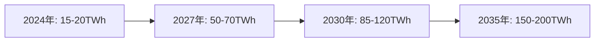
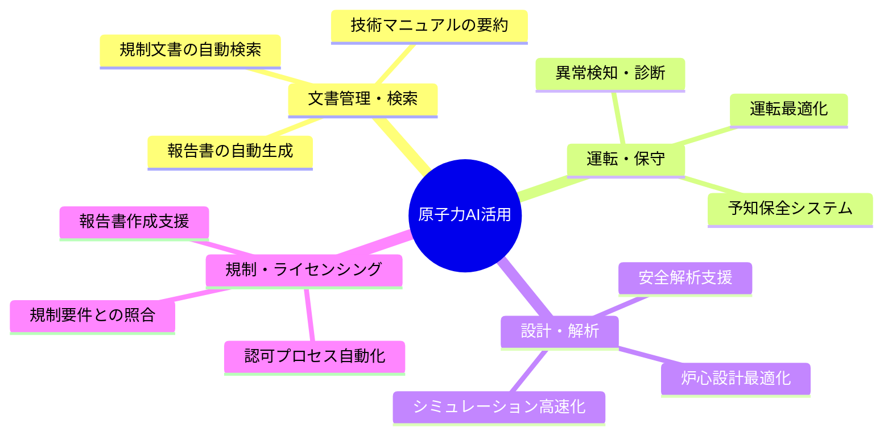
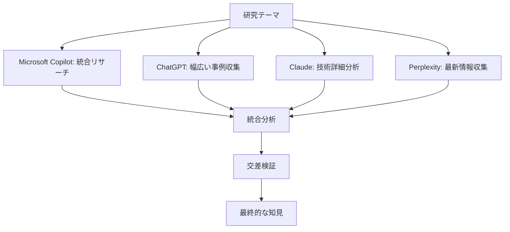
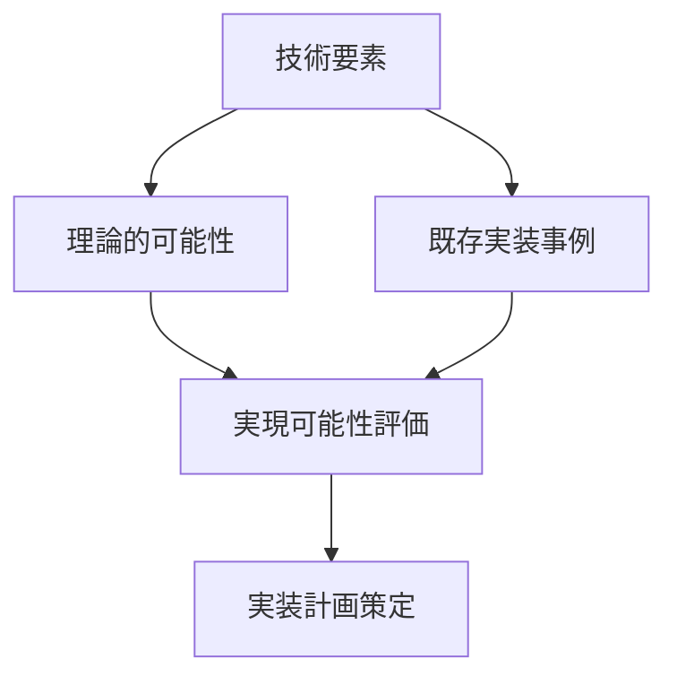

# 原子力産業を取り巻く変革の潮流

## 1.1 生成AIが切り拓く原子力産業の新地平

### 1.1.1 はじめに

2023年、ChatGPTの登場は産業界に激震を与えた。わずか2ヶ月で1億ユーザーを獲得したこの生成AIは、単なる技術革新を超えて、社会と産業のあり方そのものを変革する触媒となった。原子力産業も例外ではない。むしろ、その特殊性ゆえに、生成AIがもたらす変革の波は、他産業以上に大きなインパクトを持つ可能性を秘めている。

原子力学会の皆様、そして原子力発電に従事される技術者・研究者の皆様は、日々の業務において膨大な技術文書、複雑な規制要求、そして高度な安全性要件と格闘されていることでしょう。これらの課題に対し、生成AIは従来の枠組みを根本から変える解決策を提示している。

### 1.1.2 生成AI技術の急速な発展：2023年以降の劇的変化

#### ChatGPTショックとその波及効果

2022年11月30日、OpenAIがChatGPTを公開した瞬間から、世界は新たな技術革命の時代に突入した。従来のAIが「特定タスクの自動化」に留まっていたのに対し、生成AIは「知的作業の拡張」という全く新しい次元の可能性を示した。国際原子力機関（IAEA）も2022年に報告書で、AI技術が原子力分野の科学技術を加速させる可能性を指摘している[^1]。

原子力産業における反響も迅速だった。2024年の国際会議で報告された調査によれば、核工学コミュニティでは以下のような浸透が確認されている[^2]。

- **専門職の60-70%** が何らかの生成AIツールを使用経験あり
- **学生では90%以上** という驚異的な採用率
- 業務効率の加速効果は平均で **約5%**（先進的ユーザーは80-100%の生産性向上を報告）

#### 技術進化のスピード

生成AI技術の進化速度は、ムーアの法則を凌駕している。主要な技術的マイルストーンを見ると

```
2023年3月：GPT-4リリース（マルチモーダル対応）
2023年11月：GPT-4 Turbo（128kトークン対応）
2024年5月：GPT-4o（リアルタイム音声・画像処理）
2025年：原子力専用LLM（FERMI、bertha™）の実用化
```

特筆すべきは、汎用AIから**原子力特化型AI**への進化が、わずか2年で実現したことだ。これは、技術の成熟速度が従来の産業技術とは根本的に異なることを示している。

### 1.1.3 原子力産業が直面する根本的課題

#### 1. 膨大な文書管理の負担

原子力発電所は、世界で最も厳格に文書化された産業施設である。その規模は想像を絶する[^3][^4]。

- 米国連邦・州規制により**数十億ページ**に及ぶ技術文書の管理が義務化
- ディアブロキャニオン原発だけで**40年間に20億ページ**の文書が蓄積
- 年間**15,000時間**を文書検索に費やす（時給150ドルで計算すると225万ドル/年）

:::message
PG&Eの担当副社長は「運営上の問題発生時、必要な情報を見つけるまでに数時間から数日を要していた」と証言している。
:::

#### 2. 知識継承の危機

原子力産業は「シルバー津波」と呼ばれる深刻な人材問題に直面している。

- **熟練技術者の大量退職**：今後10年で現役技術者の30-40%が退職予定
- **若手人材の不足**：原子力工学専攻の学生数は1970年代の1/3以下
- **暗黙知の喪失**：40年以上の運転経験で蓄積された貴重なノウハウが文書化されずに失われる

#### 3. 効率化への圧力

競争的な電力市場において、原子力発電の経済性向上は死活問題となっている。

- **運転・保守コストの削減**要求（年率3-5%の効率化目標）
- **設備利用率の向上**（現在の90%から95%以上へ）
- **計画外停止の削減**（1基あたり年間数億円の機会損失）

### 1.1.4 AI電力需要の爆発的増加：新たなパラダイムシフト

#### データセンターの電力危機

生成AIの普及は、予想を超える速度で電力需要を押し上げている[^5][^6]。



Goldman Sachsの分析によれば、この需要を満たすためには
- 2030年までに**85-90GW**の新規電力容量が必要
- これは現在の米国原子力容量（100GW）の**約80%に相当**
- 従来の再生可能エネルギーだけでは、ベースロード需要を満たせない

#### 技術大手の原子力シフト

この危機感から、主要技術企業は原子力への大規模投資を開始している[^7][^8]。

| 企業 | 投資内容 | 規模 | 目標 |
|------|----------|------|------|
| Microsoft | Three Mile Island再稼働 | 16億ドル | 2028年運転開始（835MW） |
| Amazon | X-energy SMR開発 | 5億ドル | 2039年までに5GW |
| Google | Kairos Power契約 | 非公開 | 2030年代に500MW |
| Meta | 原子力RFP発行 | - | 2030年代初頭に1-4GW |

### 1.1.5 原子力とAIの相乗効果：Win-Winの関係構築

#### AIが原子力にもたらす価値

生成AIは原子力産業の根本的課題を解決する可能性を持つ。

**1. 文書管理の革命**
- 検索時間を時間単位から**秒単位**へ短縮
- 自然言語での質問に対する即座の回答
- 規制要件との自動照合

**2. 知識の永続化**
- ベテラン技術者の経験を**AIモデルに統合**
- 24時間365日アクセス可能な「デジタル専門家」
- 継続的な学習による知識の更新・拡張

**3. 運転・保守の最適化**
- 予知保全による**保守コスト30%削減**
- 異常検知の精度向上（誤報率90%削減）
- 最適運転パターンの自動提案

#### 原子力がAIにもたらす価値

逆に、原子力はAI産業にとって理想的なパートナーとなる。

**1. 安定的な電力供給**
- 24時間365日の**ベースロード電源**
- 気象条件に左右されない確実性
- 長期契約による価格安定性

**2. カーボンフリー電力**
- データセンターの**CO2排出ゼロ**を実現
- ESG投資家への訴求力
- 規制リスクの回避

**3. スケーラビリティ**
- SMRによる**モジュール型拡張**
- データセンター隣接立地の可能性
- 需要に応じた段階的増設

### 1.1.6 緊急性：なぜ今行動しなければならないのか

#### 限られた機会の窓

原子力×AI融合の機会は、以下の理由により**2025-2027年**が決定的に重要となる。国際エネルギー機関（IEA）も原子力のエネルギー転換における重要性を強調している[^9]。

**1. 技術的タイミング**
- 生成AI技術が実用段階に到達
- 原子力専用モデルの開発が本格化
- 統合プラットフォームの標準化が進行中

**2. 市場形成期**
- 年間成長率55%の急成長市場
- 主要プレイヤーがまだ確定していない
- 先行者利益を獲得できる最後のチャンス

**3. 規制環境の整備**
- 各国でAI規制枠組みが策定中
- 国際標準が未確定
- ルールメイキングに参画できる時期

#### 遅れることのコスト

この機会を逃した場合の損失は計り知れない。

:::message alert
- **技術覇権の喪失**：米中韓に決定的な差をつけられる
- **市場機会の逸失**：4,000-5,000億ドル市場でのシェアゼロ
- **人材流出の加速**：魅力的なプロジェクトを求めて海外へ
- **産業衰退の加速**：競争力を失い、廃炉一辺倒の未来
:::

### 1.1.7 まとめ：歴史的転換点に立つ我々

2025年の今、我々は原子力産業の歴史的転換点に立っている。生成AIという革命的技術と、エネルギー需要の構造的変化が重なるこの瞬間は、二度と訪れない。

日本の原子力産業には、世界最高水準の安全文化と技術力がある。不足しているのは、変革への決断と実行のスピードだけだ。この論文が示す世界の動向と日本の可能性を理解し、今すぐ行動を起こすことが、我々の世代に課せられた歴史的使命である。

## 1.2 本研究の目的と意義

### 1.2.1 研究の全体像

前節で示した通り、原子力×AI融合は単なる技術革新を超えて、エネルギー安全保障、気候変動対策、産業競争力強化という三つの重要課題を同時に解決する可能性を秘めている。本研究は、この歴史的機会を最大限に活用するための戦略的知見を提供することを目的とする。

### 1.2.2 国内外の生成AI活用事例の体系的整理

#### 包括的事例収集の必要性

現在、原子力分野における生成AI活用事例は世界中で急速に増加している。しかし、これらの情報は断片的に発表されることが多く、全体像を把握することは困難である。世界原子力協会（WNA）の技術レビューでも、この分野の技術発展の重要性が指摘されている[^10]。本研究では、以下の観点から体系的な整理を行う。

**地理的な網羅性**
- **北米**：米国の商用導入事例（ディアブロキャニオン原発等）
- **欧州**：フランス、ドイツ、英国の国家戦略と実装例
- **アジア太平洋**：日本、韓国、中国の技術開発動向
- **新興国**：原子力新興国での導入可能性

**技術分野別の分類**



**実装段階別の評価**
1. **概念実証（PoC）段階**：技術的可能性の検証
2. **パイロット段階**：限定的な実証試験
3. **商用展開段階**：本格的な運用開始
4. **大規模展開段階**：業界標準としての普及

#### 成功要因と失敗要因の分析

各事例について、以下の観点から詳細な分析を実施する。

**成功要因**
- 経営トップのコミットメント
- 段階的導入アプローチ
- 人材育成への投資
- 規制当局との早期連携

**失敗要因**
- 技術的課題への対応不足
- セキュリティ対策の不備
- 組織内での抵抗
- ROI（投資対効果）の不明確性

### 1.2.3 技術的実現可能性と安全性要件の分析

原子力分野におけるAI活用において最も重要なのは、技術的実現可能性と安全性要件の両立である。IEEE等の国際標準化機関でも、AI技術の安全な実装に関する基準策定が進められている[^11]。本研究では、以下の観点から包括的な分析を行う。

#### 技術的実現可能性の評価

**現在利用可能な技術**
- 大規模言語モデル（LLM）の文書処理能力
- コンピュータビジョンによる画像解析
- 機械学習による予測・最適化

**技術的限界と制約**
- 説明可能性（Explainable AI）の確保
- 検証・妥当性確認（V&V）の課題
- 物理法則との整合性維持

#### 安全性要件との整合性

**原子力特有の安全要件**
- Defense in Depth（多層防護）
- Single Failure Criterion（単一故障基準）
- Human Factors（ヒューマンファクター）考慮

**AI導入に伴う新たなリスク**
- アルゴリズムバイアスの影響
- サイバーセキュリティ脅威の拡大
- 過度の自動化による運転員スキル低下

### 1.2.4 日本の戦略的ポジショニングの検討

国際競争が激化する中で、日本の原子力産業が生成AI分野においてどのような戦略的ポジションを確立すべきかを検討する。

#### 日本の強み
- 世界最高水準の安全文化
- 福島廃炉での実証経験
- 製造業とのシナジー効果

#### 課題と機会
- 商用実装の遅れ
- 投資規模の不足
- アジア市場でのリーダーシップ可能性

### 1.2.5 政策提言と実行計画の策定

本研究の最終目標は、実効性のある政策提言と具体的な実行計画を策定することである。

#### 短期計画（2025-2026年）
- AI原子力推進本部の設置
- パイロットプロジェクトの開始
- 規制サンドボックス制度の導入

#### 中期計画（2027-2029年）
- 商用展開の本格化
- 人材育成プログラムの全国展開
- アジア市場への技術輸出

#### 長期ビジョン（2030年以降）
- 世界シェア15%の獲得
- 完全自律運転の段階的実現
- 1兆円規模の産業創出

### 1.2.6 本研究の学術的・社会的意義

#### 学術的意義

本研究は、原子力工学と人工知能という二つの先端技術分野を統合する学際的研究として、以下の学術的貢献を目指す。

1. **新たな研究領域の開拓**：原子力AI工学という新しい学問領域の基礎構築
2. **方法論の革新**：生成AIを活用した研究手法の確立
3. **知識体系の構築**：断片化された情報の体系的整理と理論化

#### 社会的意義

社会的には、以下の重要な意義を持つ。

1. **エネルギー安全保障の強化**：AI技術による原子力の安全性・効率性向上
2. **産業競争力の向上**：日本の原子力産業の国際競争力強化
3. **持続可能な発展への貢献**：カーボンニュートラル達成への道筋提示

### 1.2.7 まとめ

本研究は、原子力と生成AIの融合という歴史的機会を最大限に活用するための包括的な戦略を提示する。技術的可能性の分析から政策提言まで、学術的厳密さと実用性を両立させた研究として、我が国の原子力産業の未来に貢献することを目指す。

## 1.3 研究手法と調査範囲

### 1.3.1 革新的なAI活用研究アプローチ

本研究では、原子力×AI融合という最先端テーマを扱うにあたり、従来の文献調査手法を根本的に見直し、**生成AI自体を調査ツールとして活用する**という革新的なアプローチを採用した。これは「AIを使ってAIを研究する」メタ・アプローチであり、研究方法論そのものに新たな地平を開くものである。

### 1.3.2 複数の生成AIプラットフォームのディープリサーチ機能活用

#### マルチプラットフォーム戦略の設計

単一のAIプラットフォームに依存することのリスクを回避し、より包括的で信頼性の高い情報収集を実現するため、以下の4つの主要プラットフォームを戦略的に組み合わせた。



#### 各プラットフォームの特性と活用方針

**1. Microsoft Copilot**
**役割：**統合的リサーチと情報検証

**活用の理由**
- Bing検索エンジンとの統合によるリアルタイム情報アクセス
- 政府機関・国際機関の公式文書への直接アクセス
- 複数の情報源からの包括的な事実確認機能

**具体的な活用方法**
```
・政府エネルギー政策文書の最新版取得
・国際機関（IAEA、OECD/NEA）報告書の確認
・企業の最新プレスリリースと投資家向け情報
・規制当局の技術ガイドライン収集
```

**2. ChatGPT（OpenAI）**
**役割：**幅広い事例収集と初期動向分析

**活用の理由**
- 2021年9月までの膨大な学習データによる包括的知識
- 多言語対応による国際情報の収集
- 創造的な分析と仮説生成能力

**具体的な活用方法**
```
・世界各国の原子力AI事例の網羅的収集
・技術トレンドの整理と分類
・市場動向の初期分析
・仮説生成とシナリオ作成
```

**3. Claude（Anthropic）**
**役割：**技術詳細と安全性要件の深掘り分析

**活用の理由**
- 長文処理能力（100k+トークン）による詳細分析
- 安全性とリスクに関する高度な推論能力
- 技術文書の精密な解析能力

**具体的な活用方法**
```
・技術仕様書の詳細分析
・安全性要件の体系的整理
・規制文書の精密な解釈
・リスク評価の多角的検討
```

**4. Perplexity**
**役割：**最新情報の収集と事実確認

**活用の理由**
- リアルタイム検索機能による最新情報アクセス
- 情報源の明示による信頼性確保
- 企業発表や政府文書の即座のキャッチアップ

**具体的な活用方法**
```
・最新の投資動向と企業発表の追跡
・政府政策の変更点の把握
・技術的進展のリアルタイム監視
・事実確認とソース検証
```

#### 情報の交差検証プロセス

複数プラットフォームから得られた情報の信頼性を確保するため、以下の3段階検証プロセスを確立した。

**第1段階：プラットフォーム間の整合性確認**
- 同一事実に対する複数AI間での回答の比較
- 矛盾点の特定と追加調査の実施
- 不明確な点の明確化

**第2段階：一次資料との照合**
- AI回答の根拠となる元文書の確認
- 公式発表との整合性チェック
- 数値データの正確性検証

**第3段階：専門家による妥当性評価（実施予定）**
:::message
本段階はまだ未実施です。この講演を聞いていただいた専門家の皆様に、ぜひ評価していただきたいと考えております。
- 原子力専門家による技術的妥当性の確認
- AI専門家による技術解釈の検証
- 政策専門家による制度的側面の評価

ご協力いただける専門家の方は、著者までご連絡をお待ちしております。
:::

### 1.3.3 多角的情報収集アプローチ

#### 情報源の多様化

従来の学術論文中心のアプローチから脱却し、以下の多様な情報源を活用

**公式発表・政府文書**
- 各国政府のエネルギー政策文書
- 規制機関の技術ガイドライン
- 国際機関（IAEA、OECD/NEA）の報告書

**企業情報**
- 上場企業の投資家向け説明資料
- 技術企業の技術仕様書
- ベンダーの製品カタログ

**業界情報**
- 学会発表資料
- 業界団体の技術報告書
- 専門雑誌の記事

**リアルタイム情報**
- 企業プレスリリース
- ニュース報道
- SNS上の技術者による情報発信

#### 時系列分析の重視

生成AI技術の急速な進展を捉えるため、情報の時系列分析を重視

- 月次レベルでの技術進展の追跡
- 投資動向の四半期別分析
- 政策変更の即座の反映

### 1.3.4 理論と実践の統合分析手法

#### 技術的実現可能性の評価フレームワーク

理論的な技術可能性と実際の実装事例を統合的に分析するため、以下のフレームワークを開発



#### ビジネスモデル分析

技術論に留まらず、ビジネスモデルの観点からも分析

- 投資回収期間の算定
- リスク・リターン分析
- 市場規模の定量評価
- 競合他社との比較分析

### 1.3.5 品質保証と倫理的配慮

#### 情報の品質管理

生成AIを活用した研究における情報の品質を確保するため

**事実確認の徹底**
- 複数の独立した情報源による裏付け
- 数値データの一次資料への遡り
- 専門家による妥当性確認

**バイアスの排除**
- 複数のAIプラットフォームによる交差検証
- 多様な観点からの分析
- 反証可能性の確保

#### 倫理的配慮

研究倫理の観点から以下の配慮を実施

**プライバシーの保護**
- 個人情報を含むデータの除外
- 企業の機密情報への配慮
- 匿名化処理の実施

**知的財産権の尊重**
- 著作権のあるコンテンツの適切な引用
- 商標・特許情報の慎重な取り扱い
- 公正利用の原則の遵守

### 1.3.6 調査の限界と制約

#### 技術的限界

本研究手法には以下の限界があることを明記する。

**生成AIの制約**
- 学習データのカットオフ日による最新情報の欠如
- 幻覚（Hallucination）現象による誤情報の混入可能性
- 技術的専門性の深度における限界

**情報アクセスの制約**
- 機密性の高い技術情報への限定的アクセス
- 非公開データの利用不可
- 言語的制約による情報収集範囲の限定

#### 分析上の制約

**時間的制約**
- 急速に変化する技術動向への追従の困難
- 長期的な影響評価の不確実性
- 政策変更による前提条件の変化

**地理的制約**
- 国や地域による情報公開度の差異
- 文化的背景による解釈の相違
- 規制制度の多様性による比較の困難

### 1.3.7 まとめ

本研究では、生成AI自体を活用した革新的な研究手法により、従来では不可能だった包括的かつ迅速な情報収集・分析を実現した。複数のAIプラットフォームの組み合わせと厳格な検証プロセスにより、信頼性の高い知見を提供する。

ただし、本手法にも技術的・分析上の限界があることを認識し、これらの制約を踏まえた上で、**原子力×AI融合の未来像** を描いていく。次章では、この手法により収集・分析した世界の最新動向について詳述する。

---

## 参考文献

[^1]: International Atomic Energy Agency, "Artificial Intelligence for Accelerating Nuclear Applications, Science and Technology," IAEA Non-Serial Publications, Vienna, 2022.
URL: https://www.iaea.org/publications/15198/artificial-intelligence-for-accelerating-nuclear-applications-science-and-technology

[^2]: O. Pakari, A. Scolaro, C. Fiorina, "Generative AI tools in the nuclear engineering community: A survey-based evaluation of the current adoption and impacts," PHYSOR 2024, San Francisco, CA, April 21-24, 2024, pp. 1447-1456. 
URL: https://www.researchgate.net/publication/380603842_Generative_AI_tools_in_the_nuclear_engineering_community_A_survey-based_evaluation_of_the_current_adoption_and_impacts
[^3]: PG&E Corporation, "PG&E Launches First Commercial Deployment of On-Site Generative AI Solution for the Nuclear Energy Sector at Diablo Canyon," Press Release, November 13, 2024.
URL: https://investor.pgecorp.com/news-events/press-releases/press-release-details/2024/PGE-Launches-First-Commercial-Deployment-of-On-Site-Generative-AI-Solution-for-the-Nuclear-Energy-Sector-at-Diablo-Canyon/default.aspx
[^4]: L. Hahn, "For the First Time, Artificial Intelligence is Being Used at a Nuclear Power Plant: California's Diablo Canyon," The Markup, April 8, 2025. 
URL: https://themarkup.org/artificial-intelligence/2025/04/08/for-the-first-time-artificial-intelligence-is-being-used-at-a-nuclear-power-plant-californias-diablo-canyon
[^5]: Goldman Sachs Research, "AI is poised to drive 160% increase in data center power demand," 2024.
URL: https://www.goldmansachs.com/insights/articles/AI-poised-to-drive-160-increase-in-power-demand
[^6]: Goldman Sachs Research, "Generational Growth: AI, data centers and the coming US power demand surge," 2024.
URL: https://www.goldmansachs.com/insights/goldman-sachs-research/generational-growth-ai-data-centers-and-the-coming-us-power-demand-surge
[^7]: Constellation Energy, "Three Mile Island nuclear plant to reopen, sell power to Microsoft," September 20, 2024. Microsoft-Constellation Energy 20-year power purchase agreement.
URL: https://www.cnbc.com/2024/09/20/constellation-energy-to-restart-three-mile-island-and-sell-the-power-to-microsoft.html
[^8]: X-energy, "Amazon Invests in X-energy to Support Advanced Small Modular Nuclear Reactors and Expand Carbon-Free Power," October 16, 2024.
URL: https://x-energy.com/media/news-releases/amazon-invests-in-x-energy-to-support-advanced-small-modular-nuclear-reactors-and-expand-carbon-free-power
[^9]: International Energy Agency, "Nuclear Power and Secure Energy Transitions," World Energy Outlook Special Report, Paris, 2022.
URL: https://www.iea.org/reports/nuclear-power-and-secure-energy-transitions

[^10]: World Nuclear Association, "Nuclear Technology Review 2024," London, 2024.
URL: https://world-nuclear.org/information-library/facts-and-figures/nuclear-technology-review/

[^11]: IEEE Standards Association, "IEEE Standard for Artificial Intelligence Exchange and Service Tie to All Test Environments (AI-ESTATE)," IEEE Std 2857-2021, 2021.
URL: https://standards.ieee.org/ieee/2857/7515/