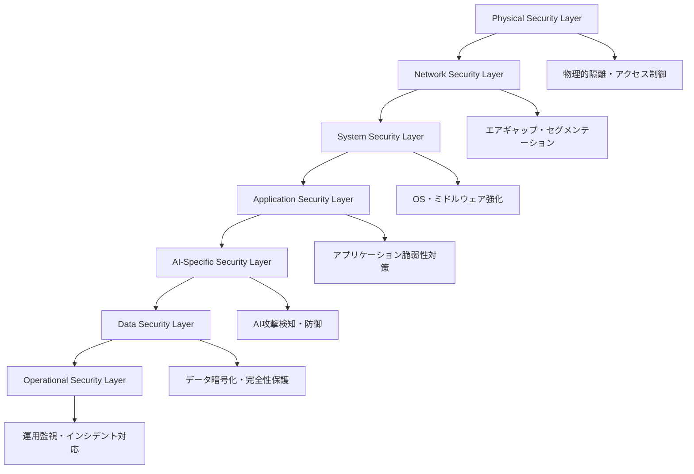

# 技術的課題と解決アプローチ：安全性確保から規制対応まで

第3章で分析した先端技術の実装と成果を受けて、本章では原子力分野における生成AI技術導入に伴う**技術的課題**と**規制上の課題**、そしてそれらに対する**体系的な解決アプローチ**を詳細に検討する[^38]。

原子力産業特有の高度な安全要求、厳格な規制環境、そして社会的責任の重大性により、AI技術の導入は他産業と比較して格段に高いハードルを越える必要がある。これらの課題を克服することで、原子力分野でのAI活用はより安全で信頼性の高いものとなり、産業全体の発展に貢献できる。

# 4.1 原子力特有の技術課題

## 4.1.1 説明可能性の確保（ブラックボックス問題）

### 課題の本質と原子力への影響

生成AIモデル、特に大規模言語モデル（LLM）や深層学習システムは、その内部動作が「ブラックボックス」となりやすい特性を持つ。原子力安全においては、**あらゆる判断に明確な根拠が必要**であり、システムの判断根拠が説明できないことは致命的な問題となる[^39]。

```
説明可能性の技術的要求:
├── 意思決定プロセスの透明性
│   ├── AIがなぜその結論に至ったかの明示
│   ├── 判断に使用したデータと重み付けの開示
│   └── 推論過程の可視化・追跡可能性
├── 規制当局への説明責任
│   ├── 安全評価の根拠提示
│   ├── リスク評価の妥当性証明
│   └── 異常判定の理由説明
└── 運転員の理解と信頼
    ├── AIの提案に対する納得感
    ├── 緊急時の迅速な判断支援
    └── 人間とAIの協調動作
```

### 解決アプローチの詳細

**1. Explainable AI（XAI）技術の統合実装**

原子力分野では、複数のXAI技術を組み合わせた多層的な説明システムが必要である[^40]。

:::message
**XAI（Explainable Artificial Intelligence）技術の定義と重要性**

XAI（説明可能なAI）とは、「機械学習アルゴリズムによって生成された結果と出力を、人間のユーザーが理解し信頼できるようにするプロセスと手法のセット」である。米国防高等研究計画局（DARPA）は2015年にXAIプログラムを策定し、2017年から4年間の研究プログラムを開始した。

DARPAのXAIプログラムの目標は以下の通りである：
- 高い学習性能（予測精度）を維持しながら、より説明可能なモデルを生成する
- 人間のユーザーが新世代の人工知能パートナーを理解し、適切に信頼し、効果的に管理できるようにする

XAIは以下の3つの原則に従う：
1. **透明性（Transparency）**: 訓練データからモデルパラメータを抽出し、テストデータからラベルを生成するプロセスが、アプローチ設計者によって記述・動機付けできる
2. **解釈可能性（Interpretability）**: 機械学習モデルを理解し、意思決定の根拠を人間が理解できる方法で提示できる可能性
3. **説明可能性（Explainability）**: AIがどのようにしてその結果に至ったかを説明し、観察者が決定の原因を理解できる程度

原子力安全のような安全クリティカルなアプリケーションでは、リスク管理、説明責任の確保、高リスク環境での適切な人間の監督を維持するために、AI意思決定の理解が不可欠である。透明性がなければ、安全管理者はリスク予測や危険検知においてAIに依存することを躊躇し、責任問題や結果の誤解を恐れることになる。
:::

原子力分野では、複数のXAI技術を組み合わせた多層的な説明システムが必要である。

- **SHAP（SHapley Additive exPlanations）**
  - ゲーム理論に基づく特徴量の重要度評価
  - グローバルとローカルな説明の両方を提供
  - 安全解析における要因分析への活用実績

- **LIME（Local Interpretable Model-agnostic Explanations）**
  - 個別の予測に対する局所的な説明を提供
  - モデルに依存しない汎用的アプローチ
  - 原子力システムの異常検知への適用可能性

- **注意機構可視化技術**
  - Transformerモデルの注意重みの可視化
  - 文書解析におけるキーワード抽出
  - 運転手順書の重要箇所特定

**2. 階層的説明システムの構築**

異なるステークホルダーに対して適切なレベルの説明を提供する[^41]。

| ステークホルダー | 説明レベル | 要求される内容 |
|-----------------|------------|----------------|
| **技術者** | 詳細技術説明 | アルゴリズムレベルの詳細、数式・統計的根拠 |
| **運転員** | 実用的説明 | 直感的理解、異常原因と推奨対応、信頼度表示 |
| **規制当局** | 包括的説明 | 完全なトレーサビリティ、第三者検証可能な文書化 |

### 実装における技術的考慮事項

**リアルタイム説明生成の実現**

原子力プラントでは迅速な意思決定が求められるため、以下のアプローチを採用

1. **事前計算による高速化**
   - 典型的シナリオの説明テンプレート化
   - 重要特徴量の事前抽出・インデックス化
   - 説明データベースの最適化

2. **段階的詳細化機能**
   - 初期段階：簡潔な要約説明（1-2秒で生成）
   - 要求に応じた詳細展開（5-10秒で詳細化）
   - ドリルダウン可能な階層構造

## 4.1.2 安全性・信頼性の保証

### 深層防護とAIの統合

原子力安全の基本原則である **深層防護（Defense in Depth）** をAIシステムに適用した統合的アプローチが不可欠である[^42]。

```
深層防護の各層でのAI活用:
├── 第1層：異常発生の防止
│   ├── 予知保全AI：機器故障の事前予測
│   ├── 運転最適化AI：効率的で安全な運転支援
│   └── 品質管理AI：燃料・材料の品質監視
├── 第2層：異常の早期検知
│   ├── 異常検知AI：マルチモーダルデータの統合分析
│   ├── パターン認識AI：微小な兆候の増幅・可視化
│   └── 診断AI：異常の原因特定・分類
├── 第3層：事故への拡大防止
│   ├── 制御支援AI：最適な対応手順の提案
│   ├── シナリオ予測AI：複数展開パスの影響評価
│   └── リスク評価AI：動的なリスク定量化
├── 第4層：過酷事故の影響緩和
│   ├── 事故対応AI：リアルタイム事故進展予測
│   ├── 緩和策AI：最適な緩和策の探索・提案
│   └── 避難計画AI：動的避難計画の最適化
└── 第5層：放射性物質放出時の対応
    ├── 環境評価AI：拡散予測・線量評価
    ├── 対応支援AI：多言語での情報発信支援
    └── 影響評価AI：長期環境影響の評価・予測
```

### フェイルセーフ設計の実装

**AI故障時の安全側動作メカニズム**

```
フェイルセーフ階層設計:
├── レベル1：自己診断による異常検出
│   ├── 内部一貫性チェック：出力値の論理整合性確認
│   ├── 計算リソース監視：CPU/GPU/メモリ使用状況
│   └── 通信状態確認：ネットワーク・データ転送状況
├── レベル2：安全側への自動移行
│   ├── 保守的運転モード：出力制限・安全余裕拡大
│   ├── 冗長システム起動：バックアップAIの自動切替
│   └── 警報発報：運転員への即座の状況通知
└── レベル3：完全手動制御
    ├── AI機能の完全遮断：自動機能の全停止
    ├── 従来制御系への切替：レガシーシステム復活
    └── 運転員への完全委譲：人間による直接制御
```

### 多重性・多様性・独立性の確保

原子力安全の三原則をAIシステムに適用[^43]

**多重性（Redundancy）**
- 同一機能の複数AI実装（N+1冗長構成）
- 負荷分散と相互バックアップ体制
- 故障時の自動切替メカニズム

**多様性（Diversity）**
- 異なる開発チーム・手法によるAI開発
- 異なるアルゴリズム・アーキテクチャの併用
- 独立したデータソース・訓練データの利用

**独立性（Independence）**
- 物理的分離：独立した計算リソース・ネットワーク
- 論理的分離：独立したOS・ミドルウェア環境
- 共通原因故障の排除：異なる故障モードの確保

## 4.1.3 検証・妥当性確認（V&V）方法論

### AI特有のV&V要素

従来のソフトウェアと異なり、AIシステムには**動的な学習・適応能力**があるため、新たなV&V方法論が必要である[^44]。

```
AI統合V&Vフレームワーク:
├── データ品質の検証
│   ├── 訓練データの代表性・完全性
│   ├── バイアスの検出と定量化
│   ├── データの時間的・空間的カバレッジ
│   └── データ品質メトリクスの継続監視
├── モデル性能の検証
│   ├── 精度・再現率・F値の多角的評価
│   ├── ロバスト性テスト：ノイズ・攻撃への耐性
│   ├── エッジケース対応：境界条件での性能
│   └── 不確実性定量化：予測信頼区間の評価
├── 統合システムの妥当性確認
│   ├── 既存システムとの相互作用テスト
│   ├── 性能要求の充足性確認
│   ├── 運用シナリオでの総合動作確認
│   └── 非機能要件の検証：レスポンス時間等
└── 継続的V&V
    ├── オンライン性能モニタリング
    ├── 概念ドリフト検出と対応
    ├── 定期的なモデル再評価・再訓練
    └── V&V結果の長期トレンド分析
```

### 段階的検証アプローチ

**Phase 1: データ・モデル検証（開発段階）**
- トレーニングデータの品質保証
- 独立テストデータによる性能検証
- クロスバリデーション・統計的検証

**Phase 2: システム統合検証（統合段階）**
- 既存システムとのインターフェース検証
- エンドツーエンドのシナリオテスト
- 負荷テスト・ストレステスト

**Phase 3: 運用時検証（運用段階）**
- リアルタイム性能監視
- A/Bテストによる比較検証
- インシデント後の事後検証

## 4.1.4 物理法則との整合性維持

### Physics-Informed AI の実装

原子力システムでは、AIの判断が物理法則に矛盾してはならない。 **Physics-Informed Neural Networks（PINNs）** の活用により、物理制約を満たすAIシステムを構築する[^45]。

**基本方程式の統合**
```
物理法則統合AI:
├── 中性子物理
│   ├── 中性子拡散方程式の直接統合
│   ├── 臨界性・反応度の物理的制約
│   └── 燃焼・同位体変化の時間発展
├── 熱流動現象
│   ├── 熱伝導方程式・対流項の統合
│   ├── エネルギー保存則の厳密保証
│   └── 相変化・二相流の物理的制約
├── 構造力学
│   ├── 応力-ひずみ関係の統合
│   ├── 材料特性の温度・照射依存性
│   └── 疲労・クリープ現象のモデル化
└── システム動力学
    ├── 制御システムの動的応答
    ├── プラント全体の物質・エネルギー収支
    └── 安全系統の作動論理
```

### 制約充足・最適化手法

**制約プログラミングとの統合**
- 物理的制約条件の明示的定義
- 制約違反の自動検出・修正
- 最適解の物理的妥当性保証

# 4.2 規制・標準化の課題

## 4.2.1 国際規制協調の進展

### 歴史的転換点：NRC-ONR-CNSC三者協力

2024年9月5日、**世界初の原子力AI規制に関する国際協力**として、米国NRC（原子力規制委員会）、英国ONR（原子力規制庁）、カナダCNSC（原子力安全委員会）による**三者共同原則文書**「Considerations for developing artificial intelligence systems in nuclear applications」が発表された[^46]。

### 三者共同原則の核心要素

```
NRC-ONR-CNSC共同原則（2024年9月）:
├── 基本理念
│   ├── 原子力安全の最優先：Safety-First Principle
│   ├── 段階的技術導入：Phased Implementation
│   ├── 革新と安全のバランス：Innovation-Safety Balance
│   └── 透明性と予測可能性：Regulatory Certainty
├── 技術基準の調和
│   ├── AI安全性評価手法の共通化
│   ├── V&V方法論の統一・相互認証
│   ├── サイバーセキュリティ基準の協調
│   └── 品質保証プロセスの標準化
├── 規制プロセスの効率化
│   ├── 段階的承認プロセスの標準化
│   ├── 規制サンドボックス制度の導入
│   ├── 国際的な審査情報共有
│   └── 専門家交流プログラムの拡充
└── 継続的協力枠組み
    ├── 年次規制協議の定例化
    ├── 新技術動向の共同監視
    ├── 新興課題への協調対応
    └── 第三国への指導・技術移転
```

### 段階的実装アプローチの国際標準化

**3段階承認プロセスの確立**

三者合意により、AI導入における標準的な承認プロセスが確立された[^47]。

| 段階 | 期間 | 評価内容 | 承認基準 |
|------|------|----------|----------|
| **段階1：概念設計審査** | 3-6ヶ月 | AI技術の基本適用性、既存システム影響分析 | 基本安全性確認 |
| **段階2：詳細設計審査** | 6-12ヶ月 | V&V計画、人間-AI協調設計、フェイルセーフ機能 | 技術的適切性確認 |
| **段階3：実装審査** | 3-9ヶ月 | 実運用環境での安全性実証、緊急時対応計画 | 運用安全性確認 |

## 4.2.2 AI専用規制ガイドラインの必要性

### 従来規制体系の限界

原子力規制の伝統的アプローチは**決定論的システム**を前提としているが、AIシステムは本質的に**確率論的**であり、**動的に変化する**特性を持つ[^48]。

**従来規制 vs AI技術の相違点**

| 観点 | 従来規制の前提 | AI技術の特性 | 必要な対応 |
|------|---------------|--------------|------------|
| **動作特性** | 決定論的（同一入力→同一出力） | 確率論的（統計的予測） | 確率的評価手法 |
| **システム変化** | 静的（設計固定） | 動的（学習・適応） | 継続的監視・更新 |
| **検証可能性** | 網羅的テスト可能 | 完全テスト困難 | 統計的検証手法 |
| **透明性** | 理解可能な設計 | ブラックボックス | 説明可能性確保 |

### AI専用ガイドラインの要素

**技術要件**
```
AI専用規制ガイドライン:
├── AI安全機能分類
│   ├── 安全関連機能（Safety-Related）：最高水準要求
│   ├── 安全重要機能（Safety-Significant）：高水準要求  
│   ├── 運用支援機能（Operational Support）：標準要求
│   └── 管理支援機能（Administrative Support）：基本要求
├── 開発プロセス要件
│   ├── 要求仕様の明確化・トレーサビリティ
│   ├── データ品質保証・バイアス対策
│   ├── モデル選択・訓練プロセスの文書化
│   └── 独立検証・妥当性確認の実施
├── 運用管理要件
│   ├── 性能監視・劣化検知システム
│   ├── 人間監督・介入機能の確保
│   ├── インシデント対応・報告体制
│   └── 定期的評価・更新プロセス
└── セキュリティ要件
    ├── データ保護・プライバシー確保
    ├── 敵対的攻撃への防御機能
    ├── システム完全性の継続監視
    └── セキュリティインシデント対応
```

## 4.2.3 国際標準化の動向

### IEEE標準の開発状況

**IEEE 1633改訂：AI対応電気・電子機器要件**

IEEE Nuclear Standards Committee（NSC）による改訂作業が進行中[^49]。

- **IEEE 1633-2025改訂版**（2025年6月完了予定）
  - AI統合システムの安全要件
  - 人間-AI協調設計基準
  - サイバーセキュリティ強化要件
  - 品質保証プロセス詳細化

**新規標準の開発**
- **IEEE 2863**：原子力AI安全性評価標準（2025年12月策定予定）
- **IEEE 7010-Nuclear**：原子力AI倫理設計標準（2026年6月策定予定）
- **IEEE 2857**：原子力AIサイバーセキュリティ標準（2026年12月策定予定）

### ISO/IEC標準の動向

**ISO 19443改訂：原子力AI品質管理システム**

ISO/TC 85（原子力技術）による品質管理標準の拡張[^50]。

- AI開発プロセス管理要件
- AI運用管理・性能監視要件
- 供給者管理・調達プロセス要件
- 継続的改善・監査要件

# 4.3 サイバーセキュリティ対策

## 4.3.1 サイバーセキュリティ対策の高度化

### AI時代のセキュリティパラダイムシフト

原子力AIシステムは、従来のサイバーセキュリティに加えて**AI特有の新たな脅威**に対応する必要がある[^51]。

```
原子力AIセキュリティの脅威分類:
├── 従来型サイバー脅威
│   ├── ネットワーク侵入・マルウェア感染
│   ├── データ窃取・改ざん・破壊
│   ├── サービス妨害（DoS/DDoS）攻撃
│   └── 内部脅威・特権濫用
├── AI特有の新興脅威
│   ├── 敵対的攻撃（Adversarial Attack）
│   │   ├── 入力データの巧妙な改ざん
│   │   ├── モデルの誤分類・誤判断誘導
│   │   └── 物理世界でのAdversarial Example
│   ├── モデル盗用・逆解析攻撃
│   │   ├── 訓練データの逆推定
│   │   ├── モデルアーキテクチャの盗用
│   │   └── 知的財産の不正取得
│   ├── データポイズニング攻撃
│   │   ├── 訓練データへの悪意あるデータ混入
│   │   ├── バックドア攻撃・トリガー埋込
│   │   └── モデル性能の意図的劣化
│   └── プライバシー侵害攻撃
│       ├── 会員推論攻撃（Membership Inference）
│       ├── 属性推論攻撃（Attribute Inference）
│       └── モデル反転攻撃（Model Inversion）
└── 複合型高度脅威
    ├── AI・従来システム連携攻撃
    ├── 多段階・持続的攻撃（APT）
    ├── サプライチェーン攻撃
    └── 国家レベル・組織的攻撃
```

### 多層防護セキュリティアーキテクチャ

**深層防護セキュリティの実装**



### AI特有の防御技術

**敵対的攻撃への対策**

1. **Adversarial Training（敵対的訓練）**
   - 敵対的サンプルを含めた頑健な訓練
   - データ拡張による汎化性能向上
   - 防御的蒸留（Defensive Distillation）の適用

2. **入力前処理・検証**
   - 統計的異常検知による入力監視
   - 物理的制約に基づく妥当性検証
   - 多重センサーによる相互検証

3. **モデル防御機能**
   - 予測信頼度の厳密な評価
   - 不確実性定量化による異常検知
   - アンサンブル学習による頑健性向上

## 4.3.2 エアギャップ設計と多層防護

### 原子力特化エアギャップアーキテクチャ

**完全物理分離システムの設計**

```
エアギャップ多層防護:
├── レベル1：物理的完全分離
│   ├── 専用建屋・施設での隔離設置
│   ├── 電磁波遮蔽（TEMPEST対策）
│   ├── 振動・音響漏洩対策
│   └── 電源・接地系統の独立化
├── レベル2：ネットワーク完全遮断
│   ├── 有線・無線通信の物理遮断
│   ├── 外部媒体接続の禁止
│   ├── Bluetooth・WiFi機能の無効化
│   └── 一方向データ転送システム
├── レベル3：データ統制管理
│   ├── データ持込・持出の厳格管理
│   ├── 暗号化・デジタル署名の必須化
│   ├── データ系譜・監査証跡の記録
│   └── 定期的なデータ完全性検証
└── レベル4：人的セキュリティ管理
    ├── 厳格な身元調査・適格性審査
    ├── 最小権限原則・職責分離
    ├── 継続的な監視・行動記録
    └── 定期的な再審査・更新
```

### セキュアな運用管理体制

**24時間365日監視システム**

- **SOC（Security Operation Center）** の設置
- **SIEM（Security Information and Event Management）** による統合監視
- **AIベース異常行動検知** システムの導入
- **インシデント対応チーム** の常時待機体制

# 4.4 課題解決への統合アプローチ

## 4.4.1 技術・規制・セキュリティの統合戦略

### 総合的リスク管理フレームワーク

```
統合リスク管理:
├── 技術リスク管理
│   ├── AI性能劣化・ドリフトの監視
│   ├── 説明可能性・透明性の確保
│   ├── 物理法則整合性の維持
│   └── V&V・品質保証の継続実施
├── 規制リスク管理
│   ├── 規制要求への適合性確保
│   ├── 承認プロセスの効率化
│   ├── 国際標準との整合性確保
│   └── 規制変更への迅速対応
├── セキュリティリスク管理
│   ├── サイバー攻撃への防御
│   ├── データ保護・プライバシー確保
│   ├── 内部脅威・人的リスク対策
│   └── サプライチェーンセキュリティ
└── 運用リスク管理
    ├── 人間-AI協調の最適化
    ├── 組織能力・人材育成
    ├── 継続的改善・学習体制
    └── ステークホルダー関係管理
```

## 4.4.2 今後の技術開発方向

### 2025-2030年の重要な発展領域

**短期的優先事項（2025-2027年）**

1. **説明可能AIの実用化**
   - リアルタイム説明生成技術の完成
   - 多様なステークホルダー向け説明システム
   - 説明品質の定量評価手法確立

2. **標準化・規制整備の加速**
   - IEEE/ISO/IEC標準の策定完了
   - 各国規制ガイドラインの統一化
   - 相互認証制度の本格運用

3. **セキュリティ対策の高度化**
   - AI特有脅威への防御技術確立
   - ゼロトラスト・アーキテクチャの導入
   - 量子暗号通信の実用化検討

**中長期的展望（2028-2030年）**

1. **自律的品質管理システム**
   - AI自身による性能監視・診断
   - 自動的なモデル更新・最適化
   - 予防的セキュリティ対策

2. **量子AI技術の統合**
   - 量子機械学習の原子力応用
   - 量子暗号によるセキュリティ強化
   - 量子シミュレーションとの融合

## まとめ

本章で分析した技術的課題と規制上の課題は、原子力分野における生成AI導入の成功を左右する重要な要因である。これらの課題に対する体系的な解決アプローチを実装することで、**安全で信頼性が高く、規制に適合したAIシステム**の構築が可能となる。

特に重要なのは、**技術・規制・セキュリティの三位一体**でのアプローチである。個別の課題解決ではなく、統合的なリスク管理フレームワークの下で、持続可能なAI導入戦略を推進することが、原子力産業の発展と社会的受容性の向上に寄与する。

次章では、これらの技術的基盤を踏まえて、原子力AI導入による経済効果と投資動向について詳細に分析する。

---

**参考文献**

[^38]: O. Pakari, A. Scolaro, C. Fiorina, "Generative AI tools in the nuclear engineering community: A survey-based evaluation of the current adoption and impacts," PHYSOR 2024, San Francisco, CA, April 21-24, 2024, pp. 1447-1456.

[^39]: D. Gunning, M. Stefik, J. Choi, T. Miller, S. Stumpf, G. Yang, "XAI—Explainable artificial intelligence," Science Robotics, Vol. 4, No. 37, eaay7120 (2019).

[^40]: S. M. Lundberg, S. Lee, "A unified approach to interpreting model predictions," Advances in Neural Information Processing Systems, Vol. 30, pp. 4765-4774 (2017).

[^41]: 原子力AI説明可能性技術ガイドライン, 日本原子力学会 (2024).

[^42]: International Atomic Energy Agency, "Defence in Depth in Nuclear Safety," INSAG-10, Vienna (1996).

[^43]: International Atomic Energy Agency, "Application of the Single Failure Criterion," Safety Guide No. NS-G-1.2, Vienna (2000).

[^44]: IEEE Standard for Software Verification and Validation, IEEE Std 1012-2016, IEEE Computer Society (2017).

[^45]: M. Raissi, P. Perdikaris, G. Karniadakis, "Physics-informed neural networks: A deep learning framework for solving forward and inverse problems involving nonlinear partial differential equations," Journal of Computational Physics, Vol. 378, pp. 686-707 (2019).

[^46]: NRC, ONR, CNSC, "Considerations for developing artificial intelligence systems in nuclear applications," Trilateral Principles Paper, September 5, 2024.
URL: https://www.onr.org.uk/news/all-news/2024/09/new-paper-shares-international-principles-for-regulating-ai-in-the-nuclear-sector/

[^47]: "Guidelines drawn up for AI use in nuclear sector," World Nuclear News, September 5, 2024.
URL: https://www.world-nuclear-news.org/articles/guidelines-drawn-up-for-ai-use-in-nuclear-sector

[^48]: "UK, US, and Canada Release Trilateral Principles for AI Use in Nuclear Sector," BABL AI, September 2024.
URL: https://babl.ai/uk-us-and-canada-release-trilateral-principles-for-ai-use-in-nuclear-sector/

[^49]: IEEE Standards Association, "Nuclear Standards Committee AI Working Group Reports" (2024).

[^50]: International Organization for Standardization, "Quality assurance programmes for nuclear installations," ISO 19443:2018, Geneva (2018).

[^51]: International Atomic Energy Agency, "Computer Security at Nuclear Facilities," Nuclear Security Series No. 17, Vienna (2011).