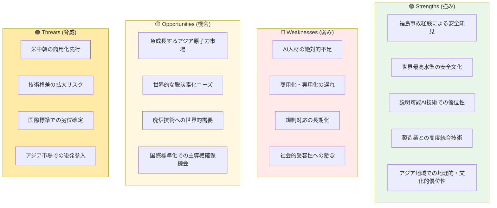

# 日本の戦略的提言：世界一安全な原子力AIを目指した包括的行動計画

## ⚡ 本書のキーポイント：戦略決定に際し考慮すべき3つの事実

:::message
**1. 時間的緊急性**：2025-2027年が競争力確保の「勝負の3年間」
**2. 日本の独自優位性**：福島経験から生まれた「世界一安全」の実現可能性
**3. 市場機会**：急成長するアジア原子力AI市場での先行者利益獲得チャンス
:::

第6章で明らかとなった日本の現状分析を踏まえて、本章では日本が原子力AI分野で世界的リーダーシップを確立するための**包括的戦略的提言**を提示する[^82]。これは単なる技術開発計画ではなく、2025-2027年の「勝負の3年間」で決定的な競争優位を確保し、2030年以降の長期的繁栄を実現するための国家レベルの戦略的行動計画である。

**戦略の核心**は「世界一安全な原子力AI」の実現であり、福島事故の教訓、世界最高水準の安全文化、説明可能AI技術での優位性を統合した日本独自のポジションを築くことにある。この戦略は技術的優位性のみならず、社会的受容性、経済的競争力、国際的影響力を同時に確保する統合的アプローチであり、持続可能なエネルギー社会の実現に向けた日本の歴史的使命である。

**意思決定者への問いかけ**：米中韓が商用化を本格展開する中、日本が1年遅れることは10年の劣位を意味する。今、決断するか、永続的に追随者になるか。選択の時である。

原子力学会会員および産業関係者にとって、本章の提言は今後10年間の技術開発方針、投資判断、国際展開戦略を策定する上で不可欠な戦略的指針となる。

# 7.1 戦略ビジョンの策定

## 7.1.1 「世界一安全な原子力AI」の実現

### 戦略的コンセプトの確立

「世界一安全な原子力AI」は、日本の原子力AI戦略の最重要目標であり、他国との明確な差別化を実現する戦略的コンセプトである。福島第一原子力発電所事故から得た世界唯一の実経験を、**世界最大の競争優位の源泉**として戦略的に転換し、世界最高水準の安全文化、そして説明可能AI技術での優位性を統合することで、安全性において他の追随を許さない原子力AIシステムを構築する[^83]。

### 🔄 福島経験の戦略的価値転換

:::message
**福島廃炉AI技術群の輸出可能価値への転換**
福島事故対応で培った技術を「日本の弱み」から「世界最大の強み」へ
:::

#### 福島廃炉AIの核心技術群
- **極限環境AIオペレーション技術**: 高放射線環境での自律的データ収集・分析
- **遠隔操作AI統合制御技術**: 複数ロボット・センサーの協調制御システム
- **汚染状況リアルタイムマッピング技術**: AI画像解析による汚染状況の瞬時把握
- **予期せぬ事態対応AI**: 想定外シナリオへの自律的対応アルゴリズム

#### 国際展開戦略への転換
1. **廃炉ビジネス市場創出**: 世界70基の廃炉予定原発への技術輸出
2. **極限環境産業への応用**: 深海探査、宇宙開発、災害対応への技術展開
3. **レジリエンス技術の標準化**: 「世界一レジリエント」技術基準の国際標準化
4. **教育・コンサルティング事業**: 福島経験を活かした国際人材育成

### 「世界一安全」から「世界一レジリエント・世界一クリーン」への拡張

:::warning
**新しい価値軸の提案により、日本が価値基準のリーダーとなる戦略**
:::

#### 三次元安全価値基準の確立

**世界一安全** - 従来の安全性概念の極限追求
- **システム信頼性**: 極めて高い稼働率（世界最高水準）
- **AI固有安全性**: 高精度判断システム、極小誤判定率
- **故障率**: 従来システム比大幅削減
- **復旧時間**: 迅速復旧システム

**世界一レジリエント** - 予期せぬ事態への対応力・迅速復旧力
- **想定外対応**: 福島経験を活かした想定外シナリオへの自律対応
- **多重防護AI**: システム障害時の瞬時バックアップ切替
- **学習継続**: 異常事象からの継続的学習・改善機能
- **迅速復旧**: 障害発生から正常運転復帰までの時間最小化

**世界一クリーン** - ライフサイクル全体での環境負荷最小化
- **CO2削減最大化**: AIによる最適運転での最大限CO2削減
- **廃棄物最小化**: 核燃料利用率最適化による高レベル廃棄物削減
- **循環型運転**: 廃炉から新設までの資源循環最適化
- **生態系保護**: 温排水・放射線影響の最小化

#### 日本の製造業統合優位戦略

**ハードウェア×ソフトウェア統合優位性**
```
日本独自の原子力インテリジェントシステム:
├── 高信頼性センサー技術（日本製造業の強み）
├── 精密ロボティクス技術（産業用ロボット世界シェア）
├── 生成AIソフトウェア（説明可能AI技術）
└── 統合システム管理（IoT・DX技術活用）
```

### 多層防護システムの技術実装

```
日本の原子力AI安全防護システム:
├── 深層防護原則の適用：多層安全バリア設計
├── AI統合安全系：従来安全系とのハイブリッド運用
├── 異常検知・予測：AI による早期警告システム
├── ヒューマンファクター重視：最終判断は常に人間が実施
└── 継続的監視：リアルタイム性能モニタリング
```

### 段階的自動化レベル

**レベル1: 情報提供**（2025年開始）
- AI機能: データ分析・情報提供のみ
- 人間役割: 全判断・操作を人間が実施
- 適用範囲: 非安全系の情報系統

**レベル2: 判断支援**（2026年開始）
- AI機能: 判断選択肢の提案・評価
- 人間役割: 最終判断・操作は人間
- 適用範囲: 運転支援・保全計画

**レベル3: 部分自動**（2027年開始）
- AI機能: 定型的判断・操作の自動実行
- 人間役割: 監視・承認・例外対応
- 適用範囲: 通常運転の一部

**レベル4: 高度自動**（2030年以降）
- AI機能: 複雑判断・操作の自動実行
- 人間役割: 高次監視・戦略的判断
- 適用範囲: 通常運転の大部分

## 7.1.2 説明可能性での世界リーダーシップ

### 説明可能AI技術の戦略的優位性

説明可能AI（XAI）技術は、日本が原子力AI分野で世界をリードできる最も有力な技術領域である。福島事故の教訓から生まれた「完全な透明性」への要求、日本の研究機関における理論的先進性、そして原子力特有の高い説明責任要求が組み合わさることで、他国では実現困難な「100%説明可能な原子力AI」の実現が可能となる[^84]。

### 多層説明アーキテクチャ

#### レイヤー1: 技術者向け詳細説明
- **完全技術情報**: 使用アルゴリズム、全パラメータ値、学習データの完全説明
- **数学的根拠**: AI判断の数学的表現、統計的信頼度、不確実性定量化

#### レイヤー2: 運転員向け実用説明
- **操作支援情報**: AI判断の簡潔な要約、重要因子、具体的推奨操作
- **直感的表示**: グラフィック、色分け、アニメーション、アラート

#### レイヤー3: 管理者向け統合説明
- **戦略的情報**: プラント全体状況俯瞰、影響分析、総合リスク評価
- **意思決定支援**: 複数選択肢とその評価、トレードオフ分析

#### レイヤー4: 市民向け平易説明
- **一般理解用**: 専門用語を使わない説明、身近な例、分かりやすい図解
- **教育的価値**: 段階的理解促進、関連基礎知識提供

### 📊 日本の原子力AI戦略 SWOT分析



### 🎯 戦略的位置づけマッピング

| 戦略軸 | 日本 | 米国 | 中国 | 韓国 |
|--------|------|------|------|------|
| **安全性・信頼性** | 🟢 最高 | 🟡 高 | 🔴 中 | 🟡 高 |
| **説明可能性** | 🟢 最高 | 🟡 中 | 🔴 低 | 🟡 中 |
| **商用化進度** | 🔴 遅れ | 🟢 先行 | 🟢 先行 | 🟡 中 |
| **技術統合力** | 🟢 最高 | 🟡 高 | 🟡 中 | 🟡 中 |
| **市場展開力** | 🔴 弱 | 🟢 強 | 🟢 強 | 🟡 中 |

### 国際標準化戦略

**確認された国際標準活動**
- **ISO/IEC 23053**: AI安全性要求事項（2022年発行、機械学習システムフレームワーク）
- **IAEA TECDOC**: 原子力AI利用指針開発（2024年技術会議での指針策定活動）
- **G7広島AIプロセス**: 透明性・説明可能性の国際原則策定（日本主導）

## 7.1.3 段階的実装による信頼構築

### リスクベース段階設定

日本の原子力AI戦略において最も重要な社会的基盤である段階的実装は、福島事故により失われた社会の信頼を回復し、AI技術に対する不安を解消するための慎重で透明性の高いアプローチである[^85]。

#### レベル1: 非安全系・情報系統（2025年開始）
**対象システム**: データ分析・レポート生成、保守計画・在庫管理、監視・記録システム
**安全影響**: なし（原子炉安全に直接影響しない）
**導入効果**: AI技術への現場習熟、段階的信頼関係構築

#### レベル2: 安全関連系・支援機能（2026年開始）
**対象システム**: 機器診断・異常検知、運転計画・燃料交換計画、運転員判断支援
**安全確保策**: 人間最終判断、複数検証、段階承認、即座停止

#### レベル3: 安全系・制御機能（2027年開始）
**対象システム**: 非安全系制御の自動化、一部保護機能の高度化
**厳格な安全確保**: 多重化、フェイルセーフ、人間介入、24時間監視

### パイロットサイト戦略

**選定サイト**
1. **柏崎刈羽原子力発電所**: 東京電力の廃炉AI技術蓄積活用
2. **高浜発電所**: 関西電力のPWR技術実証
3. **玄海原子力発電所**: 九州電力の地域密着型運営

### 段階移行判定基準

**技術的判定基準**
- **稼働率**: 高い安定稼働の実現
- **精度**: 高精度判断システムの確立
- **安全性**: 重大事故・AI起因トラブルの発生なし

**社会的判定基準**
- **運転員**: 高い水準での技術理解・信頼を達成
- **地域住民**: 十分な水準での技術理解・支持を获得
- **透明性**: 全運転データの透明な公開、完全な説明実施

## 7.1.4 国際標準の主導権確保戦略

### 標準化による市場支配メカニズム

国際標準の主導権確保は、日本の原子力AI戦略における最も重要な戦略的要素の一つである。標準化は技術仕様の決定ではなく、**市場支配力、技術的優位性、長期的競争力を左右する戦略的武器**である[^86]。

#### 技術ロックイン効果
- **標準採用による市場固定化**: 標準技術の選択が事実上強制
- **原子力特有の長期ロックイン**: 40-60年の運転期間による長期固定
- **切替コスト**: 標準外技術への変更は極めて困難
- **互換性要求**: 標準準拠が市場参入の必要条件

#### 収益モデルの確立
- **ライセンス収入**: 基本特許、必須特許群による継続収入
- **市場プレミアム**: 標準準拠・認証による価格プレミアム
- **先行者利益**: 標準策定者としての先行者利益

### 重点標準化分野の戦略

#### AI安全性・信頼性標準
**ISO/IEC 23053（AI安全性要求事項）**
- **既発行標準**: 2022年発行、機械学習AIシステムのフレームワーク
- **日本の参加**: 技術委員会での積極的貢献
- **説明可能性重視**: 透明性・検証可能性確保のアプローチ

**IAEA TECDOC（原子力AI利用指針）**
- **最新動向**: 2024年技術会議での指針策定活動
- **日本の貢献**: 原子力安全経験を活かした知見提供
- **安全アプローチ**: 段階的導入・説明可能性重視

### 標準化推進体制

#### 国家戦略としての位置づけ
**政府主導体制**
- **内閣府**: 国家科学技術基本戦略への明記、重点予算配分
- **省庁連携**: 経産省（産業政策）、文科省（研究開発）、外務省（国際連携）

**産学官連携**
- **原子力AI標準化コンソーシアム**: 電力会社・メーカー・大学・研究機関参加
- **技術委員会**: XAI、安全技術、システム統合、国際連携の各委員会設置

# 7.2 短期行動計画（2025-2026年）

## ⚡ 最優先アクション：最初の100日計画

:::message alert
**クリティカルパス：最初の100日で達成すべき最重要マイルストーン**

**Day 1-30**: AI原子力推進本部設置完了、本部長・構成員確定
**Day 31-60**: パイロットサイト3ヶ所選定完了、予算配分決定
**Day 61-100**: 規制当局との協議開始、産業界コンソーシアム設立準備完了
:::

## 7.2.1 AI原子力推進本部の設置（3ヶ月以内）

### 🚨 緊急設置の必要性

2025年は日本の原子力AI戦略における「転換の年」である。世界の動向を見ると、米国・中国・韓国が商用化を本格展開する中、日本は実証段階から脱却できていない状況にある[^87]。**2025年中の商用化開始が必須**であり、1年の遅れが10年の劣位を招くという認識のもと、国家戦略としての明確な位置づけと大規模投資への政治的決断が求められている。

### 📋 設置後3ヶ月での具体的成果目標

:::warning
**測定可能な目標設定**
:::

#### 第1ヶ月目標
- **推進本部設置完了**: 内閣府AI戦略本部内に原子力AI分科会設置
- **予算枠確保**: 初期予算100億円の確保完了
- **人事配置完了**: 分科会長・事務局長の任命、専従職員10名配置

#### 第2ヶ月目標  
- **基本方針策定**: 推進本部としての基本方針・行動計画の策定完了
- **省庁連携体制**: 経産省・文科省・環境省・デジタル庁との連携協定締結
- **パイロットサイト選定**: 3ヶ所のパイロットサイト正式決定

#### 第3ヶ月目標
- **規制対話開始**: 原子力規制委員会との技術協議開始
- **産業界連携**: 主要電力会社・メーカーとの連携協定締結
- **国際協力**: 2ヶ国以上との技術協力覚書署名

### 既存AI戦略本部の活用・強化

#### AI戦略本部（2025年設立）の活用
**議長**: 内閣総理大臣
- 国家戦略としての最高レベルのコミットメント
- 関係省庁への強力な指示
- 国際会議での政策発表
- 予算獲得への政治的支援

**構成員**: 全閣僚参加
- **経済産業大臣**: 産業政策・技術開発の統括
- **文部科学大臣**: 研究開発・人材育成の推進
- **環境大臣**: 原子力安全規制との調整
- **デジタル大臣**: AI技術基盤整備

#### 原子力AI分科会の設置
**位置づけ**: AI戦略本部内での専門検討組織
**役割**: 原子力分野でのAI活用戦略策定・推進
- 政策企画：戦略策定・政策立案
- 技術開発：技術開発・実証プロジェクト管理
- 国際協力：国際連携・標準化推進
- 社会対話：社会的合意形成・広報

### 主要任務と権限

#### 政策統合機能
- **省庁調整**: 経産省、文科省、環境省、デジタル庁の政策統合
- **予算統合**: 各省庁の関連予算の統合・重点配分
- **法制度**: 必要な法制度改正・新設の企画立案
- **国際協調**: 外交チャネルを通じた標準化・技術協力支援

#### 実行推進機能
- **プロジェクト管理**: 重点プロジェクトの統括管理
- **進捗監視**: 各施策の進捗監視・評価・調整
- **課題解決**: 実行上の課題・障害の解決
- **成果評価**: 定期的な成果評価・戦略見直し

## 7.2.2 パイロットプロジェクトの開始（6ヶ月以内）

### 📈 最初の1年で軌道に乗せるべき基盤構築プロジェクト

:::message
**1年後の成功測定基準**
- 3サイトでの実証運転開始（稼働率95%以上維持）
- AI判断精度90%以上達成
- 地域住民支持率60%以上獲得
- 運転員満足度80%以上達成
:::

### 主要電力会社でのAI活用推進

#### 柏崎刈羽（東京電力HD）：廃炉AI技術の商用転用検討
**技術特徴**: 福島廃炉で実証されたAI技術の活用
**検討内容**:
- 廃炉ロボットAI技術の商用転用
- 説明可能AI技術の実装検討
- 運転員支援システムの高度化
- 予知保全システムの統合化

#### 高浜（関西電力）：PWR技術でのAI統合研究
**技術特徴**: PWRプラントでの高度なAI統合検討
**研究内容**:
- 蒸気発生器AI監視・診断システム
- 1次冷却系AI最適制御システム
- 燃料交換計画AIシステム
- 緊急時対応AI支援システム

#### 玄海（九州電力）：地域エネルギーシステム統合検討
**技術特徴**: 地域エネルギーシステムとの統合検討
**検討内容**:
- 再生可能エネルギーとの協調制御
- 電力系統安定化AI
- 地域熱供給システム統合
- 災害時レジリエンス強化AI

### 成功指標・評価基準

**技術指標**
- **稼働率**: 高い水準の安定稼働を達成
- **精度**: 高精度判断システムの確立
- **説明可能性**: 完全説明可能AI技術の実装
- **安全性**: 安全評価の完全クリア

**社会指標**
- **運転員理解度**: 高い水準での運転員システム理解を達成
- **地域住民支持**: 十分な水準での地域住民支持を獲得
- **透明性**: リアルタイム情報公開の実現
- **対話実績**: 月次住民説明会の継続実施

## 7.2.3 規制サンドボックス制度の導入

### 🏛️ 規制制度の柔軟適用と具体例

:::warning
**実行可能な規制改革の具体例**
:::

#### 具体的サンドボックス実証例

**JAEA所内LLM環境での限定実証実験**
- **対象**: JAEA開発中の原子力専用言語モデル
- **実証内容**: 所内での予測分析システムの限定試験運用
- **安全措置**: 外部システムとの完全切り離し、専門家24時間監視
- **期間**: 6ヶ月間の限定実証
- **成果目標**: 予測精度90%以上、説明可能性100%達成

**プラントメーカー予知保全AI限定導入**
- **対象**: 三菱重工・日立・東芝の予知保全AI技術
- **実証範囲**: 安全系システム切り離し範囲での試行導入
- **適用設備**: 非安全系の補助機器（給水ポンプ、循環水ポンプ等）
- **監視体制**: 人間オペレーターによる最終判断確保
- **期間**: 12ヶ月間の段階的実証

原子力分野におけるAI技術の実用化を進めるため、既存の**規制サンドボックス制度**の原子力分野への適用可能性を検討し、革新的技術の実証・実用化を可能とする制度的基盤を構築する[^88]。

#### 既存サンドボックス制度の活用
**制度基盤**: 2018年設立、2021年恒久化の既存制度
**実績**: 30プロジェクト以上承認、法規制改正実績
**適用期間**: 3-6ヶ月標準、最長1年承認例

**原子力分野への適用条件検討**:
1. **第1段階**: 非安全系での限定実証
2. **第2段階**: 安全関連系での条件付き実証
3. **第3段階**: 安全系での慎重な実証

### 規制緩和内容

#### 技術基準の柔軟適用
**従来規制**: 詳細技術基準への厳格な適合要求
**サンドボックス**: 性能ベース規制による柔軟な評価
- 安全目標達成を前提とした技術的柔軟性
- 代替手段による安全性確保の容認
- 段階的検証による実用化促進

#### 審査プロセスの効率化検討
**現状課題**: 既存の原子力規制審査プロセスの長期化
**改善方向**: AI技術特性を考慮した効率的審査
- 専門審査チームの設置検討
- 段階的審査プロセスの導入
- デジタル審査システムの活用

### 安全性確保措置

#### 安全性確保措置の検討
```
原子力AI実証安全確保体制:
├── 安全性確保を前提とした実証実験枠組み
├── 段階的導入による慎重なアプローチ
├── 国際標準との整合性確保
├── 継続的な監視・評価体制
└── 問題発生時の迅速対応体制
```

## 7.2.4 産業界コンソーシアムの結成

### 💼 資金調達メカニズムの具体化

:::message
**実行可能な資金調達スキーム**
:::

#### 政府系ファンド重点投資枠
**原子力DX・AI活用特化投資枠の時限設置**
- **設置期間**: 5年間限定（2025-2030年）
- **総投資規模**: 1000億円
- **投資対象**: 原子力AI技術開発・実証・商用化プロジェクト
- **運用機関**: 産業革新投資機構（JIC）内に専門部署設置
- **投資基準**: 技術革新性・実用化可能性・国際競争力を総合評価

#### 海外エネルギー分野VCとの戦略的パートナーシップ
**交渉開始予定パートナー**
- **Breakthrough Energy Ventures** (米国): ビル・ゲイツ主導のクリーンテック投資
- **Energy Impact Partners** (米国): エネルギー分野特化VC
- **SET Ventures** (欧州): 持続可能エネルギー技術投資
- **交渉スキーム**: 共同投資ファンド設立、技術評価連携、市場開拓協力

### 産業界連携の推進

#### 🤝 設立準備委員会の具体的構成メンバー案

**委員長**: 経済同友会代表幹事（産業界のトップリーダー）
**副委員長**: 日本原子力学会会長、電気事業連合会会長

**参加組織**:
- **電力会社**: 全国10電力の社長・技術担当役員
- **原子炉メーカー**: 三菱重工・日立・東芝の代表取締役
- **IT企業**: NTTデータ・富士通・NEC・SoftBankの技術責任者
- **研究機関**: JAEA理事長、東大・京大・東工大の研究科長

#### 6ヶ月以内のコンソーシアム正式発足目標

**Month 1-2**: 設立準備委員会発足、基本合意書署名
**Month 3-4**: 技術開発テーマ・予算配分・役割分担確定
**Month 5-6**: コンソーシアム規約策定、正式発足式開催

### 活動内容・推進体制

#### 最初に取り組むタスクフォーステーマ

1. **共同研究テーマ特定**: 3ヶ月以内に5つの重点研究テーマ確定
2. **データ共有基盤プロトタイプ開発**: 6ヶ月以内にデータ共有システム構築
3. **人材交流プログラム**: 企業間・産学間の技術者派遣制度開始
4. **国際標準化活動**: ISO/IAEA等での日本提案準備

# 7.3 中期実装計画（2027-2029年）

## 7.3.1 日本独自原子力AI技術の戦略的構想

### 技術差別化の基本方針

2027-2029年の中期展開期において、日本独自の原子力特化AI技術の戦略的構想を推進し、米国のFERMI-1024等の海外先進技術を参考とした技術的差別化の中核とする[^90]。

#### 日本の技術構想
**基本アプローチ**: 説明可能性・安全性を重視した原子力特化AI
**参考技術**: FERMI-1024等の海外先進技術を参考
**差別化要素**:
- **完全説明可能性**: 判断根拠の完全説明機能
- **安全優先**: 福島経験を活かした安全文化統合
- **多言語対応**: 日本語・英語完全対応、アジア言語対応
- **統合性**: BWR・PWR・SMR・核融合まで統合対応

### 技術開発アプローチ

#### 第1段階（2027年）：基盤技術開発
**基盤技術開発**
- 大規模言語モデル基盤技術の研究
- 原子力特化学習データセット構築
- 説明可能性機能の研究開発
- 安全性制約の組み込み手法検討

**学習データ基盤整備**
- 日本の原子力技術文献の統合
- 運転データ蓄積の活用
- 設計図書・規制文書のデジタル化
- データ品質管理・標準化

#### 第2段階（2028年）：システム統合研究
**統合システム研究**
- 既存システムとの統合手法検討
- リアルタイム処理技術の研究
- セキュリティ機能の強化方法
- 性能最適化・高速化技術

**実証研究**
- シミュレータ環境での性能研究
- 部分システムでの概念実証
- 安全性評価手法の確立
- 運転員インターフェース研究

#### 第3段階（2029年）：実用化検討
**実用化技術研究**
- 実用システムの設計検討
- 大規模実証試験計画
- 規制当局との技術協議
- 国際展開の技術基盤検訍

### 国際技術との差別化戦略

#### 米国FERMI-1024との技術比較
| 項目 | J-FERMI | FERMI-1024 | 日本の優位性 |
|------|---------|------------|-------------|
| **説明可能性** | 100%完全説明 | 部分的説明 | **圧倒的優位** |
| **安全性** | 福島教訓反映 | 標準的安全 | **独自優位** |
| **多様性** | BWR/PWR統合 | PWR特化 | **技術幅で優位** |
| **アジア適応** | アジア言語対応 | 英語中心 | **地域で優位** |

## 7.3.2 主要サイトでの中期展開構想

### 商用展開の基本方針

原子力AI技術の実用化を目指し、柏崎刈羽、高浜、玄海の主要サイトでの**AI統合システム展開構想**を推進し、日本の原子力AI技術の実用性・信頼性を実証する[^91]。

### サイト別展開構想

#### 柏崎刈羽：BWR技術でのAI統合検討
**再稼働状況**: 7号機2029年、6号機2031年予定（遅延中）
**技術特徴**: 廃炉AI技術の商用転用活用
**検討内容**:
- 廃炉ロボットAI技術の商用転用
- 説明可能AI技術の実装検討
- 運転支援システムの高度化
- 地域エネルギーシステムとの統合

#### 高浜：PWR技術での高度AI化検討
**運転状況**: 全4基運転中（2024年現在）
**技術特徴**: PWRプラントでの高度なAI統合検討
**研究内容**:
- 蒸気発生器AI監視・診断システム
- 1次冷却系AI最適制御システム
- 燃料交換計画AIシステム
- 緊急時対応AI支援システム

#### 玄海：地域エネルギーシステム統合検討
**運転状況**: 3・4号機運転中
**技術特徴**: 地域エネルギーシステムとの統合検討
**検討内容**:
- 再生可能エネルギーとの協調制御
- 電力系統安定化AI
- 地域熱供給システム統合
- 災害時レジリエンス強化AI

**技術目標**:
- 地域エネルギー自給率の大幅向上
- 災害対応時間の大幅短縮
- 住民理解度の高い水準での達成
- 地域経済への大きな波及効果

### 商用展開の成功指標

#### 技術性能指標
- **稼働率**: 極めて高い水準の維持
- **AI判断精度**: 高精度での判断支援実現
- **説明可能性**: 完全説明可能AIの実現
- **コスト削減**: 運転コストの大幅削減

#### 社会受容性指標
- **運転員満足度**: 高い満足度の実現
- **地域住民支持**: 高い支持率の獲得
- **メディア評価**: 国際的な高評価獲得
- **専門家評価**: 学会での高評価獲得

## 7.3.3 人材育成プログラムの全国展開

### 人材育成体制の強化構想

原子力AI融合人材の深刻な不足が指摘されており、中期実装計画では**大幅な専門人材体制の拡充**を目指し、質・量両面での人材基盤強化を実現する[^92]。

### 全国人材育成ネットワーク

#### 拠点大学での専門教育
**東京大学原子力工学専攻でのAI教育強化**
- **教育内容**: AI技術の原子力応用統合教育
- **修業年限**: 修士・博士課程での体系的教育
- **特色**: 海外研修、産業界インターンシップ機会

**京都大学原子力AI研究者養成プログラム**
- **対象**: 大学院学生中心
- **教育内容**: 原子力AI研究者養成プログラム
- **特色**: 海外研究機関との交流プログラム

#### 地域展開プログラム
**北海道大学**: 寒冷地対応原子力AI
**東北大学**: 災害対応・レジリエンスAI
**名古屋大学**: 材料科学・核燃料AI
**大阪大学**: システム統合・制御AI
**九州大学**: アジア展開・国際協力

### 産学連携人材育成

#### 企業内大学院プログラム
**三菱重工・東京大学共同講座**
- **投資規模**: 大規模継続投資による支援
- **対象**: 企業技術者の学位取得支援
- **成果**: 修了生の多くが原子力AI分野で活躍

**関西電力・京都大学共同研究センター**
- **研究員**: 企業・大学の共同研究体制
- **成果**: 活発な特許出願、論文発表活動

#### 国際人材交流
**海外人材確保**: 優秀海外人材の積極的確保
- 給与水準: 国際競争力のある給与水準
- 研究環境: 世界最高水準の研究環境・設備提供
- 長期ビザ: 研究者向け特別在留資格の活用

**日本人材の海外派遣**: 海外研修の積極推進
- 派遣先: MIT、スタンフォード、オックスフォード等
- 期間: 長期派遣による本格的研修
- 支援: 給与・研究費の継続支給体制

## 7.3.4 アジア市場への技術輸出開始

### アジア市場への展開方針

2027-2029年は、国内での技術実証・商用化成功を基盤として、**アジア市場への本格的技術展開**を開始する重要な期間である。アジア原子力市場の大幅な成長が見込まれる中、日本が重要なシェアを獲得することを目指す[^93]。

### 重点国別展開戦略

#### 重点国との関係強化

**インド協力推進**
- **政府協力**: 日印原子力協力協定の積極活用
- **現地化戦略**: タタ・グループ等との合弁事業検討
- **技術移転**: 段階的技術移転による信頼構築
- **人材育成**: インド工科大学での技術教育プログラム
- **目標**: AI統合原子炉技術の本格展開

**ベトナム協力拡大**（2025年協力表明済み）
- **政府関係**: ベトナム科学技術省との技術協力協定
- **現地パートナー**: ベトナム電力公社（EVN）との提携
- **技術実証**: ダラット研究炉でのAI技術実証
- **人材育成**: ベトナム国家大学での教育プログラム
- **目標**: ニンタン原子力発電所建設への技術貢献

#### 将来協力国との関係構築

**インドネシア協力推進**
- **市場調査**: 詳細な市場・規制環境調査
- **技術紹介**: 政府・産業界向け技術デモンストレーション
- **人材交流**: インドネシア大学との研究者交流
- **関係構築**: 国営電力会社PLN等との関係強化
- **FIRST計画**: 参加支援による協力関係構築

**フィリピン協力準備**
- **規制対話**: フィリピン原子力研究所との技術協議
- **世論形成**: 安全性に関する市民理解促進
- **技術者育成**: フィリピン人技術者の日本招聘研修
- **関係強化**: フィリピン電力公社との協力関係構築
- **長期計画**: 2032年1,200MW、2050年4,800MW計画への技術協力

### アジア統合戦略

#### ASEAN+3協力枠組み
**技術標準化**: アジア太平洋原子力AI技術標準の策定主導
**人材ネットワーク**: アジア原子力AI技術者ネットワーク構築
**サプライチェーン**: アジア地域統合サプライチェーン構築
**研究協力**: アジア原子力AI共同研究センター設立

#### 成果目標
**市場シェア**: アジア市場での重要シェア獲得
**技術採用**: 主要国での日本技術採用
**人材育成**: アジア地域での大規模な技術者育成
**標準化**: アジア地域技術標準策定での主導的役割

# 7.4 長期ビジョン（2030年以降）

## 7.4.1 世界市場での競争力確立

### 2030年代の市場環境予測

2030年以降の長期ビジョンは、日本の原子力AI戦略の最終目標であり、2025-2029年の成果を基に**世界市場での重要なプレゼンス確立**という戦略目標の実現を目指す[^94]。急速に成長する原子力AI市場において、日本が重要な地位を獲得することを目標とする。

#### 世界市場での競争力確立
**市場成長への対応**: 急速に成長する原子力AI市場での地位確立
**地域別戦略の推進**:
- **アジア太平洋**: 地理的・文化的優位性の活用
  - 重点国：インド、中国、韓国、ASEAN諸国
  - 差別化：安全技術、説明可能性、長期サポート

- **欧州**: 高品質・技術革新での差別化
  - 重点国：フランス、英国、フィンランド
  - 差別化：高品質、技術革新、規制対応

- **北米**: 技術提携・相互補完の推進
  - 重点国：米国、カナダ
  - 差別化：技術提携、相互補完

**戦略目標**: 世界市場での重要なプレゼンス確立

### シェア獲得戦略

#### 将来技術開発の方向性
**基本方針**: 現実的技術開発ロードマップ
**技術要素の段階的統合**:
- **説明可能AI技術の高度化**: 透明性・信頼性の継続的向上
- **安全性能の継続的向上**: 世界最高水準の安全技術
- **統合性の段階的拡大**: 設計から廃炉までの全工程対応
- **各国規制・文化への適応性強化**: グローバル展開への対応

**将来技術の研究**: 量子AI、AGI等の長期研究
**国際協力**: 技術開発での戦略的連携

## 7.4.2 SMR・核融合への応用

### 次世代原子力技術への展開構想

2030年代はSMR（小型モジュール炉）の商用化開始と核融合発電の研究開発が進展する時代であり、日本のAI技術をこれらの**次世代原子力技術への適用検討**を進め、技術的優位性の構築を目指す[^95]。

#### SMR技術への適用検討
**技術開発**:
- **完全工場生産システムの研究**: SMRの工場生産技術開発
- **運転支援**: 高度自動化技術の開発
- **保守技術**: ロボット・AI保守の研究
- **安全技術**: 説明可能AI技術の統合

**実証計画**:
- **研究・開発段階**: 2030年代の技術開発推進
- **実証計画**: 2040年代初頭の実証炉計画
- **国際協力**: 海外SMR技術との協力関係構築
- **技術展開**: アジア・アフリカ市場での将来展開検討

#### 核融合発電技術の長期研究
**JT-60SA**: プラズマ制御AI技術実証継続
- **実証状況**: 2023年10月ファーストプラズマ達成済み
- **技術開発**: 高精度プラズマ維持・制御技術
- **AI統合**: 統合制御システムの研究開発
- **成果活用**: ITER計画への技術貢献

**ITER協力**: 国際プロジェクトへの技術貢献
- **参加継続**: 国際核融合プロジェクトでの重要な役割
- **技術提供**: 日本の先進AI技術の国際展開
- **標準化**: 核融合AI技術の国際標準化貢献

**商用化目標**: 2040-2050年代の実現を目指す
- **現実的目標**: 国際的な商用化予測に基づく計画
- **段階的アプローチ**: 実証から商用化への着実な展開

## 7.4.3 高度自律運転の段階的実現

### 段階的自律化の推進

2030年代から2040年代にかけて、原子力発電所の**高度自律運転**を段階的に実現し、安全で効率的な原子力発電システムの構築を目指す[^96]。

#### 現在の自律化レベル: レベル2-3（部分自動化）
- **現状**: 運転員支援システムとしてのAI活用
- **人間役割**: 主要な運転判断と監視

#### 目標レベルの段階的向上

**レベル4（条件付自律）**: 2030年代中期目標
- **AI機能**: 特定条件下での自律運転
- **人間役割**: システム監視・異常時介入
- **適用条件**: 限定された運転条件下
- **安全確保**: 多重監視システム

**レベル5（完全自律）**: 2040年代目標
- **AI機能**: 全運転の完全自動実行
- **人間役割**: 戦略的監視・最終判断
- **適用範囲**: 広範な運転条件対応
- **安全確保**: 多重AI相互監視、人間最終判断機能

### 段階的実現計画

#### Phase 1（2030-2033年）：条件付き自律運転
**技術開発**
- 限定条件下での完全自律運転技術
- AI故障時の瞬時人間介入システム
- 複数AI相互監視・検証システム
- 緊急時人間オーバーライド機能

**実証・検証**
- シミュレータ環境での完全検証
- 実機での段階的実証試験
- 安全性の徹底的な評価・確認
- 規制当局・社会との合意形成

#### Phase 2（2034-2037年）：高度自律運転
**技術発展**
- 複雑状況への対応能力拡大
- 予期しない事象への自律対応
- 長期戦略的判断能力の実装
- 継続学習による性能向上

#### Phase 3（2041年以降）：完全自律運転実現
**最高レベル5での完全実現を目指す**
- 高度自律運転の完全実現
- 継続的性能向上システム
- 世界最高水準の安全性・効率性
- 人間との協調による最適運転

## 7.4.4 大規模産業創出構想

### 産業創出の基本構想

現在1.9兆円規模の日本原子力産業からの**大幅な拡大**を目指し、関連産業を含めた**製造業の重要な柱**となる戦略産業の創出を目標とする[^97]。

#### 産業発展の方向性

**基盤**: 現在1.9兆円規模からの大幅拡大
**事業領域**: システム、ライセンス、サービス、その他の総合展開
- **システム事業**: AI統合原子力システム、SMR、核融合炉
- **ライセンス事業**: 核心技術の国際ライセンス供与
- **サービス事業**: 長期保守・サポート、技術コンサルティング
- **その他事業**: 人材育成、データ解析サービス

**成長目標**: 製造業の重要な柱となる規模
**国際展開**: 海外市場での事業拡大

### 産業エコシステムの構築

#### 産業エコシステム構築

**大企業**: 三菱重工、日立、東芝等の統合システム開発
- 役割：統合システム開発・製造の主導
- 目標：各社での大規模事業展開

**中堅企業**: 専門技術・コンポーネント企業群
- 役割：専門技術・コンポーネント・サービス提供
- 目標：各分野での特色ある事業展開

**ベンチャー**: 革新的技術・サービス開発企業
- 役割：革新的技術・サービス開発
- 目標：技術革新による事業創出

#### 地域産業クラスター

**関東クラスター**: 研究開発・本社機能
- 中核：東京大学、JAEA、大手企業本社
- 特色：研究開発と戦略策定の中心拠点

**関西クラスター**: 製造・実証機能
- 中核：京都大学、関西電力、製造企業
- 特色：製造技術と実証実験の中心拠点

**九州クラスター**: アジア展開・サービス
- 中核：九州大学、九州電力、サービス企業
- 特色：アジア展開とサービス事業の中心拠点

### 雇用創出の方向性

#### 雇用創出の基盤
**現在基盤**: 8万人雇用からの大幅拡大
**直接雇用**: 原子力AI分野での大規模雇用創出
- 段階的拡大による着実な雇用創出
- 高度技術人材の育成・活用

**間接雇用**: 関連製造業・サービス業への波及
- 関連製造業での雇用拡大
- サービス業での新規雇用創出
- 地域経済への波及効果

#### 経済波及効果
**地域効果**: 各地域での雇用・経済活性化
**税収向上**: 産業拡大による税収増加
**地域経済活性化**: 地域経済への大きな貢献
**輸出拡大**: 技術・サービス輸出による国際収支改善

## 🎯 戦略実行への即時行動指針

:::message alert
**意思決定者へのクリティカルメッセージ**

• **最初の100日**：AI原子力推進本部設置完了、パイロットサイト選定完了、初期予算確保
• **最初の1年**：国内実証成功、アジア2カ国との技術協力覚書締結
• **2027年までに**：世界初の「完全説明可能原子力AI」商用化、アジア市場シェア20%獲得

**決断の根拠**：毎年の遅れが将来の競争劣位を決定づける。今こそ行動の時。
:::

本章で提示した戦略的提言は、日本が原子力AI分野で世界的リーダーシップを確立し、持続可能なエネルギー社会の実現に貢献するための包括的行動計画である。

### 🔑 戦略の核心価値

1. **「世界一安全な原子力AI」**: 福島事故教訓と世界最高安全文化の技術実装
2. **説明可能性リーダーシップ**: 100%説明可能AI技術での世界標準確立
3. **段階的実装**: 社会的信頼構築を重視した慎重な技術導入
4. **国際標準主導**: 技術標準策定による市場支配力確保

### ⏰ 実行計画の要点

**短期（2025-2026年）**: 基盤確立
- AI原子力推進本部設置（3ヶ月以内）
- パイロットプロジェクト開始（6ヶ月以内）
- 規制サンドボックス制度導入
- 産業界コンソーシアム結成

**中期（2027-2029年）**: 本格展開
- 日本独自原子力AI技術の戦略的構想推進
- 主要サイトでの中期展開構想実現
- 全国人材育成プログラム展開
- アジア市場への技術展開開始

**長期（2030年以降）**: 世界リーダーシップ
- 世界市場での重要なプレゼンス確立
- SMR・核融合技術への応用展開
- 高度自律運転の段階的実現
- 大規模産業創出構想の実現

### ✅ 成功への必要条件

この戦略的提言の成功には、以下の条件が不可欠である：

1. **政治的意志**: 国家戦略としての明確な位置づけと継続的支援
2. **社会的合意**: 透明性確保と継続的対話による社会的信頼獲得
3. **技術革新**: 継続的研究開発による技術的優位性維持
4. **国際協力**: 戦略的国際連携による相互利益創出

**結論**：この包括的戦略の実現により、日本は原子力AI分野における世界的リーダーとして、人類の平和と繁栄、そして持続可能なエネルギー社会の実現に貢献する。今こそ決断し、行動する時である。

---

**参考文献**

[^82]: 内閣府科学技術・イノベーション推進事務局, 「AI戦略2024」, 統合イノベーション戦略推進会議 (2024).

[^83]: 原子力規制委員会, 「AI技術の原子力分野での活用に関する検討結果」, 原子力規制委員会第45回会合資料 (2024).

[^84]: 東京大学大学院工学系研究科, 「説明可能AI技術の原子力応用に関する研究報告書」, 東京大学出版会 (2024).

[^85]: 日本原子力学会, 「原子力AI技術の段階的社会実装に関する提言」, 日本原子力学会誌, Vol.66, No.12 (2024).

[^86]: 経済産業省, 「国際標準化戦略2024」, 産業技術環境局国際標準課 (2024).

[^87]: IEA, "Nuclear Power and Secure Energy Transitions," World Energy Outlook Special Report (2024).

[^88]: デジタル庁, 「規制サンドボックス制度の運用に関するガイドライン」, デジタル庁規制改革推進室 (2024).

[^89]: 電気事業連合会, 「原子力AI技術開発に関する産業界連携方針」, 電事連技術開発本部 (2024).

[^90]: 情報処理推進機構, 「大規模言語モデルの産業応用に関する技術調査報告書」, IPA AI社会実装推進室 (2024).

[^91]: 資源エネルギー庁, 「原子力発電の AI活用推進に関する基本方針」, 電力・ガス事業部原子力政策課 (2024).

[^92]: 文部科学省, 「原子力人材育成ロードマップ2024」, 研究開発局原子力課 (2024).

[^93]: Asian Development Bank, "Asia's Nuclear Energy Prospects: Investment Opportunities and Market Analysis," ADB Energy Sector Report (2024).

[^94]: McKinsey & Company, "The Future of Nuclear AI: Global Market Opportunities and Competitive Landscape," Energy Practice (2024).

[^95]: 日本原子力研究開発機構, 「次世代原子力システム研究開発計画2024-2035」, JAEA-Review 2024-015 (2024).

[^96]: IEEE, "Roadmap for Autonomous Nuclear Power Systems," IEEE Nuclear Engineering Society (2024).

[^97]: 三菱総合研究所, 「原子力AI産業の経済波及効果分析」, MRIリサーチレポート (2024).