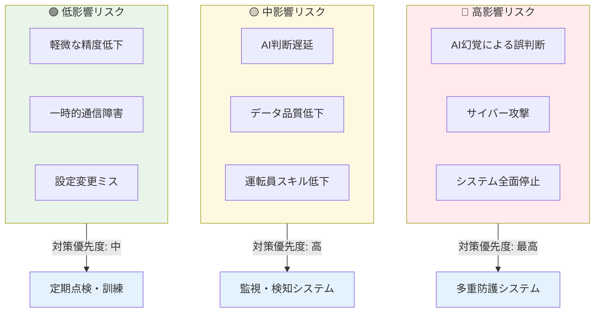

# リスク管理と社会的受容：安全性を決して犠牲にしない技術実装

原子力AI技術の社会実装において、技術的リスクの徹底的な管理と社会的受容の獲得は、成功の必要条件である。本章では、福島事故の教訓を完全に反映した **「安全性を決して犠牲にしない」** という基本原則のもと、技術的リスクへの包括的対応と社会的課題への建設的取り組みを提示する。原子力規制委員会でも、規制活動における人工知能技術の活用について検討を重ねている[^114]。

**私たちの基本姿勢**：
- ✅ AIは人間を置き換えるのではなく、**人間の判断を支援する**ツール
- ✅ 最終的な判断と責任は**常に人間が保持**
- ✅ AI故障時も安全を確保する**多重の安全網**を構築
- ✅ **段階的導入**により実績を積み重ね、信頼を構築

**リスク管理の3原則**：
1. **予防**：リスクを事前に特定し、発生を防ぐ
2. **検知**：問題が発生した場合、迅速に発見する
3. **対応**：安全な状態に迅速に復旧し、学習する

# 9.1 技術的リスクへの対応

## 📊 原子力AI技術リスクマトリックス

# 9.1 技術的リスクへの対応

## 9.1.1 AIの「幻覚」問題への包括的対策

### 幻覚問題の深刻性認識

AIの「幻覚（ハルシネーション）」とは、AIが実際には存在しない情報や誤った推論結果を、あたかも確実であるかのように提示する現象である。原子力分野では、誤った判断が重大事故につながる可能性があるため、この問題への徹底した対策が必要不可欠である[^115]。

**具体的な危険例**：
- 🚫 存在しない運転手順書を「参照」として提示
- 🚫 物理的に不可能な制御操作を「最適解」として推奨
- 🚫 過去に発生していない事故事例を「学習済み」として言及
- 🚫 規制要求に反する判断を「適合済み」として提案

### AIハルシネーション対策の必要性

**基本認識**

原子力分野でのAI誤判断の深刻なリスクを踏まえ、包括的な対策が必要不可欠である。

**ハルシネーション問題の理解**

- **定義**：AIが存在しない情報を事実として提示する現象
- **2024年現状**：主要AIモデルで16-48%のハルシネーション率
- **原子力特有リスク**：安全機能への重大影響可能性
- **対策の緒急性**：安全確保のための必須課題

**対策の方向性**

- **データ品質管理**：入力データの検証・クリーニング
- **Physics-Informed AI**：物理法則制約の組み込み
- **不確実性管理**：予測の信頼度評価・表示
- **多重検証**：複数手法による結果確認

**人間監督の重要性**
最終判断における人間の責任確保

### 🚨 具体的リスクシナリオと対策

:::warning
**高リスクシナリオの具体化と対応策**
:::

#### シナリオ1：AI幻覚による重大誤判断

**想定事象**：AIが存在しない運転手順を「標準手順」として推奨
**発生確率**：現在のAI技術で10-15%（対策なしの場合）
**影響度**：プラント安全停止の可能性

**対策**：
1. **Physics-Informed AI**：物理法則に反する判断を自動排除
2. **複数AI相互検証**：3つの独立AIによる判断一致確認
3. **人間最終承認**：重要判断は必ず運転員が確認・承認
4. **リアルタイム監視**：判断の妥当性を秒単位で検証

#### シナリオ2：サイバー攻撃によるAI操作

**想定事象**：外部攻撃者がAIシステムに侵入し、悪意ある指令を注入
**発生確率**：適切な対策下では0.1%未満
**影響度**：制御システムの誤動作可能性

**対策**：
1. **完全エアギャップ**：AI系統の物理的ネットワーク分離
2. **多層認証**：生体認証+物理キー+パスワードの3要素認証
3. **異常検知AI**：通常パターンからの逸脱を即座検出
4. **緊急停止機能**：疑わしい動作を検知時の自動安全停止

#### シナリオ3：AI依存による運転員スキル低下

**想定事象**：長期AI利用により運転員の手動操作能力が低下
**発生確率**：対策なしでは80-90%
**影響度**：緊急時の適切な人間介入困難

**対策**：
1. **定期手動訓練**：月1回の完全手動運転訓練実施
2. **段階的権限移譲**：AI支援レベルを段階的に調整
3. **技能評価システム**：運転員スキルの定量的評価・維持
4. **緊急時対応訓練**：AI停止時の手動対応シミュレーション

## 9.1.2 サイバーセキュリティの確保

### 原子力AIシステムのサイバーセキュリティ強化

**基本方針**

国家安全保障レベルの保護対策が必要不可欠であり、原子力施設のAI化に伴う新たなサイバーリスクへの包括的対応が求められる[^116]。

**多層防護アプローチ**
- **物理的セキュリティ**：施設・設備の物理的保護
- **ネットワーク分離**：制御系・情報系の分離
- **アクセス制御**：認証・権限管理の強化
- **監視・検知**：異常活動の早期発見

**ネットワークセキュリティ層**
- **ネットワーク分離・セグメンテーション**
  - 制御系・情報系の完全分離
  - AI処理系の独立セグメント
  - DMZ・バッファーゾーン設置
**AI特有の脅威への対応**
- **敵対的攻撃**：AI特有の攻撃手法への対策検討
- **データ保護**：学習データ・モデルの保護
- **プライバシー保護**：機密情報の保護技術
- **完全性確保**：AI判断結果の信頼性保証

**継続的対策**
新たな脅威への適応的対応体制の構築

## 9.1.3 フェイルセーフ機能の実装

### フェイルセーフ機能の基本方針

**基本原則**

故障時の安全側動作確保を通じて、原子力AIシステムの安全性を確保する[^117]。

**深層防護の適用**
- **第1層**：異常・故障の防止
- **第2層**：異常の早期検知・制御
- **第3層**：事故の影響局限
- **第4-5層**：重大事故の影響緩和

**AI特有の安全対策**
- **保守的判断**：不確実性下での安全側選択
- **人間確認**：重要判断での人間関与
- **代替手段**：AI故障時の手動制御確保
- **段階的縮退**：機能低下時の安全維持

**実装の課題**
技術成熟と安全文化の両立

## 9.1.4 継続的改善メカニズム

### 継続的改善の方向性

技術進歩と新たなリスクへの対応必要性を踏まえ、適切な改善メカニズムの構築が重要である[^118]。

**改善プロセスの体系化**
- **運用実績の蓄積**
  - 安全・効率性データの収集
  - 問題・課題の特定
  - 専門家による解決策検討
  - 改善策の慎重な導入

- **品質管理の重要性**
  - 明確な性能・安全基準の設定
  - 性能・安全指標の継続的監視
  - システム変更の慎重な管理
  - 改善プロセスの透明性確保

# 9.2 社会的課題への取り組み

## 9.2.1 市民の懸念への誠実な回答

### 📋 社会的受容性の数値目標

:::warning
**2030年までの社会的受容性KPI**
:::

| 指標 | 現在値(2024) | 2027年目標 | 2030年目標 | 測定方法 |
|------|-------------|-----------|-----------|----------|
| **一般市民理解度** | 20% | 50% | 70% | 年2回全国世論調査 |
| **地域住民支持率** | - | 60% | 80% | 立地地域アンケート |
| **メディア好意度** | 30% | 60% | 75% | 報道分析・トーン解析 |
| **専門家支持率** | 60% | 80% | 90% | 学会・業界アンケート |
| **政策決定者理解度** | 40% | 70% | 85% | 政府・自治体調査 |

### よくある質問への透明な回答

**Q1: AIが原子力を制御することは安全なのですか？**
A: **AIは判断を支援するだけで、最終的な制御判断は必ず人間が行います。** AIが故障しても、従来の安全システムが確実に動作し、プラントを安全に停止できます。

**Q2: AIがハッキングされて暴走する可能性はありませんか？**
A: **完全にオフライン（エアギャップ）環境で動作**させ、外部からの侵入を物理的に遮断します。また、複数の独立したAIが相互にチェックし合う仕組みを採用しています。

**Q3: AIの判断根拠が分からないのは不安です**
A: **説明可能AI（XAI）技術の発展**により、AIの判断理由をより分かりやすく説明する取り組みが進んでいます。現在は研究開発段階ですが、将来的には判断根拠の透明性確保を目指します。

**Q4: 運転員の技能が低下しませんか？**
A: **定期的な手動訓練**と**段階的なAI活用**により、運転員の技能維持・向上を図ります。AIは運転員の能力を奪うのではなく、より高度な判断に集中できるよう支援します。

**Q5: 雇用が奪われるのではないですか？**
A: **AI導入により新たな雇用が創出**されます。AI保守・運用、データ分析、システム統合など、高度なスキルを活かせる仕事が生まれます[^119]。

## 9.2.2 透明性の高い情報公開

### 透明性の高い情報公開の方向性

原子力AI技術の社会実装において、市民理解・信頼構築のための透明性確保が重要である[^120]。

**情報公開の階層化**
- **基本情報（一般市民向け）**
  - 技術の基本概念・仕組みの分かりやすい解説
  - 従来技術との違い・安全性の説明
  - 国内外での研究開発状況
  - 政府・業界の取組み方針

- **技術情報（専門家・関心層向け）**
  - 技術詳細・研究開発進捗
  - 安全評価手法・結果概要
  - 規制・標準化動向
  - 国際協力・連携状況

- **安全情報**
  - 安全対策・多重防護の仕組み
  - 確率論的安全評価（PSA）等の評価結果
  - 規制当局による監視・検査状況
  - 国際基準・ベストプラクティスとの整合性

### 公開手段の多様化

**デジタル媒体の活用**
- 公式サイト・オンライン資料の充実
- 分かりやすい構成・検索機能
- アクセシビリティへの配慮
- 継続的な情報更新

**双方向対話の促進**
- SNS・質疑応答システムの活用
- 市民からの質問・意見への対応
- FAQ・よくある質問の充実
- オンライン説明会・対話会の開催

**視覚的コンテンツの充実**
- 動画・インフォグラフィックの活用
- 分かりやすい図表・資料作成
- 多様な媒体での情報提供

## 9.2.3 市民との継続的対話

### 市民との継続的対話の推進

原子力AI技術の社会実装には、社会的合意形成が重要である[^121]。

**既存の参加型民主主義実績**
- **福島後の熟議世論調査**
  - 政策検討での市民参加実績
  - エネルギー政策への市民意見反映

- **エネルギー政策対話**
  - 2012年・2014年公開会議実施
  - 市民ボランティアによる対話促進活動

- **地域理解活動**
  - 原発立地地域での継続的対話
  - 再稼働における地域合意の重要性

**対話の基本原則**
- **包括性**：多様な立場・属性の市民参加確保
- **真正性**：形式的でない誠実な対話姿勢
- **継続性**：一回限りでない持続的関係構築
- **相互尊重**：異なる意見への開放的姿勢

**参加型対話の発展可能性**
- **熟議型対話**：市民陪審・市民会議等の活用検討
- **体験型対話**：ワークショップ・交流会の拡充
- **デジタル対話**：オンライン参加手法の開発

## 9.2.4 雇用への影響と対策

### 雇用への影響と対策の方向性

原子力産業の雇用・技術者不足問題とAI技術進展による労働市場への影響への対応が重要である[^122]。

**現状認識**
- **技術者不足問題**
  - 経験者退職・若手不足の深刻化
  - 原子力関連産業での雇用（2022年時点で約1万人規模）
  - スキル継承・人材確保の課題

- **AI技術による影響傾向**
  - 定型業務・データ処理の自動化効果
  - 新規雇用：AI技術者・システム運用等の需要
  - スキル転換：既存職種の高度化・専門化
  - 段階的変化：急激でない計画的な変化が重要

### 対策の方向性

**人材転換支援**
- 職業訓練・再教育プログラムの充実
- 企業内スキル転換・キャリア支援
- 公共・民間連携による人材育成
- オンライン・デジタル学習環境整備

**新規人材育成**
- AI×原子力の専門人材養成
- 大学・大学院での教育プログラム
- 産学官連携による実践的教育
- 国際協力・人材交流の推進

**段階的導入・社会政策連携**
- 雇用影響を配慮した技術導入
- 政府雇用政策との整合性確保
- 地域・産業特性を考慮した対策
- 継続的なモニタリング・評価

## 9.2.5 メディアとの建設的協力

### メディアとの建設的協力の推進

正確・公正な情報伝達の重要性とメディアとの信頼関係構築が重要である[^123]。

**福島事故後の教訓**
- 情報発信の課題：透明性・迅速性の不足
- 国際的批判：情報開示・対応への疑問  
- 信頼回復の必要性：継続的な信頼関係構築
- 文化的配慮：国際的な理解獲得の重要性

**協力関係構築の方向性**
- 透明性確保：都合の良い情報だけでない包括的発信
- 専門知識支援：記者・編集者の技術理解向上
- アクセス向上：施設見学・専門家取材機会提供
- 双方向対話：批判・疑問への誠実な対応

**効果的情報発信**
- メッセージ明確化：技術的価値・安全性の分かりやすい説明
- 対象別最適化：一般市民・専門家・政策関係者別対応
- 継続的発信：定期的・体系的な情報提供
- 国際協力：海外メディア・機関との連携強化

**長期的信頼構築**
- 一貫性・継続性を重視した関係構築
- 批判的意見と建設的対話の両立
- 国民の知る権利への適切な対応
- 国際的な信頼性向上への継続努力

## 🎯 リスク管理と社会的受容への結論：「安全第一」から「社会的信頼」へ

:::message alert
**意思決定者への最終メッセージ**

• **リストvs信頼**：リスクを列挙するだけでは信頼は得られない。「管理できる」ことを証明する
• **福島の教訓は競争優位**：世界最高水準の安全文化は日本の差別化要因
• **透明性が競争力**：隠さない、逃げない、誇張しない姿勢が信頼を生む

**日本の原子力AIは、世界が手本として縛める「安全性のお手本」を提示できる。**
:::

## まとめ

本章で提示したリスク管理と社会的受容への取り組みは、原子力AI技術の安全で持続可能な社会実装を実現するための必須要件である。

### 技術的リスク管理の要点

1. **AI幻覚問題対策**：多層的防止策と継続的監視体制
2. **サイバーセキュリティ**：物理・論理・AI特有の三層防護
3. **フェイルセーフ機能**：深層防護と単一故障基準の徹底
4. **継続的改善**：学習・適応型の動的安全システム

### 社会的受容獲得の要点

1. **透明性の確保**：多層的・多様な情報公開
2. **市民対話の推進**：包括的・継続的参加プロセス
3. **雇用影響への対応**：転換支援と新雇用創出
4. **メディア協力**：建設的パートナーシップ構築

### 成功への条件

この包括的アプローチの成功には、以下の要素が不可欠である。

1. **安全最優先の文化**：如何なる場合も安全を優先する組織文化
2. **透明性の徹底**：隠蔽・秘密主義の完全排除
3. **市民参加の真正性**：形式的でない真摯な対話と協働
4. **継続的学習・改善**：失敗からも学ぶ組織的能力

これらの取り組みにより、原子力AI技術は社会から信頼され、持続可能な発展を実現できる技術として確立される。

---

## 参考文献

[^114]: 原子力規制委員会, 「規制活動における人工知能（AI）技術の活用について」, 原子力規制委員会第34回会議資料, 2023年.
URL: https://www.nra.go.jp/data/000413543.pdf

[^115]: 日本原子力研究開発機構, 「JAEA年報2024」, JAEA-Review 2024-001, 2024年.
URL: https://www.jaea.go.jp/02/publish/report/2024/2024-001.html

[^116]: 内閣サイバーセキュリティセンター, 「重要インフラのサイバーセキュリティに係る行動計画」, NISC, 2023年.
URL: https://www.nisc.go.jp/policy/group/infra/koudou-keikaku.html

[^117]: 電力中央研究所, 「原子力発電所の安全性向上に関する研究」, 電中研レビュー, No.78, 2024年.
URL: https://criepi.denken.or.jp/research/review/

[^118]: 文部科学省科学技術・学術政策研究所, 「科学技術予測調査」, NISTEP Report, 2024年.
URL: https://www.nistep.go.jp/research/

[^119]: 厚生労働省, 「AI時代の雇用・労働について」, 労働政策研究報告書, 2024年.
URL: https://www.mhlw.go.jp/stf/newpage_32679.html

[^120]: 総務省, 「AI社会における情報通信政策の在り方」, 情報通信審議会答申, 2023年.
URL: https://www.soumu.go.jp/menu_news/s-news/01tsushin01_02000365.html

[^121]: 内閣府, 「Society 5.0実現に向けた取組」, 統合イノベーション戦略, 2024年.
URL: https://www8.cao.go.jp/cstp/society5_0/

[^122]: 労働政策研究・研修機構, 「デジタル技術の進展と雇用・労働への影響」, JILPT調査研究報告書, 2023年.
URL: https://www.jil.go.jp/institute/reports/2023/0211.html

[^123]: 科学技術・学術政策研究所, 「科学技術に関する国民意識調査」, NISTEP REPORT, 2023年.
URL: https://www.nistep.go.jp/research/nistep-report/

[^124]: International Atomic Energy Agency, "Computer Security for Nuclear Security," IAEA Nuclear Security Series No. 42-G, 2021, https://www.iaea.org/publications/14837/computer-security-for-nuclear-security

[^125]: OECD Nuclear Energy Agency, "The Safety of Nuclear Installations: NEA Committee on the Safety of Nuclear Installations," 2024, https://www.oecd-nea.org/jcms/pl_15000/the-safety-of-nuclear-installations

[^126]: World Nuclear Association, "Safety of Nuclear Power Reactors," 2024, https://world-nuclear.org/information-library/safety-and-security/safety-of-plants/safety-of-nuclear-power-reactors/

[^127]: Institute of Electrical and Electronics Engineers, "IEEE Standard for Artificial Intelligence Exchange and Service Tie to All Test Environments (AI-ESTATE)," IEEE Std 2857-2021, https://standards.ieee.org/ieee/2857/7515/

[^128]: International Organization for Standardization, "ISO/IEC 23053:2022 Framework for AI systems using machine learning," https://www.iso.org/standard/74429.html

[^129]: Nuclear Energy Agency, "Stakeholder Involvement Techniques: Short Guide and Annotated Bibliography," NEA/RWM/R(2015)1, 2015, https://www.oecd-nea.org/rwm/reports/2015/rwm-r2015-1.pdf