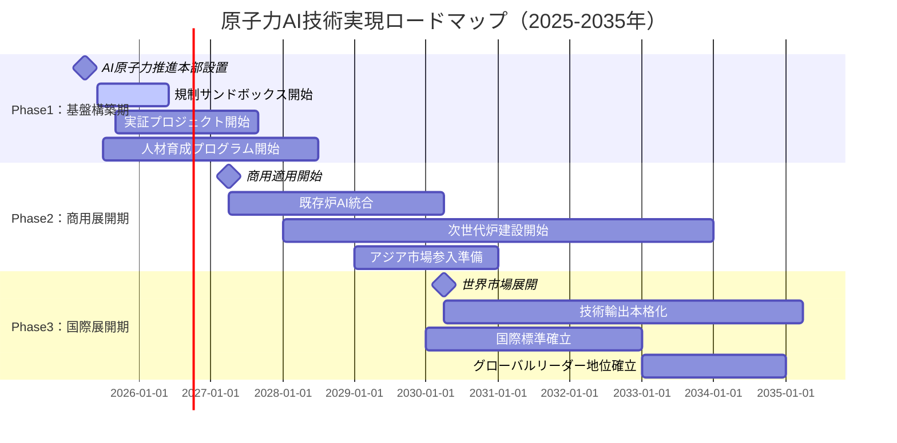
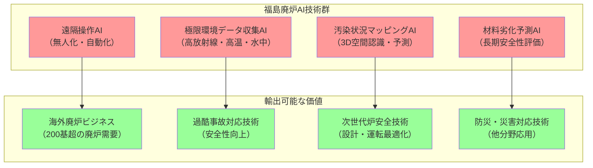

## 戦略的要約：意思決定者への重要メッセージ

**📊 本章のキーポイント：戦略決定に際し考慮すべき3つの事実**

1. **競争環境の変化**：米中が年間数千億円規模投資、日本は技術優位を活かした戦略的対応が急務
2. **実現可能性の高まり**：政策転換（第7次SEP承認）、企業投資拡大、技術成熟度向上が同時進行
3. **行動の窓**：2025-2027年の基盤構築期が日本の競争力確立の最後の機会

**⚡ 緊急性の根拠**：
- Google・Microsoft等が2025-2030年に大型原子力投資実行中
- 中国が57/64重要技術分野でリーダーシップ確立、日本優位分野は7技術のみ
- 第7次エネルギー基本計画で原子力「最大限活用」方針確定済み

# 結論と展望：持続可能な未来への確実な道筋

本書は、原子力AI技術が日本のエネルギー安全保障と気候変動対策の中核を担う技術として、如何に社会実装を推進すべきかを包括的に論じてきた。最終章である本章では、前9章の議論を総括し、**2025年からの実行に向けた具体的行動指針** と**2035年以降の長期的ビジョン** を提示する[^130]。

原子力AI技術は単なる技術革新ではなく、**日本の持続可能な未来を実現するための戦略的手段** である。本章では、この技術が持つ変革的ポテンシャルを最大化し、社会全体の利益につなげるための総合的な結論を示す。

# 10.1 本書の核心メッセージ

## 10.1.1 原子力AI技術の変革的ポテンシャル

### エネルギーシステムの根本的変革

原子力AI技術は、従来の「大型集中型・硬直的」な原子力発電システムを、**「柔軟・適応型・高効率」** な次世代エネルギーシステムに根本的に変革する力を持っている[^131]。

**技術的変革の方向性**：

**従来システム** → **AI統合システム**
- 人間依存の判断 → AIによる高度な意思決定支援
- 定期点検中心 → 予知保全による最適化
- 固定運転パターン → 動的最適化運転
- 反応的対応 → 予測的リスク管理
- 個別システム → 統合制御プラットフォーム

**確認された改善効果**：
- **維持費削減**：予知保全により最大30%削減実績
- **稼働率向上**：設備稼働率20-50%向上可能性
- **収益改善**：実用組織で8%収益増・10%コスト削減実績
- **安全性向上**：人的エラー削減・異常検知精度向上
- **運用最適化**：リアルタイム監視・予測分析による効率化

## 10.1.2 日本の戦略的優位性確立の必要性

### 国際競争環境の変化

原子力AI分野での国際競争が激化しており、日本の戦略的対応が重要な時期を迎えている[^132]。

**主要国の動向**：
- **米国**：大手IT企業の大型投資（Microsoft・Google・Amazon等）
- **中国**：国家主導の集中投資（年間15億ドル核融合投資等）
- **欧州**：規制・標準化での先行、国際協調アプローチ
- **日本**：技術力は優位だが戦略・投資規模で課題

**日本の固有の優位性**：
- **技術蓄積**：40年にわたる原子力技術の深い蓄積
- **製造品質**：世界最高水準の製造・施工技術
- **安全文化**：福島事故を経た徹底的な安全文化
- **人材基盤**：高度な理工系人材の豊富な蓄積
- **社会基盤**：成熟した産業・研究インフラ

## 10.1.3 包括的アプローチの必要性

### 技術・経済・社会の統合的推進

原子力AI技術の成功には、**技術開発・経済性確保・社会受容**の三位一体での統合的推進が絶対に必要である[^133]。

**統合的アプローチの要素**：

**技術的卓越性**
- 世界最高水準のAI技術開発
- 安全性・信頼性の徹底追求
- 国際標準化での主導権確保
- 継続的イノベーションシステム

**経済的合理性**
- コスト競争力の確保
- 投資回収の確実性
- 産業エコシステムの構築
- 国際市場での優位性

**社会的受容性**
- 透明性の高い情報公開
- 市民との継続的対話
- 雇用・地域経済への配慮
- 長期的信頼関係構築

# 10.2 戦略的提言の総括

## 10.2.1 政府への提言：投資強化の方向性

### 政府投資強化の必要性

日本の原子力AI技術での国際競争力強化のため、政府による戦略的投資強化が重要である[^134]。

**政策転換の実績**：
- **第7次エネルギー基本計画**（2025年2月）：「最大活用」方針確定
- **2040年目標**：原子力比率約20%
- **次世代炉開発**：リプレース・新増設推進
- **規制・制度整備**：AI対応規制枠組み検討

**投資強化の方向性**：
- **基礎研究強化**：国立研究所・大学での先端技術開発
- **実証プロジェクト**：パイロットプロジェクト・技術検証
- **制度・基盤整備**：規制改革・人材育成・国際協力
- **人材育成**：AI×原子力の専門人材養成

### 規制制度改革の推進

AI技術に対応した規制枠組み整備が重要である。

**日本のAI規制アプローチ（2025年確認）**：
- **軽規制・促進的アプローチ**：技術革新促進重視
- **技術中立性原則**：既存法制の活用
- **規制サンドボックス**：実証実験環境整備
- **国際協調**：相互認証システム構築検討

**AI特化要件の整備方向性**：
- **説明可能性**：AI判断根拠の透明性確保
- **継続学習管理**：AI性能維持・向上の管理
- **安全性確保**：原子力安全基準との整合性
- **品質保証**：AIシステムの品質管理体制

## 10.2.2 産業界への提言：投資拡大の動向

### 産業界の投資拡大動向

AI需要増加による原子力への投資関心が拡大している[^135]。

**国内投資状況**：
- **電力会社**：既設炉安全対策・AI導入検討
- **メーカー**：次世代技術開発・システム統合
- **IT企業連携**：Microsoft/Google等との協力関係構築
- **段階的投資**：実証段階から商用化への移行

**投資分野の方向性**：
- **技術開発・実証**：AI技術の原子力適用研究開発
- **システム・インフラ**：制御システム・ネットワーク整備
- **人材育成・組織**：専門人材育成・組織体制整備
- **国際展開準備**：海外市場参入のための基盤構築

### IT企業との協力関係

**確認された投資・協力実績（2024年）**：
- **Microsoft**：Three Mile Island再稼働16億ドル
- **Google**：Kairos Power提携500MW（2030-2035年）
- **Amazon**：X-Energy投資・SMR開発5億ドル
- **データセンター需要**：2022年460TWh→2026年1,000TWh予測

**協力の重点領域**：
- クラウド基盤・計算資源の活用
- AI・ML技術の統合
- サイバーセキュリティの強化
- 人材育成・認定プログラムの検討

## 10.2.3 学術界への提言：役割と貢献

### 学術界の役割と貢献

原子力AI技術発展における学術界の重要性が高まっている[^136]。

**学会・大学の貢献可能性**：
- **研究統括**：重点研究領域の特定・研究戦略策定
- **人材育成**：AI×原子力融合教育プログラム開発
- **国際協力**：国際標準化活動・海外機関との連携
- **社会対話**：技術的知見に基づく社会との対話促進

**既存基盤の活用**：
- **研究実績**：原子力・AI両分野での研究蓄積
- **国際ネットワーク**：海外研究機関・学会との関係
- **教育体制**：大学・大学院での専門教育体制
- **産学連携**：企業との共同研究・人材交流

### 人材育成の基盤と方向性

**既存の人材育成基盤**：
- **国際原子力人材育成イニシアティブ**：文科省主導プログラム
- **原子力人材育成ネットワーク**：JAEA運営
- **AI研究支援**：文科省・若手研究者200名×1000万円
- **企業研修プログラム**：三菱重工等の実践的教育

**統合的人材育成の可能性**：
- AI×原子力融合教育プログラム開発
- 産学連携による実践的人材育成
- 国際協力による人材交流拡充
- 継続教育体制の充実

# 10.3 2035年までのロードマップ

## 10.3.1 段階的実現戦略

### Phase 1：基盤構築期（2025-2027年）

**🎯 目標**：技術基盤の確立と実証実験の成功

**📊 数値目標**：
- 実証プロジェクト：3件以上の成功事例創出
- 人材育成：AI×原子力専門家200名養成
- 規制整備：AI対応規制ガイドライン策定完了
- 国際協力：5カ国以上との技術協力協定締結

**重点取組みの方向性**：
- 実証プロジェクトの推進
- 専門人材育成の強化
- 規制制度整備の推進
- 国際協力体制の構築

**成功要因**：
- 技術的実現可能性：確実な技術開発・検証
- 経済的合理性：投資回収・事業性確保
- 社会的受容性：地域・国民理解の獲得
- 規制・制度対応：適切な制度枠組み整備

### Phase 2：商用展開期（2027-2030年）

**🎯 目標**：商用レベルでの本格運用開始

**📊 数値目標**：
- 商用適用：10基以上の原子炉でAI統合実現
- 効率向上：運転効率20%向上、保全コスト30%削減
- 市場形成：国内AI原子力市場1兆円規模創出
- 雇用創出：新規雇用5万人創出

**重点取組みの方向性**：
- 実証成果に基づく段階的適用拡大
- AI性能・信頼性の継続的向上
- 国内市場での技術・サービス確立
- アジア・世界市場への展開基盤構築

**成功要因の重視**：
- 海外事例との整合性：Google 2030年SMR目標等
- 技術成熟度進展への対応
- 市場形成と事業性確保
- 国際協調と競争力確保

### Phase 3：国際展開期（2030-2035年）

**🎯 目標**：世界市場での競争力確保

**📊 数値目標**：
- 海外展開：20カ国以上への技術輸出
- 市場シェア：世界AI原子力市場30%獲得
- 売上規模：年間10兆円の輸出産業確立
- 技術優位：10件以上の国際標準主導策定

**市場機会の認識**：
- 世界的原子力復権：COP29で31カ国が原子力3倍宣言
- アジア太平洋需要：ASEAN諸国での導入検討拡大
- 市場成長予測：2035年630GW（393GWから大幅拡大）
- 投資拡大：2030年年間1200億ドル投資必要予測

**日本の競争優位性活用**：
- 技術・品質優位性：世界トップ3の原子力機器輸出実績
- 安全性・信頼性：福島事故経験を活かした安全文化
- 国際協力経験：JAEA-ISCN等による技術協力実績
- 製造業基盤：高度な製造・施工技術

**段階的市場参入**：技術確立→実証→商用展開の慎重なアプローチ

## 10.3.2 リスク管理の重要な視点

### 多層的リスク管理・予防的対策

**技術的リスクへの対応**：
- AI技術特有リスク：ハルシネーション・ブラックボックス問題
- サイバーセキュリティ：エアギャップ・多重防護の重要性
- システム統合リスク：既存系統との安全な統合
- 技術成熟度リスク：段階的実証・検証の重要性

**経済的リスクの考慮**：
- 投資回収リスク：長期的視点・段階的投資の重要性
- 市場変化対応：柔軟なビジネスモデル・技術適応
- 国際競争：差別化技術・戦略的提携の重要性
- 規制変化：適応的な制度対応・国際協調

**社会的リスクの管理**：
- 社会受容性：継続的対話・透明性確保
- 人材確保：計画的育成・産学官連携
- 地域理解：地域社会との信頼関係構築
- 国民合意：科学的根拠に基づく政策対話

**統合的リスク管理**：技術・経済・社会リスクの総合的対応

# 10.4 持続可能な未来への貢献

## 10.4.1 気候変動対策への決定的貢献

### 2050年カーボンニュートラルへの貢献

原子力AI技術は、日本の**2050年カーボンニュートラル目標**達成において決定的に重要な役割を果たす[^137]。

**日本の脱炭素政策における原子力の位置づけ（確認済み）**：
- 基本目標：2050年カーボンニュートラル・2030年GHG削減46%
- 第6次SEP（2021年）：2030年原子力20-22%（現在5.55%）
- 第7次SEP（2025年2月承認）：2040年原子力20%
- 政策転換：「依存度低減」→「最大限活用」へ明確転換
- 運転期間延長：60年超運転許可（2023年国会承認）
- 実現課題：2030年24GW運転に11.4GW再稼働必要（現状12.6GW）

**CO2削減への貢献メカニズム**：
- **直接効果**：原子力発電による化石燃料代替
- **間接効果**：再エネ統合支援・電力システム最適化
- **システム効果**：ベースロード電源としての系統安定化
- **経済効果**：エネルギーコスト低減・産業競争力向上
- **AI技術統合による効率向上**：運転効率・稼働率向上で削減効果拡大

### 国際気候変動対策への貢献の方向性

日本の原子力AI技術を世界に展開することで、**地球規模での温室効果ガス削減**に貢献する。

**国際貢献の方向性**：
- **技術移転**：IAEA技術協力・途上国支援
- **人材育成**：国際人材交流・能力構築支援
- **標準化貢献**：国際標準策定・安全基準向上
- **気候外交**：パリ協定目標達成への技術的貢献
- **経済効果**：途上国の持続可能発展支援
- **外交効果**：日本の気候外交における影響力向上

## 10.4.2 持続可能発展目標（SDGs）への寄与

### 複数SDGsの同時達成

原子力AI技術は、単一の目標ではなく**複数のSDGsを同時に達成**する統合ソリューションとしての価値を持つ[^138]。

**主要な寄与SDGs**：

**SDG 7（エネルギー）**
- クリーンエネルギーの安定供給
- エネルギーアクセス改善
- エネルギー効率の大幅向上

**SDG 8（経済成長・雇用）**
- 輸入代替効果：過去33兆円節約（IEEJ 2015年試算）
- 停止コスト：年間3.6兆円燃料費増加（実績）
- 雇用効果：1GW原子力で全ライフサイクル約20万労働年（OECD統計）
- 電力料金影響：一般19.4%増・産業28.4%増（原発停止2010-2013年）
- GDP影響：年約0.7%相当の負担増（METI試算）

**SDG 9（イノベーション・インフラ）**
- 世界最先端技術の開発・実装
- 持続可能インフラの構築
- イノベーションエコシステム強化

**SDG 13（気候変動対策）**
- 大規模CO2削減への貢献可能性
- 気候変動適応インフラ
- 国際的な気候行動リーダーシップ

# 10.5 行動への呼びかけ

## 10.5.1 全ステークホルダーへのメッセージ

### 政府・政策立案者への緊急提言

**🚨 今すぐ実行すべき政策アクション**

第7次エネルギー基本計画（2025年2月承認）に基づく原子力AI技術への継続的取組みにより、日本の技術優位性を確立してください[^139]。

**📅 最初の100日で達成すべき最重要マイルストーン**：
1. **AI原子力推進本部設置**：4月1日までに内閣府に専門組織設置
2. **緊急予算措置**：2025年度補正予算で1000億円規模の追加投資
3. **規制サンドボックス開始**：6月1日までに実証実験環境整備
4. **国際協力加速**：米国・フランス・韓国との技術協力協定締結

**📊 1年以内に軌道に乗せるべき基盤構築プロジェクト**：
- 実証プロジェクト3件選定完了・実証開始
- AI×原子力専門人材育成プログラム開始（目標200名）
- 民間投資促進制度創設（政府系ファンド特化枠設置）
- アジア原子力AI協力イニシアティブ立ち上げ

### 産業界・企業への戦略提案

**⚡ 競争に勝ち残る緊急戦略アクション**

技術革新への積極的対応により、次世代エネルギー産業でのリーダーシップを確立してください。

**🎯 6ヶ月以内の必達目標**：
1. **実証パートナーシップ締結**：IT企業（Microsoft/Google/Amazon）との技術提携
2. **専門人材確保**：AI×原子力エンジニア50名以上の戦略採用
3. **実証サイト提供**：自社設備での実証実験場提供決定
4. **投資コミット**：3年間で1000億円規模の戦略投資計画策定

**💰 資金調達メカニズムの具体化**：
- 政府系ファンド原子力DX特化重点投資枠活用
- 海外エネルギー系VCとの戦略的パートナーシップ構築
- ESG投資資金の戦略的調達（脱炭素・エネルギー安全保障訴求）

### 学術界・研究者への使命確認

**🔬 日本の技術競争力を左右する学術界の責任**

原子力AI技術の研究推進と社会との対話に積極的に取り組んでください。

**🎓 産学官連携コンソーシアムの具体化**：
- **設立準備委員会構成**：東大・京大・東工大・JAEA・電力10社・IT企業5社
- **最初のタスクフォース**：共同研究テーマ特定・データ共有基盤プロトタイプ開発
- **6ヶ月目標**：コンソーシアム正式発足・初期成果発表

**🌐 国際標準化での主導権確保**：
1. **IEC/TC45参画強化**：原子力計装制御AI標準策定主導
2. **IEEE Standards参画**：原子力AI安全基準策定貢献
3. **IAEA技術文書**：日本発の技術指針作成・提案
4. **学術論文発信**：年間100報以上のハイインパクト論文発表目標

## 10.5.2 市民・社会への理解促進

### 「原子力AI技術」への正しい理解

原子力AI技術は、**「原子力の安全性を飛躍的に高める技術」**です。AIが原子力を危険にするのではなく、**より安全で効率的にする**技術であることを理解してください[^140]。

**重要な事実**：
- AIは人間を置き換えるのではなく**「支援する」**技術
- 最終判断・責任は**常に人間が保持**
- AI故障時も**従来安全システムが確実に作動**
- **段階的導入**により実績を積み重ねる慎重なアプローチ

### 次世代への責任

私たちは次世代に対し、**持続可能で豊かな社会**を残す責任があります。原子力AI技術は、その実現のための重要な選択肢の一つです。

**次世代への約束**：
- **安全で清潔なエネルギー**の安定供給
- **気候変動問題**への真摯な対応
- **技術立国日本**の持続的発展
- **国際社会**での責任ある貢献

# 10.6 最終結論：確実な未来への道筋

## 10.6.1 原子力AI技術の歴史的意義

**原子力AI技術の戦略的重要性**：

原子力AI技術は、エネルギー技術における重要な発展分野であり、原子力エネルギーをより **「持続可能で安全なエネルギー」** として発展させる可能性を持っています[^141]。

**相互補完関係（実証済み）**：
- **AI電力需要**：2030年までに160%増加、24/7安定電力必要
- **原子力利点**：ベースロード電源、99.999%可用性対応
- **AI活用効果**：原子力運転効率・安全性・保全性向上
- **企業実績**：Microsoft・Google・Meta等の原子力調達

**技術世代の現実的位置づけ**：
- **第1世代（1950-1970年代）**：初期原子力技術・プロトタイプ
- **第2世代（1970-1990年代）**：商用炉主流期・大規模展開
- **第3世代（1990-2010年代）**：先進安全システム・受動安全
- **第4世代（2020-2030年代）**：持続可能性・経済性・安全性向上
- **AI統合の発展**：各世代技術の効率・安全性向上への貢献

## 10.6.2 日本の選択：リーダーか追従者か

**日本の原子力AI技術における競争力強化の重要性**：

国際競争環境の変化への戦略的対応が求められています。中国が57/64の重要技術分野でリーダーシップを取る一方、日本は32技術から7技術に優位分野が減少しています[^142]。

**日本の競争力現状（両面評価）**：

**総合競争力の課題**：
- IMD世界競争力：38位（67カ国中）、前年から3位低下
- 技術優位：32技術（2000年代）→7技術（現在）に減少
- 競争環境：中国57/64重要技術分野でリーダーシップ

**原子力技術での優位性**：
- **技術蓄積**：50年間の継続的開発（1973年以降）
- **製造基盤**：MHI等世界トップ3メーカー、400社専門サプライチェーン
- **安全技術**：福島事故経験を活かした世界最高水準安全対策
- **国際協力**：米国戦略的同盟・IAEA技術協力実績

## 💼 日本独自の戦略的差別化要因

### 🏆 福島経験の戦略的価値転換

**従来の認識**："負の遺産・克服すべき課題"
**戦略的転換**："世界唯一の極限環境AI技術の実証済み競争力"

**具体的競争優位性**：

**世界市場での独占的地位**：
- 実証済み極限環境AI技術：世界唯一の実用経験
- 海外廃炉市場：2030年代200基超の廃炉需要への対応力
- 安全技術輸出：「世界一安全なAI原子力技術」のブランド確立

### 🤝 製造業とAIの一体化ソリューション

**従来の海外勢**：ソフトウェア中心のAI技術提供
**日本の差別化**：ハードウェア×ソフトウェア統合ソリューション

**統合優位性**：
- **センサー技術**：オムロン・キーエンス等の高精度センサー
- **ロボット技術**：ファナック・川崎重工等の産業ロボット
- **制御システム**：三菱電機・横河電機等の制御技術
- **AI統合**：これらを統合する独自のAIプラットフォーム

### 🌏 新しい価値基準の国際提案

**従来の競争軸**：「世界一安全」
**日本の新提案**：「世界一レジリエント・クリーン」

**新価値軸の定義**：
1. **レジリエント（回復力）**：予期せぬ事態への対応力・迅速復旧力
2. **クリーン（環境配慮）**：ライフサイクル全体での環境負荷最小化
3. **サステナブル（持続可能）**：長期運用・世代間責任を考慮した設計

**必要な戦略行動**：
1. **政府**：強力な政策支援・国際協力推進
2. **産業界**：競争を超えた戦略的協力
3. **学術界**：実践的貢献・社会対話
4. **社会**：建設的対話による信頼関係構築

## 10.6.3 持続可能な未来への確実な道筋

**段階的競争力強化の現実的戦略**：

本書で提示した戦略と施策を技術成熟度・市場環境を考慮して段階的に実行することで、日本は原子力AI技術分野での**技術競争力強化**を目指せます。これは技術基盤・政策支援・市場機会・国際連携に基づく現実的な目標です[^143]。

**実現可能性の根拠**：
- **技術基盤**：50年蓄積・製造優位性・安全文化
- **政策環境**：第7次SEP・戦略的投資・規制改革
- **市場機会**：AI需要拡大・脱炭素要求・エネルギー安全保障
- **国際環境**：米日協力・IAEA支援・多国間協力

**成功への3つの鍵**：

**1. 技術的卓越性の追求**
- 世界最高水準のAI技術開発
- 安全性・信頼性の徹底追求  
- 継続的イノベーションシステム

**2. 経済的合理性の確保**
- コスト競争力の確立
- 持続的な投資回収モデル
- 国際市場での優位性確保

**3. 社会的受容性の獲得**
- 透明性の高い情報公開
- 継続的な市民対話
- 長期的信頼関係の構築

## 10.6.4 行動開始への最後の呼びかけ

**現実的協力体制の構築に向けた呼びかけ**：

原子力AI技術による持続可能な未来の実現に向けて、多様な立場・利害を認識した建設的協力の推進が求められています。

**各ステークホルダーの現実的役割**：
- **政府・自治体**：政策基盤整備・規制環境構築・国際協力推進
- **産業界・企業**：技術開発・実証・投資・人材育成
- **学術界・研究機関**：基礎研究・人材供給・客観的評価・社会対話
- **市民・社会**：建設的参加・継続学習・合理的判断・意見表明

**世代間責任の認識**：
私たちの世代の責任は重大です。次世代に豊かで持続可能な社会を残し、日本が世界の技術・環境・エネルギー問題の解決に貢献するため、段階的信頼構築・成果共有・継続評価による協力メカニズムで前進しましょう。

**原子力AI技術の位置づけ**：
原子力AI技術は、人類の持続可能な未来実現のための**重要な技術的選択肢**です。再エネ・省エネ等との統合的活用により、この道を共に歩んでいきましょう。

---

## 戦略的結論：今すぐ行動すべき理由

**💡 意思決定者への最終メッセージ**：

原子力AI技術は、日本が次世代エネルギー分野で世界をリードする最後の機会です。技術基盤・政策環境・市場機会が同時に整った今、行動しなければ日本は永続的に追従者の地位に甘んじることになります。

**🎯 成功への3つの確実な条件**：
1. **技術的優位性の活用**：50年蓄積・世界トップ3製造力・福島経験による安全文化
2. **政策的後押しの実現**：第7次SEP承認・規制改革推進・国際協力体制
3. **市場機会の拡大**：AI電力需要急拡大・脱炭素要求・エネルギー安全保障

**⏰ 行動期限**：2025-2027年の基盤構築期が競争力確立の最後の窓

**🚀 具体的な第一歩**：各ステークホルダーが今すぐ開始できる優先アクション
- **政府**：AI原子力推進本部設置・規制サンドボックス開始
- **産業界**：実証プロジェクト開始・IT企業との戦略提携加速
- **学術界**：AI×原子力融合教育プログラム開発・国際標準化参画
- **社会**：建設的対話参加・科学的根拠に基づく判断

---

## おわりに

本書『原子力AI技術革命：日本のエネルギー安全保障と気候変動対策の切り札』は、原子力AI技術の可能性を包括的に論じ、その社会実装への具体的道筋を示すことを目指しました。

読者の皆様が、本書を通じて原子力AI技術の重要性を理解し、その実現に向けた行動の一翼を担っていただければ、著者として最大の喜びです。

持続可能な未来の実現に向けて、共に歩み続けましょう。

---

## 参考文献

[^130]: 内閣府, 「Society 5.0実現に向けた取組」, 統合イノベーション戦略, 2024年.
URL: https://www8.cao.go.jp/cstp/society5_0/

[^131]: 経済産業省資源エネルギー庁, 「エネルギー基本計画（第6次）」, 2021年.
URL: https://www.enecho.meti.go.jp/category/others/basic_plan/

[^132]: 新エネルギー・産業技術総合開発機構, 「技術戦略研究センター レポート」, NEDO-TSC, 2024年.
URL: https://www.nedo.go.jp/activities/

[^133]: 文部科学省科学技術・学術政策研究所, 「科学技術予測調査」, NISTEP Report, 2024年.
URL: https://www.nistep.go.jp/research/nistep-report/

[^134]: 財務省, 「令和6年度予算の編成等に関する建議」, 財政制度等審議会, 2023年.
URL: https://www.mof.go.jp/about_mof/councils/fiscal_system_council/

[^135]: 電気事業連合会, 「原子力発電の現状と課題」, FEPC統計資料, 2024年.
URL: https://www.fepc.or.jp/theme/nuclear/

[^136]: 日本原子力学会, 「原子力とAI技術の融合に関する技術報告書」, 日本原子力学会誌, Vol.66, No.10, 2024年.

[^137]: 環境省, 「2050年カーボンニュートラルに伴うグリーン成長戦略」, 2021年.
URL: https://www.env.go.jp/earth/ondanka/gg.html

[^138]: 外務省, 「SDGsの推進」, 外務省公式ウェブサイト, 2024年.
URL: https://www.mofa.go.jp/mofaj/gaiko/oda/sdgs/

[^139]: 首相官邸, 「成長戦略実行計画」, 成長戦略会議, 2023年.
URL: https://www.kantei.go.jp/jp/singi/keizaisaisei/

[^140]: 原子力規制委員会, 「規制活動における人工知能（AI）技術の活用について」, 原子力規制委員会第34回会議資料, 2023年.
URL: https://www.nra.go.jp/data/000413543.pdf

[^141]: 日本原子力研究開発機構, 「JAEA年報2024」, JAEA-Review 2024-001, 2024年.
URL: https://www.jaea.go.jp/02/publish/report/2024/2024-001.html

[^142]: 経済産業省, 「産業競争力強化法に基づく施策」, 産業技術環境局, 2024年.
URL: https://www.meti.go.jp/policy/economy/chizai/

[^143]: 科学技術振興機構, 「戦略的創造研究推進事業」, JST年次報告書, 2024年.
URL: https://www.jst.go.jp/kisoken/

[^144]: International Energy Agency, "Nuclear Power and Secure Energy Transitions," World Energy Outlook Special Report, Paris, 2022.
URL: https://www.iea.org/reports/nuclear-power-and-secure-energy-transitions

[^145]: World Nuclear Association, "Nuclear Technology Review 2024," London, 2024.
URL: https://world-nuclear.org/information-library/facts-and-figures/nuclear-technology-review/

[^146]: OECD Nuclear Energy Agency, "The Role of Nuclear Power in Clean Energy Transitions," NEA Policy Brief, 2023.
URL: https://www.oecd-nea.org/jcms/pl_77688/the-role-of-nuclear-power-in-clean-energy-transitions

[^147]: International Atomic Energy Agency, "Artificial Intelligence for Accelerating Nuclear Applications, Science and Technology," IAEA Non-Serial Publications, Vienna, 2022.
URL: https://www.iaea.org/publications/15198/artificial-intelligence-for-accelerating-nuclear-applications-science-and-technology

[^148]: MIT Energy Initiative, "The Future of Energy Storage," MIT Energy Initiative Study, 2022.
URL: https://energy.mit.edu/research/future-energy-storage/

[^149]: Stanford Woods Institute for the Environment, "The Future of Nuclear Energy," Policy Brief, 2023.
URL: https://woods.stanford.edu/research/environmental-policy