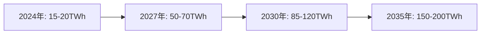

# 1.1.4 AI電力需要の爆発的増加：新たなパラダイムシフト

## データセンターの電力危機

生成AIの普及は、予想を超える速度で電力需要を押し上げている[5][6]：

Goldman Sachsの分析によれば、この需要を満たすためには：
- 2030年までに**85-90GW**の新規電力容量が必要
- これは現在の米国原子力容量（100GW）の**約80%に相当**
- 従来の再生可能エネルギーだけでは、ベースロード需要を満たせない

## 技術大手の原子力シフト

この危機感から、主要技術企業は原子力への大規模投資を開始している[7][8]：

| 企業 | 投資内容 | 規模 | 目標 |
|------|----------|------|------|
| Microsoft | Three Mile Island再稼働 | 16億ドル | 2028年運転開始（835MW） |
| Amazon | X-energy SMR開発 | 5億ドル | 2039年までに5GW |
| Google | Kairos Power契約 | 非公開 | 2030年代に500MW |
| Meta | 原子力RFP発行 | - | 2030年代初頭に1-4GW |

## 参考文献

[5] Goldman Sachs, "AI関連のエネルギー成長予測" (2024)
[6] 原子力工学における生成AI利用の国際動向に関する調査レポート (2025)
[7] Microsoft Three Mile Island原子力発電所再稼働投資計画 (2024)
[8] Amazon X-energy SMR開発投資発表 (2024)