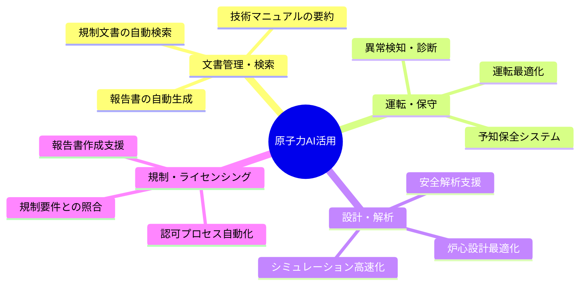

# 1.2.2 国内外の生成AI活用事例の体系的整理

## 包括的事例収集の必要性

現在、原子力分野における生成AI活用事例は世界中で急速に増加している。しかし、これらの情報は断片的に発表されることが多く、全体像を把握することは困難である。本研究では、以下の観点から体系的な整理を行う：

### 地理的な網羅性
- **北米**：米国の商用導入事例（ディアブロキャニオン原発等）
- **欧州**：フランス、ドイツ、英国の国家戦略と実装例
- **アジア太平洋**：日本、韓国、中国の技術開発動向
- **新興国**：原子力新興国での導入可能性

### 技術分野別の分類

### 実装段階別の評価
1. **概念実証（PoC）段階**：技術的可能性の検証
2. **パイロット段階**：限定的な実証試験
3. **商用展開段階**：本格的な運用開始
4. **大規模展開段階**：業界標準としての普及

## 成功要因と失敗要因の分析

各事例について、以下の観点から詳細な分析を実施する：

**成功要因**
- 経営トップのコミットメント
- 段階的導入アプローチ
- 人材育成への投資
- 規制当局との早期連携

**失敗要因**
- 技術的課題への対応不足
- セキュリティ対策の不備
- 組織内での抵抗
- ROI（投資対効果）の不明確性