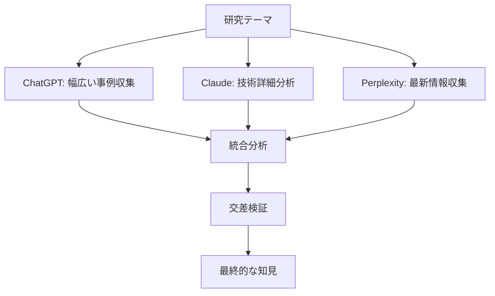

# 1.3.2 複数の生成AIプラットフォームのディープリサーチ機能活用

## マルチプラットフォーム戦略の設計

単一のAIプラットフォームに依存することのリスクを回避し、より包括的で信頼性の高い情報収集を実現するため、以下の3つの主要プラットフォームを戦略的に組み合わせた：



## 各プラットフォームの特性と活用方針

### 1. ChatGPT（OpenAI）
**役割**：幅広い事例収集と初期動向分析

**活用の理由**
- 2021年9月までの膨大な学習データによる包括的知識
- 多言語対応による国際情報の収集
- 創造的な分析と仮説生成能力

**具体的な活用方法**
```
・世界各国の原子力AI事例の網羅的収集
・技術トレンドの整理と分類
・市場動向の初期分析
・仮説生成とシナリオ作成
```

### 2. Claude（Anthropic）
**役割**：技術詳細と安全性要件の深掘り分析

**活用の理由**
- 長文処理能力（100k+トークン）による詳細分析
- 安全性とリスクに関する高度な推論能力
- 技術文書の精密な解析能力

**具体的な活用方法**
```
・技術仕様書の詳細分析
・安全性要件の体系的整理
・規制文書の精密な解釈
・リスク評価の多角的検討
```

### 3. Perplexity
**役割**：最新情報の収集と事実確認

**活用の理由**
- リアルタイム検索機能による最新情報アクセス
- 情報源の明示による信頼性確保
- 企業発表や政府文書の即座のキャッチアップ

**具体的な活用方法**
```
・最新の投資動向と企業発表の追跡
・政府政策の変更点の把握
・技術的進展のリアルタイム監視
・事実確認とソース検証
```

## 情報の交差検証プロセス

複数プラットフォームから得られた情報の信頼性を確保するため、以下の3段階検証プロセスを確立した：

**第1段階：プラットフォーム間の整合性確認**
- 同一事実に対する複数AI間での回答の比較
- 矛盾点の特定と追加調査の実施
- 不明確な点の明確化

**第2段階：一次資料との照合**
- AI回答の根拠となる元文書の確認
- 公式発表との整合性チェック
- 数値データの正確性検証

**第3段階：専門家による妥当性評価**
- 原子力専門家による技術的妥当性の確認
- AI専門家による技術解釈の検証
- 政策専門家による制度的側面の評価