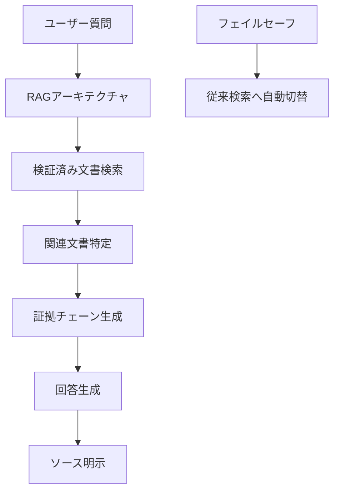

# 2.1.2 PG&Eディアブロキャニオン原発：世界初の商用導入革命

## 歴史的意義と技術的詳細

2024年11月、太平洋沿岸の美しい丘陵地帯に立つディアブロキャニオン原子力発電所で、原子力業界の歴史が変わった。PG&E（パシフィック・ガス・アンド・エレクトリック）とAtomic Canyon社による生成AI導入は、**米国、そして世界の原子力発電所における初の本格的商用生成AI導入**として記録された[1][2]。

### 技術アーキテクチャの革新性

システムの心臓部は、**NVIDIA H100 Tensor Core GPU 8台**から構成される最先端のオンサイトAIインフラである：

```
ハードウェア仕様：
├── GPU: NVIDIA H100 × 8台
│   ├── メモリ: 80GB HBM2e per GPU
│   ├── 演算能力: 60 teraflops (FP64) per GPU
│   └── 総演算能力: 480 teraflops
├── AIモデル: FERMI (Atomic Canyon製)
│   ├── アーキテクチャ: 原子力特化言語モデル
│   ├── 学習基盤: ORNL Frontier スーパーコンピュータ
│   ├── データソース: NRC規制文書
│   └── 学習データ: NRC ADAMS 5,300万ページ
└── セキュリティ: 完全エアギャップ環境
```

### 驚異的な性能指標

このシステムが達成した性能は、原子力業界の常識を覆すものだった：

| 指標 | 従来手法 | AI導入後 | 改善率 |
|------|----------|----------|--------|
| 文書検索時間 | 年間15,000時間 | 秒単位 | **99.9%短縮** |
| 検索精度（上位10件） | 60-70% | **98%** | 40%向上 |
| 検索精度（上位5件） | 50-60% | **93%** | 65%向上 |
| 年間コスト削減 | - | **225万ドル** | - |

:::message
**実際の活用例**：コンクリート構造物の交換プロジェクトでは、従来は設計基準、メンテナンス履歴、NRC基準の個別調査に数日を要していたが、統合検索により**数秒で関連情報を取得**できるようになった。
:::

## セキュリティ設計の徹底

原子力施設でのAI運用において最重要となるセキュリティ対策は、以下の多層的アプローチで実現されている：

### エアギャップ環境の実装
- **完全オフライン運用**：インターネットとの接続を物理的に遮断
- **機密情報の流出防止**：内部文書が施設外に出ることは絶対にない
- **NRC/DOE要件準拠**：すべての核情報要件を満足

### AI「幻覚」対策


## 参考文献
[1] L. Hahn, "For the First Time, AI is Being Used at a Nuclear Power Plant: Diablo Canyon," The Markup/CalMatters (2025)
[2] PG&Eディアブロキャニオン原発における生成AI利用に関する包括的調査報告書 (2025)