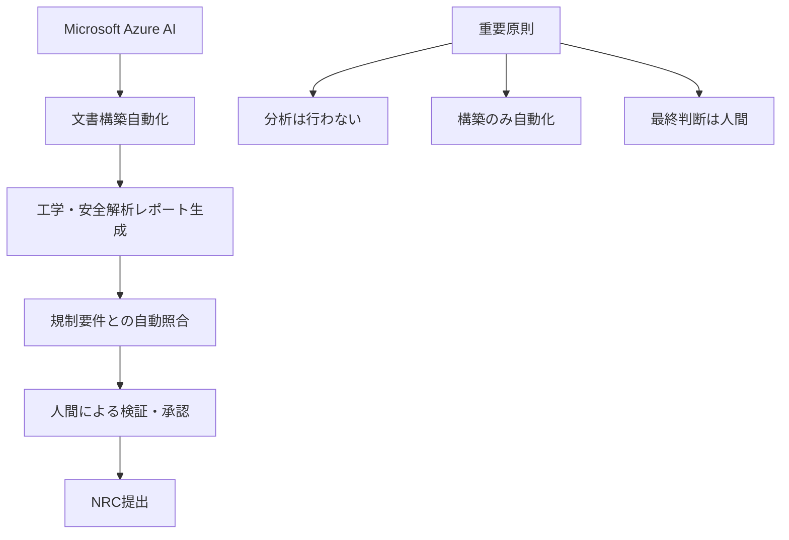

# 2.1.5 国立研究所の先端研究：ORNL FERMIモデル、INL-Microsoft協業

米国の原子力×AI分野におけるリーダーシップを技術面で支えているのが、世界最高水準の国立研究所群である。特に**オークリッジ国立研究所（ORNL）のFERMIモデル開発**と**アイダホ国立研究所（INL）とMicrosoftの協業**は、基礎研究から実用化まで一貫した技術開発エコシステムを形成している。

## ORNL FERMIモデル：世界最高峰の原子力専用AI

### Frontierスーパーコンピューターによる革新的開発
ORNLが開発したFERMIモデルは、世界最速のFrontierエクサスケールスーパーコンピューターを活用した画期的な成果である[7]：

```
FERMI開発プロジェクト:
├── 計算資源: Frontierスーパーコンピューター（世界最速）
├── 学習時間: 20,000 GPU時間
├── 学習データ: NRC ADAMS 5,300万ページ
├── 技術特徴: 原子力専門用語の単一トークン処理
└── 公開戦略: オープンソース（Apache 2.0）
```

### 原子炉設計最適化での劇的成果
FERMIモデルの実用性は、具体的な設計改善で実証されている：

| 項目 | 従来手法 | FERMIモデル | 改善率 |
|------|----------|-------------|--------|
| **温度ピーキング係数** | 基準値 | **3倍改善** | 300% |
| **設計評価数** | 数百パターン | **10,000パターン** | 20倍以上 |
| **設計時間** | 数ヶ月 | **数週間** | 75%短縮 |
| **最適化精度** | 局所最適 | **大域最適** | 質的向上 |

### 技術的アプローチの革新性
- **ガウス過程**とGPU縮約次数モデルの融合
- **物理制約**の統合による設計の実現可能性保証
- **ベイズアプローチ**による不確実性定量化
- **マルチフィジックス**シミュレーションとの連携

## INL-Microsoft協業：認可プロセス革命（6.7年→18ヶ月短縮）

2025年7月に発表されたINLとMicrosoftの戦略的パートナーシップは、原子力認可プロセスの根本的変革を目指す画期的な取り組みである[8]。

### 現状の深刻な課題
米国の原子力認可プロセスは、世界で最も時間とコストのかかるシステムの一つである：

```
現行認可プロセスの問題:
├── 平均認可期間: 6.7年
├── 文書作成負担: 申請書1万2,000ページ + 補足文書200万ページ
├── 総コスト: 5億ドル（NuScale SMR事例）
└── 人的負担: エンジニア・法務・コンプライアンス専門家が数年間専従
```

### Microsoft Azure AIによる革命的解決策
協業の核心は、**Azure AIサービスを活用した認可文書の自動構築**である：



### 劇的な改善目標
このAIソリューションが目指す改善効果は以下の通り：

| 指標 | 現状 | 目標 | 改善効果 |
|------|------|------|----------|
| **認可期間** | 6.7年 | **18ヶ月以内** | 78%短縮 |
| **文書作成** | 年単位 | **月単位** | 90%短縮 |
| **コスト** | 5億ドル | **数千万ドル** | 桁違い削減 |
| **人的負担** | 数年間専従 | **数ヶ月集中** | 80%削減 |

### 人間中心設計の重要性
このシステムで特筆すべきは、厳格な**人間による監督プロトコル**の維持である：

:::message
**Human-in-the-Loop設計原則**：
- AIは文書の**構築のみ**を自動化（分析は行わない）
- すべてのAI生成文書は**専門家による事後検証**が必須
- 最終的な意思決定権限は**常に人間が保持**
- 原子力エンジニア、法務、コンプライアンス専門家の知識を統合
:::

## アルゴンヌ国立研究所（ANL）：全所展開による実用知見蓄積

ANLの「Argo」チャットボットは、**全米国立研究所初の生成AI全所展開**として、組織レベルでのAI導入のベストプラクティスを蓄積している[9]：

### 展開実績
- **研修参加者**：約1,600人（全職員の大多数）
- **対象部門**：科学技術系から管理部門まで全部門横断
- **セキュリティ設計**：ユーザーデータ非保存・外部非共有
- **活用範囲**：コード生成、文書作成、翻訳、アイデア出し

### 組織変革のマネジメント知見
- **段階的導入**による組織的抵抗の最小化
- **部門別カスタマイズ**による実用性向上
- **継続的フィードバック**による改善サイクル確立
- **セキュリティと利便性**の最適バランス

## 3つの国立研究所の戦略的役割分担

```
国立研究所エコシステム:
├── ORNL: 基礎研究・モデル開発
│   └── 世界最高の計算資源でブレークスルー創出
├── INL: 産業界連携・実用化推進
│   └── Microsoft等との協業で商用化加速
└── ANL: 組織運用・普及モデル
    └── 実際の導入・運用ノウハウ蓄積
```

この3つの研究所の連携により、**基礎研究→応用開発→実用化→普及**という一貫した技術開発・実装パイプラインが構築されている。これこそが、米国が原子力×AI分野で他国を圧倒している根本的要因の一つである。

## 参考文献
[7] Oak Ridge National Laboratory, "AI-Driven Reactor Core Design Optimization" Technical Report (2024)
[8] Idaho National Laboratory, "Idaho National Laboratory collaborates with Microsoft to streamline nuclear licensing" (July 2025)
[9] Argonne National Lab., "How generative AI is changing work at a national laboratory," ANL Feature (2025)