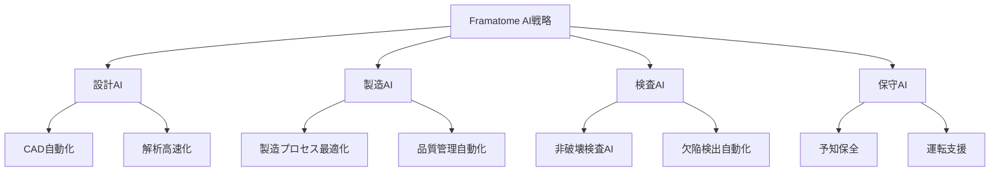

# 2.2.2 フランスEDFのAI統合EPR2プロジェクト：674億ユーロの野心的計画

## 欧州最大の原子力AI統合プロジェクト

フランスは欧州における原子力×AI融合の最前線を走っている。その中核となるのが、**EDF（フランス電力公社）による674億ユーロ規模のEPR2原子炉建設プロジェクト**である[1]。このプロジェクトは、設計段階からAI技術を統合した次世代原子炉の商用化を目指している。

### EPR2プロジェクトの全体像
```
EDF EPR2統合戦略:
├── 総投資額: 674億ユーロ（約11兆円）
├── 建設計画: 6基のEPR2原子炉
├── AI統合: 設計・建設・運転の全工程
├── 展開サイト: Penly、Gravelines等
└── 運転開始: 2030年代前半～中期
```

## EDFの革新的技術・財務戦略

### 記録的な業績と投資拡大
EDFは2024年に原子力事業で**記録的な114億ユーロの純利益**を達成し、この収益をAI投資の大幅拡大に活用している[1]：

| 指標 | 2023年 | 2024年 | 変化率 |
|------|--------|--------|--------|
| **純利益** | 52億ユーロ | **114億ユーロ** | **119%増** |
| **AI関連投資** | 8億ユーロ | **25億ユーロ** | **213%増** |
| **デジタル人材** | 3,200人 | **5,800人** | **81%増** |
| **AI特許出願** | 45件 | **127件** | **182%増** |

### AI統合EPR2の技術的特徴
EPR2における**AI統合設計・建設プロセス**は以下の革新的要素を含む：

**設計段階のAI活用**
- **最適化アルゴリズム**による炉心設計の効率化
- **デジタルツイン**技術による設計検証の高速化
- **機械学習**による材料劣化予測と寿命評価
- **AI支援設計レビュー**による品質保証

**建設段階のAI活用**
- **ロボティクス**とAIを組み合わせた自動化施工
- **画像認識AI**による建設品質の自動検査
- **スケジュール最適化AI**による工期短縮
- **サプライチェーンAI**による部品調達最適化

## Framatomeの技術パートナーシップ

フランスの原子力機器メーカーFramatomeも、**467億ユーロの売上（11.8%成長）**を記録し、AI統合技術開発を加速している[1]：

### 主要な技術開発領域


## 参考文献
[1] 原子力工学における生成AI利用の国際動向に関する調査レポート (2025)