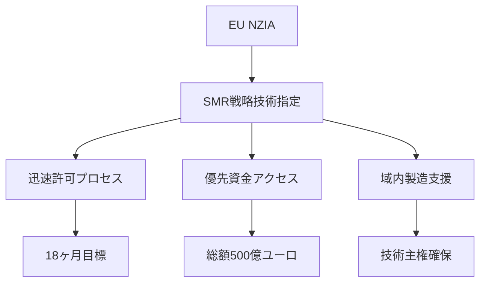

# 2.2.5 EU規制枠組みとイノベーション促進策

## Euratom研究訓練プログラムの戦略的投資

欧州連合は**Euratom研究訓練プログラム（2021-2025）**に**13.8億ユーロ**を配分し、AIを含むデジタル技術の原子力分野への統合を重点化している[4]。

### 投資配分の詳細
| 研究分野 | 予算配分 | AI関連割合 | 主要プロジェクト |
|----------|----------|------------|------------------|
| **核融合研究** | 5.6億ユーロ | 25% | ITER AI制御システム |
| **核分裂安全** | 2.9億ユーロ | 40% | 安全解析AI |
| **放射線防護** | 1.4億ユーロ | 30% | 被ばく線量予測AI |
| **廃棄物管理** | 1.8億ユーロ | 35% | 処分場AI監視 |
| **人材育成** | 2.1億ユーロ | 45% | AI教育プログラム |

## EU Net Zero Industrial Act（NZIA）の戦略的位置づけ

2024年に施行されたEU Net Zero Industrial Act（NZIA）は、**SMRを戦略的技術として指定**し、迅速な許可と欧州資金へのアクセスを提供している[4]：

### NZIA支援メカニズム

## 参考文献
[4] Euratom研究訓練プログラム2021-2025実施状況報告 (2024)