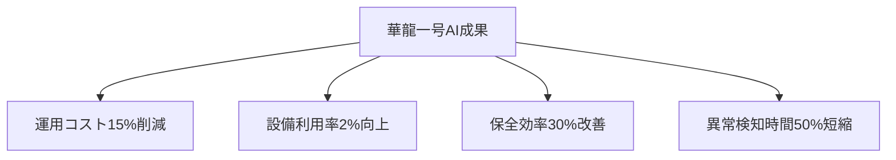

# 2.3.3 中国の大規模統合戦略：55基以上の原発でAI活用

## 世界最大の自給自足型原子力産業

中国は**55基以上の原子力発電所（53.3GW容量）**を運転し、世界最大の自給自足型原子力産業を構築している[2]。この巨大な産業基盤を活用して、**大規模統合戦略**による原子力×AI融合を推進している。

### 中国原子力産業の全体像
| 指標 | 数値 | 世界順位 | 特徴 |
|------|------|----------|------|
| **運転中原発** | 55基以上 | **2位** | 急速な拡大継続中 |
| **建設中原発** | 21基 | **1位** | 世界の新設の60% |
| **総容量** | 53.3GW | **2位** | 2030年に120GW目標 |
| **技術自給率** | 85%以上 | - | 華龍一号で技術自立達成 |

## 中国核工業集団（CNNC）の統合戦略

### 25組織コンソーシアムによる大規模開発
中国核工業集団（CNNC）は2024年1月に**25組織のコンソーシアム**を主導し、**原子力融合AI開発**を進めている[2]：

```
CNNC AI統合コンソーシアム:
├── 中核企業: CNNC（中国核工業集団）
├── 参加組織: 25の研究機関・企業
├── 研究分野: 
│   ├── 核融合制御AI
│   ├── 核分裂炉AI統合
│   ├── 核燃料サイクルAI
│   └── 放射性廃棄物AI管理
├── 投資規模: 50億人民元（約1,000億円）
└── 目標期間: 2024-2030年
```

## 華龙一号（Hualong One）のAI駆動運用

### 世界最大規模のAI統合原子炉群
中国独自開発の**華龍一号（Hualong One）**は、**世界中で41基が承認または運転中**であり、最大規模のAI統合原子炉群を形成している[2]：

### FirmSysデジタル計装制御プラットフォーム
華龍一号の中核技術である**FirmSysデジタル計装制御プラットフォーム**には、以下のAIアルゴリズムが搭載されている：

**主要AI機能**
1. **運転最適化AI**
   - リアルタイム運転パラメータ最適化
   - 負荷追従運転の自動制御
   - 燃料消費最小化アルゴリズム

2. **予知保全AI**
   - 振動・温度・圧力データの統合分析
   - 機器劣化パターンの機械学習
   - 最適保全タイミングの自動提案

3. **安全監視AI**
   - 多重化された安全システムの統合監視
   - 異常兆候の早期検出と分類
   - 事故進展予測と対策提案

### 定量的成果


## 中国の技術自立戦略

### 核心技術の完全自主開発
中国の原子力×AI戦略の特徴は、**核心技術の完全自主開発**への強いこだわりである：

**自主開発技術スタック**
```
中国自主技術スタック:
├── ハードウェア層
│   ├── 龍芯（Loongson）CPU
│   ├── 海光（Hygon）AI/サーバプロセッサ
│   └── 華為（Huawei）昇騰（Ascend）AIチップ
├── システム層
│   ├── 麒麟（Kylin）OS
│   ├── FirmSys制御システム
│   └── 独自分散制御システム
├── AI層
│   ├── PaddlePaddle深層学習フレームワーク
│   ├── 百度（Baidu）ERNIE大規模言語モデル
│   └── 原子力専用AIモデル群
└── アプリケーション層
    ├── 運転支援システム
    ├── 保全管理システム
    └── 安全監視システム
```

## 参考文献
[2] 中国核工業集団（CNNC）AI統合戦略資料 (2024)