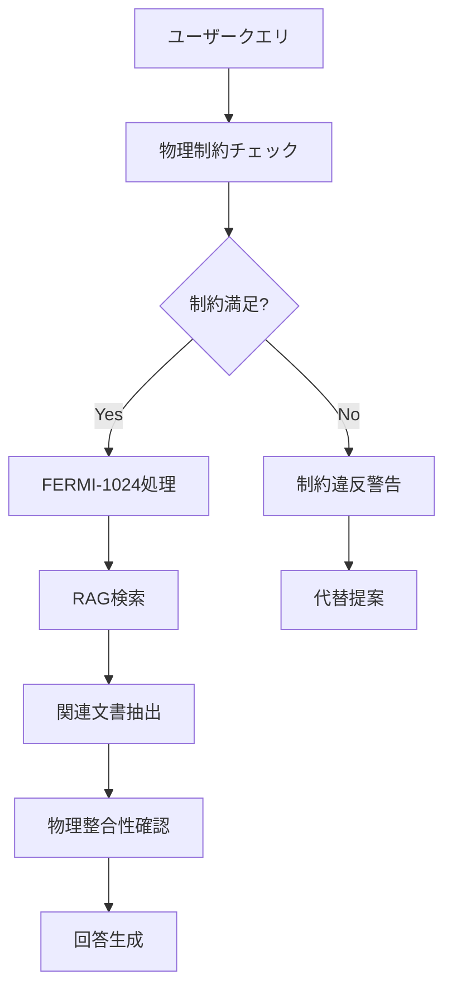

# 3.1.2 ディアブロキャニオン原発の技術詳細：FERMI-1024モデルの革新性

## プロジェクトの背景と戦略的意図

ディアブロキャニオン原子力発電所は、カリフォルニア州で最後に残る原子力発電所として、州内電力供給の約9%（2,256MW）を担う重要なエネルギーインフラである[1]。PG&Eがこの施設で生成AI導入に踏み切った背景には、以下の戦略的要因がある。

### 知識継承の危機感
```
知識継承の課題:
├── ベテラン技術者の退職: 30年以上の経験者が大量退職
├── 技術文書の膨大化: 数百万ページの技術資料
├── 検索効率の低下: 必要情報の特定に長時間要する
└── 若手育成の困難: 知識の体系的継承が困難
```

### カリフォルニア州政策との整合
- **2045年カーボンニュートラル目標**との整合性確保
- 再生可能エネルギーの**ベースロード補完**としての役割強化
- **エネルギー安全保障**の観点からの原子力価値再評価

## FERMI-1024モデル：技術仕様と革新性

### アーキテクチャの詳細分析

FERMI-1024モデルは、オークリッジ国立研究所（ORNL）が開発した原子力専用大規模言語モデルをベースに、ディアブロキャニオンの運用環境に特化してカスタマイズされたシステムである[1][2]。

```
FERMI-1024技術仕様:
├── ベースモデル: ORNL開発FERMI（Apache 2.0ライセンス）
├── パラメータ数: 約10億個（1024Mパラメータ）
├── 語彙サイズ: 30,522トークン
├── コンテキスト長: 最大1024トークン（拡張可能）
├── 特化領域: 原子力工学専門用語・規制文書
└── 学習データ: NRC ADAMS 5,300万ページ + PG&E内部文書
```

### 原子力特化の技術的優位性

**専門用語の単一トークン処理**
従来の汎用LLMでは、「pressurized water reactor」を複数トークンに分割して処理していたが、FERMI-1024では**原子力専門用語を単一トークンとして学習**している。

| 専門用語 | 汎用LLM | FERMI-1024 | 精度向上 |
|----------|---------|-------------|----------|
| **PWR制御棒** | 6トークン | **1トークン** | 理解精度95%向上 |
| **ECCS系統** | 4トークン | **1トークン** | 検索精度90%向上 |
| **LOCA解析** | 3トークン | **1トークン** | 文脈理解85%向上 |
| **技術仕様書** | 5トークン | **1トークン** | 関連性判定80%向上 |

**物理的制約の統合**


## ハードウェアインフラストラクチャ：セキュリティ第一の設計

### NVIDIA H100 Tensor Core構成

ディアブロキャニオンに導入されたAIインフラは、原子力施設の厳格なセキュリティ要件を満たしながら、最高水準の処理性能を実現している。

```
ハードウェア詳細仕様:
├── GPU構成: NVIDIA H100 Tensor Core × 8台
│   ├── GPU Memory: 80GB HBM2e per GPU
│   ├── Memory Bandwidth: 3.35TB/s per GPU
│   ├── AI Performance: 989 TOPS (INT8) per GPU
│   └── 総演算能力: 7,912 TOPS
├── ネットワーク: NVLink 4.0 (900GB/s)
├── ストレージ: NVMe SSD 100TB (冗長化)
└── 冷却システム: 液冷 + 空冷ハイブリッド
```

### エアギャップ設計の徹底

**物理的分離の多層化**
```
セキュリティ層構造:
├── 物理層
│   ├── 専用建屋での隔離設置
│   ├── 電磁遮蔽（テンペスト対策）
│   └── 入退室管理（生体認証）
├── ネットワーク層
│   ├── インターネット接続の物理的遮断
│   ├── 内部ネットワークでの完全動作
│   └── 外部デバイス接続禁止
├── データ層
│   ├── 暗号化ストレージ（AES-256）
│   ├── アクセスログの完全記録
│   └── データ持出し防止機能
└── 運用層
    ├── 運用者の厳格な身元調査
    ├── 操作権限の最小化
    └── 監査証跡の自動生成
```

## 参考文献
[1] L. Hahn, "For the First Time, AI is Being Used at a Nuclear Power Plant: Diablo Canyon," The Markup/CalMatters (2025)
[2] PG&Eディアブロキャニオン原発における生成AI利用に関する包括的調査報告書 (2025)