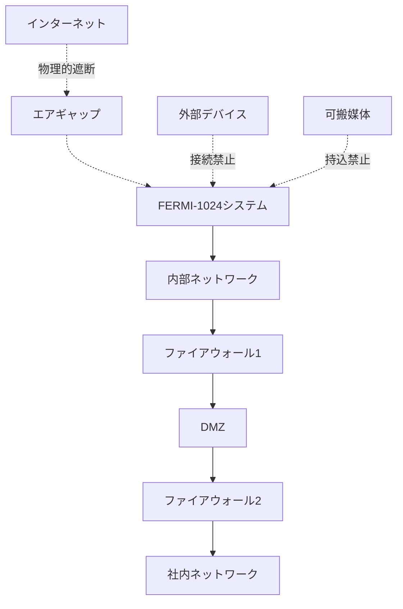

# 3.1.4 エアギャップ環境でのセキュアな運用：セキュリティ設計の詳細

## セキュリティ第一の設計哲学

ディアブロキャニオンでのFERMI-1024運用において最も重要な要素は、**原子力施設の厳格なセキュリティ要件との完全な整合**である。この実現のため、以下の多層的セキュリティアーキテクチャが採用されている。

### エアギャップ設計の詳細実装

**物理的分離の徹底**
```
物理セキュリティ階層:
├── Tier 1: 建屋レベル分離
│   ├── 専用AI計算棟の建設
│   ├── 電磁波遮蔽（TEMPEST基準準拠）
│   ├── 振動・音響遮蔽
│   └── 環境制御（温湿度・清浄度）
├── Tier 2: 室レベル分離  
│   ├── Faradayケージ内設置
│   ├── 二重扉による入退室管理
│   ├── 生体認証（指紋・虹彩・静脈）
│   └── 金属探知・X線検査
├── Tier 3: 機器レベル分離
│   ├── ラック単位での物理的隔離
│   ├── ケーブル経路の物理的分離
│   ├── 電源系統の独立化
│   └── 冷却系統の独立運用
└── Tier 4: コンポーネントレベル
    ├── USB/外部ポート無効化
    ├── 無線機能の物理的除去
    ├── デバッグポート封印
    └── ファームウェア署名検証
```

### ネットワークセキュリティの実装

**完全内製ネットワーク環境**


**データの流入・流出制御**
- **一方向データ転送**：必要時のみ、専用の一方向ゲートウェイ経由
- **完全な監査証跡**：すべてのデータアクセスを秒単位で記録
- **自動異常検知**：通常パターンからの逸脱を即座に検出・警告

### AI特有のセキュリティ対策

**「幻覚」対策の多層実装**
```
AI幻覚防止システム:
├── Level 1: RAGアーキテクチャ
│   ├── 検証済み文書データベースのみ参照
│   ├── ソース文書の自動提示
│   └── 信頼度スコアの表示
├── Level 2: 回答検証機能
│   ├── 複数の情報源での交差確認
│   ├── 物理法則との整合性チェック
│   └── 過去の実績データとの照合
├── Level 3: 人間による検証
│   ├── すべての重要回答の専門家確認
│   ├── 承認ワークフローの自動化
│   └── 責任の所在の明確化
└── Level 4: フェイルセーフ機能
    ├── 不確実な場合の従来検索への自動切替
    ├── 警告メッセージの自動表示
    └── 操作ログの詳細記録
```

## 規制当局との協調：NRC承認プロセス

### NRC（米国原子力規制委員会）との事前協議

**段階的承認アプローチ**
```
NRC承認プロセス:
├── Phase 1: 概念設計承認 (完了)
│   ├── セキュリティ設計の基本承認
│   ├── 安全性評価手法の確認
│   └── 運用制限事項の設定
├── Phase 2: 詳細設計承認 (完了)
│   ├── 技術仕様の詳細審査
│   ├── V&V計画の承認
│   └── サイバーセキュリティ計画承認
├── Phase 3: 試運転承認 (完了)
│   ├── 限定的運用での性能確認
│   ├── セキュリティテストの実施
│   └── 運用手順の最終確認
└── Phase 4: 本格運用承認 (完了)
    ├── 全機能での運用許可
    ├── 定期的な性能評価義務
    └── 継続的改善要求
```

### 継続的な安全性監視

**24時間365日監視体制**
- **リアルタイム性能監視**：システム応答時間、精度指標の連続監視
- **セキュリティ監視**：不正アクセス試行、異常動作の即座検出
- **運用監視**：利用パターン分析、改善点の継続的特定