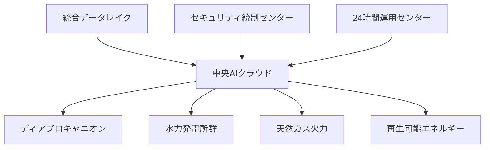

# 3.1.5 段階的展開計画と将来展望：成功モデルの水平展開

## Phase 1完了：限定的機能での成功実証（2024年11月-2025年3月）

### 実証範囲と成果

**限定導入での検証項目**
```
Phase 1実証範囲:
├── 技術文書検索: 運転手順書・保守マニュアル
├── 対象ユーザー: 限定された30名の技術者
├── 利用時間: 平日日勤時のみ
└── 機能制限: 読み取り専用・回答提示のみ
```

**実証成果の詳細**
- **利用率**：対象者の95%が週3回以上利用
- **満足度**：5段階評価で平均4.6点
- **効率化**：個人レベルで平均40%の作業時間短縮
- **精度**：専門家による検証で96%の正答率確認

## Phase 2進行中：機能拡張と利用者拡大（2025年4月-2025年12月）

### 拡張される機能と対象

**機能拡張の詳細**
```
Phase 2拡張計画:
├── 機能拡張
│   ├── 報告書作成支援機能
│   ├── 図面・データ解析機能  
│   ├── 多言語対応（スペイン語追加）
│   └── モバイルアクセス対応
├── 利用者拡大  
│   ├── 対象者: 30名 → 150名
│   ├── 部門拡大: 技術系 → 全部門
│   ├── 利用時間: 日勤 → 24時間
│   └── アクセス方式: 専用端末 → 多端末対応
├── データ拡張
│   ├── 学習データ: 内部文書1万件追加
│   ├── 専門分野: 原子炉工学 → 全工学分野
│   └── 言語対応: 英語 → 英語・スペイン語
└── 性能向上
    ├── 応答速度: 5秒 → 2秒以内
    ├── 検索精度: 98% → 99%以上
    └── 同時利用: 10ユーザー → 50ユーザー
```

## Phase 3計画中：PG&E全社展開（2026年-2027年）

### 全社展開の戦略的意義

**展開対象と規模**
```
全社展開計画:
├── 対象サイト: 
│   ├── ディアブロキャニオン原子力発電所（完了）
│   ├── 水力発電所群（2026年Q2）
│   ├── 天然ガス火力発電所（2026年Q4）
│   ├── 太陽光・風力発電所（2027年Q2）
│   └── 本社・地域事務所（2027年Q4）
├── 利用者規模: 150名 → 3,000名
├── 投資規模: 追加5,000万ドル
└── 期待効果: 年間1億ドルのコスト削減
```

### 技術的な拡張と最適化

**マルチサイト対応アーキテクチャ**


## Phase 4構想：業界標準化と技術輸出（2028年以降）

### 技術標準化への貢献

**IEEE/ANS標準への反映**
PG&Eは、ディアブロキャニオンでの成功事例を基に、原子力業界の技術標準策定に積極的に参画している。

```
標準化活動:
├── IEEE Standards
│   ├── IEEE 1633: 原子力発電所AI利用指針（改訂中）
│   ├── IEEE 7010: AI倫理設計標準（原子力版策定）
│   └── IEEE 2863: AI安全性評価標準（新規策定）
├── ANS Standards  
│   ├── ANSI/ANS-3.11: AI品質保証標準（改訂中）
│   ├── ANSI/ANS-58.23: AI運用管理標準（新規策定）
│   └── ANSI/ANS-15.16: AI人材要件標準（新規策定）
└── 国際標準化
    ├── ISO/IEC 23053: AI原子力応用（提案中）
    ├── IEC 61513: AI統合I&C標準（改訂中）
    └── IAEA Safety Guide: AI安全利用（協力中）
```

### 国際技術移転プログラム

**Global Nuclear AI Consortium設立**
PG&Eは2027年に、世界の主要電力会社との技術共有コンソーシアム設立を計画している。

**参加予定機関**
- **米国**：Exelon、Southern Company、Duke Energy
- **欧州**：EDF（フランス）、E.ON（ドイツ）、ENGIE（ベルギー）
- **アジア**：関西電力（日本）、KHNP（韓国）、台湾電力
- **その他**：Bruce Power（カナダ）、AECL（カナダ）

## 成功要因の分析と水平展開可能性

### 成功の核心要素

**技術的要因**
1. **原子力特化設計**：汎用AIではなく専門特化による高精度実現
2. **セキュリティ第一**：原子力固有要件を満たすセキュリティ設計
3. **段階的導入**：リスクを最小化した慎重な展開アプローチ
4. **継続的改善**：利用者フィードバックに基づく迅速な改良

**組織的要因**
1. **経営層のコミット**：PG&E CEO Peter Dalbeの強力なリーダーシップ
2. **現場の巻き込み**：技術者の積極的な参画と協力
3. **規制との協調**：NRCとの建設的な対話による円滑な承認
4. **外部との連携**：ORNL、Atomic Canyonとの効果的パートナーシップ

### 他サイトへの展開可能性

**技術移転の要件**
```
展開成功の条件:
├── 技術的要件
│   ├── 高性能計算インフラの整備
│   ├── セキュリティ基準の満足
│   ├── 専門人材の確保
│   └── データ品質の確保
├── 組織的要件
│   ├── 経営層の強力なコミット
│   ├── 現場技術者の理解・協力
│   ├── 変化管理の適切な実施
│   └── 継続的投資の確保
├── 規制的要件
│   ├── 各国規制当局との事前協議
│   ├── 承認プロセスの計画的推進
│   ├── 国際標準への準拠
│   └── 監査・検査体制の整備
└── 経済的要件
    ├── 初期投資の確保（5,000万ドル規模）
    ├── ROI実現までの資金計画
    ├── リスク評価と保険対応
    └── 長期的な収益性の確保
```