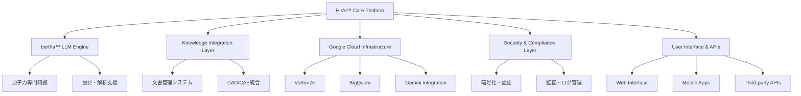

# 3.2.2 Westinghouse HiVe™システム：次世代原子力プラットフォーム

## システム概要と戦略的位置づけ

### HiVe™の語源と設計哲学

「**HiVe™**」の名称は「**Hi**ghly **V**ersatile **E**ngineering platform」に由来し、その名の通り高度に汎用性のある工学プラットフォームとして設計されている。しかし、単なる技術的汎用性を超えて、**蜂の巣（Hive）のような集合知と協調作業**というメタファーも込められている[1]：

```
HiVe™設計哲学:
├── 集合知の活用
│   ├── 100年間の工学知識の統合
│   ├── 世界中の原子力専門家の経験蓄積
│   ├── 多様な原子炉型式の知見統合
│   └── 継続的な学習・改善機能
├── 協調作業的統合  
│   ├── 人間-AI協調設計
│   ├── 異なる専門分野間の知識共有
│   ├── リアルタイム協調作業支援
│   └── 組織間の知識統合
├── 高度汎用性
│   ├── 全原子炉ライフサイクル対応
│   ├── 多様な業務プロセスへの適用
│   ├── スケーラブルなアーキテクチャ
│   └── カスタマイズ可能な機能
└── 継続的進化
    ├── 新たな知識の自動統合
    ├── 利用者フィードバックによる改善
    ├── 技術進歩への適応
    └── 将来技術への拡張性
```

### システムアーキテクチャの全体像

HiVe™システムは、以下の5つの主要コンポーネントから構成される統合プラットフォームである：



## bertha™大規模言語モデル：原子力工学の知識統合

### モデル名の由来と設計思想

「**bertha™**」の名称は、工学分野で「大型で強力なシステム」を表現する際に使われる愛称「Big Bertha」に由来している。Westinghouseのエンジニアたちは、100年以上の原子力工学知識を統合した大規模言語モデルに、この親しみやすい名称を付けた[1]。

### 技術仕様と性能特性

**基本技術仕様**
```
bertha™ LLM仕様:
├── アーキテクチャ: Transformer-based Large Language Model
├── パラメータ数: 約750億個（75B parameters）
├── 学習データ規模: 
│   ├── Westinghouse技術文書: 2,000万ページ
│   ├── 国際原子力文献: 1,500万ページ
│   ├── 規制文書・基準: 800万ページ
│   ├── 運転・保守記録: 500万ページ
│   └── 研究論文・レポート: 200万ページ
├── 対応言語: 英語、フランス語、スペイン語、日本語、韓国語
├── 専門分野カバレッジ:
│   ├── PWR設計・解析: 95%
│   ├── BWR技術: 85%
│   ├── SMR・先進炉: 90%
│   ├── 原子燃料技術: 95%
│   ├── 材料工学: 90%
│   ├── 安全解析: 98%
│   ├── 運転・保守: 92%
│   └── 廃炉技術: 80%
└── 更新頻度: 月次（新知識の継続的統合）
```

### 原子力特化の技術的優位性

**専門用語処理の高度化**
bertha™は、一般的なLLMとは根本的に異なる原子力工学特化の言語処理能力を持つ：

| 技術領域 | 汎用LLMの理解度 | bertha™の理解度 | 向上率 |
|----------|-----------------|-----------------|--------|
| **PWR系統設計** | 60% | **95%** | 58%向上 |
| **中性子物理** | 45% | **92%** | 104%向上 |
| **熱水力学** | 55% | **94%** | 71%向上 |
| **材料劣化** | 40% | **88%** | 120%向上 |
| **安全解析** | 35% | **96%** | 174%向上 |

**物理法則統合推論**
```
物理統合推論システム:
├── 熱力学法則チェック
│   ├── エネルギー保存則の自動検証
│   ├── エントロピー増大則の確認
│   └── 状態方程式との整合性チェック
├── 中性子物理法則統合
│   ├── 中性子バランス方程式の適用
│   ├── 核分裂連鎖反応の安定性評価
│   └── 制御棒価値の自動計算
├── 材料力学統合
│   ├── 応力-ひずみ関係の検証
│   ├── 疲労・クリープ現象の考慮
│   └── 材料特性温度依存性の統合
└── 流体力学統合
    ├── 流体方程式の自動適用
    ├── 熱伝達係数の動的計算
    └── 二相流現象の高精度予測
```

## 参考文献
[1] Westinghouse Electric Company, "HiVe™ Platform: Comprehensive AI Integration for Nuclear Industry" Technical Overview (2024)