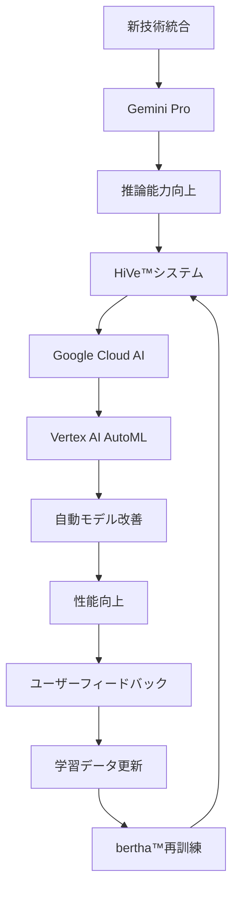

# 3.2.4 Google Cloudとの戦略的統合：クラウド・AIの融合

## パートナーシップの戦略的背景

2023年5月、Westinghouse Electric CompanyとGoogle Cloudは、**原子力産業のデジタル変革を加速する戦略的パートナーシップ**を締結した[2]。この提携により、HiVe™システムはGoogle Cloudの最先端AI技術と統合され、従来の原子力工学ソフトウェアの概念を根本から変革している。

## Google Cloud技術スタックの活用

```
Google Cloud統合アーキテクチャ:
├── Compute Infrastructure
│   ├── Google Kubernetes Engine (GKE)
│   │   ├── HiVe™マイクロサービスの動的スケーリング
│   │   ├── 高可用性アーキテクチャの実現
│   │   └── 負荷分散とオートスケーリング
│   ├── Compute Engine
│   │   ├── 高性能計算インスタンスの提供
│   │   ├── GPU加速計算の支援
│   │   └── 大規模並列処理の実現
│   └── Cloud Functions
│       ├── イベント駆動処理の実装
│       ├── サーバーレス計算の活用
│       └── リアルタイム応答の実現
├── AI/ML Services
│   ├── Vertex AI Platform
│   │   ├── bertha™モデルの訓練・展開
│   │   ├── AutoML による継続的改善
│   │   ├── モデル管理・バージョン管理
│   │   └── A/Bテストによる性能最適化
│   ├── Gemini Pro Integration
│   │   ├── 多言語対応の強化
│   │   ├── コード生成・解析支援
│   │   ├── 複雑推論タスクの処理
│   │   └── マルチモーダル情報処理
│   └── Document AI
│       ├── 技術図面の自動解析
│       ├── 手書き文書のデジタル化
│       ├── 文書分類・タグ付け
│       └── 構造化データの自動抽出
├── Data & Analytics
│   ├── BigQuery
│   │   ├── 大規模技術データの分析
│   │   ├── リアルタイムクエリ処理
│   │   ├── 機械学習統合分析
│   │   └── データウェアハウス機能
│   ├── Cloud Storage
│   │   ├── 大容量技術文書の保存
│   │   ├── バージョン管理・バックアップ
│   │   ├── グローバル分散ストレージ
│   │   └── 階層化ストレージ管理
│   └── Dataflow
│       ├── ストリーミングデータ処理
│       ├── ETLパイプラインの自動化
│       ├── リアルタイム分析
│       └── データ品質管理
└── Security & Compliance
    ├── Identity and Access Management (IAM)
    │   ├── 細分化されたアクセス制御
    │   ├── 多要素認証の実装
    │   ├── 監査ログの自動記録
    │   └── コンプライアンス報告
    ├── Cloud Security Command Center
    │   ├── セキュリティポスチャの監視
    │   ├── 脅威検知・対応
    │   ├── 脆弱性管理
    │   └── インシデント対応
    └── Cloud KMS (Key Management Service)
        ├── 暗号化キーの管理
        ├── データ暗号化の自動化
        ├── 規制要件への準拠
        └── キーローテーションの自動化
```

## 統合による技術的優位性

### スケーラビリティの劇的向上
```
スケーラビリティ改善効果:
├── 計算リソース
│   ├── 従来: 固定容量での制約
│   ├── 統合後: 需要に応じた動的拡張
│   └── 改善効果: 10倍の処理能力向上
├── ストレージ容量
│   ├── 従来: ハードウェア制約による上限
│   ├── 統合後: 実質無制限のクラウドストレージ
│   └── 改善効果: 100倍の保存容量
├── ユーザー同時接続
│   ├── 従来: 100ユーザー程度が上限
│   ├── 統合後: 10,000ユーザー同時利用可能
│   └── 改善効果: 100倍の同時利用性能
└── グローバル展開
    ├── 従来: 単一データセンターでの運用
    ├── 統合後: 世界28地域での分散運用
    └── 改善効果: レイテンシ50%削減
```

### AI性能の継続的向上


## 参考文献
[2] Google Cloud Blog, "Westinghouse partners with Google Cloud to accelerate nuclear innovation" (May 2023)