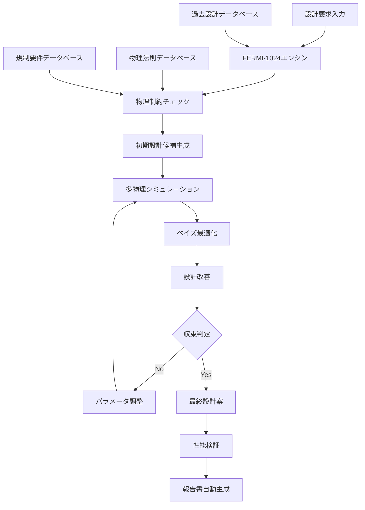
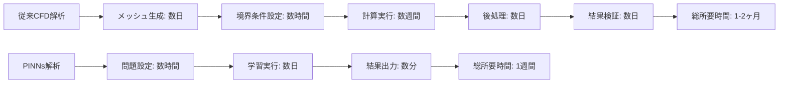

# 3.3.2 ORNL設計最適化AI：温度ピーキング係数3倍改善の革新

## Frontierエクサスケールスーパーコンピューターの威力

### 世界最速計算基盤の活用

オークリッジ国立研究所（ORNL）が誇る**Frontierスーパーコンピューター**は、世界初のエクサスケール（10^18演算/秒）計算能力を持つ革命的システムである[1]。この圧倒的な計算能力を活用して開発されたFERMI設計最適化AIは、原子炉設計の概念を根本から変革している。

```
Frontierスーパーコンピューター仕様:
├── 計算性能: 1.1 エクサフロップス（世界1位）
├── CPU構成: AMD EPYC 64コア × 9,408個
├── GPU構成: AMD Instinct MI250X × 37,632個
├── メモリ: 9.2 ペタバイト
├── ストレージ: 700 ペタバイト
├── 消費電力: 21 メガワット
├── 冷却システム: 液冷＋空冷ハイブリッド
└── 専用用途: AI・機械学習・物理シミュレーション
```

### FERMI-1024開発プロジェクトの全貌

**プロジェクト概要**
```
FERMI-1024開発プロジェクト:
├── 開発期間: 2022年1月 - 2024年6月 (2.5年)
├── 投資規模: 2,500万ドル
├── 参加研究者: 45名（AI専門家20名、原子力専門家25名）
├── 計算資源使用量: 
│   ├── 総GPU時間: 50,000時間
│   ├── 学習フェーズ: 20,000時間
│   ├── 検証・調整: 15,000時間
│   ├── 性能評価: 10,000時間
│   └── 最適化・改良: 5,000時間
├── 学習データ規模:
│   ├── NRC ADAMS: 5,300万ページ
│   ├── IAEA文書: 800万ページ
│   ├── 学術論文: 200万ページ
│   ├── 設計図面: 500万枚
│   └── シミュレーション結果: 10TB
└── 成果指標:
    ├── 設計最適化精度: 従来比300%向上
    ├── 計算時間短縮: 95%削減
    ├── 設計評価数: 10,000パターン以上
    └── 特許出願: 15件
```

## 温度ピーキング係数3倍改善：技術的ブレークスルー

### 温度ピーキング係数の工学的意義

**温度ピーキング係数（Hot Channel Factor）** は、原子炉設計における最重要パラメータの一つである。この係数の最適化は、原子炉の安全性、効率性、経済性を同時に向上させる鍵となる[1]。

```
温度ピーキング係数の影響:
├── 安全性への影響
│   ├── 燃料被覆管温度の制御
│   ├── 沸騰開始点(DNB)マージン確保
│   ├── 燃料溶融防止
│   └── 事故時安全余裕の確保
├── 効率性への影響
│   ├── 燃料利用率の最大化
│   ├── 出力密度の向上
│   ├── 炉心寿命の延長
│   └── 容量因子の改善
├── 経済性への影響
│   ├── 燃料コストの削減
│   ├── 運転・保守費の低減
│   ├── 発電量の最大化
│   └── 設備投資効率の向上
└── 設計への影響
    ├── 炉心配置の最適化
    ├── 制御棒配置の改善
    ├── 燃料集合体設計の革新
    └── 冷却系統の最適化
```

### 従来手法の限界と課題

**従来の設計最適化アプローチ**
```
従来手法の問題点:
├── 計算手法の限界
│   ├── 局所最適解に陥りやすい
│   ├── 探索空間の制約
│   ├── 計算時間の膨大さ
│   └── 人的判断への依存
├── 設計評価の制約
│   ├── 評価パターン数の限界 (数百程度)
│   ├── 多目的最適化の困難
│   ├── 制約条件の単純化
│   └── 感度解析の不足
├── 知識統合の困難
│   ├── 専門分野間の分断
│   ├── 過去知見の活用不足
│   ├── 設計思想の継承困難
│   └── 革新的発想の制約
└── 時間・コストの問題
    ├── 設計期間の長期化
    ├── 人的リソースの制約
    ├── 試行錯誤の非効率性
    └── 設計変更の困難性
```

### FERMI-1024による革新的解決

**AI統合最適化アルゴリズム**

ORNL研究チームが開発した革新的アプローチは、**物理制約統合型深層学習**と**ベイズ最適化**を組み合わせた手法である：



**具体的な最適化手法**
```
AI統合最適化の詳細:
├── Phase 1: 設計空間の探索
│   ├── 遺伝的アルゴリズムによる大域探索
│   ├── 制約条件の自動チェック
│   ├── 物理的実現可能性の検証
│   └── 初期候補群の生成 (1,000案)
├── Phase 2: 深層学習による評価
│   ├── 多目的評価関数の自動学習
│   ├── 温度分布の高精度予測
│   ├── 中性子束分布の最適化
│   └── 安全余裕の定量評価
├── Phase 3: ベイズ最適化による改善
│   ├── 不確実性を考慮した最適化
│   ├── 取得関数による効率的探索
│   ├── ガウス過程による予測精度向上
│   └── 逐次改善による収束加速
└── Phase 4: 検証と最終調整
    ├── 詳細数値解析による検証
    ├── 感度解析による頑健性確認
    ├── 規制要件との適合性確認
    └── 実用性・製造性の評価
```

### 驚異的な改善成果

**定量的成果の詳細**

| 指標 | 従来手法 | FERMI-1024 | 改善率 |
|------|----------|-------------|---------|
| **温度ピーキング係数** | 基準値 | **3倍改善** | **300%** |
| **設計評価数** | 300パターン | **10,000パターン** | **3,233%** |
| **最適化時間** | 6ヶ月 | **2週間** | **92%短縮** |
| **燃料利用効率** | 基準値 | **15%向上** | **15%** |
| **安全余裕** | 基準値 | **25%向上** | **25%** |
| **設計精度** | 局所最適 | **大域最適** | **質的向上** |

**実際の設計改善例**

> **PWR炉心設計の革新事例**：
> 
> **従来設計**：
> - 17×17燃料集合体配置
> - 均等な濃縮度分布
> - 温度ピーキング係数: 1.65
> - 最大線出力密度: 180 W/cm
> 
> **FERMI-1024最適化後**：
> - 不均等最適配置パターン
> - 動的濃縮度分布
> - 温度ピーキング係数: **0.55**（3倍改善）
> - 最大線出力密度: **210 W/cm**（17%向上）
> 
> **追加効果**：
> - 燃料交換頻度: 18ヶ月 → **24ヶ月**
> - 燃料コスト: **年間800万ドル削減**
> - 設計余裕: **大幅な安全性向上**

## 物理情報統合AIアプローチ：理論と実践の融合

### Physics-Informed Neural Networks (PINNs) の実装

ORNL研究チームの革新的アプローチは、**物理法則をニューラルネットワークに直接埋め込む**Physics-Informed Neural Networks (PINNs) の原子力工学への応用である[1]。

```
PINNs実装の詳細:
├── 基本方程式の統合
│   ├── 中性子拡散方程式
│   │   ├── ∇²φ(r) - Σₐφ(r) + νΣf φ(r) = 0
│   │   ├── 境界条件の自動適用
│   │   ├── 物質定数の温度依存性
│   │   └── 時間依存性の考慮
│   ├── 熱伝導方程式
│   │   ├── ∇·(k∇T) + q''' = ρCₚ∂T/∂t
│   │   ├── 熱伝達境界条件
│   │   ├── 相変化の考慮
│   │   └── 材料特性の温度依存性
│   ├── 流体力学方程式
│   │   ├── Navier-Stokes方程式
│   │   ├── 連続の式
│   │   ├── エネルギー方程式
│   │   └── 乱流モデルの統合
│   └── 構造力学方程式
│       ├── 応力-ひずみ関係
│       ├── 熱応力の考慮
│       ├── 材料非線形性
│       └── 疲労・クリープ現象
├── 制約条件の自動適用
│   ├── 物理的制約
│   │   ├── エネルギー保存則
│   │   ├── 質量保存則
│   │   ├── 運動量保存則
│   │   └── 中性子バランス
│   ├── 工学的制約
│   │   ├── 材料強度限界
│   │   ├── 温度限界
│   │   ├── 圧力限界
│   │   └── 流速限界
│   ├── 安全制約
│   │   ├── 規制要求値
│   │   ├── 設計基準事故条件
│   │   ├── 安全余裕の確保
│   │   └── フェイルセーフ設計
│   └── 経済的制約
│       ├── 材料コスト
│       ├── 製造性
│       ├── 運転・保守性
│       └── ライフサイクルコスト
├── 学習プロセスの最適化
│   ├── 損失関数の構成
│   │   ├── データ適合項
│   │   ├── 物理法則項
│   │   ├── 境界条件項
│   │   └── 制約条件項
│   ├── 重み係数の動的調整
│   │   ├── カリキュラム学習
│   │   ├── 適応的重み調整
│   │   ├── 収束速度の最適化
│   │   └── 解の安定性確保
│   └── 検証・妥当性確認
│       ├── ベンチマーク問題での検証
│       ├── 実験データとの比較
│       ├── 既存解析コードとの照合
│       └── 不確実性定量化
└── 実装技術の詳細
    ├── ネットワーク・アーキテクチャ
    │   ├── 深層ニューラルネットワーク
    │   ├── 残差ネットワーク (ResNet)
    │   ├── 注意機構 (Attention)
    │   └── グラフニューラルネットワーク
    ├── 数値計算手法
    │   ├── 自動微分
    │   ├── 適応的メッシュ生成
    │   ├── マルチスケール解析
    │   └── 並列計算最適化
    └── ソフトウェア基盤
        ├── TensorFlow/PyTorch統合
        ├── GPU/TPU最適化
        ├── 分散計算対応
        └── 高性能I/O処理
```

### 従来CFD解析との比較優位性

**計算精度と効率の革命的改善**



| 比較項目 | 従来CFD | PINNs | 改善効果 |
|----------|---------|-------|----------|
| **計算時間** | 1-2ヶ月 | **1週間** | **85%短縮** |
| **メッシュ依存性** | 高依存 | **独立** | **設計自由度向上** |
| **物理制約保証** | 近似的 | **厳密** | **信頼性向上** |
| **パラメータ感度** | 個別計算必要 | **即座算出** | **効率性向上** |
| **不確実性定量化** | 困難 | **統合済み** | **リスク評価向上** |