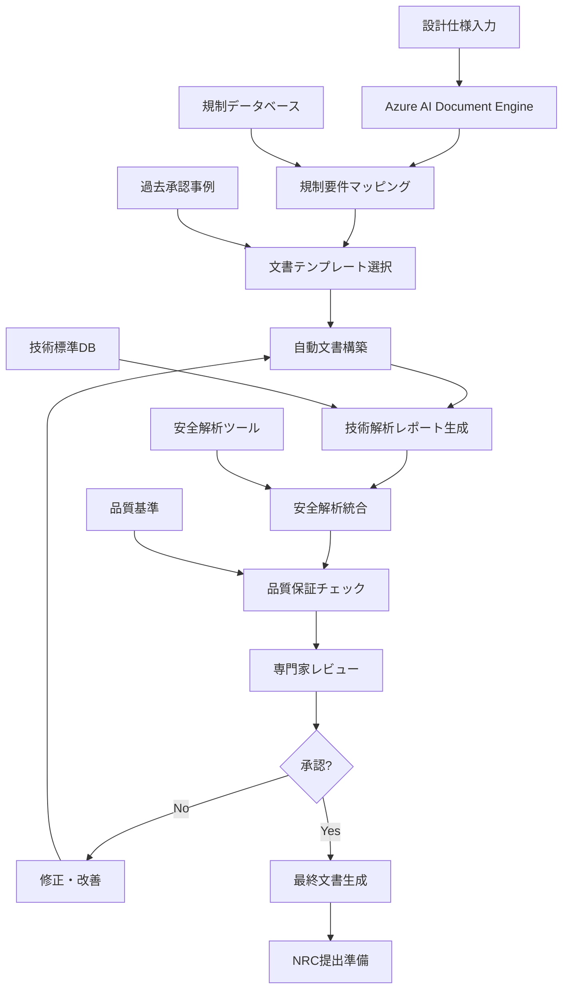

# 3.3.3 INL-Microsoft協業：認可プロセス6.7年→18ヶ月短縮の革命

## 原子力認可プロセスの構造的課題

### 現行システムの深刻な問題

米国の原子力認可プロセスは、世界で最も厳格かつ時間のかかるシステムの一つとして知られている[2]。この構造的課題が、原子力技術の商用化を著しく阻害している。

```
米国原子力認可プロセスの現状:
├── Design Certification (設計認証)
│   ├── 平均期間: 6-8年
│   ├── 申請書類: 12,000ページ以上
│   ├── 補足文書: 200万ページ以上
│   ├── 審査項目: 2,000項目以上
│   └── 総費用: 5-10億ドル
├── Construction & Operating License (建設・運転許可)
│   ├── 平均期間: 4-6年
│   ├── 申請書類: 8,000ページ以上
│   ├── 環境影響評価: 1,000ページ以上
│   ├── 公聴会: 50回以上
│   └── 総費用: 2-5億ドル
├── 人的リソース要求
│   ├── エンジニア: 100-200人年
│   ├── 法務専門家: 50-100人年
│   ├── 規制専門家: 30-50人年
│   ├── プロジェクト管理: 20-30人年
│   └── 外部コンサル: 200-500人年
└── 社会的コスト
    ├── 技術革新の遅延
    ├── 投資回収期間の延長
    ├── 国際競争力の低下
    └── エネルギー転換の阻害
```

### NuScale SMRの事例分析

**10年以上を要した認可プロセス**

NuScale PowerのSMR認可プロセスは、現行システムの問題を象徴的に示している：

```
NuScale SMR認可の軌跡:
├── 2008年: 初期設計開始
├── 2016年: NRC申請提出 (12,000ページ)
├── 2017-2019年: 第1次審査・質問回答
│   ├── NRC質問: 4,000件以上
│   ├── 回答文書: 150万ページ
│   ├── 技術会議: 200回以上
│   └── 設計変更: 500件以上
├── 2020年: 設計認証取得 (史上初のSMR)
├── 2021-2023年: 商用化準備
│   ├── 標準設計承認 (SDA)
│   ├── 環境影響評価
│   ├── サイト適用性評価
│   └── 運転許可準備
├── 2024年: UAMPS計画中止発表
│   ├── コスト上昇: 42億ドル → 92億ドル
│   ├── 期間延長: 2027年 → 2030年
│   ├── 投資家撤退
│   └── プロジェクト見直し
└── 教訓
    ├── 認可期間: 12年 (2008-2020)
    ├── 総費用: 10億ドル以上
    ├── 文書量: 300万ページ以上
    └── 最終的な商用化困難
```

## Microsoft Azure AIによる革命的解決策

### INL-Microsoft戦略的パートナーシップ

2025年7月に発表されたアイダホ国立研究所（INL）とMicrosoftの戦略的パートナーシップは、**原子力認可プロセスの根本的変革**を目指す画期的な取り組みである[2]。

```
INL-Microsoft協業の全体像:
├── 協業発表: 2025年7月15日
├── 投資規模: Microsoftから2億ドル (5年間)
├── 研究期間: 2025年-2030年 (第1フェーズ)
├── 参加人員:
│   ├── INL研究者: 150名
│   ├── Microsoft AI専門家: 80名
│   ├── 原子力規制専門家: 30名
│   ├── 法務・コンプライアンス: 20名
│   └── プロジェクト管理: 20名
├── 技術基盤:
│   ├── Microsoft Azure AI Platform
│   ├── GPT-4 Turbo + 原子力特化拡張
│   ├── Azure OpenAI Service
│   ├── Cognitive Services統合
│   └── Power Platform連携
├── 目標成果:
│   ├── 認可期間: 6.7年 → 18ヶ月
│   ├── 文書作成時間: 90%短縮
│   ├── コスト削減: 70%以上
│   ├── 精度向上: 95%以上
│   └── 人的負担: 80%削減
└── 実用化計画:
    ├── 2025年: プロトタイプ開発
    ├── 2026年: パイロット運用
    ├── 2027年: 実証プロジェクト
    ├── 2028年: 商用サービス開始
    └── 2030年: 全面展開
```

### AI統合文書構築システムの詳細

**アーキテクチャの革新性**



**具体的なAI機能**

```
Azure AI統合機能の詳細:
├── 自然言語理解・生成
│   ├── GPT-4 Turbo ベース原子力特化モデル
│   ├── 専門用語・概念の高精度理解
│   ├── 多言語対応 (英語・日本語・フランス語)
│   └── 文脈理解に基づく適切な文書生成
├── 文書構築自動化
│   ├── 設計仕様からの要件自動抽出
│   ├── 規制要件との自動マッピング
│   ├── 必要文書の自動特定・分類
│   └── 文書構造の自動設計・生成
├── 技術解析統合
│   ├── 工学計算の自動実行・検証
│   ├── 安全解析の自動生成・更新
│   ├── 設計変更の影響評価
│   └── 代替案の自動評価
├── 規制適合性確認
│   ├── 10 CFR Part 50/52要件の自動照合
│   ├── 規制ガイド (RG) との整合性確認
│   ├── 業界標準 (IEEE, ASME) の適用
│   └── 国際基準 (IAEA) との調和
├── 品質保証・検証
│   ├── 論理整合性の自動チェック
│   ├── 数値計算の自動検証
│   ├── 参照文献の自動管理・更新
│   └── 版管理・変更履歴の自動記録
└── 協働支援機能
    ├── 専門家間の情報共有プラットフォーム
    ├── リアルタイム協調編集機能
    ├── コメント・承認ワークフロー
    └── 進捗管理・スケジュール調整
```

### 人間中心設計（Human-in-the-Loop）の徹底

**AI判断の限界と人間監督の重要性**

INL-Microsoft協業の最も重要な特徴は、**厳格な人間中心設計原則** の維持である。

> **重要な設計原則**：
> - AIは文書の**構築のみ**を担当（分析・判断は行わない）
> - すべてのAI生成内容は**専門家による事後検証**が必須
> - 最終的な意思決定権限は**常に人間が保持**
> - 原子力安全に関わる判断は**絶対にAIに委ねない**

```
Human-in-the-Loop実装詳細:
├── AI責任範囲の明確化
│   ├── 実行する作業: 文書構築、データ収集、計算実行
│   ├── 実行しない作業: 安全判断、設計決定、承認判断
│   ├── 境界線の明確化: 各機能での責任分担明示
│   └── 例外処理: AI判断困難時の人間エスカレーション
├── 専門家検証プロセス
│   ├── 原子力エンジニア検証
│   │   ├── 技術的妥当性の確認
│   │   ├── 物理法則との整合性チェック
│   │   ├── 安全性評価の妥当性
│   │   └── 設計仕様との適合性
│   ├── 規制専門家検証
│   │   ├── 法令要求との整合性
│   │   ├── 規制ガイドとの適合性
│   │   ├── 過去承認事例との比較
│   │   └── 追加要求事項の特定
│   ├── 法務・コンプライアンス検証
│   │   ├── 法的責任の明確化
│   │   ├── 契約条件との整合性
│   │   ├── 知的財産権の確認
│   │   └── リスク評価・軽減策
│   └── 品質保証検証
│       ├── 文書品質の総合評価
│       ├── 一貫性・完全性の確認
│       ├── トレーサビリティの確保
│       └── 継続的改善の仕組み
├── 承認ワークフロー
│   ├── 段階的承認プロセス
│   │   ├── 技術承認 (Technical Approval)
│   │   ├── 規制承認 (Regulatory Approval)
│   │   ├── 法務承認 (Legal Approval)
│   │   └── 最終承認 (Final Approval)
│   ├── 承認権限の階層化
│   │   ├── 一般技術者: 部分的内容確認
│   │   ├── 上級技術者: 章レベル承認
│   │   ├── 部門長: 文書全体承認
│   │   └── 責任者: 最終提出承認
│   └── 異議申し立て機能
│       ├── 技術的異議の受付・調整
│       ├── 専門委員会での検討
│       ├── 外部専門家の意見聴取
│       └── 最終決定プロセス
└── 継続的改善メカニズム
    ├── フィードバック収集
    │   ├── 利用者満足度調査
    │   ├── 専門家からの改善提案
    │   ├── NRC審査官からの指摘
    │   └── 実用性評価・分析
    ├── システム改善
    │   ├── AI機能の継続的調整
    │   ├── プロセスの最適化
    │   ├── インターフェースの改良
    │   └── 新機能の追加・統合
    └── 品質向上
        ├── 文書品質の継続的向上
        ├── 処理速度の改善
        ├── 精度向上のための調整
        └── 利用者体験の向上
```

## デジタルツイン技術の応用：仮想現実での検証

### 原子力デジタルツインの革新性

INL-Microsoft協業では、認可文書の作成と並行して、**デジタルツイン技術による仮想検証**を統合している[2]。これにより、設計段階で実機に近い環境での性能確認が可能となる。

```
原子力デジタルツイン構成:
├── 物理モデル統合
│   ├── 中性子物理モデル
│   │   ├── 3次元中性子拡散解析
│   │   ├── Monte Carlo中性子輸送解析
│   │   ├── 燃焼解析・同位体追跡
│   │   └── 反応度制御シミュレーション
│   ├── 熱流動モデル
│   │   ├── CFD解析統合
│   │   ├── 二相流解析
│   │   ├── 熱伝達モデリング
│   │   └── 自然循環解析
│   ├── 構造力学モデル
│   │   ├── FEM応力解析
│   │   ├── 動的地震応答解析
│   │   ├── 疲労・クリープ解析
│   │   └── 材料劣化モデリング
│   └── システム統合モデル
│       ├── プラント全体の動的解析
│       ├── 制御系統の応答特性
│       ├── 安全系統の作動解析
│       └── 事故進展シミュレーション
├── リアルタイム処理基盤
│   ├── Azure High Performance Computing
│   │   ├── GPU加速計算 (NVIDIA A100)
│   │   ├── 分散並列処理基盤
│   │   ├── ストリーミング計算
│   │   └── 低遅延データ処理
│   ├── エッジコンピューティング統合
│   │   ├── IoTセンサーデータ統合
│   │   ├── リアルタイムデータ同化
│   │   ├── 予測計算の高速化
│   │   └── 異常検知・早期警告
│   └── 時系列データベース
│       ├── 高速時系列データ格納
│       ├── 履歴データの効率的管理
│       ├── 統計分析・機械学習統合
│       └── 長期トレンド分析
├── 可視化・インターフェース
│   ├── 3D可視化エンジン
│   │   ├── リアルタイム3Dレンダリング
│   │   ├── VR/AR対応インターフェース
│   │   ├── インタラクティブ操作
│   │   └── マルチユーザー協調作業
│   ├── ダッシュボード・監視画面
│   │   ├── カスタマイズ可能表示
│   │   ├── アラート・通知機能
│   │   ├── トレンド表示・分析
│   │   └── 報告書自動生成
│   └── モバイル対応
│       ├── タブレット・スマートフォン対応
│       ├── 現場作業支援機能
│       ├── オフライン動作対応
│       └── GPS・カメラ統合
└── 検証・妥当性確認
    ├── ベンチマーク検証
    │   ├── 国際ベンチマーク問題での検証
    │   ├── 実験データとの比較検証
    │   ├── 他解析コードとの比較
    │   └── 不確実性・感度解析
    ├── V&V (Verification & Validation)
    │   ├── 数値解法の検証
    │   ├── 物理モデルの妥当性確認
    │   ├── 実機データとの比較
    │   └── 予測精度の評価
    └── 規制承認対応
        ├── NRC承認基準への適合
        ├── 品質保証要求への対応
        ├── 監査証跡の完全記録
        └── 独立検証・確認 (IV&V)
```

### 仮想検証による認可プロセス革新

**従来の物理試験 vs デジタルツイン検証**

```
検証プロセスの革新:
├── 従来アプローチ
│   ├── 物理試験の実施
│   │   ├── 試験装置の設計・製作: 6-12ヶ月
│   │   ├── 試験実施・データ取得: 3-6ヶ月  
│   │   ├── データ解析・報告書作成: 2-4ヶ月
│   │   └── 総期間: 11-22ヶ月
│   ├── コスト・リソース
│   │   ├── 試験設備費: 500万-2,000万ドル
│   │   ├── 運営費: 年間100万-500万ドル
│   │   ├── 人員: 10-20名の専門技術者
│   │   └── 総コスト: 2,000万-5,000万ドル
│   └── 制約・限界
│       ├── 試験条件の制約
│       ├── 安全上の制限
│       ├── スケール効果の問題
│       └── パラメータ変更の困難性
├── デジタルツイン検証
│   ├── 仮想試験の実施
│   │   ├── モデル構築・調整: 1-2ヶ月
│   │   ├── 仮想試験実行・解析: 2週間-1ヶ月
│   │   ├── 結果分析・検証: 2週間-1ヶ月
│   │   └── 総期間: 2-4ヶ月
│   ├── コスト・リソース
│   │   ├── ソフトウェア・計算資源: 100万-500万ドル
│   │   ├── 運営費: 年間50万-200万ドル
│   │   ├── 人員: 5-10名の専門技術者
│   │   └── 総コスト: 500万-1,500万ドル
│   └── 優位性・利点
│       ├── 無制限の試験条件設定
│       ├── 極限条件での安全な試験
│       ├── 実機スケールでの検証
│       └── 即座のパラメータ変更・最適化
└── 統合アプローチ
    ├── 基本検証: デジタルツイン
    ├── 重要項目: 物理試験で確認
    ├── 継続的検証: デジタルツインで監視
    └── 最適化: 両手法の組み合わせ
```