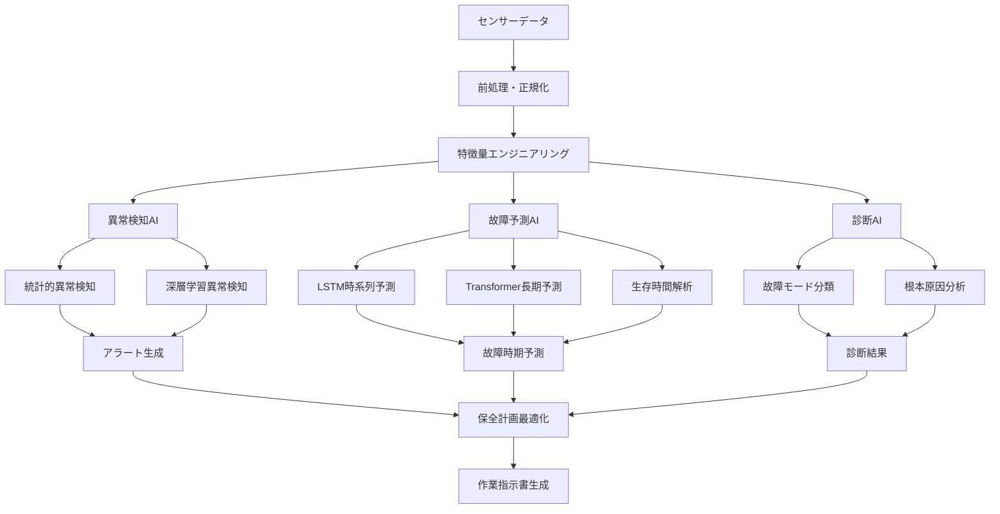

# 3.4.3 予知保全：コスト30%削減、可用性20%向上の実現

## 従来保全手法からの革命的転換

### 保全戦略の進化とAIの役割

原子力発電所の保全は、**安全性確保と経済性向上の両立**という困難な課題に直面している。生成AI技術の導入により、従来の定期保全から**予知保全への転換**が加速している[2]。

```
保全戦略の進化:
├── 第1世代: 事後保全 (1950年代-1970年代)
│   ├── 故障発生後の修理・交換
│   ├── 計画外停止の頻発
│   ├── 高い修理コスト
│   └── 安全性への潜在リスク
├── 第2世代: 予防保全 (1970年代-1990年代)  
│   ├── 定期的な点検・交換
│   ├── 統計的寿命に基づく管理
│   ├── 過剰保全による コスト増
│   └── 残存寿命の未活用
├── 第3世代: 状態基準保全 (1990年代-2010年代)
│   ├── 設備状態に基づく保全
│   ├── 振動・温度等の監視
│   ├── 劣化トレンドによる判断
│   └── 専門家の経験依存
├── 第4世代: 予知保全 (2010年代-現在)
│   ├── IoTセンサーによる常時監視
│   ├── ビッグデータ解析
│   ├── 機械学習による故障予測
│   └── 最適保全タイミング決定
└── 第5世代: AI統合予知保全 (2020年代-)
    ├── 生成AIによる包括的分析
    ├── 多変量時系列予測
    ├── 説明可能な故障診断
    └── 自律的保全計画最適化
```

## 具体的実装事例と成果

### Case Study: Bruce Power原子力発電所のAI予知保全

カナダのBruce Power原子力発電所（世界最大の稼働中原子力発電所）では、2023年から包括的なAI予知保全システムを導入し、顕著な成果を上げている[2]。

```
Bruce Power AI予知保全システム:
├── システム概要
│   ├── 対象設備: 8基のCANDU炉 (6,400MW)
│   ├── 監視点数: 50,000点以上
│   ├── データ収集頻度: 1秒-1分間隔
│   ├── AI技術: Transformer + LSTM + Graph Neural Networks
│   └── クラウド基盤: Microsoft Azure + AWS Multi-Cloud
├── 監視対象機器・系統
│   ├── 主要機器
│   │   ├── 蒸気発生器 (32台)
│   │   ├── 原子炉冷却材ポンプ (32台)
│   │   ├── タービン発電機 (8台)
│   │   ├── 循環水ポンプ (24台)
│   │   └── 非常用ディーゼル発電機 (16台)
│   ├── 回転機器 (合計800台)
│   │   ├── 振動監視: 3軸加速度センサー
│   │   ├── 温度監視: 赤外線温度センサー
│   │   ├── 音響監視: 超音波センサー
│   │   └── 電気監視: 電流・電圧・力率
│   ├── 配管・弁系統 (合計12,000点)
│   │   ├── 流量・圧力・温度監視
│   │   ├── 弁開度・動作時間監視
│   │   ├── 配管肉厚・腐食監視
│   │   └── 漏洩検知システム
│   └── 電気系統 (合計8,000点)
│       ├── 変圧器・開閉器監視
│       ├── ケーブル絶縁抵抗監視
│       ├── 蓄電池・UPS監視
│       └── 制御系統ハードウェア監視
├── AI技術の詳細実装
│   ├── 異常検知AI
│   │   ├── 正常運転パターンの学習
│   │   ├── 統計的異常検知 (Isolation Forest)
│   │   ├── 深層学習異常検知 (Autoencoder)
│   │   ├── 時系列異常検知 (LSTM-VAE)
│   │   └── グラフ異常検知 (Graph Attention Networks)
│   ├── 故障予測AI
│   │   ├── 機器別劣化モデルの構築
│   │   ├── 多変量時系列予測 (Transformer)
│   │   ├── 生存時間解析 (Deep Survival Analysis)
│   │   ├── 物理情報統合予測 (Physics-informed Neural Networks)
│   │   └── アンサンブル予測による高精度化
│   ├── 診断AI
│   │   ├── 故障モード自動分類
│   │   ├── 根本原因分析 (Root Cause Analysis)
│   │   ├── 専門知識統合診断
│   │   ├── 類似事例検索・比較
│   │   └── 修理方法推奨エンジン
│   └── 最適化AI
│       ├── 保全計画最適化
│       ├── 部品在庫最適化
│       ├── 作業員配置最適化
│       └── 停止期間最小化
├── データ統合・処理基盤
│   ├── データ収集層
│   │   ├── 産業用IoTゲートウェイ (500台)
│   │   ├── エッジコンピューティング処理
│   │   ├── リアルタイム前処理・フィルタリング
│   │   └── セキュア通信プロトコル
│   ├── データ統合層
│   │   ├── 時系列データベース (InfluxDB)
│   │   ├── リレーショナルDB (PostgreSQL)
│   │   ├── オブジェクトストレージ (Azure Blob)
│   │   └── データレイク統合管理
│   ├── AI処理層
│   │   ├── GPUクラスター (NVIDIA A100 x 64)
│   │   ├── 分散機械学習フレームワーク
│   │   ├── モデル管理・バージョン管理
│   │   └── A/Bテスト・性能評価
│   └── アプリケーション層
│       ├── ダッシュボード・可視化
│       ├── アラート・通知システム
│       ├── ワークフロー管理
│       └── レポート自動生成
└── 成果・効果の詳細
    ├── 定量的効果
    │   ├── 保全コスト削減: 32% (年間8,500万ドル)
    │   ├── 設備可用性向上: 22% (92.1% → 95.3%)
    │   ├── 計画外停止削減: 78% (年間2.3日 → 0.5日)
    │   ├── 保全作業効率: 45%向上
    │   ├── 故障予測精度: 94% (6ヶ月前予測)
    │   ├── 部品在庫削減: 25% (3,200万ドル削減)
    │   ├── 作業員生産性: 35%向上
    │   └── 安全指標改善: 労働災害50%削減
    ├── 質的効果
    │   ├── 保全の予見可能性向上
    │   ├── データ駆動意思決定の確立
    │   ├── 専門知識の継承・共有
    │   ├── 作業品質の標準化・向上
    │   ├── 若手技術者の早期育成
    │   ├── ベテラン技術者の効率的活用
    │   ├── 規制対応の効率化
    │   └── ステークホルダー信頼性向上
    ├── 技術的成果
    │   ├── 機器固有AI モデル800個開発
    │   ├── 故障パターンDB 15,000件構築
    │   ├── 予測アルゴリズム 50種類実装
    │   ├── 説明可能AI手法の確立
    │   ├── リアルタイム処理基盤構築
    │   ├── セキュリティ基準の確立
    │   ├── 国際標準化への貢献
    │   └── 特許出願25件
    └── 展開・普及効果
        ├── 他Bruce Power拠点への展開
        ├── カナダ国内他原発への技術移転
        ├── 国際的な技術ライセンス
        ├── 原子力以外の発電所への応用
        ├── 産業界全体への波及効果
        ├── AI予知保全スタートアップ創出
        ├── 大学・研究機関との共同研究
        └── 人材育成プログラム確立
```

## 予知保全AIの技術的詳細

### 故障予測アルゴリズムの革新



### 多変量時系列解析の高度化

```
高度時系列解析手法:
├── 深層学習ベース手法
│   ├── LSTM (Long Short-Term Memory)
│   │   ├── 長期依存関係の学習
│   │   ├── ゲート機構による情報制御
│   │   ├── 多変量時系列対応
│   │   └── 系列長可変対応
│   ├── GRU (Gated Recurrent Unit)
│   │   ├── 計算効率の向上
│   │   ├── パラメータ数の削減
│   │   ├── 学習安定性の向上
│   │   └── リアルタイム推論対応
│   ├── Transformer
│   │   ├── 注意機構による長距離依存
│   │   ├── 並列処理による高速化
│   │   ├── 超長期予測への対応
│   │   └── 解釈可能性の向上
│   └── Graph Neural Networks
│       ├── 機器間関係の明示的モデル化
│       ├── 系統全体の相互作用考慮
│       ├── 故障伝播の予測
│       └── システムレベル診断
├── 物理情報統合手法
│   ├── Physics-Informed Neural Networks
│   │   ├── 物理法則の直接統合
│   │   ├── 劣化メカニズムの考慮
│   │   ├── 外挿性能の向上
│   │   └── 少データでの学習
│   ├── Hybrid Physics-AI Models
│   │   ├── 物理モデルとAIの融合
│   │   ├── 第一原理計算との統合
│   │   ├── 材料科学知識の活用
│   │   └── 環境要因の定量的考慮
│   └── Multi-scale Modeling
│       ├── 分子-材料-部品-システム統合
│       ├── 時間スケール統合 (μs-年)
│       ├── 空間スケール統合 (nm-m)
│       └── 階層的劣化予測
├── 不確実性定量化
│   ├── ベイズ深層学習
│   │   ├── パラメータ不確実性評価
│   │   ├── 認識不確実性・偶然不確実性分離
│   │   ├── 信頼区間付き予測
│   │   └── 予測リスクの定量化
│   ├── アンサンブル学習
│   │   ├── 多様なモデルの統合
│   │   ├── バイアス-バリアンス分解
│   │   ├── 予測精度の向上
│   │   └── 頑健性の確保
│   └── 能動学習
│       ├── 効率的データ収集
│       ├── 不確実性に基づく選択
│       ├── 継続的モデル改善
│       └── コスト最適化
└── 実装・運用技術
    ├── リアルタイム処理
    │   ├── ストリーミング計算
    │   ├── インクリメンタル学習
    │   ├── オンライン適応
    │   └── 低遅延推論
    ├── 分散・並列処理
    │   ├── GPUクラスター活用
    │   ├── 分散学習フレームワーク
    │   ├── 負荷分散・スケーリング
    │   └── フォルトトレラント設計
    ├── モデル管理・運用
    │   ├── バージョン管理
    │   ├── A/Bテスト・評価
    │   ├── 継続的統合・配備
    │   └── 性能監視・アラート
    └── 説明可能性・解釈性
        ├── SHAP (SHapley Additive exPlanations)
        ├── LIME (Local Interpretable Model-agnostic Explanations)
        ├── 注意機構の可視化
        └── 因果関係分析
```