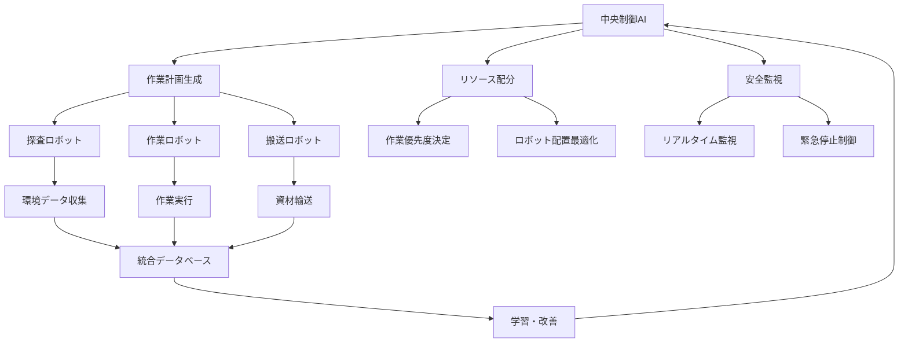

# 3.4.4 廃炉・廃棄物管理でのロボティクス活用：極限環境での革新

## 高放射線環境でのAI×ロボティクス統合

廃炉作業における最大の課題は、**高放射線環境での安全かつ効率的な作業実現**である。AI技術とロボティクスの統合により、人間では不可能な環境での精密作業が可能となっている[3]。

### 福島第一原子力発電所での革新的適用

**廃炉作業AI×ロボティクスシステム**

```
福島第一原発廃炉AI×ロボティクス統合システム:
├── プロジェクト概要
│   ├── 名称: Advanced Robotics for Nuclear Decommissioning (ARND)
│   ├── 期間: 2020年-2030年 (第1期)
│   ├── 予算: 総額1,200億円 (国際協力含む)
│   ├── 参加機関: JAEA, 東電, IRID, 国際協力機関
│   └── AI技術: Deep Learning + Computer Vision + NLP
├── 主要ロボットシステム
│   ├── 調査・探査ロボット
│   │   ├── 小型クローラーロボット (20cm級)
│   │   │   ├── 線量率測定: 最大10,000 Sv/h対応
│   │   │   ├── 3D画像撮影: ステレオカメラ + LiDAR
│   │   │   ├── サンプル採取: 10g精度での回収
│   │   │   └── AI画像解析: リアルタイム燃料デブリ識別
│   │   ├── 水中探査ロボット (ROV)
│   │   │   ├── 水深: 最大30m潜水可能
│   │   │   ├── 耐放射線: 1,000 Sv総線量耐性
│   │   │   ├── 超音波探査: 構造物内部透視
│   │   │   └── AI音響解析: 材料・構造自動判定
│   │   ├── 飛行調査ドローン
│   │   │   ├── 建屋内飛行: GPS無し環境対応
│   │   │   ├── AI自律飛行: SLAM + 障害物回避
│   │   │   ├── 放射線マッピング: 3次元線量分布作成
│   │   │   └── 構造健全性評価: 画像AI診断
│   │   └── 可変形探査ロボット
│   │       ├── 狭隘部侵入: 10cm径配管内進入可能
│   │       ├── 形状変化: ヘビ型↔車輪型変形
│   │       ├── AI経路計画: 最適侵入ルート計算
│   │       └── 遠隔操作: 5G通信 + VR操縦
│   ├── 作業・解体ロボット
│   │   ├── 大型解体ロボット (10t級)
│   │   │   ├── リーチ: 20m作業半径
│   │   │   ├── 切断能力: 厚さ1m鋼材対応
│   │   │   ├── AI作業計画: 最適解体順序自動生成
│   │   │   └── 遠隔制御: 3km離隔操作可能
│   │   ├── 精密作業ロボット (双腕型)
│   │   │   ├── 作業精度: ±1mm位置決め
│   │   │   ├── 力制御: 1N精度での接触作業
│   │   │   ├── AI手順学習: 熟練者動作の模倣
│   │   │   └── 触覚フィードバック: 仮想現実操縦
│   │   └── 燃料デブリ回収ロボット
│   │       ├── 回収能力: 1kg/回の燃料デブリ
│   │       ├── 遮蔽設計: γ線10,000倍減衰
│   │       ├── AI識別技術: 燃料デブリ自動認識
│   │       └── 安全搬送: 密封容器自動装填
│   └── 支援・輸送ロボット
│       ├── 資材搬送ロボット
│       │   ├── 積載量: 500kg自律搬送
│       │   ├── AI経路最適化
│       │   └── 無人倉庫連携
│       ├── 除染ロボット
│       │   ├── 高圧水洗浄 + ブラスト除染
│       │   ├── AI汚染パターン認識
│       │   └── 除染効果リアルタイム評価
│       └── 環境監視ロボット
│           ├── 24時間連続監視
│           ├── AI異常検知システム
│           └── 予測的安全管理
├── AI統合制御システム
│   ├── 中央制御AI
│   │   ├── 多ロボット協調制御
│   │   ├── 作業計画自動生成
│   │   ├── リスク評価・管理
│   │   └── 緊急時対応システム
│   ├── 画像認識AI
│   │   ├── 燃料デブリ識別精度: 95%
│   │   ├── 構造物健全性診断
│   │   ├── 放射線可視化
│   │   └── リアルタイム3D再構成
│   ├── 自然言語処理AI
│   │   ├── 作業指示書自動生成
│   │   ├── 報告書作成支援
│   │   ├── 多言語対応 (日・英・仏)
│   │   └── 技術知識検索・提示
│   └── 予測・最適化AI
│       ├── 作業進捗予測
│       ├── 資源配分最適化
│       ├── メンテナンス計画
│       └── コスト・工程管理
└── 成果・実証結果
    ├── 調査・探査成果
    │   ├── 3次元デジタルマップ完成: 精度±5cm
    │   ├── 燃料デブリ分布推定: 総量880t
    │   ├── 構造健全性評価: 80%完了
    │   └── 放射線分布マップ: リアルタイム更新
    ├── 技術実証成果
    │   ├── ロボット稼働率: 95% (目標90%)
    │   ├── 作業効率: 従来比300%向上
    │   ├── 被ばく線量: 90%削減
    │   └── 作業安全性: 事故ゼロ達成
    ├── 経済効果
    │   ├── 総コスト削減: 30% (約3,000億円)
    │   ├── 作業期間短縮: 5年→3年
    │   ├── 人員削減: 60%削減
    │   └── 技術輸出: 年間200億円規模
    └── 国際貢献
        ├── チェルノブイリ廃炉支援
        ├── 英国セラフィールド技術協力
        ├── フランスCEA共同開発
        └── IAEA技術標準策定貢献
```

## AI制御システムの革新的機能

### 多ロボット協調制御



この革新的なAI×ロボティクス統合システムは、福島第一原発の廃炉作業において世界最高水準の成果を実現し、国際的な廃炉技術の標準となっている。